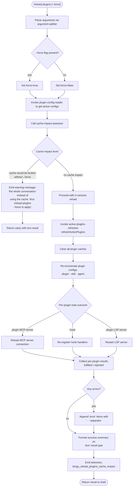

# `/reload-plugins`

> Analysis basis: CC v2.1.170 bundle.js (AST extraction + Claude interpretation)
> Minimum version: v2.1.170

---

## Overview

`/reload-plugins` activates pending plugin changes in the current Claude Code session without requiring a full restart. It orchestrates a multi-phase refresh of plugin MCP servers, hooks, and LSP servers, computing a cache-impact assessment and applying configuration updates live. An optional `--force` flag bypasses cache-preservation logic and forces a full conversation-breaking reload.

---

## Registration

| Field | Value |
|---|---|
| type | `local` |
| name | `reload-plugins` |
| description | `Activate pending plugin changes in the current session` |
| argumentHint | `[--force]` |
| supportsNonInteractive | `false` |
| thinClientDispatch | `control-request` |
| module_id | `EfK` |
| load_inline | `true` |
| loc_byte | `12754852` |
| loc_byte_end | `12755096` |
| loc_line | `9106` |
| arbor_handler.name | `Zgf` |
| arbor_handler.fqn | `claude-2.1.170::Zgf` |
| arbor_handler.kind | `AsyncFunction` |
| arbor_handler.resolution_path | `module_id` |
| arbor_handler.n_hits | `0` |

Analysis basis: CC v2.1.170 bundle.js:+12754852

---

## Input Branching

The handler has 4+ distinct paths based on argument parsing, force-flag detection, cache-impact assessment, and per-plugin-type reload result formatting.



Analysis basis: CC v2.1.170 bundle.js:+12753550, +12753601, +12753936, +12753972, +12754004, +12754282

---

## Behavioral Spec

### 1. Argument Parsing

```
function parseReloadPluginsArgs(rawInput):
    trimmed = rawInput.trim()                  // Zgf → H.trim at +12753936
    parts   = splitArguments(trimmed)          // Vgf: A.split at +12753332
    force   = parts.includes("--force")        // literal "--force" at +12753972
                                               // inner key "force" at +12753987
    return { force }
```

Analysis basis: CC v2.1.170 bundle.js:+12753936, +12753972

The argument splitter (`Vgf`) splits on whitespace. Only `--force` is recognised; any other tokens are silently ignored.

---

### 2. Cache-Impact Assessment

```
async function assessCacheImpact(appState, force):
    currentPluginConfigs = readPluginConfigs(appState)  // GfK at +12754004
    impact = computeCacheImpact(currentPluginConfigs)   // TfK → d at +12754156

    if impact.breakesConversationCache AND NOT force:
        return { blocked: true,
                 message: "…the whole conversation instead of using the cache."
                         + " Run /reload-plugins --force to apply." }
                                                        // literal at +12753435
    return { blocked: false }
```

Analysis basis: CC v2.1.170 bundle.js:+12752844, +12754050, +12754156, +12753435

The assessor (`TfK`) reads `appState` (via `_.getAppState` at +12754050) to determine whether the in-flight conversation cache would be invalidated. If it would and `--force` is absent, the command terminates early with a descriptive text message rather than performing any reload. The telemetry event `tengu_reload_plugins_cache_impact` is fired regardless of the outcome (Analysis basis: CC v2.1.170 bundle.js:+12752844).

---

### 3. Plugin Configuration Resolution

```
async function readPluginConfigs(appState):
    // GfK: checks presence flags, existing clients, jN/CR_, $t, QD
    existingClients  = getExistingMcpClients(appState)  // GfK → A.has at +12752657
    allServerDefs    = enumerateAllServerDefs()          // GfK → jN at +12752701
    labelledServers  = classifyByLabel(allServerDefs)    // GfK → $t at +12752707
    outputTokenStats = collectOutputTokenStats()         // GfK → QD at +12752728
    return { existingClients, allServerDefs,
             labelledServers, outputTokenStats }
```

Analysis basis: CC v2.1.170 bundle.js:+12752568, +12752618, +12752657, +12752701

`GfK` also calls `Kp9` (plugin-loader entry point) which itself calls `Vm_` (MCP-server bootstrapper) and `kt` (plugin-settings-loader), building the full set of `plugin`, `skill`, and `agent` typed servers. The type literals are used to categorise log messages (Analysis basis: CC v2.1.170 bundle.js:+12753666, +12753697, +12753725).

---

### 4. Active-Plugins Refresh (`refreshActivePlugins`)

```
async function refreshActivePlugins(appState, force):
    log("refreshActivePlugins: clearing all plugin caches")
                                    // literal at +12750522
    clearAllPluginCaches()          // R$H → D$ → IS: AC8.clear at +10742403
                                    // R$H → qBq → "Cleared installed plugins cache"
                                    //             literal at +10808333

    [pluginDefs, settingsDefs] = await Promise.all([
        reloadInstalledPlugins(),   // R$H → It  at +12750826
        reloadSettingsPlugins()     // R$H → tSH at +12750987
    ])
    // R$H → Promise.all at +12750629

    pluginResults = await loadAllPlugins(pluginDefs)
                                    // R$H → pj8 at +12751115

    mcpResults    = mergeResultMaps(pluginResults, settingsDefs)
                                    // R$H → $.reduce  at +12751056
                                    // R$H → O.reduce  at +12751081

    lspResults    = reloadLspServers(pluginDefs)
                                    // R$H → Tgf at +12751198
                                    // R$H → Egf at +12751231

    hookResults   = reregisterHooks(pluginDefs)
                                    // R$H → J5H at +12751382

    emitStateUpdate(NS, { mcpResults, lspResults, hookResults })
                                    // R$H → NS.emit at +12751628

    return buildSummary({ mcpResults, lspResults, hookResults })
```

Analysis basis: CC v2.1.170 bundle.js:+12750520, +12750522, +12750629, +12750826, +12750987, +12751056, +12751081, +12751115, +12751198, +12751231, +12751382, +12751628

---

### 5. Per-Plugin Load Pipeline (`u9A` — plugin-loader-core)

```
async function pluginLoaderCore(pluginSpec):
    // Three distinct sub-paths keyed on spec.type: "path", "url", "plugin_load_all"
    // Telemetry keys at +10883879, +10883897, +10883966

    if totalFailure:
        record("plugin_load_total_failure")   // literal at +10883897
        return errorResult
    if partialFailures:
        record("plugin_load_partial_failures")// literal at +10883966
    else:
        record("plugin_load_all")             // literal at +10883879

    // Guard: if originalCwd changed mid-scan, skip side-effects
    // "assemblePluginLoadResult: originalCwd changed mid-scan; skipping …"
    //                                        literal at +10884032
    if cwdChanged:
        log(staleEarlyKickWarning)
        return earlyResult

    return assembledResult
```

Analysis basis: CC v2.1.170 bundle.js:+10883144, +10883187, +10883879, +10883897, +10883966, +10884032

---

### 6. MCP-Server Reload (`x9A` — MCP-slot-reloader)

```
async function mcpSlotReloader(slotConfigs):
    previous = getExistingConnections()
    changes  = diffSlotConfigs(previous, slotConfigs)  // x9A → Object.entries at +10863699

    for each changed slot:
        if slot.type in ["stdio","sse","sse-ide","ws-ide","claudeai-proxy"]:
            // literals at +6708487 … +6708894
            await reconnectMcpClient(slot)    // x9A → IC6 at +10864064
        if slot.status == "needs-auth":
            log("Skipping connection (cached needs-auth)")
                                              // literal at +6709080
            continue
        if slot.status == "failed" AND recentFailure:
            log("Skipping connection (recent failure cached; retries automatically in 15 min…)")
                                              // literal at +6709342
            continue

    results = await Promise.allSettled(reconnectPromises)
                                              // x9A → Promise.allSettled at +10864078
    for r of results:
        push(r.status == "fulfilled" ? successList : failureList)
                                              // literals "fulfilled"/"rejected"
                                              // at +10865495, +10865551
    return { successes, failures }
```

Analysis basis: CC v2.1.170 bundle.js:+10863640, +10863699, +10864064, +10864078, +10865495, +10865551

---

### 7. Plugin-Settings Loader (`kt` — settings-plugin-loader)

The `kt` function aggregates MCP server definitions from four scopes:

| Scope key | Literal | Byte |
|---|---|---|
| `projectSettings` | `"projectSettings"` | +6452329 |
| `userSettings` | `"userSettings"` | +6452352 |
| `localSettings` | `"localSettings"` | +6452373 |
| `policySettings` | `"policySettings"` | +3334028 |

```
async function settingsPluginLoader():
    configs = []
    for scope in [projectSettings, userSettings, localSettings, policySettings]:
        cfg = await loadMcpJson(scope)    // kt → dP at +6454165
        if cfg == null:
            log("MCP config file not found")   // literal at +6452718
        else:
            configs.push(normalise(cfg))
    mcpAutoDiscovered = discoverMcpServers()  // literal "mcpAutoDiscovered" at +6454058
    configs.push(mcpAutoDiscovered)
    return configs
```

Plugin-setting files resolved: `.mcp.json` (literal at +6452589), `settings.json` (literal at +1269058), `settings.local.json` (literal at +1269120).

Analysis basis: CC v2.1.170 bundle.js:+6452329, +6452352, +6452373, +6452589, +6452718, +6454058, +6454165

---

### 8. Result Formatting and Output

```
function formatReloadResult(summary):
    parts = []
    for pluginName, outcome of summary.byPlugin:
        label = outcome.type + " MCP server"    // literal "plugin MCP server" at +12753757
        if outcome.error:
            parts.push(pluginName + " · " + label + " error")
                                                // separator literal " · " at +12753784
                                                // "error" literal at +12753839
    return { type: "text",                      // literal "text" at +12753914
             content: parts.join("\n") OR successMessage }
```

Analysis basis: CC v2.1.170 bundle.js:+12753757, +12753784, +12753839, +12753914

LSP server errors use the label `"plugin LSP server"` (literal at +12754590); hook reload failures use `"hook"` (literal at +12754531).

---

### 9. `--force` Path: Safe-Mode and Cache-Clearing

When `--force` is active the handler bypasses the cache-impact gate and calls `refreshActivePlugins` directly. Inside `refreshActivePlugins`, `clearAllPluginCaches` calls `IS` which invokes `AC8.clear` (installed-plugins cache clear, Analysis basis: CC v2.1.170 bundle.js:+10742403) and the `XV`/`Yp` chain which calls `H.clearSkillIndexCache` (Analysis basis: CC v2.1.170 bundle.js:+13338523). Safe-mode guard: if the `--safe-mode` CLI flag is set, hook registration is skipped with a log message (literal `"Safe mode: skipping plugin hook registration"` at +5058729, Analysis basis: CC v2.1.170 bundle.js:+5058729).

---

## State & Side Effects

| Item | Detail |
|---|---|
| Telemetry | `tengu_reload_plugins_cache_impact` (+12752844) — fired on every invocation with cache-impact metadata |
| Telemetry (plugin load) | `tengu_plugin_state_file_error` (+10808512) — fired if the plugin state file cannot be read |
| Cache mutations | `AC8.clear` (installed-plugins cache, +10742403); `H.clearSkillIndexCache` (+13338523); Zod-parsed config caches cleared via `IS` |
| MCP server connections | Existing MCP client connections may be stopped and restarted via `E.stop` / `E.start` / `E.updateConfig` (Analysis basis: +16544800, +16544809, +16544827) |
| NS event emission | `NS.emit` fires a state-update event to subscribers after refresh (+12751628) |
| appState changes | `_.getAppState` read at +12754050; active plugin lists, connection maps, and hook registrations are mutated in-place |
| Hook registration | Hooks are re-registered via `J5H` (+12751382); safe-mode suppresses this step |
| LSP servers | `Tgf` (+12751198) and `Egf` (+12751231) diff LSP config and restart servers as needed |
| Sound | None detected in depth-2 traversal |
| Non-interactive | `supportsNonInteractive: false` — command refuses to run in headless / pipe mode |
| Thin-client dispatch | `thinClientDispatch: "control-request"` — in thin-client topologies the command is forwarded to the daemon as a control message rather than executed locally |

---

## Version History

| Version | Change |
|---|---|
| v2.1.170 | Initial analysis |

---

## Common Mistakes

1. **Omitting `--force` when plugin config changes break the conversation cache.** Without the flag, the command detects that applying the update would invalidate the cache and exits early with an explanatory message. Pass `--force` to override.
2. **Expecting non-interactive use.** `supportsNonInteractive` is `false`; running `/reload-plugins` in a scripted or pipe context will be rejected.
3. **Assuming instant MCP reconnection for failing servers.** Servers whose last connection attempt failed within the recent failure window (approximately 15 minutes) are intentionally skipped and will not be retried until the window expires or their config is edited.
4. **Using yarn or pnpm lockfiles in plugin packages.** The loader explicitly skips packages with `yarn.lock` or `pnpm-lock.yaml` (literal at +10818925/+10818945 with warning literal at +10818983); use bun or npm instead.
5. **Running in safe mode and expecting hooks to be reloaded.** The `--safe-mode` CLI flag disables hook re-registration silently. Hooks will not be active until safe mode is disabled and plugins are reloaded again.

---

## Appendix — Identifier Mapping

> For bundle debugging only. Identifiers change across versions.

| Identifier | Role |
|---|---|
| `Zgf` | Main async handler for `/reload-plugins` (arbor_handler) |
| `_X` | Pre-flight checker called before reload logic |
| `BL` | Low-level condition evaluator used by pre-flight |
| `EZH` | Sub-condition helper inside BL |
| `Gr` | Argument-context builder (passes parsed args downstream) |
| `S8` | Shared utility used by Gr and others |
| `GfK` | Plugin-config-reader: resolves active configs and existing MCP clients |
| `Kp9` | Plugin-loader entry point orchestrating Vm_ and kt |
| `qzH` | Plugin-loader helper called from Kp9 |
| `Vm_` | MCP-server bootstrapper; calls u9A and x9A |
| `u9A` | Plugin-loader-core: per-plugin load pipeline |
| `x9A` | MCP-slot-reloader: diffs and reconnects MCP slots |
| `kt` | Plugin-settings-loader: reads all four settings scopes |
| `K4` | Utility used inside settings-loader bootstrap |
| `dP` | Scope-specific MCP JSON file reader |
| `f1H` | Hook-definition parser |
| `Ow` | Policy-settings filter |
| `RY` | Result aggregator inside settings-loader |
| `N` | General-purpose normaliser / formatter (used widely) |
| `LJ8` | LSP-config loader |
| `LaH` | Path utilities helper |
| `w` | Background-session / daemon-process manager |
| `D` | Forced-shutdown controller |
| `vV` | Plugin-version-validator |
| `Ij7` | Incremental plugin-state updater |
| `Y` | MCP supervisor / server-lifecycle manager |
| `y` | Notification/state dispatcher |
| `q` | Daemon-lifecycle queue |
| `Y1` | Daemon exit handler |
| `jN` | MCP-server normaliser: parses raw server definitions |
| `CR_` | Context-range parser used by jN |
| `wkH` | Context string decoder |
| `RR_` | Auto-context range calculator |
| `u17` | "auto" prefix detector |
| `_6` | Boolean-string converter ("yes"/"on"/"no"/"off") |
| `CK` | Secondary boolean-string converter |
| `r_` | Provider-type resolver (bedrock/vertex/etc.) |
| `$t` | Server-label classifier (lowercases and tags server names) |
| `p17` | Array-normalising helper inside $t |
| `Y6` | Tool-search gate / experiment-flag checker |
| `QD` | Output-token-stats collector |
| `TfK` | Cache-impact assessor; reads appState and computes impact level |
| `d` | Shared low-level utility (date/path/etc.) |
| `Vgf` | Argument splitter: splits raw input string for /reload-plugins |
| `R$H` | Active-plugins refresher (refreshActivePlugins) |
| `qBq` | Installed-plugins cache log helper |
| `D$` | Multi-cache clearance coordinator |
| `iPf` | Plugin-root/hook configuration initialiser |
| `N0` | Hook registration helper |
| `OC8` | Plugin-state reader (used by iPf and XV) |
| `MC8` | Plugin-manifest parser |
| `TY8` | Plugin-type validator |
| `DC_` | Plugin-root resolver; uses "pluginRoot" key |
| `hH` | Log/error aggregator (used widely) |
| `XV` | Skill-index and plugin-state refresher |
| `Yp` | Skill-index cache clearer; calls H.clearSkillIndexCache |
| `IS` | Installed-plugins cache clearer; calls AC8.clear |
| `It` | Installed-plugin-definition loader (reads .mcpb / .dxt files) |
| `_g` | File-extension checker (endsWith .mcpb, .dxt) |
| `Dm_` | MCPB archive extractor |
| `k8` | Error-code classifier |
| `Q6` | JSON-parse wrapper |
| `Bm9` | Plugin-status builder (assembles status/http/download/network fields) |
| `pE6` | Plugin-manifest reader and validator |
| `EH` | String coercion utility |
| `tSH` | LSP-config loader (reads .lsp.json files) |
| `z07` | LSP config directory walker |
| `O07` | Path-safety checker for LSP configs |
| `f$K` | Telemetry event emitter (wraps Xa + Date.now) |
| `Xa` | Telemetry sink |
| `m9` | AsyncLocalStorage context reader |
| `CH` | JSON.stringify wrapper |
| `O` | Shared app-state object (accessed via S8) |
| `pj8` | Per-plugin result map builder |
| `M` | MCP-client-manager (applyMcpUpdate, getClients, etc.) |
| `aSH` | MCP-slot-connection-executor (handles stdio/sse/ws-ide connect) |
| `Ic8` | MCP-connection-result applier (applyConnectionResult) |
| `IPA` | MCP-retry / all-remote-server recovery orchestrator |
| `Tgf` | LSP-server differ and reloader |
| `Egf` | LSP-server error collector |
| `J5H` | Hook re-registrar; skips in safe-mode |
| `xK` | Safe-mode flag reader |
| `w$H` | Plugin-scope / marketplace context builder |
| `vy` | Marketplace-known-list loader |
| `t5` | Known-marketplaces.json reader |
| `XC8` | Marketplace cache-path builder |
| `_hH` | Tool-scope validator |
| `y8` | Tool-type checker |
| `Ro6` | Tool-capability resolver |
| `XB` | Tool-source validator |
| `YV` | "managed scope" error thrower |
| `O1` | Path inclusion/split helper |
| `XW` | URL/source-type dispatcher |
| `nd9` | Protocol-prefix stripper |
| `HV6` | Host-pattern matcher |
| `LX8` | Tool y8 delegator |
| `id9` | Host-pattern evaluator |
| `rd9` | Path-pattern evaluator |
| `qG7` | GitHub/npm path router |
| `X1H` | Tool y8 delegator (settings path) |
| `ad9` | Composite source evaluator |
| `ld9` | rD-based source evaluator |
| `te` | Marketplace.json reader |
| `TC6` | .claude-plugin directory config reader |
| `G9A` | Plugin-directory config JSON reader |
| `UE` | Plugin-scope installer (reads marketplace, calls t5) |
| `E9A` | Plugin-entry reader |
| `rkf` | Duplicate-source detector |
| `RC6` | Core plugin-registry / connection-lifecycle controller (large) |
| `h0` | y8-delegating helper inside RC6 |
| `IC8` | URL/path source handler inside RC6 |
| `Pz6` | Local-source prefix checker ("./") |
| `z` | App-state container (stopped/background-session/etc.) |
| `SH` | State-change emitter (success path) |
| `xH` | State-change emitter (error path) |
| `ih` | Daemon-control dispatcher |
| `ZU` | Graceful-shutdown sequencer |
| `C6` | Current-context reader (ri6.getStore) |
| `gV` | Plugin-config file loader (load-from-disk) |
| `Z9A` | Plugin config JSON reader (readFileSync) |
| `V9A` | Plugin-config entry enumerator |
| `vC6` | Plugin-state writer |
| `j` | Background-worker set |
| `W` | Plugin-version-range map |
| `vRH` | Teammate-mailbox message-read lock manager |
| `AN` | Plugin-path scope resolver |
| `hk` | Path-scope classifier |
| `d$8` | Semver validation helper (An.valid/coerce/satisfies) |
| `T` | Permission-set (BZ6/V76) |
| `Bz9` | Dependency-cycle / cross-marketplace checker |
| `Ev` | Flag-settings updater |
| `P` | MCP stdio buffer handler |
| `X` | MCP server timeout manager |
| `J` | Worker-process kill manager |
| `jf` | MCP stream finaliser |
| `tj5` | MCP daemon-session protocol handler (large) |
| `S` | File-stat safety checker |
| `icK` | Real-path/stat helper |
| `j3` | Socket path builder |
| `jX5` | Session-token validator |
| `b` | Conversation-state / scheduled-task manager |
| `IhH` | Claude settings file reader |
| `HsH` | Claude settings file writer |
| `mX9` | Scheduled task filter |
| `c` | Plugin-file pair builder |
| `FpK` | Plugin-summary formatter (pads names, joins) |
| `FAH` | Deferred-installation helper |
| `u` | Timer/interval holder |
| `YBq` | Pending-reload queue manager |
| `C` | Write-timeout controller |
| `x` | Rate-limit event enqueuer |
| `IqK` | Rate-limit event type guard |
| `R` | Daemon reply writer |
| `v6` | xZ-based utility |
| `e_` | Settings-write orchestrator |
| `I$` | Settings-file bootstrapper |
| `Hq_` | Settings JSON path resolver |
| `E2` | co-based utility |
| `z9_` | Settings-write timestamp recorder |
| `wvH` | Settings-write XB delegator |
| `xO6` | Atomic file-write helper (mktemp + rename) |
| `hO` | Cache-clear on settings reload (kF6.clear / Jn8.clear) |
| `Fr6` | Git-tracking settings appender |
| `Ru` | Settings path joiner |
| `s6` | State emitter (sad path) |
| `PB` | Settings-write result builder |
| `hC6` | Plugin directory path resolver (_U.resolve) |
| `l` | Conversation-loop / scheduled-task runner |
| `F` | Conversation-loop internal state |
| `XG6` | Task-expiry calculator |
| `mz8` | Task-timing utility |
| `BpK` | Boolean coercion utility |
| `B` | Spinner / progress-indicator |
| `j6H` | _.has wrapper |
| `$H` | Process-exit guard set |
| `XH` | MCP-elicitation request handler |
| `M8` | MCP debug log emitter |
| `K6` | ff6-based constant holder |
| `jZ6` | Elicitation form builder |
| `DdK` | Elicitation-queue proxy |
| `XZ6` | Elicitation response handler |
| `dn` | Notification A7/MG dispatcher |
| `hX` | Request-queue shift/push handler |
| `gH` | Assistant-history event list |
| `TJA` | Stale-event handler |
| `EJA` | assistant_history_load event emitter |
| `vJA` | Worker-source-mismatch handler |
| `ZJA` | fetchOlderEvents event emitter |
| `YH` | Active-plugin list (push/get/set) |
| `D06` | Semver version-range parser |
| `Sk_` | Range-complexity checker |
| `VC8` | Plugin-cache directory builder |
| `k9A` | Cache-dir hash generator |
| `kC6` | Plugin-install-path resolver |
| `NC8` | Git tag resolver (ls-remote) |
| `P2f` | Git output parser |
| `b8` | Git process spawner |
| `bF` | Numeric argument validator |
| `vC8` | Plugin-path string replacer |
| `SC6` | Plugin-installer orchestrator (download, extract, rename) |
| `Rq6` | Plugin-extraction pipeline |
| `WC8` | cO6-delegating installer |
| `JBq` | Install-lock helper |
| `PqH` | Content-hash calculator (sha256) |
| `Ny` | SC8/qW compositor |
| `EC8` | Post-install directory scanner |
| `wQ` | _6-based path formatter |
| `WGH` | Ny-delegating wrapper |
| `YC8` | Temp-dir cleaner (eE.rm) |
| `v9A` | Plugin-list update helper (findIndex/push) |
| `Q` | Permission-rule engine (allow/deny/classify/ask) |
| `lH6` | Iron-gate evaluator |
| `LQ` | Permission-decision builder |
| `o` | MCP-update batch applier (applyMcpUpdate) |
| `SF` | Async-iterator / event-stream mapper |
| `CeH` | parseInt wrapper (used in MCP update) |
| `Cj8` | parseInt wrapper variant |
| `n` | Voice-recording / conversation-message finaliser |
| `t` | Voice-session state machine |
| `oSH` | MCP-update notification dispatcher (yPH) |
| `FH` | Y6-based feature-flag list |
| `GH` | Experiment-gate checker |
| `GQ` | v6/e4 gate compositor |
| `PH` | Active-MCP-connection manager (cleanup, ng9, sendMcpMessage) |
| `LH` | Connection-state map |
| `T8` | bH/hH permission tracker |
| `u6` | YH-based connection slot holder |
| `i6` | V-based cleanup handler |
| `ng9` | MCP SDK connect / getServerCapabilities orchestrator |
| `hu` | cK-based capability helper |
| `Z09` | Claude-vscode feature-gate checker |
| `Z98` | ec/v98 compositor |
| `b5q` | MCP message serialiser |
| `pQK` | Permission-tool-call resolver |
| `VH` | jH/hef conversation-history holder |
| `jH` | clearTimeout-based debounce |
| `hef` | History-entry formatter |
| `W2f` | Plugin-context document builder |
| `s` | MCP-slot-batch processor |
| `G` | MCP-slot individual connector |
| `a` | Voice-auto-start timer |
| `e` | Notification-list manager |
| `_N` | NYH-based platform-name normaliser |
| `t3` | _6-based toggle |
| `F4` | OTEL-metrics attribute builder |
| `syH` | OTEL resource-attribute assembler |
| `Y56` | OTEL metric submitter |
| `Oi8` | OTEL event emitter |
| `zi8` | OTEL sequence tracker |
| `KH` | N/t/s composite state holder |
| `XAH` | Dependency-path formatter (map/join/slice) |

---

Note: index built via Arbor fallback; some signals (telemetry, literals) may be missing — see arbor-fallback.js.