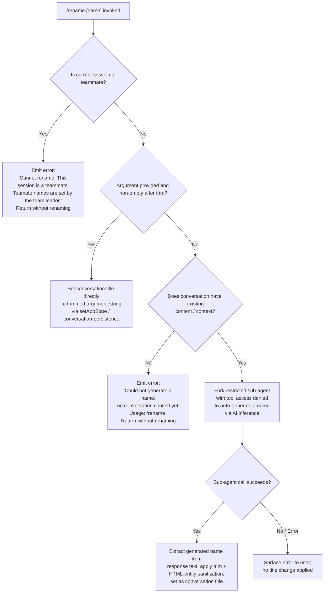

# `/rename`

> Analysis basis: CC v2.1.170 bundle.js (AST extraction + Claude interpretation)
> Minimum version: v2.1.170

---

## Overview

The `/rename` command (aliased as `/name`) allows users to set or auto-generate a display name for the current conversation session. When called with an explicit name argument, the command stores that name directly; when called without an argument and conversation context exists, it forks a restricted sub-agent to generate a concise name via an AI inference call. The command is marked `immediate`, so it executes synchronously without adding a user turn to the conversation history.

---

## Registration

| Field | Value |
|---|---|
| type | `local-jsx` |
| name | `rename` |
| description | `Rename the current conversation` |
| argumentHint | `[name]` |
| immediate | `true` |
| aliases | `["name"]` |
| module_id | `A8K` |
| load_inline | `true` |
| loc_byte | `12179797` |
| loc_byte_end | `12179996` |
| loc_line | `8384` |
| arbor_handler.name | `vCf` |
| arbor_handler.fqn | `claude-2.1.170::vCf` |
| arbor_handler.kind | `AsyncFunction` |
| arbor_handler.resolution_path | `module_id` |
| arbor_handler.n_hits | `0` |

Analysis basis: CC v2.1.170 bundle.js:+12179797

---

## Input Branching

Four distinct branches exist depending on session type and argument presence; a Mermaid flowchart is used.



Analysis basis: CC v2.1.170 bundle.js:+12178809, +12178961, +12179060, +12179172, +12179493

---

## Behavioral Spec

### Top-level handler: `conversationRenameHandler` (bundle: `vCf`)

The handler is an `AsyncFunction` resolved via `module_id` path (`A8K`). It is the command's main entry point.

```
async function conversationRenameHandler(commandContext):
    argument = commandContext.argument         // raw CLI argument string

    // Branch 1 — teammate guard
    sessionInfo = getSessionStore()
    if sessionInfo.isTeammate:
        renderError("Cannot rename: This session is a teammate. "
                    "Teammate names are set by the team leader.")
        return

    // Branch 2 — explicit name provided
    trimmedArgument = argument.trim()
    if trimmedArgument is non-empty:
        applyRename(trimmedArgument, origin="rename")
        persistConversation()
        return

    // Branch 3 — no argument, check for context
    if conversationHasNoMessages():
        renderError("Could not generate a name: no conversation context yet. "
                    "Usage: /rename <name>")
        return

    // Branch 4 — auto-generate via AI sub-agent
    generatedName = await generateNameViaSubAgent(commandContext)
    if generatedName:
        sanitized = sanitizeHtmlEntities(generatedName).trim()
        applyRename(sanitized, origin="rename_generate_name")
        persistConversation()
```

Analysis basis: CC v2.1.170 bundle.js:+12179493, +12179551, +12179060, +12179172, +12179300, +12179319, +12179342, +12179346

---

### Sub-feature: Teammate Guard (`sessionStoreReader`, bundle: `H3` → `hG`)

Before any renaming logic runs, the handler reads the async-local storage to determine whether the current session is operating as a teammate. When the teammate flag is set, a hard-coded error message is returned and execution halts.

```
function isTeammateSession():
    store = asyncLocalStorage.getStore()   // Uz_.getStore()
    return store index 0 indicates teammate mode
```

Analysis basis: CC v2.1.170 bundle.js:+12178941, +2263418, +2262277

---

### Sub-feature: Direct Rename Path (`applyRename`, bundle: `Qu8` partial)

When the user supplies an explicit name, the command calls `setAppState` with a conversation-title update, then triggers conversation persistence logic.

```
function applyDirectRename(name):
    trimmed = name.trim()
    updateAppState({ conversationTitle: trimmed })
    persistConversationToDisk()     // CjH / Wq pipeline
    emitRenameEvent(origin="rename")
```

Analysis basis: CC v2.1.170 bundle.js:+12179060, +12179300, +12179319, +12179342

---

### Sub-feature: Name-Generation Sub-Agent Fork (`generateNameViaSubAgent`, bundle: `gK6` → `VCf` + `iG`)

When no argument is given and context exists, the command launches a restricted fork of the main agent loop. The fork is configured with:

- Tool access explicitly **denied** (`"deny"` policy). Literal: `"Session name generation cannot use tools"` (bundle.js:+12177093).
- A `json_schema` response format to receive a structured name string (bundle.js:+12178008).
- Origin tag `"rename_generate_name"` (bundle.js:+12177196).
- A fallback origin `"other"` (bundle.js:+12177157).
- A timestamp-seeded request via `Date.now` (bundle.js:+10607862).

```
async function generateNameViaSubAgent(context):
    // Record telemetry for fork start
    emit("tengu_rename_full_session_fork")

    // Build a fork configuration
    forkConfig = {
        toolPolicy: "deny",
        toolDenyReason: "Session name generation cannot use tools",
        responseFormat: "json_schema",
        origin: "rename_generate_name",
        abortSignal: new AbortController().signal
    }

    // Register abort on parent stream end
    parentSignal.addEventListener("abort", () => forkAbortController.abort())

    // Run the sub-agent query (iG / ky8 pipeline)
    result = await runForkAgentQuery(forkConfig, currentConversationMessages)

    // Extract text from the last assistant message
    textContent = result.messages
                        .filter(role == "assistant")
                        .at(-1)
                        ?.content
                        ?.find(type == "text")
                        ?.text

    return textContent ?? null
```

Analysis basis: CC v2.1.170 bundle.js:+12177636 (telemetry), +12177093, +12177172, +12177196, +12176832, +12176882, +12176913, +12176960, +12178254, +12178283

---

### Sub-feature: HTML Entity Sanitization (`sanitizeHtmlEntities`, bundle: `FC8`)

The raw text produced by the AI sub-agent is passed through a `replaceAll`-based sanitizer before being stored as the conversation title. The following replacements are applied (bundle.js:+10933925):

| HTML Entity | Replaced By |
|---|---|
| `&amp;` | `&` |
| `&lt;` | `<` |
| `&gt;` | `>` |
| `&#13;` | (carriage return) |
| `&#10;` | (newline) |

Analysis basis: CC v2.1.170 bundle.js:+10933925, +10933942, +10933966, +10933989, +10934013, +10934037

---

### Sub-feature: Conversation Persistence (`persistConversation`, bundle: `CjH` → `Wq` → `Sf`)

After a rename is confirmed, the updated title is written to disk via the conversation-persistence layer. This layer uses `_W.readFile` / `_W.stat` / `AO` (atomic write: random-bytes temp file → rename) to ensure safe writes.

```
function persistConversationToDisk(updatedState):
    filePath = buildConversationFilePath()
    existing = readJsonFile(filePath)  // may be absent
    merged   = Object.assign(existing ?? {}, updatedState)
    atomicWriteJson(filePath, merged)  // write to temp, then fs.rename
```

Analysis basis: CC v2.1.170 bundle.js:+12179319, +4216184, +4216198, +4213533, +2295870, +2295917, +2295971

---

### Sub-feature: Conversation Title Logging (`sessionTitleEmitter`, bundle: `Jj`)

After a rename, a secondary path emits the new basename of the conversation file path back to the display layer via `v6` (JSX/render helper).

```
function emitConversationTitleDisplay(filePath):
    basename = path.basename(filePath)
    renderConversationTitle(basename)
```

Analysis basis: CC v2.1.170 bundle.js:+12179346, +4213057, +4213079

---

### Sub-feature: Response Text Normalization (`normalizeGeneratedName`, bundle: `N`)

The text extracted from the AI response is run through a shared normalization utility that: trims whitespace, applies locale-independent uppercase for display keys, and routes through a Unicode-aware `$h` helper before being committed as the title.

Analysis basis: CC v2.1.170 bundle.js:+12178306, +209005, +209067, +209090, +209106

---

## State & Side Effects

| Item | Detail |
|---|---|
| Telemetry: rename fork | `tengu_rename_full_session_fork` fired when auto-generation path is taken (bundle.js:+12177636) |
| Telemetry: session renamed | `tengu_session_renamed` fired on success via the conversation-log layer (bundle.js:+13383633) |
| Telemetry: agent name set | `tengu_agent_name_set` fired if an agent-name annotation accompanies the title (bundle.js:+13386661) |
| Telemetry: fork agent query | `tengu_fork_agent_query` fired inside sub-agent execution loop (bundle.js:+10614428) |
| Telemetry: forked agent turns exceeded | `tengu_forked_agent_default_turns_exceeded` guards runaway generation (bundle.js:+10613985) |
| Telemetry: config parse error | `tengu_config_parse_error` may fire if persistence config is malformed (bundle.js:+3308597) |
| appState changes | `conversationTitle` field updated via `setAppState` (bundle.js:+12179300) |
| Disk write | Conversation JSON file atomically rewritten with new title (bundle.js:+4213533) |
| Hook registration | `abort` event listener registered on parent AbortController during sub-agent fork; removed on completion (bundle.js:+12176882, +12176913) |
| Sound | <!-- TODO: not found in depth-2 traversal; needs --depth 4 --> |
| Teammate guard | Mutation blocked entirely when session is in teammate mode; error displayed (bundle.js:+12178961) |
| No-context guard | Mutation blocked when conversation has no messages; error displayed (bundle.js:+12179172) |

---

## Version History

| Version | Change |
|---|---|
| v2.1.170 | Initial analysis |

---

## Common Mistakes

1. **Invoking `/rename` without arguments in an empty session** — the command requires at least one existing message to auto-generate a name. If the conversation has no content yet, use `/rename <explicit name>` instead.
2. **Expecting `/rename` to work in teammate sessions** — teammate session titles are controlled exclusively by the team leader; invoking `/rename` in a teammate context produces an error and has no effect.
3. **Assuming the generated name is instant** — the auto-generation path forks a full AI sub-agent call. On slow network or overloaded API, this may take several seconds. The sub-agent has a turn limit guard (`tengu_forked_agent_default_turns_exceeded`) and will surface an error if it cannot complete.
4. **Providing HTML-entity-encoded strings as the name argument** — the sanitizer (`FC8`) is applied only to AI-generated names. Manual names supplied as arguments are stored verbatim after `trim()`, so literal HTML entities in a hand-typed argument will appear as-is in the title.
5. **Confusing `/rename` with `/name`** — both invoke the same handler; `/name` is a registered alias. There is no behavioral difference.

---

## Appendix — Identifier Mapping

> For bundle debugging only. Identifiers change across versions.

| Identifier | Role |
|---|---|
| `vCf` | Main async handler for `/rename` (arbor_handler; top-level entry point) |
| `gu8` | Inner helper called early in handler flow; passes to `FC8` and `t0` |
| `FC8` | HTML-entity sanitizer (`replaceAll` pipeline for `&amp;`, `&lt;`, etc.) |
| `t0` | Utility called alongside sanitizer in early handler path |
| `Qu8` | Branch dispatcher: handles direct-rename and no-context-error paths |
| `H3` | Session-store accessor (calls `hG`) |
| `hG` | Async-local-storage reader (`Uz_.getStore`) |
| `gK6` | Sub-agent fork orchestrator; calls `Y6`, `T1A`, `VCf`, `Bu8`, `AR`, `E4`, `J4`, `_8K`, `N`, `EH` |
| `Y6` | Conversation-context checker / session-fork setup utility |
| `uP6` | Helper reached from `Y6` |
| `mP6` | Helper reached from `Y6` |
| `Lm` | Helper inside `Y6` fork path |
| `nu` | Lower-level utility called by `Lm` and `Gw_` |
| `D78` | Fork-session state manager (calls `JT_.has/add`, `XJH.get`, `Gw_`, `WT_`) |
| `Gw_` | Fork sub-session creator (generates UUID, emits events via `Na.emit`) |
| `WT_` | Fork session lifecycle handler (calls `pC1`, `Q_`, `lH9`, `B6H`) |
| `h6` | File-system config/cache layer used during fork setup |
| `n6` | File-path utility inside config layer |
| `hT_` | Helper in file-watch pipeline |
| `B7H` | Config file reader/writer (calls `q.readFileSync`, `q.statSync`, `q.mkdirSync`, etc.) |
| `BSL` | File-watcher setup utility (`V78.watchFile` / `V78.unwatchFile`) |
| `T1A` | Timestamp-seeded request builder (`Date.now`, `bf6`) |
| `bf6` | Request-building helper called by `T1A` |
| `VCf` | Sub-agent query executor (calls `Z1H`, `iG`, `x8`, `_8K`, `N`, `EH`, `q.flatMap`) — **note: same mangled name as top-level handler but different symbol; resolved via Arbor as the handler `vCf`** |
| `Z1H` | Abort-signal factory used in fork |
| `iG` | Core fork-agent query runner (calls `ky8`, `yy8`, `mS`, `HqH`, `N`, `Qp`, `bT`, `eR6`, `DqH`, `kR8`, `xmq`, `D`, `qMH`, `d`, `hjf`) |
| `ky8` | App-state getter/setter pipeline inside sub-agent (`H.getAppState`, `H.setAppState`) |
| `yy8` | Helper in fork query path |
| `mS` | String-sanitization utility (regex test → replace → random bytes for nonce) |
| `HqH` | Hook-event dispatcher (`e4`, `QuH`) |
| `N` | Text normalization utility (trim, toUpperCase, `$h`, `zFH`, `EeK`) |
| `Qp` | Command lifecycle event emitter (`subagent_exit`, `command_lifecycle`, `completed`, etc.) |
| `bT` | Utility referenced in fork and AR paths |
| `eR6` | Message-type filter (checks for `tombstone`, `tool_use_summary`, `notification`, etc.) |
| `DqH` | Deferred-tool query utility |
| `kR8` | Helper in fork result processing |
| `xmq` | Calls `eR6`; another message-type gate |
| `D` | Forced-shutdown handler (`process.exit`, `z.abort`) |
| `qMH` | Message-list filter/push utility |
| `d` | Generic utility called at multiple depths |
| `hjf` | Fork post-processing helper (`K6`) |
| `x8` | Streaming I/O setup (random UUID, buffer concat pipeline) |
| `P` | Byte-buffer/stream reader utility |
| `X` | Timeout-aware stream wrapper |
| `q` | Stream/process utility (various methods including `flatMap`) |
| `Y1` | Process-exit wrapper (`JpH`, `aj`, `process.exit`) |
| `_8K` | Name-field extractor (reads `"name"` key from response, calls `Aq`, `PC`) |
| `PC` | String trim helper |
| `EH` | String coercion helper (`String(...)`) |
| `Bu8` | Message-assembly helper (push, join, slice on arrays) |
| `AR` | Agent-runner orchestrator (calls `E4`, `FR8`, `x8`, `_pH`, `bT`, `XG`, `p2`, `WE`) |
| `E4` | Utility called by `AR` and `EXK` |
| `FR8` | Conversation-file reader/writer (SHA1 hash, `d3H.readFile`, `d3H.mkdir`, `d3H.writeFile`) |
| `BR8` | Helper inside `FR8` / `B1A` |
| `SE` | Main agent streaming/state-machine handler (large; handles `api_system`, `tool_result`, `tool_use`, etc.) |
| `XXf` | Message-format mapper called by `FR8` |
| `C6` | Content-block formatter |
| `CH` | JSON serializer (`JSON.stringify`) |
| `Q6` | JSON parser (`JSON.parse`) |
| `Jpq` | Conversation-write helper (`WXf`) |
| `V8` | Value-validation utility |
| `L` | Set-tracking / cleanup utility |
| `_pH` | Assistant-message extractor (calls `B1A`, `EXK`; throws `"No assistant message found"` on failure) |
| `B1A` | Conversation-record builder (calls `BR8`, `FR8`, `A.push`) |
| `EXK` | Main API query engine (very large; handles streaming, retries, tool calls, advisor, watchdog, etc.) |
| `XG` | Cross-platform resolver (calls `xZ`) |
| `xZ` | Low-level platform primitive |
| `p2` | Provider/endpoint resolver (calls `r_`, `FL`, `Sz_`, `z9`, `flH`) |
| `r_` | Base URL resolver |
| `FL` | Provider flag helper |
| `Sz_` | API-key classifier (`sk-ant-` prefix check) |
| `z9` | Credential-chain helper (`Bc`, `B9`, `JD`) |
| `flH` | Auth flow helper (`Y7`) |
| `WE` | Utility at end of `AR` call chain |
| `J4` | Message-filter utility (`H.filter`) |
| `uuH` | REPL / render output orchestrator (calls `v6`, `Vy`, `bM`, `XR`, `ce`, `r0`, `me`, `M`, `AqH`, `F3H`, `BL`, `Q2`, `Qc`) |
| `v6` | JSX/render primitive |
| `Vy` | Render helper |
| `bM` | Text-block renderer (`tR`, `p$`, `W_`, `BXH.join`) |
| `tR` | Inline-render helper |
| `W_` | Whitespace/line renderer |
| `XR` | Output-stream writer (calls `eN`, `a$H`, `v6`, `e4`, `hm6.emit`) |
| `eN` | Text-emission helper |
| `a$H` | Append-file logger (`A.appendFileSync`, `A.mkdirSync`) |
| `e4` | Log-level helper (`N9`) |
| `ce` | Combined output helper (calls `a$H`, `eN`, `v6`, `e4`, `hm6.emit`) |
| `r0` | Render utility |
| `me` | Render utility |
| `M` | MCP client manager (calls `aSH`, `Ic8`, `L.get`, `N`, `L.values`, `$`, `IPA`) |
| `aSH` | MCP server-connection orchestrator (large; handles `stdio`, `sse`, `http`, `sse-ide`, `ws-ide`) |
| `pn` | MCP client-config parser |
| `vV` | MCP feature-flag helper |
| `K` | Column-formatter utility |
| `F8` | Generic string helper |
| `BZ6` | MCP filter utility |
| `Cg9` | MCP connection-health tracker |
| `sD8` | MCP state-date helper |
| `rD8` | MCP state-read helper |
| `M8` | MCP debug logger (`go.logMCPDebug`) |
| `bJ8` | MCP OAuth-authenticate tool handler |
| `xJ8` | MCP complete-authentication tool handler |
| `Fg9` | MCP async-connect helper |
| `Rm_` | MCP retry helper |
| `J` | Process-kill utility (`S.kill` with SIGTERM) |
| `VN` | MCP skills tracker (emits `tengu_mcp_skills`, calls `Y6`) |
| `Gm_` | MCP include-check helper |
| `y` | Warning emitter (fable-usage-credits warning) |
| `U7` | MCP error logger (`go.logMCPError`) |
| `mg9` | MCP state-field helper (`SF`) |
| `CeH` | MCP port-config parser (`parseInt`) |
| `Cj8` | MCP port-config parser variant (`parseInt`) |
| `Ic8` | MCP connection-result applier (`H.applyMcpUpdate`, `oSH`, `M8`, `A.cleanup`, `pE`, `Xw`) |
| `oSH` | MCP orphan-connection disposer (`yPH`) |
| `pE` | MCP cleanup orchestrator (`SeH`, `K.cleanup`, `VN`) |
| `$` | Conversation-session tracker (`f$K`) |
| `f$K` | Session-timestamp recorder (`Xa`, `Date.now`, `m9`, `hu6`, `CH`) |
| `IPA` | MCP remote-server retry manager |
| `WJ8` | MCP session-filter helper |
| `o8` | Timeout/retry utility |
| `SeH` | MCP server health-check helper (`yPH`) |
| `AqH` | Render annotation helper |
| `F3H` | Agent-name output writer (calls `eN`, `a$H`, `v6`, `e4`, `Qc`, `gzA.emit`, emits `tengu_agent_name_set`) |
| `Qc` | Conversation-file read/write helper (calls `jw6`, `Date.now`) |
| `jw6` | Low-level JSONL conversation reader/writer (`gh.readFile`, `gh.writeFile`) |
| `BL` | Render border/layout helper (`EZH`) |
| `EZH` | Layout primitive |
| `Db8` | App-state key enumerator (`Object.keys`) |
| `CjH` | Conversation-persistence orchestrator (calls `sK`, `Wq`, `wj`, `Sf`, `k8`, `Jz`) |
| `sK` | File-path builder for conversations |
| `VE` | Path-join helper |
| `Wq` | Conversation-file stat+read+write pipeline (emits `tengu_bg_state_read_transient`) |
| `k8` | Value-builder utility |
| `Qf` | Validation helper |
| `wj` | File-cache invalidation helper (`xfH.delete`) |
| `Sf` | Atomic-write orchestrator (calls `AO`, `Dj.join`, `CH`, `wj`) |
| `AO` | Atomic file-write primitive (temp file → `m8H.rename`) |
| `Jz` | Conversation-lock checker (`UZH.has`, `N`, `EH`, `hH`) |
| `hH` | Error-logging utility (`jA`, `_6`, `hq`, `lN4`, `fQH.push`, `go.logError`) |
| `jA` | Error-factory helper |
| `_6` | String-coercion helper |
| `hq` | Queue-drain helper (`ImA`) |
| `lN4` | FIFO queue manager (`di6.shift`, `di6.push`) |
| `Jj` | Conversation basename display emitter (calls `Dj.basename`, `v6`) |

---

Note: index built via Arbor fallback; some signals (telemetry, literals) may be missing — see arbor-fallback.js.