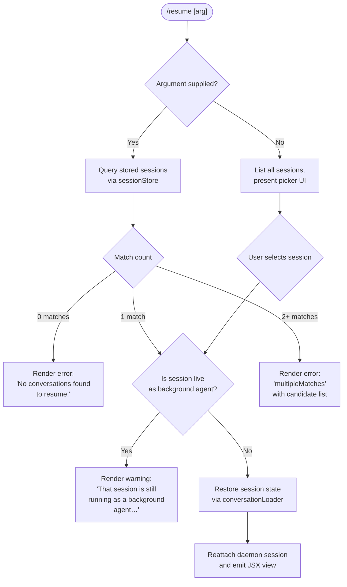

# `/resume`

> Analysis basis: CC v2.1.170 bundle.js (AST extraction + Claude interpretation)
> Minimum version: v2.1.170

---

## Overview

`/resume` (aliased as `/continue`) lets the user re-enter a previous Claude Code conversation by supplying either an exact session ID or a free-text search term. The command enumerates persisted sessions, matches the query against them, and — if a unique match is found — restores the conversation state and reattaches to the daemon session for that context.

---

## Registration

| Field | Value |
|---|---|
| type | `local-jsx` |
| name | `resume` |
| description | `Resume a previous conversation` |
| aliases | `["continue"]` |
| argumentHint | `[conversation id or search term]` |
| module_id | `m1K` |
| load_inline | `true` |
| loc_byte | `12359781` |
| loc_byte_end | `12359978` |
| loc_line | `8572` |
| arbor_handler.name | `ymf` |
| arbor_handler.fqn | `claude-2.1.170::ymf` |
| arbor_handler.kind | `AsyncFunction` |
| arbor_handler.resolution_path | `module_id` |
| arbor_handler.n_hits | `0` |

Analysis basis: CC v2.1.170 bundle.js:+12359781

---

## Input Branching

Four distinct paths exist depending on whether the target session is still live, whether the argument resolves to zero, one, or multiple sessions. A Mermaid flowchart is used.



Analysis basis: CC v2.1.170 bundle.js:+12358373 (session lookup), +12358383 (background-agent guard string), +12358818 ("No conversations found" string), +12356027 (`sessionNotFound`), +12356098 (`multipleMatches`)

---

## Behavioral Spec

### 1. Handler entry — `resumeCommandHandler` (`ymf`)

```
async function resumeCommandHandler(commandInput, appContext):
    sessionQuery = commandInput.args   // may be undefined

    // 1. Enumerate candidate sessions
    liveSessions = await listLiveSessions()        // O3H → A.listAllLiveSessions
    storedSessions = await loadSessionStore()      // D16 + AJK + c9H pipeline

    // 2. Filter by query
    if sessionQuery is undefined:
        candidates = all storedSessions
        // render interactive picker — user selects one
    else:
        candidates = storedSessions.filter(s => matchesQuery(s, sessionQuery))

    // 3. Disambiguate
    if candidates.length == 0:
        return renderError("No conversations found to resume.")   // +12358818

    if candidates.length > 1:
        return renderError("multipleMatches", candidates)         // +12356098

    target = candidates[0]

    // 4. Background-agent guard
    if liveSessions.includes(target.id) AND target.mode == "interactive":
        return renderWarning(
            "That session is still running as a background agent. " +
            "Open `claude agents` to attach to it…"               // +12358383
        )

    // 5. Load conversation
    conversation = await loadConversation(target)   // Y3H + c9H

    // 6. Emit telemetry markers
    emitSlashCommandSessionId(target.id)            // literal "slash_command_session_id" +12359079
    emitSlashCommandTitle(target.title)             // literal "slash_command_title"      +12359303

    // 7. Build and return JSX view
    return hJ.createElement(ResumeView, {
        session: conversation,
        timestamp: Date.now(),                      // +12358695
        …
    })
```

Analysis basis: CC v2.1.170 bundle.js:+12358373, +12358604, +12358633, +12358669, +12358695

---

### 2. Session enumeration — `listAllLiveSessions` (`O3H`)

```
async function listAllLiveSessions():
    // Resolves to the set of session IDs currently held by the daemon
    // Uses Promise.resolve + $16 fallback                  // +9242906, +9242936
    sessions = await daemonClient.listAllLiveSessions()    // +9242958
    // filters for mode == "interactive"                    // literal +9243049
    return sessions.filter(s => s.mode == "interactive")
```

Analysis basis: CC v2.1.170 bundle.js:+9242906

---

### 3. Conversation store loading — `conversationStoreLoader` (`D16` + `AJK` + `c9H`)

```
async function loadConversationStore():
    // Resolves the on-disk conversation database
    // AJK initialises store via Ysf (path resolution) and c9H (JSONL reader)
    path = resolveProjectStorePath()         // Ysf + W_ + P$.join  (+13400066)
    rawRecords = await readConversationFile(path)  // c9H → pK.readFile (+13398081)

    // Parse and index records keyed by uuid
    return buildIndex(rawRecords)            // D16 → VB8, NB8, z3H pipelines
```

Analysis basis: CC v2.1.170 bundle.js:+13400723, +13399984, +13398081

---

### 4. Query matching — `sessionQueryMatcher` (`fr`)

```
function matchSessions(sessions, query):
    queryLower = query.toLowerCase()    // +13390106

    // Pass 1: exact UUID match
    exact = sessions.filter(s => s.id == query)
    if exact.length > 0: return exact

    // Pass 2: title / last-prompt substring match (case-insensitive)
    textMatches = sessions.filter(s =>
        s.title?.toLowerCase().includes(queryLower) OR
        s.lastPrompt?.toLowerCase().includes(queryLower)
    )

    // Pass 3: sort results by recency (localeCompare on timestamp)  // +9233093
    return textMatches.sort(byRecency)
```

Analysis basis: CC v2.1.170 bundle.js:+13390106, +13390131, +13390279

---

### 5. Conversation history reconstruction — `historyBuilder` (`Y3H`)

```
function buildConversationHistory(rawRecords):
    // Sorts by timestamp, respects compact_boundary markers   // literal +10958101
    sorted = rawRecords.sort(byTimestamp)           // VB8 + Date.parse  +13376055

    chain = walkParentChain(sorted)                 // z3H  +13376158
    // Handles parent-cycle guard (tengu_chain_parent_cycle telemetry)
    // Applies taf scoring for parallel-turn recovery
    // Applies mzA / Y16 content normalisation

    return chain
```

Analysis basis: CC v2.1.170 bundle.js:+13388742, +13388875, +13388938

---

### 6. Daemon reattach — `daemonReattach` (`Sm8` → `qJK`)

```
async function reattachDaemonSession(sessionId):
    // Resolves project path and confirms socket is reachable
    socketPath = buildSocketPath(sessionId)   // Zn + H_ + "projects" literal +5064074

    // Issues "resume" command over daemon socket             // literal +16520527
    response = await daemonSocketDispatch("resume", sessionId)

    // Possible daemon-side error codes that abort reattach:
    //   ENOJOB     — job already exited              +16518387
    //   ERESPAWNING — job is restarting              +16520070
    //   EUNVERIFIED — identity check failed          +16519976

    if response.error: throw DaemonError(response.error)

    return response.session
```

Analysis basis: CC v2.1.170 bundle.js:+12358758, +13402518, +13402604, +16520527

---

### 7. Background-session guard detail

The string literal `"That session is still running as a background agent. Open \`claude agents\` to attach to it, or stop it there first to resume here."` (+12358383) is emitted as a JSX warning block when the target session ID appears in the live-session list with `mode == "interactive"` (+9243049). No resume attempt is made in this path.

Analysis basis: CC v2.1.170 bundle.js:+12358383, +9243049

---

## State & Side Effects

| Item | Detail |
|---|---|
| Telemetry — `tengu_worktree_detection` | Fired during worktree path resolution inside `M3H` (+9232769) |
| Telemetry — `tengu_daemon_control` | Fired on daemon socket interactions (+16566763) |
| Telemetry — `tengu_bg_attach` | Fired when the daemon attach handshake completes (+16521585) |
| Telemetry — `tengu_bg_attach_stall_gave_up` | Fired if the reattach stalls and times out (+16522503) |
| Telemetry — `tengu_bg_attach_stall_respawn` | Fired if a stalled session is forcibly respawned (+16522773) |
| Telemetry — `tengu_bg_attach_kick` | Fired when a conflicting client is kicked (+16523723) |
| Telemetry — `tengu_chain_parent_cycle` | Fired if a parent-cycle is detected during history reconstruction (+13398553) |
| Telemetry — `tengu_chain_timestamp_fallback` | Fired when a timestamp cannot be resolved and a fallback is used (+16035302 via `z3H`) |
| Telemetry — `tengu_transcript_phantom_parent` | Fired for orphaned transcript nodes (+13394761) |
| Slash-command metadata | Emits `slash_command_session_id` (+12359079) and `slash_command_title` (+12359303) into app state |
| appState changes | Active session context is replaced with the resumed conversation; history chain is rebuilt via `Y3H` |
| JSX render | Returns a `local-jsx` component tree (`hJ.createElement` at +12358669); the `b1K` component uses bold formatting (`w6.bold` at +12356062) for the session title display |
| No sound | No audio side effect found in depth-2 traversal |

---

## Version History

| Version | Change |
|---|---|
| v2.1.170 | Initial analysis |

---

## Common Mistakes

1. **Passing a partial title that matches multiple sessions** — the command returns a `multipleMatches` error rather than picking the most recent. Supply a more specific term or the full session UUID to avoid ambiguity.
2. **Trying to resume a live background-agent session** — the command blocks this path and directs users to `/agents` instead. Stop the background agent first, then run `/resume`.
3. **Using `/resume` when no prior sessions exist** — the command renders "No conversations found to resume." immediately; there is no interactive fallback in this case.
4. **Expecting instant reattach on a stalled daemon** — if `tengu_bg_attach_stall_gave_up` fires, the daemon may need to be restarted (`claude daemon restart`) before `/resume` can succeed.
5. **Confusing `/resume` with `/continue`** — both names are registered (`aliases: ["continue"]`) and are functionally identical; either can be used.

---

## Appendix — Identifier Mapping

> For bundle debugging only. Identifiers change across versions.

| Identifier | Role |
|---|---|
| `ymf` | Main async handler for `/resume` (`resumeCommandHandler`) |
| `u1K` | Module loader / command registration wrapper |
| `O3H` | Live session enumeration (`listAllLiveSessions`) |
| `M3H` | Worktree / project path resolver |
| `p_` | Child-process / agent spawn abstraction |
| `eVH` | Low-level process execution engine |
| `hH` | Error/warning logger |
| `jA` | Error constructor helper |
| `_6` | String coercion utility |
| `hq` | Telemetry network layer |
| `ImA` | Telemetry packet builder |
| `lN4` | Telemetry queue manager |
| `EH` | String formatter |
| `D16` | Conversation store accessor (top-level) |
| `AJK` | Store initialiser (path + DB bootstrap) |
| `c9H` | JSONL conversation database engine |
| `Y3H` | Conversation history builder |
| `z3H` | Parent-chain walker |
| `saf` | Chain scoring helper (NaN guard) |
| `taf` | Parallel-turn recovery helper |
| `oaf` | Turn ordering helper |
| `twK` | Chain index updater |
| `VB8` | Timestamp parser wrapper |
| `mzA` | Content normaliser |
| `ix6` | Message-block parser |
| `WK` | Inline markup tokeniser |
| `Y16` | Message array mapper |
| `UzA` | Content-type filter |
| `eaf` | Media-type predicate |
| `Hsf` | Array type-guard helper |
| `IzA` | History slice assembler |
| `vB8` | UUID → message map helper |
| `NB8` | Message list extractor |
| `Osf` | Binary JSONL file reader |
| `$sf` | Buffer-level record parser |
| `zsf` | Sync file reader |
| `MvH` | BOM / encoding detector |
| `Mh4` | UTF-8 BOM stripper |
| `$h4` | BOM index finder |
| `zh4` | JSON line decoder |
| `Oh4` | Single-record buffer parser |
| `_JK` | Byte-offset index accessor |
| `fH` | Buffer comparison set |
| `Msf` | Buffer comparator |
| `KH` | Worker session state machine |
| `Sm8` | Daemon reattach orchestrator |
| `Rm6` | Socket path builder |
| `qJK` | Conversation file scanner |
| `fr` | Session query matcher |
| `EpH` | Directory walker for session files |
| `Gsf` | Per-file session record parser |
| `QTH` | Record aggregator |
| `yzA` | Recursive directory reader |
| `Vm6` | Session index updater |
| `PY` | Path sanitiser |
| `Zn` | Project-storage root resolver |
| `hu6` | Daemon status file path builder |
| `f$K` | Daemon status JSON reader |
| `Xa` | App data directory resolver |
| `m9` | Async-local-storage store accessor |
| `RO` | Path normaliser (NFC) |
| `W_` | Current working directory accessor |
| `xZ` | Home directory resolver |
| `tR` | XDG / platform path helper |
| `L0` | Directory entry lister |
| `Ysf` | Project path resolver for store |
| `b1K` | Bold-text JSX component |
| `V$H` | Conversation view JSX container |
| `Tg` | UUID validator |
| `Te` | Date/time formatter |
| `U3` | Session-ID extractor |
| `Nj` | Metadata key constants holder |
| `maf` | Message attribution helper |
| `Bp` | Compact-boundary marker handler |
| `jQ6` | JSON path walker |
| `wQ6` | Key pattern tester |
| `RZA` | Key replacement helper |
| `aSH` | MCP server connection manager |
| `Ic8` | MCP connection result applier |
| `IPA` | MCP slot reconciler |
| `RwK` | Conversation chain re-linker |
| `raf` | Chain walk helper |
| `J1` | Feature-flag reader |
| `K6` | Feature-flag cache |
| `w` | Background worker manager |
| `b` | Worker instance constructor |
| `o8` | IPC request helper |
| `v2A` | Worker lifecycle manager |
| `W2A` | Worker socket claim handler |
| `tj5` | Daemon message dispatcher |
| `jf` | Daemon connection closer |
| `P9` | Version string helper |
| `D16` | (see above — conversation store) |
| `d` | Logger / debug emitter |
| `V8` | Version comparator |
| `N` | LLM request builder |
| `CH` | JSON stringify wrapper |
| `u4` | Token / text truncator |
| `zFH` | YAML front-matter parser |
| `EeK` | System prompt assembler |
| `PeK` | Conversation prompt builder |
| `G` | MCP tool executor |
| `E` | Terminal width calculator |
| `Y` | Supervisor render loop |
| `h` | Background worker sweep scheduler |
| `l` | Worker grace-clock manager |
| `R` | PTY output writer |
| `S` | Session recorder |
| `Q` | Permission request queue |
| `c` | Permission response handler |
| `n` | Agent worker runner |
| `t` | Voice recording session manager |
| `mU8` | Voice WebSocket stream |
| `ekK` | Audio energy calculator |
| `IjA` | Audio tool finder |
| `zH` | MCP tools-list-changed handler |
| `OH` | Agent message buffer |
| `vH` | Agent I/O pipe |
| `sZA` | Locale date formatter |
| `EBH` | Language/locale detector |
| `Q_` | Permission broadcast helper |
| `B` | PTY idle-exit timer |
| `qH` | Rate-limit event queue |
| `jH` | Permission request queue (secondary) |
| `kjA` | Rate-limit record constructor |

---

Note: index built via Arbor fallback; some signals (telemetry, literals) may be missing — see arbor-fallback.js.