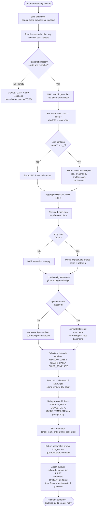

# `/team-onboarding`

> Analysis basis: CC v2.1.170 bundle.js (AST extraction + Claude interpretation)
> Minimum version: v2.1.170

---

## Overview

`/team-onboarding` is a guided, collaborative prompt command that analyses the invoking user's local Claude Code session transcripts (up to the last 365 days) and co-authors a tailored `ONBOARDING.md` guide for teammates who are new to Claude Code. The agent immediately produces a concrete draft based on scanned usage data, then solicits lightweight review before finalising the file. The produced guide is designed to be pasted directly into Claude Code by a new team member to receive an interactive onboarding tour.

---

## Registration

| Field | Value |
|---|---|
| type | `prompt` |
| name | `team-onboarding` |
| description | `Help teammates ramp on Claude Code with a guide from your usage` |
| isHidden | `false` |
| handler_method | `getPromptForCommand` |
| handler_method_start (byte) | `12261233` |
| handler_method_end (byte) | `12261943` |
| loc_byte | `12260895` |
| loc_byte_end | `12261944` |
| loc_line | `8542` |
| prompt_body.length | `4539` characters |
| prompt_body.trace | `identifier→$ (local→1 ext vars)` |
| arbor_handler.name | `getPromptForCommand` |
| arbor_handler.fqn | `claude-2.1.170::getPromptForCommand` |
| arbor_handler.kind | `Method` |
| arbor_handler.resolution_path | `direct` |
| arbor_handler.n_hits | `2` |
| `handler_method_start` | `12261233` |
| `handler_method_end` | `12261943` |

Analysis basis: CC v2.1.170 bundle.js:+12260895

---

## Input Branching

The handler performs several distinct branching decisions during data collection and prompt assembly, warranting a Mermaid flowchart.



Analysis basis: CC v2.1.170 bundle.js:+12261233 – +12261943

---

## Behavioral Spec

### 1. Invocation and Telemetry Gate

When the command fires, the handler immediately emits `tengu_team_onboarding_invoked` before any file I/O. A second event, `tengu_team_onboarding_generated`, is emitted after the prompt string is fully assembled and returned. An additional `tengu_flint_harbor_prompt` event is emitted at the shared prompt-dispatch layer (`Y6` call at byte +12261267).

```
function handleTeamOnboarding(context):
    emit("tengu_team_onboarding_invoked")
    usageData   = collectTranscriptData(context)
    mcpServers  = readMcpConfig(context)
    authorInfo  = resolveGitIdentity(context)
    prompt      = assemblePrompt(usageData, mcpServers, authorInfo)
    emit("tengu_team_onboarding_generated")
    return prompt
```

Analysis basis: CC v2.1.170 bundle.js:+12261493, +12261812, +12261270

---

### 2. Transcript Collection (`collectTranscriptData` / `NAK`)

The function resolved as `NAK` reads the Claude Code transcript directory. The time window is **365 days** (literal `365` at byte +12261482), computed relative to `Date.now()`. Window arithmetic uses `Math.min`, `Math.max`, and `Math.floor` (bytes +12261436, +12261445, +12261454) to clamp the day count. Only files with extension `.jsonl` (literal at byte +12249846) are selected. Each file is stat-checked (`aK6.stat` / `O.isFile`) before being read (`aK6.readFile`). Lines are split and scanned with regex patterns (`Txf.exec`, `Exf.exec`, `Zxf.exec`).

Extracted per-session fields from each `.jsonl` line:
- Session title
- Linked pull-request numbers (`prNumbers`)
- First user message text
- Tool call counts (used as a weak hint when first messages are uninformative)
- MCP tool call counts (detected via the literal substring `"name":"mcp__"` at byte +12250425)

Content arrays are detected via `"content":[` (literal at byte +12250775). Sessions with ~0 entries cause the work-type breakdown to be left as a TODO placeholder.

```
function collectTranscriptData(context):
    windowMs  = 365 * 24 * 60 * 60 * 1000       // 365-day window
    cutoff    = Date.now() - windowMs
    transcriptDir = resolveTranscriptDir(context) // vu / BI helpers
    files     = readdir(transcriptDir)
                  .filter(f => extname(f) == ".jsonl")
    sessions  = []
    for file in files:
        stat = await stat(join(transcriptDir, file))
        if not stat.isFile(): continue
        raw  = await readFile(join(transcriptDir, file), "utf-8")
        for line in raw.split("\n"):
            descriptor = parseSessionLine(line)  // Txf / Exf / Zxf regexes
            if descriptor: sessions.push(descriptor)
    return buildUsageObject(sessions, cutoff)
```

Analysis basis: CC v2.1.170 bundle.js:+12249718, +12249759, +12249829, +12249846, +12250257, +12250303, +12261436–+12261482

---

### 3. MCP Configuration Reader (`readMcpConfig` / `Nxf`)

`Nxf` reads the `.mcp.json` file (literal at byte +12251957) from the workspace root using `kAK.readFile` joined with `wm8.join`. The `mcpServers` key (literal at byte +12252013) is extracted. Each entry's `name` and `urlOrigin` fields are used by the agent to infer the server's purpose and how a new teammate would obtain access. Errors (missing file, parse failure) are silently suppressed via `k8` / `N` error-handling helpers, leaving the MCP list empty.

```
function readMcpConfig(workspaceRoot):
    try:
        raw  = await readFile(join(workspaceRoot, ".mcp.json"), "utf-8")
        data = JSON.parse(raw)
        return data["mcpServers"] ?? {}
    catch:
        return {}
```

Analysis basis: CC v2.1.170 bundle.js:+12251933, +12251957, +12252013, +12252109

---

### 4. Git Identity Resolution (`resolveGitIdentity` / `Ixf`)

`Ixf` shells out via `p_` (process-spawn helper) to two git commands:

1. `git config user.name` (literals at bytes +12252580, +12252587, +12252596) — populates `generatedBy`.
2. `git remote get-url origin` (literals at bytes +12252652, +12252661, +12252671) — determines `currentRepo`.

If either command fails or returns empty output, the corresponding value is omitted from the guide. The repository basename (`wm8.basename` at byte +12252768) is extracted from the remote URL for display. A helper `qvH` trims and normalises the URL (removing `git/` prefixes and `localhost` references).

```
function resolveGitIdentity(cwd):
    userName = runGit(["config", "user.name"], cwd)  // may be null
    remoteUrl = runGit(["remote", "get-url", "origin"], cwd)  // may be null
    repoName  = remoteUrl ? basename(normaliseUrl(remoteUrl)) : null
    return { generatedBy: userName, currentRepo: repoName }
```

Analysis basis: CC v2.1.170 bundle.js:+12252258, +12252265, +12252279, +12252547, +12252577, +12252768

---

### 5. Prompt Assembly (`assemblePrompt` / `getPromptForCommand`)

Three template variable substitutions are performed using `String.replaceAll` (byte +12261680):

| Placeholder | Replacement source |
|---|---|
| `{{WINDOW_DAYS}}` | Computed integer from clamped 365-day window (literal at byte +12261693) |
| `{{USAGE_DATA}}` | JSON-serialised transcript aggregate (literal at byte +12261768) |
| `{{GUIDE_TEMPLATE}}` | Internal guide skeleton string (literal at byte +12261733) |

The final assembled string is 4,539 characters. It is returned by `getPromptForCommand` with content type `"text"` (literal at byte +12261927).

```
function assemblePrompt(usageData, mcpServers, authorInfo):
    windowDays = Math.floor(Math.min(Math.max(computedDays, 0), 365))
    body = PROMPT_TEMPLATE
    body = body.replaceAll("{{WINDOW_DAYS}}", String(windowDays))
    body = body.replaceAll("{{USAGE_DATA}}",  JSON.stringify(usageData))
    body = body.replaceAll("{{GUIDE_TEMPLATE}}", GUIDE_TEMPLATE_STRING)
    return { type: "text", content: body }
```

Analysis basis: CC v2.1.170 bundle.js:+12261680, +12261693, +12261711, +12261733, +12261768, +12261927

---

### 6. Agent-Side Behavior (Prompt Instructions Summary)

The assembled prompt instructs the agent to behave as follows (grounded in `prompt_body`, length 4,539, trace `identifier→$ (local→1 ext vars)`):

**Step 1 — Immediate acknowledgment (mandatory first output):**  
The agent must emit a single acknowledgment line referencing the window duration before any classification, tool use, or extended thinking. The prompt explicitly states the guide creator "is staring at a blank screen" until this appears.

**Step 2 — Work-type classification:**  
The agent reads `sessionDescriptors` from `USAGE_DATA` and classifies each session into one of seven canonical task types: `build_feature`, `debug_fix`, `improve_quality`, `analyze_data`, `plan_design`, `prototype`, or `write_docs`. Review sessions are mapped to the type of content being reviewed (e.g. code review → `improve_quality`). The agent selects the top 3–5 types with rough percentage breakdowns, displayed in title case with spaces (e.g. "Build Feature"). If sessions are near zero, the breakdown is left as a TODO.

**Step 3 — Context gathering:**  
Repositories: start from `currentRepo`, check sibling workspace directories. MCP servers: use `name` and `urlOrigin` to infer purpose and access method. Team Tips and Get Started sections are left as TODO placeholders pending Review answers.

**Step 4 — Draft guide written to `ONBOARDING.md`:**  
The guide follows the `{{GUIDE_TEMPLATE}}` skeleton. Real numbers from `USAGE_DATA` replace all placeholders. ASCII bar charts use `█` (filled) and `░` (empty) across a 20-character width. If `generatedBy` is present, the author name is included; otherwise it is omitted.

**Step 5 — Rendered draft + Review section:**  
The guide is rendered in a fenced code block. A `---` horizontal rule and `**Review**` heading follow. Three numbered questions are posed:
1. Team name confirmation (or request if not determinable).
2. Starter task suggestion (ticket or doc link, optional).
3. Team tips not already in `CLAUDE.md`.

**Step 6 — Finalisation on reply:**  
After the guide creator answers, the agent updates `ONBOARDING.md` with the team name, tips, and starter task, then closes with a fixed verbatim line instructing the creator to share the file. Subsequent edits from the guide creator are applied to the file.

Analysis basis: CC v2.1.170 bundle.js:+12261233 – +12261943

---

## State & Side Effects

| Item | Detail |
|---|---|
| Telemetry: `tengu_team_onboarding_invoked` | Fired immediately on command invocation (bundle.js:+12261493) |
| Telemetry: `tengu_team_onboarding_generated` | Fired after prompt assembly completes (bundle.js:+12261812) |
| Telemetry: `tengu_flint_harbor_prompt` | Fired at shared prompt-dispatch layer via `Y6` (bundle.js:+12261270) |
| Telemetry: `tengu_flint_harbor_share` | Fired via `V96` on secondary share path (bundle.js:+10051456) |
| Telemetry: `tengu_config_parse_error` | Fired if config file cannot be parsed (bundle.js:+3308597) |
| Telemetry: `tengu_config_lock_contention` | Fired if config lock is contested during write (bundle.js:+3306022) |
| Telemetry: `tengu_config_stale_write` | Fired on stale config write detection (bundle.js:+3306158) |
| Telemetry: `tengu_config_auth_loss_prevented` | Fired if auth-loss safeguard triggers (bundle.js:+3306501) |
| File I/O (read) | Transcript `.jsonl` files under the Claude projects directory |
| File I/O (read) | `.mcp.json` in workspace root |
| File write | `ONBOARDING.md` written to working directory (agent-side, after user review) |
| Process spawn | `git config user.name` and `git remote get-url origin` |
| Config lock | `k78` acquires a file lock when persisting config; contention logged |
| appState changes | None directly; transcript read is non-mutating |
| Sound | None |
| Hook registration | `N9` registers a finalisation hook via `LTA.register` (bundle.js:+62328) |

---

## Version History

| Version | Change |
|---|---|
| v2.1.170 | Initial analysis; command registered at bundle.js:+12260895 |

---

## Common Mistakes

1. **Expecting interactive questions before a draft.** The prompt explicitly instructs the agent to generate the complete `ONBOARDING.md` draft immediately and ask questions afterward — invoking the command and then waiting for questions before seeing a guide will not occur.

2. **Assuming the window is customisable at invocation time.** The 365-day window is hardcoded in the handler (`Math.min`/`Math.max`/`Math.floor` clamp, literal `365` at byte +12261482); no argument is accepted by the command to alter it.

3. **Expecting the guide to appear outside a code block.** The agent is instructed to render `ONBOARDING.md` inside a fenced code block, visually separated from the Review questions by a `---` rule.

4. **Omitting answers to Review questions and expecting a finalised file.** The two-turn design requires the guide creator to reply to the three Review questions; the agent only writes the final `ONBOARDING.md` and emits the closing line after receiving those answers.

5. **Relying on the command in a repository with no `.jsonl` transcripts.** If the transcript directory is empty or missing, `USAGE_DATA` will contain ~0 sessions and the work-type breakdown will be left as a TODO placeholder throughout the guide.

6. **Expecting MCP server setup instructions without a `.mcp.json`.** If `.mcp.json` is absent from the workspace root, `Nxf` returns an empty server map and the guide will contain no MCP setup section.

---

## Appendix — Identifier Mapping

> For bundle debugging only. Identifiers change across versions.

| Identifier | Role |
|---|---|
| `__handler_team-onboarding` | Synthetic BFS entry point for the command handler (callGraph root) |
| `Y6` | Shared prompt-dispatch / harbor function; routes prompt to agent layer |
| `uP6` | Helper called within prompt dispatch (role: unknown at depth-2) |
| `mP6` | Helper called within prompt dispatch (role: unknown at depth-2) |
| `Lm` | Intermediate dispatch helper calling `nu` |
| `nu` | Core async executor called by dispatch and experiment tracking |
| `mC` | Utility called by `nu`; delegates to `JDL`, `E$`, `IO6` |
| `D78` | Session deduplication / cache lookup (uses `JT_` Set and `XJH` Map) |
| `Gw_` | Experiment/event emission helper; calls `Xw_.randomUUID`, `Na.emit` |
| `UNH` | Sub-helper of `Gw_`; calls `nh` |
| `uB` | Random-bytes / nonce generator (32-byte hex, calls `f69.randomBytes`) |
| `CH` | JSON serialisation wrapper (calls `JSON.stringify`) |
| `zwL` | Post-emit cleanup helper |
| `WT_` | Dispatch routing helper; calls `pC1`, `Q_`, `lH9`, `B6H` |
| `pC1` | Logging helper calling `glH` |
| `Q_` | Queue or priority helper calling `PB` |
| `lH9` | Unknown sub-helper of `WT_` |
| `B6H` | Set membership check (`jz4.has`) |
| `h6` | Config/file watch entry point; calls `B7H`, `BSL`, `ZG` |
| `n6` | Low-level path or error normaliser |
| `hT_` | Helper used in watch and config contexts |
| `B7H` | Config file reader/parser (readFileSync, JSON.parse, ENOENT handling) |
| `q` | Node `fs` module proxy (readFileSync, statSync, mkdirSync, etc.) |
| `Q6` | JSON.parse wrapper |
| `ku` | String prefix-strip helper (startsWith + slice) |
| `_` | Multi-role utility (fs ops: readdirStringSync, statSync, toUpperCase) |
| `V8` | Error construction/throw helper |
| `L69` | Directory-listing helper (readdirStringSync, path joins, stat) |
| `N` | String-normalisation / environment variable helper |
| `d` | General-purpose data/state helper |
| `CT_` | Path join + backup-dir helper (uses `"backups"` literal) |
| `w` | Agent/daemon process manager (spawn, kill, memory checks) |
| `BSL` | File-watcher setup/teardown (`V78.watchFile` / `unwatchFile`) |
| `qF` | Sub-helper called within file watcher |
| `N9` | Finalisation hook registrar (`LTA.register`) |
| `W8` | Config persistence orchestrator; calls `k78`, `ZJH`, `K69`, `QP6`, `I78` |
| `k78` | Config read-modify-write with file lock; calls `JE1`, `B7H`, `xO6` |
| `L` | Async resource tracker (add/delete/finally) |
| `f` | Async resource close handler (close, finally) |
| `JE1` | Config object merge helper (`fY_`, `Object.assign`) |
| `fY_` | Config field factory calling `wE1` |
| `liH` | Config write guard (auth-loss prevention, GH #3117) |
| `A` | Multi-role: process map (values/set/get) and toLowerCase helper |
| `V` | String startsWith filter helper |
| `P` | IPC / buffer stream handler (Buffer.concat, indexOf, subarray) |
| `X` | Timeout / stream helper (setTimeout, M reference) |
| `J` | Process kill orchestrator (values, kill) |
| `jf` | Stream-end helper (H.end, CH) |
| `tj5` | Full IPC message dispatcher (large multi-role: attach, kill, resize, etc.) |
| `EH` | String coercion helper |
| `E` | Slice / clamp helper (Math.max, Math.min, G reference) |
| `G` | SDK connection manager (V76, CS, vN, Promise.all, nn, tF, hH, jA) |
| `xO6` | Atomic file-write helper (temp file + rename, randomBytes, fchmod, fsync) |
| `O` | Stream / stat object proxy (isSymbolicLink, S8, write, etc.) |
| `k8` | Error-code normaliser calling `V8` |
| `H` | Random-delay / setTimeout helper |
| `ZJH` | Unknown sub-helper of `W8` |
| `K69` | Config entry iterator (`Object.entries`) |
| `QP6` | Timestamp snapshot helper (`Date.now`) |
| `I78` | Atomic config write sub-step (dirname, HX, CH, xO6, N) |
| `Ixf` | Top-level usage-data collector; calls `W_`, `vu`, `NAK`, `Nxf`, `vxf`, `p_`, `CH`, `qvH` |
| `W_` | Entry-point helper calling `xZ` |
| `xZ` | Low-level initialisation function |
| `vu` | Transcript directory path resolver (lo.join, BI, PY) |
| `BI` | Project-path helper (lo.join, H_, `"projects"` literal) |
| `PY` | Path-normalisation helper (replace, slice, hI4) |
| `hI4` | Numeric path helper (Math.abs, OYH) |
| `NAK` | Transcript file scanner (readdir, stat, readFile, regex parsing) |
| `P9` | Error-value helper calling `V8` |
| `K` | Array-map + padEnd formatting helper |
| `$` | Top-level module or stream reference; calls `f$K` |
| `f$K` | Caching/timing helper (Xa, Date.now, m9, hu6, CH) |
| `z` | Daemon/process-lifecycle module (SH, xH, ih, ZU) |
| `SH` | Background session handler (d, K6) |
| `xH` | Background session handler variant (d, K6) |
| `ih` | Session push helper (nu, sc.push, UNH, Ww_) |
| `ZU` | Shutdown sequencer (Promise.race/all, cLH, lLH, process.exit) |
| `D` | Abort / exit helper (Qj, process.exit, z.abort) |
| `Qj` | Sub-helper of `D` |
| `Nxf` | `.mcp.json` reader and `mcpServers` extractor |
| `vxf` | Unknown post-mcp-read helper in `Ixf` |
| `p_` | Process-spawn helper for git commands (eVH, D, Ey4, j3, N, V8, hH) |
| `eVH` | Child-process executor (CBA, W1_, G1_, E1_, FUA, mO6, P1_, etc.) |
| `CBA` | Platform-specific command builder (win32 / .exe / cmd /q) |
| `W1_` | Stream reader helper (ZBA) |
| `G1_` | Stream reader variant (ZBA, wy4) |
| `E1_` | Output collector (Xy4) |
| `FUA` | Finite-check guard (Number.isFinite, TypeError) |
| `mO6` | Child-process error builder (Ck4, Error, Boolean, `bufferedData`) |
| `P1_` | Proxy / reflection helper (Reflect.apply, Reflect.defineProperty) |
| `XBA` | Event-listener setup (H.on, exit) |
| `BUA` | Timeout-race helper (setTimeout, gk4, Promise.race, clearTimeout) |
| `gUA` | Process-kill helper (no, H.kill, q.finally, K) |
| `pUA` | Output-bind helper (H, pk4) |
| `UUA` | Kill-signal helper (H.kill) |
| `JBA` | Promise-all coordination (X1_, j1_) |
| `FO6` | stdio setup helper (sA_) |
| `DBA` | Pipe setup helper ($y4, Tr6, A.pipe) |
| `wBA` | Stream-add helper (OBA.default, A.add) |
| `lUA` | Listener bind helper (M1_.bind) |
| `Ey4` | String-coerce helper for process output |
| `j3` | Unknown sub-helper of `p_` |
| `hH` | Error-logging helper (jA, _6, hq, lN4, fQH.push, go.logError) |
| `jA` | Error-format helper (Error, String) |
| `_6` | String coercion helper |
| `hq` | Traffic filter helper (ImA, `"essential-traffic"`) |
| `lN4` | Ring-buffer shift/push helper (di6.shift, di6.push) |
| `qvH` | Git URL normaliser (trim, match, startsWith `"git/"`, toLowerCase) |
| `ay4` | URL sub-parser (f9) |
| `f9` | String index/slice utility |
| `V96` | Secondary share/prompt path (calls hq, jE, Y6) |
| `jE` | Sub-helper of `V96` calling `j9` |