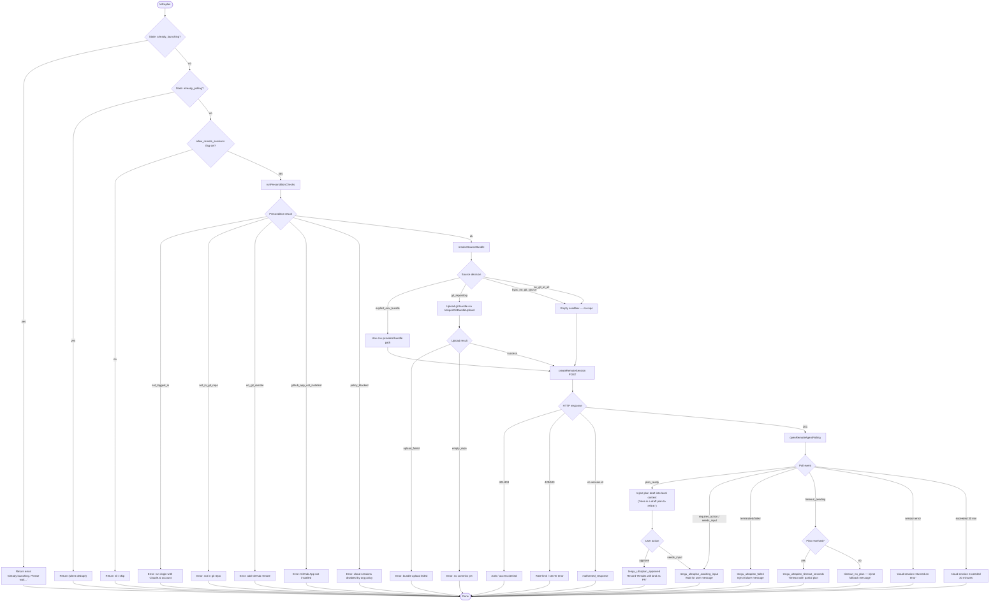

# `/ultraplan`

> Analysis basis: CC v2.1.170 bundle.js (AST extraction + Claude interpretation)
> Minimum version: v2.1.170

---

## Overview

`/ultraplan` drafts an editable implementation plan inside a remote cloud session hosted on Claude.ai, then surfaces the resulting plan locally for the user to refine or approve. It orchestrates authentication checks, git-bundle upload, cloud session creation, long-poll monitoring, and final plan injection — all as a single interactive slash command.

---

## Registration

| Field | Value |
|---|---|
| type | `local-jsx` |
| name | `ultraplan` |
| description | `Draft an editable plan in Claude Code on the web ( ... ) · See  ...` |
| argumentHint | `<prompt>` |
| load_inline | `true` |
| load_ident | `tmf` |
| loc_byte | `12392969` |
| loc_byte_end | `12393201` |
| loc_line | `8663` |
| arbor_handler.name | `tmf` |
| arbor_handler.kind | `AsyncFunction` |
| arbor_handler.fqn | `claude-2.1.170::tmf` |
| arbor_handler.resolution_path | `load_ident` |
| arbor_handler.n_hits | `1` |

Analysis basis: CC v2.1.170 bundle.js:+12392969

---

## Input Branching

The command has many distinct branches (already-launching guard, missing `allow_remote_sessions` flag, precondition failures, various cloud-session error paths, plan-ready vs. approved vs. timeout vs. failure outcomes). A flowchart is mandatory.



---

## Behavioral Spec

### 1 · Entry-point guard and flag check (handler `tmf`)

```
async function ultraplanHandler(input, appState):
    # Guard: only one launch at a time
    if appState.has("already_launching"):
        return error("ultraplan: already launching. Please wait for the session to start.")

    if appState.has("already_polling"):
        return   # silent dedupe

    # Feature flag gate
    if NOT appState.flags.allow_remote_sessions:
        return   # command silently unavailable

    # Normalise prompt
    promptText = normalisePromptText(input)   # strips slash-command prefix, trims
    if promptText is empty:
        return usage("Usage: /ultraplan <prompt>, or include \"ultraplan\" anywhere\nin your prompt")

    appState.set("already_launching", true)
    try:
        result = await launchUltraplanSession(promptText, appState)
    finally:
        appState.delete("already_launching")

    return result
```

Analysis basis: CC v2.1.170 bundle.js:+12391109, +12391127, +12391162, +12391444

---

### 2 · Prompt normalisation (`eR8` → `e1A`)

```
function normalisePromptText(rawInput):
    # Strip leading slash-command token if present
    withoutSlash = rawInput.startsWith("/") ? rawInput.slice(N) : rawInput

    # Collapse whitespace tokens, apply replacement pattern "$1$2"
    cleaned = withoutSlash.replace(PATTERN, "$1$2")

    # Scan for keyword "ultraplan" (regex flag "gi") at any position
    matches = cleaned.matchAll(/ultraplan/gi)

    # If keyword found inside prompt body, remove it from payload
    # keeping surrounding text; push remaining text to queue
    segments = buildSegments(matches, cleaned)

    # Return joined segment array (up to 5 segments merged)
    return segments.join("")
```

Maximum segment count: 5 (bundle.js:+10714018)
Regex flags used: `"gi"` (bundle.js:+10713318)
Replacement pattern: `"$1$2"` (bundle.js:+10713995)

Analysis basis: CC v2.1.170 bundle.js:+12391109, +10713318, +10713326, +10713995

---

### 3 · Precondition checks (`u9` / `D0q`)

Performed before any network call is made. Each failure emits a typed error code and a human-readable message.

```
async function checkRemoteEligibility(appState):
    # Must be first-party Anthropic API provider
    if provider != "firstParty":
        return { code: "not_first_party",
                 msg: "Cloud sessions are only available on the first-party Anthropic API provider." }

    # Policy gate (org setting)
    if orgPolicy.cloudSessionsDisabled:
        return { code: "policy_blocked",
                 msg: "Cloud sessions are disabled by your organization's policy. ..." }

    # Authentication: must have Claude.ai access token (not just API key)
    token = getAccessToken()
    if NOT token:
        return { code: "no_access_token",
                 msg: "No access token found for cloud session creation" }

    # Must be inside a git repository
    if NOT inGitRepo():
        return { code: "not_in_git_repo" }

    # Must have a GitHub remote
    remote = gitConfig("--get", "remote.origin.url")
    if NOT remote:
        return { code: "no_git_remote",
                 msg: "Cloud agents require a GitHub remote. Add one with `git remote add origin REPO_URL`." }

    # Must have GitHub App installed for the org
    orgUUID = getOrgUUID()
    if NOT orgUUID:
        return { code: "no_org_uuid",
                 msg: "Unable to get organization UUID for cloud session creation" }

    appInstalled = await checkGithubAppInstalled(token, orgUUID)
    if NOT appInstalled:
        return { code: "github_app_not_installed" }

    # Emit telemetry
    emit("tengu_ccr_bundle_seed_enabled", { byoc: isByoc() })

    return { code: "ok" }
```

Named error codes observed in literals (bundle.js):
`"not_logged_in"` (+9347129), `"not_in_git_repo"` (+9347230), `"no_git_remote"` (+9347364), `"github_app_not_installed"` (+9347477), `"policy_blocked"` (+9347631), `"not_first_party"` (+9271196), `"no_access_token"` (+9271533), `"no_org_uuid"` (+9271829)

Analysis basis: CC v2.1.170 bundle.js:+2511682, +9345201, +9271117, +9271260

---

### 4 · Source-bundle resolution (`Ui` → `Nt_` teleport phases)

```
async function resolveSourceBundle(appState):
    log("[teleport] phase: env-select")

    # Explicit override via environment variable
    if env.EXPLICIT_SOURCE_URL:
        return { mode: "explicit_env_bundle", url: env.EXPLICIT_SOURCE_URL }

    # Detect GitHub remote
    remote = getGitRemoteUrl()   # runs git config --get remote.origin.url
    if remote contains "github.com":
        log("[teleport] phase: branch-detect")
        branch = detectDefaultBranch()   # symbolic-ref --short refs/remotes/origin/HEAD
        if branch is empty:
            branch = "main"   # fallback

        log("[teleport] phase: bundle-upload")
        uploadResult = await teleportGitBundleUpload(remote, branch)
        emit("tengu_ccr_bundle_upload", uploadResult)
        return { mode: "git_repository", ...uploadResult }

    # BYOC or no git at all
    if isByocEnv():
        emit("tengu_teleport_source_decision", { mode: "byoc_no_git_source" })
        return { mode: "byoc_no_git_source" }

    log("[teleportToRemote] No repository detected — session will have an empty sandbox")
    return { mode: "no_git_at_all" }
```

Supported bundle modes: `"bundle"`, `"explicit_env_bundle"`, `"git_repository"`, `"byoc_no_git_source"`, `"no_git_at_all"`, `"forced_bundle"`, `"ghes_optimistic"` (bundle.js:+9272315–+9276461)

Analysis basis: CC v2.1.170 bundle.js:+9255406, +9272350, +9275755, +9276891, +1124373

---

### 5 · Git bundle upload (`Nt_` / `teleportGitBundleUpload`)

```
async function teleportGitBundleUpload(remote, branch):
    # Verify git repo is not empty
    refCount = git("for-each-ref", "--count=1", "refs/")
    if refCount == 0:
        return { status: "empty_repo", msg: "Repository has no commits yet" }

    # Create stash to capture uncommitted work
    stashOid = git("stash", "create")

    # Resolve HEAD
    head = git("rev-parse", "--verify", "HEAD")
    if NOT head:
        return { status: "stash_failed" }

    # Write seed refs
    git("update-ref", "refs/seed/stash", stashOid or head)
    git("update-ref", "refs/seed/root", head)

    # Pack bundle
    bundlePath = tmpDir + "/ccr-seed.bundle"
    writeBundleFile(bundlePath, [head, stashOid])

    # Upload via signed URL (PUT)
    uploadResult = await uploadBundle(bundlePath, sessionPresignedUrl)

    # Cleanup
    fs.unlink(bundlePath)
    git("update-ref", "-d", "refs/seed/stash")
    git("update-ref", "-d", "refs/seed/root")

    emit("tengu_ccr_bundle_upload", { status: uploadResult.status })
    return uploadResult
```

Bundle file suffix: `".bundle"` (bundle.js:+9256742)
Seed ref names: `"refs/seed/stash"` (+9255536), `"refs/seed/root"` (+9255554)
Upload outcome literals: `"success"` (+9257339), `"failed"` (+9257143), `"upload_failed"` (+9257187), `"head"` (+9257408), `"fallback_head"` (+9257447), `"squashed"` (+9257482), `"fallback_squashed"` (+9257525)

Analysis basis: CC v2.1.170 bundle.js:+9255406, +9255536, +9256276, +9256742

---

### 6 · Remote session creation (`f16` / POST)

```
async function createRemoteSession(payload, token, orgUUID):
    headers = {
        "Content-Type": "application/json",
        "anthropic-version": "2023-06-01",
        "anthropic-beta": "ccr-byoc-2025-07-29",
        "x-organization-uuid": orgUUID
    }

    response = await httpClient.post(sessionEndpoint, payload, { headers, token })

    if response.status == 401 or 403:
        return { error: "github_repo_access_denied" }
    if response.status == 429 or 500:
        return { error: "create_request_failed" }
    if response.status == 201:
        if NOT response.data.sessionId:
            return { error: "malformed_response",
                     msg: "Server returned a malformed session response (no session id)" }
        log("[teleport] phase: POST-sent")
        return { sessionId: response.data.sessionId }
```

Beta header: `"ccr-byoc-2025-07-29"` (bundle.js:+9272006)
Success status: `201` (+9273305); rate-limit: `429` (+9273381); server error: `500` (+9273269); auth errors: `401`/`403` (+9273373/+9273377)

Analysis basis: CC v2.1.170 bundle.js:+9273215, +9272006, +9273305

---

### 7 · Remote agent polling (`JxH` / `X0q`)

```
async function pollRemoteAgent(sessionId, appState):
    appState.set("already_polling", true)
    startTime = Date.now()
    timeout_ms = 1800000   # 30 minutes hard cap

    # Generate random nonce for polling identity
    nonce = crypto.randomBytes(8)

    try:
        while elapsed() < timeout_ms:
            await sleep(1000)   # 1-second poll interval

            event = await fetchSessionEvent(sessionId)
            emit("tengu_ccr_session_link", { sessionId })

            match event.type:
                case "starting" | "running":
                    continue   # still working

                case "plan_ready":
                    emit("tengu_ultraplan_plan_ready")
                    draftPlan = extractPlan(event)
                    injectLocalMessage("Here is a draft plan to refine:\n" + draftPlan)
                    return { status: "plan_ready" }

                case "requires_action" | "needs_input":
                    emit("tengu_ultraplan_awaiting_input")
                    return { status: "needs_input" }

                case "approved":
                    emit("tengu_ultraplan_approved")
                    injectLocalMessage("Results will land as a pull request when the cloud session finishes. There is nothing to do here.")
                    return { status: "approved" }

                case "completed" | "archived":
                    checkForResultMarker(event)
                    return { status: "completed" }

                case "terminated" | "failed":
                    emit("tengu_ultraplan_failed")
                    injectLocalMessage("Cloud ultraplan session failed. Wait for the user's next instructions.")
                    return { status: "failed" }

                case "error":
                    injectLocalMessage("cloud session returned an error")
                    return { status: "error" }

        # Timeout path
        emit("tengu_ultraplan_timeout_seconds", { seconds: elapsed() / 1000 })
        if planWasReceived:
            return { status: "timeout_pending" }
        else:
            injectLocalMessage("cloud session exceeded 30 minutes")
            return { status: "timeout_no_plan" }

    finally:
        appState.delete("already_polling")
```

Poll interval: `1000` ms (bundle.js:+9353707)
Hard timeout: `1800000` ms / 30 minutes (bundle.js:+9353714)
Injection prefix: `"Here is a draft plan to refine:"` (bundle.js:+12384326)
Session-start event key: `"SessionStart"` (+9355514)
Milestone duration unit divisor: `60000` ms per minute (+12376165)

Analysis basis: CC v2.1.170 bundle.js:+9352026, +9353707, +9353714, +12384326, +12376165

---

### 8 · Local-plan generation fallback (`smf` / `nmf`)

When the remote session is unavailable or `create_api_fail` is returned, the handler falls back to running a local planning workflow:

```
async function generateLocalPlan(prompt, appState):
    emit("tengu_ultraplan_prompt_identifier", identifyPrompt(prompt))

    # Collect context: current files, git state
    context = buildPlanningContext(appState)

    # Build task branch name: max 75 chars, prefix "claude/task/"
    branchName = truncate("claude/task/" + slugify(prompt), 75)

    # Run local agent with "Refine local plan" persona
    agentResult = await runLocalAgent({
        systemRole: "system",
        persona:    "Refine local plan",
        context:    context,
        prompt:     prompt
    })

    # Segments joined with "Here is a draft plan to refine:" header
    planText = "Here is a draft plan to refine:\n" + agentResult.text

    # Inject as assistant message
    injectLocalMessage(planText)

    return { status: "plan", text: planText }
```

Branch name max length: `75` characters (bundle.js:+9258813)
Branch prefix: `"claude/task/"` (+9258819)
Template placeholder in branch generation: `"{description}"` (+9258855)
Persona label: `"Refine local plan"` (+12389520)

Analysis basis: CC v2.1.170 bundle.js:+12384273, +12384326, +12389520, +9258813

---

### 9 · Post-completion / error injection (`imf` / `smf`)

```
async function handleSessionOutcome(outcome, appState):
    match outcome.status:
        case "plan_ready":
            # Already injected by poller; nothing extra

        case "create_api_fail":
            emit("tengu_ultraplan_create_failed")
            injectSystemMessage("teleport_null. See --debug for details.")
            fallbackToLocalPlan()

        case "unexpected_error":
            injectSystemMessage("Ultraplan hit an unexpected error during launch. Wait for the user's next instructions.")

        case "approved":
            injectSystemMessage("Results will land as a pull request when the cloud session finishes. There is nothing to do here.")

        case "failed":
            injectSystemMessage("Cloud ultraplan session failed. Wait for the user's next instructions.")

    # Cleanup orphaned sessions
    if orphanedSessionId:
        try:
            archiveSession(orphanedSessionId)
        catch:
            log("ultraplan: failed to archive orphaned session")

    # Update app state
    appState.setAppState(newState)
```

Error literals:
- `"teleport_null"` (+12389774)
- `"create_api_fail"` (+12389756)
- `"unexpected_error"` (+12390487)
- Orphan log: `"ultraplan: failed to archive orphaned session"` (+12390794)

Wait between retries: `1500` ms (bundle.js:+12390416)

Analysis basis: CC v2.1.170 bundle.js:+12389756, +12390057, +12390487, +12390794, +12391666

---

### 10 · Background daemon interaction (`w` / `W2A` / `v2A`)

The ultraplan cloud workflow uses the background daemon infrastructure for socket-based session management:

```
function manageBackgroundSession(sessionId):
    # Claim a spare daemon slot
    socket = daemonPool.claim(sessionId)

    # Write auth headers then connect
    socket.write(socketAuthToken)
    socket.connect()

    # Register lifecycle hooks
    socket.on("connect", onConnect)
    socket.once("kill", onKill)    # SIGTERM sent on graceful stop
    socket.end()

    # Lifecycle states tracked:
    # "running", "done", "killed", "crashed", "blocked", "working",
    # "bg", "daemon", "resuming", "stopped", "closed"
```

SIGKILL escalation telemetry: `tengu_bg_dispatch_sigkill_escalate` (bundle.js:+16529701)
Low-memory threshold: tracked via `tengu_bg_dispatch_low_mem` (+16530302)
Graceful kill signal: `"SIGTERM"` (+16508979); forced: `"SIGKILL"` (+16529749)
Max background session age: `300000` ms / 5 minutes (+16537467)

Analysis basis: CC v2.1.170 bundle.js:+16508540, +16529463, +16530302

---

## State & Side Effects

| Item | Detail |
|---|---|
| Telemetry: launch failure | `tengu_ultraplan_create_failed` (bundle.js:+12388386) |
| Telemetry: prompt identifier | `tengu_ultraplan_prompt_identifier` (+12384152) |
| Telemetry: launched | `tengu_ultraplan_launched` (+12390067) |
| Telemetry: awaiting input | `tengu_ultraplan_awaiting_input` (+12384629) |
| Telemetry: plan ready | `tengu_ultraplan_plan_ready` (+12384697) |
| Telemetry: approved | `tengu_ultraplan_approved` (+12385104) |
| Telemetry: failed | `tengu_ultraplan_failed` (+12385980) |
| Telemetry: timeout | `tengu_ultraplan_timeout_seconds` (+12383985) |
| Telemetry: bundle seed | `tengu_ccr_bundle_seed_enabled` (+9345674) |
| Telemetry: bundle upload | `tengu_ccr_bundle_upload` (+9255728) |
| Telemetry: bundle mode | `tengu_teleport_bundle_mode` (+9272350) |
| Telemetry: session link | `tengu_ccr_session_link` (+9265711) |
| Telemetry: source decision | `tengu_teleport_source_decision` (+9277801) |
| Telemetry: config parse error | `tengu_config_parse_error` (+3308597) |
| Telemetry: bg SIGKILL escalate | `tengu_bg_dispatch_sigkill_escalate` (+16529701) |
| Telemetry: bg low memory | `tengu_bg_dispatch_low_mem` (+16530302) |
| Telemetry: bg spare enable | `tengu_bg_spare_enable` (+16531006) |
| Telemetry: bg spare claim | `tengu_bg_spare_claim` (+16531134) |
| Telemetry: bg spare claim fail | `tengu_bg_spare_claim_fail` (+16531400) |
| Telemetry: bg send-claim failed | `tengu_bg_sendclaim_failed` (+16508741) |
| Telemetry: feature gate ok/bad | `tengu_feature_ok` (+1014205), `tengu_feature_bad` (+1014267) |
| appState write: launch guard | Sets `"already_launching"` key before network calls; deletes on completion |
| appState write: poll guard | Sets `"already_polling"` key during long-poll; deletes on exit |
| appState write: final | Calls `_.setAppState(newState)` after outcome (+12391666) |
| appState read: flag | Reads `allow_remote_sessions` flag (+12391130) |
| Git side effect | Creates and deletes `refs/seed/stash` and `refs/seed/root` refs |
| Filesystem side effect | Writes `ccr-seed.bundle` to temp dir; unlinks after upload |
| File watch | `BSL` registers / unregisters `V78.watchFile` on config paths |
| Hook registration | `N9` calls `LTA.register` (+62328) for task-notification hooks |
| Sound | <!-- TODO: not found in depth-2 traversal; needs --depth 4 --> |

---

## Version History

| Version | Change |
|---|---|
| v2.1.170 | Initial analysis |

---

## Common Mistakes

1. **Running `/ultraplan` without a Claude.ai login.** The command requires a first-party OAuth token — an Anthropic Console API key is explicitly rejected (`"Claude Code web sessions require authentication with a Claude.ai account. API key authentication is not sufficient."`, bundle.js:+9218116). Run `/login` first.
2. **Using `/ultraplan` outside a git repository.** The precondition check hard-fails with `not_in_git_repo` if no `.git` is detected. The command cannot operate on arbitrary directories with no git history.
3. **Missing GitHub remote.** Even if inside a git repo, the cloud session requires a `remote.origin.url` pointing to `github.com`. A bare local repo produces the `no_git_remote` error.
4. **GitHub App not installed.** The command checks that the Anthropic GitHub App is installed on the target org. Without it the session cannot push results as a pull request.
5. **Invoking `/ultraplan` while it is already launching.** A duplicate invocation before the first session ID is confirmed returns `"ultraplan: already launching. Please wait for the session to start."` — it does not queue a second run.
6. **Expecting immediate output.** The remote agent polls for up to 30 minutes. The local terminal will appear idle during this window; do not cancel Claude Code expecting instant results.
7. **Org policy block.** Enterprise accounts may have cloud sessions disabled at the organization level (`policy_blocked`). This cannot be bypassed from the CLI — an org admin must enable the feature.

---

## Appendix — Identifier Mapping

> For bundle debugging only. Identifiers change across versions.

| Identifier | Role |
|---|---|
| `tmf` | Main async handler for `/ultraplan` (Arbor-resolved entry point) |
| `eR8` | Prompt normalisation dispatcher |
| `tR8` | Inner prompt-cleaning function |
| `e1A` | Keyword scanner (matchAll "ultraplan" regex) and segment builder |
| `u9` | Remote-eligibility / precondition check function |
| `gb1` | Outer precondition orchestrator |
| `FNH` | Precondition sub-check: org/plan type gating |
| `FC` | Provider identity check (firstParty vs. other) |
| `DJ6` | Config-file reader (readFileSync, utf-8) |
| `nLH` | Auth-scope includes check |
| `hq` | Telemetry mode resolver (`essential-traffic`, `no-telemetry`, `default`) |
| `ImA` | Telemetry level resolver |
| `_6` | String coercion utility |
| `ULH` | String-to-identifier converter |
| `J3H` | App-state accessor helper |
| `sx6` | Top-level launch orchestrator (calls preconditions, source resolution, session creation) |
| `d` | Logging / debug emit utility |
| `f6` | Error-formatting utility |
| `ff6` | Base error constructor |
| `L` | Async task tracker (add / finally / delete pattern) |
| `J9K` | App-state update helper |
| `um8` | Session lifecycle wrapper |
| `xm8` | Remote-agent session manager |
| `Y6` | Feature-flag evaluator |
| `dmf` | Teleport session state machine |
| `smf` | Local plan generation and injection coordinator |
| `X0H` | Remote-eligibility HTTP checker |
| `D0q` | Background eligibility check (`bg_remote_eligibility_check`) |
| `nmf` | Plan-segment assembler (push / join) |
| `lmf` | Plan prefix injector (`"Here is a draft plan to refine:"`) |
| `Ui` | Cloud session teleport core (`teleportToRemote`) |
| `C6` | Config reader |
| `sL` | Sync logger |
| `_O` | WebSocket origin resolver |
| `VI8` | Auth-token builder for requests |
| `hH` | Error logger (`go.logError`) |
| `CC` | Shared HTTP client wrapper |
| `o1` | OAuth URL resolver (local / staging / prod) |
| `Aw` | HTTP header builder (Content-Type, anthropic-version, etc.) |
| `Nt_` | Git bundle upload handler (`teleportGitBundleUpload`) |
| `v6` | Version/platform info accessor |
| `N` | Message formatter (includes toUpperCase, trim, includes) |
| `K6` | Promise-utilities / retry helper |
| `XC` | Git remote URL getter (`git config --get remote.origin.url`) |
| `bWq` | Remote task record creator (randomUUID) |
| `Oh6` | Session-object key enumerator |
| `CH` | JSON serialiser wrapper |
| `CWq` | Session-link telemetry emitter (`tengu_ccr_session_link`) |
| `Ge` | Environment list fetcher (`teleport_environments_list`) |
| `f16` | Default environment creator (`teleport_default_environment_create`) |
| `EH` | String coercion / error message extractor |
| `O` | Environment record mapper |
| `Q1f` | Branch/title generator (`teleport_generate_title`; max 75 chars) |
| `HS` | Subscription / hook-state evaluator |
| `AxH` | GitHub App installation checker (`checkGithubAppInstalled`) |
| `QI` | Default-branch detector (`symbolic-ref --short refs/remotes/origin/HEAD`) |
| `z9` | Environment context builder |
| `t6H` | Remote URL protocol parser (https / http) |
| `o` | MCP update applier |
| `jA` | Error type discriminator (AbortError / generic) |
| `xz` | Cancellation detector |
| `Lz` | Response-body extractor |
| `ZD` | Claude.ai base URL resolver (localhost / staging / prod) |
| `b_` | Module initialisation shim |
| `Jb_` | Environment URL mapper |
| `omf` | Boolean flag toggler for plan state |
| `JxH` | Remote agent poller core |
| `_y` | Random-bytes nonce generator |
| `rA6` | Browser/window opener for Claude.ai URL |
| `NW` | Timestamp-based poll nonce |
| `Z9f` | Session-status string formatter |
| `X0q` | Poll-event handler and state machine |
| `rN` | Task-state tracker |
| `v$f` | Task-started event handler |
| `Z$f` | Task-updated event handler |
| `U8A` | Task state updater |
| `N$f` | Local-workflow task tracker |
| `I$f` | Object-key task iterator |
| `LqH` | Task-history log manager |
| `imf` | Session-outcome injector and plan-result handler |
| `f9K` | Poll-loop with retry and ingest (`L.ingest`) |
| `gmf` | Plan telemetry emitter helper |
| `amf` | Plan approval handler |
| `hh6` | Orphaned-session archiver |
| `K` | Column-padding / table-format utility |
| `Up` | Session-status POST updater |
| `N9` | Task-notification hook registrar (`LTA.register`) |
| `rmf` | Post-launch cleanup / state reset |
| `h6` | Config loader / watcher orchestrator |
| `n6` | Config directory resolver |
| `hT_` | Config schema validator |
| `B7H` | Config-file reader with backup/migration logic |
| `Q6` | JSON.parse wrapper |
| `ku` | Config key prefix stripper |
| `V8` | Config version checker |
| `L69` | Config backup directory scanner |
| `CT_` | Backup path joiner |
| `w` | Background daemon process manager |
| `b` | Background task scheduler |
| `o8` | Async timeout/abort utility |
| `xH` | Feature-ok telemetry emitter |
| `SH` | Feature-bad telemetry emitter |
| `dU8` | macOS low-memory notifier |
| `oW6` | Roster file reader |
| `Q` | Permission-mode classifier (allow/deny/classify/ask) |
| `W2A` | Daemon socket connector |
| `v2A` | Background session lifecycle manager |
| `D` | Forced-shutdown handler (process.exit + abort) |
| `BSL` | Config file watcher (watchFile / unwatchFile) |
| `qF` | Config-parse error handler |
| `f46` | Parallel context loader (Promise.all over XC, HS, fL, C6, _6, AxH) |