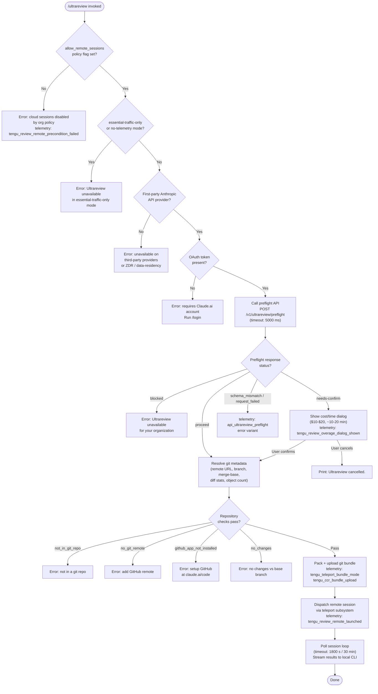

# `/ultrareview`

> Analysis basis: CC v2.1.170 bundle.js (AST extraction + Claude interpretation)
> Minimum version: v2.1.170

---

## Overview

`/ultrareview` launches a cloud-hosted agent session that autonomously finds and verifies bugs in the current git branch. It performs a multi-phase preflight (policy, auth, repository, git-bundle upload) before dispatching a remote orchestrator session on Claude Code's web infrastructure. The command runs entirely on Anthropic's first-party cloud — estimated cost $10–$20 USD and duration ~10–20 minutes — and streams results back to the local CLI.

---

## Registration

| Field | Value |
|---|---|
| type | `local-jsx` |
| name | `ultrareview` |
| description | `"Start a cloud agent that finds and verifies bugs in your branch ( … , … USD) · Runs in Claude Code on the web. See …"` |
| loc_byte | `12404491` |
| loc_byte_end | `12404762` |
| loc_line | `8688` |
| module_id | `T9K` |
| load_inline | `true` |
| arbor_handler.name | `wpf` |
| arbor_handler.fqn | `claude-2.1.170::wpf` |
| arbor_handler.kind | `AsyncFunction` |
| arbor_handler.resolution_path | `module_id` |
| arbor_handler.n_hits | `1` |

Analysis basis: CC v2.1.170 bundle.js:+12404491

---

## Input Branching

The command has 6+ distinct guard branches (policy, telemetry mode, auth, ZDR/third-party, preflight API status, overage dialog, repository/git checks, GitHub-app check) before reaching the remote dispatch. A Mermaid flowchart is used.



---

## Behavioral Spec

### Phase 0 — Policy and Remote-Session Guard

```
async function ultrareviewHandler(args, appState):
    // Check org policy flag
    if not appState.settings["allow_remote_sessions"]:
        emit error("Cloud sessions are disabled by your organization's policy. ...")
        record telemetry("tengu_review_remote_precondition_failed")
        return

    // Random jitter delay (Math.random * 2, setTimeout)
    await jitter()
```

Analysis basis: CC v2.1.170 bundle.js:+12402146, +12402149, +12402181

---

### Phase 1 — Parse CLI Arguments

```
function parseUltrareviewArgs(rawArgs):
    // Trim and split input; build normalized arg set
    argSet = trimAndSplit(rawArgs)
    // Recognized tokens: "fix", "comment", "/code-review ultra"
    hasFix    = argSet.has("fix")        // --fix flag
    hasComment = argSet.has("comment")
    // Validate no unknown flags; record config telemetry
    record telemetry("tengu_review_bughunter_config", {hasFix, hasComment})
    return {hasFix, hasComment}
```

Analysis basis: CC v2.1.170 bundle.js:+12402347, +12364422, +12364428, +12364507

---

### Phase 2 — Telemetry-Mode and Auth Checks

```
function checkTelemetryAndAuth(appState):
    trafficMode = getTelemetryMode()  // "essential-traffic", "no-telemetry", "default"

    if trafficMode in ["essential-traffic-only", "no-telemetry"]:
        return {ok: false,
                reason: "Ultrareview runs in Claude Code on the web and is
                         unavailable when essential-traffic-only mode is active."}

    provider = getApiProvider()
    if provider.type != "firstParty" or provider.flags["zdr"] or
       provider.flags["data_residency"]:
        return {ok: false,
                reason: "Ultrareview runs in Claude Code on the web and is
                         unavailable on third-party providers."}

    oauthToken = getOAuthToken()
    if not oauthToken:
        return {ok: false, reason: "no-auth",
                message: "Ultrareview requires a Claude.ai account. Run /login to authenticate."}

    return {ok: true, token: oauthToken}
```

Analysis basis: CC v2.1.170 bundle.js:+12402362, +12363021, +12363168, +12363301, +12362985, +12363129, +12363140

---

### Phase 3 — Preflight API Call

```
async function callUltrareviewPreflight(token, orgUuid):
    response = await httpPost("/v1/ultrareview/preflight",
                              headers: {"teleport-org": orgUuid},
                              timeout: 5000)  // ms

    record telemetry("api_ultrareview_preflight", {status: response.status})

    switch response.body.status:
        case "blocked":
            return {action: "block",
                    message: "Ultrareview is unavailable for your organization."}
        case "needs-confirm":
            return {action: "confirm", costRange: "$10-$20", duration: "~10–20 min"}
        case "proceed":
            return {action: "proceed", sessionConfig: response.body}
        case "schema_mismatch":
            return {action: "error", reason: "schema_mismatch"}
        default:
            return {action: "error", reason: "request_failed"}
```

Analysis basis: CC v2.1.170 bundle.js:+12362891, +12362925, +12362948, +12362667, +12363512, +12363540, +12363701, +12367546, +12367727, +12367764, +12367926

---

### Phase 4 — Overage / Cost Confirmation Dialog

```
async function showOverageConfirmation(costRange, duration):
    record telemetry("tengu_review_overage_dialog_shown")
    confirmed = await promptUser(
        message: "This review costs " + costRange + " and takes " + duration,
        choices: ["confirm", "cancel"]
    )
    if not confirmed:
        print("Ultrareview cancelled.")
        record telemetry("tengu_review_overage_blocked")
        return false
    return true
```

Analysis basis: CC v2.1.170 bundle.js:+12402478, +12402817, +12402623, +12403125

---

### Phase 5 — Git Metadata and Repository Eligibility

```
async function resolveGitMetadata():
    // Verify inside a git work-tree
    gitCheck = run("git rev-parse --is-inside-work-tree")
    if failed: return {eligible: false, reason: "not_in_git_repo"}

    // Fetch remote URL; scrub credentials ("://***@")
    remoteUrl = run("git config --get remote.origin.url")
    if not remoteUrl: return {eligible: false, reason: "no_git_remote",
                              message: "Cloud agents require a GitHub remote. ..."}

    // Determine default branch (symbolic-ref refs/remotes/origin/HEAD → main/master)
    defaultBranch = resolveDefaultBranch()
    // Current branch (git branch --abbrev-ref HEAD)
    currentBranch = run("git branch --abbrev-ref HEAD")

    // Merge base
    mergeBase = run("git merge-base", currentBranch, defaultBranch)

    // Diff stats (--shortstat) and object count (git count-objects -v)
    diffStats  = run("git diff --shortstat", mergeBase)
    objectInfo = run("git count-objects -v")
    // Object count limit: 100 objects or 5 000 000 bytes triggers tengu_ccr_bundle_max_bytes
    if objectCount > 100 or objectBytes > 5000000:
        record telemetry("tengu_ccr_bundle_max_bytes")

    // GitHub check: access token + org UUID required
    githubOk = checkGithubAppInstalled(token, orgUuid)
    if not githubOk: return {eligible: false, reason: "github_app_not_installed",
                              message: ". Please setup GitHub on https://claude.ai/code"}

    return {eligible: true, remoteUrl, currentBranch, defaultBranch, mergeBase, diffStats}
```

Analysis basis: CC v2.1.170 bundle.js:+12402362, +9220135, +9220147, +1113215, +1116220, +1124201, +1124216, +9252436, +9252452, +9252858, +9252877, +9220249, +9220282, +9220395, +9347151, +9347386

---

### Phase 6 — Git Bundle Upload (Teleport)

```
async function uploadGitBundle(repoInfo, token, orgUuid):
    // Pack repository into a .bundle file (seed: refs/seed/stash + refs/seed/root)
    // Strategy: attempt HEAD bundle; fallback to squashed; then fallback_squashed
    bundleMode = determineBundleMode()  // head | fallback_head | squashed | fallback_squashed
    record telemetry("tengu_teleport_bundle_mode", {mode: bundleMode})

    bundlePath = writeTmpBundle("ccr-seed" + ".bundle")
    uploadResult = await httpPut(presignedUrl, bundlePath,
                                 headers: {"x-organization-uuid": orgUuid,
                                           "anthropic-beta": "ccr-byoc-2025-07-29"})
    record telemetry("tengu_ccr_bundle_upload", {
        status: uploadResult.status,    // success | upload_failed | stash_failed | empty_repo
        mode: bundleMode
    })

    if uploadResult.status != "success":
        return {ok: false, reason: uploadResult.status}

    cleanup(bundlePath)
    return {ok: true, bundleRef: bundleMode}
```

Analysis basis: CC v2.1.170 bundle.js:+9255435, +9255536, +9255554, +9255924, +9256373, +9257038, +9257187, +9257339, +9272006, +9272028, +9345201

---

### Phase 7 — Remote Session Dispatch

```
async function dispatchRemoteSession(sessionConfig, repoInfo, opts):
    // Build session creation payload
    payload = {
        type:          "ultrareview",
        sourceMode:    resolveSourceMode(repoInfo),  // bundle | git_repository | explicit_env_bundle
        remoteUrl:     repoInfo.remoteUrl,
        branch:        repoInfo.currentBranch,
        mergeBase:     repoInfo.mergeBase,
        orgUuid:       orgUuid,
        permissionMode: "none",
        // Inject fix instruction if --fix flag present
        systemSuffix:  opts.hasFix
                         ? " The user passed --fix: when the findings arrive, apply them..."
                         : "",
        envId:         selectedEnvironmentId    // from teleport env-select phase
    }

    // POST to cloud session API
    response = await httpPost(cloudSessionEndpoint, payload,
                              headers: {
                                  "anthropic-beta":       "ccr-byoc-2025-07-29",
                                  "x-organization-uuid": orgUuid,
                                  "Content-Type":        "application/json",
                                  "anthropic-version":   "2023-06-01"
                              })

    if response.status == 401 or 403 or 429:
        return {ok: false, reason: "create_request_failed"}
    if response.status == 201 and not response.body.sessionId:
        return {ok: false, reason: "malformed_response",
                message: "Server returned a malformed session response (no session id)"}

    record telemetry("tengu_review_remote_launched")
    return {ok: true, sessionId: response.body.sessionId}
```

Analysis basis: CC v2.1.170 bundle.js:+12368118, +12369650, +9272720, +9273215, +9273305, +9273373, +9273377, +9273381, +9273424, +9273600, +9273751, +9273814, +12370931, +12401885

---

### Phase 8 — Session Polling Loop

```
async function pollRemoteSession(sessionId, opts):
    startTime = Date.now()
    TIMEOUT_MS = 1800000   // 30 minutes (bundle.js:+9353714)
    POLL_INTERVAL_MS = 1000

    loop:
        if Date.now() - startTime > TIMEOUT_MS:
            return {ok: false, reason: "cloud session exceeded 30 minutes"}

        status = await getSessionStatus(sessionId)

        switch status.phase:
            case "running" | "starting":
                // stream partial assistant messages to CLI
                streamAssistantContent(status.messages)
                await sleep(POLL_INTERVAL_MS)
                continue
            case "completed":
                // Extract result block (findLast message with type="result")
                result = findLastResult(status.messages)
                if not result:
                    return {ok: false, reason: "no review output — orchestrator may have exited early"}
                applyResultToLocalCLI(result, opts.hasFix)
                record telemetry("tengu_ccr_session_link", {sessionId})
                return {ok: true}
            case "archived" | "idle":
                return {ok: false, reason: "cloud session returned an error"}
            case "hook_progress" | "hook_response" | "hook_started":
                forwardHookEvent(status)
                await sleep(POLL_INTERVAL_MS)
                continue

    // On launch failure
    if launchFailed:
        print("Ultrareview failed to launch the cloud session. Check that this is a GitHub repo and try again.")
        record telemetry("tengu_review_remote_teleport_failed")
```

Analysis basis: CC v2.1.170 bundle.js:+9353714, +9353707, +9354158, +9354233, +9354721, +9354904, +9354933, +9355340, +9355424, +9355514, +9355741, +9356315, +9356355, +9356391, +12370410, +12401997

---

### Phase 9 — Environment Selection (Teleport env-select)

```
async function selectTeleportEnvironment(token, orgUuid):
    // phase logged: "[teleport] phase: env-select"
    envList = await listRemoteEnvironments(token, orgUuid, timeout: 15000)

    if envList is empty:
        // Attempt auto-create of default environment
        created = await createDefaultEnvironment(token, orgUuid)
        if not created:
            warn("Could not create a cloud environment. Set one up at https://claude.ai/code/onboarding?magic=env-setup")
            record telemetry("env_create", {reason: "no_default_env"})
            return {ok: false}
        envList = [created]

    // Default env spec: python 3.11, node 20, home /home/user
    // Use "bridge" type for BYOC environments
    selectedEnv = envList[0]
    if selectedEnv is null:
        return {ok: false, reason: "no_environments",
                message: "No environments available for session creation"}

    return {ok: true, envId: selectedEnv.id}
```

Analysis basis: CC v2.1.170 bundle.js:+9273952, +9218547, +9274217, +9274321, +9275130, +9275196, +9275238, +9275355, +9219247, +9219277, +9219353, +9219415, +9219432, +9219446, +9219461

---

### Constraint: First-Party Provider Only

The command unconditionally rejects non-first-party API providers (ZDR, data-residency, third-party keys). The policy flag `allow_remote_sessions` is also checked independently.

Analysis basis: CC v2.1.170 bundle.js:+2511180, +2511453, +2511488, +12363129, +12363140, +12363168

---

### Constraint: Repository Size Limits

| Limit | Value | Source |
|---|---|---|
| Max git objects (count-objects) | 100 objects | bundle.js:+9252858 |
| Max git object bytes | 5,000,000 bytes | bundle.js:+9252877 |
| Estimated cost | $10–$20 USD | bundle.js:+12362180 |
| Estimated duration | ~10–20 min | bundle.js:+12362273 |
| Session hard timeout | 1,800 s (30 min) | bundle.js:+9353714 |
| Preflight API timeout | 5,000 ms | bundle.js:+12362948 |
| Env list timeout | 15,000 ms | bundle.js:+9218547 |

---

## State & Side Effects

| Item | Detail |
|---|---|
| Telemetry: `tengu_review_remote_precondition_failed` | Fired when `allow_remote_sessions` policy blocks the command (bundle.js:+12364554) |
| Telemetry: `tengu_review_bughunter_config` | Fired after arg parse; records `hasFix`/`hasComment` flags (bundle.js:+12362063) |
| Telemetry: `tengu_ccr_bundle_max_bytes` | Fired when repo exceeds object count/size limits (bundle.js:+9252351) |
| Telemetry: `tengu_ccr_bundle_seed_enabled` | Fired when seed-bundle strategy is active (bundle.js:+9345674) |
| Telemetry: `tengu_ccr_bundle_upload` | Fired with upload status/mode after bundle upload attempt (bundle.js:+9255728) |
| Telemetry: `tengu_teleport_bundle_mode` | Fired with chosen bundle mode (head/squashed/etc.) (bundle.js:+9272350) |
| Telemetry: `tengu_ccr_session_link` | Fired on successful session completion, records sessionId (bundle.js:+9265711) |
| Telemetry: `tengu_teleport_source_decision` | Fired with source-mode decision (bundle.js:+9277801) |
| Telemetry: `tengu_review_remote_teleport_failed` | Fired when the teleport/launch step fails (bundle.js:+12370410) |
| Telemetry: `tengu_review_remote_launched` | Fired on successful cloud session dispatch (bundle.js:+12370931) |
| Telemetry: `tengu_review_overage_blocked` | Fired when user cancels the cost confirmation dialog (bundle.js:+12402480) |
| Telemetry: `tengu_review_overage_dialog_shown` | Fired when the cost/time confirmation dialog is displayed (bundle.js:+12402817) |
| Telemetry: `tengu_feature_ok` / `tengu_feature_sad` | General feature success/error events (bundle.js:+1014205, +1014348) |
| Telemetry: `api_ultrareview_preflight` | Fired with preflight API call outcome (bundle.js:+12363512) |
| Telemetry: `teleport_git_bundle_upload` | Lower-level bundle-upload event (bundle.js:+9255435) |
| Telemetry: `teleport_environments_list` | Fired during environment enumeration (bundle.js:+9217912) |
| Telemetry: `teleport_default_environment_create` | Fired when a default env is auto-created (bundle.js:+9218832) |
| Telemetry: `teleport_generate_title` | Fired when a session title is LLM-generated (bundle.js:+9259117) |
| Git bundle temp file | Written to OS temp dir as `ccr-seed<random>.bundle`; cleaned up after upload (bundle.js:+9256731, +9256742) |
| Seed refs | `refs/seed/stash` and `refs/seed/root` created and deleted during bundle packaging (bundle.js:+9255536, +9255554) |
| `_source_seed.bundle` | Intermediate seed bundle artifact removed via `J16.unlink` (bundle.js:+9257683, +9257038) |
| appState changes | Remote session ID and status tracked in appState; background session label `"background session"` emitted (bundle.js:+16566640) |
| Hook registration | Remote session registers `control_request`, `set_permission_mode`, `apply_flag_settings`, `focus`, `SessionStart` event types via `bWq` (bundle.js:+9270340, +9270417, +9270623, +9270664, +9355514) |
| Sound | Not found in depth-2 traversal |
| Admin link | `/admin-settings/` URL surfaced when policy blocks the command (bundle.js:+12402602) |

---

## Version History

| Version | Change |
|---|---|
| v2.1.170 | Initial analysis |

---

## Common Mistakes

1. **Running without a Claude.ai OAuth login**: `/ultrareview` requires a Claude.ai account OAuth token; an `ANTHROPIC_API_KEY` alone is insufficient. Run `/login` first.
2. **Using a third-party or ZDR API provider**: The command hard-exits on any non-first-party provider. Switch to the default Anthropic provider before invoking the command.
3. **Invoking in a repository without a GitHub remote**: The git remote must be a GitHub URL. A local-only or non-GitHub remote will be rejected with an explicit error. Use `git remote add origin REPO_URL`.
4. **Running in a repository with no commits**: An empty repository triggers the `empty_repo` guard. Commit at least one change (`git add . && git commit -m "initial"`) before running.
5. **Running without branch changes relative to the default branch**: If `git diff --shortstat <merge-base>` reports no changes, the command returns `no_changes`. Ensure your feature branch has commits not yet in `main`/`master`.
6. **Org policy not configured**: If `allow_remote_sessions` is `false` (enterprise/team default), only an organization admin can enable it at `/admin-settings/`.
7. **Cancelling the cost dialog and expecting work to proceed**: Dismissing the `$10-$20` confirmation dialog cleanly cancels the run; no partial work is dispatched.

---

## Appendix — Identifier Mapping

> For bundle debugging only. Identifiers change across versions.

| Identifier | Role |
|---|---|
| `wpf` | Main handler — async entry point for `/ultrareview` (Arbor: `claude-2.1.170::wpf`) |
| `u9` | Remote-session eligibility check (policy, telemetry mode, auth) |
| `gb1` | Auth / provider guard sub-function |
| `FNH` | Provider-type and telemetry-mode classifier |
| `FC` | First-party provider check; emits `firstParty`/tier literals |
| `DJ6` | Reads org/team config from disk (`readFileSync`, utf-8); checks `enterprise`/`team` tiers |
| `nLH` | Checks `allow_product_feedback` and telemetry flags |
| `hq` | Traffic-mode resolver (`essential-traffic`, `no-telemetry`, `default`) |
| `ImA` | Telemetry-mode string normalizer |
| `_6` | String coercion utility |
| `ULH` | Policy-flag string formatter |
| `q` | Configuration data loader (reads `data` field; 1024-byte limit) |
| `Y1` | Error exit helper (writes `cli_error`, calls `process.exit`) |
| `JpH` | Console error printer with red formatting |
| `aj` | File-based error record writer (`writeFileSync`) |
| `H` | Jitter delay utility (`Math.random * 2`, `setTimeout`) |
| `A9K` | CLI argument parser for `/ultrareview` (`fix`, `comment` tokens) |
| `Rm8` | Arg token normalizer (trim, split, replace) |
| `A` | Token lowercase transformer |
| `f` | Stream/connection close manager |
| `L` | Async task set manager (add/delete/finally) |
| `zv` | Shell-special-character escaper (`\$&` replacement) |
| `K` | Column formatter (map + padEnd, `"  "` separator) |
| `M` | MCP server manager / state container |
| `aSH` | MCP connection orchestrator (multi-transport: stdio, sse, http, ws-ide) |
| `Ic8` | MCP update applier (`applyMcpUpdate`; handles orphaned connections) |
| `N` | Message formatter / normalizer (uppercase, trim, locale) |
| `$` | Feature-flag lookup helper |
| `IPA` | MCP server info aggregator (`getClients`, retry logic) |
| `k5A` | Git metadata resolver (remote URL, branch, merge-base, diff stats, PR check) |
| `M16` | Git work-tree verifier (`rev-parse --is-inside-work-tree`) |
| `C6` | Git context store accessor |
| `oi6` | AsyncLocalStorage `.getStore()` wrapper |
| `W_` | Cross-zone string transfer utility |
| `p_` | Shell command runner (spawns subprocesses, handles `error` exit codes) |
| `eVH` | Process spawner core (env setup, stdio binding, abort signal) |
| `D` | Forced-shutdown handler (`process.exit`, `z.abort`, `"forced shutdown"`) |
| `Ey4` | String coercion for process output |
| `j3` | Process output line parser |
| `V8` | Process result validator |
| `hH` | Shell-command error handler (logs via `go.logError`) |
| `d` | Feature-flag state reader |
| `XC` | Remote URL fetcher/cache (`git config --get remote.origin.url`; caches in `vQH`) |
| `$c` | Remote URL cache lookup |
| `Cr6` | Cached remote URL getter (`C4H.get "remoteUrl"`) |
| `NQH` | Credential scrubber (`://***@` replacement) |
| `t6H` | URL parser (scheme detection, split/match for `https`/`github.com`) |
| `HFA` | URL component splitter (includes/split) |
| `f9` | URL substring extractor (indexOf/slice) |
| `RWq` | Git object-count checker (`git count-objects -v`; 100/5 000 000 limits) |
| `SWq` | Object-count parser (runs `git count-objects -v`, extracts numeric fields) |
| `hWq` | Repository size/eligibility gate |
| `Y6` | Repository eligibility checker (flags: `policy_blocked`, `not_logged_in`, `byoc`, etc.) |
| `b8` | Shell runner for git sub-commands |
| `QI` | Default-branch resolver via `git symbolic-ref --short refs/remotes/origin/HEAD` |
| `x1_` | Cached default-branch getter (`C4H.get "defaultBranch"`) |
| `nw` | Current-branch resolver via `git branch --abbrev-ref HEAD` |
| `C1_` | Cached current-branch getter (`C4H.get "branch"`) |
| `O` | Background session state container |
| `S8` | Background session status reporter (`"stopped"`) |
| `Vo_` | Diff-stat numeric extractor (`parseInt`, `match`) |
| `s1K` | Repository diff-stat builder |
| `dmH` | Cost/time estimator; emits `$10-$20` / `~10–20 min` |
| `y5A` | Preflight API caller (`/v1/ultrareview/preflight`) |
| `e1K` | Preflight response router (`proceed`/`blocked`/`needs-confirm`/`schema_mismatch`) |
| `Q6` | JSON parser wrapper |
| `v5A` | Preflight response validator |
| `s6` | Feature-event success recorder (`tengu_feature_ok`) |
| `K6` | Feature-event error recorder (`tengu_feature_sad`) |
| `SH` | Feature-event success side-effect runner |
| `cmH` | Cost dialog display helper |
| `B16` | Subscription / billing type checker |
| `iZ` | Account type resolver |
| `jJH` | Subscription plan inspector |
| `gL` | Billing info fetcher |
| `IY` | Account info getter |
| `h6` | Session metadata container |
| `NA` | User account record accessor |
| `RC` | Account-type array checker (`Array.isArray`) |
| `bh` | User role checker (`max`, `pro`, `admin`, `billing`, `owner`, `primary_owner`) |
| `wq` | Role membership tester |
| `O$_` | Role predicate helper |
| `$$_` | Role predicate helper (secondary) |
| `GHH` | Overage/cost estimator lookup |
| `Dpf` | Main teleport-to-remote dispatcher |
| `h5A` | Core teleport function (env-select → bundle → POST → poll) |
| `X0H` | Remote-eligibility preflight |
| `D0q` | Remote-eligibility checker (policy_blocked, not_logged_in, byoc, not_in_git_repo, etc.) |
| `E` | Parallel async task runner (`Math.max`/`Math.min` concurrency) |
| `G` | MCP tool set runner |
| `J3H` | Session header renderer |
| `a1K` | Alternative cost estimator |
| `Ui` | Teleport session creation and polling orchestrator |
| `sL` | Session link formatter |
| `_O` | UI overlay manager |
| `VI8` | Session UI widget constructor |
| `CC` | Cloud session creator (HTTP POST + response handler) |
| `o1` | OAuth endpoint validator (`local`/`staging`/`prod`; `CLAUDE_CODE_CUSTOM_OAUTH_URL`) |
| `Aw` | Auth header builder (`anthropic-version`, `Content-Type`, etc.) |
| `Nt_` | Git bundle uploader (`teleport_git_bundle_upload`; stash/seed refs; upload to presigned URL) |
| `v6` | Zone/context value accessor |
| `f6` | Feature flag reader (wraps `ff6`) |
| `bWq` | Control-event dispatcher (`control_request`, `set_permission_mode`, `apply_flag_settings`, `focus`) |
| `Oh6` | Session info formatter |
| `CH` | JSON stringifier wrapper |
| `CWq` | Session-link telemetry emitter (`tengu_ccr_session_link`) |
| `$I8` | Session-state checker |
| `Ge` | Environment lister (`teleport_environments_list`) |
| `f16` | Default environment creator (`teleport_default_environment_create`) |
| `EH` | Error message string coercer |
| `Q1f` | Session title generator (`teleport_generate_title`; Zod schema: `claude/task`) |
| `HS` | Repository size gate (wraps `Y6` with `Boolean` coercion) |
| `AxH` | GitHub app installation checker (`checkGithubAppInstalled`) |
| `z9` | Cancellation / abort signal handler |
| `o` | MCP server reconnection / update loop |
| `jA` | Error wrapper (`Error`, `String`) |
| `xz` | Axios cancel-token detector |
| `Lz` | Session log writer |
| `JxH` | Remote agent session poller (1000 ms interval; 1 800 000 ms timeout) |
| `_y` | Random-bytes generator (`NJK.randomBytes`, 8 bytes) |
| `rA6` | Browser/webview opener (`CHH.open`) |
| `NW` | Session timestamp recorder (`Date.now`, `$$`) |
| `Z9f` | Session status formatter |
| `X0q` | Session event processor (completed/archived/idle/hook_progress/result) |
| `P0H` | Session cleanup handler |
| `ZD` | Session teardown sequencer |
| `Ypf` | Result-message mapper (`H.map`) |
| `I5A` | Post-session cancellation emitter (`"Ultrareview cancelled."`) |