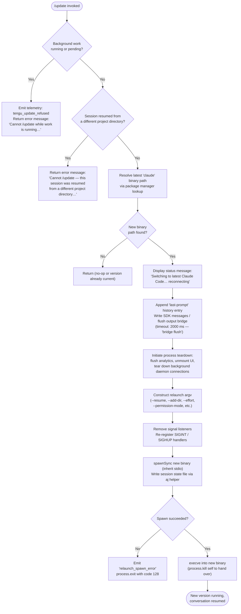

# `/update`

> Analysis basis: CC v2.1.170 bundle.js (AST extraction + Claude interpretation)
> Minimum version: v2.1.170

---

## Overview

The `/update` command performs an in-place upgrade of the running Claude Code CLI to the latest installed version while keeping the current conversation alive. It validates preconditions (no background work in flight, session directory alignment), tears down the current process bridge, and uses `execve`-style process replacement (spawning the new binary with `--resume`) so the conversation transcript is preserved across the version boundary.

---

## Registration

| Field | Value |
|---|---|
| type | `local` |
| name | `update` |
| description | `Switch to the latest version (conversation continues)` |
| supportsNonInteractive | `false` |
| isHidden | `true` |
| module_id | `zMK` |
| load_inline | `true` |
| loc_byte | `12839220` |
| loc_byte_end | `12839461` |
| loc_line | `9133` |
| arbor_handler.name | `tQf` |
| arbor_handler.fqn | `claude-2.1.170::tQf` |
| arbor_handler.kind | `AsyncFunction` |
| arbor_handler.resolution_path | `module_id` |
| arbor_handler.n_hits | `0` |

Analysis basis: CC v2.1.170 bundle.js:+12839220

---

## Input Branching

The command follows 4+ distinct execution branches (precondition checks → teardown → relaunch), requiring a Mermaid flowchart.



---

## Behavioral Spec

### 1. Handler Entry Point (`tQf`)

`tQf` is an `AsyncFunction` resolved via `module_id → zMK` in the Arbor symbol graph.

Analysis basis: CC v2.1.170 bundle.js:+12837108

```
async function updateCommandHandler(context):
    # Step 1: detect role of current process
    processRole = detectProcessRole(context)   // X9 → _wH; literals "bg","daemon","daemon-worker"
    
    # Step 2: check for active or pending background work
    workStates = collectActiveWorkStates(context)  // Object.values at +12837345
    if any workState in ["running", "pending"]:    // literals +12837383, +12837405
        emitTelemetry("tengu_update_refused")      // +12837122
        return errorMessage(
            "Cannot /update while work is running in the background — wait for it to finish, then try again."
        )                                          // literal +12837486
    
    # Step 3: verify session project-directory alignment
    currentDir = getSessionWorkingDirectory(context)   // x_ → H.getAppState, literal "working_directory" +10615216
    resumeDir  = getResumedProjectDirectory(context)   // z$ → H.getAppState
    if directoryMismatch(currentDir, resumeDir):
        return errorMessage(
            "Cannot /update — this session was resumed from a different project directory. Restart manually with --resume to continue on the latest version."
        )                                              // literal +12837730
    
    # Step 4: locate the latest binary
    latestBinaryPath = resolveLatestBinary("claude")   // Up8 → rM → HRA → Bun.which; literal "claude" +12837025
    versionedPaths   = buildVersionedSearchPaths()     // OR → Tk8 → a5H → WX8; literals "versions","bin",".local","share"
    
    if latestBinaryPath is null:
        return   # nothing to do
    
    # Step 5: emit user-visible status
    emitTextMessage("Switching to latest Claude Code… reconnecting")  // literal +12838242
    
    # Step 6: record last-prompt history entry
    appendHistoryEntry(context, "last-prompt")   // x3A → _.appendEntry; literal +13367741
    
    # Step 7: generate a new session UUID for the resumed session
    newSessionId = generateUUID()                // $MK → pp8.randomUUID; +12838095
    
    # Step 8: flush the output bridge with timeout
    bridgeFlushResult = awaitWithTimeout(
        outputBridge.flush(),                    // O.flush +12838312
        timeoutMs = 2000,                        // literal +12838322
        label     = "bridge flush"               // literal +12838327
    )                                            // QL → setTimeout / Promise.race / clearTimeout
    
    # Step 9: write final SDK messages before teardown
    outputBridge.writeSdkMessages(context)       // O.writeSdkMessages +12838218
    outputBridge.teardown()                      // O.teardown +12838363
    
    # Step 10: prepare relaunch via WTH (processRelaunchOrchestrator)
    relaunchResult = await processRelaunchOrchestrator(
        newBinaryPath  = latestBinaryPath,
        sessionId      = newSessionId,
        sessionContext = buildRelaunchContext(context),   // fp8 → builds argv array
        timeouts       = { flush: 30000, cleanup: ..., analytics: ... }
    )
    
    return relaunchResult
```

Analysis basis: CC v2.1.170 bundle.js:+12837108 – +12838632

---

### 2. Binary Resolution (`Up8` / `rM` / `OR`)

```
function resolveLatestClaudeBinary():
    # Try Bun.which("claude") — finds first "claude" on PATH
    systemPath = bunWhich("claude")   // rM → HRA → Bun.which; +12837022

    # Build versioned candidate paths under ~/.local/share/versions/
    homeDir        = os.homedir()                       // WX8 → mc9.homedir +6884320
    versionsDir    = path.join(homeDir, ".local", "share", "versions")  // literals +6884593,+6884602,+9526472
    binCandidates  = listVersionedBinaries(versionsDir)  // Tk8 → N$,IxH.join,a5H +9526428

    # Also check the canonical bin directory
    localBinDir    = path.join(homeDir, ".local", "share", "bin")  // T1H +6884639; literal "bin" +6884673
    
    return selectNewestBinary([systemPath, ...binCandidates, localBinDir])  // OR → N$ +9526634
```

Analysis basis: CC v2.1.170 bundle.js:+12837022, +12837075

---

### 3. Process Relaunch Orchestrator (`WTH`)

```
async function processRelaunchOrchestrator(newBinaryPath, sessionId, argv, timeouts):
    # Stat the new binary to confirm it is accessible
    await fs.stat(newBinaryPath)            // WTH → QKK.stat +12560154
    
    # Stop interval-based UI refresh
    stopUiRefresh()                         // Fv6 → qQ_ → clearInterval +7340138

    # Unmount the Ink/React UI
    unmountTerminalUI()                     // sRH → H.unmount +7338504

    # Write final terminal output (restore cursor, etc.)
    writeTerminalOutput()                   // wM8 → Ns.writeSync +3831998
    
    # Drain pending analytics / hook events
    await drainAnalytics()                  // pBH → LTA.drain +62371
    
    # Flush pending hook-registry entries with timeout (30 000 ms)
    await awaitWithTimeout(
        hookRegistryFlush(),                // HZ → e4 +13370656
        timeoutMs = 30000,                  // literal +12560273
        label     = "flush timeout (relaunch)"  // literal +12560279
    )

    # Run cleanup tasks with timeout
    await awaitWithTimeout(
        cleanupTasks(),                     // label "cleanup timeout" +12560335
        ...
    )

    # Flush analytics with timeout
    await awaitWithTimeout(
        analyticsFlush(),                   // label "analytics flush timeout" +12560391
        ...
    )

    # Build the full execve environment
    newEnv = buildExecveEnvironment(context)   // BKK → Object.entries +12559614

    # Change directory to project root if needed
    if not path.isAbsolute(projectDir):
        projectDir = path.join(process.cwd(), projectDir)  // BKK → UKK.isAbsolute +12559223
    process.chdir(projectDir)                              // BKK → process.chdir +12559279

    # Remove existing signal listeners and re-register minimal handlers
    process.removeAllListeners()            // +12560775
    process.on("SIGINT",  noopHandler)      // +12560805; literal "SIGINT" +12560746
    process.on("SIGHUP",  noopHandler)      //            literal "SIGHUP" +12560765

    # Spawn the new binary synchronously with inherited stdio
    spawnResult = spawnSync(
        newBinaryPath,
        argv,                               // includes "--resume", "--add-dir", session flags
        { stdio: "inherit" }                // literal "inherit" +12560867
    )                                       // gKK.spawnSync +12560832

    # Persist session metadata for the new process
    writeSessionStateFile(sessionId)        // aj → $FH.writeFileSync +194949

    if spawnResult.error:
        emitLiteral("relaunch_spawn_error") // literal +12561057
        process.exit(128)                   // literal +12561194

    # Hand over by killing the parent (triggers execve on supported platforms)
    process.exit(spawnResult.status)        // +12561081
    process.kill(process.pid, "SIGTERM")    // +12561146; literal "SIGTERM"
```

Analysis basis: CC v2.1.170 bundle.js:+12560060 – +12561146

---

### 4. Relaunch Argument Construction (`fp8`)

```
function buildRelaunchArgv(context):
    argv = Array.from(baseArgv)             // fp8 → Array.from +12561555

    # Re-attach original CLI arguments
    for each cliArg in originalCliArgs:     // literal "cliArg" +12561630
        argv.push(cliArg)

    # Inject --resume with the current session ID
    argv.push("--resume", sessionId)        // literal "--resume" +12560206; literal "session" +12561651

    # Inject additional directories
    for each dir in addDirs:
        argv.push("--add-dir", dir)         // literal "--add-dir" +12561730

    # Propagate permission / effort flags if set
    if bypassPermissions:
        argv.push("--allow-dangerously-skip-permissions")  // literal +12561845
    if effort is set:
        argv.push("--effort", effort)                      // literal "--effort" +12561987
    if permissionMode is set:
        argv.push("--permission-mode", permissionMode)     // literal "--permission-mode" +12562004

    # Filter out flags incompatible with resumed sessions
    argv = argv.filter(isCompatibleWithResume)   // fp8 → q.includes +12561834
    argv = argv.flatMap(expandCompositeFlags)     // fp8 → A.flatMap  +12561949

    return argv
```

Analysis basis: CC v2.1.170 bundle.js:+12561555 – +12561949

---

### 5. Session State Inspection (`x_` / `z$`)

```
function getSessionWorkingDirectory(appState):
    # Find the last message that contains a working_directory field
    lastMsg = appState.findLast(
        msg => msg has "working_directory"       // literal +10615216
    )                                            // x_ → A.findLast +10615191
    return lastMsg?.working_directory

function getResumedProjectDirectory(appState):
    # Read project directory from the original resume context
    return appState.getAppState("working_directory")   // z$ → H.getAppState +10615947
```

Analysis basis: CC v2.1.170 bundle.js:+10615111, +10615947

---

## State & Side Effects

| Item | Detail |
|---|---|
| Telemetry — `tengu_update_refused` | Fired when `/update` is blocked because background work is `running` or `pending` (bundle.js:+12837122) |
| Telemetry — `tengu_scroll_summary` | Fired during terminal-UI scroll operations triggered inside relaunch teardown (bundle.js:+7340260) |
| Telemetry — `tengu_amber_creek` | Fired from fullscreen-mode path inside `Z1` during teardown (bundle.js:+3490662) |
| Telemetry — `tengu_pewter_brook` | Fired from alternate fullscreen path inside `Z1` (bundle.js:+3490570) |
| Telemetry — `tengu_bg_dispatch_sigkill_escalate` | Fired if a background worker requires a SIGKILL escalation during daemon teardown (bundle.js:+16529701) |
| Telemetry — `tengu_daemon_control` | Fired during daemon stop steps inside `z → ih` (bundle.js:+16566763) |
| Telemetry — `tengu_bg_spare_enable/claim/claim_fail` | Fired during spare-worker lifecycle in `w → W2A` (various offsets) |
| Telemetry — `tengu_bg_low_mem_mb` / `tengu_bg_dispatch_low_mem` | Fired when memory headroom is low during background cleanup (bundle.js:+13199943, +16530302) |
| Telemetry — `tengu_disable_bypass_permissions_mode` | Fired when bypass-permissions mode is disabled before relaunch (bundle.js:+4247357) |
| Telemetry — `tengu_config_parse_error` | Fired if the versioned-binary config file cannot be parsed (bundle.js:+3308597) |
| Telemetry — `tengu_feature_ok` / `tengu_feature_bad` | Terminal-feature probe results emitted in `SH`/`xH` (bundle.js:+1014205, +1014267) |
| appState changes | `_.setAppState` is called (+12838132) to record a new session ID / resume context before the process replaces itself |
| Output bridge | `O.writeSdkMessages`, `O.flush`, `O.teardown` are called in sequence to drain all pending output (bundle.js:+12838218, +12838312, +12838363) |
| Hook registration | `x3A → e4 → N9 → LTA.register` registers a "last-prompt" history entry before teardown; `pBH → LTA.drain` drains hooks during relaunch (+62328, +62371) |
| UI unmount | `sRH → H.unmount` unmounts the Ink terminal UI (+7338504) |
| Interval clear | `Fv6 → qQ_ → clearInterval` stops the UI refresh loop (+7340138) |
| Session state file | `aj → $FH.writeFileSync` persists resume metadata to disk (+194949) |
| Process signals | `process.removeAllListeners()` then re-register `SIGINT`/`SIGHUP` (+12560775, +12560805) |
| Process exit / exec | `process.exit` or `process.kill` hands control to the new binary (+12561081, +12561146) |
| Sound | <!-- TODO: not found in depth-2 traversal; needs --depth 4 --> |

---

## Version History

| Version | Change |
|---|---|
| v2.1.170 | Initial analysis |

---

## Common Mistakes

1. **Running `/update` with active background tasks** — The command is blocked when any task is in `running` or `pending` state. Wait for all background work to complete before issuing `/update`.
2. **Resuming from a mismatched directory and then running `/update`** — If the session was started with `--resume` pointing to a different project directory than the current working directory, `/update` will refuse and instruct the user to restart manually with `--resume`.
3. **Expecting `/update` to be visible in the command list** — The command is registered with `isHidden: true`; it does not appear in `/help` or autocomplete menus.
4. **Using `/update` in non-interactive (scripted) mode** — `supportsNonInteractive: false` means this command is unavailable in headless or piped invocations.
5. **Assuming the conversation is lost after `/update`** — The relaunch argv always includes `--resume` with the current session ID, so the conversation transcript is carried forward into the new process.
6. **Confusing `/update` with a package-manager upgrade** — The command selects the latest locally-installed binary (searching `~/.local/share/versions/` and `~/.local/share/bin/`) and replaces the running process; it does **not** download a new version from the network.

---

## Appendix — Identifier Mapping

> For bundle debugging only. Identifiers change across versions.

| Identifier | Role |
|---|---|
| `tQf` | Main async handler for `/update` (Arbor-resolved, `AsyncFunction`) |
| `Up8` | Binary resolution coordinator — locates the "claude" binary |
| `rM` | Calls `HRA` to probe `Bun.which("claude")` |
| `HRA` | Wraps `Bun.which` for binary path lookup |
| `OR` | Builds versioned binary candidate list and selects newest |
| `Tk8` | Enumerates entries under the versioned-install directory |
| `N$` | `Array.isArray` guard used in version-list filtering |
| `a5H` | Resolves `~/.local/share/versions` path via `WX8` + `YV6.join` |
| `WX8` | Wraps `os.homedir()` |
| `T1H` | Resolves `~/.local/share/bin` path |
| `X9` | Detects current process role (bg / daemon / daemon-worker) |
| `_wH` | Role-classification helper called by `X9` |
| `d` | Shared logger / debug utility |
| `Jj` | Computes display name for the current binary via `path.basename` |
| `v6` | General async/deferred utility used throughout the handler |
| `xZ` | Low-level deferred/promise primitive |
| `Vy` | Path resolution helper |
| `XMA` | Resolves the executable's installation directory via `path.dirname` |
| `W_` | Helper wrapping `xZ` for path operations |
| `P4` | Another `xZ`-backed path helper |
| `oqH` | Reads or validates work-queue state |
| `NHH` | Checks work-item attachment/hook state via `wsf.has` |
| `EB8` | Work-item state extractor used by `NHH` |
| `x3A` | Appends "last-prompt" entry to history before relaunch |
| `e4` | Hook registry entry creator |
| `N9` | Registers hooks with `LTA.register` |
| `_` | App-state / registry accessor (provides `getAppState`, `setAppState`, `appendEntry`, etc.) |
| `hH` | Output-bridge manager (writeSdkMessages, flush, teardown, logError) |
| `jA` | Error-wrapping utility |
| `_6` | Stringification helper |
| `hq` | Telemetry filter (essential-traffic / no-telemetry / default) |
| `ImA` | Calls `_6` for telemetry payload construction |
| `lN4` | Circular buffer shift/push for log history |
| `r0` | Builds the assistant-prefixed message block before relaunch |
| `O` | Output-bridge object exposing `writeSdkMessages`, `flush`, `teardown`, `S8` |
| `S8` | SDK message serialiser used by `O` |
| `$MK` | UUID generator using `pp8.randomUUID` |
| `QL` | `awaitWithTimeout` wrapper using `setTimeout` / `Promise.race` / `clearTimeout` |
| `RjH` | Coerces values to `String` for message construction |
| `WTH` | Process-relaunch orchestrator — teardown, spawnSync, execve |
| `Fv6` | Stops the UI refresh interval via `qQ_` |
| `qQ_` | Clears an interval with `clearInterval` |
| `sRH` | Terminal UI teardown: `H.unmount`, `Kb`, `wM8` |
| `H` | Ink/React renderer instance |
| `Kb` | Post-unmount cleanup helper |
| `wM8` | Writes terminal escape sequences (`\x1b7`, `\x1b8`) and performs final tty output |
| `_yH` | Terminal capability probe (Ghostty ≥1.2.0, iTerm2 ≥3.6.6 detection) |
| `ikH` | Additional tty-output helper |
| `X0` | Handles tmux escape-sequence doubling (`\x1b\x1b`) |
| `j3` | Terminal output utility |
| `N` | ANSI/colour output formatter |
| `j28` | Scroll-summary renderer during teardown |
| `uT` | Scroll-summary data accessor |
| `ca9` | Scroll-summary content builder |
| `da9` | Timing/metrics calculator (Date.now, Math.max, Math.round) |
| `ga9` | Metrics accumulator used by `da9` |
| `Z1` | Fullscreen / terminal-mode teardown (fires `tengu_amber_creek`, `tengu_pewter_brook`) |
| `B6H` | Checks `jz4` feature-flag set |
| `LZ_` | String formatter using `_6` |
| `Ms` | Calls `gbL` for mode selection |
| `KZ_` | Platform-check helper (Windows detection) |
| `Q_` | Calls `PB` for permission-mode teardown |
| `QbL` | Calls `Y6` for UI-component disposal |
| `Y6` | React/Ink component lifecycle helper |
| `HZ` | Wraps `e4` for hook-registry flush |
| `pBH` | Drains the hook/analytics queue via `LTA.drain` |
| `eRH` | Promise-race helper used in cleanup |
| `w28` | Cleanup-phase timeout helper |
| `BKK` | `execve` / environment builder: chdir, require, dlopen, Buffer.from, `M.execve` |
| `f` | FFI module handle (bun:ffi) |
| `A` | Process/module registry map |
| `q` | Active-connection set |
| `L` | Connection lifecycle manager |
| `$` | Spawn-record push helper |
| `f$K` | Spawn-record entry constructor |
| `w` | Background worker / daemon session manager |
| `b` | Individual background task descriptor |
| `o8` | Abort-on-timeout helper |
| `xH` | Terminal feature probe — OK path |
| `SH` | Terminal feature probe — bad path |
| `dU8` | Low-memory check helper calling `Y6` |
| `oW6` | Reads and parses versioned-binary config file |
| `Q` | Permission-queue with `retireIfSettled` |
| `W2A` | Spare-worker claim / IPC-socket connection manager |
| `v2A` | Worker lifecycle state machine (done/killed/failed/crashed/working/active/idle) |
| `D` | Forced-shutdown handler (`process.exit`, `z.abort`) |
| `V8` | State serialiser |
| `K6` | Calls `ff6` — low-level utility |
| `F` | Resource handle with `.dispose` |
| `M` | MCP connection manager (`aSH`, `Ic8`, `IPA`, `M.execve`) |
| `aSH` | MCP server connection builder (stdio/sse/http/sse-ide/ws-ide) |
| `Ic8` | Applies MCP update, calls `H.applyMcpUpdate` |
| `IPA` | MCP client-state sync and retry logic |
| `z` | Daemon process wrapper (`SH`, `xH`, `ih`, `ZU`) |
| `ih` | Daemon control message sender (`nu`, `UNH`, `Ww_`) |
| `ZU` | Graceful-shutdown race (`Promise.race`, `Promise.all`, `process.exit`) |
| `EH` | String-coercion error helper |
| `aj` | Writes session-state JSON to disk via `$FH.writeFileSync` |
| `fp8` | Constructs the relaunch argv array |
| `YZH` | CLI-argument filter for resume compatibility |
| `Y98` | Boolean-coerces feature flags via `h6` |
| `h6` | Configuration file accessor / binary-backup manager |
| `n6` | Config path resolver |
| `hT_` | Config schema validator |
| `B7H` | Config file reader with backup/migration logic |
| `BSL` | Watches config file for changes |
| `x_` | Finds last `working_directory` message in appState |
| `NR8` | Extracts `allowed_tools` from session state |
| `$1` | Session-flag extractor |
| `IR8` | Extracts `disallowed_tools` from session state |
| `Xb` | Checks `bypassPermissions` / `disable` flag via `Y6` and `FA` |
| `z$` | Reads `working_directory` from top-level appState |

---

Note: index built via Arbor fallback; some signals (telemetry, literals) may be missing — see arbor-fallback.js.