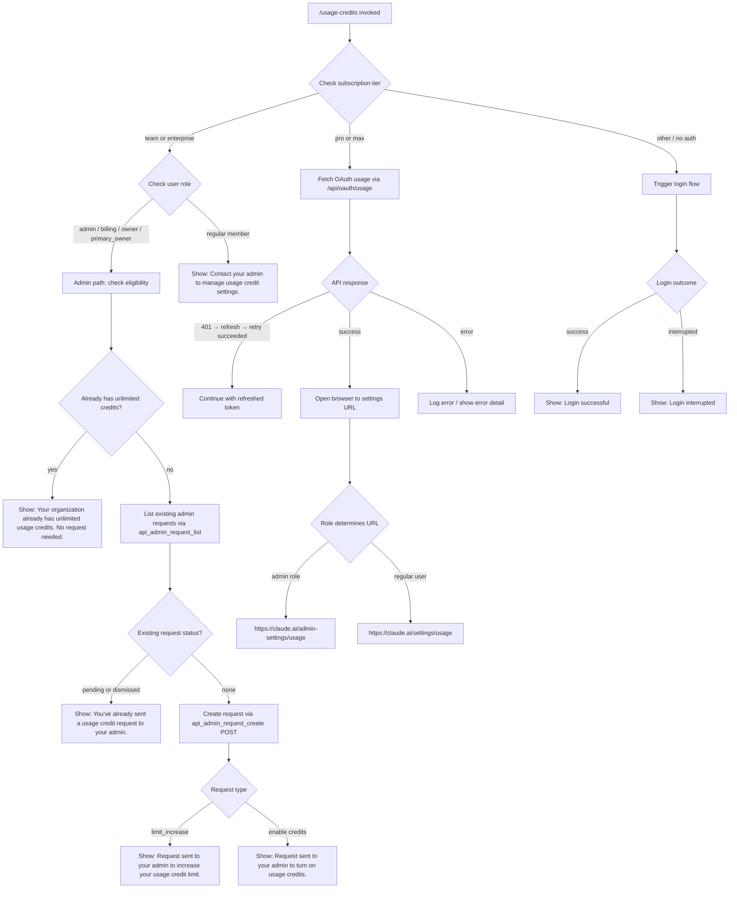

# `/usage-credits`

> Analysis basis: CC v2.1.170 bundle.js (AST extraction + Claude interpretation)
> Minimum version: v2.1.170

---

## Overview

`/usage-credits` is a local-jsx slash command that helps users configure or request usage credits when they encounter rate limits or usage caps on Claude.ai subscriptions (Pro/Max plans). It communicates with the Anthropic OAuth API to check eligibility, list existing admin requests, and submit new credit-increase requests, then optionally opens a browser to a relevant settings page.

---

## Registration

| Field | Value |
|---|---|
| type | `local-jsx` |
| name | `usage-credits` |
| description | `Configure usage credits to keep working when you hit a limit` |
| loc_byte | `9595369` |
| loc_byte_end | `9595579` |
| loc_line | `4123` |
| module_id | `ee_` |
| load_inline | `true` |
| arbor_handler.name | `qS6` |
| arbor_handler.fqn | `claude-2.1.170::qS6` |
| arbor_handler.kind | `AsyncFunction` |
| arbor_handler.resolution_path | `module_id` |
| arbor_handler.n_hits | `0` |

Analysis basis: CC v2.1.170 bundle.js:+9595369

---

## Input Branching

The command involves 5+ distinct execution paths depending on subscription tier, role, existing credit state, and API responses. A Mermaid flowchart is used.



Analysis basis: CC v2.1.170 bundle.js:+9593591, +9547798, +9547810, +9548046, +9548205, +9548440, +9548679, +9548745

---

## Behavioral Spec

### Handler Entry Point (`qS6`)

The main async handler (`qS6`) is resolved via `module_id → ee_` by the Arbor symbol graph.

```
async function handleUsageCredits(context):
    subscriptionTier = getSubscriptionInfo()   // checks "pro" / "max"
    authState        = getAuthState()
    networkClient    = buildNetworkClient()
    experimentFlags  = resolveExperiments()    // tengu_ember_latch fired here

    if subscriptionTier in ["pro", "max"]:
        result = await runUsageCreditFlow(context, authState, networkClient)
    else if subscriptionTier in ["team", "enterprise"]:
        result = await runAdminRequestFlow(context, authState, networkClient)
    else:
        result = await triggerLoginFlow(context)

    renderJSX(result)
```

Analysis basis: CC v2.1.170 bundle.js:+9593591, +9593602, +9593613, +9593638

---

### Subscription & Auth Resolution (`authStateResolver`)

Calls `wq` to determine the current auth profile, then inspects provider tags (`bedrock`, `foundry`, `anthropicAws`, `mantle`, `vertex`, `firstParty`) to decide routing.

```
function resolveAuthAndProvider(config):
    profile = loadAuthProfile(config)           // O$_, $$_ helpers
    provider = classifyProvider(profile)        // checks bedrock/foundry/vertex/etc.
    oauthProfile = detectOAuthProfile(profile)  // user_oauth, profile-implicit

    if provider is firstParty and oauthProfile:
        return { tier: subscriptionTier, role: userRole }
    else:
        return { tier: "external", role: null }
```

Analysis basis: CC v2.1.170 bundle.js:+3262736, +2106005, +2106055, +2106111, +3240341, +3240414

---

### OAuth Usage Fetch (`fetchOAuthUsage`)

Makes a GET request to `/api/oauth/usage` with a 5000 ms timeout. If a 401 is received, it attempts a token refresh and retries once.

```
async function fetchOAuthUsage(httpClient, authToken):
    response = await httpClient.get("/api/oauth/usage", {
        timeout: 5000,
        headers: { "Content-Type": "application/json" },
        authMode: "no-auth"    // token injected separately
    })

    if response.status == 401:
        await refreshAuthToken()
        response = await httpClient.get("/api/oauth/usage", ...)
        // On success: appends " (401→refresh→retry succeeded)" to log
        return response

    if isAxiosError(response) and response.status >= 500:
        raise extractErrorDetail(response)   // reads "detail" field

    return response
```

Constants:
- API endpoint: `/api/oauth/usage` (bundle.js:+9547010)
- Timeout: 5000 ms (bundle.js:+9547038)
- Retry suffix message: `" (401→refresh→retry succeeded)"` (bundle.js:+9547253)
- HTTP 401 triggers refresh (bundle.js:+3280008)
- HTTP 403 also classified as auth error (bundle.js:+3280036)
- HTTP 500 threshold for server errors (bundle.js:+9547456)

Analysis basis: CC v2.1.170 bundle.js:+9547010, +9547038, +9547152, +9547253, +9547456

---

### Eligibility Check (`checkAdminEligibility`)

Calls `api_admin_request_eligibility` to determine whether the organization already has unlimited credits.

```
async function checkAdminEligibility(httpClient, orgUUID):
    result = await httpClient.get("api_admin_request_eligibility", { orgUUID })

    if result.hasUnlimitedCredits:
        return { status: "already_unlimited",
                 message: "Your organization already has unlimited usage credits. No request needed." }

    // check teleport-org flag for eligibility gating
    if result.teleportOrg:
        return { status: "ineligible" }

    return { status: "eligible" }
```

Analysis basis: CC v2.1.170 bundle.js:+9546513, +9546661, +9548046

---

### List Existing Admin Requests (`listAdminRequests`)

Fetches existing credit requests filtered by `statuses: ["pending", "dismissed"]` to avoid duplicates.

```
async function listAdminRequests(httpClient, orgUUID):
    response = await httpClient.get("api_admin_request_list", {
        params: { statuses: ["pending", "dismissed"] }
    })

    if response.requests.length > 0:
        return { alreadySent: true,
                 message: "You've already sent a usage credit request to your admin." }

    return { alreadySent: false, requests: response.requests }
```

Constants:
- API key: `api_admin_request_list` (bundle.js:+9546162)
- Status filter: `"pending"`, `"dismissed"` (bundle.js:+9548371, +9548381)
- Duplicate message (bundle.js:+9548440)

Analysis basis: CC v2.1.170 bundle.js:+9546162, +9546265, +9548371, +9548381, +9548440

---

### Create Admin Request (`createAdminRequest`)

POSTs to `/api/oauth/organizations/:orgUUID/admin_requests` with a request type of `limit_increase`.

```
async function createAdminRequest(httpClient, orgUUID, requestType):
    response = await httpClient.post(
        "/api/oauth/organizations/:orgUUID/admin_requests",
        { type: requestType }   // "limit_increase"
    )

    if requestType == "limit_increase":
        return "Request sent to your admin to increase your usage credit limit."
    else:
        return "Request sent to your admin to turn on usage credits."
```

Constants:
- Endpoint: `/api/oauth/organizations/:orgUUID/admin_requests` (bundle.js:+9545954)
- Request type: `"limit_increase"` (bundle.js:+9548141)
- Success messages (bundle.js:+9548679, +9548745)

Analysis basis: CC v2.1.170 bundle.js:+9545897, +9545954, +9548141, +9548679, +9548745

---

### Role-Based Access Gating (`roleGate`)

Users on team/enterprise plans are checked for privileged roles before being allowed to submit requests. Non-privileged users see an advisory message.

```
function checkUserRole(userRole):
    privilegedRoles = ["admin", "billing", "owner", "primary_owner"]

    if userRole in privilegedRoles:
        return ALLOW
    else:
        return DENY with message:
            "Contact your admin to manage usage credit settings."
```

Constants:
- Privileged roles (bundle.js:+2111556, +2111564, +2111574, +2111582)
- Deny message (bundle.js:+9548205)

Analysis basis: CC v2.1.170 bundle.js:+2111556, +2111574, +9548205

---

### Browser Launch (`launchBrowser`)

After a successful flow on Pro/Max, opens the relevant settings URL in the default system browser. The URL is role-dependent.

```
function openSettingsInBrowser(isAdmin):
    url = isAdmin
        ? "https://claude.ai/admin-settings/usage"
        : "https://claude.ai/settings/usage"

    platform = process.platform
    if platform == "darwin":
        spawn("open", [url])
    else if platform == "win32":
        spawn("rundll32", ["url,OpenURL", url])
    else:
        spawn("xdg-open", [url])

    log("browser-opened")
```

Constants:
- Admin URL: `https://claude.ai/admin-settings/usage` (bundle.js:+9549046)
- User URL: `https://claude.ai/settings/usage` (bundle.js:+9549087)
- macOS command: `"open"` (bundle.js:+6232041)
- Windows command: `"rundll32"` / `"url,OpenURL"` (bundle.js:+6231967, +6231979)
- Linux command: `"xdg-open"` (bundle.js:+6232048)
- Log tag: `"browser-opened"` (bundle.js:+9549154)

Analysis basis: CC v2.1.170 bundle.js:+9549046, +9549087, +6231867, +6231883

---

### Login Fallback Flow (`loginFallback`)

When no valid OAuth session exists, the command initiates a fresh login before proceeding.

```
async function loginFallback(context):
    print("Starting new login following /usage-credits. Exit with Ctrl-C to use existing account.")
    result = await triggerOAuthLogin()

    if result.success:
        onChangeAPIKey(newKey)
        print("Login successful")
    else:
        print("Login interrupted")
```

Constants:
- Prompt string (bundle.js:+9594070)
- Success message: `"Login successful"` (bundle.js:+9594195)
- Interrupt message: `"Login interrupted"` (bundle.js:+9594214)

Analysis basis: CC v2.1.170 bundle.js:+9594070, +9594195, +9594214

---

### Error Handling (`axiosErrorClassifier`)

The `$Eq` helper classifies Axios errors. HTTP 429 triggers rate-limit handling. `"OAuth token has been revoked"` is a special case triggering reauthentication.

```
function classifyError(error):
    if not isAxiosError(error):
        raise error

    status = error.response.status
    if status == 401 and body contains "OAuth token has been revoked":
        return ERROR_REVOKED_TOKEN
    if status == 429:
        return ERROR_RATE_LIMITED
    if status >= 500:
        return ERROR_SERVER
    return ERROR_OTHER
```

Constants:
- Revocation message (bundle.js:+3280102)
- HTTP 401 (bundle.js:+3280008), 403 (bundle.js:+3280036), 429 (bundle.js:+178719)

Analysis basis: CC v2.1.170 bundle.js:+9547373, +3280008, +3280102, +178719

---

### Experiment / Feature-Flag Resolution (`experimentResolver`)

The `tengu_ember_latch` telemetry event fires during GrowthBook experiment resolution at handler entry. Feature flags may gate portions of the UI or eligibility flows.

```
function resolveExperiments(userId, orgId):
    experimentKey = generateHexKey(32 bytes)  // f69.randomBytes(32).toString("hex")
    uuid = Xw_.randomUUID()
    event = { type: "GrowthbookExperimentEvent", ... }

    if environment == "production":
        emit(event via Na.emit)
        fire("growthbook_experiment" telemetry)

    latch("tengu_ember_latch")
    return resolvedFlags
```

Constants:
- Key byte length: `32` (bundle.js:+3312594)
- Key encoding: `"hex"` (bundle.js:+3312607)
- Event type: `"GrowthbookExperimentEvent"` (bundle.js:+2501811)
- Environment guard: `"production"` (bundle.js:+2501665)

Analysis basis: CC v2.1.170 bundle.js:+9593638, +2501811, +2501665, +3312594

---

## State & Side Effects

| Item | Detail |
|---|---|
| Telemetry | `tengu_ember_latch` (bundle.js:+9593638) — fired at experiment latch during handler init |
| Telemetry | `tengu_feature_ok` (bundle.js:+1014205) — fired when feature flag check passes |
| Telemetry | `tengu_feature_bad` (bundle.js:+1014267) — fired when feature flag check fails |
| API calls | GET `/api/oauth/usage` (timeout 5000 ms) |
| API calls | GET `api_admin_request_eligibility` |
| API calls | GET `api_admin_request_list` (filter: pending/dismissed) |
| API calls | POST `/api/oauth/organizations/:orgUUID/admin_requests` |
| Browser | Opens `https://claude.ai/admin-settings/usage` (admin) or `https://claude.ai/settings/usage` (user) |
| Auth side-effect | `_.onChangeAPIKey` called after successful login (bundle.js:+9594172) |
| Error logging | `go.logError` called on network failures (bundle.js:+1019997) |
| GrowthBook | Emits `growthbook_experiment` event via `Na.emit` in production (bundle.js:+2502216) |
| History buffer | `lN4` manages a bounded FIFO history queue (push/shift via `di6`) |
| Retry logic | 401 response triggers token refresh and single retry |

---

## Version History

| Version | Change |
|---|---|
| v2.1.170 | Initial analysis |

---

## Common Mistakes

1. **Running on unsupported subscription tiers.** The command is specifically designed for Pro, Max, Team, and Enterprise plans. Users on free tiers will be routed to the login fallback rather than a credit management flow.
2. **Expecting immediate credit activation.** For team/enterprise plans, the command only *requests* a credit change from an admin; it does not apply credits directly. The admin must approve the request.
3. **Using without a valid OAuth session.** The command requires OAuth authentication (`ANTHROPIC_API_KEY`, `ANTHROPIC_AUTH_TOKEN`, `CLAUDE_CODE_OAUTH_TOKEN`, or WIF env vars). API-key-only sessions may not have access to the `/api/oauth/usage` endpoint (bundle.js:+3244069).
4. **Non-admin users on team/enterprise expecting to submit requests.** Only users with roles `admin`, `billing`, `owner`, or `primary_owner` can submit credit requests. Regular members see an advisory to contact their admin.
5. **Duplicate request submission.** The command checks for existing `pending` or `dismissed` requests and will block a second submission with a notice rather than creating duplicates.
6. **Interrupting the login fallback.** If the user presses Ctrl-C during the login sub-flow, no credit management actions are taken and the session remains unchanged.

---

## Appendix — Identifier Mapping

> For bundle debugging only. Identifiers change across versions.

| Identifier | Role |
|---|---|
| `qS6` | Main async handler for `/usage-credits` (arbor_handler) |
| `wq` | Auth state / subscription info resolver |
| `O$_` | Auth profile loader (sub-helper of `wq`) |
| `$$_` | Secondary auth profile helper (sub-helper of `wq`) |
| `IY` | Auth classification / provider detection |
| `a7` | Argument parser / flag interpreter |
| `_6` | String utility / normalization helper |
| `Yg6` | Bare-flag handler (`--bare` flag processing) |
| `Aj` | Auth profile builder / OAuth profile classifier |
| `$88` | Network builder sub-helper |
| `biH` | Provider string classifier |
| `IB` | OAuth token file descriptor reader |
| `mv` | Flag settings resolver |
| `RC` | Array-based inclusion checker |
| `sL` | Provider route classifier (bedrock/foundry/vertex/etc.) |
| `r_` | Provider string normalizer |
| `$P` | Auth token extractor |
| `qO` | Core auth/provider resolution orchestrator |
| `WP6` | API key helper resolver |
| `hBH` | VSCode/claude-desktop environment detector |
| `ND6` | API key file descriptor reader |
| `h6` | Telemetry event emitter |
| `bC` | History slice utility (last 20 items) |
| `TP6` | Provider classification transformer |
| `iZ` | Initialization / state setup helper |
| `Y6` | Experiment / feature-flag gate |
| `uP6` | Experiment upstream fetcher |
| `mP6` | Experiment config mapper |
| `Lm` | GrowthBook feature resolver |
| `nu` | Network client factory |
| `mC` | HTTP client constructor |
| `D78` | Experiment deduplication / Set-based tracker |
| `Gw_` | GrowthBook experiment event emitter |
| `UNH` | Network helper sub-constructor |
| `uB` | Random hex key generator + session logger |
| `CH` | JSON serializer wrapper |
| `zwL` | Event payload builder |
| `WT_` | Experiment cache manager |
| `pC1` | Experiment persistence helper |
| `Q_` | Persistent store accessor |
| `lH9` | Experiment TTL manager |
| `B6H` | Experiment Set membership checker |
| `jJH` | Subscription type resolver (stripe/apple/google) |
| `gL` | Subscription classification helper |
| `NA` | Subscription object reader |
| `hq` | Network traffic classifier (essential-traffic/no-telemetry/default) |
| `ImA` | Traffic policy enforcer |
| `vk8` | Main usage-credit interactive flow orchestrator |
| `bh` | Team/enterprise role checker + advisory emitter |
| `k0H` | OAuth usage fetch + 401-retry handler |
| `gq` | HTTP request builder for OAuth endpoints |
| `_` | Base HTTP client instance |
| `SH` | HTTP success-path handler |
| `xH` | HTTP error-path handler |
| `HE` | Response role/array validator |
| `H` | Random delay / retry utility |
| `XE` | Axios error classifier (401/403 + revocation) |
| `RB` | Token refresh orchestrator |
| `N` | HTTP request dispatcher with auth injection |
| `PeK` | Request pre-processor (CI/dZA/MTA chain) |
| `u4` | URL builder / path resolver |
| `zFH` | Auth header formatter |
| `EeK` | File-based credential loader |
| `fEq` | Eligibility check API caller |
| `LEq` | Admin request list API caller |
| `A` | HTTP form/multipart builder |
| `f` | HTTP stream closer |
| `KEq` | Admin request create API caller (POST) |
| `$Eq` | Axios error detail extractor |
| `Lz` | Result message formatter |
| `EH` | String coercion wrapper |
| `hH` | Error logger / FIFO error history manager |
| `jA` | Error stringifier |
| `lN4` | Bounded FIFO history queue manager |
| `tK` | Browser launcher orchestrator |
| `PO7` | URL protocol validator (http/https guard) |
| `HD` | Platform detector for browser command |
| `b8` | Child-process spawner for browser open |
| `p_` | Process execution wrapper |
| `C6` | Process output collector |

---

Note: index built via Arbor fallback; some signals (telemetry, literals) may be missing — see arbor-fallback.js.