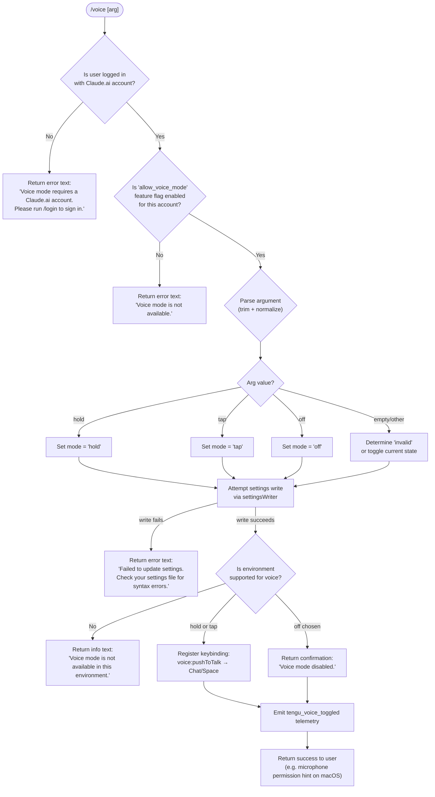

# `/voice`

> Analysis basis: CC v2.1.170 bundle.js (AST extraction + Claude interpretation)
> Minimum version: v2.1.170

---

## Overview

The `/voice` command toggles voice mode in Claude Code, allowing users to switch between `hold`, `tap`, and `off` sub-modes for voice input. It validates account authentication, feature availability, and environment support before applying the requested mode change to persistent settings, and emits a telemetry event on each successful toggle. Analysis basis: CC v2.1.170 bundle.js:+13155180

---

## Registration

| Field | Value |
|---|---|
| type | `local` |
| name | `voice` |
| description | `Toggle voice mode` |
| argumentHint | `[hold\|tap\|off]` |
| supportsNonInteractive | `false` |
| isHidden | `null` |
| module_id | `DYK` |
| load_inline | `true` |
| loc_byte | `13155180` |
| loc_byte_end | `13155422` |
| loc_line | `9674` |
| arbor_handler.name | `Lrf` |
| arbor_handler.fqn | `claude-2.1.170::Lrf` |
| arbor_handler.kind | `AsyncFunction` |
| arbor_handler.resolution_path | `module_id` |
| arbor_handler.n_hits | `1` |

Analysis basis: CC v2.1.170 bundle.js:+13155180

---

## Input Branching

The handler contains 5+ distinct logical branches depending on authentication state, feature flag, argument value, settings-write success, and environment availability, so a Mermaid flowchart is used.



Analysis basis: CC v2.1.170 bundle.js:+13152665 (handler entry `Lrf`), +13152582 (`hold`), +13152594 (`tap`), +13152605 (`off`), +13152626 (`invalid`), +13152693 (text return path), +13152706 (login required message), +13152805 (not available message), +13153093 (settings failure message), +13153231 (disabled confirmation), +13153475 (environment unavailable message)

---

## Behavioral Spec

### Authentication Gate

The handler first checks that the current session is authenticated as a Claude.ai first-party account. If not authenticated, it immediately returns an informational `text` block with the message "Voice mode requires a Claude.ai account…" without performing any further work.

```
function checkAuthentication(session):
    if session.authType != "firstParty":
        return { type: "text", text: LOGIN_REQUIRED_MESSAGE }
    return null  // proceed
```

Analysis basis: CC v2.1.170 bundle.js:+13152676 (`IY` call), +13152693 (`"text"` literal), +13152706 (login-required string), +2106293 (`"firstParty"` literal)

---

### Feature-Flag Check

After authentication, the handler evaluates the `allow_voice_mode` boolean feature flag from the account's capability set. If absent or false, a `"Voice mode is not available."` message is returned.

```
function checkVoiceModeFlag(userCapabilities):
    if not userCapabilities.has("allow_voice_mode"):
        return { type: "text", text: NOT_AVAILABLE_MESSAGE }
    return null
```

Analysis basis: CC v2.1.170 bundle.js:+13142774 (`"allow_voice_mode"` literal), +13152805 (not-available string), +13142816 (`c46` → `xU8` call chain), +13142823 (`ou6`), +13142830 (`uU8`)

---

### Argument Parsing

The raw argument string is trimmed (via the `argumentTrimmer` helper, bundle identifier `Krf`) and compared against the three recognised tokens.

```
function parseVoiceArg(rawArg):
    trimmed = rawArg.trim()
    if trimmed == "hold":   return "hold"
    if trimmed == "tap":    return "tap"
    if trimmed == "off":    return "off"
    return "invalid"   // or toggle based on current state
```

Known token literals: `"hold"` (bundle.js:+13152582), `"tap"` (bundle.js:+13152594), `"off"` (bundle.js:+13152605), `"invalid"` (bundle.js:+13152626).

Analysis basis: CC v2.1.170 bundle.js:+13152535 (`Krf` — `H.trim` call), +13152926 (second trim call in `Lrf`)

---

### Settings Write

The resolved mode is written to persistent settings via the settings-writer subsystem (call path `Lrf` → `e_` → settings I/O chain). On failure, the handler returns the error message "Failed to update settings…" without emitting telemetry.

```
async function writeVoiceModeSetting(mode):
    result = await settingsWriter.write({ voiceMode: mode })
    if result.error:
        return { type: "text", text: SETTINGS_WRITE_ERROR }
    return null
```

Analysis basis: CC v2.1.170 bundle.js:+13152995 (`e_` call), +13153093 (settings-failure string)

---

### Environment Check

After a successful settings write the handler verifies the runtime environment can actually support audio capture. On unsupported environments it returns `"Voice mode is not available in this environment."` but keeps the setting persisted.

```
function checkVoiceEnvironment():
    if not isAudioEnvironmentSupported():
        return { type: "text", text: ENV_UNAVAILABLE_MESSAGE }
    return null
```

On macOS the confirmation message includes the system path to grant microphone permission: `"System Settings → Privacy & Security → Microphone"` (bundle.js:+13153982).

Analysis basis: CC v2.1.170 bundle.js:+13153475 (env-unavailable string), +13153982 (macOS permissions hint), +13153291 (`Promise.resolve` — async path after settings write)

---

### Keybinding Registration (hold / tap modes)

When voice mode is set to `hold` or `tap`, the handler registers the push-to-talk keybinding action `"voice:pushToTalk"` in the `"Chat"` context bound to the `"Space"` key.

```
function registerVoiceKeybinding(mode):
    if mode in ["hold", "tap"]:
        keybindingManager.register({
            context: "Chat",
            key:     "Space",
            action:  "voice:pushToTalk"
        })
```

Analysis basis: CC v2.1.170 bundle.js:+13154441 (`uP` call), +13154444 (`"voice:pushToTalk"` literal), +13154463 (`"Chat"` literal), +13154470 (`"Space"` literal)

---

### Telemetry Emission

After the mode is applied successfully, a `tengu_voice_toggled` event is emitted (bundle.js:+13153176). The payload likely includes the new mode value. This event fires regardless of whether the mode is `hold`, `tap`, or `off`.

```
function emitVoiceToggled(mode):
    telemetry.emit("tengu_voice_toggled", { mode: mode })
```

Analysis basis: CC v2.1.170 bundle.js:+13153174 (`d` — telemetry dispatch), +13153176 (`tengu_voice_toggled` event)

---

### MCP State Refresh (`M` call)

Near the end of the handler, the MCP server state is refreshed (call `Lrf` → `M`). This re-applies any MCP connection changes that may be pending after the voice-mode settings write.

```
async function refreshMcpState():
    await mcpStateApplier()   // Lrf → M → aSH → ...
```

Analysis basis: CC v2.1.170 bundle.js:+13153750 (`M` call from `Lrf`)

---

## State & Side Effects

| Item | Detail |
|---|---|
| Telemetry — primary | `tengu_voice_toggled` (bundle.js:+13153176) — emitted on each successful toggle |
| Telemetry — feature lifecycle | `tengu_feature_ok` (+1014205), `tengu_feature_sad` (+1014348), `tengu_feature_bad` (+1014267) — generic feature-result events emitted by the shared feature wrapper |
| Telemetry — keybinding | `tengu_custom_keybindings_loaded` (+3918837), `tengu_keybinding_fallback_used` (+3927935) — emitted by the keybinding subsystem during push-to-talk binding |
| Settings mutation | Writes `voiceMode` field to user/project settings via async file I/O (`Fr6` / `WYH.writeFile` path) |
| Keybinding registration | Registers `voice:pushToTalk → Space` in the `Chat` context when mode is `hold` or `tap`; removed/not-registered when mode is `off` |
| MCP state refresh | Calls the MCP update applier (`M` → `aSH` → `Ic8`) after settings write |
| appState changes | Voice mode state is persisted to disk settings and reflected in the application's in-memory config via the settings-load subsystem (`PB` → `XB`) |
| Sound | <!-- TODO: not found in depth-2 traversal; needs --depth 4 --> |
| Hook registration | `N9` → `LTA.register` — telemetry/lifecycle hook registration observed in call graph (bundle.js:+62328) |
| Error handling | Settings parse errors surface `tengu_config_parse_error` (+3308597); auth-loss prevention triggers `tengu_config_auth_loss_prevented` (+3303113) |

---

## Version History

| Version | Change |
|---|---|
| v2.1.170 | Initial analysis |

---

## Common Mistakes

1. **Running `/voice` without a Claude.ai login** — The command will immediately fail with a login-required message. Run `/login` first to authenticate with a Claude.ai account.
2. **Passing an unrecognised argument** — Only `hold`, `tap`, and `off` are recognised tokens. Any other string is treated as `"invalid"` and may fall back to a toggle or no-op depending on current state.
3. **Expecting voice to work in unsupported environments** — Even if the setting write succeeds, the command will report that voice is unavailable when the runtime environment lacks audio capture support (e.g. headless CI servers, SSH sessions without audio forwarding).
4. **Ignoring the settings-file syntax error warning** — If a prior manual edit corrupted the settings JSON, `/voice` will write the new mode value but can fail silently on re-read; the error message instructs checking settings files for syntax issues.
5. **Missing microphone permission on macOS** — After enabling voice mode the terminal must have microphone access granted at `System Settings → Privacy & Security → Microphone`; the command hints at this path but does not open it automatically.

---

## Appendix — Identifier Mapping

> For bundle debugging only. Identifiers change across versions.

| Identifier | Role |
|---|---|
| `Lrf` | Main handler for `/voice` (AsyncFunction, arbor-resolved) |
| `c46` | Voice-mode availability checker (feature-flag + account check orchestrator) |
| `xU8` | Feature-flag gate sub-routine |
| `IY` | Authentication state resolver |
| `a7` | Auth token / credential accessor |
| `Aj` | OAuth / credential-chain builder |
| `sL` | First-party auth type evaluator |
| `qO` | API key / auth env-var resolver |
| `TP6` | Desktop-3P credential handler |
| `biH` | Auth state container helper |
| `jE` | Feature-set lookup helper |
| `ou6` | Account capability set accessor |
| `uU8` | `allow_voice_mode` flag reader |
| `u9` | Enterprise/team plan checker |
| `gb1` | Plan-tier feature resolver |
| `FC` | Credential flow coordinator |
| `hq` | Essential-traffic flag checker |
| `ULH` | Settings string accessor |
| `FNH` | Feature-flag resolution chain |
| `Q_` | Settings-load initiator |
| `PB` | Settings loader from disk |
| `bZ` | Settings schema validator |
| `_q` | Memory-usage sampler / perf hook registrar |
| `_q_` | Settings load telemetry wrapper |
| `C8` | File-based debug logger |
| `vz6` | Flag/policy settings merger |
| `JQA` | Settings key enumerator |
| `SYH` | Settings path resolver (user/project/local) |
| `jB` | Settings file writer utility |
| `YQA` | SDK inline settings handler |
| `XB` | Settings object builder |
| `W_` | Working directory resolver |
| `Krf` | Argument trimmer / mode-token parser |
| `e_` | Settings write executor (main write path) |
| `I$` | Settings path + builder combiner |
| `Hq_` | Settings aggregator (all layers) |
| `E2` | Project-root detector |
| `co` | File encoding detector |
| `r3` | Real-path resolver |
| `N` | Platform-aware path normaliser |
| `ai6` | File read helper with size limit |
| `k8` | ENOENT guard wrapper |
| `V8` | Error code extractor |
| `z9_` | Cache timestamp setter |
| `wvH` | Settings write path composer |
| `So6` | Settings path join utility |
| `xO6` | Atomic file writer (temp+rename) |
| `CH` | JSON serialiser wrapper |
| `hO` | Cache clear utility |
| `Fr6` | Gitignore-aware file writer |
| `C6` | Async-local-storage context reader |
| `oi6` | Store getter |
| `n1_` | File-lock helper |
| `Br6` | git check-ignore runner |
| `p_` | git process spawner |
| `ty4` | Path tilde-expander |
| `YFA` | ls-files git tracker checker |
| `DFA` | Excludesfile warning emitter |
| `Ru` | `.claude` settings path builder |
| `SH` | Telemetry helper — feature_ok emitter |
| `d` | Telemetry dispatcher (tengu events) |
| `K6` | Telemetry event constructor |
| `ff6` | Telemetry base event builder |
| `s6` | Telemetry helper — feature_sad emitter |
| `xH` | Telemetry helper — feature_bad emitter |
| `hH` | Error logger / fQH push helper |
| `jA` | Error string extractor |
| `_6` | String coercion utility |
| `lN4` | Rolling error-log queue manager |
| `M` | MCP state applier (post-settings refresh) |
| `aSH` | MCP server orchestrator |
| `pn` | MCP server config processor |
| `nE6` | MCP server name/label resolver |
| `kt` | MCP server connection manager |
| `Ag` | SDK-type MCP server builder |
| `zJ8` | MCP warning/error colour formatter |
| `cE6` | SSE/HTTP MCP connector |
| `vV` | MCP server version validator |
| `kY` | MCP version comparison helper |
| `Tm_` | MCP capability matcher |
| `F8` | MCP transport factory |
| `BZ6` | MCP server status aggregator |
| `Cg9` | MCP cache manager |
| `zU_` | MCP needs-auth cache reader |
| `yPH` | MCP config hash generator |
| `aD8` | MCP tool schema hasher |
| `sD8` | MCP config + schema hash combiner |
| `QP` | SHA-256 hash helper |
| `rD8` | MCP config equality checker |
| `y4` | MCP version tag extractor |
| `M8` | MCP debug log emitter |
| `bJ8` | MCP stdio/SSE/WS connection handler |
| `fX7` | MCP stdio transport builder |
| `Dc` | MCP transport wrapper |
| `sAH` | MCP server auth-URL handler |
| `tAH` | MCP tool-result processor |
| `$1H` | MCP OAuth server (local HTTP callback) |
| `feH` | MCP pending-auth store helper |
| `D` | Process exit / abort handler |
| `uJ8` | MCP reconnect cache invalidator |
| `Fn` | MCP reconnect orchestrator |
| `hu` | MCP transport close helper |
| `Y` | Supervisor / output-stream manager |
| `U7` | MCP error log emitter |
| `EH` | Error-to-string coercer |
| `MX7` | MCP connection race helper |
| `LX7` | MCP SSH environment detector |
| `xJ8` | MCP tool-call dispatcher |
| `LeH` | MCP pending-call getter |
| `MeH` | MCP needs-auth-map getter |
| `Fg9` | MCP reconnect + cache-update trigger |
| `m9` | Async-local-storage current-store getter |
| `Rj8` | MCP needs-auth cache path builder |
| `Rm_` | MCP reconnect result handler |
| `J` | Background-session process killer |
| `S` | Background-session spawn manager |
| `VN` | MCP skills telemetry emitter |
| `Y6` | MCP skills collector |
| `Gm_` | MCP server status colour helper |
| `W8` | Global config reader/writer |
| `mg9` | MCP connection mapper |
| `SF` | Async-iterator / stream processor |
| `CeH` | MCP port parseInt wrapper |
| `Cj8` | MCP retry-count parseInt wrapper |
| `Ic8` | MCP connection-result applier |
| `oSH` | MCP config-hash comparator |
| `pE` | MCP slot cleanup helper |
| `SeH` | MCP tool-hash comparator |
| `$` | Background-session roster accessor |
| `f$K` | Background-session daemon-status reader |
| `Xa` | Home-directory path resolver |
| `hu6` | Daemon status file path builder |
| `IPA` | MCP remote-server retry manager |
| `WJ8` | MCP server presence checker |
| `o8` | Async retry-with-timeout helper |
| `uP` | Keybinding loader and push-to-talk registrar |
| `dM8` | Keybinding config loader |
| `VyH` | keybindings.json parser and validator |
| `EN_` | Keybinding platform entry extractor |
| `TF` | Keybinding Y6/skills bridge |
| `K4` | Keybinding context matcher |
| `WfH` | keybindings.json path builder |
| `Q6` | JSON.parse wrapper |
| `FM8` | Keybinding block array validator |
| `pM8` | Keybinding platform-map builder |
| `Wf9` | Keybinding file-not-found handler |
| `GN_` | Keybinding duplicate-key detector |
| `TN_` | Keybinding action validator / filter |
| `cM8` | Keybinding normaliser |
| `IN_` | Keybinding structure checker |
| `NN_` | Keybinding voH entry validator |
| `zf9` | Keybinding platform-list mapper |
| `sgL` | Keybinding modifier-string builder |
| `f6` | Keybinding fallback event emitter |
| `EBH` | Language/locale normaliser |
| `h6` | Global config file watcher + accessor |
| `hT_` | Config hot-reload helper |
| `B7H` | Config file reader with backup |
| `ku` | Config string prefix stripper |
| `L69` | Config backup directory manager |
| `CT_` | Config backup path builder |
| `w` | Background-session worker manager |
| `b` | Background-session task scheduler |
| `dU8` | Low-memory session reaper |
| `oW6` | Worktree / project-file reader |
| `Q` | Permission classifier |
| `W2A` | Background-session socket claimer |
| `v2A` | Background-session lifecycle manager |
| `F` | Background-session finaliser |
| `BSL` | Config file-watcher (watchFile/unwatchFile) |
| `qF` | Config change debouncer |
| `N9` | Telemetry/lifecycle hook registrar |