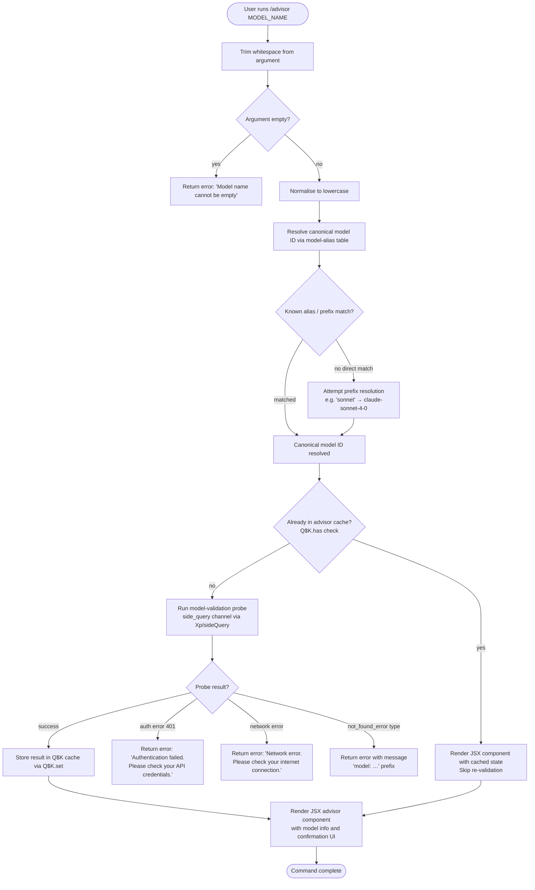

# `/advisor`

> Analysis basis: CC v2.1.172 bundle.js (AST extraction + Claude interpretation)
> Minimum version: v2.1.172

---

## Overview

The `/advisor` command lets the currently active Claude model consult a stronger or more capable model at key decision points during a session. It works by validating a target model name, running a model-validation probe to confirm the advisor model is accessible, and then wiring up a side-query channel so that subsequent turns can transparently delegate to the chosen advisor model. The command exposes a JSX-rendered UI component for interactive confirmation and feedback.

---

## Registration

| Field | Value |
|---|---|
| type | `local-jsx` |
| name | `advisor` |
| description | `Let Claude consult a stronger model at key moments` |
| module_id | `r$K` |
| load_inline | `true` |
| loc_byte | `12880514` |
| loc_byte_end | `12880755` |
| loc_line | `9135` |
| argumentHint | `null` |
| isHidden | `null` |
| arbor_handler.name | `Bn7` |
| arbor_handler.fqn | `claude-2.1.172::Bn7` |
| arbor_handler.kind | `AsyncFunction` |
| arbor_handler.resolution_path | `module_id` |
| arbor_handler.n_hits | `1` |

Analysis basis: CC v2.1.172 bundle.js:+12880514

---

## Input Branching

The command has more than three distinct branches (model name empty, model name invalid/unrecognised, authentication failure, network error, model not-found API error, advisor already active / cache hit, and success), so a Mermaid flowchart is used.



---

## Behavioral Spec

### Handler entry point — `advisorCommandHandler` (`Bn7`)

The Arbor-resolved handler is `Bn7` (AsyncFunction, resolved via `module_id → r$K`).

```
async function advisorCommandHandler(rawArgument, appContext):
    trimmedArg = rawArgument.trim()                          # Bn7 → A.trim  :+12879970
    if trimmedArg == "":
        return renderError("Model name cannot be empty")     # literal        :+12871569

    # Normalise and resolve model alias
    canonicalId = resolveModelAlias(trimmedArg)              # Bn7 → Q9       :+12880124

    # Build JSX element for the UI panel
    element = createElement(advisorPanel, {model: canonicalId, ...})  # :+12880006

    # Kick off model validation + side-query registration
    result = await runAdvisorSetup(canonicalId, appContext)  # Bn7 → Xm6     :+12880138

    # Render the resolved model list as a joined display string
    display = TN6.join(", ")                                 # Bn7 → TN6.join :+12880281

    return element
```

Analysis basis: CC v2.1.172 bundle.js:+12879970

---

### Model alias resolution — `resolveModelAlias` (`Q9`)

Accepts a raw (already lowercased) string and maps it to a canonical Claude model identifier. Multiple alias tiers are consulted in order.

```
function resolveModelAlias(input):
    trimmed = input.trim()                          # Q9 → H.trim   :+2259321
    lower   = trimmed.toLowerCase()                # Q9 → _.toLowerCase :+2259332

    # Tier 1: exact family aliases
    if lower == "fable":    return resolveByFamily("fable",    ...)   # literal :+2259398
    if lower == "opusplan": return resolveByFamily("opusplan", ...)   # literal :+2259462
    if lower == "sonnet":   return resolveSonnetFamily(lower)         # literal :+2259503
    if lower == "haiku":    return resolveHaikuFamily(lower)          # literal :+2259542
    if lower == "opus":     return resolveOpusFamily(lower)           # literal :+2259581
    if lower == "best":     return resolveBestPolicy()                 # literal :+2259616

    # Tier 2: timing / cache-control shorthand "[1m]"
    if lower contains "[1m]": return resolveTimingHint(lower)         # literal :+2259447

    # Tier 3: provider-qualified IDs (e.g. "anthropic.…", "claude-…")
    qualified = normaliseQualifiedId(lower)        # Q9 → HW, rD6   :+2259557

    # Tier 4: fallback via provider lookup table
    return lookupProviderModel(qualified)          # Q9 → fLH, oZ1  :+2259413
```

Known canonical model strings found in traversal (non-exhaustive):
- `claude-opus-4-0` (bundle.js:+3236577)
- `claude-sonnet-4-0` (bundle.js:+3236600)
- `claude-opus-4-1`, `claude-opus-4-5`, `claude-opus-4-6` (bundle.js:+3236770–3236816)
- `claude-sonnet-4-5`, `claude-sonnet-4-6`, `claude-haiku-4-5` (bundle.js:+3236864–3236914)
- `claude-fable-5` (bundle.js:+2253730)
- `claude-mythos-5` (bundle.js:+2253782)

Analysis basis: CC v2.1.172 bundle.js:+2259321

---

### Advisor setup and model validation — `runAdvisorSetup` (`Xm6`)

Performs pre-flight validation against the Anthropic API, manages a persistent advisor cache, and registers the side-query channel.

```
async function runAdvisorSetup(canonicalId, appContext):
    trimmed = canonicalId.trim()                        # Xm6 → H.trim   :+12871532
    if trimmed == "":
        return error("Model name cannot be empty")      # literal         :+12871569

    lower = trimmed.toLowerCase()                       # Xm6 → A.toLowerCase :+12871717

    # Reject explicitly disabled advisor strings
    if lower in DISABLED_MODELS:                        # Xm6 → cNH.includes  :+12871736
        if lower == "off" or lower == "unset":          # literals             :+12880046, :+12880057
            clearAdvisorConfig()
            return

    # Check the in-memory advisor cache (keyed by model ID)
    if advisorCache.has(lower):                         # Xm6 → Q$K.has  :+12871838
        return getCachedAdvisorEntry(lower)

    # Run the side-query validation probe
    probeResult = await runSideQueryProbe(lower, appContext)  # Xm6 → Xp :+12871883

    if probeResult.error:
        handleValidationError(probeResult.error)              # see error branches below

    # Store validated entry
    advisorCache.set(lower, probeResult)                # Xm6 → Q$K.set  :+12872046

    # Write the configuration alias mapping
    writeAdvisorAliases(probeResult)                    # Xm6 → yn7      :+12872087

    return probeResult
```

Analysis basis: CC v2.1.172 bundle.js:+12871532

---

### Side-query probe — `runSideQueryProbe` (`Xp`)

Sends a lightweight ping request to confirm the advisor model is reachable before committing the configuration.

```
async function runSideQueryProbe(modelId, context):
    # Build the API client for this side query
    client = buildApiClient(context)                    # Xp → $F        :+13733046
    client.fetchImpl = globalThis.fetch                 # Xp → globalThis.fetch :+13733131

    # Compute a stable hash for deduplication / caching
    requestHash = hashRequest(modelId)                  # Xp → lDA (uses AWK.createHash sha256) :+13673822

    # Find any existing matching user / text message in conversation history
    existingMsg = findConversationMessage(messages, "user")  # Xp → s_5  :+13733230

    # Enforce max-parallel constraint
    probeCount = Math.min(activeProbes.size, limit)     # Xp → Math.min  :+13733886

    # Normalise lone-surrogate characters in content before sending
    sanitised = sanitiseContent(content)                # Xp → evA / Nd6 :+13734370 / :+13734397

    # Tag the request as a side-query
    requestTag = "side_query"                           # literal         :+13733078

    # Record timing
    startTime = performance.now()                       # Xp → performance.now :+13734493
    endTime   = Date.now()                              # Xp → Date.now   :+13734629

    response = await sendApiRequest(client, {
        model:   modelId,
        tag:     requestTag,
        content: sanitised,
        ttl:     "1h",                                  # literal         :+13733928
    })

    # Map API errors to user-facing messages
    if response.status == 401:
        return {error: "Authentication failed. Please check your API credentials."}  # literal :+12872305
    if isNetworkError(response):
        return {error: "Network error. Please check your internet connection."}      # literal :+12872407
    if response.body.type == "not_found_error":         # literals :+12872526, :+12872505
        return {error: "model: " + modelId}             # literal  :+12872608

    emitTelemetry("tengu_api_success")                  # :+13734657

    return {ok: true, model: modelId, response: response}
```

Analysis basis: CC v2.1.172 bundle.js:+13733046

---

### Alias persistence — `writeAdvisorAliases` (`yn7` / `Sn7`)

After a successful probe, writes the normalised alias set back to configuration.

```
function writeAdvisorAliases(probeResult):
    # Convert model ID to string representation
    asString = String(probeResult.modelId)              # yn7 → String    :+12872807

    # Delegate to the alias writer
    persistAliases(asString, probeResult)               # yn7 → Sn7       :+12872142

function persistAliases(modelString, result):
    base = resolveModelBase(modelString)                # Sn7 → v7        :+12872839
    lower = modelString.toLowerCase()                   # Sn7 → H.toLowerCase :+12872857

    # Determine family alias group membership
    if lower includes "fable-5" or "fable_5":           # literals :+12872887, :+12872910
        addFamilyAlias("fable-5", base)
    if lower includes "opus-4-8" or "opus_4_8":         # literals :+12872987, :+12873011
        addFamilyAlias("opus-4-8", base)
    if lower includes "opus-4-7" or "opus_4_7":         # literals :+12873056, :+12873080
        addFamilyAlias("opus-4-7", base)
    if lower includes "opus-4-6" or "opus_4_6":         # literals :+12873125, :+12873149
        addFamilyAlias("opus-4-6", base)
    if lower includes "opus-4-5" or "opus_4_5":         # literals :+12873194, :+12873218
        addFamilyAlias("opus-4-5", base)
    if lower includes "sonnet-4-6" or "sonnet_4_6":     # literals :+12873263, :+12873289
        addFamilyAlias("sonnet-4-6", base)
    if lower includes "sonnet-4-5" or "sonnet_4_5":     # literals :+12873338, :+12873364
        addFamilyAlias("sonnet-4-5", base)

    # Write to model-lookup table
    writeToModelLookup(lower, base)                     # Sn7 → NL        :+12872961
```

Analysis basis: CC v2.1.172 bundle.js:+12872142

---

### Model-validation error path — `advisorModelValidation` (`EN6`)

Called when the probe result contains an error to surface a structured message.

```
function processValidationError(error, context):
    # Parse message body structure
    parsedBody = parseResponseBody(error)               # EN6 → rO        :+7341705
    messageText = extractText(parsedBody)               # EN6 → j1        :+7341726

    # Check if error is a model-specific not-found
    if messageText includes "not_found_error":          # EN6 → _.includes :+7341739
        details = buildNotFoundDetails(parsedBody)      # EN6 → KLH       :+7341762
        return formatError(details)                     # EN6 → $Y_       :+7341793

    return formatGenericError(messageText)
```

Analysis basis: CC v2.1.172 bundle.js:+7341705

---

### API client construction — `buildApiClient` (`$F`)

Constructs the HTTP client used for the probe request, attaching authentication headers and session metadata.

```
async function buildApiClient(context):
    # Retrieve or refresh OAuth token
    token = await getOAuthToken()                      # $F → E.getToken :+3224028
    # Log OAuth flow start/end
    log("[API:auth] OAuth token check starting")       # literal         :+3220050
    log("[API:auth] OAuth token check complete")       # literal         :+3220104

    headers = {
        "x-app":                    "cli",             # literals :+3219467, :+3219489
        "x-app-bg":                 "cli-bg",          # literal  :+3219480
        "User-Agent":               buildUserAgent(),  # literal  :+3219495
        "X-Claude-Code-Session-Id": sessionId,         # literal  :+3219513
        "x-client-app":             clientApp,         # literal  :+3219637
        "x-claude-code-agent-id":   agentId,           # literal  :+3219671
    }

    if isGatewaySession:
        error("Cloud gateway session expired — run /login to reconnect.")  # literal :+3220631

    # Apply per-provider auth shim (Bedrock, Vertex, Foundry, etc.)
    applyProviderAuth(headers, context)                # $F → zH8  :+3220250

    # Set timeout and retry policy
    timeout = 600000  # 10 minutes                    # literal   :+3220422
    maxRetries = 10                                    # literal   :+3220430

    return httpClient(headers, timeout, maxRetries)
```

Analysis basis: CC v2.1.172 bundle.js:+3219451

---

### Provider resolution — `resolveProviderEndpoint` (`iO`)

Selects the backing API endpoint and authentication strategy for the advisor model based on configured provider.

```
function resolveProviderEndpoint(modelId, config):
    provider = detectProvider(config)                  # iO → zD6  :+2109838

    switch provider:
        case "foundry":      return foundryEndpoint()   # literal :+2109382
        case "anthropicAws": return awsEndpoint()       # literal :+2109438
        case "mantle":       return mantleEndpoint()    # literal :+2109492
        case "vertex":       return vertexEndpoint()    # literal :+2109540
        case "firstParty":   return firstPartyEndpoint()# literal :+2109549
        case "gateway":      return gatewayEndpoint()   # literal :+2110025
        case "bedrock":      return bedrockEndpoint()   # literal :+2111601
        default:
            return defaultEndpoint("https://api.anthropic.com")  # literal :+2546785
```

Analysis basis: CC v2.1.172 bundle.js:+2109838

---

## State & Side Effects

| Item | Detail |
|---|---|
| Telemetry | `tengu_api_success` (bundle.js:+13734657) — fired on successful advisor probe |
| Telemetry | `tengu_lone_surrogate_sanitized` (bundle.js:+13734406) — fired when input content contains lone surrogate characters |
| Telemetry | `tengu_prompt_cache_1h_config` (bundle.js:+13680359) — fired when 1-hour prompt-cache TTL is applied to the side query |
| Telemetry | `tengu_bg_spare_enable`, `tengu_bg_spare_claim`, `tengu_bg_spare_claim_fail` (bundle.js:+16761230, :+16761358, :+16761624) — background worker lifecycle events reachable via the API client path |
| Telemetry | `tengu_api_success`, `tengu_bg_dispatch_low_mem`, `tengu_bg_retire_pinned_low_mem`, `tengu_bg_prewarm_per_sweep` — background scheduler events reachable from worker pool reached transitively |
| Advisor cache (`Q$K`) | Populated on first successful probe (`Q$K.set`, bundle.js:+12872046); read on repeat invocations (`Q$K.has`, bundle.js:+12871838). Cache is an in-process Map; not persisted across restarts. |
| Model alias table | `writeAdvisorAliases` / `Sn7` writes family-level alias entries for all recognised model suffixes (bundle.js:+12872142) |
| Side-query channel | Registered via `Xp` / `sideQuery` tag (bundle.js:+13733078); enables the main REPL loop to delegate turns to the advisor model |
| JSX component | A React element is created via `MP.createElement` (bundle.js:+12880006) and returned to the CLI renderer |
| appState changes | Advisor model selection is persisted in global config via `NL` / model-lookup table (bundle.js:+12872961) |
| Sound | <!-- TODO: not found in depth-2 traversal; needs --depth 4 --> |
| Hook registration | <!-- TODO: not found in depth-2 traversal; needs --depth 4 --> |

---

## Version History

| Version | Change |
|---|---|
| v2.1.172 | Initial analysis |

---

## Common Mistakes

1. **Passing an empty string** — running `/advisor` with no argument or only whitespace returns the error "Model name cannot be empty" immediately. Always provide a model name or alias.
2. **Using the literal string `off` or `unset`** — these are special sentinel values that *clear* the current advisor configuration rather than set a new one. They are not valid advisor model names.
3. **Expecting instant activation on a cold cache** — the first invocation for a given model ID performs a live API probe (side-query). If the network or credentials are unavailable the command will surface an authentication or network error rather than enabling the advisor.
4. **Using an unsupported model name** — only model IDs that match a known alias tier or `claude-` / `anthropic.` prefix patterns are resolved. An unrecognised string that does not match any alias or prefix returns a "model: …" not-found error.
5. **Running `/advisor` inside a sub-agent context** — the side-query channel is tagged for the `repl_main_thread` context. Invoking from a hook agent or auxiliary agent context may not correctly wire the advisor to the primary session.
6. **Assuming the cache persists across sessions** — the advisor cache (`Q$K`) is an in-process Map and is cleared when Claude Code restarts. Re-run `/advisor` after restarting to re-enable the advisor.

---

## Appendix — Identifier Mapping

> For bundle debugging only. Identifiers change across versions.

| Identifier | Role |
|---|---|
| `Bn7` | Main async handler for `/advisor` command (AsyncFunction, Arbor-resolved via module_id `r$K`) |
| `Xm6` | Advisor setup coordinator — validates model name, manages advisor cache, calls probe |
| `Q9` | Model alias resolver — maps short names (sonnet, opus, haiku, fable, best…) to canonical IDs |
| `NY` | Sub-step of alias resolution — family name lookup |
| `MLH` | Model-family list helper called from alias resolver |
| `f6` | String coercion / formatting utility |
| `HW` | Model string replacement / normalisation helper |
| `tc` | Model family inclusion check |
| `fLH` | Provider-qualified model lookup helper |
| `NL` | Model-lookup table writer / reader |
| `OFH` | Core model object factory |
| `xM4` | Bedrock model descriptor builder |
| `QJ1` | Object-entries-based model map builder |
| `Y_8` | Model family finder (searches `FO_` list) |
| `c_` | String-to-model-descriptor converter |
| `aZ1` | Alias post-processor |
| `lA8` | String replacement helper for model normalisation |
| `kE` | Qualified-model lookup combiner |
| `v7` | Model base resolver |
| `kDH` | Another qualified-model lookup path |
| `rD6` | String-replace normaliser for model names |
| `Zj` | Combined model resolution path (calls `c_`, `NL`, `v7`) |
| `oZ1` | Outer model resolution orchestrator (calls `fLH`, `rO`, `Zj`, `KLH`) |
| `KLH` | Model descriptor builder with `claude-fable-5` / `claude-mythos-5` handling |
| `wL` | Model wrapper helper |
| `IDH` | Array-check / model descriptor finaliser |
| `lNH` | Model string inclusion check (e.g. `claude-fable-5`) |
| `rO` | Response body parser / message extractor |
| `M` | Conversation / message store accessor |
| `K` | Message padding / display formatter |
| `D_8` | Object-entries model-map builder (alternate) |
| `dlH` | Model-inclusion check using `Yz4` set |
| `rZ1` | Ordered-inclusion search helper |
| `Dz4` | Multi-condition model check (includes + alias lookup) |
| `jz4` | Conditional model resolution with prefix check (`claude-`) |
| `cA8` | Post-resolution inclusion check against `Pz4` set |
| `llH` | Final formatting helper for model display |
| `Xp` | Side-query probe executor — sends validation request to API |
| `$F` | API client builder — attaches auth headers, timeout, retry policy |
| `QM` | Async store accessor (`tZ1.getStore`) |
| `ME_` | Request URL builder (splits, trims, slices path) |
| `O9` | Background-session context marker (`bg`) |
| `da` | Error reporting helper (references GitHub issues URL) |
| `y6` | Build-info injector |
| `XY_` | URL encoder for header values |
| `N` | Request header builder (debug / User-Agent / includes) |
| `Nz` | OAuth token refresher |
| `AV1` | Boolean coercion helper |
| `Uw` | Auth credential resolver (API key, OAuth, proxy) |
| `QO` | Queue or ordered-set utility |
| `BC4` | Native-protocol header builder |
| `b_` | Config accessor |
| `zH8` | Provider auth shim (workspace-trust check, proxy helper) |
| `iC4` | HTTP request executor — SSE / event-stream handler |
| `iO` | Provider endpoint resolver |
| `DB` | Error serialiser |
| `xw` | OAuth flow orchestrator |
| `nC4` | Request pre-processor |
| `FC4` | Response stream handler |
| `uDH` | Rate-limit / delay helper |
| `jo8` | Timestamp helper (`Date.now`) |
| `eP6` | Header normaliser (lowercases keys) |
| `gjH` | SDK error logger |
| `f78` | AWS signing helper |
| `S` | Stream writer |
| `k` | Warning / fable-usage-credits emitter |
| `y` | Background worker sweep scheduler |
| `V` | Vertex / Azure credential builder |
| `Q6H` | Model-tier finder (searches `leK` list, checks prefix) |
| `a2` | Object cleanup helper |
| `vj` | Profile/credential selector (profile-implicit, user_oauth) |
| `tDH` | WIF token-exchange coordinator |
| `lnH` | WIF credentials resolver (fetches endpoint, AbortSignal.timeout 10000 ms) |
| `E` | Token manager (Math.max / Math.min bounds) |
| `X` | HTTP connection pool |
| `sIH` | Side-query context builder (`j1`, `iO`, `VI`) |
| `j1` | Request descriptor builder (application-inference-profile check) |
| `VI` | Model descriptor converter (`c_`) |
| `G` | Interactive input handler / vim-mode key dispatcher |
| `I` | Ink / React element type |
| `Y` | Forced-shutdown handler |
| `T` | Key-event type container |
| `z` | Daemon stop controller |
| `td` | Terminal display helper |
| `j` | Background process kill coordinator |
| `MNK` | Vim operator registry |
| `QvK` | Yank / visual-op handler |
| `nvK` | Visual-replace handler |
| `ovK` | Visual-case handler |
| `b` | Register manager |
| `svK` | Visual-paste handler |
| `UvK` | Indent operator handler |
| `BvK` | Visual-indent handler |
| `D` | Background worker daemon |
| `P` | PTY data reader |
| `YXA` | Vim text-object / g-operator registry |
| `s_5` | Conversation history message finder |
| `lDA` | SHA-256 request hash builder |
| `rA8` | Session-context builder for side query |
| `OK` | String coercion utility |
| `nA8` | AsyncLocalStorage store reader (`_V1.getStore`) |
| `jY_` | Sub-agent session marker injector |
| `c78` | Content block converter (`c_`) |
| `wCH` | Main REPL context builder (auto_mode, memdir_relevance, sdk flags) |
| `TA` | Turn assembler |
| `io8` | REPL main-thread tagger |
| `Y6` | Prompt-cache TTL applicator |
| `ro8` | Request enricher |
| `sv` | HIPAA flag injector |
| `GE_` | Config reader |
| `aIH` | Request-body builder (`sw_`) |
| `bWK` | Content-item builder |
| `R3` | Text normaliser (replace) |
| `Y78` | Temperature / model-parameter injector |
| `e2` | Content mapper |
| `c2H` | Conversation-payload builder (array-check, CH, QB) |
| `CH` | JSON.stringify wrapper |
| `QB` | Request ID generator (random bytes, 32-byte) |
| `e4` | Payload finaliser |
| `evA` | Lone-surrogate sanitiser (pop/push pattern) |
| `Vd6` | Surrogate-pair checker |
| `vy` | Structured-clone helper |
| `Nd6` | Surrogate sanitiser (alternate array path) |
| `tvA` | Surrogate replacement helper |
| `c` | Generic utility / context accessor |
| `mzH` | Timing metadata injector |
| `H1` | Initialisation helper (`_56`) |
| `_56` | Bootstrap / offset-3852 utility |
| `AG6` | Prompt-cache configuration builder |
| `rY9` | Cache-control entry builder |
| `caH` | Ephemeral cache-control block builder |
| `_G6` | Cache policy resolver |
| `Pn` | Agent-type resolver (builtin / custom / main) |
| `lt4` | Builtin/custom agent prefix stripper |
| `su` | Thread-type checker (`repl_main_thread`) |
| `SH` | Response stream processor / error logger |
| `y56` | Post-send cleanup |
| `yn7` | Alias persistence coordinator |
| `Sn7` | Family-alias writer (fable-5, opus-4-x, sonnet-4-x variants) |
| `EN6` | Validation error formatter |
| `$Y_` | Not-found error builder (`c_`, `wL`, `IDH`, `QA8`) |
| `QA8` | Error-message inclusion checker |

---

Note: index built via Arbor fallback; some signals (telemetry, literals) may be missing — see arbor-fallback.js.