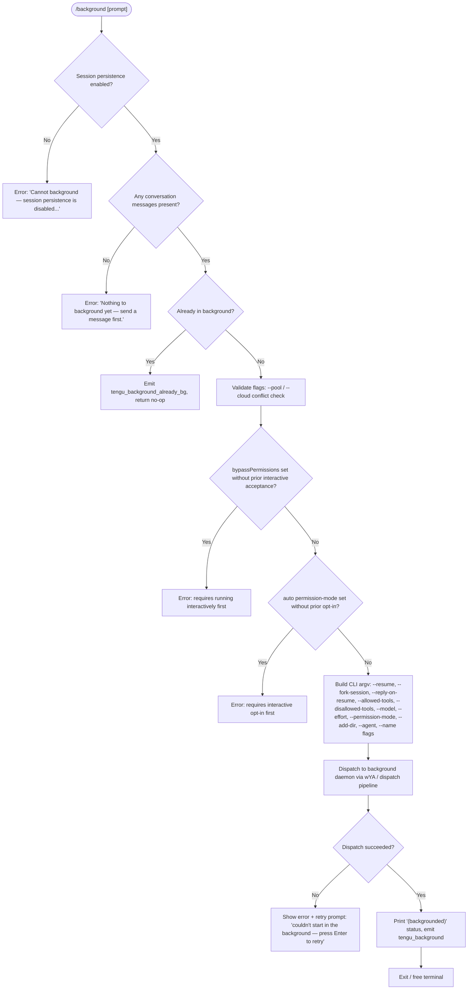

# `/background`

> Analysis basis: CC v2.1.172 bundle.js (AST extraction + Claude interpretation)
> Minimum version: v2.1.172

---

## Overview

The `/background` command (alias `/bg`) sends the current interactive session to the background daemon and frees the terminal. It dispatches the session to the background worker process — optionally including a prompt that will be injected when the session resumes — and prints a `(backgrounded)` confirmation before returning control to the shell. If the session cannot be backgrounded (no active conversation, or persistence disabled), the command displays a descriptive error instead.

---

## Registration

| Field | Value |
|---|---|
| type | `local-jsx` |
| name | `background` |
| description | `Send this session to the background and free the terminal` |
| aliases | `["bg"]` |
| argumentHint | `[prompt]` |
| immediate | `null` |
| module_id | `fXK` |
| load_inline | `true` |
| loc_byte | `13324203` |
| loc_byte_end | `13324443` |
| loc_line | `9767` |
| arbor_handler.name | `Be7` |
| arbor_handler.fqn | `claude-2.1.172::Be7` |
| arbor_handler.kind | `AsyncFunction` |
| arbor_handler.resolution_path | `module_id` |
| arbor_handler.n_hits | `0` |

Analysis basis: CC v2.1.172 bundle.js:+13324203

---

## Input Branching

The handler has 4+ distinct branches, so a Mermaid flowchart is used.



Analysis basis: CC v2.1.172 bundle.js:+13323476 (handler `Be7`), +13323557, +13323733, +13323490, +13319000–+13319308 (flag assembly in `dF8`)

---

## Behavioral Spec

### 1. Entry Point — Handler `Be7`

```
async function backgroundCommandHandler(commandInput, appState):
    // Check session persistence
    if sessionPersistenceDisabled(appState):
        return errorMessage("Cannot background — session persistence is disabled, ...")

    // Check conversation has content
    if noConversationMessagesYet(appState):
        return errorMessage("Nothing to background yet — send a message first.")

    // Check already backgrounded
    if sessionAlreadyInBackground(appState):
        emit("tengu_background_already_bg")
        return  // silent no-op

    // Validate mutually-exclusive backend flags
    validateBackendConflicts(appState)   // --pool vs --bg, --cloud vs --bg
    validatePermissionGates(appState)    // bypassPermissions, auto-mode

    // Build argv for the forked background job
    argv = buildBackgroundArgv(appState, commandInput.prompt)

    // Dispatch
    result = await dispatchToBackgroundDaemon(argv, appState)

    if result.failed:
        return retryPrompt("couldn't start in the background — press Enter to retry")

    emit("tengu_background", { outcome: ... })
    printStatus("(backgrounded)")
    releaseTerminal()
```

Analysis basis: CC v2.1.172 bundle.js:+13323476

---

### 2. Pre-flight Gate Checks (`dF8` / `pe7`)

Before constructing arguments the handler verifies three gate conditions:

1. **`--pool` / `--bg` conflict** — if a `--pool` flag is active, the command aborts with:
   `"--bg and --pool are different backends. Use claude -p '<task>' --pool <pool_id>…"`
   (Analysis basis: CC v2.1.172 bundle.js:+13265892)

2. **`--cloud` / `--bg` conflict** — if a `--cloud` flag is active, the command aborts with:
   `"--bg and --cloud are different backends. Use claude --cloud '<task>'…"`
   (Analysis basis: CC v2.1.172 bundle.js:+13266017)

3. **`bypassPermissions` gate** — if `bypassPermissions` is requested but the disclaimer has not been accepted interactively, the command aborts with:
   `"--bg with bypassPermissions requires accepting the disclaimer first. Run claude --dangerously-skip-permissions once interactively."`
   (Analysis basis: CC v2.1.172 bundle.js:+13317142)

4. **`auto` permission-mode gate** — if `--permission-mode auto` is requested without a prior opt-in, the command aborts with:
   `"--bg with auto mode requires opting in first. Run claude --permission-mode auto once interactively."`
   (Analysis basis: CC v2.1.172 bundle.js:+13317304)

```
function validateGates(appState):
    if poolFlagPresent(appState):
        throw "--bg and --pool are different backends…"
    if cloudFlagPresent(appState):
        throw "--bg and --cloud are different backends…"
    if bypassPermissionsRequested(appState) and not disclaimerAccepted():
        throw "--bg with bypassPermissions requires…"
    if autoModeRequested(appState) and not autoModeOptedIn():
        throw "--bg with auto mode requires…"
```

---

### 3. Argument Assembly (`dF8` / `nr`)

The handler assembles a CLI argument vector that will be passed to the background worker. The argument vector is built from the current session's settings:

```
function buildBackgroundArgv(appState, promptText):
    argv = []

    // Session identity
    argv.push("--resume", currentSessionId)
    argv.push("--fork-session")

    if promptText is not empty:
        argv.push("--reply-on-resume", promptText)

    // Tool constraints forwarded from current session
    if allowedTools configured:
        argv.push("--allowed-tools", ...)
    if disallowedTools configured:
        argv.push("--disallowed-tools", ...)

    // Model / effort
    if model configured:
        argv.push("--model", ...)
    if effort configured:
        argv.push("--effort", ...)

    // Permission mode
    if permissionMode configured:
        argv.push("--permission-mode", ...)

    // Extra directories
    for each dir in additionalDirs:
        argv.push("--add-dir", dir)

    // Agent / name labels
    if agentLabel:
        argv.push("--agent", agentLabel)
    if sessionName:
        argv.push("--name", sessionName)

    return argv
```

Key string literals observed in this assembly phase:
- `"--resume"` (bundle.js:+13319000)
- `"--fork-session"` (bundle.js:+13319013)
- `"--reply-on-resume"` (bundle.js:+13319055)
- `"--allowed-tools"` (bundle.js:+13319142)
- `"--disallowed-tools"` (bundle.js:+13319183)
- `"--model"` (bundle.js:+13319214)
- `"--effort"` (bundle.js:+13319243)
- `"--permission-mode"` (bundle.js:+13319260)
- `"--add-dir"` (bundle.js:+13319107)
- `"--agent"` (bundle.js:+13300235)
- `"--name"` / `"-n"` (bundle.js:+13300262)

---

### 4. Daemon Dispatch Pipeline (`wYA` → `aQ` → `dY`)

```
async function dispatchToBackgroundDaemon(argv, appState):
    // Ensure daemon is running (may prompt user "Install as service? [y/N/never/once]")
    await ensureDaemonRunning(appState)   // aQ

    // Attempt socket-level dispatch with retry logic
    outcome = await daemonDispatchWithRetry(argv)   // wYA / dY

    return outcome
```

The daemon ensure-running flow (`aQ`) will:
- Ask once interactively if the user wants to install the daemon as a persistent service.
   Prompt literal: `"Install as a service now? [y/N/never, or 'once' just for now] "` (bundle.js:+13263408)
- Emit `tengu_bg_daemon_cold_start_ask` (bundle.js:+13256835) when prompting.
- Emit `tengu_bg_daemon_cold_start_ask_answer` (bundle.js:+13263483) after the user replies.
- Fall back to a transient spawn if no service is configured.

The socket dispatch (`dY` / `iu8`) uses a Unix domain socket. On failure it surfaces one of several structured error codes (`ENOCONN`, `ETIMEOUT`, `ESTARTING`, etc.) which are then mapped to human-readable error detail.

Flush timeout constant: **2000 ms** (`"flush timeout"` literal, bundle.js:+13318949).

---

### 5. Post-dispatch Status Rendering (`cF8` / `Be7`)

```
function renderBackgroundResult(result):
    if result is success:
        displayInlineStatus("(backgrounded)")   // literal bundle.js:+13321187
        emit("tengu_background", { outcome: "repl_background_fork" | "queued_for_later" })
    else if result.code == "spawn_failed":
        emit("tengu_background_spawn_failed")
        displayRetryPrompt("couldn't start in the background — press Enter to retry")
    else:
        displayError(humanReadableError(result.code))
```

Telemetry outcome literals:
- `"repl_background_fork"` (bundle.js:+13320304)
- `"queued_for_later"` (bundle.js:+13320327)
- `"spawn_failed"` (bundle.js:+13320378)

The left-arrow key (`"left_arrow"` literal, bundle.js:+13319696) is registered as the retry trigger when the daemon is temporarily unavailable.

Timeout for the post-background wait: **120 s** (bundle.js:+13320957).

---

## State & Side Effects

| Item | Detail |
|---|---|
| Telemetry — primary | `tengu_background` (bundle.js:+13320452) — fired on successful background dispatch |
| Telemetry — already backgrounded | `tengu_background_already_bg` (bundle.js:+13323490) |
| Telemetry — spawn failure | `tengu_background_spawn_failed` (bundle.js:+13319644) |
| Telemetry — daemon dispatch | `tengu_bg_dispatch` (bundle.js:+13296766), `tengu_bg_dispatch_fallback` (bundle.js:+13297296), `tengu_bg_dispatch_rescued` (bundle.js:+13303170) |
| Telemetry — daemon lifecycle | `tengu_bg_daemon_cold_start_ask`, `tengu_bg_daemon_cold_start_ask_answer`, `tengu_bg_daemon_spawn_failed`, `tengu_bg_daemon_service_stale_exec`, `tengu_bg_daemon_install` |
| Telemetry — attach/state | `tengu_bg_attach`, `tengu_bg_attach_upgrade`, `tengu_bg_attach_legacy_autorespawn`, `tengu_bg_attach_stall_ms`, `tengu_bg_attach_stall_gave_up`, `tengu_bg_attach_stall_respawn`, `tengu_bg_attach_kick` |
| Telemetry — low memory | `tengu_bg_dispatch_low_mem`, `tengu_bg_retire_pinned_low_mem` |
| Telemetry — spare pool | `tengu_bg_spare_enable`, `tengu_bg_spare_claim`, `tengu_bg_spare_claim_fail` |
| Session fork | Creates a new daemon job via `--fork-session`; the originating terminal is freed |
| appState changes | Session transitions to "backgrounded" state; terminal is released |
| Socket | Connects to the daemon control socket (`nu8.connect` path via `dY`) |
| File I/O | Dispatch file written under a temp directory; cleaned up on success/failure |
| Signal | None emitted by the command itself; daemon may send `SIGTERM`/`SIGKILL` to managed workers |
| Sound | None |
| Hook registration | `hZA.register` called during the daemon ensure flow (`y9`) — registers process-level hooks |

---

## Version History

| Version | Change |
|---|---|
| v2.1.172 | Initial analysis |

---

## Common Mistakes

1. **Running `/background` before sending any message** — the command refuses with `"Nothing to background yet — send a message first."` You must have at least one conversation turn before backgrounding.

2. **Combining `/background` with `--pool` or `--cloud`** — these are incompatible backends. Use the respective flags directly on the `claude` CLI invocation instead of relying on `/background` to forward them.

3. **Using `--dangerously-skip-permissions` in a background session without prior interactive acceptance** — the gate check requires you to have run `claude --dangerously-skip-permissions` at least once in an interactive session to accept the disclaimer before the flag can be forwarded to background jobs.

4. **Expecting the daemon to be auto-installed** — on a fresh machine the daemon is not installed as a service by default. `/background` will prompt once; answering `"never"` permanently suppresses future prompts and falls back to a transient spawn (which exits when the originating shell exits).

5. **Relying on `/bg` without session persistence enabled** — if the active profile has persistence disabled, the command exits immediately with an error. Session persistence must be enabled for backgrounding to function.

---

## Appendix — Identifier Mapping

> For bundle debugging only. Identifiers change across versions.

| Identifier | Role |
|---|---|
| `Be7` | Main `background` command handler (AsyncFunction; arbor_handler) |
| `dF8` | Background argument-assembly and pre-flight validation function |
| `cF8` | Post-dispatch status rendering / result classification |
| `nr` | Session dispatch file builder and temp-dir manager |
| `ke7` | Full background dispatch orchestration (argv → socket write) |
| `pe7` | Flag parsing and gate-check helper (bypassPermissions, auto-mode, etc.) |
| `wYA` | Background dispatch with retry wrapper |
| `aQ` | Daemon ensure-running / cold-start flow |
| `dY` | Low-level daemon socket connection and message writer |
| `iu8` | Daemon socket listener and ACK handler |
| `HpH` | Daemon socket path resolver |
| `OYA` | Dispatch outcome classifier (maps error codes to human-readable strings) |
| `cJK` | Short-alive / stale job detection helper |
| `Lp6` | Daemon install prompt and service setup orchestration |
| `Ff6` | Session fork / rename pipeline entry |
| `Rm7` | Fork agent query builder |
| `GT` | Main agent query executor (used for the forked background session) |
| `HS8` | App-state getter/setter for session context |
| `CWK` | Primary REPL query execution engine (called by forked background worker) |
| `yRH` | MCP server connection manager |
| `x05` | Daemon supervisor message dispatch handler |
| `D` | Background worker job lifecycle manager (spawn/kill/respawn) |
| `y` | Daemon background sweep / memory-pressure manager |
| `l` | Scheduled-task / grace-clock manager |
| `S$H` | Detach-request sender (sends `"detach-request"` message to worker) |
| `Miq` | Worker task/m8 interface |
| `Wr` | Low-level daemon write helper |
| `EOH` | Environment / origin flag injector for spawned processes |
| `iNH` | AsyncLocalStorage store accessor for session context |
| `O9` | Daemon-worker role identifier resolver |
| `EH` | Error formatting / stringification utility |
| `SH` | Structured log emitter (MCP error/debug/log channels) |
| `Y6` | Telemetry event emitter |
| `b6` | Config file watcher and reader |
| `W7H` | Config file loader with backup support |
| `p6` | AsyncLocalStorage context accessor (store lookup) |
| `P_` | Settings resolver (user / local / flag / policy layers) |
| `x8` | Settings-layer merger |
| `N` | Session system-prompt builder |
| `lf` | CLAUDE.md / instructions file reader |
| `l8f` | Instruction file loader with byte-length and token counting |
| `nWA` | MCP slot reconciler (applies config updates to live connections) |
| `Ln8` | MCP connection result applier |
| `TH6` | MCP server version-info extractor |
| `r0` | MCP server cleanup orchestrator |
| `M` | MCP manager update cycle entry point |
| `TwK` | Session metric / timestamp recorder |
| `G8H` | Git-link scanner for CLAUDE.md files |
| `Tq` | File-state tracker (mtime/content cache) |
| `Hf` | Jobs-directory path resolver |
| `iE` | Job file path helper |
| `jXH` | File-write atomic helper (with NJ for cache invalidation) |
| `m7` | Atomic file write wrapper (uses `MO` for randomised temp names) |
| `MO` | Low-level atomic file operations (writeFile → rename) |
| `wXH` | Allowed-tools flag parser |
| `FF8` | Disallowed-tools flag parser |
| `_XK` | Session-ID flag parser |
| `HXK` | Resume / `-r` flag parser |
| `Ue7` | Agent-name flag parser |
| `AXK` | Continue (`-c`) flag parser |
| `s_H` | Signal-handler registration wrapper |
| `X7H` | QI-signal registration helper |
| `bu` | `sk-ant-` API key prefix trimmer |
| `S_9` | Project-config directory scanner |
| `XZ_` | Config backup path builder |
| `Gx4` | Config file watcher setup |
| `ez` | Daemon log-record emitter |
| `sjH` | Daemon log sink (`Y6` telemetry bridge) |
| `IF8` | Telemetry event fire helper (wraps `Y6`) |
| `Az` | Compact-boundary marker helper |
| `Wx8` | mJ (compact marker) accessor |
| `qg` | Array-check utility |
| `Dx8` | Tool-result `some` predicate |
| `iN` | Inline content normaliser |
| `zr` | Array / filter content helper |
| `rqH` | `startsWith` prefix checker for tool-result content |
| `X$` | y6 / $4 JSX element builder (status display) |
| `IQ` | y6 / $4 JSX element builder (alternate path) |
| `y6` | React-element factory (wraps `BG`) |
| `BG` | Base React / JSX runtime |
| `FG` | React fragment helper |
| `GR` | Full run-loop renderer (renders session output and forks) |
| `CpH` | Conversation payload builder |
| `CWK` | REPL main query loop (streaming + tool execution) |
| `eE` | Message normalisation / event-stream processor |
| `V07` | Tool-use content block renderer |
| `Xb8` | Context document builder (reads files, hashes, writes cache) |
| `cqA` | Fallback-request conversation builder |
| `Ep8` | Content-array flattener |
| `YXA` | Vim-mode operator dispatcher |
| `G` | Terminal input handler / PTY repaint coordinator |
| `QvK` | Vim yank operator |
| `nvK` | Vim visual-replace operator |
| `ovK` | Vim visual-case operator |
| `svK` | Vim visual-paste operator |
| `UvK` | Vim join operator |
| `BvK` | Vim indent operator |
| `MNK` | Vim motion dispatcher (find / replace / textObject) |
| `b` | Vim register manager |
| `td` | Terminal dimension helper |
| `W` | Connection-failure display component |
| `V76` | JSX element type discriminator |
| `JA` | Error/String constructor wrapper |
| `AW` | Backend selector (foundry / anthropicAws / mantle / vertex) |
| `c_` | f6 (String) adapter |
| `wL` | z_8 locale helper |
| `DY_` | Login managed-key prefix handler |
| `J9` | Auth flow orchestrator (Hl / Q9 / hY) |
| `kDH` | NL (network layer) initialiser |
| `QE` | Connection quality estimator |
| `d8` | Abort-controller wrapper with timeout |
| `HL` | Promise.race timeout helper (2000 ms flush timeout) |
| `vZ` | $4 variant flag dispatcher |
| `lZH` | Session list enumerator |
| `OY` | Active-sessions map accessor |
| `iM` | Boolean filter utility |
| `TYA` | $4 / y9 hook registration dispatcher |
| `Vq8` | b6 / Boolean config-watcher initialiser |
| `DC` | Display component for background status |
| `t66` | Timer/interval utility |
| `jWH` | Job-watch helper |
| `s6` | c / A6 signal helpers |
| `d6H` | Directory cleanup helper |
| `ah` | Retry / re-attach helper |
| `Se7` | Session-end cleanup |
| `fKH` | Keep-alive / unref helper |
| `Mp6` | Memory-pressure sampler (hF8 / PJK.freemem) |
| `WJK` | Retire-grace bridge min-duration emitter |
| `l06` | Job-state file reader |
| `R` | Write helper for repaint output |
| `C05` | Y6 / Math.max bounded emitter |
| `AF6` | H.destroy / H.write stream forwarder |
| `NqA` | k56 token-usage sampler |
| `k56` | Token-bucket / rate-limiter |
| `q9H` | AbortSignal event listener setup |
| `_S8` | Stream-state snapshot accessor |
| `HR` | UUID-based request-ID generator |
| `pqH` | $4 / ZmH permission-query handler |
| `ap` | Subagent exit / command lifecycle reporter |
| `ME` | Model-error classifier |
| `eC6` | mW7 tombstone-type checker |
| `lBq` | Tombstone-type lookup helper |
| `CMH` | mJ / qyL conversation-message filter |
| `pW7` | Fork-agent query wrapper |
| `U8` | P / sk.randomUUID dispatch ticket creator |
| `j1K` | Lq / xC whitespace trimmer |
| `xC` | H.trim string cleaner |
| `Jb8` | Conversation message constructor |
| `hFq` | N07 cache-hit helper |
| `yf` | Conversation-turn renderer |
| `Gf` | H.filter content-block helper |
| `mJ` | Compact-boundary marker value |
| `QE` | Connection quality / DNS estimator |
| `NJ` | z5H.delete cache-eviction helper |
| `a7` | N8 path-stat utility |
| `R8` | N8 file-stat wrapper |
| `yz` | N8 / PVH.has / EH / SH file-validation helper |
| `Rw` | dO / PB.realpath path resolver |
| `Su` | Ja.join / MI / Sw directory-stat helper |
| `E0` | PB.readdir recursive directory scanner |
| `QRf` | PB.open / readline gitignore-pattern reader |
| `Gc9` | FF connection-state cache accessor |
| `ZH6` | parseInt radix-10 wrapper |
| `sX8` | parseInt radix-10 wrapper (alternate) |
| `kRH` | Y2H MCP server version extractor |
| `uV6` | T / V76 element-type helper |
| `Jc9` | oB_ / Y2H / jj8 MCP connection initialiser |
| `Jj8` | jj8 / nX MCP pending-request tracker |
| `Yj8` | hf MCP request finaliser |
| `j8` | iQH.push / Ya.logMCPDebug MCP debug logger |
| `sJ8` | Full MCP OAuth tool registration and flow |
| `tJ8` | MCP OAuth callback handler |
| `Vc9` | nX8.then / oB_ MCP connect-result processor |
| `XU_` | nX / hf / j8 MCP tool-list fetcher |
| `OL` | iQH.push / Ya.logMCPError MCP error logger |
| `pN` | Y6 MCP skill telemetry emitter |
| `qU_` | E8 / A.includes MCP capability checker |
| `CH` | JSON.stringify serialiser |
| `n6` | JSON.parse deserialiser |
| `g8` | _ logging utility |
| `g8f` | th / Cs8 / kZA session-file path helper |
| `rFH` | ovA system-prompt override reader |
| `k` | A agent-context map |
| `j` | A.values / S.kill process-kill iterator |
| `GhH` | zS first-party MCP tag setter |
| `HJ_` | Dq8 / randomUUID / NnH / QB / H.emit MCP event emitter |
| `wS` | eu / Dl.push / GhH / HJ_ MCP server-start pipeline |
| `eu` | nC MCP client factory |
| `CU` | Promise.race / Promise.all / vLH / NLH / d8 / process.exit shutdown coordinator |
| `vLH` | VLH.shutdown MCP shutdown initiator |
| `NLH` | clearTimeout / ZZ_ pending-request canceller |
| `kH` | c / A6 signal-safe kill helper |
| `bH` | c / A6 signal-safe kill helper (alternate) |
| `A6` | _56 process-signal sender |
| `c` | Low-level kill / signal primitive |
| `$1` | lpH / $X / process.exit CLI error exit handler (`"cli_error"` literal) |
| `lpH` | Log/print helper for CLI errors |
| `$X` | Exit-code formatter |

---

Note: index built via Arbor fallback; some signals (telemetry, literals) may be missing — see arbor-fallback.js.