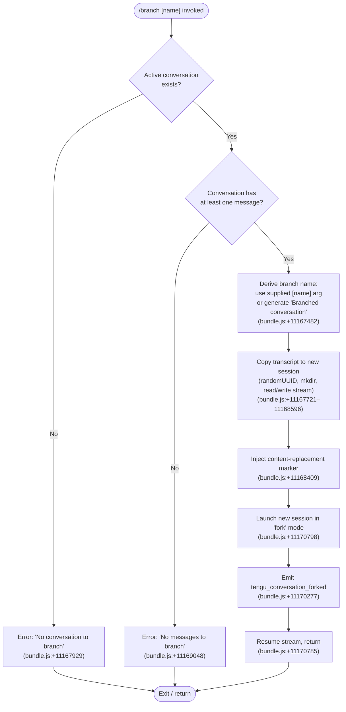

# `/branch`

> Analysis basis: CC v2.1.172 bundle.js (AST extraction + Claude interpretation)
> Minimum version: v2.1.172

---

## Overview

The `/branch` command creates a divergent copy ("fork") of the current conversation up to the point it is invoked, optionally assigning a user-supplied name to the new branch. Internally it copies the existing conversation transcript into a new session file and then launches that session, emitting a `tengu_conversation_forked` telemetry event upon success.

---

## Registration

| Field | Value |
|---|---|
| type | `local-jsx` |
| name | `branch` |
| description | `Create a branch of the current conversation at this point` |
| argumentHint | `[name]` |
| module_id | `nfA` |
| load_inline | `true` |
| loc_byte | `12724923` |
| loc_byte_end | `12725100` |
| loc_line | `8999` |
| arbor_handler.name | `_V7` |
| arbor_handler.fqn | `claude-2.1.172::_V7` |
| arbor_handler.kind | `AsyncFunction` |
| arbor_handler.resolution_path | `module_id` |
| arbor_handler.n_hits | `0` |

Analysis basis: CC v2.1.172 bundle.js:+12724923

---

## Input Branching

There are four distinct runtime paths depending on the presence of an existing conversation and messages, so a flowchart is used.



---

## Behavioral Spec

### 1. Guard Checks

Before performing any fork work, the handler (`_V7`) runs two sequential guard checks.

```
async function branchCommandHandler(args, appState):
    conversation = lookupActiveConversation(appState)   // ulq → _.find
    if conversation is null or undefined:
        raise UserError("No conversation to branch")   // bundle.js:+11167929

    messages = getConversationMessages(conversation)
    if messages is empty:
        raise UserError("No messages to branch")       // bundle.js:+11169048
```

Analysis basis: CC v2.1.172 bundle.js:+11167929, +11169048

---

### 2. Branch Name Resolution

```
function resolveBranchName(rawArg):
    sanitized = sanitizeNameString(rawArg)  // ulq → A.replace  bundle.js:+11167612
    if sanitized is non-empty:
        return sanitized
    else:
        return "Branched conversation"      // bundle.js:+11167482
```

Analysis basis: CC v2.1.172 bundle.js:+11167482, +11167612

---

### 3. Transcript Copy

The handler performs a streaming file-copy of the existing session transcript into a newly created directory for the branch session.

```
async function copyTranscriptToBranch(sourceSession, branchName):
    newSessionId = crypto.randomUUID()                // mlq → Clq.randomUUID  bundle.js:+11167721
    buildSessionPaths(newSessionId)                   // mlq → lM  bundle.js:+11167772
    await fs.mkdir(destDir, { recursive: true })      // mlq → xx8.mkdir  bundle.js:+11167783

    readStream  = fs.createReadStream(sourceFile,     // bundle.js:+11167832
                      { encoding: "utf8",             // bundle.js:+11167865
                        highWaterMark: 448 })         // bundle.js:+11167814
    writeStream = fs.createWriteStream(destFile)      // bundle.js:+11167978

    pipe readStream → writeStream
    await streamFinished(writeStream)                 // mlq → xlq.finished  bundle.js:+11169458

    injectContentReplacementMarker(writeStream,       // bundle.js:+11168409
        type="text",                                  // bundle.js:+11167555
        progress=100)                                 // bundle.js:+11167649

    return newSessionId
```

Analysis basis: CC v2.1.172 bundle.js:+11167721, +11167814, +11167832, +11167865, +11167978, +11169458

---

### 4. Fork Session Launch

After the transcript is copied the handler invokes the session-launch subsystem with the fork disposition.

```
async function launchBranchSession(newSessionId, branchName, parentState):
    sessionConfig = buildSessionConfig(newSessionId, branchName)
    // Sets session title via "custom-title" attribute  bundle.js:+13450519
    // Sets agent-name attribute                        bundle.js:+13453542

    result = await startSession(sessionConfig, mode="fork")   // bundle.js:+11170798

    emitTelemetry("tengu_conversation_forked")                // bundle.js:+11170277

    resumeInputStream()     // plq → H.resume  bundle.js:+11170785
    return result
```

Analysis basis: CC v2.1.172 bundle.js:+11170798, +11170277, +11170785

---

### 5. Error / Edge Handling

```
function handleBranchError(err):
    if err.code == "ENOENT":          // bundle.js:+11167929 context
        reportUserFacingError("No conversation to branch")
    else:
        reportUserFacingError("Unknown error occurred")  // bundle.js:+11170946
    exit(1)                                              // bundle.js:+13298017
```

Analysis basis: CC v2.1.172 bundle.js:+11170946, +13298017

---

### 6. Session Naming & Title Propagation

```
function applyBranchMetadata(session, branchName):
    session.customTitle = branchName   // xR → "custom-title"  bundle.js:+13450519
    emitEvent("tengu_session_renamed") // bundle.js:+13450611

    if agentName provided:
        session.agentName = agentName  // X$H → "agent-name"  bundle.js:+13453542
        emitEvent("tengu_agent_name_set") // bundle.js:+13453640
```

Analysis basis: CC v2.1.172 bundle.js:+13450519, +13450611, +13453542, +13453640

---

## State & Side Effects

| Item | Detail |
|---|---|
| Telemetry — `tengu_conversation_forked` | Fired on successful branch creation (bundle.js:+11170277) |
| Telemetry — `tengu_session_renamed` | Fired when the new branch session title is set (bundle.js:+13450611) |
| Telemetry — `tengu_agent_name_set` | Fired when an agent-name attribute is applied to the branch (bundle.js:+13453640) |
| Telemetry — `tengu_bg_dispatch_sigkill_escalate` | Reachable via background-session teardown paths in the call graph (bundle.js:+16759925) |
| Telemetry — `tengu_daemon_config_reload` | Reachable through daemon control path (bundle.js:+16775429) |
| File system | Creates a new session directory and writes the copied transcript file; cleans up on failure via `Vw.rm` / `Vw.unlink` (bundle.js:+16766161, +16767212) |
| New session record | A roster entry is created for the branch session (`_.rosterEntry`, bundle.js:+16767433) |
| Input stream | The parent input stream is resumed after fork completes (bundle.js:+11170785) |
| appState changes | Parent conversation state is not mutated; a new session object is inserted into the session map (`D.set`, bundle.js:+11168534) |
| Sound | None detected in depth-2 traversal |

---

## Version History

| Version | Change |
|---|---|
| v2.1.172 | Initial analysis |

---

## Common Mistakes

1. **Invoking `/branch` before any messages exist** — the command exits early with "No messages to branch" if the conversation transcript is empty. Send at least one message first.
2. **Omitting the optional name argument** — this is valid; the branch will be titled "Branched conversation" automatically. Passing only whitespace has the same effect because the name is sanitised before use.
3. **Expecting the parent conversation to be modified** — `/branch` only creates a new sibling session from the current point; the original conversation continues unchanged.
4. **Assuming instant availability** — the branch involves async file I/O (stream copy + `streamFinished`). In rare low-disk scenarios the copy may fail and the error handler reports "Unknown error occurred".
5. **Confusing `/branch` with a git-branch operation** — despite the `worktree` detection telemetry present in shared utility code, `/branch` operates on Claude Code conversation history, not on the git working tree.

---

## Appendix — Identifier Mapping

> For bundle debugging only. Identifiers change across versions.

| Identifier | Role |
|---|---|
| `_V7` | Main async handler for `/branch` command (arbor_handler) |
| `plq` | Core branch-execution orchestrator called by `_V7` |
| `mlq` | Transcript-copy worker (mkdir, read/write stream, pipe) |
| `ulq` | Conversation lookup & name sanitisation helper |
| `HV7` | Branch-name deduplication / collision resolution helper |
| `Nr` | Worktree / context detection utility used during session setup |
| `xR` | Session title ("custom-title") setter; emits `tengu_session_renamed` |
| `X$H` | Agent-name setter; emits `tengu_agent_name_set` |
| `X$` | Session initialisation wrapper (calls `$4`) |
| `$4` | Low-level session registration helper |
| `y9` | Finalizer registration (calls `hZA.register`) |
| `PPK` | File-system directory/file enumeration for session context |
| `x3H` | Worktree list parser (git worktree output) |
| `tpH` | Buffer-packing utility used during content-replacement injection |
| `kv` | String-escape helper (replaces special chars in names) |
| `M9` | String slice utility (indexOf / slice) |
| `vOH` | Log-append / mkdir-sync helper used during fork session init |
| `Kl` | Persistent-storage read/write helper for session metadata |
| `$j6` | Low-level JSON file read/write for session config |
| `lM` | Session path builder (joins base dir + session id components) |
| `Jh` | Message serialisation helper (user/assistant/system roles) |
| `SH` | Telemetry dispatcher / log-queue writer |
| `CH` | JSON.stringify wrapper |
| `JA` | Error-construction utility |
| `n6` | JSON.parse wrapper |
| `R8` | ENOENT-detection helper |
| `N8` | Low-level async result wrapper |
| `BG` | Base directory resolver |
| `P_` | Path join utility (secondary) |
| `y6` | Primary path join utility |
| `c$` | File-system constants accessor |
| `rk` | Session record key builder |
| `YC` | Config directory resolver |
| `D` | Background session manager / spawn controller |
| `l0A` | Session lifecycle manager (state transitions: done/killed/failed/crashed) |
| `b` | Background PTY session object |
| `w` | Supervisor write channel |
| `Q` | Daemon socket connection controller |
| `l` | Per-session task scheduler loop |
| `P1H` | Session persistence flush coordinator |
| `MSH` | Session state reader (readFile-based) |
| `FsH` | Session state writer (writeFile-based) |
| `wW9` | Session state filter (active-session pruning) |
| `B0A` | Daemon claim handshake handler |
| `KjA` | Claim-frame writer (mkdir + writeFile + JSON.stringify) |
| `N05` | Claim timeout/retry controller |
| `v05` | Claim frame builder |
| `hF8` | Memory monitor (freemem → low-mem telemetry) |
| `Y6` | Platform-specific feature-flag evaluator |
| `l06` | Session pins.json reader |
| `Vt4` | Session directory enumerator (readdir) |
| `Tq` | Session state-file watcher |
| `YO` | Session active-state resolver |
| `wXH` | Roster entry builder / filter |
| `m7` | Session path constructor with NJ formatter |
| `Mf6` | Async session metric recorder (Date.now) |
| `xx6` | Socket-path builder (Z$.join + Cx6) |
| `U$H` | Unix-socket path helper |
| `RQ` | Socket reconnect helper |
| `bx6` | Session socket directory builder |
| `hZ` | Platform-aware socket-path resolver |
| `TwK` | Daemon status-file path builder |
| `d9` | AsyncLocalStorage store accessor |
| `km6` | Daemon status.json path constructor |
| `W` | SDK/HTTP transport layer |
| `ip` | In-progress session marker |
| `MgK` | Output column formatter (Math.max / padEnd) |
| `d8` | Timeout/abort utility (setTimeout + clearTimeout) |
| `K` | Column-pad formatter |
| `bH` | Feature-bad telemetry emitter |
| `kH` | Feature-ok telemetry emitter |
| `A6` | Feature-flag evaluator base |
| `pa` | OLH-based platform adapter |
| `a7` | Async result unwrap helper |
| `EH` | String coercion wrapper |
| `Lv` | Binary frame writer (Buffer.allocUnsafe + writeUInt32BE) |
| `tx8` | Binary frame reader (Buffer.alloc + readUInt32BE) |
| `B` | Session set / active-session registry |
| `C` | Socket write-with-drain helper |
| `hF8` | Low-memory threshold checker |
| `S` | Supervisor channel message sender |
| `z` | Daemon control message dispatcher |
| `p` | Spare-session ping handler |
| `j` | Active-session kill iterator |
| `Y` | Forced-shutdown / process.exit handler |
| `HX` | Abort-signal broadcaster |
| `o6` | OS-level path helper |
| `f6` | String coercion fallback |
| `Rq` | Telemetry rate-limit controller |
| `yBA` | Telemetry batch formatter |
| `fRf` | Telemetry queue shift/push manager |
| `a3` | Locale-aware sort comparator |