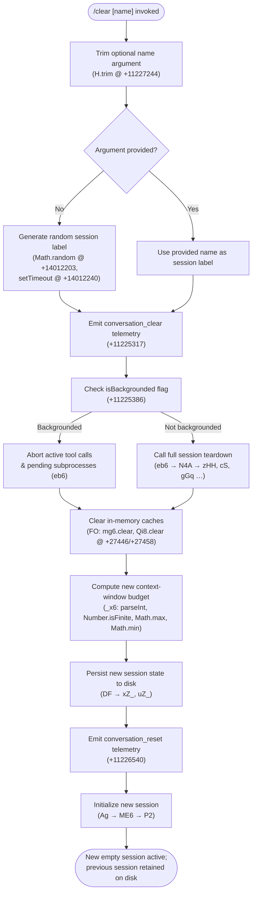

# `/clear`

> Analysis basis: CC v2.1.172 bundle.js (AST extraction + Claude interpretation)
> Minimum version: v2.1.172

---

## Overview

`/clear` starts a new conversation session with an empty context window, preserving the prior session on disk so it can be resumed later with `/resume`. It is also aliased as `/reset` and `/new`. The command accepts an optional `[name]` argument to label the new session, supports non-interactive (scripted) invocation, and dispatches a `post-text` event to thin clients.

---

## Registration

| Field | Value |
|---|---|
| type | `local` |
| name | `clear` |
| description | `Start a new session with empty context; previous session stays on disk (resumable with /resume)` |
| argumentHint | `[name]` |
| aliases | `reset`, `new` |
| supportsNonInteractive | `true` |
| thinClientDispatch | `post-text` |
| module_id | `Cnq` |
| load_inline | `true` |
| loc_byte | `11227418` |
| loc_byte_end | `11227709` |
| loc_line | `7352` |
| arbor_handler.name | `Av7` |
| arbor_handler.fqn | `claude-2.1.172::Av7` |
| arbor_handler.kind | `AsyncFunction` |
| arbor_handler.resolution_path | `module_id` |
| arbor_handler.n_hits | `0` |

Analysis basis: CC v2.1.172 bundle.js:+11227418

---

## Input Branching

The handler has 3+ distinct branches based on argument presence, backgrounded state, and session naming logic.



---

## Behavioral Spec

### 1. Argument Parsing

```
async function clearCommandHandler(rawArgument, context):
    name = rawArgument.trim()          # H.trim @ +11227244
    if name is empty:
        name = generateRandomLabel()   # Math.random @ +14012203
    return startClearFlow(name, context)
```

Analysis basis: CC v2.1.172 bundle.js:+11227244

### 2. Cache Eviction Hint

Before tearing down the session, the handler emits a cache-eviction hint so that the API-side prompt cache entries for the current conversation are eligible for early release.

```
function emitCacheEvictionHint(sessionId):
    emit telemetry "tengu_cache_eviction_hint"   # +11225279
    signal cache layer to mark current session entries as evictable
```

Analysis basis: CC v2.1.172 bundle.js:+11225279

### 3. Session Teardown (full reset path)

The primary teardown is performed by the `sessionResetOrchestrator` function (bundle: `eb6`). It coordinates multiple subsystems:

```
async function sessionResetOrchestrator(name, context):
    # Abort outstanding tool calls with AbortSignal.timeout  @ +11225235
    abortAllActiveTools()

    # Kill any running background subprocesses             @ +11225495 (X7)
    terminateBackgroundProcesses()

    # Clear conversation-level state stores
    clearConversationState()                              # _.clear @ +11225599

    # Emit "conversation_clear" event                     @ +11225317
    emit("conversation_clear")

    # Run full state-reset across subsystems              → N4A
    await broadcastFullReset()

    # Emit "conversation_reset" event                     @ +11226540
    emit("conversation_reset")

    # Assign new session UUID                             @ +11226579 (ynq.randomUUID)
    newSessionId = crypto.randomUUID()

    # Rebuild initial session scaffold
    await initializeNewSession(name, newSessionId)
```

Analysis basis: CC v2.1.172 bundle.js:+11225235, +11225317, +11225599, +11226540, +11226579

### 4. Broad Subsystem Reset (`broadcastFullReset`)

`broadcastFullReset` (bundle: `N4A`) calls into many independent subsystem reset functions to wipe in-memory state:

```
async function broadcastFullReset():
    clearSkillIndexCache()              # Gp → H.clearSkillIndexCache @ +13405402
    clearConversationFileIndex()        # JT9 → _g.clear @ +5064781
    clearMcpConnectionState()          # zHH → LC8, HC8, Rg9, …
    clearPluginCaches()                 # gGq → FxH.clear, qHA.clear @ +9268512
    clearBashToolCache()                # hDq → QA6.clear, dk6.clear @ +8622541
    clearPermissionStore()              # xq_ → wdH.clear @ +1140241
    clearBotContext()                   # Bc9 → et.clear, h2H.clear @ +6774520
    clearZendeskCache()                 # vq_ → zdH.clear @ +1133194
    clearTokenCountCache()              # la9 → m28.clear @ +7183710
    resetAutonomousLoopState()          # zHH → mP7.resetAutonomousLoopDelivered @ +10512755
    resolveAnyPendingElicitation()      # eY → Object.values @ +46027
```

Analysis basis: CC v2.1.172 bundle.js:+11224134–+11224782

### 5. Context-Window Budget Recalculation

After caches are cleared, the context-window size helper (`contextWindowSizeCalculator`, bundle: `_x6`) recomputes the budget for the new session:

```
function computeContextWindowBudget(modelConfig):
    raw = parseInt(modelConfig.contextWindow, 10)       # parseInt @ +13547839
    if not Number.isFinite(raw):
        raw = DEFAULT_WINDOW                            # Number.isFinite @ +13547861
    budgetTokens = Math.max(MIN_TOKENS,
                   Math.min(MAX_TOKENS, raw * SCALE))   # Math.max @ +13548057, Math.min @ +13548070
    return budgetTokens
```

The numeric constant `10` (radix) appears at `+13547850` and `1000` appears at `+13548026`.

Analysis basis: CC v2.1.172 bundle.js:+13547839, +13547850, +13548026, +13548057, +13548070

### 6. New Session Initialization

`newSessionBootstrapper` (bundle: `Ag`) re-applies startup hooks, reloads plugin registrations, and emits a `SessionEnd` event to close the previous session before opening the new one:

```
async function newSessionBootstrapper(name, sessionId, context):
    emit("SessionEnd")                           # literal @ +13538358

    # Reload plugin hooks for the fresh session
    loadPluginHooks(context)                     # Ag → c5H, ME6

    # Re-register MCP connections
    await reconnectMcpServers()                  # Ag → M (nWA, yRH, Ln8)

    # Push new session record; emit hook_session_start_reload_skills
    emitTelemetry("hook_session_start_reload_skills")   # literal @ +5079663

    # Start main agent loop
    startAgentLoop(name, sessionId)              # Ag → ME6 → P2
```

Analysis basis: CC v2.1.172 bundle.js:+13538358, +5079663

### 7. Disk Persistence

The old session is written to disk (not deleted) before the new one begins, making it resumable:

```
async function persistSessionToDisk(sessionState):
    # xZ_ reads/writes via LA9 (Map-based store)  @ +3340458, +3340483
    existing = sessionStore.get(sessionId)
    updated  = mergeState(existing, sessionState)
    sessionStore.set(sessionId, updated)

    # uZ_ commits via x8, UK, gA               @ +3340526–+3340683
    writeSessionFileToDisk(updated)
```

Analysis basis: CC v2.1.172 bundle.js:+3340450, +3340483, +3340526

---

## State & Side Effects

| Item | Detail |
|---|---|
| Telemetry: tengu_cache_eviction_hint | Emitted before teardown to signal prompt-cache eviction (+11225279) |
| Telemetry: tengu_run_hook | Emitted when session/hook execution runs during reset (+13587818) |
| Telemetry: tengu_feature_ok / tengu_feature_bad | Emitted on feature-flag check outcomes (+1016269, +1016336) |
| Telemetry: tengu_repl_hook_finished | Emitted after each hook completes during new session init (+13571562) |
| Telemetry: tengu_hook_plugin_metrics | Plugin hook metrics collected (+13566089) |
| Telemetry: tengu_hook_plugin_injected | Emitted when plugin hook is injected into new session (+13586180) |
| Telemetry: tengu_shell_set_cwd | Fired if working directory changes during session reset (+6924143) |
| Telemetry: tengu_session_renamed | Fired if the new session name differs from the previous (+13450611) |
| Event: conversation_clear | Emitted immediately on execution (+11225317) |
| Event: conversation_reset | Emitted after full state wipe (+11226540) |
| Event: SessionEnd (hook) | Triggers registered SessionEnd hooks on the outgoing session (+13538358) |
| In-memory cache clears | mg6, Qi8, FxH, qHA, QA6, dk6, wdH, bb8, zdH, m28, et, h2H, _g, AV6, FU_, Bpq, SR8 maps cleared |
| MCP connections | Existing MCP connections disposed and re-established for new session |
| Subprocess cleanup | Active tool calls aborted via AbortSignal; background processes terminated (SIGKILL escalation path exists at +16759925) |
| Disk state | Previous session serialized and retained (resumable via /resume); new session file created |
| New session UUID | Generated via crypto.randomUUID() (+11226579) |
| Plugin hooks | SessionEnd hooks run for old session; SessionStart/setup hooks run for new session |
| Hook registration | No persistent hook re-registration side effects beyond normal session startup |
| appState changes | Active session reference swapped to new session object; context window budget recomputed |
| Sound | None found in depth-2 traversal |

---

## Version History

| Version | Change |
|---|---|
| v2.1.172 | Initial analysis |

---

## Common Mistakes

1. **Confusing `/clear` with permanent deletion.** The previous session is preserved on disk and is fully resumable with `/resume`. No conversation history is destroyed.
2. **Using `/clear` to switch models.** `/clear` resets context but does not change the active model. Model selection requires a separate configuration step.
3. **Expecting immediate hook quiescence.** `SessionEnd` hooks execute asynchronously as part of teardown; tool calls and background processes may still be running briefly after the command is issued.
4. **Omitting the name argument when scripting.** In non-interactive (`supportsNonInteractive: true`) mode the `[name]` argument is the only labeling mechanism — omitting it causes a randomly generated label to be assigned, which can make session management harder in automated pipelines.
5. **Assuming `/reset` or `/new` have different behavior.** Both are exact aliases for `/clear` with no behavioral difference.

---

## Appendix — Identifier Mapping

> For bundle debugging only. Identifiers change across versions.

| Identifier | Role |
|---|---|
| Av7 | Main `clear` command handler (AsyncFunction; arbor_handler) |
| eb6 | Session-reset orchestrator: aborts tools, clears state, emits events |
| _x6 | Context-window budget calculator (parseInt / Number.isFinite / Math.max / Math.min) |
| kj | Configuration/policy reader called during budget calculation |
| UK | Safe-mode / bare-mode flag reader |
| KAH | Policy-settings accessor (reads `policySettings`) |
| aU | BG-flag accessor |
| DF | State persistence coordinator (calls xZ_, FO, uZ_) |
| xZ_ | Session-store read/write via LA9 Map |
| FO | Dual-map cache flusher (mg6.clear, Qi8.clear) |
| uZ_ | Disk-write finalizer for session state |
| mmH | SessionEnd hook emitter / new session scaffolder |
| XL | Session initialization dispatcher |
| y6 | Async utility / promise helper |
| oh | Background-state checker |
| dP | Model-capability resolver (checks claude-3-*, opus-4, sonnet-4, etc.) |
| av | Context-effort configurator (reads `high` effort setting) |
| Jh | Conversation metadata builder (joins paths, etc.) |
| p6 | Path/context helper |
| hG | Core new-session runner; coordinates all sub-operations |
| $b | Session-state accessor (reads via x8) |
| N | Log/debug emitter (checks debug level, uppercases, trims) |
| NOH | Hook-type normalizer |
| VDA | Hook-configuration resolver (reads PreToolUse, PostToolUse, SessionStart, etc.) |
| R2K | Hook-result reducer |
| ZDA | Third-party hook filter |
| x2K | Hook-context builder |
| c | Generic async error wrapper / catch helper |
| CH | JSON.stringify wrapper |
| SH | Hook-queue flusher (calls JA, f6, Rq, fRf) |
| bH | Feature-bad reporter (emits tengu_feature_bad) |
| WvH | Feature-ok reporter (emits via cr6) |
| dN | Abort-controller manager (DK, K.abort, clearTimeout, setTimeout) |
| M9H | Metric / timing collector |
| QN | Hook progress notifier |
| xg8 | Hook-notification dispatcher (QN, BMA, FMA, N) |
| WDA | Tool-connection state watcher (HVH, N, L.find, dN, EH) |
| pg8 | Hook-output JSON parser (detects `{` prefix; emits warn on plain text) |
| sqH | Hook-metadata transformer (Object.entries/fromEntries) |
| PDA | HTTP hook executor (posts to Kj, checks 200–300 range) |
| S2K | Hook-output slice / trim processor |
| qOH | Hook-cancellation handler |
| Ug8 | Subprocess hook executor (spawns child process, manages stdin/stdout/stderr, Promise.race) |
| mRH | Hook multi-result merger |
| kH | Feature-ok emitter (emits tengu_feature_ok via A6) |
| gF | Hook-timing telemetry emitter (at4.emit, Date.now, ZXH map) |
| mxH | Thin-client message forwarder |
| I56 | Inline session-state snapshot helper |
| $6 | Module bootstrap / _56 initializer |
| _56 | Low-level module-export helper |
| f | Active-session set manager (q.add / q.delete / L.finally) |
| q | Session set / queue |
| $1 | CLI error handler (lpH, $X, process.exit) |
| L | Session lifecycle manager (A.close, q.close, f) |
| A | Connection/transport wrapper |
| D | Background-session dispatcher (core daemon interaction) |
| b | Daemon process manager (MSH, w, pa, FsH, wW9, P, z, S, X, d, MgK, P1H) |
| MSH | Session-file reader (readFile, b5H, T9, SH, Lq, Array.isArray) |
| w | Daemon write/config-update coordinator (ZEH, q.write, iDK, T.stop, E.stop/updateConfig/start) |
| pa | OLH helper (platform abstraction) |
| FsH | Session-directory writer (mkdir, join, writeFile, b5H) |
| wW9 | Session-filter helper (H.filter, BsH) |
| P | IPC buffer reader (Buffer.concat, indexOf, subarray, x05, EH) |
| z | Daemon state aggregator (kH, bH, wS, CU) |
| S | Daemon status writer (XrK, v3, N, SH, s05, w.write) |
| X | MCP socket handler (M, q.setTimeout) |
| d | Async-task runner (Ix6, aaq) |
| MgK | Session-list formatter (H.map, hN, Math.max, q.join) |
| P1H | Session-roster updater (F6H, MSH, q.filter, A.has, FsH) |
| d8 | Retry/timeout helper (Error, q, setTimeout, O, clearTimeout, f.unref) |
| K | Column formatter (f.map, L.padEnd) |
| hF8 | Low-memory detector (t6, Y6) |
| Y6 | Memory-pressure telemetry emitter |
| l06 | Pins/session-file loader (GW.readFile, gk_, n6, Array.isArray, _.filter, R8, Vt4) |
| gk_ | Pins-file path builder (vJ.join, iE) |
| n6 | JSON.parse wrapper |
| R8 | ENOENT-safe file-read handler |
| Vt4 | Session-directory scanner (readdir, isDirectory, readFile, join, A.push) |
| Q | Background-PTY socket manager (d.on/once, process.kill, HQ8.unlink, hZ, Lv, tx8, d.destroy, d.connect) |
| N8 | Low-level logger |
| l | Worker-loop scheduler (z, B.add, G.has, X.get, YT6, rw8, X.set, N, ZX5.isLoopDefaultSentinel, Math.floor, F6H, P1H) |
| C | Socket write/clear helper (clearTimeout, O.write) |
| B | Task-set manager |
| hZ | PTY path builder (t6, Z$.join, _pH, H.split) |
| Lv | IPC frame encoder (Buffer.from/allocUnsafe, writeUInt32BE, writeUInt8, _.copy) |
| tx8 | IPC frame decoder (Buffer.alloc/concat, readUInt32BE, readUInt8, subarray) |
| B0A | Daemon claim handler (Hd.claim, KjA, N05, v05, K.socketAuth, Vn8.connect, L.on/once/write/end) |
| KjA | Daemon state-file writer (_d.mkdir/_d.writeFile, JSON.stringify, EH) |
| N05 | Send-claim timeout watcher (Date.now, Error, h05, d8) |
| v05 | Claim-frame builder (Hd.buildClaimFrame) |
| a7 | N8-backed logger helper |
| EH | String coercer (String wrapper) |
| l0A | Full daemon session lifecycle (Hf, Tq, YO, wXH, m7, Mf6, xx6, U$H, RQ, bx6, rosterEntry, A, setTimeout) |
| Hf | Session-home path builder (vJ.join, iE) |
| Tq | Session-state tracker (GW.stat/readFile, z5H/YXH maps, n6, Number.isFinite) |
| YO | Active-session reporter (DN) |
| wXH | Session-roster entry parser (K.startsWith/indexOf/slice, O5H/hO8/Uk_.has, N, A.join, Gt4) |
| m7 | Session-metadata formatter (MO, vJ.join, CH, NJ) |
| Mf6 | Session-timing recorder (Dsq.then, CQ, H, Date.now, Sy7, _.catch) |
| xx6 | Session-lock file path builder (Z$.join, Cx6) |
| U$H | Session-socket path builder (Z$.join, _pH) |
| RQ | Session-roster-file writer (t6, aLA, Z$.join, ff6) |
| bx6 | Session-dir path builder (Z$.join, Cx6) |
| Y | Forced-shutdown handler (HX, process.exit, z.abort) |
| HX | Shutdown-signal helper |
| A6 | Feature-flag low-level (_56 backed) |
| X7 | Active-subprocess tracker |
| CD | Conversation-dispatch helper |
| N4A | Broad subsystem reset orchestrator (calls all cache-clear functions) |
| T4A | Reset pre-flight checker |
| uV | Skill-index cache invalidator (Gp, Fb8, lgq, euH) |
| Gp | Skill-index clear wrapper (Promise.resolve, y7A, H.clearSkillIndexCache) |
| Fb8 | Skill fetch cache clearer |
| lgq | Skill list cache clearer |
| euH | MCP skill-source cache clearer (XC6) |
| JT9 | Conversation-file index clearer (_g.clear, hSH) |
| hSH | File-index disk writer (MT9, $T9, yY8.mkdir/writeFile) |
| qM6 | Quick-message cache clearer |
| zHH | MCP + internal state reset coordinator (LC8, pT6, AM6, KM6, HC8, Rg9, pDq, J0H, eY, W9A) |
| PhH | Main-agent state accessor |
| LC8 | MCP client-map cleaner (AC8, fU.get/delete, fC8, Y9A/NC6.delete) |
| pT6 | Session-start broadcaster (WT) |
| AM6 | Autonomous-mode resetter |
| KM6 | BG-mode flag resetter (BG, b6H) |
| HC8 | Hook-pending-queue clearer (Bpq.clear) |
| Rg9 | Tool-cache pair clearer (AV6.clear, FU_.clear) |
| pDq | Prompt-draft clearer (H) |
| J0H | In-flight message clearer (H, _) |
| eY | Output-token counter resetter (qFH, Object.values) |
| W9A | Worktree-state resetter |
| cS | Bot-context cache clearer (bb8.clear) |
| gGq | Plugin-hook cache clearer (FxH.clear, qHA.clear) |
| hDq | Bash-tool cache clearer (QA6.clear, dk6.clear) |
| xq_ | Permission-store clearer (wdH.clear) |
| Jcq | Jira/task-context clearer |
| la9 | Token-count cache clearer (m28.clear) |
| Qo8 | Queue presence checker (H.has) |
| vq_ | Zendesk/secondary cache clearer (zdH.clear) |
| Guq | MCP skill source clearer (XC6) |
| XC6 | MCP skill registry accessor (SR8.get, jC6) |
| Bc9 | Bot-context pair clearer (N, et.clear, h2H.clear) |
| Ow | Working-directory resolver (lP8.isAbsolute/resolve, o6, R8, Error, v9_) |
| o6 | File-stat helper |
| v9_ | CWD async-local-storage reader (Oo6.getStore, dO, u6H) |
| dO | Path normalizer (H.normalize, NFC) |
| u6H | CWD fallback getter (T56) |
| P_ | BG-flag wrapper (BG) |
| WSH | Session-watch-path configurator |
| vT | Session lifecycle event emitter |
| xz | Pending-hook flush coordinator (Zg8, Tg8.get/delete, _.flush) |
| Zg8 | Hook-tracking set manager (uPK.add/delete, H.finally) |
| H66 | Telemetry span helper (Tr9) |
| Tr9 | Span-recorder |
| r0 | Tool-registry cleanup dispatcher (TH6, K.cleanup, pN) |
| TH6 | Tool-hash computer (Y2H) |
| Y2H | SHA-256 tool-input hasher (CH, Array.isArray, Object.keys, dB9.createHash) |
| pN | MCP skills reload trigger (Y6) |
| Rnq | Hook-filter resolver (FzH) |
| FzH | Hook-pattern matcher |
| X$ | Conversation-log writer (y6, $4) |
| $4 | Log-entry formatter |
| y9 | FinalizationRegistry registration wrapper (hZA.register) |
| rk | Conversation-state reader |
| lM | Message-list builder (YC, c$, P_, ZPH.join, y6) |
| YC | Message-type checker (BG) |
| Hx6 | Log-append helper ($4) |
| ni8 | New-session UUID + event emitter (PfH.randomUUID, XZA, JZA) |
| XZA | Session-ready event helper |
| JZA | Session-start event emitter (Bg6.emit) |
| hr | Hook-result aggregator ($4) |
| xR | Session-rename handler (Jh, vOH, y6, $4, kp6.emit) |
| vOH | Log-file appender (o6, CH, A.appendFileSync/mkdirSync, N$.dirname, $4) |
| guH | Symlink-manager for session dirs (_6H.symlink/unlink/open, Zg8, wDA, J$, g16) |
| wDA | Session-dir creator (_6H.mkdir, lH6) |
| lH6 | Session-dir path joiner (ODA.join, wL6, y6) |
| J$ | Session-dir linker (ODA.join, lH6) |
| g16 | Session-dir file opener (Zg8, wDA, J$, _6H.open) |
| mV | Subagent-message builder (YC, c$, P_, y6, _x_.get, ZPH.join) |
| Y5 | Session-state snapshot helper |
| I_ | ES-module interop init (CZH, Pi8, aF6.call, sF6.bind, qoK, WGA.set) |
| sF6 | Bound-function helper |
| W | SDK/SSE connection manager (V76, aS, UN, Promise.all, Yi, nb, SH, JA) |
| V76 | Transport-version resolver |
| JA | Error/string normalizer |
| T | Transport-type selector (uV6, V76) |
| uV6 | Transport URL builder |
| iM | IDE-mode flag reader |
| ep | Worktree-state emitter ($4, dC8.emit, vOH, y6) |
| qKH | Isolation-latch handler ($4, jPK, y6) |
| jPK | Isolation-latch log writer (CH, gK.appendFile/mkdir, N$.dirname, $4) |
| Ag | Session-startup orchestrator (calls $f, kj, UK, Xs, N, OdH, c5H, ME6, M, uV, cS, dS.emit, kH, kT9, s1) |
| $f | Policy/settings fetcher (UK, O7) |
| O7 | Settings-object builder (f6, EQ6) |
| Xs | Permission-set builder (x8, Object.entries, A.includes, _.add) |
| x8 | State-store accessor (ia6, VB) |
| OdH | Audit-log writer (Date.now, u8, _, A) |
| u8 | File-system audit-log appender (Bbf, o6, CH, f.appendFileSync/mkdirSync, dQA.dirname) |
| c5H | Plugin-hook safe-mode gatekeeper (UK, N, ST9) |
| ME6 | Main agent-loop launcher (XL, X$, $Y, y6, P2, Sg8.randomUUID) |
| $Y | Agent-mode resolver |
| P2 | Full agent-turn executor (large orchestrator: VDA, hG, Ug8, WDA, sqH, PDA, S2K, SH, etc.) |
| M | MCP-manager wrapper (yRH, Ln8, f.get/values, N, $, nWA) |
| yRH | MCP server connection runner (Object.entries, qi, QV, H, K.push, g8, Promise.all, UN, Yi, pN, nb) |
| Ln8 | MCP connection result applier (H.applyMcpUpdate, kRH, j8, A.cleanup, r0, hD) |
| $ | Transport writer (TwK) |
| nWA | MCP slot reconciler (Object.entries, A.filter, _.getClients, mJ8, q, d8, N, TH6, yRH, Ln8, K.map) |
| s1 | Session-UUID + timestamp stamper (zKA.randomUUID, _.uuid, _.now) |

---

Note: index built via Arbor fallback; some signals (telemetry, literals) may be missing — see arbor-fallback.js.