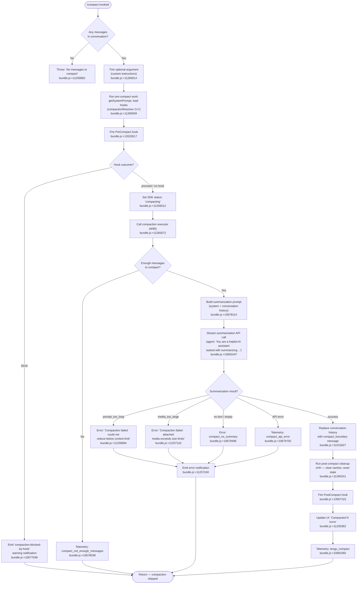

# `/compact`

> Analysis basis: CC v2.1.172 bundle.js (AST extraction + Claude interpretation)
> Minimum version: v2.1.172

---

## Overview

`/compact` frees up context window space by generating a condensed summary of the current conversation and replacing the message history with that summary. The command supports an optional argument for custom summarization instructions, fires `PreCompact` and `PostCompact` lifecycle hooks, and resets internal state (caches, sub-agent data) after a successful compaction.

---

## Registration

| Field | Value |
|---|---|
| type | `local` |
| name | `compact` |
| description | `Free up context by summarizing the conversation so far` |
| argumentHint | `<optional custom summarization instructions>` |
| supportsNonInteractive | `true` |
| thinClientDispatch | `post-text` |
| module_id | `kiq` |
| load_inline | `true` |
| loc_byte | `11260921` |
| loc_byte_end | `11261221` |
| arbor_handler.name | `Rv7` |
| arbor_handler.fqn | `claude-2.1.172::Rv7` |
| arbor_handler.kind | `AsyncFunction` |
| arbor_handler.resolution_path | `module_id` |
| arbor_handler.n_hits | `0` |

Analysis basis: CC v2.1.172 bundle.js:+11260921

---

## Input Branching

The command has more than 3 distinct execution paths: argument presence check, empty-message guard, PreCompact hook outcome (block vs. proceed), summarization result (success / error variants), and post-compact cleanup vs. cancellation. A Mermaid flowchart is used.



---

## Behavioral Spec

### Handler entry point — `compactCommandHandler` (Rv7)

```
async function compactCommandHandler(args, context):
    # args.userArg = optional custom instruction string
    messageList = getConversationMessages(context)
    if messageList is empty:
        throw Error("No messages to compact")          # bundle.js:+11259982

    customInstructions = args.userArg.trim()           # bundle.js:+11260014

    result = await runCompactionResolver(context,      # Cv7 — bundle.js:+11260049
                                         customInstructions)
    if result.cancelled:
        displayNotification("Compaction canceled.")    # bundle.js:+11260523
        return

    appStateManager = getInternalState(context)        # Iiq — bundle.js:+11260086
    applyCompactResultToState(appStateManager, result) # bundle.js:+11260110

    resetConversationState(context)                    # zHH — bundle.js:+11260241
    displaySummaryUI(context, result)                  # hiq — bundle.js:+11260314
```

Analysis basis: CC v2.1.172 bundle.js:+11259951

---

### Compaction resolver — `compactionResolver` (Cv7)

```
async function compactionResolver(context, customInstructions):
    startTime = performance.now()                        # bundle.js:+11256033

    # Build normalized message list
    [normalizedMessages, systemPrompt] = await Promise.all([
        buildMessageList(context),                       # f2 — bundle.js:+11256055
        fetchSystemPrompt(context)                       # Iiq — bundle.js:+11256172
    ])

    # Pre-compact hook phase
    hookResult = await runHooks("PreCompact", context)   # Xr — bundle.js:+11256097
    if hookResult.decision == "block":
        emitWarning("compaction-blocked-by-hook",        # bundle.js:+10677049
                    "compaction blocked by PreCompact hook")
        return {cancelled: true}

    updateSDKStatus("compacting")                        # bundle.js:+11256012

    # Kick off the main compaction turn
    compactionOutcome = await runCompactionTurn(          # bv7 — bundle.js:+11256487
        normalizedMessages, systemPrompt, customInstructions)

    if compactionOutcome.error:
        displayCompactionError(compactionOutcome.error)
        return {cancelled: true}

    # Post-compact cleanup via executor W96
    await applyCompactResult(context, compactionOutcome) # W96 — bundle.js:+11260072

    elapsedMs = performance.now() - startTime
    emitTelemetry("compact_end", {elapsedMs})            # bundle.js:+11257869

    return {cancelled: false, summary: compactionOutcome.summary}
```

Analysis basis: CC v2.1.172 bundle.js:+11256033

---

### Compaction executor — `compactionExecutor` (W96)

```
async function compactionExecutor(context, normalizedMessages,
                                  systemPrompt, customInstructions):
    startTime = performance.now()                         # bundle.js:+10677876

    # Guard: require minimum messages
    if normalizedMessages is empty:
        emitTelemetry("compact_not_enough_messages")      # bundle.js:+10678038
        return {error: "not_enough_messages"}

    # Build the summarization prompt from history
    summaryPrompt = buildSummaryPrompt(                   # bundle.js:+10678114
        normalizedMessages, customInstructions)

    # Invoke summarization API (dedicated agent)
    # System preamble fragment: "You are a helpful AI assistant
    #   tasked with summarizing conversations."             bundle.js:+10691047
    summaryResult = await streamSummarizationRequest(     # zFq — bundle.js:+10678771
        summaryPrompt, systemPrompt)

    if summaryResult.outcome == "prompt_too_long":
        emitTelemetry("compact_prompt_too_long")          # bundle.js:+10679112
        return {error: "prompt_too_long"}

    if summaryResult.outcome == "no_summary" or textEmpty:
        emitTelemetry("compact_no_summary")               # bundle.js:+10679496
        return {error: "no_summary",
                message: "Failed to generate conversation summary…"} # bundle.js:+10679525

    if summaryResult.outcome == "api_error":
        emitTelemetry("compact_api_error")                # bundle.js:+10679792
        return {error: "api_error"}

    # Success: splice compact_boundary message into history
    # Boundary marker literal: "compact_boundary"          bundle.js:+11015627
    # Boundary role: "system"                              bundle.js:+11015605
    replaceHistoryWithBoundary(context,                   # Az — bundle.js:+11259951
        summaryResult.text)

    emitTelemetry("tengu_compact", {                      # bundle.js:+10681092
        mode: isManual ? "compact_manual" : "compact_auto"
    })
    return {error: null, summary: summaryResult.text}
```

Analysis basis: CC v2.1.172 bundle.js:+10677876

---

### Conversation reset after compaction — `postCompactReset` (zHH)

```
function postCompactReset(context):
    # Clear precomputed compact entries
    clearPrecomputedCompact()                            # LC8 — bundle.js:+10512622
    # Clear API-level caches
    clearCache("Bpq")                                    # HC8 — bundle.js:+10512717
    clearCache("AV6")                                    # Rg9 — bundle.js:+10512723
    clearCache("FU_")
    # Reset autonomous loop delivery counter
    mP7.resetAutonomousLoopDelivered()                   # bundle.js:+10512755
    # Flush any pending sub-state objects
    resetSubState(context)                               # W9A — bundle.js:+10512911
    # Notify UI of conversation_reset stream event       # bundle.js:+10663408
```

Analysis basis: CC v2.1.172 bundle.js:+10512612

---

### Compact boundary insertion — `insertCompactBoundary` (Az)

```
function insertCompactBoundary(messageHistory, summaryText):
    # Trims history array to index [1, 0] after the boundary
    # Role "system", subtype "compact_boundary"           bundle.js:+11015627 / +11015605
    boundaryMessage = {
        role: "system",
        content: summaryText,
        type: "compact_boundary"
    }
    newHistory = [boundaryMessage]
    # Slice tail via Wx8/mJ helpers                       bundle.js:+11015757
    return newHistory
```

Analysis basis: CC v2.1.172 bundle.js:+11015681

---

### UI confirmation display — `showCompactedUI` (hiq)

```
function showCompactedUI(context, compactResult):
    # Register keyboard shortcut for transcript toggle
    registerKeybinding("app:toggleTranscript",           # bundle.js:+11259243
                       scope="Global", key="ctrl+o")
    # Display dim banner: "Compacted N turns"            # bundle.js:+11259382
    turnCount = countTurns(compactResult)
    displayBanner(W6.dim("Compacted " + turnCount + " turns"))
    # Join and display context lines                     # bundle.js:+11259395
```

Analysis basis: CC v2.1.172 bundle.js:+11257605

---

### Hook execution for PreCompact / PostCompact — `hookRunner` (hG / Xr)

```
async function runHooks(hookEvent, context):
    # Supported hook event names relevant to compaction:
    #   "PreCompact"  bundle.js:+13533517
    #   "PostCompact" bundle.js:+13567315
    hookHandlers = resolveHookHandlers(context)          # XL — bundle.js:+13533490
    results = await Promise.all(
        hookHandlers.map(h => executeHook(h, hookEvent)) # hG — bundle.js:+13533598
    )
    for result in results:
        if result.decision == "block":
            emitTelemetry("tengu_run_hook",
                          {outcome: "block"})
            return {decision: "block"}
    return {decision: "proceed"}
```

Analysis basis: CC v2.1.172 bundle.js:+13533490

---

## State & Side Effects

| Item | Detail |
|---|---|
| Telemetry — primary | `tengu_compact` (bundle.js:+10681092) |
| Telemetry — hook blocked | `tengu_run_hook` (bundle.js:+13587818) |
| Telemetry — precomputed consumed | `tengu_precomputed_compact_consumed` (bundle.js:+10511385) |
| Telemetry — precomputed discarded | `tengu_precomputed_compact_discarded` (bundle.js:+10512008) |
| Telemetry — reactive attempt | `tengu_reactive_compact_attempt` (bundle.js:+5100441) |
| Telemetry — reactive succeeded | `tengu_reactive_compact_succeeded` (bundle.js:+10519054) |
| Telemetry — reactive failed | `tengu_reactive_compact_failed` (bundle.js:+10516593) |
| Telemetry — reactive aborted | literal `compact_reactive_aborted` (bundle.js:+10517086) |
| Telemetry — post-compact file restore success | `tengu_post_compact_file_restore_success` (bundle.js:+10692887) |
| Telemetry — post-compact file restore error | `tengu_post_compact_file_restore_error` (bundle.js:+10692929) |
| Telemetry — cache prefix | `tengu_compact_cache_prefix` (bundle.js:+10678676) |
| Telemetry — cache sharing success | `tengu_compact_cache_sharing_success` (bundle.js:+10689554) |
| Telemetry — cache sharing fallback | `tengu_compact_cache_sharing_fallback` (bundle.js:+10690184) |
| Telemetry — compact failed | `tengu_compact_failed` (bundle.js:+10692401) |
| Telemetry — ptl retry | `tengu_compact_ptl_retry` (bundle.js:+10679152) |
| Telemetry — credits clamp rescue | `tengu_compact_credits_clamp_rescue` (bundle.js:+5100284) |
| Hook registration — PreCompact | Fires before summarization; `block` outcome cancels compaction (bundle.js:+13533517) |
| Hook registration — PostCompact | Fires after boundary insertion (bundle.js:+13567315) |
| appState changes | Conversation history replaced with single `compact_boundary` system message; `compactMetadata` stored (bundle.js:+11257324) |
| Cache reset | `Bpq`, `AV6`, `FU_` caches cleared; precomputed compaction slots cleared (bundle.js:+10512717, +10512723) |
| Autonomous loop counter | `mP7.resetAutonomousLoopDelivered()` called (bundle.js:+10512755) |
| SDK status | Set to `"compacting"` during execution, `"sdk_status"` literal (bundle.js:+11255992) |
| Progress stages (literals) | `compact_progress`, `hooks_start`, `pre_compact`, `compacting`, `compact_start`, `compact_end` (bundle.js:+11255896–+11257869) |
| Sound | <!-- TODO: not found in depth-2 traversal; needs --depth 4 --> |
| Non-interactive support | `supportsNonInteractive: true` — command may be invoked headlessly |

---

## Version History

| Version | Change |
|---|---|
| v2.1.172 | Initial analysis |

---

## Common Mistakes

1. **Passing instructions that look like flags** — the argument is treated as free-form summarization instruction text (trimmed at `bundle.js:+11260014`). There are no sub-flags; anything after `/compact` is literal instruction text forwarded to the summarization agent.
2. **Running `/compact` on an empty session** — the command immediately throws "No messages to compact" (`bundle.js:+11259982`) if there are no conversation messages. Start at least one exchange before compacting.
3. **Expecting a PreCompact hook to pause and wait for user input** — if a registered `PreCompact` hook returns `decision: "block"`, compaction is silently skipped with a warning notification, not an interactive confirmation (`bundle.js:+10677049`).
4. **Assuming conversation history is preserved** — after a successful compact, history is fully replaced by the summary boundary message. Any context not captured by the summary model is lost.
5. **Triggering `/compact` while another compaction is in flight** — the command does not guard against re-entrancy at the registration level; concurrent invocations may corrupt the `compact_boundary` state.
6. **Expecting custom instructions to override the base summarization persona** — the summarization agent always starts with the built-in system preamble ("You are a helpful AI assistant tasked with summarizing conversations.", `bundle.js:+10691047`); custom instructions are appended, not replaced.

---

## Appendix — Identifier Mapping

> For bundle debugging only. Identifiers change across versions.

| Identifier | Role |
|---|---|
| `Rv7` | Main async handler for `/compact` (arbor_handler) |
| `Az` | Compact-boundary history splicer |
| `Wx8` | Message slice helper called by Az |
| `mJ` | Array utility called by Wx8 |
| `Jr` | Pre-compact context builder |
| `b_` | Context accessor called by Jr / s85 |
| `Y6` | Config/settings loader (used extensively) |
| `N26` | Settings entry reader |
| `h26` | Settings entry helper |
| `Ym` | Settings entry evaluator |
| `eu` | Core config reader |
| `N78` | Experiment variant resolver |
| `_J_` | Experiment event emitter |
| `qZ_` | Experiment helper |
| `b6` | File-watch / config-backup utility |
| `o6` | Path resolver used by b6 |
| `jZ_` | Directory join helper |
| `W7H` | Config file reader/writer |
| `Gx4` | File watcher utility |
| `Cv7` | Compaction resolver (orchestrates full flow) |
| `f2` | Message-list builder |
| `k07` | Message normalizer |
| `aXH` | Token counter helper |
| `Pb8` | Message serializer / attachment normalizer |
| `Xr` | Hook executor orchestrator |
| `XL` | Hook loader |
| `y6` | Hook filter utility |
| `oh` | Hook channel helper |
| `dP` | Model effort resolver |
| `av` | Effort-level applier |
| `Jh` | Hook context builder |
| `p6` | Hook path resolver |
| `hG` | Individual hook executor |
| `$b` | Policy-settings reader |
| `N` | General-purpose logger / formatter |
| `NOH` | Hook-type adapter |
| `VDA` | Hook directory scanner |
| `R2K` | Hook result reducer |
| `ZDA` | Hook filter (third-party) |
| `x2K` | Hook metadata extractor |
| `c` | Shallow object merge / clone utility |
| `CH` | JSON stringify wrapper |
| `SH` | Hook scheduler |
| `bH` | Hook context setter |
| `WvH` | Hook credential resolver |
| `dN` | Abort-controller timeout manager |
| `J` | Callback dispatcher |
| `M9H` | Hook result parser |
| `QN` | Queue/pending hook tracker |
| `xg8` | Hook-queue processor |
| `WDA` | Hook connection validator |
| `pg8` | Hook output parser (text vs JSON) |
| `sqH` | Hook metric aggregator |
| `PDA` | HTTP hook poster |
| `S2K` | Hook JSON schema validator |
| `qOH` | Hook OS-process runner |
| `Ug8` | Shell hook executor (spawns subprocess) |
| `mRH` | MCP tool hook runner |
| `kH` | Context state reader |
| `gF` | Telemetry emitter / metrics collector |
| `K` | MCP server list manager |
| `f` | MCP connection wrapper |
| `L` | MCP client abstraction |
| `M` | MCP orchestrator |
| `yRH` | MCP server connection handler |
| `Ln8` | MCP update applier |
| `$` | MCP tool wrapper builder |
| `nWA` | MCP config change reconciler |
| `Iiq` | App-state snapshot builder |
| `GZ` | System-prompt assembler |
| `BDA` | Background dispatch helper |
| `mb8` | Tool list builder |
| `B_` | Base tool set loader |
| `XrH` | Pewter-owl tool injector |
| `FT` | Task-continuity injector |
| `m85` | Core system-prompt section builder |
| `p85` | Confirmation-behavior injector |
| `U85` | Context-management section builder |
| `mDH` | Fable-identity injector |
| `K_H` | Hardware-context injector |
| `dDA` | Flag-settings section builder |
| `J_5` | Flag-settings wrapper |
| `ag` | Tool-permission builder |
| `s85` | Memory / schedule section builder |
| `HW6` | Memory file loader |
| `L_5` | Environment info (static) builder |
| `f_5` | Environment info (simple) builder |
| `d85` | Language injector |
| `c85` | Output-style injector |
| `$_5` | Background-session section builder |
| `O_5` | Scratchpad section builder |
| `w_5` | Brief-mode section builder |
| `j_5` | Focus / flag-settings injector |
| `H_5` | Growthbook/env injector |
| `g85` | Autonomy-append section builder |
| `Q85` | Heron-brook section builder |
| `LSq` | Ultramemory loader |
| `e85` | UDA (you-work-alongside) injector |
| `l85` | Act-don't-re-derive injector |
| `n85` | Compaction-reminder injector |
| `i85` | Verified-vs-assumed injector |
| `r85` | Reproduce-verify-workflow injector |
| `o85` | Output-style section builder |
| `t85` | Tone-and-style injector |
| `FA9` | Memory-prompt builder |
| `djH` | AWS-Anthropic credential helper |
| `k_` | Conversation history reader (finds last compact boundary) |
| `A` | Generic collection helper |
| `_b8` | Working-directory extractor |
| `Ab8` | Allowed-tools extractor |
| `Nb` | Permission-mode helper |
| `sp` | System-prompt assembler (agent-level) |
| `yf` | Compact-result text formatter |
| `vW` | Model-family resolver |
| `I_` | Module-registry bootstrapper |
| `Pw` | System-prompt post-processor |
| `A6` | Feature-flag evaluator (ok path) |
| `$6` | Feature-flag evaluator (alt path) |
| `fb8` | Logger wrapper |
| `IqA` | Token-usage accumulator |
| `bv7` | Compaction turn runner |
| `J9A` | Abort-controller / race wrapper |
| `AC8` | API client accessor |
| `_` | Utility namespace (lodash-like) |
| `nq6` | Precomputed-compact consumer |
| `qC8` | Precomputed-compact lookup |
| `f$` | Token-count formatter |
| `H1` | Streaming result printer |
| `X9A` | Compact-boundary UUID finder |
| `fC8` | Precomputed-compact performance recorder |
| `OC8` | Compaction turn orchestrator (reactive path) |
| `PhH` | Agent-type resolver |
| `su` | Agent-prefix checker |
| `QX` | Tool-permission context builder |
| `V1H` | Permission-set checker |
| `AG9` | Permission scope helper |
| `Vt` | Verbose tool helper |
| `uT6` | Tool-use object transformer |
| `WSH` | Workspace-state holder |
| `Bn` | Browser/node environment detector |
| `LT9` | Environment capability checker |
| `tT6` | Cache-write helper |
| `SY8` | Cache-key prefix checker |
| `hSH` | Cache persistence writer |
| `fFH` | Feature-flag hook helper |
| `rq6` | Cache reader |
| `$4` | Cache backing store |
| `hC6` | Request UUID generator |
| `gqH` | Tool-use validator |
| `G07` | Array-type guard |
| `W07` | Tool-use message normalizer |
| `UP7` | Sub-state collector |
| `wC8` | Tool-context loader |
| `JC8` | App-state getter for tools |
| `YC8` | Tool-server-version reader |
| `jC8` | Tool-conversation reader |
| `DC8` | Tool-use-group collector |
| `q$H` | Tool-queue reader |
| `OmH` | Tool-ordering resolver |
| `zmH` | Tool-queue appender |
| `s1` | Conversation-turn ID generator |
| `Ag` | Plugin / hook loader |
| `UGH` | System-prompt builder (with hooks) |
| `Z9A` | Conversation-state extractor |
| `ZmH` | Tool-use tombstone checker |
| `Q3H` | Token-limit calculator |
| `EY8` | Token-usage rounding helper |
| `TY8` | Token-accounting pass |
| `eE` | Message-content normalizer (large) |
| `IM` | Token-rounding utility |
| `EfL` | Local-command-stdout tracker |
| `RE` | Effort + model resolver pair |
| `P$` | App-state getter (compact path) |
| `E9A` | Reactive compaction entry point |
| `cY8` | Reactive compact executor |
| `OE6` | Summary-agent invoker |
| `q` | Buffer / stream helper |
| `FT9` | Group-count calculator |
| `D` | Background-session manager |
| `zLL` | Summarization API caller |
| `j` | Process / kill manager |
| `wLL` | Watcher-based compaction variant |
| `AE6` | Abort-error classifier |
| `_E6` | Abort-error helper |
| `gm` | Text scrubber / redactor |
| `BfL` | URL redactor |
| `CfL` | Path/PII redactor |
| `xfL` | Phone number redactor |
| `kfL` | IP address redactor |
| `vfL` | Email redactor |
| `ZfL` | Home-dir path redactor |
| `mfL` | General path redactor |
| `ufL` | API-error body redactor |
| `UfL` | MCP-server name redactor |
| `ET9` | Post-compact notification builder |
| `s6` | Feature-flag evaluator (sad path) |
| `EH` | String coercer |
| `zHH` | Post-compact state reset |
| `LC8` | Precomputed-compact slot clearer |
| `pT6` | Watchdog timer helper |
| `WT` | Watchdog implementation |
| `AM6` | Retry-state clearer |
| `KM6` | Background-notification clearer |
| `BG` | Event-bus reference |
| `b6H` | Bus-channel helper |
| `HC8` | Bpq cache clearer |
| `Rg9` | AV6/FU_ cache clearer |
| `pDq` | State accessor |
| `J0H` | Sub-agent exit cleaner |
| `eY` | Output-token counter |
| `W9A` | Sub-state resetter |
| `ZSH` | App-state setter (post-compact) |
| `hiq` | UI confirmation / banner displayer |
| `ZCH` | Transcript toggle registrar |
| `USL` | Model-display-name resolver |
| `eP` | Keybinding registration helper |
| `t38` | Keybinding category builder |
| `e38` | Keybinding action handler |
| `VXH` | Telemetry metric emitter |
| `mf` | OTEL metric recorder |
| `CyH` | OTEL attribute builder |
| `fM6` | Metric-name formatter |
| `Ur8` | Metric-emit helper |
| `Br8` | Metric-batch helper |
| `W96` | Compaction executor (main manual path) |
| `$V6` | Tracing span creator |
| `l1H` | Span attribute setter |
| `mN` | Trace context propagator |
| `rS` | Active-span checker |
| `TtH` | Turn-state checker |
| `dY8` | Text trimmer |
| `U8` | PTY / subprocess session manager |
| `P` | Buffer / stream reader |
| `X` | Stream multiplexer |
| `I7` | Stream end helper |
| `x05` | Daemon socket message handler |
| `zFq` | Summary streaming loop |
| `ubq` | Compact cache key reader |
| `KR8` | Compact cache store |
| `xbq` | Compact cache key builder |
| `f6` | String coercion utility |
| `GT` | Streaming-turn runner |
| `HS8` | Streaming-turn state updater |
| `_S8` | Stream-idle watchdog |
| `HR` | Request-ID generator |
| `pqH` | Tool-tombstone resolver |
| `ap` | Command-lifecycle reporter |
| `ME` | Message-delta event handler |
| `eC6` | Event-type checker (mW7 set) |
| `jHH` | Stream-event dispatcher |
| `qb8` | Stream-event queue |
| `lBq` | Event-bus checker |
| `Y` | Process-exit handler |
| `CMH` | Context-message filter |
| `pW7` | Turn-completion handler |
| `Lx_` | Min-length limiter |
| `n5H` | Output-token-limit resolver |
| `QjH` | Model-specific token-limit table |
| `Z1H` | CLAUDE_CODE_MAX_OUTPUT_TOKENS parser |
| `UV` | Last-message finder |
| `QY8` | Summary-tag finder |
| `gY8` | `<summary>` tag extractor |
| `g8` | General array helper |
| `I` | Iterator helper |
| `lW7` | Feature-flag output builder |
| `mo` | Stream-mode setter |
| `Ab6` | Tool-search decision maker |
| `bzH` | Tool-search state |
| `ht` | Platform lower-case checker |
| `duH` | Tool-search exclusion checker |
| `Pb_` | Tool-search schema builder |
| `T07` | Tool-search executor |
| `fx_` | Tool-content flattener |
| `QW7` | Array-type tool-content checker |
| `dW7` | Tool-content filter |
| `cW7` | Tool-content mapper |
| `_b6` | Tool-content binary checker |
| `hqA` | Tool-content recursive helper |
| `fFq` | Surrogate-pair checker |
| `Mq6` | Tool-use dispatcher |
| `cqA` | Fallback-request builder |
| `CWK` | Main query / API-call orchestrator |
| `u28` | Conversation context merger |
| `j1` | Context-type checker |
| `FG` | Background-bus emitter |
| `G` | Editor key-handler |
| `T` | Terminal event helper |
| `z` | Editor state manager |
| `td` | Terminal dispatcher |
| `MNK` | Motion-key handler |
| `QvK` | Yank-operation handler |
| `nvK` | Visual-replace handler |
| `ovK` | Visual-case handler |
| `b` | Register/clipboard manager |
| `svK` | Visual-paste handler |
| `UvK` | Indent operation handler |
| `BvK` | Visual-indent handler |
| `YXA` | Key-action dispatcher |
| `S` | Supervisor / worker writer |
| `w` | Daemon config watcher |
| `ZEH` | Config-diff processor |
| `iDK` | Config-layout differ |
| `E` | Render engine |
| `DrK` | Config-change detector |
| `V` | Render cycle manager |
| `qg` | Array-is-array guard |
| `MFq` | Compact-history trimmer |
| `EtH` | Compact text/binary pusher |
| `ZtH` | Token-count boundary checker |
| `l5H` | Content-type array checker |
| `KN6` | Token-count match/parseInt |
| `wk` | Compaction-type prefix checker |
| `x` | Session event emitter |
| `C` | PTY writer |
| `lM` | Language-model name formatter |
| `YC` | Language-model label |
| `P_` | Model-display helper |
| `XT` | Context-source builder |
| `wc` | Context-mode string |
| `OK` | String coercion (context) |
| `GT6` | REPL-context getter |
| `zE6` | Context-string formatter |
| `OLL` | Conversation-role cleaner |
| `vt` | Tool-permission pair |
| `OFq` | Compact-error formatter |
| `cX` | LRU shift helper |
| `wE` | Cache eviction helper |
| `hLL` | LRU cache implementation |
| `LV6` | Status-line updater |
| `ERH` | Status-setter |
| `xqA` | Post-compact notification emitter |