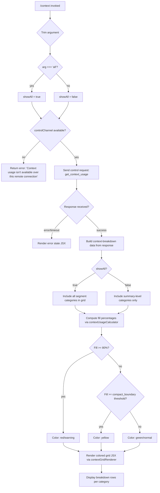

# `/context`

> Analysis basis: CC v2.1.172 bundle.js (AST extraction + Claude interpretation)
> Minimum version: v2.1.172

---

## Overview

`/context` visualizes the current context window usage as a colored grid rendered in the terminal. It dispatches a `get_context_usage` control request to the active session and displays a breakdown of token consumption by category (system prompt, tools, memory files, messages, etc.), with color coding to indicate fill level. When the optional `all` argument is provided, additional detail layers are included in the output.

---

## Registration

| Field | Value |
|---|---|
| type | `local-jsx` |
| name | `context` |
| description | `Visualize current context usage as a colored grid` |
| argumentHint | `[all]` |
| thinClientDispatch | `control-request` |
| module_id | `faq` |
| load_inline | `true` |
| loc_byte | `11663387` |
| loc_byte_end | `11663613` |
| loc_line | `7535` |
| arbor_handler.name | `Vk7` |
| arbor_handler.fqn | `claude-2.1.172::Vk7` |
| arbor_handler.kind | `AsyncFunction` |
| arbor_handler.resolution_path | `module_id` |
| arbor_handler.n_hits | `0` |

Analysis basis: CC v2.1.172 bundle.js:+11663387

---

## Input Branching

The handler has 4+ distinct branches based on argument value, remote-connection state, and context-channel availability.



Analysis basis: CC v2.1.172 bundle.js:+11661981 (handler entry), +11662012 (`"all"` literal), +11662065 (remote-connection error string), +11662147 (`sendControlRequest`), +11662177 (`"get_context_usage"` literal), +11662523 (`80` fill threshold literal)

---

## Behavioral Spec

### Handler Entry — `contextCommandHandler` (bundle: `Vk7`)

```
async function contextCommandHandler(input, sessionContext):
    arg = input.trim()                        // +11661987
    showAll = (arg === "all")                 // +11662012

    channel = getControlChannel(sessionContext)  // +11662035, +11662038
    if channel is null or unavailable:
        return textError(
            "Context usage isn't available over this remote connection"
        )                                     // +11662063–11662065

    rawResponse = await channel.sendControlRequest(
        type: "get_context_usage"
    )                                         // +11662147, +11662177

    segmentData = buildContextBreakdown(rawResponse, showAll)
                                              // +11662211 (createElement entry)
    return renderContextGrid(segmentData)     // +11662317 (Ex6 / contextGridRenderer)
```

Analysis basis: CC v2.1.172 bundle.js:+11661981

---

### Context Breakdown Builder — `contextBreakdownBuilder` (bundle: `Ex6`)

```
function contextBreakdownBuilder(usageResponse, showAll):
    // Filter raw segments from the API response
    segments = usageResponse.filter(isKnownCategory)    // +11660084
    headline = usageResponse.find(isTotalEntry)         // +11660402

    categories = []

    // Always-present top-level rows
    categories.push({ label: "Free space",         tokens: freeSpaceTokens  })  // +11660119
    categories.push({ label: "Autocompact buffer", tokens: autocompactBuffer })  // +11660142

    if showAll:
        // Memory-source breakdown rows
        categories.push({ label: "Project",       source: "projectSettings" })   // +11661068/88
        categories.push({ label: "User",          source: "userSettings"    })   // +11661108/25
        categories.push({ label: "Local",         source: "localSettings"   })   // +11661142/60
        categories.push({ label: "Flag",          source: flagSettings      })   // +11661195
        categories.push({ label: "Policy",        source: policySettings    })   // +11661231
        categories.push({ label: "Plugin",        source: "plugin"          })   // +11661250/61
        categories.push({ label: "Built-in",      source: "built-in"        })   // +11661280/93

    // Compute percentages
    for each category in categories:
        category.percent = Math.round(
            (category.tokens / headline.totalTokens) * 100
        )                                               // +11660395 (a6H → Math.round)

    // Assign display label via String() formatter                // +11661320
    return categories
```

Analysis basis: CC v2.1.172 bundle.js:+11660043

---

### Color Tier Classifier — `fillColorClassifier` (bundle: `MK` → `eK`)

```
function fillColorClassifier(percentFull):
    // Threshold constants found in bundle:
    //   compact_boundary marker: "compact_boundary"  (+11015627)
    //   80% hard threshold                           (+11662523)
    //   20% lower bracket: "< 20"                   (+216375)
    //   Color levels: 10, 20                         (+216408, +216366)

    if percentFull >= 80:
        return COLOR_RED_WARNING
    else if percentFull >= compact_boundary:     // compact_boundary from settings
        return COLOR_YELLOW_CAUTION
    else if percentFull < 20:
        return COLOR_GREEN_AMPLE
    else:
        return COLOR_NORMAL
```

Analysis basis: CC v2.1.172 bundle.js:+216322 (`eK` classifier), +11015627 (`compact_boundary` literal), +11662523 (80-threshold literal)

---

### Compact-Boundary Resolver — `autocompactBoundaryResolver` (bundle: `Az` → `Wx8`)

```
function autocompactBoundaryResolver(modelContextSize):
    // Marker "compact_boundary" is resolved from model-specific settings
    // Uses slice arithmetic to carve the boundary offset from context ceiling
    marker = getCompactBoundaryFromSettings()     // +11015757 Wx8
    return modelContextSize - marker.sliceOffset  // +11015780 H.slice
```

Analysis basis: CC v2.1.172 bundle.js:+11661943

---

### Grid Renderer — `contextGridRenderer` (bundle: `Ex6` → JSX via `Zx6.createElement`)

```
function renderContextGrid(categories):
    // Builds a JSX element tree representing a colored block grid
    rows = categories.map(cat =>
        createElement(GridRow, {
            label:   cat.label,
            percent: cat.percent,
            color:   fillColorClassifier(cat.percent),
            tokens:  cat.tokens
        })
    )
    // System usage row appended with "system" tag  // +11662294
    return createElement(ContextGridRoot, { rows })
```

Analysis basis: CC v2.1.172 bundle.js:+11662211

---

### Locale-Formatted Token Counter — `tokenFormatter` (bundle: `a6H`)

```
function tokenFormatter(tokenCount):
    // Uses "en-US" locale (+218348) with "compact" notation (+218366)
    formatted = new Intl.NumberFormat("en-US", { notation: "compact" })
                    .format(tokenCount)
    // Strips trailing ".0" suffix (+216336)
    if formatted.endsWith(".0"):
        formatted = formatted.slice(0, -2)
    return formatted
```

Analysis basis: CC v2.1.172 bundle.js:+216392

---

### Segment Color Labels Observed in Literals

| Segment Label | Key Literal |
|---|---|
| System prompt | `"System prompt"` (+10711688) |
| System tools | `"System tools"` (+10711766) |
| MCP tools | `"MCP tools"` (+10711829) |
| MCP tools (deferred) | `"MCP tools (deferred)"` (+10711904) |
| System tools (deferred) | `"System tools (deferred)"` (+10711989) |
| Custom agents | `"Custom agents"` (+10712077) |
| Memory files | `"Memory files"` (+10712143) |
| Skills | `"Skills"` (+10712204) |
| Messages | `"Messages"` (+10712730) |
| Free space | `"Free space"` (+11660119) |
| Autocompact buffer | `"Autocompact buffer"` (+11660142) |

Analysis basis: CC v2.1.172 bundle.js:+10711688–10712756

---

## State & Side Effects

| Item | Detail |
|---|---|
| Telemetry | No `tengu_*` events fire directly from the `context` command handler itself at depth ≤ 2. Downstream helpers touched by `$b8` (context-data loader) emit `tengu_amber_redwood2` (+10696946), `tengu_amber_redwood3` (+10696831) from the autocompact-window resolver path (`TFq`/`Jr`). |
| Control channel request | Sends a `"get_context_usage"` typed control request over the `controlChannel` IPC path. (+11662147, +11662177) |
| Hook registration | `y9` → `hZA.register` at +63751 suggests a write-buffer flush hook registered by the log-file writer (`l8f`), reachable from the broader context loader but not from `/context` itself. |
| appState changes | None observed at depth ≤ 2 for this command. |
| Sound | None observed. |
| Remote-connection guard | Returns an inline error message when `controlChannel` is absent — no UI grid is rendered. (+11662063) |

---

## Version History

| Version | Change |
|---|---|
| v2.1.172 | Initial analysis |

---

## Common Mistakes

1. **Running `/context` over a remote SSH tunnel without a control channel** — the command silently returns `"Context usage isn't available over this remote connection"` instead of a grid. Ensure the session is local or the thin-client control channel is established before invoking.
2. **Expecting `/context` to show all memory-source detail by default** — the `Project`, `User`, `Local`, `Flag`, `Policy`, `Plugin`, and `Built-in` rows are only rendered when the `all` argument is supplied (i.e., `/context all`).
3. **Interpreting the compact-boundary color** — yellow does not mean the context window is critically full; it indicates usage has crossed the autocompact threshold (model-dependent, below 80%). Red (≥ 80%) is the critical tier.
4. **Confusing token counts with percentages** — the grid displays compact-formatted token counts (e.g., `"124K"`) alongside percentage fill; the color is driven by the percentage, not the raw count.
5. **Assuming the command modifies state** — `/context` is read-only; it emits a single control request and renders a JSX grid. It does not alter settings, memory files, or session history.

---

## Appendix — Identifier Mapping

> For bundle debugging only. Identifiers change across versions.

| Identifier | Role |
|---|---|
| `Vk7` | Main handler for `/context` (AsyncFunction, arbor-resolved) |
| `Ex6` | Context breakdown builder — filters/maps usage segments into display rows |
| `MK` | Fill-color classifier entry point |
| `eK` | Inner color-tier logic (percent → color constant) |
| `r8f` | Color constant table |
| `a6H` | Locale token formatter (`en-US` compact Intl.NumberFormat) |
| `GdH` | Grid-row JSX helper |
| `Az` | Autocompact-boundary resolver (delegates to `Wx8`) |
| `Wx8` | Compact-boundary slice calculator |
| `mJ` | Model-context ceiling accessor |
| `Zk7` | Pre-render segment sorter / boundary annotator |
| `t4` | Control-channel accessor |
| `_VH` | Channel presence check helper |
| `OI` | Channel-type discriminator |
| `a_6` | JSX event handler wrapper (for grid element `on` binding) |
| `yF` | JSX renderer wrapper |
| `ch_` | React createElement alias (`NM9.createElement`) |
| `is` | Inner render helper composing grid from segment list |
| `skH` | Segment-state resolver feeding into the grid component |
| `Zx6` | React namespace used for createElement in the handler |
| `$b8` | Context-data loader — broad orchestrator fetching all prompt/tool/memory segments |
| `Gr` | Autocompact-window setting resolver |
| `TFq` | Context-window usage aggregator |
| `CqA` | Token-value string parser (handles `"auto"`, numeric, suffixed strings) |
| `Z1H` | Max-output-token resolver (reads `CLAUDE_CODE_MAX_OUTPUT_TOKENS`) |
| `oqH` | Segment-length bounding utility |
| `n5H` | Output-token cap helper |
| `QjH` | Token-count clamper |
| `Jr` | Short fill-percent helper |
| `b_` | Token-count normalizer |
| `Y6` | Conversation-state accessor (reads message list, tool results) |
| `GZ` | System-prompt assembler (large orchestrator) |
| `K07` | Prompt-section token counter |
| `f07` | Built-in tool token enumerator |
| `L07` | MCP tool token enumerator |
| `O07` | Message-history token estimator |
| `z07` | Deferred-tool token enumerator |
| `M07` | Memory-file token enumerator |
| `j07` | Per-segment token accumulator |
| `w07` | Segment-entry builder for system-prompt row |
| `Y07` | Segment-entry builder for tool rows |
| `D07` | Segment-entry builder for message rows |
| `JK6` | Individual token-count request dispatcher |
| `QSH` | Token-count API call (calls `count_tokens` endpoint) |
| `ZFq` | Token-count result parser |
| `lGH` | Parallel token-count resolver |
| `wb8` | MCP-tool descriptor serialiser |
| `eE` | Message normaliser (strips unsupported content types, reorders tool uses) |
| `Pb8` | Full message-list context builder |
| `zb8` | Prompt + tool composite builder |
| `gA9` | Combined system-prompt + tool section composer |
| `HW6` | Memory-file section builder |
| `sp` | Agent system-prompt builder |
| `v1` | Session-environment resolver (fullscreen, OS, settings loader) |
| `Is` | Terminal-type detector |
| `Ep4` | tmux/iTerm2 control-mode checker |
| `Tp4` | Terminal prefix checker |
| `gV_` | Background-session flag reader |
| `N` | Log writer / debug output helper |
| `EH` | String-to-display-label converter |
| `CH` | JSON serialiser (wraps `JSON.stringify`) |
| `lf` | Log-file path builder |
| `l8f` | Log-file write orchestrator |
| `TFH` | Batched write flusher |
| `BfH` | File-write queue manager |
| `ms8` | File rotate/rename helper |
| `c8f` | Append-file writer |
| `y9` | Hook registrar (wraps `hZA.register`) |
| `FV_` | Fullscreen-mode resolver |
| `B_` | Settings-access helper |
| `vB` | Settings-from-disk loader |
| `oK_` | Settings-load orchestrator |
| `VB` | Settings-object assembler |
| `Zp4` | Conversation initialiser |
| `N78` | Message-deduplication checker |
| `b6` | Message-append helper |
| `MNA` | Redaction mapper |
| `rFH` | stdout write wrapper |
| `ovA` | Raw stream writer |