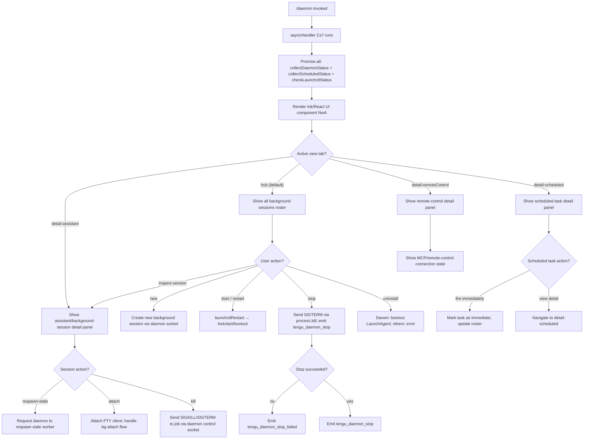

# `/daemon`

> Analysis basis: CC v2.1.172 bundle.js (AST extraction + Claude interpretation)
> Minimum version: v2.1.172

---

## Overview

The `/daemon` command exposes a management interface for the Claude Code background daemon process and its associated background sessions, scheduled tasks, and remote-control routines. When invoked, it renders an interactive React/Ink UI panel that presents live status for all background services, allows the user to start, stop, restart, or inspect individual sessions, and handles MCP server lifecycle events as they relate to background operation.

---

## Registration

| Field | Value |
|---|---|
| type | `local-jsx` |
| name | `daemon` |
| description | `Manage background services and routines` |
| loc_byte | `13208776` |
| loc_byte_end | `13208944` |
| loc_line | `9671` |
| immediate | `true` |
| module_id | `hwA` |
| load_inline | `true` |
| arbor_handler.name | `Cs7` |
| arbor_handler.fqn | `claude-2.1.172::Cs7` |
| arbor_handler.kind | `AsyncFunction` |
| arbor_handler.resolution_path | `module_id` |
| arbor_handler.n_hits | `0` |

Analysis basis: CC v2.1.172 bundle.js:+13208776

---

## Input Branching

The command has more than three distinct internal paths, driven by which view mode or detail panel the UI is in, and by the operational sub-action requested (start / stop / restart / uninstall / inspect). A Mermaid flowchart is used below.



---

## Behavioral Spec

### Handler Entrypoint

The Arbor-resolved handler `Cs7` is an `AsyncFunction` resolved via `module_id` path.

```
async function daemonCommandHandler(context):
    results = await Promise.all([
        collectAllSessionStatus(),       // vwA
        checkHomedirDaemonSocket(),      // EwA
        loadWatchdogConfig()             // wjK
    ])
    renderDaemonUI(results)             // M.render(NwA component)
```

Analysis basis: CC v2.1.172 bundle.js:+13197524

---

### Status Collection (`collectAllSessionStatus` / `vwA`)

Gathers the full daemon roster by concurrently resolving multiple status file reads.

```
async function collectAllSessionStatus():
    [rosterEntries, scheduledStatuses, daemonStatus, scheduledDaemonStatus, mcpRosterState] =
        await Promise.all([
            loadRoster(),                    // fjK → U46 → yzA reads roster.json
            loadScheduledStatuses(),         // tDK → ZEH reads daemon.status.json (ENOENT → empty)
            loadDaemonStatusFile(),          // ZwK reads daemon.status.json
            loadScheduledDaemonStatusFile(), // oYK reads daemon.scheduled.status.json
            loadMcpRosterState()             // CQ reads roster.json
        ])
    return merged state object with Object.keys enumeration
```

Analysis basis: CC v2.1.172 bundle.js:+13197045

Key file paths observed in literals:
- `daemon.json` (bundle.js:+11702370) — session roster file
- `daemon.status.json` (bundle.js:+12991976) — active daemon status
- `daemon.scheduled.status.json` (bundle.js:+13083995) — scheduled task daemon status
- `roster.json` (bundle.js:+11708809) — background session roster

---

### Roster Loading (`fjK` → `U46` → `yzA`)

```
async function loadRosterFile(path):
    raw = await fs.readFile(path, encoding="utf8")    // yzA → FB8.readFile, literal "utf8"
    trimmed = raw.trim()
    parsed = JSON.parse(trimmed)
    if not Array.isArray(parsed):
        throw Error("roster not an array")
    entries tagged with status="scheduled"             // literal "scheduled" at +13085500
    return validated entries
```

Analysis basis: CC v2.1.172 bundle.js:+12992738

---

### Daemon Socket Path Resolution (`EwA`)

Constructs the path to the daemon control socket, verifying the home directory is accessible.

```
async function resolveDaemonSocket():
    homedir = os.homedir()                             // rDK.homedir
    socketPath = path.join(homedir, ...)               // jOH.join
    stat = await fs.stat(socketPath)                   // lm6.stat
    if stat error (R8 error handler):
        return null
    return socketPath with role="assistant"            // literal "assistant" at +13181428
```

Analysis basis: CC v2.1.172 bundle.js:+13181368

---

### launchctl Status Check (`Sr` → `p8` / `gu8`)

On macOS, queries the system launcher to determine if the Claude daemon LaunchAgent is registered and running.

```
async function checkLaunchctlStatus():
    uid = process.getuid()                             // Hsq
    result = await spawnProcess("launchctl", ["print", ...])
                                                       // literals "launchctl","print" at +11705900,+11705913
    timeout = 5000 ms                                  // literal 5000 at +11705947
    agentPath = path.join(os.homedir(), "Library", "LaunchAgents", ...)
                                                       // literals "Library","LaunchAgents" at +11702685,+11702695
    return { running: boolean, agentPath }
```

Analysis basis: CC v2.1.172 bundle.js:+11705897

---

### Process Kill / Stop Flow (`ZwK` and `oYK`)

Both the regular daemon and the scheduled daemon can be stopped via `process.kill`.

```
async function stopDaemonProcess(statusFilePath):
    d9State = readAsyncLocalStorage()                  // d9 → ru4.getStore
    pidFile = await readPidFile(statusFilePath)        // Lq
    pid = parsePid(pidFile)
    if pid valid:
        process.kill(pid, signal)                      // ZwK → process.kill at +12992459
        await waitForExit(timeout, KW)
    else:
        return error
```

Analysis basis: CC v2.1.172 bundle.js:+12992262

---

### Roster JSON Parsing and Validation (`CQ`)

The background session roster is read and validated with schema checks.

```
async function loadAndValidateRoster(rosterPath):
    raw = await fs.readFile(rosterPath)                // Lf6.readFile at +11712643
    parsed = JSON.parse(raw)                           // n6 at +11712634
    if not valid schema (yy7: Array.isArray + Object.keys checks):
        throw Error("invalid roster")                  // +11712953
    checkTimestamps(eLA → Date.now)
    if roster rotation needed (Ysq):
        await fs.rename(currentPath, rotatedPath)      // Lf6.rename at +11713269
        record SH log entry
    validateRegex(y$H.test, String at +11713137)
    return parsed entries
```

Telemetry fired on parse failure: `tengu_bg_roster_parse_failed` (bundle.js:+11712724)

Analysis basis: CC v2.1.172 bundle.js:+11712634

---

### MCP Server Lifecycle Management (`M` / `yRH` / `nWA`)

The daemon UI integrates tightly with MCP server state. The `yRH` function manages MCP connection slots.

```
async function manageMcpConnections(mcpConfig):
    for each entry in Object.entries(mcpConfig):        // yRH → Object.entries at +6728490
        slot = resolveConnectionSlot(entry)             // qi → lt
        if slot.type == "disabled":                     // literal at +6728588
            skip
        if slot.type == "stdio":                        // literal at +6728690
            connectStdioServer(g1H)
        elif slot.type in ["sse-ide","ws-ide"]:         // literals at +6728789, +6728825
            connectIdeServer(sJ8)
        elif slot.type == "claudeai-proxy":             // literal at +6729097
            connectProxyServer()

    for each stale slot:
        applyConnectionResult(Ln8)                      // handles orphan disposal
        // Log: "applyConnectionResult: disposing orphaned connect..."
```

Analysis basis: CC v2.1.172 bundle.js:+16425952

---

### MCP OAuth Flow (`g1H` / `sJ8`)

When a remote MCP server requires OAuth authentication:

```
async function runMcpOAuthFlow(serverConfig):
    emit telemetry: tengu_mcp_oauth_flow_start       // +6500103
    startLocalCallbackServer(port=randomFreePort)     // AF9.createServer, 127.0.0.1
    authUrl = buildAuthorizationUrl()
    timeout = 300000 ms (5 minutes)                  // literal at +6504663
    result = await Promise.race([authPromise, timeoutPromise])
    if result == "AUTHORIZED":                        // literal at +6504890
        emit tengu_mcp_oauth_flow_success            // +6505089
        return tokens
    else:
        emit tengu_mcp_oauth_flow_error              // +6506800
        classify error type:
            "token_exchange_failed" | "timeout" | "state_mismatch" |
            "provider_denied" | "port_unavailable" | "redirect_uri_mismatch" |
            "invalid_client" | "unauthorized_client" | "cancelled"
```

OAuth callback endpoint: `/callback` (literal at +6503160)
Authentication timeout literal: 300000 ms (bundle.js:+6504663)

Analysis basis: CC v2.1.172 bundle.js:+6499957

---

### Background Session Attach (`x05` / `D` / `l0A`)

Attaching to a background session PTY involves a claim/handshake protocol.

```
async function attachToBackgroundSession(jobId):
    claim = await Hd.claim(socket)                   // B0A → Hd.claim at +16738617
    sendClaimFrame = buildClaimFrame()               // v05 → Hd.buildClaimFrame
    if claimTimeout:
        emit tengu_bg_sendclaim_failed               // +16738818
        return error
    connectSocket(Vn8.connect)
    socket.on("data", handlePtyData)
    socket.on("close", handleClose)

    // Attach result states
    switch attachResult:
        case "in-progress":
            // "job is restarting on the updated Claude Code; retry attach"
        case "ERESPAWNING":
            // "job is retiring; retry attach"
        case "EUNVERIFIED":
            // "worker is live but supervisor could not verify its identity"
        case success:
            emit tengu_bg_attach                     // +16751796
```

Analysis basis: CC v2.1.172 bundle.js:+16738617

---

### Scheduled Task Management (`l0A`)

The daemon tracks scheduled background tasks with a roster and fires them on schedule.

```
function manageScheduledTasks(rosterEntries):
    for each entry in rosterEntries:
        if entry.missed:
            emit tengu_scheduled_task_missed         // +16260241
        if entry.ready:
            emit tengu_scheduled_task_fire           // +16260992
        if entry.expired:
            emit tengu_scheduled_task_expired        // +16261335

    // Timing: check every 60 seconds (literal at +16261222)
    // Sessions shown as "(recurring)" when applicable (literal at +16260969)
    // Sessions with no schedule: "never" (literal at +16260867)
```

Analysis basis: CC v2.1.172 bundle.js:+16765935

---

### Daemon Control Socket Protocol (`x05`)

The daemon control socket uses a binary framing protocol (`Lv` / `tx8`) over a Unix domain socket.

Key message types observed in literals:
- `ping` / `pong` — keepalive (bundle.js:+16745290)
- `nudge` — wake signal
- `yield` — cooperative yield
- `lease` / `leases` — session lease management
- `shutdown` — graceful shutdown request
- `attach` — client attach
- `exec` — execute command in session
- `kill` — terminate job
- `reply` — send reply to interactive job
- `resize` — resize PTY
- `list` — enumerate sessions
- `subscribe` / `stream` / `snapshot` — live-update subscriptions
- `dispatch` — route message to job
- `ensure-spare` — pre-warm spare session
- `respawn-stale` — trigger stale-worker respawn

Protocol error codes: `EAUTH`, `ENOJOB`, `ENOREPLY`, `ESTARTING`, `EPROTO`, `EUNKNOWN`, `EUNVERIFIED`, `ERESPAWNING`, `ECONNREFUSED`

Analysis basis: CC v2.1.172 bundle.js:+16745119

---

### Daemon Config Reload (`w`)

When the daemon detects a configuration change, it reloads without full restart.

```
function handleConfigReload(newConfig):
    emit tengu_daemon_config_reload                  // +16775429
    for each MCP server slot:
        server.stop()
        server.updateConfig(newConfig)
        server.start()
    supervisor = "supervisor"                        // literal at +16774636
```

Analysis basis: CC v2.1.172 bundle.js:+16774611

---

### Ink UI Component (`NwA`)

The React/Ink component renders a tabbed interface.

```
function DaemonUIComponent(props):
    [view, setView] = useState("hub")               // literal "hub" at +13197862
    clockContext = useClock()                        // N1 → KM9.useContext
    timestamp = Date.now()

    // Tab views:
    //   "hub"                  — session roster overview
    //   "detail-scheduled"     — scheduled task detail
    //   "detail-assistant"     — assistant/background session detail
    //   "detail-remoteControl" — remote control session detail
    //   "new"                  — create new session
    //   "uninstall"            — uninstall daemon service

    render tabs for: Scheduled | Remote Control | Claude daemon
    // labels from literals at +13199282, +13199603, +13199888

    on unmount: M.unmount()
```

Analysis basis: CC v2.1.172 bundle.js:+13197735

---

## State & Side Effects

| Item | Detail |
|---|---|
| Telemetry: `tengu_bg_roster_parse_failed` | Fired when roster JSON cannot be parsed (bundle.js:+11712724) |
| Telemetry: `tengu_mcp_oauth_flow_start` | Fired at the start of an MCP OAuth handshake (bundle.js:+6500103) |
| Telemetry: `tengu_mcp_oauth_flow_success` | Fired on successful OAuth token exchange (bundle.js:+6505089) |
| Telemetry: `tengu_mcp_oauth_flow_error` | Fired on OAuth failure with error classification (bundle.js:+6506800) |
| Telemetry: `tengu_daemon_config_reload` | Fired when daemon config is hot-reloaded (bundle.js:+16775429) |
| Telemetry: `tengu_mcp_skills` | Fired to report MCP skill counts (bundle.js:+6607177) |
| Telemetry: `tengu_config_auth_loss_prevented` | Fired when a config write is blocked to prevent auth data loss (bundle.js:+3309224) |
| Telemetry: `tengu_feature_ok` / `tengu_feature_bad` | Feature flag check outcomes (bundle.js:+1016269, +1016336) |
| Telemetry: `tengu_daemon_control` | General daemon control event (bundle.js:+16796987) |
| Telemetry: `tengu_bg_proto_mismatch` | Protocol version mismatch on daemon socket (bundle.js:+16746616) |
| Telemetry: `tengu_bg_dispatch_stale_drop` | Stale dispatch message dropped (bundle.js:+16747984) |
| Telemetry: `tengu_bg_attach_legacy_autorespawn` | Legacy client triggered auto-respawn on attach (bundle.js:+16750638) |
| Telemetry: `tengu_bg_attach` | Client successfully attached to background session (bundle.js:+16751796) |
| Telemetry: `tengu_bg_attach_stall_gave_up` | Attach abandoned due to session startup stall (bundle.js:+16752719) |
| Telemetry: `tengu_bg_attach_stall_respawn` | Session respawned due to startup stall (bundle.js:+16752989) |
| Telemetry: `tengu_bg_attach_kick` | Session kicked due to another client opening it (bundle.js:+16753939) |
| Telemetry: `tengu_scheduled_task_missed` | Scheduled task was missed (bundle.js:+16260241) |
| Telemetry: `tengu_bg_dispatch_sigkill_escalate` | SIGKILL escalation on dispatch timeout (bundle.js:+16759925) |
| Telemetry: `tengu_bg_low_mem_mb` | Low memory threshold reached on macOS (bundle.js:+13266653) |
| Telemetry: `tengu_bg_dispatch_low_mem` | Background dispatch dropped due to low memory (bundle.js:+16760526) |
| Telemetry: `tengu_scheduled_task_fire` | Scheduled task triggered (bundle.js:+16260992) |
| Telemetry: `tengu_scheduled_task_expired` | Scheduled task expired without running (bundle.js:+16261335) |
| Telemetry: `tengu_bg_spare_enable` | Spare session pool enabled (bundle.js:+16761230) |
| Telemetry: `tengu_bg_sendclaim_failed` | Daemon socket claim frame send failed (bundle.js:+16738818) |
| Telemetry: `tengu_bg_state_read_transient` | Transient error reading bg session state (bundle.js:+4226591) |
| Telemetry: `tengu_bg_spare_claim` | Spare session successfully claimed (bundle.js:+16761358) |
| Telemetry: `tengu_bg_spare_claim_fail` | Spare session claim failed (bundle.js:+16761624) |
| File I/O | Reads `daemon.json`, `daemon.status.json`, `daemon.scheduled.status.json`, `roster.json` from the Claude data directory |
| Process signals | Sends `SIGTERM` (stop) and `SIGKILL` (escalation) via `process.kill` to daemon PIDs |
| macOS launchctl | Invokes `launchctl print`, `kickstart`, `bootout` for LaunchAgent management |
| Ink UI | Mounts an Ink React component; unmounts on exit via `M.unmount()` |
| Daemon socket | Connects to the Unix domain socket for binary-framed control messages |
| Log rotation | Rotates roster log files via `fs.rename` when thresholds are reached |
| OAuth HTTP server | Starts a transient `http.createServer` on `127.0.0.1` for OAuth callback; timeout 300000 ms |

---

## Version History

| Version | Change |
|---|---|
| v2.1.172 | Initial analysis |

---

## Common Mistakes

1. **Invoking `/daemon` without a running daemon process**: The command reads status files and connects to a Unix socket; if the daemon has never been started, status reads will return empty/ENOENT results and the UI will show no sessions rather than an error message.
2. **Expecting `/daemon stop` to be instant**: A SIGTERM is sent first; SIGKILL escalation only occurs after a timeout. The stop may appear hung for several seconds.
3. **Using `/daemon uninstall` on non-macOS**: The `bootout` path is Darwin-only. On other platforms the command returns an error: `"service uninstall not available on darwin"` (bundle.js:+11704590) — this message is misleading; it means the feature is not supported on the current platform.
4. **Confusing `daemon.json` with `daemon.status.json`**: The former is the session definition/roster file; the latter holds live runtime status. Editing `daemon.json` directly without restarting the daemon may cause the status file to be stale.
5. **OAuth callback on remote/SSH sessions**: The OAuth callback server binds to `127.0.0.1`; on remote sessions the browser redirect to `http://localhost:<port>/callback` will fail to load. The user must paste the full redirect URL manually using the `complete_authentication` tool path (bundle.js:+6531389).

---

## Appendix — Identifier Mapping

> For bundle debugging only. Identifiers change across versions.

| Identifier | Role |
|---|---|
| `Cs7` | Main daemon command async handler (Arbor-resolved handler) |
| `Fs7` | Inner render/orchestration function called by Cs7 |
| `vwA` | collectAllSessionStatus — gathers all daemon status concurrently |
| `ITH` | Internal helper called by vwA |
| `fjK` | loadRoster — reads and parses roster JSON |
| `U46` | Roster entry validator and transformer |
| `yzA` | Reads a file as UTF-8 JSON, validates array shape |
| `AwA` | Array.isArray check helper for roster entries |
| `SH` | Log/queue helper; pushes to iQH, logs errors via Ya.logError |
| `JA` | Error constructor wrapper |
| `f6` | String coercion helper |
| `Rq` | Essential-traffic queue helper |
| `fRf` | Circular log buffer shift/push helper (Ko6) |
| `WG` | Process kill + wait helper using Ix6 and dLA |
| `Ix6` | Reads PID file; resolves daemon.json path |
| `dLA` | Reads file and parses PID from split lines |
| `KW` | Post-kill cleanup helper (calls KS) |
| `tDK` | loadScheduledStatuses — reads daemon.status.json for scheduled entries |
| `ZEH` | Status file reader with ENOENT handling |
| `d9` | AsyncLocalStorage getStore accessor |
| `N8` | Error normalizer / null check |
| `TwA` | Status state transformer (calls GwA) |
| `EH` | String coercion for error messages |
| `K` | padEnd formatter for display columns |
| `yx` | Path joiner for daemon.json (cLA.join + A_) |
| `ZwK` | stopDaemonProcess — reads status, kills PID via process.kill |
| `km6` | Constructs daemon.status.json path (GwK.join + A_) |
| `oYK` | stopScheduledDaemonProcess — kills scheduled daemon PID |
| `rYK` | Constructs daemon.scheduled.status.json path (nYK.join + A_) |
| `CQ` | loadAndValidateRoster — reads roster.json with rotation logic |
| `n6` | JSON.parse wrapper |
| `p$H` | roster.json path builder (Z$.join) |
| `m$H` | Base path builder for roster directory |
| `R8` | Error type checker (ENOENT, EISDIR, etc.) |
| `eLA` | Date.now wrapper for timestamp comparison |
| `a7` | N8 error wrapper |
| `d6H` | Roster diff helper |
| `Ysq` | Roster rotation helper (fs.rename + Date.now) |
| `yy7` | Roster schema validator (Array.isArray + Object.keys) |
| `H1` | Helper calling _56 |
| `_56` | Low-level utility (byte offset 3852) |
| `Sr` | checkLaunchctlStatus — queries macOS launchctl |
| `p8` | Spawns launchctl subprocess (calls u_ and p6) |
| `u_` | Process spawn wrapper with timeout/signal handling |
| `p6` | Process output collector (zo6, P_) |
| `gu8` | Gets current uid via process.getuid (Hsq) |
| `Hsq` | process.getuid wrapper |
| `EwA` | resolveDaemonSocket — stats home dir socket path |
| `P_` | Path join helper (calls BG) |
| `BG` | Base path utility |
| `yo6` | Helper combining o6 and R8 |
| `o6` | File existence / stat helper |
| `N` | Logger/notifier: formats message, calls lf, rFH, l8f |
| `g8f` | Log writer calling th, Cs8, kZA |
| `kZA` | Log sink (deK, ceK) |
| `H` | Random/timeout utility; also used as general value holder |
| `CH` | JSON.stringify wrapper |
| `lf` | MNA-based log formatter with REDACTED support |
| `MNA` | Maps log fields (p8f.map) |
| `A` | toLowerCase utility |
| `rFH` | Output writer (ovA → H.write) |
| `ovA` | Raw stream write wrapper |
| `l8f` | Appends to log file with rotation (TFH, BfH, ms8, c8f) |
| `TFH` | Log flush timer (clearTimeout, setTimeout, setImmediate) |
| `BfH` | Log path builder (i6H.join, A_) |
| `A36` | N8 check in log path |
| `zNA` | Log directory join helper |
| `ms8` | Log rotation helper (stat, rename, unlink) |
| `c8f` | Log append with rotation (mkdir, appendFile) |
| `y9` | Hook registration (hZA.register) |
| `M` | Ink render/unmount controller |
| `yRH` | manageMcpConnections — main MCP slot manager |
| `qi` | MCP slot resolver (gZ6, lt, O2H, Og, kJ8, BZ6) |
| `gZ6` | Slot type mapper (Pk, N4H) |
| `lt` | MCP config entry processor |
| `Og` | MCP server list builder (Object.entries, B1H) |
| `kJ8` | MCP error color formatter (AU_, W6.red, W6.yellow) |
| `BZ6` | MCP slot state tracker (q.has/set/get, Jj8, XC9, zMH) |
| `QV` | MCP connection state resolver (Hw, KU_) |
| `Hw` | Connection state helper (HAH, b6, Lq) |
| `g8` | General helper calling _ |
| `uV6` | UI value helper |
| `Jc9` | MCP session context builder (oB_, Y2H, jj8) |
| `oB_` | MCP needs-auth cache reader (d9, aX8, n6) |
| `Y2H` | Config hash generator (CH, Array.isArray, Object.keys, dB9.createHash, sha256) |
| `jj8` | Config key extractor (C1H, Object.keys) |
| `Jj8` | Config diff helper (jj8, nX) |
| `nX` | Hash helper (CH, JC9.createHash) |
| `Yj8` | Config fingerprint helper (hf) |
| `hf` | dV1 fingerprint helper |
| `j8` | MCP debug logger (iQH.push, Ya.logMCPDebug) |
| `sJ8` | MCP SSE/WebSocket/IDE server connector |
| `pWL` | Pre-connection setup helper |
| `Nc` | MCP client factory (mu, rK) |
| `S1H` | MCP server schema validator (IR9, KYL) |
| `R1H` | MCP response handler |
| `g1H` | MCP stdio/HTTP server manager (full OAuth + port + PTY lifecycle) |
| `aeH` | Pending connection tracker (dJ8.set/get/delete) |
| `Y` | Process exit / abort controller |
| `eJ8` | MCP auth cache writer (d9, aX8) |
| `Li` | MCP reconnect logic (ty, r0, aS, TH6, Vc9, XU_) |
| `mu` | MCP client core (rK) |
| `w` | Supervisor config updater (ZEH, E.stop/updateConfig/start, DrK) |
| `OL` | MCP error logger (iQH.push, Ya.logMCPError) |
| `UWL` | Auth completion helper |
| `mWL` | SSH environment detector (_6.isSSH, f6, vq) |
| `tJ8` | MCP tool invocation handler (Nc, uWL, oeH, seH) |
| `oeH` | Pending request getter (QJ8.get) |
| `seH` | Pending request getter (dJ8.get) |
| `f` | Promise tracking set (q.add, L.finally, q.delete) |
| `Vc9` | MCP needs-auth flow orchestrator |
| `aX8` | MCP auth cache path builder (oX8.join, A_) |
| `XU_` | MCP config hash check (nX, hf, j8, EH) |
| `j` | Process cleanup set (A.values, S.kill) |
| `S` | Background process manager (XrK, v3, N, SH, s05, w.write) |
| `pN` | MCP skills tracker (Y6) |
| `Y6` | Skills count emitter (N26, h26, Ym, rjH.has, N78, zF.has/get, b6) |
| `qU_` | Connection status resolver (E8, A.includes) |
| `E8` | Full connection state object builder (F78, nG, H, HJH, y_9, b26, N, W7H, brH, c, B78) |
| `k` | General array/value holder |
| `Gc9` | FF-based concurrency limiter |
| `FF` | Generic concurrency/rate-limit utility (TypeError, Number.isSafeInteger, AggregateError) |
| `ZH6` | parseInt-based slot ID parser |
| `sX8` | parseInt-based slot version parser |
| `Ln8` | applyConnectionResult — handles orphan disposal and config-change mid-flight |
| `kRH` | Config change checker (Y2H) |
| `r0` | MCP slot cleanup (TH6, K.cleanup, pN) |
| `TH6` | Slot state updater (Y2H) |
| `$` | Daemon background watcher (TwK) |
| `TwK` | Daemon heartbeat writer (pa, Date.now, d9, km6, CH) |
| `pa` | Path helper (OLH) |
| `nWA` | DaemonUIComponent — main Ink/React UI component |
| `mJ8` | MCP server permission set checker (OWL.has, $U_.has) |
| `d8` | Abort/timeout helper (K, Error, q, setTimeout, clearTimeout, O) |
| `O` | Session state holder (m8) |
| `wjK` | loadWatchdogConfig — reads watchdog/scheduled config (gnH) |
| `gnH` | Config loader calling wJ6 |
| `wJ6` | Watchdog config parser (NP4, _.has, N, _.add, A.filter) |
| `NP4` | Model/plan config parser (ZP4, Nm1, XJ_, FnH, c_, wL, IDH, gA, Hl, rU, aDH, EP4, zJ6, PJ_, v7, Zj, Fm1, gm1, VP4) |
| `Cs7` | (duplicate entry — see handler row above) |
| `NwA` | (duplicate entry — see DaemonUIComponent above) |
| `N1` | Clock context accessor (KM9.useContext) |
| `L` | Session close/stream manager (A.close, q.close, f) |
| `If` | useMemo/useRef/useSyncExternalStore hook bundle |
| `z` | App lifecycle controller (kH, bH, wS, CU) |
| `kH` | "ok" feature flag branch (c, A6) |
| `A6` | _56 caller |
| `bH` | "bad" feature flag branch (c, A6) |
| `wS` | Startup event emitter (eu, Dl.push, GhH, HJ_) |
| `eu` | nC caller (startup notification) |
| `GhH` | zS shutdown handler |
| `HJ_` | Session start event emitter (Dq8, tj_.randomUUID, NnH, QB, H.emit) |
| `CU` | Graceful shutdown orchestrator (Promise.race, Promise.all, vLH, NLH, d8, process.exit) |
| `vLH` | VLH.shutdown caller |
| `NLH` | clearTimeout + ZZ_ cleanup helper |
| `G` | Keyboard/input handler (SK.fromText, T.preventDefault, z.handleKeyDown, MNK, QvK, nvK, ovK, svK, UvK, BvK, YXA) |
| `MNK` | Vim-mode normal-state key router (g45, Q45, d45, c45, l45) |
| `g45` | Vim operator dispatcher (_.setOffset, $NK) |
| `$NK` | Vim motion executor ($XA, OXA, A.setOffset, VUH, LNK) |
| `Q45` | Vim count-prefix handler (Math.min, parseInt, String, $NK) |
| `d45` | Vim delete-line handler (A.setOffset, A.setLastFind) |
| `c45` | Vim change handler (A.setOffset, VUH) |
| `VUH` | Cursor position validator (N45, f.equals) |
| `l45` | Vim textobject handler (zXA.has, wd8) |
| `wd8` | Textobject executor (uvK, _O8, I45, k45) |
| `QvK` | Vim visual-op handler (Td8, Gd8, gvK, A.recordChange) |
| `Td8` | Vim motion calculator (Math.min, Math.max, pvK, f.indexOf) |
| `pvK` | Line-end finder (H.lastIndexOf) |
| `Gd8` | Word-boundary finder (V4, H.endsWith, NVH) |
| `V4` | H.indexOf wrapper |
| `NVH` | XY wrapper for word boundary |
| `gvK` | Vim yank/paste handler (q.setRegister, q.setText, q.enterInsert, dL6) |
| `dL6` | Delete range helper (q.setRegister, q.setOffset, q.setText, fXA, q.enterInsert) |
| `nvK` | Vim replace handler (Td8, Gd8, lvK, A.recordChange) |
| `lvK` | Vim replace executor (XY, q.setText, q.setOffset) |
| `ovK` | Vim case-change handler (Td8, Gd8, rvK, A.recordChange) |
| `rvK` | Case toggle/upper/lower executor (XY, M.toUpperCase, M.toLowerCase) |
| `b` | Clipboard/register manager (MSH, w, N, pa, FsH, wW9, P, z, S, X, MgK, P1H) |
| `MSH` | Register read helper (o6, _.readFile, b5H, T9, SH, Lq, Array.isArray, N, CH, $k) |
| `b5H` | Register path builder (nw8.join, vf) |
| `T9` | N8 wrapper for register read |
| `$k` | Register entry parser (H.trim, I9L, A.push) |
| `FsH` | Register write helper (vf, lw8.mkdir, nw8.join, H.map, lw8.writeFile, b5H, CH) |
| `vf` | BG path helper |
| `wW9` | Register history pruner (H.filter, BsH) |
| `BsH` | Register history entry validator ($k, psH, q.getTime) |
| `P` | Buffer/socket multiplexer (Buffer.concat, X.indexOf, j.off, I7, j.setTimeout, x05) |
| `X` | Socket wrapper (M, q.setTimeout) |
| `I7` | Socket end helper (H.end, CH) |
| `x05` | Full daemon socket protocol handler (all message types) |
| `d` | Socket holder (Ix6, aaq) |
| `aaq` | Socket unlink helper (DU.unlink, NTH, R8) |
| `MgK` | Cron-expression formatter (H.map, hN, Math.max, q.join) |
| `hN` | Cron field parser (H.trim, K.match, parseInt, D.toString, f.match) |
| `P1H` | Permission/consent handler (F6H, MSH, q.filter, A.has, FsH) |
| `F6H` | Permission set has-check (_.has) |
| `svK` | Vim paste-visual handler (_.getRegister, Td8, Gd8, evK) |
| `evK` | Vim paste executor (H.endsWith, H.slice, q.setRegister, q.setText) |
| `UvK` | Vim word-select handler (Math.min, Math.max, V4, K.slice, K.split, _.setText) |
| `NUH` | H.slice wrapper |
| `BvK` | Vim line-select handler (Math.min, Math.max, V4, L.slice, L.split, LXA) |
| `LXA` | Line start-detection helper (L.startsWith, L.slice) |
| `D` | Background session state machine (A.get, c, b.kill, d8, H, bH, kH, n0A.freemem, hF8, l06, SH, B0A, l0A) |
| `hF8` | macOS memory check (t6, Y6; emits tengu_bg_low_mem_mb) |
| `l06` | Pinned session loader (GW.readFile, gk_, n6, Array.isArray, Vt4) |
| `gk_` | pins.json path builder (vJ.join, iE) |
| `Vt4` | Directory-based pin scanner (GW.readdir, GW.readFile, vJ.join, A.push, R8) |
| `Q` | Background PTY session wrapper (d.on, N8, l, d.once, C, process.kill, N, B, HQ8.unlink, hZ, p, Lv, tx8, d.destroy, d.connect) |
| `l` | Session task scheduler/loop (z, B.add, G.has, X.get, YT6, rw8, X.set, N, c, P1H, G.add, G.delete, X.delete, l0A) |
| `C` | clearTimeout + O.write helper |
| `B` | Session tracking set |
| `hZ` | Socket path builder (t6, Z$.join, _pH, H.split) |
| `p` | PTY writer helper |
| `Lv` | Binary frame builder (Buffer.from, Buffer.allocUnsafe, A.writeUInt32BE, A.writeUInt8, _.copy) |
| `tx8` | Binary frame parser (Buffer.alloc, Buffer.concat, A.readUInt32BE, A.readUInt8, A.subarray, Buffer.from, n6) |
| `B0A` | Session claim + connect orchestrator (Hd.claim, KjA, N05, v05, K.socketAuth, Vn8.connect, L.on, L.once, L.write, Lv, L.end) |
| `KjA` | Session state directory writer (_d.mkdir, _d.writeFile, JSON.stringify; file modes 448/384) |
| `N05` | Claim timeout handler (Date.now, Error, h05, N8, d8) |
| `v05` | Claim frame builder (Hd.buildClaimFrame) |
| `l0A` | Full session lifecycle manager (Hf, Tq, YO, wXH, m7, Mf6, xx6, U$H, hZ, RQ, bx6, _.rosterEntry, setTimeout, w.get/delete/set, H.delete) |
| `Hf` | Session dir path builder (vJ.join, iE) |
| `Tq` | Session state file tracker (vJ.join, GW.stat, z5H.get/set/delete/clear, YXH.has/add/delete, GW.readFile, Zt4, n6, Number.isFinite) |
| `YO` | Active session roster helper (DN) |
| `wXH` | Session event filter (K.startsWith, A.push, K.indexOf, K.slice, O5H.has, hO8.has, _.push, O.push, Uk_.has, N, A.join, Gt4) |
| `m7` | Session message helper (MO, vJ.join, CH, NJ) |
| `Mf6` | Scheduled task executor (Dsq.then, CQ, H, Date.now, Sy7, _.catch; fires tengu_scheduled_task_fire) |
| `xx6` | Socket path builder xx6 (Z$.join, Cx6) |
| `U$H` | Status file path builder (Z$.join, _pH) |
| `RQ` | Roster entry path helper (t6, aLA, Z$.join, ff6) |
| `bx6` | Socket path builder bx6 (Z$.join, Cx6) |
| `YXA` | Vim insert-mode key router (S45, R45, C45, b45, x45, u45, m45, p45, U45, B45, F45) |
| `S45` | Vim insert motion handler (_.setOffset, KNK) |
| `KNK` | Vim insert-state executor ($XA, Zd8.has, VUH, A.setOffset, Vd8.has, Xd8, jd8, Pd8, mvK, vUH, qXA, LNK, A.enterInsert, uU6) |
| `R45` | Vim insert repeat handler (Math.min, parseInt, String, KNK) |
| `C45` | Vim insert change handler (qXA, fNK) |
| `qXA` | Vim insert text manipulator (q.split, V4, q.slice, Math.min, q.indexOf, A.setRegister, A.setOffset, A.setText, Math.max, td, A.enterInsert, A.recordChange) |
| `fNK` | Vim insert find handler (OXA, Vd8.has, Zd8.has, vUH, HNK) |
| `b45` | Vim insert-repeat-find handler (Math.min, parseInt, String, fNK) |
| `x45` | Vim find-char handler (Yd8) |
| `Yd8` | Find-char executor (y45, dL6, K.setLastFind, K.recordChange) |
| `u45` | Vim undo handler (zXA.has, Dd8) |
| `Dd8` | Undo executor (wd8, dL6, K.recordChange) |
| `m45` | Vim last-find-set handler (A.setOffset, A.setLastFind) |
| `p45` | Vim end-of-line handler (VUH, A.setOffset, Math.min) |
| `U45` | Vim insert-append handler (vUH, _NK) |
| `vUH` | Vim visual-select handler (VUH, K.equals, _XA, KXA, q.setRegister, q.enterInsert, dL6, q.recordChange) |
| `_NK` | Vim replace-char handler (q.equals, KXA, dL6, A.recordChange) |
| `B45` | Vim join-lines handler (Jd8) |
| `Jd8` | Join-lines executor (w36, K.slice, A.setText, A.setOffset, Math.max, A.recordChange) |
| `F45` | Vim wrap-line handler (Wd8) |
| `Wd8` | Wrap-line executor (Math.min, LXA, K.join, A.setText, A.setOffset, NUH, A.recordChange) |
| `J` | Session/job holder (D) |
| `_f6` | macOS LaunchAgent uninstall helper (iLA, p8, gu8, YKH.unlink, R8, EH) |
| `iLA` | LaunchAgent plist path builder (yx6.join, lLA.homedir) |
| `Rx6` | macOS LaunchAgent install/restart helper (rLA) |
| `rLA` | LaunchAgent kickstart/stop/restart dispatcher (gu8, p8, eaq.setTimeout) |
| `E` | Terminal resize/min-max helper (W, Math.max, Math.min) |
| `W` | MCP server connection wrapper (V76, aS, UN, Promise.all, Yi, nb, SH, JA) |
| `V` | Push array for deferred render |

Note: index built via Arbor fallback; some signals (telemetry, literals) may be missing — see arbor-fallback.js.