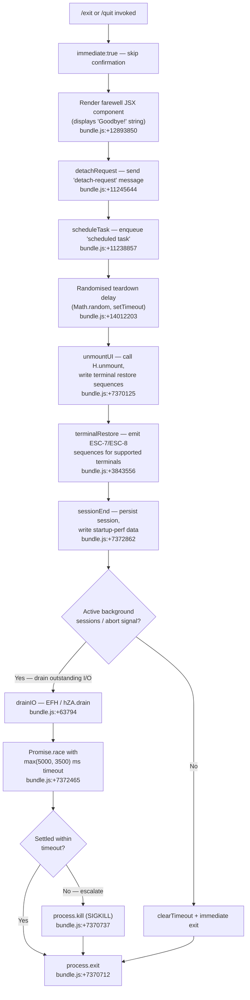

# `/exit`

> Analysis basis: CC v2.1.172 bundle.js (AST extraction + Claude interpretation)
> Minimum version: v2.1.172

---

## Overview

The `/exit` command (aliased as `/quit`) terminates the Claude Code interactive session immediately. When invoked, it triggers a graceful shutdown sequence: rendering a farewell JSX component, flushing pending background work, retiring any active sessions, persisting telemetry, and ultimately calling `process.exit`. The `immediate: true` flag means the command is dispatched without waiting for a user confirmation prompt.

---

## Registration

| Field | Value |
|---|---|
| type | `local-jsx` |
| name | `exit` |
| description | `null` |
| aliases | `["quit"]` |
| immediate | `true` |
| module_id | `YOK` |
| load_inline | `true` |
| loc_byte | `12894637` |
| loc_byte_end | `12894833` |
| loc_line | `9138` |
| arbor_handler.name | `Ki7` |
| arbor_handler.fqn | `claude-2.1.172::Ki7` |
| arbor_handler.kind | `AsyncFunction` |
| arbor_handler.resolution_path | `module_id` |
| arbor_handler.n_hits | `1` |

Analysis basis: CC v2.1.172 bundle.js:+12894637

---

## Input Branching

The exit flow has more than three distinct paths (terminal UI teardown → JSX render → session serialization → process termination with optional abort-signal or timeout escalation), so a Mermaid flowchart is used.



---

## Behavioral Spec

### 1 — Handler Entry (`exitCommandHandler`)

The registered `AsyncFunction` handler (`Ki7`, resolved via `module_id: YOK`) is the sole entry point. Because `immediate: true` is set on the registration object, the CLI framework dispatches it without pausing for any confirmation dialog.

```
async function exitCommandHandler(context):
    renderFarewellComponent(context)     // FOA.createElement + qi7/pW
    sendDetachRequest(context)           // S$H → "detach-request" message
    enqueueScheduledTask(context)        // ax8 → "scheduled task" label
    await performShutdownSequence(context)
```

Analysis basis: CC v2.1.172 bundle.js:+12893886–12894056

---

### 2 — Farewell Rendering (`renderFarewellComponent`)

A JSX element is constructed (via `FOA.createElement`) and mounted. The helper `qi7` delegates to the internal paint routine `pW`. The string literal `"Goodbye!"` is used as the display text.

```
function renderFarewellComponent(context):
    element = createElement(FarewellWidget, { message: "Goodbye!" })
    mountComponent(element)   // qi7 → pW
```

Analysis basis: CC v2.1.172 bundle.js:+12893963, literal "Goodbye!" at +12893850

---

### 3 — Detach Request (`sendDetachRequest`)

The session coordinator helper (`S$H`) serialises a `"detach-request"` message object and writes it via the IPC channel helper (`Wr` → `DHH.write`). The payload is JSON-encoded (`CH` → `JSON.stringify`). A follow-up flush token (`fKH`) is dispatched afterwards.

```
function sendDetachRequest(context):
    payload = buildMessage(type: "detach-request")  // _18, Miq → pC8 / m8
    writeToChannel(payload)                          // Wr → DHH.write
    encodeJSON(payload)                              // CH → JSON.stringify
    flushChannel()                                   // fKH
```

Analysis basis: CC v2.1.172 bundle.js:+11245610, literal "detach-request" at +11245644

---

### 4 — Scheduled Task Enqueue (`enqueueScheduledTask`)

The background-task helper (`ax8`) pushes an entry labelled `"scheduled task"` onto the task queue (`H.push`), then invokes the task-scheduling sub-system (`Tv7`). Task scheduling internally parses cron-style expressions via `hN` (which handles `parseInt`, `D.toString`, date math using `getUTCDay`/`setUTCDate`/`setUTCHours` etc.) and resolves relative time references via `psH`.

```
function enqueueScheduledTask(context):
    taskEntry = buildEntry(label: "scheduled task", type: "task")  // OE → BG
    taskQueue.push(taskEntry)                                       // ax8 → H.push
    scheduleDispatch(taskEntry)                                     // Tv7
        parseScheduleExpression(expression)                         // hN
        resolveRelativeTime(expression)                             // psH
        computeDeltaMs()                                            // R9 → Math.floor/round
```

Analysis basis: CC v2.1.172 bundle.js:+11238838, literals "scheduled task" at +11238857, "task" at +11239988

---

### 5 — Shutdown Sequence (`performShutdownSequence`)

This is the deepest and most branching part of the call graph, implemented in the shutdown orchestrator (`Z9`).

```
async function performShutdownSequence(context):
    // Step A: UI teardown
    unmountUI()           // xCH → H.unmount
    restoreTerminal()     // E38 — writes ESC-7 (save cursor) / ESC-8 (restore cursor)
                          //       detects tmux / screen / Ghostty ≥1.2.0 / iTerm2 ≥3.6.6
    formatExitMessage()   // ad_ — replaces "\\" and "\"" in output path
                          //       writes dim-styled text via W6.dim

    // Step B: Session persistence
    persistSessionEnd()   // $6 → _56; emits "session_end" telemetry event
    flushCacheHint()      // mCH + BW8; emits "tengu_cache_eviction_hint"

    // Step C: Drain outstanding I/O
    await drainIO()       // EFH → hZA.drain

    // Step D: Race against timeout
    timeoutMs = Math.max(5000, 3500)   // bundle.js:+7372465
    result = await Promise.race([
        drainIO(),
        AbortSignal.timeout(timeoutMs)
    ])

    // Step E: Retire background sessions
    retireAllSessions()   // de9 → Promise.allSettled + Array.from
    configReloadSignal()  // w → ZEH; emits "tengu_daemon_config_reload"

    // Step F: Final exit
    clearTimeout(safetyTimer)
    if allSettled:
        process.exit(0)   // sd_ → process.exit
    else:
        process.kill(SIGKILL)  // sd_ → process.kill; "unreachable" guard thrown
```

Analysis basis: CC v2.1.172 bundle.js:+7372368 (Z9 entry), +7372465 (timeout constants), +7370712 (process.exit), +7370737 (process.kill)

---

### 6 — Terminal Restore (`restoreTerminal`)

The terminal-restore helper (`E38`) handles cursor/screen-state restoration across multiplexers and terminal emulators.

```
function restoreTerminal():
    ls.writeSync(stdout, ESC_SAVE_CURSOR)    // "\x1B7"  bundle.js:+3843556
    ls.writeSync(stdout, ESC_RESTORE_CURSOR) // "\x1B8"  bundle.js:+3843567
    if terminal == "tmux" or terminal == "screen":
        escapeSequences = replaceAll("\\", "\"")  // b0 → H.replaceAll
    if terminal == "ghostty" and version >= "1.2.0":
        applyGhosttyWorkaround()   // pkH → lE
    if terminal == "iTerm.app" and version >= "3.6.6":
        applyITermWorkaround()     // pkH → K49.coerce
```

Analysis basis: CC v2.1.172 bundle.js:+3843402, literals at +3843556, +3843567, +3492994, +3571156, +3571225

---

### 7 — Process Exit Finaliser (`exitFinaliser`)

```
function exitFinaliser(code):
    clearTimeout(watchdogTimer)     // sd_ → clearTimeout
    sessionRef = sessionStore.get() // sd_ → v4.get
    if sessionRef != null:
        process.exit(code)          // nominal path
    else:
        process.kill(pid, SIGKILL)  // escalation path
        throw Error("unreachable")  // guard literal bundle.js:+7370785
```

Analysis basis: CC v2.1.172 bundle.js:+7370631–7370779

---

### 8 — Forced Shutdown via Signal (`forcedShutdown`)

A separate signal-based shutdown path (`Y`) is reachable when an external abort arrives during teardown. It emits the string `"forced shutdown"` and calls `z.abort`.

```
function forcedShutdown(reason):
    logMessage("forced shutdown")   // bundle.js:+16793309
    invokeHook(HX)                  // HX
    signalAbort(abortController)    // z.abort
    process.exit(exitCode)          // process.exit
```

Analysis basis: CC v2.1.172 bundle.js:+16793306–16793349, literal "forced shutdown" at +16793309

---

## State & Side Effects

| Item | Detail |
|---|---|
| Telemetry — `tengu_cache_eviction_hint` | Emitted during session-end flush (bundle.js:+7372824) |
| Telemetry — `tengu_scroll_summary` | Emitted from scroll-state snapshot helper during teardown (bundle.js:+7371881) |
| Telemetry — `session_end` literal | Marks the end of the session record (bundle.js:+7372862) |
| Telemetry — `prompt_input_exit` literal | Records the command invocation as a prompt-input exit event (bundle.js:+12894074) |
| Telemetry — `tengu_daemon_config_reload` | Emitted when supervisor config is refreshed at shutdown (bundle.js:+16775429) |
| Telemetry — `tengu_startup_perf` | Startup-perf data flushed on exit (bundle.js:+221519) |
| Telemetry — `tengu_bg_*` family | Background-session lifecycle events emitted if background sessions are active at exit time (bundle.js:+16759925, +16760526, +16761230, +16761358, +16761624) |
| Telemetry — `tengu_amber_creek` / `tengu_pewter_brook` | Fullscreen/render-mode diagnostic events emitted during UI teardown (bundle.js:+3504104, +3504012) |
| IPC write | `"detach-request"` message written to daemon channel via `DHH.write` (bundle.js:+10580805) |
| Terminal state | ESC cursor-save/restore sequences (`\x1B7`/`\x1B8`) written to stdout; tmux/screen escape-doubling applied |
| Process state | `process.exit(0)` called on clean exit; `process.kill(SIGKILL)` on timeout escalation |
| Timer | Watchdog `setTimeout` set with `Math.max(5000, 3500)` ms; cleared in finaliser |
| Background sessions | All active background sessions retired via `Q.retireIfSettled` / `Promise.allSettled` |
| Startup perf log | Written to file via `pfH.writeFileSync` + `pfH.fsyncSync` if profiling was enabled |

---

## Version History

| Version | Change |
|---|---|
| v2.1.172 | Initial analysis |

---

## Common Mistakes

1. **Typing `/exit` while a long-running tool is active** — Because `immediate: true` is set, the command fires without confirmation. Any in-flight tool call will be abandoned; background sessions are only gracefully retired if they settle within the `max(5000, 3500)` ms window.
2. **Expecting a confirmation prompt** — Unlike some other destructive commands, `/exit` (and its alias `/quit`) has no confirmation step. The farewell component renders and shutdown begins immediately.
3. **Confusing `/exit` with Ctrl-C** — `/exit` performs the full graceful-shutdown path including telemetry flush, session persistence, and terminal restore. A raw SIGINT or Ctrl-C may skip parts of this path.
4. **Using the alias `/quit` and expecting different behaviour** — `/quit` is a registered alias and follows exactly the same code path as `/exit`.
5. **Terminal state corruption in tmux/screen** — If the terminal restore path (`E38`) is interrupted (e.g. by SIGKILL escalation), the cursor-save/restore sequences may not be emitted, leaving the terminal in an unexpected state.

---

## Appendix — Identifier Mapping

> For bundle debugging only. Identifiers change across versions.

| Identifier | Role |
|---|---|
| `Ki7` | Main exit command handler (`AsyncFunction`; Arbor-resolved entry point) |
| `O9` | Background/daemon session lookup helper |
| `RDH` | Daemon record type or registry |
| `H` | General-purpose utility / timer helper (also `H.unmount` for React/Ink teardown) |
| `S$H` | Detach-request serialiser / IPC send helper |
| `_18` | Message-builder sub-helper inside detach flow |
| `Miq` | Message assembly helper |
| `pC8` | Message field builder A |
| `m8` | Message field builder B |
| `Wr` | IPC channel write wrapper |
| `CH` | JSON-serialisation helper |
| `fKH` | Channel flush token dispatcher |
| `iM` | Unknown utility invoked early in handler body |
| `ax8` | Scheduled-task enqueue helper |
| `OE` | Task entry constructor |
| `BG` | Low-level record/struct builder |
| `Tv7` | Task scheduling / cron-dispatch orchestrator |
| `hN` | Cron/schedule expression parser |
| `K` | Column padding / display formatter |
| `D` | Background-session lifecycle manager (spawn, kill, freemem, retry) |
| `f` | Async-task set manager (add/delete/finally) |
| `j` | Session kill-all helper |
| `Y` | Forced-shutdown / abort signal handler |
| `$` | TwK-based helper (signal or config lookup) |
| `J` | Date-math context object (UTC day/date/hours) |
| `$k` | Schedule-string trimmer and parser |
| `I9L` | Interval/range set builder (parseInt + K.add) |
| `A` | Identifier-normalisation array helper (toLowerCase) |
| `psH` | Relative-time resolver (minutes, hours, months) |
| `_` | Date/time object used in relative-time calculations |
| `O` | Date-mutation object (setSeconds/setMinutes/setHours etc.) |
| `L` | Session/connection close helper; also time-set membership helper |
| `q` | Data-channel / queue helper |
| `R9` | Duration-to-human-string formatter (Math.floor/round) |
| `pq` | String-width truncation helper |
| `f8` | `Bun.stringWidth` wrapper |
| `m1` | Multi-segment string-width calculator |
| `XY` | Fallback string-width sub-helper |
| `qi7` | Farewell JSX widget wrapper |
| `Z9` | Shutdown sequence orchestrator |
| `xCH` | UI unmount + terminal write helper |
| `Db` | Additional teardown sub-helper |
| `E38` | Terminal restore / cursor-save helper |
| `pkH` | Terminal-emulator version checker (Ghostty / iTerm2) |
| `kkH` | Supplemental terminal cleanup helper |
| `b0` | Escape-sequence doubling helper (tmux/screen) |
| `v3` | Auxiliary teardown step |
| `N` | Debug/log formatter (toUpperCase, trim, CH) |
| `ad_` | Exit-message formatter + final stdout write |
| `Y0` | Pre-exit state snapshot helper |
| `Ou` | Supplemental state collector |
| `y6` | Low-level record/path builder |
| `UN6` | Filesystem path helper (statSync, join) |
| `YC` | Path-builder variant A |
| `P_` | Path-builder variant B |
| `o6` | Directory-existence check helper |
| `X$` | Config-path resolver |
| `$4` | Sub-path resolver |
| `Ce9` | Exit-message content formatter |
| `sd_` | Process-exit finaliser (clearTimeout, process.exit, process.kill) |
| `EFH` | I/O drain trigger (hZA.drain) |
| `w` | Supervisor / MCP-session teardown orchestrator |
| `ZEH` | Supervisor config writer |
| `d9` | Async-local-storage store getter |
| `N8` | Session name/ID helper |
| `TwA` | Config-write sub-helper |
| `EH` | String coercion wrapper |
| `iDK` | Key-width calculator for config serialisation |
| `T` | Timer/poller stop helper (uV6 / V76) |
| `uV6` | Timer sub-helper A |
| `V76` | Timer sub-helper B |
| `E` | MCP server/connection stop helper |
| `W` | MCP connection lifecycle manager (stop, Promise.all) |
| `DrK` | Heartbeat / keepalive teardown helper |
| `a_H` | Heartbeat interval record |
| `V` | Additional MCP session start/stop helper |
| `c` | Generic callback / continuation |
| `de9` | Batch session-retire helper (Promise.allSettled + Array.from) |
| `G36` | Telemetry flush orchestrator |
| `rs8` | Telemetry batch writer |
| `yNA` | Performance-mark collector |
| `vNA` | Startup-profiling report writer |
| `INA` | Profiling report formatter |
| `HwH` | Atomic file-write helper (openSync/writeFileSync/fsyncSync/closeSync) |
| `TNA` | Profiling checkpoint aggregator |
| `Ju` | `perf_hooks` module loader (require) |
| `kNA` | Profiling output-path builder |
| `gW8` | Scroll-state snapshot helper |
| `Re9` | Scroll-summary sub-helper |
| `Se9` | Scroll-metrics calculator (Date.now, Math.max/round, Object.assign) |
| `ke9` | Scroll-metrics sub-helper |
| `v1` | Fullscreen / render-mode decision helper |
| `j8H` | Render-mode registry lookup |
| `gV_` | Render-mode getter |
| `Is` | Render-mode applicability checker |
| `FV_` | Windows-over-SSH fullscreen suppressor |
| `B_` | vB-based fullscreen state applicator |
| `Zp4` | Y6-based fullscreen post-processor |
| `Y6` | Session-state flag setter (rjH, V26, zF) |
| `I56` | Cache-eviction hint builder |
| `$6` | Session-end record emitter |
| `_56` | Session-end sub-helper |
| `mCH` | Cache-hint flush helper (Promise.resolve + BW8) |
| `BW8` | Cache-hint payload builder |

---

Note: index built via Arbor fallback; some signals (telemetry, literals) may be missing — see arbor-fallback.js.