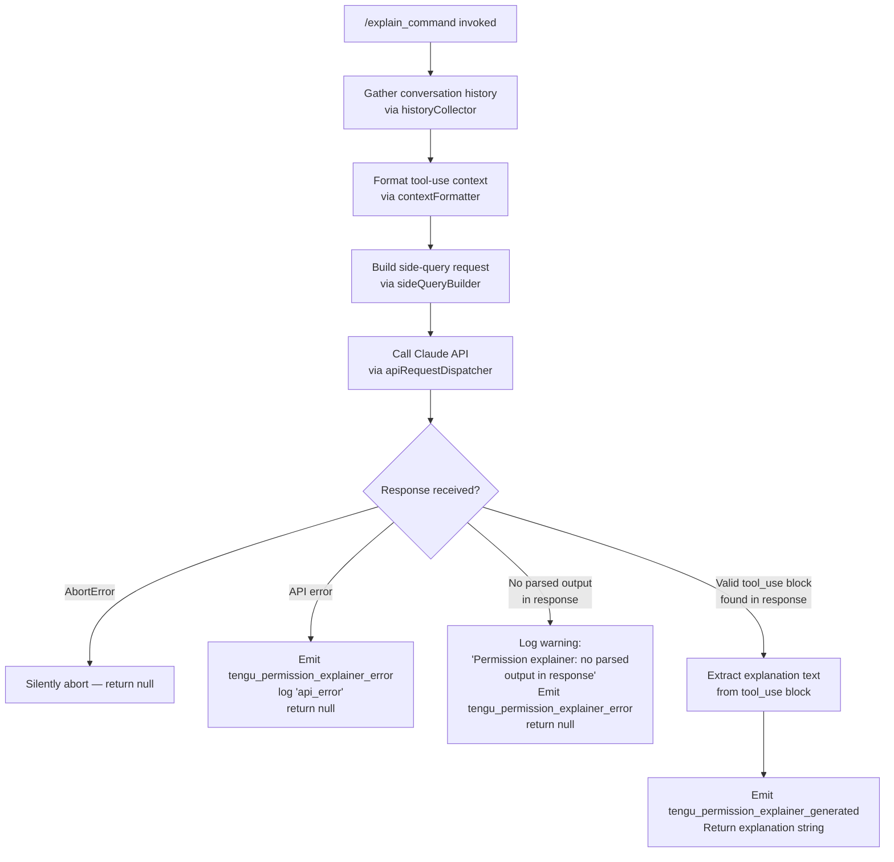

# `/explain_command`

> Analysis basis: CC v2.1.172 bundle.js (AST extraction + Claude interpretation)
> Minimum version: v2.1.172

---

## Overview

`/explain_command` is an internal `tool`-type slash command that generates a natural-language explanation of why Claude Code is requesting a particular permission or tool invocation. It drives the **permission explainer** subsystem: given context about a pending tool-use block, it invokes a side-query against the Claude API and returns a structured explanation the UI can surface to the user.

---

## Registration

| Field | Value |
|---|---|
| type | `tool` |
| name | `explain_command` |
| description | `null` (not set in registration object) |
| loc_byte | `14537688` |
| loc_byte_end | `14537724` |
| loc_line | `11373` |
| arbor_handler.name | `eyK` |
| arbor_handler.fqn | `claude-2.1.172::eyK` |
| arbor_handler.kind | `AsyncFunction` |
| arbor_handler.resolution_path | `direct` |
| arbor_handler.n_hits | `1` |

Analysis basis: CC v2.1.172 bundle.js:+14537688

---

## Input Branching

The handler (`eyK`) exhibits five distinct branches based on the content of the API response and error conditions. A Mermaid flowchart is used.



Analysis basis: CC v2.1.172 bundle.js:+14537593, +14538171, +14538383, +14538518, +14538841, +14538912

---

## Behavioral Spec

### 1. Handler Entry — `permissionExplainerHandler` (bundle: `eyK`)

The main async handler is resolved directly from the registration block (Arbor resolution path: `direct`).

```
async function permissionExplainerHandler(toolInput, appContext):
    startTime = Date.now()                          // +14537407
    history   = collectRecentHistory(appContext)    // call to historyCollector (+14537383)
    context   = formatToolUseContext(toolInput)     // call to contextFormatter (+14537428)
    snippet   = buildContextSnippet(history, context)  // call to snippetBuilder (+14537446)
    response  = await dispatchSideQuery(snippet, appContext)  // call to apiRequestDispatcher (+14537593, +14537606)

    if response is AbortError:                      // +14538841
        return null

    if response has no parsed output:               // +14538518
        emit tengu_permission_explainer_error(reason="no_parsed_output")
        log warning "Permission explainer: no parsed output in response"
        return null

    if response contains error:                     // +14538912
        emit tengu_permission_explainer_error(reason="api_error")
        return null

    explanation = extractExplanationFromToolUse(response)  // look for "tool_use" block (+14537901)
    emit tengu_permission_explainer_generated()    // +14538171

    return explanation
```

Analysis basis: CC v2.1.172 bundle.js:+14537688

---

### 2. Recent History Collection — `historyCollector` (bundle: `yPA`)

Collects a window of recent conversation messages and filters them for relevance.

```
function historyCollector(appContext):
    allMessages = appContext.conversationHistory
    // Filter to assistant messages only ("assistant" literal +14536987)
    // Take at most last N messages (limit: 3, literal +14537007)
    // Limit individual message token budget (1000 tokens, literal +14536952)
    recent = allMessages
        .filter(msg => msg.role == "assistant")
        .slice(-3)
    return recent
```

Analysis basis: CC v2.1.172 bundle.js:+14537383, +14536987, +14537007, +14536952

---

### 3. Context Snippet Builder — `snippetBuilder` (bundle: `o35`)

Assembles a condensed, truncated representation of the conversation history and pending tool-use context. It sanitizes lone Unicode surrogates and applies character-level truncation.

```
function snippetBuilder(history, toolContext):
    // Reverse history for recency ordering (+14537032)
    reversed = history.reverse()

    // Sanitize lone surrogates (charCode range 55296–56319, literals +198335/+198345)
    sanitized = reversed.map(sanitizeSurrogates)    // uses Du +14537175

    // Prepend the pending tool-use description
    sanitized.unshift(toolContext)                  // +14537191

    // Join with double-space separator ("  " literal +16784817)
    // Truncate with "..." ellipsis (literal +14537183)
    snippet = sanitized.join(" ")
    if snippet is too long:
        snippet = truncate(snippet) + "..."

    return snippet
```

Analysis basis: CC v2.1.172 bundle.js:+14537032, +14537175, +14537183, +14537191, +14537224

---

### 4. Context Formatter — `contextFormatter` (bundle: `r35`)

Converts raw tool-use input into a serialized string representation suitable for inclusion in a side-query prompt.

```
function contextFormatter(toolInput):
    // JSON-serialize the tool input object via stringifyHelper (CH, +14537979)
    serialized = stringify(toolInput)            // +14536924
    // Convert to String to ensure type safety
    result = String(serialized)
    return result
```

Analysis basis: CC v2.1.172 bundle.js:+14537428, +14536924

---

### 5. Side-Query Dispatch — `apiRequestDispatcher` (bundle: `Xp`)

Dispatches a lightweight side-query to the Claude API. This is the same `side_query` mechanism used by other internal subsystems (literal `"side_query"` at +13733078, `"sideQuery"` at +13734447).

```
async function apiRequestDispatcher(snippet, appContext):
    // Determine the model and auth via getApiClient ($F, +13733046)
    apiClient = buildApiClient(appContext)

    // Assemble the request:
    request = {
        type:        "side_query",                // +13733078
        system:      buildSystemPrompt(),
        messages:    [{ role: "user", content: snippet }],
        tool_choice: { name: "permission_explainer" }, // literal +14537746
        max_tokens:  /* determined by model context */
    }

    // Check for cached hash (lDA → AWK.createHash sha256, +13673822/+13673837)
    cacheKey = sha256Hash(snippet)

    // Apply 1h prompt cache marker if configured (literal "1h" +13733928)
    if cacheEnabled:
        request.cache_control = "1h"           // +13735152

    // Sanitize lone surrogates in outbound content (emit tengu_lone_surrogate_sanitized +13734406)
    request = sanitizeSurrogates(request)

    // Dispatch; measure latency
    t0       = performance.now()               // +13734493
    response = await apiClient.send(request)
    elapsed  = Date.now() - t0                 // +13734629

    // Emit tengu_api_success on success (+13734657)
    emit tengu_api_success(elapsed_ms=elapsed)

    return response
```

Analysis basis: CC v2.1.172 bundle.js:+13733046, +13733078, +13733909, +13734406, +13734493, +13734629, +13734657, +14537606

---

### 6. MCP Tool Name Detection — `mcpToolNameChecker` (bundle: `s9`)

Before generating an explanation, the handler checks whether the pending tool name belongs to the MCP tool prefix class, affecting how the explanation is framed.

```
function mcpToolNameChecker(toolName):
    if toolName.startsWith("mcp__"):        // literal +2484896
        category = "mcp_tool"               // literal +2484915
    else:
        category = "builtin"
    return category
```

Analysis basis: CC v2.1.172 bundle.js:+14538221, +2484896, +2484915

---

### 7. Explanation Extraction

After the side-query returns, the handler looks for a `tool_use` block in the response content array to extract the structured explanation.

```
function extractExplanationFromToolUse(response):
    for block in response.content:
        if block.type == "tool_use":        // literal +14537901
            return block.input.explanation
    return null                             // triggers "no parsed output" branch
```

Analysis basis: CC v2.1.172 bundle.js:+14537901, +14538518

---

## State & Side Effects

| Item | Detail |
|---|---|
| Telemetry — `tengu_permission_explainer_generated` | Emitted on successful explanation generation (bundle.js:+14538171) |
| Telemetry — `tengu_permission_explainer_error` | Emitted on failure: no parsed output or API error (bundle.js:+14538383) |
| Telemetry — `tengu_api_success` | Emitted by the side-query dispatcher after a successful API round-trip (bundle.js:+13734657) |
| Telemetry — `tengu_lone_surrogate_sanitized` | Emitted whenever lone Unicode surrogates are stripped from outbound content (bundle.js:+13734406) |
| Side-query API call | Issues a real network request to the Claude API; uses the `side_query` request type (bundle.js:+13733078) |
| Prompt caching | Applies a `1h` cache-control marker to side-query messages when prompt caching is configured (bundle.js:+13733928, +13735152) |
| Hook registration | `y9` registers a file-watcher hook (`hZA.register`, bundle.js:+63751) within the config-watcher path; not directly tied to the explain_command response path |
| appState changes | None observed at depth-2 traversal |
| Sound | None |

---

## Version History

| Version | Change |
|---|---|
| v2.1.172 | Initial analysis |

---

## Common Mistakes

1. **Assuming `/explain_command` is user-facing.** It is registered as a `tool`-type command (not a `prompt`-type), meaning it is invoked programmatically by the CC permission subsystem, not typed by the user in the REPL.
2. **Expecting a response when aborted.** If the user cancels a permission prompt mid-flight, the handler catches `AbortError` and returns `null` silently — no error is surfaced or logged.
3. **Confusing `tool_use` with `text` content blocks.** The handler exclusively extracts the explanation from a `tool_use` block in the response. A `text` block (literal `"text"` at +14537090) in the response will not satisfy the extraction and will trigger the "no parsed output" warning path.
4. **Missing MCP tool framing.** Tools whose names start with `mcp__` are classified differently (`"mcp_tool"`) during explanation generation; injecting a bare built-in tool name into an MCP-framed context (or vice versa) may produce misleading explanations.
5. **Ignoring the `permission_explainer` tool binding.** The side-query is constrained to call only the `permission_explainer` tool (literal `"permission_explainer"` at +14537746). If this tool schema changes, explanation extraction will silently fail.

---

## Appendix — Identifier Mapping

> For bundle debugging only. Identifiers change across versions.

| Identifier | Role |
|---|---|
| `eyK` | Main async handler (`permissionExplainerHandler`) — Arbor-resolved entry point |
| `yPA` | Recent history collector (`historyCollector`) |
| `b6` | Config/state accessor used by multiple subsystems |
| `o6` | Utility: path or state getter |
| `jZ_` | Internal utility (role unclear at depth-2) |
| `W7H` | Config file reader / backup manager |
| `n6` | JSON parse wrapper |
| `bu` | String prefix stripper |
| `N8` | Internal utility (role unclear at depth-2) |
| `S_9` | Directory scanner / backup path resolver |
| `N` | Logging / notification helper |
| `c` | General utility / closer |
| `XZ_` | Backup path builder |
| `D` | Background session dispatcher |
| `Gx4` | File-watcher / config watcher setup |
| `wF` | Internal utility (role unclear at depth-2) |
| `y9` | Hook registrar (`hZA.register` caller) |
| `r35` | Context formatter (`contextFormatter`) |
| `CH` | JSON stringify helper |
| `o35` | Context snippet builder (`snippetBuilder`) |
| `H` | General array/string host object |
| `A` | Array utility host |
| `L` | Connection/stream host |
| `f` | Promise/queue manager |
| `Du` | Lone-surrogate sanitizer (char-code range check) |
| `J9` | Shell/markdown formatter for side-query messages |
| `Hl` | Message formatter orchestrator |
| `OY` | Internal utility (role unclear at depth-2) |
| `rU` | Internal utility (role unclear at depth-2) |
| `rO` | Model-name resolver / message normalizer |
| `HW` | String replacer utility |
| `M` | App-state / model config map |
| `K` | Padding / formatting utility |
| `D_8` | Object entries iterator utility |
| `dlH` | Known-model-name checker |
| `rZ1` | Model name index finder |
| `Dz4` | Model capability checker |
| `tc` | Content-type checker (`cNH.includes` caller) |
| `Q9` | Full model-name normalizer |
| `jz4` | Model-family classifier |
| `hY` | Explanation generator sub-step |
| `eG` | Provider/plan capability resolver |
| `TA` | Plan type factory |
| `f_H` | Max-plan type builder |
| `yDH` | Team-plan type builder |
| `nlH` | Enterprise-plan type builder |
| `FP` | First-party plan builder |
| `rD6` | String replacement utility for plan names |
| `Zj` | Mantle provider builder |
| `v7` | Provider token builder |
| `c_` | Content block constructor |
| `NL` | Message block assembler |
| `kE` | Content-block list builder |
| `Xp` | API request dispatcher (`apiRequestDispatcher`) |
| `$F` | API client factory / HTTP request orchestrator |
| `QM` | Async-local store getter (`tZ1.getStore`) |
| `ME_` | URL query-string parser |
| `O9` | Request-origin classifier (`RDH` caller) |
| `da` | Session-store accessor |
| `nA8` | Alternate async-local store getter (`_V1.getStore`) |
| `y6` | Background session utility (`BG` caller) |
| `XY_` | URL encoder / path replacer |
| `f6` | String converter |
| `Nz` | Auth-token refresher orchestrator |
| `G78` | OAuth token key resolver |
| `AV1` | Boolean coercion utility |
| `Uw` | HTTP request sender |
| `O7` | Request builder utility |
| `vj` | Profile-based auth resolver |
| `B4` | Content block factory |
| `NP` | Network policy checker |
| `$O` | Auth orchestrator (API key / OAuth / helper) |
| `w26` | Error handler wrapper |
| `ErH` | Request error formatter |
| `QO` | Response handler utility |
| `BC4` | Bearer-token cache manager |
| `JrH` | Token TTL manager |
| `b_` | Auth state holder |
| `zH8` | Proxy auth helper invoker |
| `TNH` | Trust-state formatter |
| `y41` | Trust-state normalizer |
| `gef` | Numeric TTL parser |
| `ay` | Auth state applicator |
| `Q2` | Auth callback invoker (`BvH` caller) |
| `iC4` | HTTP streaming connection manager |
| `Z89` | Stream state initializer |
| `pzH` | Internal streaming utility |
| `am1` | Streaming config accessor |
| `zE_` | Streaming config writer |
| `rC4` | Header inspector (authorization, anthropic-beta) |
| `V89` | Stream value formatter |
| `E89` | Response event emitter |
| `cC4` | Token budget calculator |
| `lC4` | Byte-stream watchdog and chunk reader |
| `iO` | Provider type classifier |
| `zD6` | Bedrock/Foundry provider builder |
| `CM4` | Provider prefix checker |
| `OD6` | Provider name normalizer |
| `DB` | AWS region resolver |
| `ZvH` | AWS credentials helper |
| `xw` | Proxy configuration resolver |
| `OK` | String-to-boolean converter |
| `gc` | Proxy URL parser |
| `FdH` | Proxy credential formatter |
| `S41` | Internal utility (role unclear at depth-2) |
| `$M_` | IP / hostname proxy bypass checker |
| `wM_` | Proxy bypass pattern matcher |
| `nC4` | Stream initialization utility |
| `G89` | Stream pre-setup helper |
| `FC4` | Bedrock/Vertex request formatter |
| `f78` | Bedrock signing utility |
| `VFH` | Internal Bedrock utility |
| `Q6H` | Vertex endpoint resolver |
| `S1` | OAuth URL validator |
| `uDH` | Gateway JWT refresh orchestrator |
| `Jo8` | Internal refresh utility |
| `Yw4` | Gateway refresh HTTP caller |
| `qQ6` | Refresh throttle utility |
| `jo8` | Timestamp utility (`Date.now` wrapper) |
| `eP6` | Header normalizer (lowercase) |
| `gjH` | SDK log emitter (error/warn/info/debug) |
| `S` | Output writer / supervisor connector |
| `XrK` | Filesystem realpath/stat resolver |
| `v3` | Internal utility (role unclear at depth-2) |
| `SH` | Structured log emitter |
| `s05` | Internal supervisor utility |
| `w` | Supervisor write helper |
| `k` | Warning/notice dispatcher |
| `y` | Background session sweep orchestrator |
| `l` | Scheduled task / grace-clock manager |
| `R` | Daemon yield helper |
| `Mp6` | Memory monitor |
| `WJK` | Memory threshold emitter |
| `l06` | Config file loader (JSON) |
| `B` | Internal set/map utility |
| `g8` | Internal utility |
| `d` | Secondary session manager |
| `IF8` | Low-memory signal emitter |
| `Y6` | Session event emitter |
| `n` | Voice / subprocess finisher |
| `V` | Internal utility (role unclear at depth-2) |
| `a2` | Auth orchestrator alias |
| `tDH` | WIF (Workload Identity Federation) token dispatcher |
| `lnH` | WIF credential fetcher (HTTP) |
| `kH` | Feature flag checker ("ok" path) |
| `bH` | Feature flag checker ("bad" path) |
| `CP4` | WIF error classifier |
| `E` | SDK token manager |
| `W` | SDK connection handler |
| `X` | Request timeout setter |
| `sIH` | Tool-name normalizer for side-query |
| `j1` | Message content normalizer |
| `DJ` | Tool-name alias resolver |
| `so8` | Internal tool utility |
| `R3` | String replacement normalizer |
| `VI` | Content block type classifier |
| `G` | UI key-handler / input dispatcher |
| `I` | Internal UI utility |
| `Y` | Process exit / abort signal handler |
| `HX` | Exit helper |
| `z` | Abort controller / daemon stop manager |
| `T` | UI state machine |
| `uV6` | Internal UI utility |
| `V76` | Internal connection utility |
| `td` | Text segmenter (grapheme) |
| `XY` | Grapheme splitter utility |
| `j` | Worker kill utility |
| `MNK` | Vim-mode operator dispatcher |
| `g45` | Vim setOffset helper |
| `Q45` | Vim count-motion handler |
| `d45` | Vim find-motion applicator |
| `c45` | Vim selectRange applicator |
| `l45` | Vim textObject handler |
| `QvK` | Vim change-operator handler |
| `Td8` | Vim cursor bounds calculator |
| `Gd8` | Vim end-of-line detector |
| `gvK` | Vim change applier |
| `nvK` | Vim visual-replace handler |
| `lvK` | Vim visual-replace applier |
| `ovK` | Vim visual-case handler |
| `rvK` | Vim case-swap applier |
| `b` | Clipboard / conversation-file manager |
| `MSH` | Conversation file reader |
| `pa` | Conversation file metadata reader |
| `FsH` | Conversation file writer |
| `wW9` | Conversation file filter |
| `P` | IPC buffer reader |
| `MgK` | Diff/change formatter |
| `P1H` | Conversation file sync manager |
| `svK` | Vim paste handler |
| `evK` | Vim paste applier |
| `UvK` | Vim join-lines handler |
| `V4` | String index-of utility |
| `O` | OS/platform utility |
| `NUH` | Line-slice helper |
| `BvK` | Vim indent handler |
| `LXA` | Line prefix stripper |
| `YXA` | Vim history-search dispatcher |
| `S45` | History search setOffset |
| `R45` | History search count-motion |
| `C45` | History search find handler |
| `b45` | History search count applier |
| `x45` | History search Yd8 caller |
| `u45` | History search textObject |
| `m45` | History search find applicator |
| `p45` | History search VUH caller |
| `U45` | History search vUH/_NK caller |
| `B45` | History search Jd8 caller |
| `F45` | History search Wd8 caller |
| `s_5` | Completion candidate finder |
| `lDA` | SHA-256 cache-key hasher |
| `rA8` | Request metadata assembler |
| `jY_` | Internal request utility |
| `c78` | Request body serializer |
| `wCH` | System-prompt / context builder for side-query |
| `io8` | Internal context utility |
| `ro8` | Internal context utility |
| `sv` | Compliance (HIPAA) filter |
| `GE_` | HIPAA content sanitizer |
| `aIH` | Compliance content formatter |
| `sw_` | Compliance allow-list checker |
| `bWK` | Internal utility (role unclear at depth-2) |
| `Y78` | Tool-name + temperature side-query config builder |
| `e2` | Message map utility |
| `c2H` | Conversation context assembler for side-query |
| `QB` | Session / conversation ID generator |
| `E8` | Conversation state manager |
| `e4` | Auth + session binder |
| `evA` | Message array normalizer (pop/push) |
| `Vd6` | Message validator |
| `vy` | Deep-clone utility (`structuredClone`) |
| `Nd6` | Message normalizer (assistant-role) |
| `tvA` | Text replacement helper |
| `mzH` | Internal timing utility |
| `H1` | Startup initializer |
| `_56` | Core initialization sentinel |
| `AG6` | Agent-ID resolver |
| `rY9` | Built-in agent registry lookup |
| `nt4` | Agent-ID presence checker |
| `caH` | Custom agent descriptor builder |
| `aZ` | Agent descriptor formatter |
| `_G6` | Agent-ID classifier (builtin vs custom) |
| `FO8` | Agent hash builder (`dY9.createHash`) |
| `Pn` | Agent-prefix decoder |
| `lt4` | Agent-prefix parser |
| `gO8` | Agent path extractor |
| `Ij_` | Path segment splitter |
| `su` | Thread-name prefix checker |
| `y56` | Internal utility (role unclear at depth-2) |
| `s9` | MCP tool-name classifier (`mcpToolNameChecker`) |
| `$6` | MCP tool category formatter |
| `s6` | Feature-flag "sad" path checker |
| `A6` | Feature-flag sentinel |
| `EH` | Error string coercer |

---

Note: index built via Arbor fallback; some signals (telemetry, literals) may be missing — see arbor-fallback.js.