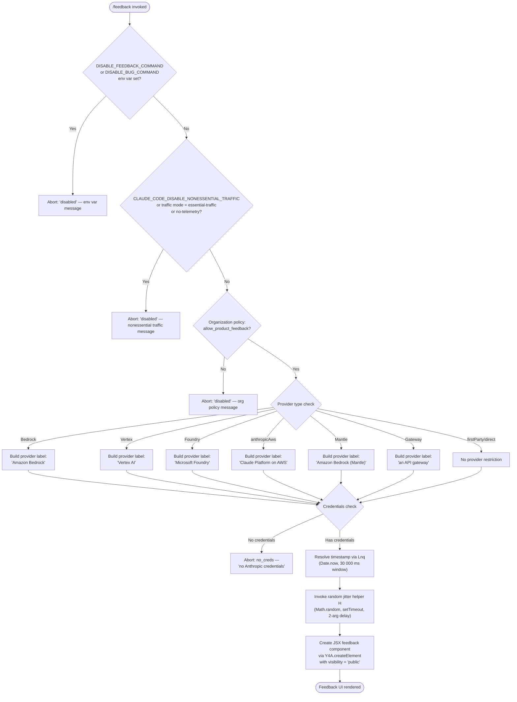

# `/feedback`

> Analysis basis: CC v2.1.172 bundle.js (AST extraction + Claude interpretation)
> Minimum version: v2.1.172

---

## Overview

The `/feedback` command (also aliased as `/share` and `/bug`) allows users to submit feedback, report bugs, or share their current conversation with Anthropic. Before launching the feedback UI, it performs a multi-stage gate check — evaluating environment variables, telemetry/traffic settings, organizational policy, and provider type — and aborts with an informative message if any gate is closed. When all gates pass, it renders a JSX-based feedback component.

---

## Registration

| Field | Value |
|---|---|
| type | `local-jsx` |
| name | `feedback` |
| description | `Submit feedback, report a bug, or share your conversation` |
| argumentHint | `[report]` |
| aliases | `share`, `bug` |
| module_id | `$nq` |
| load_inline | `true` |
| loc_byte | `11204465` |
| loc_byte_end | `11204688` |
| loc_line | `7348` |
| arbor_handler.name | `SV7` |
| arbor_handler.fqn | `claude-2.1.172::SV7` |
| arbor_handler.kind | `AsyncFunction` |
| arbor_handler.resolution_path | `module_id` |
| arbor_handler.n_hits | `0` |

Analysis basis: CC v2.1.172 bundle.js:+11204465

---

## Input Branching

The command passes through **six distinct gate checks** before the feedback UI is rendered, making a Mermaid flowchart the appropriate representation.



---

## Behavioral Spec

### Gate 1 — Environment Variable Disable Check

```
function checkEnvDisable(commandName, env):
    if env.DISABLE_FEEDBACK_COMMAND is set:
        return disabled(
            "/feedback has been disabled via the DISABLE_FEEDBACK_COMMAND environment variable"
        )
    if env.DISABLE_BUG_COMMAND is set:
        return disabled(
            "/feedback has been disabled via the DISABLE_BUG_COMMAND environment variable"
        )
    return pass
```

Analysis basis: CC v2.1.172 bundle.js:+11181908, +11181926, +11182067

---

### Gate 2 — Nonessential Traffic / Telemetry Mode Check

```
function checkTrafficMode(trafficConfig):
    mode = resolveTrafficMode(trafficConfig)
    // resolveTrafficMode checks for "essential-traffic" or "no-telemetry" labels
    if mode == "essential-traffic" OR mode == "no-telemetry":
        return disabled(
            "/feedback has been disabled via the CLAUDE_CODE_DISABLE_NONESSENTIAL_TRAFFIC environment variable"
        )
    if mode == "default":
        return pass
    return pass
```

The traffic mode resolution function (`yBA`/`Rq` chain) normalises string values `"yes"` and `"on"` as truthy indicators (Analysis basis: CC v2.1.172 bundle.js:+27782, +27788) and distinguishes `"essential-traffic"` (bundle.js:+1045468) from `"no-telemetry"` (bundle.js:+1045527) and `"default"` (bundle.js:+1045601).

Analysis basis: CC v2.1.172 bundle.js:+11182150, +11182185

---

### Gate 3 — Organizational Policy Check

```
function checkOrgPolicy(session):
    orgPlan = session.plan  // "enterprise" or "team"
    if orgPlan in { "enterprise", "team" }:
        policyFlags = fetchOrgPolicyFlags(session)
        if NOT policyFlags.has("allow_product_feedback"):
            return disabled(
                "/feedback has been disabled by your organization's policy"
            )
    return pass
```

The `p9` function consults two Set-like structures (`qP4`, `KP4`) and checks for the literal capability string `"allow_product_feedback"` via `.includes()`.

Analysis basis: CC v2.1.172 bundle.js:+2516146, +2516181, +2516391, +2516423, +2516447, +11182349

---

### Gate 4 — Provider Identification

```
function resolveProviderLabel(authContext):
    bundle = authContext.bundle
    provider = authContext.provider
    switch provider:
        case "bedrock"      → label = "Amazon Bedrock"
        case "vertex"       → label = "Vertex AI"
        case "foundry"      → label = "Microsoft Foundry"
        case "anthropicAws" → label = "Claude Platform on AWS"
        case "mantle"       → label = "Amazon Bedrock (Mantle)"
        case "gateway"      → label = "an API gateway"
        case "firstParty"   → label = null  // no restriction
    return label
```

Third-party providers cause an early credential incompatibility note (`"Anthropic auth not used on third-party providers"`, bundle.js:+3285498), and the provider label is embedded in the feedback UI context.

Analysis basis: CC v2.1.172 bundle.js:+11182449, +11182464, +11182481, +11182556, +11182627, +11182711, +11182794, +11182825, +11182879

---

### Gate 5 — Credentials Check

```
function checkCredentials(authContext):
    // Credential resolution walks: ANTHROPIC_API_KEY → apiKeyHelper → OAuth token → WIF env vars
    if authContext has no usable credentials:
        return disabled(
            reason = "no_creds",
            message = "no Anthropic credentials"
        )
    // For third-party providers, separate sub-checks apply:
    //   "third_party"    → no OAuth path
    //   "no_oauth_token" → OAuth unavailable
    //   "no_api_key"     → API key unavailable
    //   "not available when using a Cloud gateway"
    return pass
```

Analysis basis: CC v2.1.172 bundle.js:+11182956, +11182973, +3249695, +3285638, +3285922

---

### Feedback UI Construction

```
async function feedbackHandler(args, context):
    // Gate checks 1–5 (see above)
    // ...

    // Timestamp resolution
    timestamp = resolveTimestamp()          // Date.now() bounded to 30 000 ms window
    // Random jitter
    applyJitter(Math.random, setTimeout)   // 2-value random delay

    // HTTP method for submission
    method = "post"

    // Build JSX component
    component = createElement(FeedbackComponent, {
        visibility: "public",
        provider:   resolvedProviderLabel,
        timestamp:  timestamp,
        ...context
    })

    return component
```

The `"public"` visibility string is set at bundle.js:+11204271. The `30000` ms timestamp window is set at bundle.js:+11203854 (via `Lnq`/`Date.now`). The jitter helper (`H`) uses `Math.random` and `setTimeout` with a max depth of `2` (bundle.js:+14012201, +14012203, +14012240). Submission uses HTTP `"post"` (bundle.js:+11183013).

Analysis basis: CC v2.1.172 bundle.js:+11204078, +11204271, +11204296

---

## State & Side Effects

| Item | Detail |
|---|---|
| Telemetry | No `tengu_*` events detected in depth-2 traversal |
| Environment variables read | `DISABLE_FEEDBACK_COMMAND`, `DISABLE_BUG_COMMAND`, `CLAUDE_CODE_DISABLE_NONESSENTIAL_TRAFFIC`, `ANTHROPIC_API_KEY`, `ANTHROPIC_AUTH_TOKEN`, `CLAUDE_CODE_OAUTH_TOKEN`, `ANTHROPIC_FEDERATION_RULE_ID`, `ANTHROPIC_ORGANIZATION_ID` |
| Org policy gate | Reads `allow_product_feedback` capability from session policy set (enterprise/team plans only) |
| HTTP side effect | Submission sent via `"post"` method when user completes feedback form |
| JSX rendering | Mounts `FeedbackComponent` with `visibility: "public"` |
| Timestamp window | `Date.now()` capped/bounded to 30 000 ms window (bundle.js:+11203854) |
| Random jitter | `Math.random` + `setTimeout` applied before render (bundle.js:+14012203) |
| appState changes | No direct appState mutations detected in depth-2 traversal |
| Sound | None detected |

---

## Version History

| Version | Change |
|---|---|
| v2.1.172 | Initial analysis |

---

## Common Mistakes

1. **Expecting `/bug` or `/share` to behave differently** — all three names (`/feedback`, `/bug`, `/share`) resolve to the same handler (`SV7`) and are fully interchangeable.
2. **Assuming feedback is always available** — the command is silently disabled (returns a `"disabled"` state with an explanatory string, not an error) when `DISABLE_FEEDBACK_COMMAND`, `DISABLE_BUG_COMMAND`, or `CLAUDE_CODE_DISABLE_NONESSENTIAL_TRAFFIC` environment variables are set.
3. **Using feedback with essential-traffic or no-telemetry modes** — traffic mode restrictions block the command before any UI is shown; users may not immediately understand why the command appears to do nothing.
4. **Using feedback on third-party providers without valid Anthropic credentials** — the credentials gate (Gate 5) blocks submission for Bedrock, Vertex, Foundry, anthropicAws, and Mantle providers if no usable Anthropic credential path exists.
5. **Organizational plan confusion** — the `allow_product_feedback` policy check only applies to `enterprise` and `team` plan sessions; individual/API users bypass this gate entirely.
6. **Expecting telemetry events** — no `tengu_*` telemetry events were found in the depth-2 traversal for this command; feedback submission is not itself instrumented via the standard telemetry pipeline at this depth.

---

## Appendix — Identifier Mapping

> For bundle debugging only. Identifiers change across versions.

| Identifier | Role |
|---|---|
| `SV7` | Main async handler for `/feedback` (arbor_handler; `claude-2.1.172::SV7`) |
| `Mnq` | JSX feedback component factory / render function |
| `CmH` | Gate orchestrator — sequences all disable/credential checks |
| `Rq` | Traffic mode resolver — converts env config to mode string |
| `yBA` | Traffic mode string normaliser (`"yes"` / `"on"` → truthy) |
| `f6` | String utility / coercion helper |
| `p9` | Organizational policy and plan capability checker |
| `zm1` | Policy set builder / capability collection assembler |
| `EhH` | Policy flag evaluator (calls `oC`, `fJ6`, `hLH`) |
| `oC` | Credential/auth context resolver |
| `c_` | Auth context field extractor |
| `wL` | Auth context wrapper / access helper |
| `$O` | Credential chain resolver (API key → helper → OAuth → WIF) |
| `vj` | OAuth token resolution logic |
| `WLH` | Policy-disabled message formatter |
| `q` | CLI data/process exit helper module |
| `$1` | Process exit handler (`cli_error`, `process.exit`) |
| `nB` | Provider credential builder (per-provider credential paths) |
| `Cl` | Third-party provider auth incompatibility handler |
| `B4` | Auth context field builder |
| `TA` | Provider type classifier (`dC`, `W9` calls) |
| `Uw` | Credential sub-resolver (OAuth / API key sub-paths) |
| `dC` | Array/type check utility (`Array.isArray`) |
| `a2` | Credential chain step for gateway/no-creds path |
| `H` | Random jitter helper (`Math.random` + `setTimeout`) |
| `Lnq` | Timestamp resolver (`Date.now`, 30 000 ms window) |

---

Note: index built via Arbor fallback; some signals (telemetry, literals) may be missing — see arbor-fallback.js.