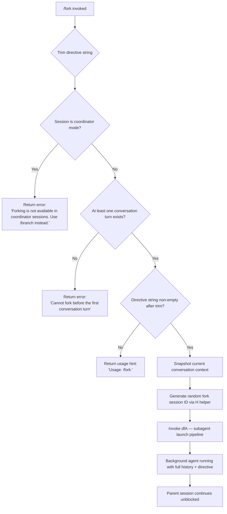

# `/fork`

> Analysis basis: CC v2.1.172 bundle.js (AST extraction + Claude interpretation)
> Minimum version: v2.1.172

---

## Overview

`/fork` spawns a background agent that inherits the full conversation history of the current session. The user supplies a `<directive>` argument that steers what the forked agent should do; the parent session continues independently. The command validates context preconditions (coordinator mode, minimum turn count) before launching the sub-agent via the internal subagent dispatch pipeline.

---

## Registration

| Field | Value |
|---|---|
| type | `local-jsx` |
| name | `fork` |
| description | Spawn a background agent that inherits the full conversation |
| argumentHint | `<directive>` |
| module_id | `Q5K` |
| load_inline | `true` |
| loc_byte | `12725615` |
| loc_byte_end | `12725818` |
| loc_line | `8999` |
| arbor_handler.name | `Xc7` |
| arbor_handler.fqn | `claude-2.1.172::Xc7` |
| arbor_handler.kind | `AsyncFunction` |
| arbor_handler.resolution_path | `module_id` |
| arbor_handler.n_hits | `0` |

Analysis basis: CC v2.1.172 bundle.js:+12725615

---

## Input Branching

The handler has four distinct paths depending on session state, making a Mermaid flowchart the appropriate representation.



Analysis basis: CC v2.1.172 bundle.js:+12725174 (trim), +12725196 (random ID), +12725266 (dfA launch), +12725307 (vW context snapshot), +12725312 (coordinator guard literal), +12725385 (pre-turn guard literal), +12725198 (usage literal)

---

## Behavioral Spec

### 1. Argument validation and guard checks

```
async function forkCommandHandler(args, sessionContext):
    directive = args.trim()                          // +12725174

    if sessionContext.isCoordinatorMode():
        return errorMessage(
            "Forking is not available in coordinator sessions. Use /branch instead."
        )                                            // +12725312

    if not sessionContext.hasCompletedAtLeastOneTurn():
        return errorMessage(
            "Cannot fork before the first conversation turn"
        )                                            // +12725385

    if directive == "":
        return usageHint("Usage: /fork <directive>")  // +12725198
```

Analysis basis: CC v2.1.172 bundle.js:+12725174, +12725196, +12725198, +12725312, +12725385

### 2. Fork session ID generation

```
function generateForkId():
    // Uses Math.random() with a 2-based multiplier and a setTimeout side-effect
    // for entropy jitter — see helper H (+14012203, +14012240)
    return randomHexId(8 bytes)                      // +7188784, +7188800
```

Analysis basis: CC v2.1.172 bundle.js:+12725196

### 3. Conversation context snapshot

Before launching the sub-agent, `vW` constructs a snapshot of the current REPL state including messages, working directory, and REPL contexts.

```
function buildForkContextSnapshot(sessionContext):
    messages    = currentMessages()                  // vW → f6 +4903674
    cwd         = resolveWorkingDirectory()          // vW → Y0 +4903731
    replCtxs    = getReplContexts()                  // vW → vq +4903738
    return { messages, cwd, replCtxs }
```

Analysis basis: CC v2.1.172 bundle.js:+12725307

### 4. Subagent launch pipeline (`dfA`)

`dfA` is the primary sub-agent launch coordinator. It performs the following in sequence:

```
async function launchSubagent(directive, contextSnapshot):

    // 1. Validate prompt is present; record missing-prompt telemetry if not
    if directive is empty:
        log("subagent_fork_prompt_missing")          // +11165058

    // 2. Build system prompt via eZ7 → GZ
    systemPrompt = buildSystemPrompt(contextSnapshot, {
        role: "system",                              // +12725238
        mode: "fork",                                // +11165107
        subagentLaunchFlag: "subagent_launch",       // +11164916
        coordinatorMode: "subagent_fork_coordinator_mode" // +11164934
    })

    // 3. Slice conversation history to last 50/49 messages for context window
    historySlice = contextSnapshot.messages.slice(-50)  // +11165292, +11165295, +11165305

    // 4. Sanitise the directive string via Slq (trim to 3/24 chars guard)
    sanitisedDirective = sanitiseDirective(directive)  // +11167063, +11167093, +11167194

    // 5. Generate a random subagent session ID via HR (hex, 8 bytes, 63-char alphabet)
    sessionId = HR.randomHex()                       // +7188774, +7188784, +7188800

    // 6. Stamp launch timestamp
    launchedAt = Date.now()                          // +11165349

    // 7. Register agent in subagent registry via s96
    subagentRecord = s96.registerSubagent({
        type:     "local_agent",                     // +10364068
        status:   "running",                         // +10364113
        purpose:  "general-purpose",                 // +10364251
        mode:     "fork",
        session:  sessionId
    })

    // 8. Bind an AbortController and set jR (the per-agent REPL runner) going
    abortController = new AbortController()
    agentResult = await jR.run({
        messages:    historySlice,
        directive:   sanitisedDirective,
        systemPrompt,
        subagentRecord,
        abortController
    })

    return agentResult
```

Analysis basis: CC v2.1.172 bundle.js:+11164901, +11164913, +11165020, +11165147, +11165242, +11165274, +11165295, +11165322, +11165349, +11165362, +11165390, +11165552, +11165594, +11165637, +11165738, +11165817, +11165931, +11165989, +11166055, +11166086, +11166151, +11166587

### 5. Sub-agent REPL runner (`jR`)

`jR` is the full agent execution loop. It receives the forked conversation state and runs autonomously:

```
async function agentReplRunner(config):

    // Build tool set, permission model, MCP connections
    tools    = buildToolSet(config)
    perms    = resolvePermissions(config.subagentRecord)

    // Inherit system prompt fields:
    //   working_directory, allowed_tools, disallowed_tools,
    //   avoid_prompts, permission_mode, bypassPermissions,
    //   session, effort, model, max_thinking_tokens, flag_settings
    //                                                // +10672174 … +10672853

    // Main agent loop via EW7 (the query/streaming engine)
    while not done:
        response = await EW7.callModel(config.systemPrompt, messages, tools)
        processToolResults(response)
        updateMessages(response)

    // On completion, emit subagent_complete event
    // On stall timeout, emit subagent_stall_timeout event
    // telemetry: tengu_forked_agent_default_turns_exceeded if turn cap hit
```

Analysis basis: CC v2.1.172 bundle.js:+9808436, +10672174, +10672229, +10672284, +10672345, +10672447, +10672478, +10672777, +10672802, +10672815, +10672827, +10672853

### 6. System prompt assembly (`GZ` / `buildSystemPrompt`)

`GZ` assembles the multi-section system prompt delivered to the forked agent. Key sections identified from literals:

| Section key | Purpose |
|---|---|
| `task_continuity` | Inherits the task context from parent session |
| `fable_identity` | Agent identity block (model-family dependent) |
| `env_info_static` | Static environment description block |
| `env_info_simple` | Simplified environment section for fork contexts |
| `language` | Language/locale setting |
| `output_style` | Response style instructions |
| `bg-session` | Marks session as background |
| `scratchpad` | Scratchpad tool config |
| `context_management` | Context-window management directives |
| `brief` | Brief-mode flag (checked via `pDA.isBriefEnabled`) |
| `reproduce_verify_workflow` | Workflow guidance |
| `act_dont_rederive` | Instructs agent to act, not re-derive |
| `heron_brook` | Feature-flag gated block |
| `autonomy_append` | Autonomy guidance appended to system prompt |

Analysis basis: CC v2.1.172 bundle.js:+13651608, +13651641, +13651893, +13651930, +13651968, +13652003, +13652033, +13652060, +13652087, +13652126, +13652169, +13652180, +13652212, +13652231, +13652255, +13652274, +13652292

The working directory guidance for worktree-mode forks includes: `"This is a git worktree — an isolated copy of the repository. Run all commands from this directory. Do NOT `cd` to the original repository root."` (bundle.js:+13653793)

Agent threads always use absolute file paths per embedded instruction (bundle.js:+13657562).

### 7. Background session lifecycle and stall watchdog

The background agent record transitions through states `"pending"` → `"running"` → `"completed"/"failed"`. A watchdog timer is armed:

```
WATCHDOG_INTERVAL_MS = 600000   // 10 minutes, +7301349
WATCHDOG_CHECK_COUNT = 10       // +7301344

function armStallWatchdog(agentId):
    timer = setTimeout(checkStall, WATCHDOG_INTERVAL_MS)
    on stall detected:
        emit telemetry("tengu_async_agent_stall_timeout")  // +7302240
        emit event("subagent_stall_timeout")               // +7302497
        killAgent(agentId)
```

On normal completion: emits `"subagent_complete"` (bundle.js:+7302477).

---

## State & Side Effects

| Item | Detail |
|---|---|
| Telemetry — fork missing prompt | `tengu_feature_bad` (indirect, via bH guard) |
| Telemetry — forked turns exceeded | `tengu_forked_agent_default_turns_exceeded` (+10670943) |
| Telemetry — stall timeout | `tengu_async_agent_stall_timeout` (+7302240) |
| Telemetry — agent tool completed | `tengu_agent_tool_completed` (+7298284) |
| Telemetry — agent tool terminated | `tengu_agent_tool_terminated` (+7304749) |
| Telemetry — auto mode decision | `tengu_auto_mode_decision` (+7299929) |
| Telemetry — subagent async errored | (literal `"subagent_async_errored"` +7305208) |
| Telemetry — quartz heron | `tengu_quartz_heron` (+7309018, from FMH/Y6) |
| Telemetry — slim subagent CLAUDE.md | `tengu_slim_subagent_claudemd` (+9808829) |
| Subagent registry | Entry created in local subagent registry (`s96`/`guH`) with status `"running"` |
| File system | Sub-agent may create worktree directory and transcript JSONL files via `guH` → `wDA`, `g16` |
| AbortController | New `AbortController` bound to fork; abort propagates on parent session kill |
| appState changes | `H.setAppState` called within `HS8` to register the new agent session context |
| Hook registration | `M.register` called within `s96` to register the agent's turn listener |
| Parent session | Continues unblocked; fork runs concurrently in background |
| Sound | None observed in call graph |

---

## Version History

| Version | Change |
|---|---|
| v2.1.172 | Initial analysis |

---

## Common Mistakes

1. **Omitting the directive**: Running `/fork` with no argument returns the usage hint `"Usage: /fork <directive>"` — the fork is not created. Always supply a directive describing the work the background agent should do.
2. **Running `/fork` from a coordinator session**: Coordinator mode blocks `/fork` entirely; use `/branch` instead. The error message is explicit.
3. **Running `/fork` before the first turn**: The command requires at least one completed conversation turn so the forked agent has history to inherit. Starting a fresh session and immediately running `/fork` will fail.
4. **Expecting synchronous output**: The forked agent runs fully in the background; output does not appear in the parent terminal session. Check background agent status via `/agents` or the background session UI.
5. **Assuming the fork shares working directory state unconditionally**: In worktree spawn mode the forked agent receives an isolated git worktree; using relative paths inside the fork will not resolve to the same location as in the parent session.

---

## Appendix — Identifier Mapping

> For bundle debugging only. Identifiers change across versions.

| Identifier | Role |
|---|---|
| `Xc7` | Main `/fork` command handler (AsyncFunction) |
| `dfA` | Subagent launch pipeline — validates, builds prompt, registers agent, calls runner |
| `eZ7` | System prompt orchestrator — calls GZ and supporting builders |
| `GZ` | Full system prompt assembly function |
| `jR` | Per-agent REPL runner — main agent execution loop |
| `EW7` | Query/streaming engine — calls model, processes tool results |
| `s96` | Subagent registry — registers and tracks background agents |
| `guH` | File-system setup for agent workdir/symlinks/transcript log |
| `mV` | Config/path resolver used during agent initialisation |
| `vW` | Conversation context snapshot builder |
| `H` | Fork session ID generator (Math.random + setTimeout jitter) |
| `HR` | Random hex string generator (8 bytes, 63-char alphabet) |
| `Slq` | Directive string sanitiser (trim) |
| `k_` | REPL context resolver — extracts working directory and permission settings |
| `mS8` | Message-slice builder — prepares history window for subagent |
| `sp` | System prompt loader (reads H.getSystemPrompt, calls vW/kN) |
| `qe` | Model identifier resolution/normalisation |
| `HS8` | App-state updater for new agent session |
| `AS8` | Tool/skill set builder for subagent |
| `Me` | Tool filtering and permission resolver |
| `d66` | Background agent watchdog and lifecycle manager |
| `LW8` | Subagent output classifier / handoff decision |
| `qW8` | Agent tool dispatcher |
| `bH` | Feature flag guard (used in prompt-missing path) |
| `kH` | Configuration reader (also used in prompt-missing guard) |
| `Y6` | React/UI render helper (progress display) |
| `FMH` | Telemetry emitter for `tengu_quartz_heron` |
| `g66` | Agent state update function |
| `MW8` | Agent metrics updater |
| `Le` | Task notification dispatcher |
| `h1A` | Task notification helper |
| `N1A` | Date-stamped task update helper |
| `N` | Log/console output helper |
| `P2` | Hook executor for subagent lifecycle events |
| `K$H` | Sub-session context builder (XL, mV, P2) |
| `TR6` | SubagentStart hook initiator |
| `o96` | Transcript/metadata file writer (.jsonl, .meta.json) |
| `t8A` / `$4` | Fork context reference builder (`"fork-context-ref"` +13434966) |
| `pqH` / `ZmH` | Compact-boundary filter for forked message history |
| `ap` | Agent loop entry-point wrapper around EW7 |
| `LC8` | Subagent exit / cleanup handler |
| `Zg8` | Async-lock set used to serialise worktree operations |
| `gW` | Pending-agent timestamp stamper |
| `QM` | Async-local-storage context getter (`tZ1.getStore`) |
| `Al` | Async-local-storage runner (`tZ1.run`) |
| `ql` / `HT` | Secondary store getter (`EY_.getStore`) |
| `xT9` | `_x_.set` — sets per-agent context key |
| `uT9` | `_x_.delete` — cleans up per-agent context key |
| `dH` | Display/status logger (SIGINT handler, spawn mode display) |
| `RH` | UI display object (logStatus, refreshDisplay, setSpawnModeDisplay) |
| `jT9` / `hSH` | Desktop-integration session file writer |
| `a8A` | Permission-cache cleanup on fork teardown |
| `GRH` | Span/trace cleanup on fork teardown |
| `wQ9` / `V2H` | OpenTelemetry span context enter-with helpers |
| `zQ9` | OTel span wrapper for subagent spawn |
| `ia9` / `bMH` | Shell-task state updater |
| `VT6` / `t2H` | Additional context injectors called from dfA |