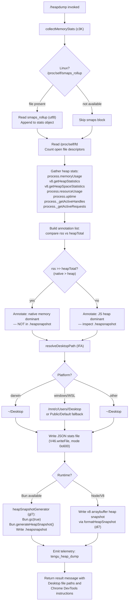

# `/heapdump`

> Analysis basis: CC v2.1.172 bundle.js (AST extraction + Claude interpretation)
> Minimum version: v2.1.172

---

## Overview

`/heapdump` is a hidden diagnostic slash command that captures a JavaScript heap snapshot and a comprehensive memory statistics report, writing both to the user's Desktop directory. It is designed for developer debugging of memory leaks in the Claude Code process, providing V8/Bun heap stats, native memory figures, open file descriptors, smaps rollup data (Linux), and annotated heuristics that guide the developer toward the likely source of any memory growth.

---

## Registration

| Field | Value |
|---|---|
| type | `local` |
| name | `heapdump` |
| description | `Dump the JS heap to ~/Desktop` |
| supportsNonInteractive | `true` |
| isHidden | `true` |
| module_id | `n3K` |
| load_inline | `true` |
| loc_byte | `12827698` |
| loc_byte_end | `12828126` |
| loc_line | `9121` |
| arbor_handler.name | `Ql7` |
| arbor_handler.fqn | `claude-2.1.172::Ql7` |
| arbor_handler.kind | `AsyncFunction` |
| arbor_handler.resolution_path | `module_id` |
| arbor_handler.n_hits | `0` |

Analysis basis: CC v2.1.172 bundle.js:+12827698

---

## Input Branching

The command does not accept user-supplied text arguments that alter its primary flow. Instead it branches internally on platform detection and on whether the runtime is Bun or Node/V8. Three or more distinct paths are present, so a Mermaid flowchart is used.



---

## Behavioral Spec

### Top-level handler — `heapDumpHandler` (`Ql7`)

Analysis basis: CC v2.1.172 bundle.js:+12826567

```
async function heapDumpHandler(context):
    stats      = await collectMemoryStats()          // c3K
    formatted  = formatHeapReport(stats)             // dl7
    lines      = []
    lines.push(formatted)
    lines.push("Open the .heapsnapshot in Chrome DevTools → Memory → Load to inspect retainers.")
    result_text = lines.join(...)
    await writeHeapDumpFiles(stats, result_text)     // JOA
    return result_text
```

### Memory statistics collector — `collectMemoryStats` (`c3K`)

Analysis basis: CC v2.1.172 bundle.js:+12822730

Gathers a snapshot of the process memory landscape:

```
async function collectMemoryStats():
    data = {}

    data.memoryUsage        = process.memoryUsage()
    data.heapStats          = v8.getHeapStatistics()        // zB8.getHeapStatistics
    data.resourceUsage      = process.resourceUsage()
    data.uptime             = process.uptime()
    data.heapSpaceStats     = v8.getHeapSpaceStatistics()   // zB8.getHeapSpaceStatistics
    data.activeHandles      = process._getActiveHandles().length
    data.activeRequests     = process._getActiveRequests().length

    // Linux-only: open file descriptor count
    try:
        fds = await fs.readdir("/proc/self/fd")             // V46.readdir :+12822961
        data.openFdCount = fds.length
    catch:
        pass

    // Linux-only: smaps memory breakdown
    try:
        smaps = await fs.readFile("/proc/self/smaps_rollup", "utf8")  // :+12823036
        data.smapsRollup = smaps
    catch:
        pass

    // Import bun:jsc if available for Bun-specific stats :+12823121
    try:
        jsc = require("bun:jsc")
        data.jscStats = jsc.heapStats()
    catch:
        pass

    data.annotations = buildAnnotations(data)
    return data
```

Thresholds used in annotation logic:
- Uptime bucket: **3600** seconds (bundle.js:+12823262)
- Heap unit divisor: **1 048 576** (1 MiB) (bundle.js:+12823267)
- Native-leak annotation trigger: RSS substantially exceeds heapTotal; message: `"Native memory > heap - leak may be in native addons (node-pty, sharp, etc.)"` (bundle.js:+12823500)
- Memory figure display precision: **`.toFixed(500)`** style rounded to **500** MiB display threshold (bundle.js:+12823655)
- No-indicator fallback message: `"No obvious leak indicators. Check heap snapshot for retained objects."` (bundle.js:+12824619)

### Desktop path resolver — `resolveDesktopPath` (`IFA`)

Analysis basis: CC v2.1.172 bundle.js:+12825525

```
function resolveDesktopPath():
    home = os.homedir()                             // b9_.homedir :+12825525
    base = path.join(home, "Desktop")              // s5.join with "Desktop" :+12825537

    if platform == "windows" or isWSL():            // :+12824773
        // Scan /mnt/c/Users for first non-system user directory
        // Exclude: "Public", "Default", "Default User", "All Users" :+12824773
        // Fall back to base if scan fails
        return windowsDesktopPath or base

    if platform == "macos":                         // :+12824354 / "darwin" :+12824773
        return base

    return base  // linux / other
```

String constants confirmed in literals:
- `"Desktop"` (bundle.js:+1092347)
- `"windows"` (bundle.js:+1092365)
- `"darwin"` (bundle.js:+12824773)
- `"macos"` (bundle.js:+12824354)
- `"/mnt/c/Users"` (bundle.js:+1092569)
- `"Public"`, `"Default"`, `"Default User"`, `"All Users"` (bundle.js:+1092613–1092677)

### File writer — `writeHeapDumpFiles` (`JOA`)

Analysis basis: CC v2.1.172 bundle.js:+12825229

```
async function writeHeapDumpFiles(stats, reportText):
    desktopPath = resolveDesktopPath()              // IFA
    timestamp   = formatTimestamp()                 // y6, N
    baseName    = "claude-heapdump-" + timestamp

    // Write JSON stats report
    statsPath = path.join(desktopPath, baseName + ".json")    // jOA.join :+12825634
    await fs.writeFile(statsPath, JSON.stringify(stats), {mode: 0o600})  // :+12825712
    // mode 0o600 = 384 decimal :+12825712

    // Write heap snapshot
    await heapSnapshotGenerator(desktopPath, baseName)        // gl7 :+12825768

    // Emit telemetry
    recordEvent("tengu_heap_dump", {auto: "auto-1.5GB"})     // :+12825819, :+12825885

    // Format result lines
    result = formatResultMessage(desktopPath, baseName, stats)  // c :+12825817
    return result
```

File permissions: **mode 0o600** (decimal 384) applied to written files (bundle.js:+12825712).

### Heap snapshot generator — `heapSnapshotGenerator` (`gl7`)

Analysis basis: CC v2.1.172 bundle.js:+12826247

```
function heapSnapshotGenerator(desktopPath, baseName):
    snapshotPath = path.join(desktopPath, baseName + ".heapsnapshot")

    if isBunRuntime():
        // Bun path :+12826267
        Bun.gc(true)                                // force GC :+12826324
        snapshot = Bun.generateHeapSnapshot()
        fs.writeFileSync(snapshotPath, snapshot)    // d3K.writeFileSync :+12826247

    else:
        // Node/V8 path — handled by formatHeapReport (dl7) writing arraybuffer
        // type: "v8", format: "arraybuffer" :+12826292–12826297
        writeV8HeapSnapshot(snapshotPath)
```

### Report formatter — `formatHeapReport` (`dl7`)

Analysis basis: CC v2.1.172 bundle.js:+12826686

```
function formatHeapReport(stats):
    lines = []

    // Column layout: pad to width 8 :+12827342
    maxLabelWidth = Math.max(...labelWidths)        // :+12826942

    // Append per-space heap breakdown using v46 formatter :+12827254

    // Dominant-memory heuristic messages:
    if jsHeapDominant:
        lines.push("— most memory is JS heap (inspect the .heapsnapshot)")   // :+12827010
    else:
        lines.push("— most memory is native (NOT in the .heapsnapshot)")     // :+12827070

    if noLeakIndicators:
        lines.push("  (no obvious leak indicators)")                          // :+12827207

    // 1 GiB threshold (1 073 741 824 bytes) for warning :+12827616
    if rss > 1073741824:
        // emit high-RSS warning line

    return lines.join(newline)
```

1 GiB threshold for RSS warning: **1 073 741 824** bytes (bundle.js:+12827616).
Column padding width: **8** characters (bundle.js:+12827342).

### Trigger mode constant

The command uses `"manual"` as the trigger mode literal with an index of `0` (bundle.js:+12825205, +12825216), indicating the heap dump is always user-initiated, never automatic.

---

## State & Side Effects

| Item | Detail |
|---|---|
| Telemetry | `tengu_heap_dump` (bundle.js:+12825819) — fired after files are written |
| Telemetry (background infra, depth-2) | `tengu_daemon_control`, `tengu_scheduled_task_missed`, `tengu_bg_dispatch_sigkill_escalate`, `tengu_bg_dispatch_low_mem`, `tengu_bg_spare_enable`, `tengu_bg_spare_claim`, `tengu_bg_spare_claim_fail` — these belong to background daemon infrastructure reached at depth 2 via `G` / `D` call chains, not directly emitted by `/heapdump` |
| Files written | `~/Desktop/claude-heapdump-<timestamp>.json` (memory statistics, mode 0o600) and `~/Desktop/claude-heapdump-<timestamp>.heapsnapshot` (V8/Bun heap snapshot) |
| GC side effect | On Bun runtime: `Bun.gc(true)` is called before snapshot generation, forcing a synchronous garbage collection (bundle.js:+12826324) |
| Hook registration | `y9` calls `hZA.register` (bundle.js:+63751) — registers a process exit / FinalizationRegistry hook; scoped to logging infrastructure, not specific to this command |
| appState changes | None directly attributed to `/heapdump` |
| Sound | None found in depth-2 traversal |
| File mode | 0o600 (owner read/write only) applied to output files (bundle.js:+12825712) |
| Linux-only reads | `/proc/self/fd` (fd count) and `/proc/self/smaps_rollup` (native memory breakdown) — silently skipped on macOS/Windows |

---

## Version History

| Version | Change |
|---|---|
| v2.1.172 | Initial analysis |

---

## Common Mistakes

1. **Expecting output in the current directory.** Files are always written to the platform Desktop directory (`~/Desktop` on macOS/Linux, resolved WSL path on Windows), not the working directory.
2. **Looking for the heap snapshot inside Claude Code's UI.** The command returns a text summary in the CLI; the actual `.heapsnapshot` binary must be opened externally in Chrome DevTools → Memory → Load Profile.
3. **Running on a headless server without a Desktop.** If `~/Desktop` does not exist the file write will fail. Pre-create the directory or symlink it before invoking `/heapdump` in CI/server environments.
4. **Ignoring the "native memory dominant" annotation.** When RSS greatly exceeds heap total, the `.heapsnapshot` file will not reveal the leak — the annotation explicitly warns that native addons (node-pty, sharp, etc.) are the likely source (bundle.js:+12823500).
5. **Running `/heapdump` under Node without Bun.** The Bun path (`Bun.generateHeapSnapshot`, `Bun.gc`) is skipped; a V8 arraybuffer snapshot is written instead (bundle.js:+12826292). Both formats open in Chrome DevTools, but the Bun path forces a GC pass first, giving a cleaner snapshot.
6. **Assuming the command is interactive-only.** `supportsNonInteractive: true` means it can be invoked in non-interactive/pipe mode, useful for scripted memory profiling.

---

## Appendix — Identifier Mapping

> For bundle debugging only. Identifiers change across versions.

| Identifier | Role |
|---|---|
| `Ql7` | Top-level async handler for `/heapdump` (`heapDumpHandler`) |
| `JOA` | File writing orchestrator (`writeHeapDumpFiles`) |
| `c3K` | Memory statistics collector (`collectMemoryStats`) |
| `gl7` | Heap snapshot file generator (`heapSnapshotGenerator`) |
| `dl7` | Heap report text formatter (`formatHeapReport`) |
| `IFA` | Desktop path resolver (`resolveDesktopPath`) |
| `y6` | Timestamp / date formatter helper |
| `BG` | Utility called by timestamp formatter |
| `v46` | Heap-space statistics line formatter |
| `G` | Main input/keydown handler (editor component, depth-2) |
| `I` | Sub-handler within editor component |
| `Y` | Forced-shutdown / process.exit helper |
| `T` | Key event preprocessor (`preventDefault` wrapper) |
| `z` | Keydown dispatcher with daemon stop telemetry |
| `td` | Terminal/UI component helper |
| `j` | Process kill helper (iterates child processes) |
| `MNK` | Editor operation dispatcher (find/replace/textObject) |
| `QvK` | Yank / visual-op handler |
| `nvK` | Visual-replace handler |
| `ovK` | Visual-case handler |
| `b` | Register manager (`getRegister`) |
| `svK` | Visual-paste handler |
| `UvK` | Join-lines handler |
| `BvK` | Indent handler |
| `f` | Pending-operation tracker (add/delete/finally) |
| `D` | Background daemon session dispatcher |
| `H` | History search opener / random-delay helper |
| `P` | IPC buffer reader / chunked-message parser |
| `YXA` | Extended operator key binding table |
| `S` | Supervisor executor |
| `X` | Module loader / timer wrapper |
| `M` | Module registry lookup |
| `q` | Deferred promise / timeout wrapper |
| `N` | Log-level router / output writer |
| `g8f` | Log entry constructor |
| `kZA` | Log encoder |
| `CH` | JSON serialiser wrapper |
| `_` | Editor state / register store (generic) |
| `lf` | Log file writer pipeline |
| `MNA` | Log prefix mapper |
| `A` | Shared collection / app state map |
| `rFH` | Error output writer |
| `ovA` | Raw stream write helper |
| `l8f` | Log persistence manager |
| `TFH` | Buffered output flusher |
| `BfH` | Log batch writer |
| `o6` | Path utility / `os.homedir` helper |
| `A36` | Atomic file write helper |
| `zNA` | Log file path constructor |
| `ms8` | Log file rotator |
| `c8f` | Log file appender |
| `y9` | FinalizationRegistry / exit hook registrar |
| `K` | Table formatter (padEnd) |
| `L` | Stream / socket close helper |
| `c` | Result message builder |
| `JA` | Error wrapper |
| `v3` | Version/build-info object |
| `SH` | Structured logger / error logger |
| `f6` | String coercion utility |
| `Rq` | Log queue flusher |
| `yBA` | Log queue entry builder |
| `fRf` | Circular log buffer manager |

---

Note: index built via Arbor fallback; some signals (telemetry, literals) may be missing — see arbor-fallback.js.