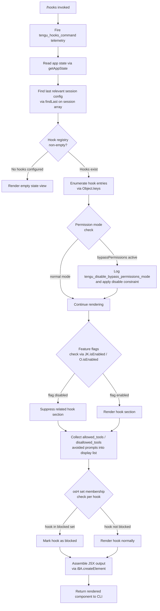

# `/hooks`

> Analysis basis: CC v2.1.172 bundle.js (AST extraction + Claude interpretation)
> Minimum version: v2.1.172

---

## Overview

The `/hooks` command provides a read-only inspection surface for the current session's hook configurations tied to tool events. It is implemented as a `local-jsx` command that renders hook data inline in the terminal UI. The command reads application state, formats the active hook registry, and presents each hook's scope, tool bindings, and execution constraints to the user.

---

## Registration

| Field | Value |
|---|---|
| type | `local-jsx` |
| name | `hooks` |
| description | `View hook configurations for tool events` |
| immediate | `true` |
| module_id | `k5K` |
| load_inline | `true` |
| loc_byte | `12715208` |
| loc_byte_end | `12715358` |
| loc_line | `8999` |
| arbor_handler.name | `Mc7` |
| arbor_handler.fqn | `claude-2.1.172::Mc7` |
| arbor_handler.kind | `AsyncFunction` |
| arbor_handler.resolution_path | `module_id` |
| arbor_handler.n_hits | `0` |

Analysis basis: CC v2.1.172 bundle.js:+12715208

---

## Input Branching

The command execution follows several distinct branches based on hook registry state, permission mode, and feature flags, warranting a Mermaid flowchart.



---

## Behavioral Spec

### Handler Entry — `Mc7` (AsyncFunction)

The primary handler, resolved via module `k5K` through Arbor's `module_id` path, is an async function that orchestrates the full display pipeline.

```
async function hooksCommandHandler(context):
    emit telemetry("tengu_hooks_command")
    appState = getAppState()
    sessionConfig = findLastSessionConfig(appState.sessions)
    hookDisplayData = buildHookDisplayData(sessionConfig)
    jsxTree = renderHooksView(hookDisplayData, context)
    return jsxTree
```

Analysis basis: CC v2.1.172 bundle.js:+12715008, +12715040, +12715078

---

### Session Config Resolution — `k_` (getAppState consumer)

Reads the live application state and selects the most recently active session configuration for display.

```
function resolveSessionConfig(appState):
    sessions = appState.getAppState()
    sessionConfig = sessions.findLast(s => s is valid session)
    fields_of_interest = [
        "working_directory",
        "allowed_tools",
        "disallowed_tools",
        "avoid_prompts",
        "permission_mode",
        "bypassPermissions",
        "session",
        "effort",
        "model",
        "max_thinking_tokens",
        "flag_settings"
    ]
    return extractFields(sessionConfig, fields_of_interest)
```

Analysis basis: CC v2.1.172 bundle.js:+10672069, +10672149, +10672174, +10672229, +10672284, +10672345, +10672447, +10672478, +10672777, +10672802, +10672815, +10672827, +10672853

---

### Permission Mode Gate — `Nb` / `Y6` (bypass permissions disabler)

When the session config has `bypassPermissions` set, a dedicated gate disables that mode and emits a telemetry event before proceeding.

```
function applyPermissionModeGate(sessionConfig):
    if sessionConfig.permission_mode == "bypassPermissions":
        emit telemetry("tengu_disable_bypass_permissions_mode")
        sessionConfig.grantSet.disable()
    if sessionConfig.grantSet has "disable" entry:
        applyDisableLogic()
    return sessionConfig
```

Analysis basis: CC v2.1.172 bundle.js:+4259539, +4259542, +4259589, +4259643

---

### Hook Display Builder — `$h` (main JSX composer)

Collects all hook metadata from the resolved session configuration and assembles the structured list for rendering. This is the most complex sub-function, touching tool resolution, feature flag checks, and session supervisor orchestration.

```
function buildHooksDisplay(sessionConfig, featureFlags):
    // Resolve source type (cli vs remote)
    sourceType = resolveSourceType(sessionConfig)   // "cli" or "remote"

    // Gather hook entries
    hookEntries = collectHookEntries(sessionConfig)

    // Check enabled feature flags per hook
    filteredEntries = hookEntries
        .filter(e => !isInBlockedSet(e))            // osH.has check
        .filter(e => featureFlagAllowed(e))          // JK.isEnabled / O.isEnabled
        .map(e => annotateHookEntry(e))

    // Determine if any hooks are in denied state
    hasDeniedHooks = hookEntries.some(e => e.matcher == "deny")

    // Build supervisor process watcher entries (daemon start/stop lifecycle)
    supervisorEntries = buildSupervisorEntries(sessionConfig)

    // Append agent-team entries if --agent-teams flag present
    agentTeamEntries = buildAgentTeamEntries(sessionConfig)

    // Compose final display rows
    displayRows = [
        ...filteredEntries,
        ...supervisorEntries,
        ...agentTeamEntries
    ]

    return createJSXElement(displayRows)
```

Analysis basis: CC v2.1.172 bundle.js:+10153737, +10153809, +10153824, +10153838, +10153860, +10153875, +10153887, +10153947, +10154045, +10154063, +10154091, +10154103, +10154114, +10154190, +10154205, +10154233, +10154244, +10154286, +10154331

---

### Hook Entry Collection — `XT` (source resolver)

Determines whether each hook entry originates from a CLI argument (`cliArg`), a `toolsNarrowing` config, or a remote source. Normalises boolean-like string values (`"yes"`/`"no"`, `"on"`/`"off"`) before display.

```
function resolveHookSource(entry):
    if entry.origin == "cli":
        sourceLabel = "cliArg"
    else if entry.origin == "remote":
        sourceLabel = "remote"
    else:
        sourceLabel = "toolsNarrowing"

    boolValue = normaliseBoolString(entry.value)
    // normaliseBoolString maps: "yes"/"on" -> true, "no"/"off" -> false
    entry.displayValue = boolValue
    return entry
```

Analysis basis: CC v2.1.172 bundle.js:+4894486, +4894503, +4894548, +4894638, +4894649, +4894665, +4894668

---

### Supervisor / Daemon Lifecycle Entries — `w` / `ZEH` / `iDK`

Builds display rows for the background supervisor (daemon) that manages hook processes. Detects `ENOENT` on daemon status file reads and handles missing daemon gracefully.

```
function buildSupervisorEntries(sessionConfig):
    daemonStatus = readDaemonStatusFile("daemon.status.json")
    if daemonStatus == ENOENT:
        return [{ label: "supervisor", status: "not running" }]

    entries = []
    for key in Object.keys(daemonStatus):
        maxWidth = Math.max(...columnWidths)   // column alignment
        formattedRow = formatDaemonRow(key, daemonStatus[key], maxWidth)
        entries.push(formattedRow)

    return entries
```

Constants:
- Padding width constant: `40` characters (bundle.js:+16786788)
- Supervisor label string: `"supervisor"` (bundle.js:+16774636)
- Daemon status filename: `"daemon.status.json"` (bundle.js:+12991976)
- ENOENT sentinel: `"ENOENT"` (bundle.js:+13179823)

Analysis basis: CC v2.1.172 bundle.js:+16774611, +16774628, +16774830, +16774884, +13179790, +13179815, +13180124, +13180881

---

### Daemon Start/Stop Control — `z` / `kH` / `bH` / `wS` / `CU`

The hooks view also reflects real-time daemon start/stop events. When the daemon transitions state, entries are annotated accordingly.

```
function buildDaemonControlEntries(daemonState):
    if daemonState == "stopped":
        emit telemetry("tengu_daemon_control")
        stopEntry = buildStopEntry()         // "daemon_stop" label
        return [stopEntry]
    else if daemonState == "stop_failed":
        failEntry = buildFailEntry()         // "daemon_stop_failed" label
        return [failEntry]

    if "background session" context:
        backgroundEntry = buildBackgroundEntry()
        return [backgroundEntry]

    return []
```

Constants:
- `"daemon_stop"` label (bundle.js:+16796912)
- `"daemon_stop_failed"` label (bundle.js:+16796949)
- `"stopped"` state (bundle.js:+16796821)
- `"background session"` label (bundle.js:+16796864)
- Shutdown race timeout: `500` ms (bundle.js:+16792030)

Analysis basis: CC v2.1.172 bundle.js:+16796909, +16796932, +16796984, +16797038, +16792027, +16792069

---

### Tool Filter Rendering — `FqH` / `aR6` / `vQ` / `PfA`

Filters hooks by tool event category and renders `allow`/`deny` match lists.

```
function renderToolFilterSection(hookEntries):
    // Collect deny-matchers
    denyEntries = hookEntries.flatMap(e => e.matchers).filter(m => m == "deny")

    // Separate cliArg-sourced entries
    cliArgEntries = hookEntries.filter(e => e.source == "cliArg")

    // Render per entry
    for entry in denyEntries ++ cliArgEntries:
        row = buildRow(entry.toolPattern, entry.action, entry.source)
        rows.push(row)

    return rows
```

Analysis basis: CC v2.1.172 bundle.js:+10153053, +10153068, +10153114, +11079357, +11079451, +11080174, +11080195, +11080237, +11080253

---

### Config Reload Side Effect — `w` reload path

When hook configuration changes are detected during the view render, the supervisor reloads its config and emits a dedicated telemetry event.

```
function onConfigChange(newConfig):
    supervisor.stop()
    supervisor.updateConfig(newConfig)
    supervisor.start()
    emit telemetry("tengu_daemon_config_reload")
```

Analysis basis: CC v2.1.172 bundle.js:+16775024, +16775033, +16775051, +16775429

---

### Workflow / Feature Flag Checks — `QP` / `Ym1` / `MJ_`

Checks whether workflow-level features are enabled before rendering associated hook rows. Tracks `allow_workflows` and `allow_product_feedback` flags.

```
function checkWorkflowFlags(sessionConfig):
    if sessionConfig.flags.has("allow_workflows"):
        emit telemetry("tengu_workflows_enabled")
        workflowRows = buildWorkflowRows(sessionConfig)
    else:
        workflowRows = []

    if sessionConfig.flags.has("allow_product_feedback"):
        feedbackRows = buildFeedbackRows(sessionConfig)
    else:
        feedbackRows = []

    return workflowRows ++ feedbackRows
```

Constants:
- `"allow_product_feedback"` (bundle.js:+2516447)
- `"allow_workflows"` (bundle.js:+2517868)
- `"pro"` tier indicator (bundle.js:+2518314)

Analysis basis: CC v2.1.172 bundle.js:+2517541, +2517560, +2517604, +2517632, +2518066, +2518069

---

### Agent-Team Entry Builder — `jQ` / `Yq` / `yN`

When the `--agent-teams` CLI argument is present in the session config, additional hook display rows are injected for local-agent sessions.

```
function buildAgentTeamEntries(sessionConfig):
    if not sessionConfig.includes("--agent-teams"):
        return []

    agentEntries = []
    for agent in sessionConfig.agentTeams:
        row = buildLocalAgentRow(agent)    // "local-agent" type
        agentEntries.push(row)

    return agentEntries
```

Constants:
- `"--agent-teams"` flag string (bundle.js:+6932904)
- `"local-agent"` type label (bundle.js:+6904478)

Analysis basis: CC v2.1.172 bundle.js:+10152400, +10152416, +10152525, +10152673, +10152733, +10152739, +10152745, +10152943, +6932904, +6904478, +6933016

---

### Boolean Display Normalisation — `OK` / `f6`

String boolean values from config are normalised for display. This is a utility shared across multiple display sub-functions.

```
function normaliseBoolString(value):
    if value in ["yes", "on"]:   return true
    if value in ["no",  "off"]:  return false
    return value   // pass-through for non-boolean strings
```

Constants:
- `"yes"` (bundle.js:+27782), `"on"` (bundle.js:+27788)
- `"no"` (bundle.js:+27933), `"off"` (bundle.js:+27938)

Analysis basis: CC v2.1.172 bundle.js:+27883, +27733

---

## State & Side Effects

| Item | Detail |
|---|---|
| Telemetry: `tengu_hooks_command` | Fired immediately on command invocation (bundle.js:+12715008) |
| Telemetry: `tengu_disable_bypass_permissions_mode` | Fired when session has `bypassPermissions` active (bundle.js:+4259542) |
| Telemetry: `tengu_slate_harbor` | Fired during source-type resolution for hooks (bundle.js:+4894668) |
| Telemetry: `tengu_daemon_config_reload` | Fired when supervisor config is reloaded during view render (bundle.js:+16775429) |
| Telemetry: `tengu_workflows_enabled` | Fired when `allow_workflows` flag is enabled (bundle.js:+2518069) |
| Telemetry: `tengu_cobalt_ridge` | Fired during platform/OS check path (bundle.js:+4890810) |
| Telemetry: `tengu_feature_ok` | Fired on successful feature gate pass (bundle.js:+1016269) |
| Telemetry: `tengu_feature_bad` | Fired on failed feature gate check (bundle.js:+1016336) |
| Telemetry: `tengu_daemon_control` | Fired on daemon start/stop transition during view (bundle.js:+16796987) |
| Telemetry: `tengu_amber_flint` | Fired during agent-team entry construction (bundle.js:+6933016) |
| appState reads | Reads current session config fields: `working_directory`, `allowed_tools`, `disallowed_tools`, `avoid_prompts`, `permission_mode`, `bypassPermissions`, `session`, `effort`, `model`, `max_thinking_tokens`, `flag_settings` |
| Daemon status file read | Reads `daemon.status.json` from daemon store; treats `ENOENT` as graceful absent-daemon case |
| Supervisor side effects | May call `supervisor.stop()`, `supervisor.updateConfig()`, `supervisor.start()` if config reload is triggered |
| Hook registration | None — this command is a read-only viewer; it does not register new hooks |
| Sound | None detected in depth-2 traversal |
| JSX rendering | Uses `i$A.createElement` to build and return a React/Ink component tree (bundle.js:+12715078) |
| Shutdown race guard | `Promise.race` with `Promise.all` and a `500 ms` timeout used in daemon shutdown path (bundle.js:+16792027, +16792030) |

---

## Version History

| Version | Change |
|---|---|
| v2.1.172 | Initial analysis |

---

## Common Mistakes

1. **Expecting `/hooks` to modify hook configuration** — the command is read-only. It displays the current hook configuration; to change hooks, edit the relevant config file or use the settings command.
2. **Confusing `allowed_tools` with active hook matchers** — `allowed_tools` and `disallowed_tools` are session-level tool filters; they appear in the hooks view but are distinct from event-triggered hooks.
3. **Assuming the daemon must be running** — the view handles a missing daemon status file (`ENOENT`) gracefully and will still render hook configuration even when the supervisor daemon is not active.
4. **Interpreting `bypassPermissions` rows as normal hooks** — when `bypassPermissions` is detected, it is actively disabled before display and fires its own telemetry event; it is not an ordinary hook entry.
5. **Missing agent-team rows** — agent-team hook entries only appear when the session was started with the `--agent-teams` flag; the section is silently omitted otherwise.
6. **Assuming boolean config values are native booleans** — the config layer stores some boolean-like values as the strings `"yes"`/`"no"` or `"on"`/`"off"`; the display layer normalises these before rendering.

---

## Appendix — Identifier Mapping

> For bundle debugging only. Identifiers change across versions.

| Identifier | Role |
|---|---|
| `Mc7` | Primary async handler for `/hooks` command (arbor_handler) |
| `k_` | Session config reader; calls `getAppState` and `findLast` |
| `H` | App-state store object; also used as random/timer host |
| `_b8` | Sub-config extractor helper (first variant), calls `M1` |
| `Ab8` | Sub-config extractor helper (second variant), calls `M1` |
| `M1` | Config field extraction utility |
| `Nb` | Permission mode gate coordinator |
| `Y6` | Grant-set / bypass-permissions disabler |
| `N26` | Grant-set sub-utility (first) |
| `h26` | Grant-set sub-utility (second) |
| `Ym` | Grant-set helper, calls `eu` |
| `N78` | Tracked-grant set mutator (`eE_.has/add`, `rjH.get`) |
| `b6` | Grant timestamping / logging utility, calls `Date.now` |
| `$h` | Main JSX composer for hooks display |
| `XT` | Hook source-type resolver (`cli`/`remote`) |
| `wc` | Source-type check sub-utility |
| `OK` | Boolean string normaliser (`"yes"`/`"no"`) |
| `f6` | Boolean string normaliser (`"on"`/`"off"`) |
| `w` | Supervisor process entry builder / display writer |
| `ZEH` | Daemon status file reader; handles `ENOENT` |
| `d9` | Async store accessor (`ru4.getStore`) |
| `N8` | Daemon status error handler |
| `TwA` | Daemon status formatter helper |
| `EH` | String coercion utility for display |
| `K` | Column-map / display table builder (`f.map`, `L.padEnd`) |
| `iDK` | Column-width calculator (`Object.keys`, `Math.max`) |
| `T` | Spinner/progress stop controller |
| `uV6` | Spinner stop sub-routine (first) |
| `V76` | Spinner stop sub-routine (second) |
| `E` | Progress bar / render controller |
| `W` | MCP connection manager (start/stop, `Promise.all`) |
| `DrK` | Daemon restart orchestrator, calls `a_H` |
| `a_H` | Daemon config-reload executor |
| `V` | Secondary progress/render start controller |
| `EAA` | React/Ink component factory wrapper |
| `I_` | Module initialiser / ES-module interop setup |
| `sF6` | Module bind helper |
| `QP` | Feature-flag and workflow-check coordinator |
| `Gq8` | Flag lookup helper |
| `pG` | Flag value resolver |
| `Ym1` | Workflow flag evaluator |
| `p9` | Individual flag checker (multi-set membership) |
| `MJ_` | Workflow row builder |
| `LP4` | Workflow display row constructor |
| `fP4` | Product-feedback flag renderer |
| `FqH` | Tool-filter section renderer |
| `aR6` | Allow/deny hook entry aggregator |
| `vQ` | FlatMap-based hook matcher collector |
| `PfA` | Hook entry formatter (Xw6, Pw6, LYH, mK_, $V) |
| `Ccq` | Hook display cleanup helper |
| `ZAA` | Platform-aware display wrapper |
| `Ub` | OS/platform detector (`windows` check) |
| `f4` | Platform display row builder |
| `z` | Daemon start/stop display entry collector |
| `kH` | Daemon stop entry builder |
| `A6` | Daemon stop sub-utility |
| `bH` | Daemon stop-failed entry builder |
| `wS` | Background session / firstParty hook entry builder |
| `eu` | UUID / session initialiser |
| `GhH` | Session hook emitter coordinator |
| `HJ_` | Hook event emitter (randomUUID, `H.emit`) |
| `CU` | Shutdown race orchestrator (`Promise.race`, `process.exit`) |
| `vLH` | Shutdown signal sender (`VLH.shutdown`) |
| `NLH` | Timeout clearer on shutdown (`clearTimeout`, `ZZ_`) |
| `d8` | Abort/timeout controller (`Error`, `setTimeout`, `clearTimeout`) |
| `jQ` | Agent-team hook entry builder |
| `z2` | Local-agent type resolver |
| `Ho8` | Agent config reader |
| `uj` | Agent label normaliser |
| `Yq6` | Agent display row coordinator |
| `Yq` | Agent-teams flag checker |
| `LvL` | Agent-team config sub-reader |
| `nw7` | Agent hook entry variant A |
| `iw7` | Agent hook entry variant B |
| `yN` | Model/provider display row builder |
| `Pb_` | Model type resolver (`standard`, `tst`, `tst-auto`) |
| `N` | Debug/model string formatter |
| `c_` | Cloud provider resolver (`bedrock`, `foundry`, etc.) |
| `wL` | Provider display sub-formatter |
| `xf` | Feature-set gate check helper |
| `O` | Background-session enabled checker |
| `m8` | Background-session status accessor |
| `$` | Session include-list checker |
| `TwK` | Daemon status JSON path builder |
| `pa` | Status path sub-resolver |
| `km6` | Path join helper for `daemon.status.json` |
| `CH` | JSON serialiser wrapper (`JSON.stringify`) |

---

Note: index built via Arbor fallback; some signals (telemetry, literals) may be missing — see arbor-fallback.js.