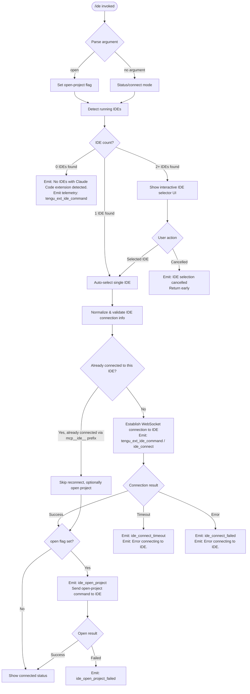

# `/ide`

> Analysis basis: CC v2.1.172 bundle.js (AST extraction + Claude interpretation)
> Minimum version: v2.1.172

---

## Overview

The `/ide` command manages IDE integrations for Claude Code by detecting running IDE instances that have the Claude Code extension installed, presenting an interactive selection interface when multiple IDEs are found, and establishing an MCP-over-WebSocket connection to the chosen IDE. When invoked with the `open` sub-command argument, it additionally instructs the connected IDE to open the current project directory.

---

## Registration

| Field | Value |
|---|---|
| type | `local-jsx` |
| name | `ide` |
| description | `Manage IDE integrations and show status` |
| argumentHint | `[open]` |
| module_id | `itq` |
| load_inline | `true` |
| loc_byte | `11789458` |
| loc_byte_end | `11789614` |
| loc_line | `7593` |
| arbor_handler.name | `AR7` |
| arbor_handler.fqn | `claude-2.1.172::AR7` |
| arbor_handler.kind | `AsyncFunction` |
| arbor_handler.resolution_path | `module_id` |
| arbor_handler.n_hits | `0` |

Analysis basis: CC v2.1.172 bundle.js:+11789458

---

## Input Branching

The command has 4+ distinct branches based on argument parsing and IDE detection state.



---

## Behavioral Spec

### Handler Entry Point (`AR7`)

The Arbor-resolved handler `AR7` is an `AsyncFunction` reached via `module_id → itq`. It is the primary entry point invoked when `/ide` is dispatched.

Analysis basis: CC v2.1.172 bundle.js:+11785574

```
async function ideCommandHandler(context, argument):
    emit telemetry: tengu_ext_ide_command

    openFlag = (argument === "open")       // literal "open" at +11785682

    detectedIDEs = await detectRunningIDEs()

    if detectedIDEs is empty:
        print "No IDEs with Claude Code extension detected."  // +11785791
        return

    if detectedIDEs.length === 1:
        selectedIDE = detectedIDEs[0]
    else:
        selectedIDE = await showIDESelector(detectedIDEs)
        if selectedIDE is null:
            print "No IDE selected."   // +11785929
            return

    connectionResult = await connectToIDE(selectedIDE, context)

    if connectionResult failed:
        print "Error connecting to IDE."  // +11787989
        return

    if openFlag:
        await openProjectInIDE(selectedIDE, context)
```

Analysis basis: CC v2.1.172 bundle.js:+11785574 – +11787183

---

### IDE Detection (`wX8` / `detectRunningIDEs`)

Scans the host system for running IDE processes that expose a compatible WebSocket endpoint for the Claude Code extension.

Analysis basis: CC v2.1.172 bundle.js:+6565508

```
async function detectRunningIDEs():
    // Enumerate candidate IDE socket paths / ports
    candidates = await enumerateIDECandidates()   // zX8 at +6565557

    results = await Promise.all(
        candidates.map(candidate => probeIDESocket(candidate))  // F0L at +6565597
    )

    // Filter to those that responded successfully
    return results.filter(r => r is valid)

function enumerateIDECandidates():
    // On Linux: parse `ps aux | grep -E "code|cursor|windsurf|..."` output
    //   literal at +6570233
    // On macOS: use platform-specific detection
    // Skips known non-user accounts: Public, Default, Default User, All Users
    //   literals at +6563693, +6563712, +6563732, +6563757
    // Resolves home directory via os.homedir()
    // Follows symlinks via fs.realpath
    // Skips .lock files  (literal ".lock" at +6562172)

    return list of candidate sockets/ports
```

Supported IDE name tokens (matched case-insensitively):
- `windsurf` (+6568333), `devin` (+6568357), `cursor` (+6568397), `insiders` (+6568437), `vscode` / `vs code` / `visual studio code` (+6568462–+6568507), `vscodium` (+6568541), `code - oss` (+6568565), `codium` (+6568784)
- JetBrains family detected via `jetbrains` token (+6561958) and process names including `idea`, `pycharm`, `webstorm`, `phpstorm`, `rubymine`, `clion`, `goland`, `rider`, `datagrip`, `dataspell`, `aqua`, `gateway`, `fleet`, `android-studio`
- `Devin Desktop` display name (+6568653), normalized to `IDE` label (+6571072)
- Windows/WSL: path prefix `/mnt/c/Users` (+6563599), `.cmd` extension suffix (+6568916)

Telemetry emitted on detection:
- `ide_detect` (+6566863) on success
- `ide_detect_failed` (+6566927) on failure

---

### IDE Selector UI (`ntq`)

A React JSX component (`local-jsx` type) rendered inline when multiple IDE candidates are found.

Analysis basis: CC v2.1.172 bundle.js:+11787460

```
function IDESelectorComponent(props):
    [selectedIndex, setSelectedIndex] = useState(null)
    appState = useAppState()          // X6 at +11787480, DA at +11787531
    ref = useRef()

    useEffect(() => {
        // Register key handlers for up/down/enter/escape
    }, [])

    useCallback(onConfirm, [...])     // +11787959
    useCallback(onCancel, [...])

    // Renders list of detected IDE names
    // Filters items with f.filter at +11787122
    // Checks connection prefix "mcp__ide__" at +11788267 to mark already-connected IDEs
    // Highlights IDEs whose WebSocket URL starts with "ws:" at +11788487

    return <IDEList items=... onSelect=... />
```

The component reads connection state by checking for tool names with the `mcp__ide__` prefix (literal at +11788267) to determine which IDEs are already connected.

Displays connecting message: `"Connecting to "` (literal at +11788707).

Emits `ide_disconnect` telemetry (+11788370) when an existing connection is dropped before switching.

---

### Connection Establishment (`connectToIDE` / `AR7` continued)

Analysis basis: CC v2.1.172 bundle.js:+11787674 – +11787871

```
async function connectToIDE(ide, context):
    emit telemetry: tengu_ext_ide_command

    connectionState = "pending"   // literal at +11787633

    try:
        await establishMCPWebSocket(ide.wsUrl)   // wX8 helpers
        emit telemetry: ide_connect   // +11787677
        connectionState = "connected"
    catch TimeoutError:
        emit telemetry: ide_connect_timeout   // +11787871
        return error("Error connecting to IDE.")
    catch Error:
        emit telemetry: ide_connect_failed    // +11787764
        return error("Error connecting to IDE.")

    return success
```

The WebSocket transport uses the `ws:` scheme (literal at +11788487). Connection uses MCP protocol framing (via `x05` / MCP-over-PTY subsystem, but for IDE the `ws-ide` transport literal at +6728825 or `sse-ide` at +6728789 is used depending on the detected IDE type).

---

### Open Project in IDE (`openProjectInIDE`)

Invoked when the user passes `open` as the argument.

Analysis basis: CC v2.1.172 bundle.js:+11786048 – +11786234

```
async function openProjectInIDE(ide, context):
    projectPath = path.basename(currentWorktreePath)  // Om8.basename at +11786048

    emit telemetry: ide_open_project    // literal at +11786127
    // Includes properties: worktree (+11786161), project (+11786172)

    try:
        result = await sendOpenProjectCommand(ide, projectPath)
        // Uses bold formatting for IDE name: W6.bold at +11786188
    catch:
        emit telemetry: ide_open_project_failed   // +11786234
        // Hint displayed: "restart your IDE"  (literal at +11786792)
        // Exit context: "system"  (literal at +11786562)
        // Message: "Exited without opening IDE"  (literal at +11786524)
```

---

### IDE Name Normalization (`Xg9`, `YX8`, `i0`)

Normalizes raw process/socket names into display-friendly IDE names. Called during detection and display.

Analysis basis: CC v2.1.172 bundle.js:+6568303, +6568746, +6571127

```
function normalizeIDEDisplayName(rawName):
    lower = rawName.toLowerCase()

    if lower.includes("windsurf"): return "Windsurf"
    if lower.includes("devin"):    return "Devin Desktop"
    if lower.includes("cursor"):   return "Cursor"
    if lower.includes("insiders"): return "VS Code Insiders"
    if lower.includes("vscode") or lower.includes("vs code")
       or lower.includes("visual studio code"): return "VS Code"
    if lower.includes("vscodium") or lower.includes("codium")
       or lower.includes("code - oss"): return "VSCodium"
    // JetBrains family: resolved via basename of executable path
    // Falls back to "IDE" label for unknown matches

    // Strips .cmd suffix on Windows
    // Uses path.basename for executable name extraction (uN.basename at +6571185)
    return derivedName
```

---

### IDE Candidate Path Resolution (`Q0L`)

Resolves actual socket / port paths from candidate directories.

Analysis basis: CC v2.1.172 bundle.js:+6562062 – +6564125

```
async function resolveIDECandidates(baseDir):
    candidates = []
    // Searches standard locations including home directory (wg9.homedir at +6563378)
    // On WSL: checks /mnt/c/Users prefix (+6563599)
    // Calls fs.realpath to resolve symlinks (Og9.realpath at +6564054)
    // Deduplicates via a Set (_.has / _.add at +6564098, +6564116)
    // Skips directories named Public, Default, Default User, All Users
    // Checks isDirectory and isSymbolicLink on each entry
    // Collects into candidates list
    return candidates
```

---

## State & Side Effects

| Item | Detail |
|---|---|
| Telemetry: `tengu_ext_ide_command` | Emitted at handler entry (+11785576) |
| Telemetry: `ide_detect` | Emitted after successful IDE process scan (+6566863) |
| Telemetry: `ide_detect_failed` | Emitted when IDE detection errors (+6566927) |
| Telemetry: `ide_connect` | Emitted on successful WebSocket connection (+11787677) |
| Telemetry: `ide_connect_failed` | Emitted on connection error (+11787764) |
| Telemetry: `ide_connect_timeout` | Emitted on connection timeout (+11787871) |
| Telemetry: `ide_open_project` | Emitted when open-project command is sent (+11786127) |
| Telemetry: `ide_open_project_failed` | Emitted when open-project command fails (+11786234) |
| Telemetry: `ide_disconnect` | Emitted when an existing IDE connection is dropped during IDE switch (+11788370) |
| Telemetry: `tengu_feature_ok` | Emitted by underlying feature-flag gate on success (+1016269) |
| Telemetry: `tengu_feature_bad` | Emitted by underlying feature-flag gate on failure (+1016336) |
| MCP connection | Registers new MCP server under `mcp__ide__` prefix in the active MCP manager; tools become available with that prefix (+11788267) |
| appState changes | Updates IDE connection state visible to the selector JSX component via `useSyncExternalStore` |
| Hook registration | `useEffect` in `ntq` registers keyboard navigation handlers for the selector UI |
| File system | Detection reads process info (`ps aux` on Linux); on macOS uses platform APIs; reads IDE socket files from standard directories |
| Process signals | Sends no signals; relies on MCP WebSocket handshake only |
| Sound | None detected |

---

## Version History

| Version | Change |
|---|---|
| v2.1.172 | Initial analysis |

---

## Common Mistakes

1. **Running `/ide open` without a connected IDE** — Detection must succeed first; if no IDE with the Claude Code extension is running, the command exits immediately with `"No IDEs with Claude Code extension detected."` and the open-project step is never reached.
2. **Expecting automatic reconnection** — The command establishes the connection at invocation time. If the IDE is restarted afterward, `/ide` must be run again to re-establish the MCP link.
3. **Cancelling the selector and expecting a default** — Pressing Escape / cancelling the multi-IDE selector emits `"IDE selection cancelled"` and returns without connecting; there is no fallback default selection.
4. **Confusing `/ide` with `/ide open`** — Without the `open` argument, the command only connects (or reports connection status); it does not open the project folder in the IDE.
5. **IDE extension not installed** — Process detection may find the IDE executable but fail to connect if the Claude Code extension is not installed or not running inside it. The error surfaces as `ide_connect_failed` / `ide_connect_timeout`, not as a detection failure.
6. **WSL path issues** — Under WSL, the command specifically checks `/mnt/c/Users` paths and skips well-known system accounts; custom Windows user directories outside that path may not be discovered.

---

## Appendix — Identifier Mapping

> For bundle debugging only. Identifiers change across versions.

| Identifier | Role |
|---|---|
| `AR7` | Main `/ide` command handler (AsyncFunction, Arbor-resolved via module_id `itq`) |
| `N7A` | IDE list display / status formatter helper |
| `ntq` | IDE selector React JSX component |
| `wX8` | IDE detection and connection orchestrator |
| `zX8` | IDE socket/candidate enumerator |
| `Q0L` | IDE candidate path resolver (symlink + fs.realpath) |
| `F0L` | IDE socket probe / individual candidate validator |
| `PY_` | Shell-command runner for process detection (spawns `sh -c`) |
| `u_` | Process spawn utility |
| `Xg9` | IDE name normalizer (checks lowercase token includes) |
| `YX8` | IDE name normalizer (basename + known-name lookup) |
| `i0` | IDE display-name resolver (basename + JetBrains/VSCode mapping) |
| `a0L` | IDE name-to-known-IDE-type mapping table walker |
| `xU_` | IDE open-project command dispatcher |
| `M` | MCP server manager (applies connection results, manages `mcp__ide__` prefix tools) |
| `yRH` | MCP connection result applier / slot manager |
| `nWA` | MCP slot diff applicator (compares old vs new server config) |
| `Ln8` | MCP connection result consumer (updates active client map) |
| `r0` | MCP cleanup handler for retired connections |
| `sJ8` | MCP OAuth / remote server connection handler |
| `tJ8` | MCP OAuth callback URL handler |
| `p8` | IDE MCP session initializer (calls `u_` and `p6`) |
| `iM` | IDE-specific MCP transport setup |
| `Yg9` | Process kill utility (calls process.kill) |
| `VO9` | Pattern matcher for IDE process names |
| `Pg9` | IDE name string replacer / cleaner |
| `p6` | Async store accessor (uses `zo6` / `Oo6.getStore`) |
| `zo6` | App store getter (reads from AsyncLocalStorage context) |
| `P_` | Prompt / state accessor |
| `BG` | Base directory / config path resolver |
| `D` | Background session / daemon job manager |
| `b` | Background session spawn and lifecycle controller |
| `l0A` | Daemon job lifecycle manager (attach, spawn, cleanup) |
| `x05` | MCP protocol message dispatcher (handles ping, lease, attach, reply, etc.) |
| `P` | MCP client connection handler (buffer + framing) |
| `Q` | Background PTY session manager |
| `l` | Scheduled-task loop / daemon session loop |
| `g` | Daemon session heartbeat writer |
| `S` | Session path validator (realpath + stat) |
| `w` | Daemon supervisor process manager |
| `kH` | Feature-flag gate (emits `tengu_feature_ok`) |
| `bH` | Feature-flag failure path (emits `tengu_feature_bad`) |
| `s6` | Feature-flag side-effect runner (emits `tengu_feature_sad`) |
| `EH` | String coercion utility |
| `CH` | JSON serializer wrapper |
| `N8` | Error code classifier (ENOENT, EACCES, EPERM, etc.) |
| `R8` | Error re-thrower / normalizer |
| `n6` | JSON.parse wrapper |
| `SH` | Structured logger / error reporter |
| `A6` | Feature-flag state transition helper |
| `c` | Generic async utility / continuation helper |
| `a7` | Generic error logger |
| `Hf` | Job directory path builder |
| `Tq` | Job state file reader/writer |
| `MO` | Atomic file writer (random-bytes + rename) |
| `CU` | Daemon shutdown coordinator (Promise.race + process.exit) |
| `wS` | Daemon control event emitter |
| `GhH` | Daemon first-party event classifier |
| `HJ_` | Daemon control event dispatcher (randomUUID, emit) |
| `B0A` | Spare session claim orchestrator |
| `KjA` | Spare session claim file writer |
| `N05` | Spare claim connection probe (with 5000 ms timeout) |
| `h05` | Spare claim socket connector |
| `v05` | Spare claim frame builder |
| `MSH` | MCP server config file reader |
| `FsH` | MCP server config file writer (mkdir + writeFile) |
| `P1H` | MCP server config reconciler |
| `MgK` | Background session prompt list formatter |
| `hN` | Cron expression parser (Every minute, Every hour, weekday) |
| `YT6` | Scheduled task next-fire calculator |
| `rw8` | Scheduled task interval adjuster |
| `LgK` | Boolean coercion helper |
| `Ix6` | Daemon roster entry reader |
| `aaq` | Daemon roster entry unlinker |
| `hF8` | macOS memory-pressure checker |
| `Y6` | Memory-pressure event subscriber |
| `N78` | Memory-pressure dedup notifier |
| `b6` | Memory-pressure event broadcaster |
| `l06` | Job pins file reader |
| `Vt4` | Job directory scanner (readdir + readFile) |
| `zY9` | Job pins file writer |
| `yz` | Job state validator |
| `XrK` | Session socket path verifier (realpath + stat) |
| `s05` | Session socket connector helper |
| `Lv` | MCP binary frame builder (Buffer ops) |
| `tx8` | MCP binary frame parser (Buffer ops) |
| `d8` | Daemon graceful-shutdown timer (500 ms, clearTimeout) |
| `hZ` | PTY PID file path resolver |
| `_pH` | PTY PID file path builder |
| `U$H` | PTY PID file path builder (variant) |
| `RQ` | PTY roster entry writer |
| `ff6` | PTY roster path builder |
| `aLA` | PTY roster record formatter |
| `bx6` | Daemon socket path builder |
| `Cx6` | Daemon socket path builder (variant) |
| `xx6` | Daemon socket path builder (cleanup variant) |
| `Mf6` | Daemon roster watcher / file syncer |
| `CQ` | Roster file reader and parser |
| `Sy7` | Roster file atomic writer |
| `YO` | Active-state tracker |
| `DN` | Active-state helper |
| `wXH` | MCP tool name parser (startsWith, indexOf, slice) |
| `Gt4` | MCP tool name segment extractor |
| `m7` | Job working-directory path builder |
| `NJ` | Job state cache invalidator |
| `iDK` | Terminal resize column calculator |
| `DrK` | Supervisor heartbeat scheduler |
| `ZEH` | Daemon config reload handler |
| `OLH` | OS platform string normalizer (trim, 1000 ms) |
| `pa` | Platform info accessor |
| `BsH` | Task schedule expiry checker |
| `wW9` | Expired task filter |
| `F6H` | Config has-key checker |
| `vf` | Config base path resolver |
| `XU_` | MCP connection error logger |
| `OL` | MCP error emitter (logMCPError) |
| `j8` | MCP debug emitter (logMCPDebug) |
| `qi` | MCP server slot constructor |
| `QV` | MCP server slot state tracker |
| `Jc9` | MCP tool list fetcher |
| `Jj8` | MCP tool name formatter |
| `Yj8` | MCP tool description formatter |
| `pN` | MCP skills telemetry emitter (tengu_mcp_skills) |
| `qU_` | MCP server capability checker |
| `Vc9` | MCP reconnect-on-auth handler |
| `Gc9` | MCP connection state finalizer |
| `ZH6` | MCP retry-delay parser |
| `sX8` | MCP retry-count parser |
| `kRH` | MCP tool update applier |
| `TH6` | MCP tool version recorder |
| `mJ8` | MCP server active-state checker |
| `g8` | Generic warning emitter |
| `nWA` | MCP diff applicator (Object.entries comparison) |
| `Q2` | App state snapshot reader |
| `BvH` | App state subscription manager |
| `X6` | App state hook (useSyncExternalStore) |
| `DA` | App state context accessor |
| `A7` | Themed text context hook (useMemo + useSyncExternalStore) |
| `ah_` | App state context reader (useContext) |

Note: index built via Arbor fallback; some signals (telemetry, literals) may be missing — see arbor-fallback.js.