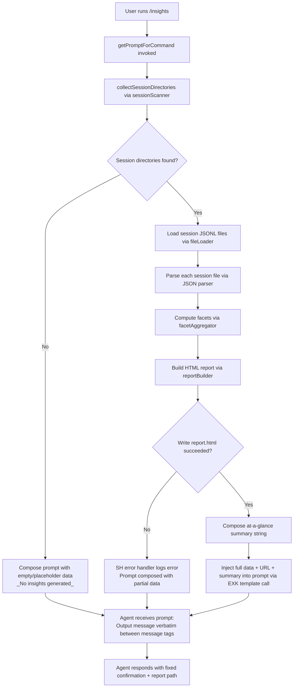

# `/insights`

> Analysis basis: CC v2.1.172 bundle.js (AST extraction + Claude interpretation)
> Minimum version: v2.1.172

---

## Overview

`/insights` generates a shareable HTML usage report by reading and analyzing stored Claude Code session data from the local filesystem. The command invokes an inline handler (`getPromptForCommand`) that collects session facets, builds the report file, and then instructs the agent to deliver a fixed confirmation message to the user.

---

## Registration

| Field | Value |
|---|---|
| type | `prompt` |
| name | `insights` |
| description | `Generate a report analyzing your Claude Code sessions` |
| loc_byte | `13400249` |
| loc_byte_end | `13401553` |
| loc_line | `10665` |
| handler_method | `getPromptForCommand` |
| handler_method_start | `13400423` |
| handler_method_end | `13401552` |
| prompt_body.length | `513` |
| prompt_body.trace | `call→EXK(...) (1 literals)` |
| arbor_handler.name | `getPromptForCommand` |
| arbor_handler.kind | `Method` |
| arbor_handler.fqn | `claude-2.1.172::getPromptForCommand` |
| arbor_handler.resolution_path | `direct` |
| arbor_handler.n_hits | `1` |

Analysis basis: CC v2.1.172 bundle.js:+13400249

---

## Input Branching

The handler has 3+ distinct execution paths depending on whether session data exists, whether the insights report can be generated, and whether a report URL is available. A Mermaid flowchart is used below.



Analysis basis: CC v2.1.172 bundle.js:+13400522 (call to `TXK`), +13401455 (call to `EXK`), +13401320 (literal `_No insights generated_`)

---

## Behavioral Spec

### 1. Handler Entry — `getPromptForCommand`

The handler is an `ObjectMethod` on the registration object (not a separate module export). Arbor resolves it as `direct` within the registration byte range `(13400249, 13401553)`.

```
async function getPromptForCommand(context):
    sessionData = await collectAndAggregateInsights(context)  // TXK
    roundedStat = Math.round(sessionData.someNumericField)    // loc +13400810
    promptText  = buildPromptString(sessionData)              // EXK, loc +13401455
    serialized  = serializeForPrompt(promptText)              // CH, loc +13401473
    reportPath  = resolveReportPath()                         // iF8, loc +13401519
    return { prompt: promptText }
```

Analysis basis: CC v2.1.172 bundle.js:+13400423

---

### 2. Session Discovery — `sessionScanner` (`IH5`)

Scans the local Claude Code projects directory for subdirectories that contain session JSONL files.

```
async function sessionScanner(baseDir):
    projectsDir = pathJoin(baseDir, "projects")    // literal "projects", loc +5081014
    entries     = await fs.readdir(projectsDir)    // oR.readdir, loc +13386813
    dirs        = entries.filter(e => e.isDirectory())  // loc +13386881
    results     = []
    for dir in dirs:
        files = await fileLoader(pathJoin(projectsDir, dir))  // fL6, loc +13386971
        results.push(files)
        yield via setImmediate                      // loc +13387093 (cooperative scheduling)
    results.sort(...)                              // loc +13387117
    return results
```

- Minimum directory index offset: `0` (literal, loc +13386842)
- Batch size thresholds observed: `10`, `9` (literals, loc +13387063, +13387068)
- Concurrency limits: `50` sessions, `200` cap (literals, loc +13387205, +13387210)

Analysis basis: CC v2.1.172 bundle.js:+13386794

---

### 3. Session File Loading — `fileLoader` (`fL6`)

For each project directory, reads and filters `.jsonl` files, gathers stat metadata, and returns parsed session records.

```
async function fileLoader(dirPath):
    entries = await fs.readdir(dirPath)                // gK.readdir, loc +13476200
    files   = entries.filter(e =>
        e.isFile() && matchesJsonlPattern(e.name)     // ".jsonl" literal, loc +13476306
    )
    fileBasenames = files.map(e => path.basename(e))  // N$.basename, loc +13476334
    results = []
    for basename in fileBasenames:
        results.push(basename)                         // q.push, loc +13476379
    fullPaths = files.map(e => path.join(dirPath, e)) // N$.join, loc +13476408
    stats     = await Promise.all(
        fullPaths.map(p => fs.stat(p))                // gK.stat, loc +13476509
    )
    // attach stats to result objects via _.set       // loc +13476520
    return categorizeByMimeType(results)              // N, loc +13476608
```

Analysis basis: CC v2.1.172 bundle.js:+13476200

---

### 4. Session Path Resolution — `sessionPathResolver` (`Wp6`) and `ZYA`

Resolves the canonical paths for per-session subdirectories.

```
function resolveUsageDataPath(rootDir):
    return path.join(rootDir, "usage-data")          // literal, loc +13326138

function resolveSessionMetaPath(rootDir):
    return path.join(rootDir, "session-meta")        // literal, loc +13326234

function resolveFacetsPath(rootDir):
    return path.join(rootDir, "facets")              // literal, loc +13326188
```

Analysis basis: CC v2.1.172 bundle.js:+13326125, +13326220

---

### 5. Session Data Deserialization — `sessionParser` (`JH5`)

Reads a session file (UTF-8) and deserializes its JSON payload.

```
async function sessionParser(sessionPath):
    raw    = await fs.readFile(sessionPath, "utf-8")  // oR.readFile + "utf-8" literal,
                                                       // loc +13332245, +13326269
    parsed = safeJsonParse(raw)                        // n6 → JSON.parse, loc +13332290
    return parsed
```

Analysis basis: CC v2.1.172 bundle.js:+13332202

---

### 6. Facet Aggregation — `facetAggregator` (`TXK`)

The central aggregation function. Collects per-session data slices, processes them in parallel (capped), builds facet structures, and writes the final output files.

```
async function facetAggregator(context):
    sessions = await sessionScanner(context.dataRoot)      // IH5, loc +13387186
    slices   = sessions.slice(0, MAX_SESSIONS)             // A.slice, loc +13387259
    results  = await Promise.all(
        slices.map(s => sessionParser(s))                  // JH5 + B.map, loc +13387282
    )
    // accumulate raw events
    for result in results:
        rawEvents.push(result)                             // L.push, loc +13387401
        mcpState.push(result)                              // M.push, loc +13387430

    // check if model includes restricted content
    if modelList.includes(someModel):                      // g.includes, loc +13387579
        // insert JSON-only instruction
        // literal: "RESPOND WITH ONLY A VALID JSON OBJECT", loc +13387590

    // request facet recording
    // literal: "record_facets", loc +13387643

    // slice top results for display
    topResults = mcpState.slice(...)                       // M.slice, loc +13387720

    // build facets from raw events
    facets = buildFacetReport(topResults)                  // rF8, loc +13387789

    // compute session analytics
    sessionAnalytics = computeSessionAnalytics(results)    // vYA, loc +13387893
    roundedAnalytics = Math.round(sessionAnalytics)

    // cache and persist
    cache.get / cache.set                                  // Q.get/Q.set, loc +13387919/+13387940

    // write HTML report
    await writeHtmlReport(context)                         // XH5, loc +13388027

    // generate per-session chart data
    chartData = buildChartData(facets)                     // GXK, loc +13389106
    htmlSections = renderHtmlSections(chartData)           // NH5, loc +13389165
    glanceSummary = buildAtAGlanceSummary(chartData)       // GH5, loc +13389154

    // timestamp the report
    now = new Date()
    year    = String(now.getFullYear())                    // loc +13389275
    month   = S(now.getMonth())                            // loc +13389296
    day     = R.getDate()                                  // loc +13389317
    hours   = R.getHours()                                 // loc +13389335
    minutes = R.getMinutes()                               // loc +13389353
    seconds = R.getSeconds()                               // loc +13389373

    outPath = path.join(outputDir, "report.html")          // literal "report.html", loc +13389443
    await fs.writeFile(outPath, htmlContent)               // oR.writeFile, loc +13389471

    return { facets, sessionAnalytics, reportPath: outPath }
```

- Maximum sessions processed: 5 (`kind: number, value: 5`, loc +13387494)
- Role label applied to results: `"user"` (literal, loc +13387509)
- Warmup mode literal: `"warmup_minimal"` (loc +13389001)

Analysis basis: CC v2.1.172 bundle.js:+13387186

---

### 7. HTML Report Writer — `htmlReportWriter` (`XH5`)

Creates the output directory and writes the HTML report file.

```
async function htmlReportWriter(outputDir, htmlContent, context):
    await fs.mkdir(outputDir, { recursive: true })         // oR.mkdir, loc +13332786
    reportPath = path.join(resolveBasePath(), ...)         // ZYA + sQ.join, loc +13332795
    fullPath   = path.join(reportPath, "report.html")      // sQ.join, loc +13332823
    await fs.writeFile(fullPath, htmlContent, ...)         // oR.writeFile, loc +13332867
    serialized = serializeContent(htmlContent)             // CH → JSON.stringify, loc +13332882
    if error:
        errorHandler(error)                                // SH, loc +13332933
```

Analysis basis: CC v2.1.172 bundle.js:+13332786

---

### 8. Facet File Writer — `facetFileWriter` (`jH5`)

Writes per-session facet JSON files to the facets directory.

```
async function facetFileWriter(sessionId, facetData, baseDir):
    facetsDir = resolveReportPath(baseDir)                // iF8, loc +13332038
    await fs.mkdir(facetsDir, { recursive: true })        // oR.mkdir, loc +13332029
    outPath   = path.join(facetsDir, sessionId + ".json") // sQ.join, loc +13332073
    await fs.writeFile(outPath, serializeContent(facetData))
                                                           // oR.writeFile + CH, loc +13332117
```

Analysis basis: CC v2.1.172 bundle.js:+13332029

---

### 9. HTML Section Renderer — `htmlSectionRenderer` (`NH5`)

Constructs the full HTML body sections from aggregated facet data. Applies HTML-escaping and formats visual chart elements.

```
function htmlSectionRenderer(facetData):
    // HTML escape helpers (h7 / J7):
    //   "&amp;" loc +5117510, "&lt;" loc +5117534, "&gt;" loc +5117557
    //   "&quot;" loc +5117608, "&apos;" loc +5117633

    parts = facetData.key.split(...)                      // k.split, loc +13344990
    parts = parts.map(applyMarkdownBoldToStrong)          // "<strong>$1</strong>", loc +13345062
    parts = parts.map(...)
        .replaceAll("•", "• ")                            // literal "• ", loc +13345105
    lines = lines.replaceAll(lineBreak, "<br>")           // "<br>", loc +13345135

    // Response time bucketing (ZOH):
    timeBuckets = ["2-10s","10-30s","30s-1m","1-2m","2-5m","5-15m",">15m"]
                                                           // loc +13343356 through +13343416
    // 120s threshold: loc +13343576; 900s threshold: loc +13343658

    // Time-of-day bucketing (ZH5 / VH5):
    morningHours   = [7,11]   // "Morning (6-12)", loc +13344204
    afternoonHours = [13,14,16,17]  // "Afternoon (12-18)", loc +13344251
    eveningHours   = [18,19,21,22,23]  // "Evening (18-24)", loc +13344305
    nightHours     = [0,4]    // "Night (0-6)", loc +13344357

    // Chart color palette:
    //   #2563eb loc +13381021, #0891b2 loc +13381159
    //   #10b981 loc +13381331, #8b5cf6 loc +13381474

    // Tool error section colors:
    //   error: #dc2626 loc +13384737
    //   success: #16a34a loc +13384986
    //   warning: #eab308 loc +13385479

    // Add-to-CLAUDE.md suggestion action button literal: loc +13348700
    // Empty-state placeholders:
    //   "No data": loc +13342847
    //   "None captured": loc +13339717
    //   "No response time data": loc +13343304
    //   "No time data": loc +13344154
    //   "No tool errors": loc +13384748

    return htmlString
```

- Context max tokens: 8192 characters (literal, loc +13342525)
- Max display items: 4096 (literal, loc +13334087)
- Session stale threshold: 1800000 ms = 30 minutes (literal, loc +13334611)

Analysis basis: CC v2.1.172 bundle.js:+13344990

---

### 10. At-a-Glance Summary Builder — `atAGlanceSummaryBuilder` (`GH5`)

Aggregates high-level statistics across all sessions and renders a compact summary string for context injection into the agent prompt.

```
async function atAGlanceSummaryBuilder(facets):
    allValues = Array.from(_.values(facets))               // loc +13338848
    // serialize partial JSON for at_a_glance key
    // literal: "at_a_glance", loc +13340383

    summary = {}
    for each entry in Object.entries(allValues):           // loc +13339369
        summary[entry.key] = CH(entry.value)               // CH = JSON.stringify

    summary = Math.round(numericFields)                    // loc +13339302
    await Promise.all(
        WH5.map(s => renderInsightsSection(s))            // jXK, loc +13339767
    )
    return summary
```

Analysis basis: CC v2.1.172 bundle.js:+13338837

---

### 11. Prompt Construction and Agent Delivery

After all data is collected, `getPromptForCommand` calls `EXK` to produce the final prompt string (loc +13401455), passing:
- The full serialized insights data
- The report URL and HTML file path
- The facets directory path
- The at-a-glance summary (for agent context only — the user has not seen any output at this point)

The prompt instructs the agent to output the text between `<message>` tags **verbatim** as its entire response, including a shareable report path and an invitation to explore specific sections. If no insights were generated, the literal `"_No insights generated_"` (loc +13401320) is substituted into the message body.

The separator literal `" · "` (loc +13400881) is used when joining multiple data fields in the summary line.

Analysis basis: CC v2.1.172 bundle.js:+13401455, +13401320, +13400881

---

## State & Side Effects

| Item | Detail |
|---|---|
| Filesystem reads | Reads all `.jsonl` session files from the projects directory under the Claude Code data root |
| Filesystem writes | Creates `report.html` in the configured output directory; creates per-session `.json` facet files in the `facets/` subdirectory |
| Directory creation | `fs.mkdir` with `{ recursive: true }` for output and facets directories |
| Telemetry | `tengu_mcp_skills` (loc +6607177), `tengu_daemon_config_reload` (loc +16775429), `tengu_daemon_idle_exit` (loc +16780682), `tengu_daemon_control` (loc +16796987), `tengu_bg_dispatch_sigkill_escalate` (loc +16759925), `tengu_bg_dispatch_low_mem` (loc +16760526), `tengu_bg_spare_enable` (loc +16761230), `tengu_bg_spare_claim` (loc +16761358), `tengu_bg_spare_claim_fail` (loc +16761624), `tengu_bg_retire_pinned_low_mem` (loc +16764562), `tengu_bg_prewarm_per_sweep` (loc +16764683), `tengu_transcript_phantom_parent` (loc +13461765), `tengu_relink_walk_broken` (loc +13441480), `tengu_transcript_parent_cycle` (loc +13465570), `tengu_voice_silent_drop_replay` (loc +14606056), `tengu_voice_recording_completed` (loc +14606927), `tengu_chain_parent_cycle` (loc +13443253), `tengu_chain_timestamp_fallback` (loc +13443402), `tengu_chain_parallel_tr_recovered` (loc +13445268), `tengu_daemon_yield` (loc +16779652) |
| appState changes | None observed within depth-2 traversal of the insights handler path |
| Sound | None observed |
| Error handling | `SH` (error logger, loc +13332933, +13443151) logs failures; command continues with partial data |
| Cooperative scheduling | `setImmediate` used between directory batches to avoid blocking the event loop (loc +13387093) |
| Data root subdirectories used | `usage-data/`, `session-meta/`, `facets/` |

---

## Version History

| Version | Change |
|---|---|
| v2.1.172 | Initial analysis |

---

## Common Mistakes

1. **Running `/insights` with no prior sessions**: If the Claude Code projects directory is empty or absent, the command produces the fallback literal `_No insights generated_` rather than a report. Ensure at least one completed session exists before invoking.
2. **Missing write permissions on the output directory**: The handler calls `fs.mkdir` and `fs.writeFile` against the configured data root. If the process lacks write access, the `SH` error path is triggered and the report file will not be created even though the agent may still respond.
3. **Expecting a real-time streaming response**: The agent's response is driven by a static `<message>` template injected into the prompt. The content the agent outputs is predetermined by the prompt body, not generated dynamically from conversation context.
4. **Confusing the facets directory with the report**: The command writes both a single `report.html` (the shareable HTML file) and individual `.json` facet files under `facets/`. Deleting the facets directory will not delete the HTML report.
5. **Session count cap**: Only the most recent 5 sessions (literal, loc +13387494) are included in the report aggregation. Older sessions are silently excluded.

---

## Appendix — Identifier Mapping

> For bundle debugging only. Identifiers change across versions.

| Identifier | Role |
|---|---|
| `__handler_insights` | Synthetic BFS entry point for the `/insights` command handler |
| `TXK` | `facetAggregator` — central session data collection and facet computation function |
| `IH5` | `sessionScanner` — scans project directories for session JSONL files |
| `Fn` | Path join helper for the projects directory |
| `fL6` | `fileLoader` — reads and filters `.jsonl` files within a project directory |
| `Ig` | JSONL filename pattern matcher (regex test) |
| `JH5` | `sessionParser` — reads and JSON-parses a single session file |
| `ZYA` | Intermediate path resolver (chains to `Wp6`) |
| `Wp6` | `sessionPathResolver` — resolves `usage-data/`, `session-meta/`, `facets/` paths |
| `PXK` | Session parse post-processor |
| `n6` | Safe JSON parse wrapper |
| `vYA` | `computeSessionAnalytics` — derives aggregate stats from raw session events |
| `XXK` | Inner analytics loop; handles tool-use classification, git commit/push detection |
| `MH5` | `Number.isNaN` guard for analytics computation |
| `LH5` | File extension extractor (`path.extname`) |
| `JPH` | Diff helper (`nG9.diff`) |
| `V4` | String index search utility |
| `rF8` | `buildFacetReport` — constructs the structured facet object from session slices |
| `IqH` | Low-level session index builder; populates all per-session Map entries |
| `iH5` | Session index initializer |
| `Nd6` | JSON field extractor with array/object branch handling |
| `mJ` | Message join helper |
| `lXK` | Session re-link / walk helper; emits `tengu_relink_walk_broken` |
| `YPK` | Facet accumulation helper |
| `p3H` | Facet chain builder; emits `tengu_chain_parent_cycle`, `tengu_chain_timestamp_fallback` |
| `$65` | Numeric NaN-guard for facet values |
| `O65` | Facet sort/filter helper |
| `L65` | Facet shift/priority helper |
| `A96` | Session map renderer |
| `rYA` | Content replacement normalizer (`replaceAll`) |
| `iu6` | Inline content classifier |
| `aYA` | Attachment type tester |
| `z65` | Trim/array-some helper for attachment detection |
| `w65` | Secondary array-some helper for attachment detection |
| `Mg8` | Facet metric getter/setter |
| `$g8` | Facet value collector (`Array.from` + `H.values`) |
| `XH5` | `htmlReportWriter` — writes `report.html` to output directory |
| `jH5` | `facetFileWriter` — writes per-session `.json` facet files |
| `DH5` | Report data loader (reads existing report JSON for incremental update) |
| `iF8` | `resolveReportPath` — resolves path joining base dir with report subdirectory |
| `ZXK` | Report cleanup helper (used after successful write) |
| `PH5` | Report pipeline orchestrator (calls `YH5`, `qq6`, `yf`, `JXK`, `Gf`, `n6`) |
| `YH5` | Batch session processor with `Promise.all` |
| `OH5` | Per-session slice formatter |
| `qq6` | HTML generation pipeline entry |
| `yf` | HTML template injector |
| `Xb8` | Hash-based deduplication and report file manager |
| `U8` | UUID + content packer for report sections |
| `CpH` | Report section composer; emits `"No assistant message found"` on error |
| `ME` | Metrics extractor |
| `FG` | Flag helper (`BG`) |
| `QE` | Quality/error classifier |
| `JXK` | Template renderer entry (`Zj`) |
| `Zj` | Theme resolver (`mantle` / `firstParty` / `default`) |
| `Gf` | Output filter |
| `JA` | Error-to-string converter |
| `kH5` | `Object.keys`-based section key enumerator |
| `GXK` | `buildChartData` — produces chart-ready data from facets |
| `KL6` | Chart entry iterator (`Object.entries`) |
| `M9` | String slice/index helper |
| `WXK` | Numeric sort/dedup helper for chart buckets |
| `GH5` | `atAGlanceSummaryBuilder` — generates at-a-glance summary for prompt injection |
| `jXK` | Per-section insights renderer |
| `AH5` | Section template resolver |
| `NH5` | `htmlSectionRenderer` — renders all HTML body sections with charts and tables |
| `h7` | HTML escape applicator |
| `J7` | HTML entity replacer (`replaceAll` on `&`, `<`, `>`, `"`, `'`) |
| `nF8` | Inner HTML escape helper |
| `vH5` | Section serialize helper (`CH`) |
| `ZOH` | Response time bucket renderer |
| `ZH5` | Time-of-day aggregate renderer |
| `VH5` | Chart bar renderer |
| `EXK` | Final prompt string builder (called at loc +13401455) |
| `CH` | `JSON.stringify` wrapper |
| `SH` | Error logger / error handler |
| `VYA` | Analytics post-processor |
| `a3` | Numeric formatter |
| `Pp6` | Tool-use prefix checker |
| `yRH` | MCP server connection manager |
| `Jc9` | MCP connection initializer |
| `Jj8` | MCP message sender |
| `Yj8` | MCP heartbeat handler |
| `sJ8` | MCP OAuth flow handler |
| `tJ8` | MCP callback handler |
| `Vc9` | MCP connection state updater |
| `XU_` | MCP error recovery handler |
| `pN` | MCP skill reporter (emits `tengu_mcp_skills`) |
| `qU_` | MCP capability checker |
| `Gc9` | MCP connection finalizer |
| `ZH6` | Integer parser (version field) |
| `sX8` | Integer parser (capability field) |
| `Ln8` | MCP connection result applier |
| `kRH` | MCP update helper |
| `r0` | MCP cleanup scheduler |
| `TwK` | Timestamp recorder |
| `nWA` | MCP client entry manager |
| `mJ8` | MCP capability set checker (`OWL.has`, `$U_.has`) |
| `d8` | Timed abort controller |
| `TH6` | MCP server state transition helper |
| `g` | Daemon write/schedule helper |
| `w` | Daemon supervisor writer |
| `ZEH` | Daemon ENOENT handler |
| `iDK` | Column-width calculator |
| `E` | Spinner/progress display controller |
| `DrK` | Heartbeat dispatcher |
| `T65` | JSONL binary parser (low-level Buffer operations) |
| `E65` | JSONL header reader |
| `G65` | JSONL chunk parser |
| `ivH` | Extended file format parsers (`Exf`, `Zxf`, `vxf`, `Vxf`) |
| `C` | Output writer with timeout |
| `T9` | N8 wrapper (node stream helper) |
| `HH` | MCP update applier set |
| `t` | MCP update accumulator |
| `d` | Background session connector |
| `n` | Voice recording handler |
| `a` | ZQ8 wrapper |
| `x` | IPC channel closer |
| `Q` | Process socket manager |
| `W` | Background worker connection manager |
| `D` | Background worker lifecycle manager |
| `Y` | Process exit/abort handler |
| `z` | Worker state container |
| `O` | Background session container |
| `J` | IPC duplex stream |
| `X` | Timeout socket handler |
| `P` | Buffer line reader |
| `G` | Vim-mode key handler |
| `y` | Worker sweep/prewarm scheduler |
| `f6` | String coercer |
| `ip` | Session index helper |
| `EH` | String error coercer |
| `OL` | MCP error logger (emits `mcpError`) |
| `j8` | MCP debug logger (emits `mcpDebug`) |
| `R` | Writer with yield logic |
| `S` | Foreground writer with SH error path |
| `uV6` | Animation frame helper |
| `qi` | MCP tool registration helper |
| `QV` | MCP capability resolver |
| `g8` | Utility function (single-arg wrapper) |

---

Note: index built via Arbor fallback; some signals (telemetry, literals) may be missing — see arbor-fallback.js.