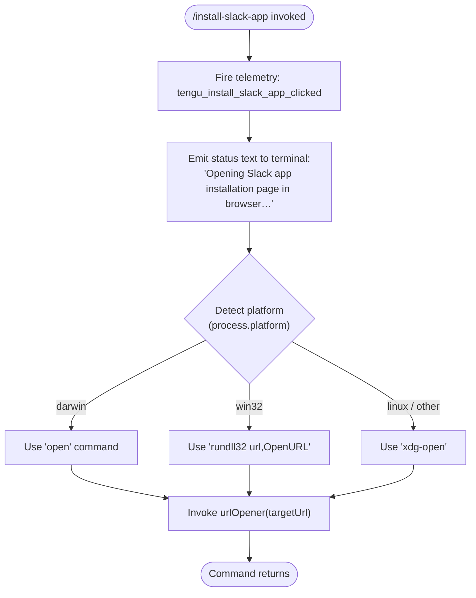

# `/install-slack-app`

> Analysis basis: CC v2.1.172 bundle.js (AST extraction + Claude interpretation)
> Minimum version: v2.1.172

---

## Overview

`/install-slack-app` is a local slash command that opens the Claude Slack app installation page in the user's default browser. It fires a single telemetry event, emits a status message to the terminal, and delegates URL-opening to the platform-appropriate system call. The command has no interactive sub-flow and does not accept arguments.

---

## Registration

| Field | Value |
|---|---|
| type | `local` |
| name | `install-slack-app` |
| description | `Install the Claude Slack app` |
| supportsNonInteractive | `false` |
| module_id | `LHK` |
| load_inline | `true` |
| loc_byte | `11876834` |
| loc_byte_end | `11877020` |
| loc_line | `8225` |
| arbor_handler.name | `vR7` |
| arbor_handler.fqn | `claude-2.1.172::vR7` |
| arbor_handler.kind | `AsyncFunction` |
| arbor_handler.resolution_path | `module_id` |
| arbor_handler.n_hits | `0` |

Analysis basis: CC v2.1.172 bundle.js:+11876834

---

## Input Branching

The command has a linear flow with one platform-dependent branch for selecting the URL-opener. Two distinct paths exist (macOS/Windows vs. Linux/other), which qualifies for a Mermaid diagram.



Analysis basis: CC v2.1.172 bundle.js:+11876438, +11876478, +11876553, +6249617, +6249633, +6249717, +6249791, +6249798

---

## Behavioral Spec

### Main Handler — `slackAppInstallHandler` (`vR7`)

The Arbor-resolved handler is `vR7` (AsyncFunction), reached via `module_id` → `LHK`.

```
async function slackAppInstallHandler(context):
    1. emit telemetry event "tengu_install_slack_app_clicked"
    2. call configPersist(context)           // side-effect: may persist config state
    3. emit terminal message with kind="text":
           "Opening Slack app installation page in browser…"
    4. call openUrl(targetUrl)               // platform-aware URL opener (FK)
    5. return
```

Analysis basis: CC v2.1.172 bundle.js:+11876438 (telemetry), +11876478 (configPersist call), +11876553 (openUrl call), +11876573 (message kind literal), +11876586 (message text literal)

---

### Config Persistence Sub-routine — `configPersist` (`E8`)

Called immediately after the telemetry event. This sub-routine performs a locked write of the global configuration, protecting against auth-loss and concurrent write races.

```
async function configPersist(context):
    acquire file lock via lockAcquire()      // warns if lock contention occurs
    read current config from disk
    if on-disk config is missing auth that in-memory cache has:
        log warning "saveGlobalConfig fallback: re-read config is missing auth..."
        abort write (safety guard, GH #3117)
        return
    merge changes into config
    write config atomically via atomicFileWrite()
    release lock
```

Analysis basis: CC v2.1.172 bundle.js:+3308889 (`E8` → `F78`), +3309086 (auth-loss guard), +3309096 (warning literal), +3312132 (`tengu_config_lock_contention`), +3312268 (`tengu_config_stale_write`), +3312459 (auth-loss guard message)

---

### URL Opener — `openUrl` (`FK`)

Delegates to the platform-appropriate system binary to open a URL.

```
async function openUrl(url):
    validate url.protocol is "http:" or "https:"
    if not valid:
        throw Error via urlValidationError()
    platform = process.platform
    if platform == "darwin":
        binary = "open"
        args   = [url]
    else if platform == "win32":
        binary = "rundll32"
        args   = ["url,OpenURL", url]
    else:
        binary = "xdg-open"
        args   = [url]
    spawn(binary, args)
    await process completion
```

Analysis basis: CC v2.1.172 bundle.js:+6249308 (`"http:"`), +6249330 (`"https:"`), +6249258 (Error via `iYL`), +6249558 (`wY`), +6249617 (`"darwin"`), +6249633 (`"win32"`), +6249717 (`"rundll32"`), +6249729 (`"url,OpenURL"`), +6249791 (`"open"`), +6249798 (`"xdg-open"`), +6249666 (`p8` — spawn helper)

---

### Atomic Config File Writer — `atomicFileWrite` (`F78`)

Used internally by `configPersist` to safely write configuration files with backup rotation and lock contention detection.

```
function atomicFileWrite(filePath, data, options):
    ensure parent directory exists (mkdirSync)
    acquire file lock
    if lock acquisition took > threshold ms:
        emit warning "Lock acquisition took longer than expected…"
        emit telemetry "tengu_config_lock_contention"
    read existing file for backup (readFileSync, utf-8)
    if existing content has auth that new content is missing:
        emit telemetry "tengu_config_stale_write"
        refuse write
        return
    rotate backups (keep last 5, ".backup." infix, max age 60000 ms)
    write data atomically via atomicSymlinkWrite()
    emit telemetry "tengu_config_auth_loss_prevented" if applicable
    release lock
```

Analysis basis: CC v2.1.172 bundle.js:+3311832 (`f.mkdirSync`), +3312000 (`"error"`), +3312043 (lock warning literal), +3312130 (`c`), +3312193 (`nG`), +3312208 (`f.statSync`), +3312390 (`"ENOENT"`), +3312421 (`W7H`), +3312459 (auth-loss message), +3312929 (`".backup."`), +3313062 (backup count `5`), +3312813 (60 000 ms timeout), +3312611 (`tengu_config_auth_loss_prevented`)

---

## State & Side Effects

| Item | Detail |
|---|---|
| Telemetry — primary | `tengu_install_slack_app_clicked` (bundle.js:+11876440) |
| Telemetry — config lock | `tengu_config_lock_contention` (bundle.js:+3312132) |
| Telemetry — stale write | `tengu_config_stale_write` (bundle.js:+3312268) |
| Telemetry — auth loss | `tengu_config_auth_loss_prevented` (bundle.js:+3312611) |
| Telemetry — config parse | `tengu_config_parse_error` (bundle.js:+3314707) |
| Terminal output | Emits `text`-type message: `"Opening Slack app installation page in browser…"` (bundle.js:+11876586) |
| Browser side-effect | Opens the Slack app installation URL in the OS default browser |
| File system | May update `~/.claude.json` (or equivalent global config) with locked atomic write |
| supportsNonInteractive | `false` — command must not be invoked in non-interactive (headless) mode |
| Hook registration | <!-- TODO: not found in depth-2 traversal; needs --depth 4 --> |
| appState changes | <!-- TODO: not found in depth-2 traversal; needs --depth 4 --> |
| Sound | <!-- TODO: not found in depth-2 traversal; needs --depth 4 --> |

---

## Version History

| Version | Change |
|---|---|
| v2.1.172 | Initial analysis |

---

## Common Mistakes

1. **Running in non-interactive mode**: The command declares `supportsNonInteractive: false`. Invoking it via `--print` / `--output-format` pipelines or in CI will be rejected or silently skipped.
2. **No browser installed**: On headless Linux servers `xdg-open` may not be available or may fail silently; no error is surfaced to the user in that case.
3. **Expecting arguments**: The command takes no arguments. Any text typed after `/install-slack-app` is ignored.
4. **Confusing this with a configuration command**: The command only opens a browser URL. It does not authenticate the Slack integration or modify any Claude Code settings beyond the incidental config-persistence side-effect.
5. **Blocking on URL schemes other than HTTP/HTTPS**: The URL validator (`iYL`) throws if the protocol is not `http:` or `https:`, so custom deep-link targets will fail.

---

## Appendix — Identifier Mapping

> For bundle debugging only. Identifiers change across versions.

| Identifier | Role |
|---|---|
| `vR7` | Main handler for `/install-slack-app` (AsyncFunction, Arbor-resolved) |
| `c` | Generic logger / console utility used throughout the handler |
| `E8` | Config persistence orchestrator (called from `vR7`) |
| `F78` | Atomic config file writer with lock, backup rotation, and auth-loss guard |
| `_` | File-system abstraction layer (statSync, readdirStringSync, etc.) |
| `o6` | Path resolution / normalization helper |
| `f` | Secondary file-system module (mkdirSync, statSync, copyFileSync, readdirStringSync, unlinkSync) |
| `q` | Another file-system or queue abstraction (readFileSync, mkdirSync, statSync, etc.) |
| `L` | Promise / stream finalization helper |
| `mV1` | Config merge / Object.assign wrapper |
| `dY_` | Config defaults builder |
| `N` | HTTP request / API call dispatcher |
| `g8f` | Request construction helper |
| `H` | Random-delay / retry utility (Math.random, setTimeout) |
| `CH` | JSON serializer wrapper (JSON.stringify) |
| `lf` | Response text extractor / truncation helper |
| `rFH` | Response error handler |
| `l8f` | HTTP response body reader with byte-length accounting |
| `N8` | Error normalizer / code extractor |
| `W7H` | Config reader with backup/directory scan logic |
| `n6` | JSON.parse wrapper |
| `bu` | String prefix stripper (startsWith / slice) |
| `S_9` | Directory listing and backup file finder |
| `XZ_` | Path join + array builder helper |
| `D` | Daemon session/process manager |
| `brH` | Auth presence checker for stale-write guard |
| `A` | Locale / case normalizer (toLowerCase) |
| `V` | File entry filter (startsWith) |
| `P` | IPC / buffer-split protocol reader |
| `X` | Socket/stream with timeout (setTimeout) |
| `j` | Job/process map manager (kill, values) |
| `I7` | Stream end + JSON stringify helper |
| `x05` | Daemon message dispatcher / session state machine |
| `EH` | String coercion wrapper |
| `E` | Slice/range math helper (Math.max, Math.min) |
| `W` | SDK connection manager (Promise.all, connect/disconnect) |
| `Sz6` | Atomic symlink-based file writer with fchmod/fsync |
| `O` | Symbolic-link stat checker |
| `R8` | Error code wrapper (N8) |
| `HJH` | Config pre-load / cache prime helper |
| `y_9` | Config field enumerator (Object.entries) |
| `b26` | Timestamp helper (Date.now) |
| `B78` | Global config save with auth guard (Sz6 delegate) |
| `FK` | Platform-aware URL opener (open / rundll32 / xdg-open) |
| `iYL` | URL protocol validator (throws Error for non-HTTP/S) |
| `wY` | URL construction / formatting helper |
| `p8` | Child-process spawn wrapper for URL opener |
| `u_` | Top-level async runner / abort controller |
| `BvH` | HTTP client constructor (fetch/agent initializer) |
| `Y` | Process exit controller (process.exit, abort) |
| `ubf` | String coercion utility |
| `v3` | Version / environment metadata reader |
| `SH` | Structured logger (logError, push) |
| `p6` | AsyncLocalStorage context accessor |
| `zo6` | Store getter (Oo6.getStore) |
| `P_` | Background context provider (BG) |

---

Note: index built via Arbor fallback; some signals (telemetry, literals) may be missing — see arbor-fallback.js.