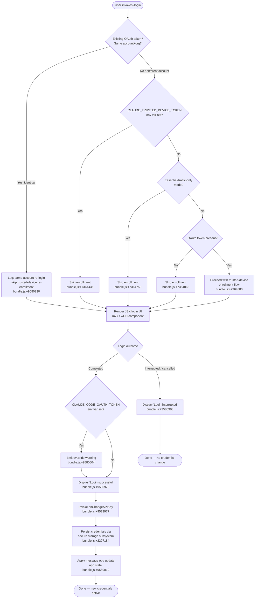

# `/login`

> Analysis basis: CC v2.1.172 bundle.js (AST extraction + Claude interpretation)
> Minimum version: v2.1.172

---

## Overview

The `/login` command initiates an OAuth-based authentication flow, allowing the user to switch Anthropic accounts or sign in for the first time. It renders a JSX login component (`m77`/`wGH`) that manages an interactive sign-in session, persists the resulting OAuth token through a credential storage subsystem, and then updates application state to reflect the new identity. Once the flow completes (or is interrupted), it reports success or interruption inline and optionally warns if an environment variable would override the new credentials at runtime.

---

## Registration

| Field | Value |
|---|---|
| type | `local-jsx` |
| name | `login` |
| description | `Switch Anthropic accounts \| Sign in with your Anthropic account` |
| loc_byte | `11824833` |
| loc_byte_end | `11825053` |
| loc_line | `8077` |
| module_id | `Avq` |
| load_inline | `true` |
| arbor_handler.name | `$eq` |
| arbor_handler.fqn | `claude-2.1.172::$eq` |
| arbor_handler.kind | `Function` |
| arbor_handler.resolution_path | `direct` |
| arbor_handler.n_hits | `2` |

Analysis basis: CC v2.1.172 bundle.js:+11824833

---

## Input Branching

The `/login` command has several distinct execution branches depending on existing credentials, environment variable overrides, trusted-device state, and whether the user completes or cancels the flow. A Mermaid flowchart is used because there are more than three distinct paths.



---

## Behavioral Spec

### Top-level login JSX handler (`m77` / handler `$eq`)

The Arbor-resolved handler `$eq` is the registration-level entry point. At runtime the JSX component tree is rooted at `m77` (identified as the `handler_name`) which calls into `wGH`.

```
function loginCommandHandler(appContext):
    // Render JSX login component
    component = createLoginComponent(appContext)  // m77 → wGH

    // wGH sets up React state and hooks
    [loginState, setLoginState] = useState(initialState)
    memoCache = Symbol.for("react.memo_cache_sentinel")  // bundle.js:+9581103

    // Register global "confirm:no" handler to intercept Esc
    registerHandler("confirm:no", ...)  // Z_ hook, bundle.js:+9581381

    // Mount interactive OAuth flow UI
    render(component)
```

Analysis basis: CC v2.1.172 bundle.js:+9580946, +9581044, +9581074

---

### Authentication state initialization (`tk8`)

`tk8` is the core hook invoked by the login component. It wires together credential reads, API-key change callbacks, message operations, and all sub-systems needed before presenting the login form.

```
function initLoginState(context):
    // 1. Trigger API key change callback
    onChangeAPIKey(context)              // bundle.js:+9579977

    // 2. Apply "update" message operation to session
    applyMessageOp("update", ...)       // bundle.js:+9580019

    // 3. Resolve effective credential type
    credentialType = resolveCredentials(context)
    //   Checks (in order):
    //   - ANTHROPIC_API_KEY env var          bundle.js:+3249226
    //   - ANTHROPIC_AUTH_TOKEN env var       bundle.js:+3247998
    //   - CLAUDE_CODE_OAUTH_TOKEN env var    bundle.js:+3248087
    //   - CLAUDE_CODE_OAUTH_TOKEN_FILE_DESCRIPTOR  bundle.js:+3248204
    //   - CCR_OAUTH_TOKEN_FILE env var       bundle.js:+3248273
    //   - apiKeyHelper setting               bundle.js:+3249320
    //   - CLAUDE_CODE_API_KEY_FILE_DESCRIPTOR bundle.js:+2131926
    //   If none found → throw error with full list  bundle.js:+3249695

    // 4. Determine provider type
    //   Possible values: "bedrock", "foundry", "anthropicAws",
    //   "mantle", "vertex", "firstParty", "gateway"
    //   (bundle.js:+2109332 … +7408366)

    // 5. Start remote-settings pull
    startRemoteSettingsPoll(context)    // Sc_ / FRL pipeline

    // 6. Start policy-limits load
    startPolicyLimitsLoad(context)      // VN6 / Pe9 pipeline

    // 7. Check trusted-device enrollment eligibility
    evaluateTrustedDeviceEnrollment(context)  // yN6

    // 8. Initialize permission-mode subsystem
    initPermissionMode(context)         // nS6 / FN6 / WO

    // 9. Read current app state
    appState = getAppState()            // bundle.js:+9580385

    // 10. Set updated app state after login completes
    setAppState(newState)               // bundle.js:+9580481
```

Analysis basis: CC v2.1.172 bundle.js:+9579977, +9580019, +9580325, +9580373, +9580385, +9580401, +9580439, +9580445, +9580481

---

### Trusted-device enrollment (`yN6`)

```
function evaluateTrustedDeviceEnrollment(context):
    // Guard 1: env override
    if env.CLAUDE_TRUSTED_DEVICE_TOKEN is set:
        log("[trusted-device] env var set, skipping enrollment")  // bundle.js:+7364436
        return

    // Guard 2: essential-traffic-only mode
    if isEssentialTrafficOnly(context):
        log("[trusted-device] Essential traffic only, skipping")  // bundle.js:+7364750
        return

    // Guard 3: no OAuth token
    if oauthToken is absent:
        log("[trusted-device] No OAuth token, skipping")          // bundle.js:+7364863
        return

    // Guard 4: same account re-login
    if sameAccountReLogin(context):
        log("[trusted-device] Same account+org re-login, skipping re-enrollment")
        // bundle.js:+9580230
        return

    // Proceed: POST enrollment request
    response = httpPost(enrollmentEndpoint, {
        "Content-Type": "application/json",   // bundle.js:+7365114
        timeout: 10000,                       // bundle.js:+7365157
        retryDelay: 500,                      // bundle.js:+7365183
    })

    if response.status == 201:               // bundle.js:+7365345
        deviceToken = response.body.device_token
        if deviceToken is missing:
            recordFailure("missing_token")   // bundle.js:+7365643
            return
        persistDeviceToken(deviceToken)      // secure storage write
    else:
        if response.status is HTTP error:
            recordFailure("http_error")      // bundle.js:+7365464
        else if storageWrite failed:
            recordFailure("storage_failed")  // bundle.js:+7365851

    telemetry("bridge_trusted_device_enroll", result)  // bundle.js:+7365259
```

Analysis basis: CC v2.1.172 bundle.js:+7364436, +7364750, +7364863, +7365114, +7365157, +7365259

---

### Credential persistence (`dV1` — secure-storage write)

```
function persistCredentials(token):
    // Attempt primary secure storage
    result = primarySecureStorage.write(token)  // bundle.js:+2297184

    if result == "primary_transient_skip_fallback":  // bundle.js:+2297282
        // Transient error; do not fall back
        return

    if primarySecureStorage failed permanently:
        // Fall back to plaintext
        plaintextFallback.write(token)           // bundle.js:+2297431
        telemetry("plaintext_fallback_used")

    if both primary and fallback failed:
        telemetry("primary_and_fallback_failed") // bundle.js:+2297534
        throw error
```

Analysis basis: CC v2.1.172 bundle.js:+2297184, +2297282, +2297431, +2297534

---

### Remote-settings pull on auth change (`Sc_` / `FRL` / `pHq`)

After a successful login, a remote-settings refresh is triggered, because the new identity may carry different managed settings.

```
function refreshRemoteSettingsAfterAuth():
    log("Remote settings: Refreshed after auth change")  // bundle.js:+7414345

    // Compute settings hash (sha256/hex)  bundle.js:+7380422, +7380449
    hash = sha256(currentSettings)

    // Fetch from remote with conditional headers
    response = fetch(remoteSettingsUrl, {
        "User-Agent": ...,           // bundle.js:+7410471
        "If-None-Match": etag,       // bundle.js:+7410497
    })

    switch response.status:
        case 200:                    // bundle.js:+7410591
            validateAndApply(response.body)
        case 204:                    // bundle.js:+7410600
            // No content; keep current
        case 304:                    // bundle.js:+7410609
            log("Remote settings: Using cached settings (304)")  // bundle.js:+7410651
        case 401:                    // bundle.js:+7411733
            telemetry("tengu_remote_settings_401_force_refresh_retry")  // bundle.js:+7411802
        case 404:                    // bundle.js:+7410618
            log("Remote settings: Saved empty sentinel (404)")  // bundle.js:+7413622
        default:
            telemetry("remote_managed_settings_unexpected")      // bundle.js:+7413787
```

Analysis basis: CC v2.1.172 bundle.js:+7414345, +7410591, +7410609, +7411802

---

### Policy-limits refresh on auth change (`VN6` / `Pe9`)

```
function refreshPolicyLimitsAfterAuth():
    log("Policy limits: Refreshed after auth change")  // bundle.js:+7361046

    authType = detectAuthType()
    // Possible values: "wif", "oauth", "api_key"   bundle.js:+7356681, +7356720, +7356737

    result = fetchPolicyLimits(authType)
    telemetry("tengu_policy_limits_fetch", result)   // bundle.js:+7359261

    switch result.outcome:
        case "succeeded":                            // bundle.js:+7359167
            applyRestrictions(result.data)
            log("Policy limits: Applied new restrictions")   // bundle.js:+7360072
        case "failed":                               // bundle.js:+7359179
            useStaleCache()
            log("Policy limits: Using stale cache after fetch failure")  // bundle.js:+7359688
        case "request_failed":                       // bundle.js:+7359222
            log("Policy limits: Using stale cache after error")          // bundle.js:+7360264
```

Analysis basis: CC v2.1.172 bundle.js:+7361046, +7359261, +7356681

---

### Login completion and UI teardown (`wGH`)

```
function onLoginComplete(outcome):
    if outcome == "done":
        // Check for env-var override conflict
        if env.CLAUDE_CODE_OAUTH_TOKEN is set:
            displayWarning(
                "Warning: CLAUDE_CODE_OAUTH_TOKEN is set... unset that variable..."
            )  // bundle.js:+9580604
        displayMessage("Login successful")    // bundle.js:+9580979

    elif outcome == "interrupted":
        displayMessage("Login interrupted")   // bundle.js:+9580998

    // Trigger cleanup (IrH — clears interval, process listeners, caches)
    cleanupSideEffects()   // r_H → IrH, bundle.js:+9580076
```

Analysis basis: CC v2.1.172 bundle.js:+9580604, +9580979, +9580998, +9580076

---

## State & Side Effects

| Item | Detail |
|---|---|
| Telemetry — remote settings 401 retry | `tengu_remote_settings_401_force_refresh_retry` (bundle.js:+7411802) |
| Telemetry — feature flag OK | `tengu_feature_ok` (bundle.js:+1016269) |
| Telemetry — feature flag bad | `tengu_feature_bad` (bundle.js:+1016336) |
| Telemetry — feature flag sad | `tengu_feature_sad` (bundle.js:+1016417) |
| Telemetry — managed-settings security dialog shown | `tengu_managed_settings_security_dialog_shown` (bundle.js:+7407414) |
| Telemetry — security dialog accepted | `tengu_managed_settings_security_dialog_accepted` (bundle.js:+7407098) |
| Telemetry — security dialog rejected | `tengu_managed_settings_security_dialog_rejected` (bundle.js:+7407148) |
| Telemetry — policy limits fetch | `tengu_policy_limits_fetch` (bundle.js:+7359261) |
| Telemetry — policy limits cache write failed | `tengu_policy_limits_cache_write_failed` (bundle.js:+7358664) |
| Telemetry — disable bypass-permissions mode | `tengu_disable_bypass_permissions_mode` (bundle.js:+11108470) |
| Telemetry — auto mode config | `tengu_auto_mode_config` (bundle.js:+11106359) |
| Telemetry — daemon config reload | `tengu_daemon_config_reload` (bundle.js:+16775429) |
| Telemetry — keybinding fallback used | `tengu_keybinding_fallback_used` (bundle.js:+4196195) |
| Telemetry — trusted-device enrollment | `bridge_trusted_device_enroll` (bundle.js:+7365259) |
| Credential storage write | Writes OAuth token to primary secure storage; falls back to plaintext (bundle.js:+2297184) |
| Policy limits cache write | Writes policy limits to disk via `qRL` / `ICH.writeFile` (bundle.js:+7358461) |
| Remote settings cache write | Writes remote managed settings to file, fdatasync then close (bundle.js:+7412191, +7412242) |
| appState changes | `getAppState` read then `setAppState` write after credential update (bundle.js:+9580385, +9580481) |
| Hook registration | `Z_` registers a `confirm:no` keypress handler (Esc to cancel login) (bundle.js:+4152975) |
| Process listeners | `IrH` clears exit/beforeExit process listeners and multiple internal Sets on cleanup (bundle.js:+3291451 … +3291625) |
| Intervals | `NW8` uses `setInterval`/`clearInterval` for background remote-settings polling (bundle.js:+7355063) |
| Timeouts | `kc_` and `yW8` use `setTimeout` for consent-dialog and policy-limit deferred resolution (bundle.js:+7409035, +7356008) |
| Sound | <!-- TODO: not found in depth-2 traversal; needs --depth 4 --> |

---

## Version History

| Version | Change |
|---|---|
| v2.1.172 | Initial analysis |

---

## Common Mistakes

1. **Leaving `CLAUDE_CODE_OAUTH_TOKEN` set in the environment after logging in.** The command explicitly warns that this environment variable overrides any token obtained via `/login`; users must unset it for the new credentials to take effect at runtime (bundle.js:+9580604).

2. **Running `/login` while another OAuth token is in use without understanding account switching.** The command triggers a full re-pull of remote managed settings and policy limits; if the new account has different managed settings, these are applied immediately and may change tool permissions mid-session.

3. **Cancelling the flow with Esc mid-way.** The `confirm:no` handler (bundle.js:+9581381) interprets an Esc keypress as cancellation and surfaces "Login interrupted" — no credential change is made. Users sometimes mistake this for a completed login.

4. **Expecting instant effect when `CLAUDE_TRUSTED_DEVICE_TOKEN` is set.** In that case trusted-device enrollment is skipped silently (bundle.js:+7364436), which can be surprising in enterprise environments that rely on device-token attestation.

5. **Assuming the command works identically across all providers.** The credential-resolution path checks for provider types (`bedrock`, `foundry`, `anthropicAws`, `mantle`, `vertex`, `firstParty`, `gateway`) and routes authentication differently; using `/login` on a Bedrock-configured session may behave differently from a first-party session (bundle.js:+2109332 … +7408366).

---

## Appendix — Identifier Mapping

> For bundle debugging only. Identifiers change across versions.

| Identifier | Role |
|---|---|
| `tk8` | Core login state-initialization hook (wires credential resolution, API-key change, app state) |
| `$FH` | Timestamp helper (wraps `Date.now`) |
| `O86` | Login orchestration hub; calls credential resolver, settings/policy loaders, notification subsystem |
| `gHq` | Unknown helper called early in orchestration |
| `Ic_` | Sub-helper called by orchestration hub (calls `HcA`) |
| `HcA` | Leaf helper inside `Ic_` |
| `Vi` | Credential / auth-state resolution core |
| `J4H` | Utility called by credential resolver and multiple sub-systems |
| `I8H` | Helper inside credential resolver |
| `c_` | Config/settings accessor utility |
| `f6` | String utility |
| `aZH` | Helper inside credential resolver |
| `QO` | Shared utility used by credential resolver and remote-settings fetcher |
| `wL` | Auth-source resolution sub-helper |
| `z_8` | Sub-helper of `wL` |
| `BE` | Auth helper calling `W9` |
| `P26` | Auth helper calling `W9` |
| `$O` | Credential-type resolution and error-message builder |
| `O7` | Inner credential-type helper |
| `tv` | Token-source helper (reads flagSettings, calls `O7`, `x8`, `gA`) |
| `O26` | Sub-helper inside `$O` |
| `NP` | Sub-helper inside `$O` |
| `DFH` | Sub-helper inside `$O` (calls `b_`) |
| `PD6` | File-descriptor reader for `CLAUDE_CODE_API_KEY_FILE_DESCRIPTOR` |
| `vj` | OAuth token resolution helper (handles `profile-implicit`, `user_oauth`) |
| `B4` | Helper calling `c_` |
| `b6` | Session/account cache helper (uses `Date.now`, `Gx4`) |
| `lC` | Credential truncation helper (slices last 20 chars — bundle.js:+2133594) |
| `K08` | Notification/policy-settings applier (notifies `NN.notifyChange`) |
| `_cA` | Sub-helper of `K08` |
| `SH` | Request queue manager (`essential-traffic` type) |
| `JA` | Error/string formatter inside `SH` |
| `Rq` | Helper inside `SH` (calls `yBA`) |
| `fRf` | Queue shift/push helper |
| `kc_` | Remote-settings consent-dialog timeout manager |
| `SHq` | Sub-helper used by consent-dialog manager |
| `N` | Log message dispatcher (debug-level; calls `lf`, `rFH`, `l8f`) |
| `g8f` | Logger sub-helper (calls `th`, `Cs8`, `kZA`) |
| `CH` | JSON serialiser wrapper |
| `lf` | Log-line formatter (redacts sensitive values — `"[REDACTED]"` bundle.js:+201957) |
| `rFH` | Log helper calling `ovA` |
| `l8f` | File-based log writer (uses `Buffer.byteLength`, `yd6.then`) |
| `Sc_` | Remote managed-settings pull and apply pipeline |
| `X4H` | Settings cache invalidator (calls `FO` to clear caches) |
| `Rxf` | Settings hash/array validator |
| `FO` | Cache-clear utility (`mg6.clear`, `Qi8.clear`) |
| `oe9` | Settings hasher (sha256/hex, `re9.createHash`) |
| `Oc_` | Recursive settings structure walker |
| `FRL` | Remote-settings fetch-and-retry orchestrator |
| `pRL` | Sub-helper of `FRL` |
| `pHq` | Remote-settings HTTP fetcher (handles 200/204/304/401/404) |
| `N1H` | Exponential back-off calculator (uses `Math.min`, `Math.pow`, `Math.random`) |
| `d8` | Abortable timeout wrapper |
| `bH` | Generic state-store helper |
| `c` | Minimal state cell |
| `A6` | State-cell updater |
| `EdH` | Cache-clear hook on settings update |
| `kH` | State-store read helper |
| `uHq` | Settings change notifier |
| `$YH` | Feature-flag evaluator |
| `RHq` | Managed-settings security-check orchestrator |
| `lW8` | Settings schema key walker |
| `q86` | Settings entry processor (normalises keys to uppercase) |
| `KHq` | Settings change hasher/comparator |
| `Y0` | Helper inside security-check orchestrator |
| `yHq` | Security-dialog state machine |
| `RRL` | Security-dialog queue manager |
| `yF` | Write-permission checker |
| `K` | Column formatter / padding helper |
| `f` | Pending-request tracker (add/finally/delete) |
| `q` | Data-chunk stream helper |
| `Ei` | Settings change applier (calls `yRL`) |
| `CHq` | Settings post-apply hook |
| `Ef` | Settings-applied notification dispatcher |
| `mHq` | Atomic file writer (open → writeFile → datasync → close, 384 bytes, utf-8) |
| `ja6` | File-path builder (`edA.join`) |
| `A` | File-operation namespace (writeFile, datasync, close) |
| `BHq` | Background poll helper (calls `ug`) |
| `FHq` | Background settings-poll launcher (interval via `NW8`) |
| `NW8` | Interval manager (`setInterval` / `clearInterval`) |
| `QRL` | Settings-changed background-poll handler |
| `y9` | Cleanup registrar (`hZA.register`) |
| `VN6` | Policy-limits orchestrator (load, poll, cache) |
| `ud_` | Policy-limits timeout watcher |
| `Ud_` | Sub-helper of timeout watcher |
| `hLH` | Auth-state includes-checker |
| `RZ1` | Sub-helper of auth-state checker |
| `unH` | Sub-helper of auth-state checker |
| `yW8` | Policy-limits deferred-resolve manager |
| `oC` | Policy-limits credential aggregator |
| `iDH` | Policy-limits cache file path builder |
| `RW8` | Policy-limits fetch-and-cache pipeline |
| `Pe9` | Policy-limits HTTP fetch, cache read/write, retry logic |
| `fJ6` | Policy-limits cache file reader (`$m1.readFileSync`) |
| `Je9` | Policy-limits cache freshness checker (`De9.statSync`, `Date.now`) |
| `KJ6` | Sub-helper used by fetch pipeline |
| `eSL` | Policy-limits hash checker (`Ye9.createHash`) |
| `HRL` | Policy-limits auth-type detector (wif/oauth/api_key) |
| `_RL` | Policy-limits retry scheduler (`N1H` back-off) |
| `H1` | Sub-helper calling `_56` |
| `aG` | Policy-limits response applier |
| `s6` | State-store helper (read/write) |
| `qRL` | Policy-limits cache writer (`ICH.writeFile`) |
| `We9` | Policy-limits background-poll handler |
| `fRL` | Policy-limits poll iteration |
| `gDH` | Side-effect helper called by `tk8` |
| `r_H` | Cleanup/exit emitter (emits `NrH`, calls `IrH`) |
| `Ym` | Async task coordinator |
| `eu` | Sub-coordinator calling `nC` |
| `nC` | Task state manager (`oJ4`, `QO`, `Zz6`) |
| `IrH` | Full cleanup: clears process listeners, intervals, and internal Sets |
| `fZ_` | Interval + `process.removeListener` cleanup helper |
| `e4` | Transaction/batch helper (calls `Uw`, `b6`) |
| `Uw` | Message-operation builder |
| `w26` | Error reporter (calls `ErH`) |
| `ErH` | Formatted error emitter |
| `ld_` | Component loader / lazy-import helper |
| `I_` | Module initialiser (sets `__esModule`, calls `aF6`, `sF6`) |
| `sF6` | Module side-effect binder |
| `YWH` | Session initialisation wrapper (`Y6`) |
| `Y6` | Session start logic (checks `rjH`, `zF`, `V26`) |
| `N26` | Sub-helper of session start |
| `h26` | Sub-helper of session start |
| `N78` | Session event tracker (`eE_`, `rjH`, `qZ_`) |
| `hf` | Incremental data reader wrapping `dV1` |
| `dV1` | Multi-source credential read/write (primary + fallback stores) |
| `eNH` | Async credential read helper |
| `yN6` | Trusted-device enrollment flow |
| `WS` | Enrollment eligibility checker (calls `P_9`, `N78`) |
| `P_9` | Feature-flag-gated enrollment pre-check |
| `MRL` | Enrollment module resolver |
| `Fd_` | Enrollment fallback resolver |
| `S1` | OAuth URL builder / validator |
| `jbA` | URL sub-helper |
| `QJf` | URL sub-helper |
| `jo6` | Sub-helper in trusted-device enrollment |
| `EH` | String-coercion helper |
| `sVq` | App-state snapshot helper |
| `nS6` | Permission-mode initialiser |
| `sk8` | Permission-mode sub-initialiser |
| `KZ_` | Boolean/flag resolver inside permission-mode init |
| `FN6` | Permission-mode loader |
| `WO` | Permission-mode state machine (handles `setMode`, `addRules`, `replaceRules`, etc.) |
| `e5` | Sub-helper of `WO` (calls `Tuf`) |
| `k_` | App-state reader with `findLast` for context entries |
| `_b8` | Context-entry sub-reader |
| `M1` | Context-entry model |
| `Ab8` | Context-entry sub-reader variant |
| `Nb` | Combined state aggregator |
| `g6A` | Helper called by `tk8` after state setup |
| `iS6` | Login-session runner |
| `rS6` | Login-session core (model selection, provider, auto-mode gate) |
| `o_H` | Auto-mode config reader |
| `h78` | Feature-flag-gated auto-mode helper |
| `yfA` | Sub-helper of session core |
| `kfA` | Auto-mode gate notification helper |
| `J9` | Model/provider initialiser |
| `Hl` | Model resolver |
| `Q9` | Model string parser (fable, opusplan, sonnet, haiku, opus, best) |
| `hY` | Model selector |
| `sDH` | Model API-name mapper (claude-opus-4-x, claude-sonnet-4-x, etc.) |
| `j1` | Application-inference-profile detector |
| `K26` | Model lookup helper |
| `xK6` | Provider capability checker |
| `Bu` | Provider sub-helper |
| `w` | Daemon/supervisor config reload handler |
| `ZEH` | Config file reader/watcher |
| `iDK` | Config key formatter |
| `L` | Active-session store |
| `T` | Session timer (start/stop) |
| `E` | Session progress tracker |
| `DrK` | Heartbeat sender |
| `V` | Session lifecycle controller |
| `VHH` | Sub-helper of session core |
| `XC` | Sub-helper of session core |
| `J5H` | Permission-mode-changed event emitter |
| `mf` | Event emitter (uses `M.emit`, `Br8`, `Ur8`) |
| `k$H` | Workspace host-paths mapper |
| `m77` | Login JSX component root (renders login UI, calls `tk8`) |
| `wGH` | Login UI component (React hooks, key handlers, JSX output) |
| `Bj` | App-state context bridge |
| `X6` | Store context hook (`lJH.useSyncExternalStore`) |
| `ah_` | Context guard (throws if outside `AppStateProvider`) |
| `pbH` | Reducer + effect hook combo |
| `bl` | Event-bus subscription hook |
| `w_9` | Async subscription helper |
| `eG` | Login form renderer |
| `TA` | Auth-token display component |
| `dC` | Array/includes type guard |
| `f_H` | Form layout helper |
| `Mq` | Form field component |
| `yDH` | Secondary field component |
| `Ol` | Third field component |
| `nlH` | Fourth field component |
| `A_9` | Fifth field component (calls `e4`) |
| `FP` | Form submit handler |
| `MLH` | Submit helper calling `f6` |
| `$LH` | Submit helper calling `Mq` |
| `rD6` | Text replace helper |
| `Zj` | Text normaliser (calls `NL`, `v7`) |
| `NL` | Character-set normaliser |
| `v7` | Text formatter |
| `kE` | Text processing utility |
| `vD` | Context reader (`WyH.useContext`) |
| `Z_` | Keypress-handler registrar |
| `VD` | Context accessor (`fXH.useContext`) |
| `D3` | Dialog component |
| `uw9` | Dialog shell (uses `Rk_`) |
| `Rk_` | Interactive prompt component (useState, useMemo, useCallback) |
| `pS` | Sub-component of `Rk_` |
| `uf` | Effect hook managing ref + effect |
| `Tb` | Timeout-aware callback hook |
| `Y` | Forced-shutdown handler (process.exit, z.abort) |

---

Note: index built via Arbor fallback; some signals (telemetry, literals) may be missing — see arbor-fallback.js.