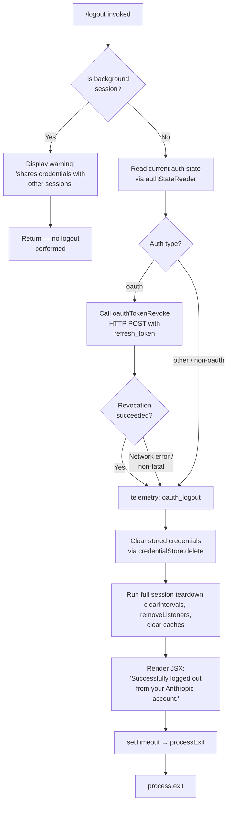

# `/logout`

> Analysis basis: CC v2.1.172 bundle.js (AST extraction + Claude interpretation)
> Minimum version: v2.1.172

---

## Overview

The `/logout` command signs the user out of their Anthropic account by revoking the active OAuth token, clearing stored credentials and session state, and then terminating the CLI process. It renders a JSX confirmation UI during the sign-out sequence and, in background sessions, emits an informational message instead of performing the logout.

---

## Registration

| Field | Value |
|---|---|
| type | `local-jsx` |
| name | `logout` |
| description | `Sign out from your Anthropic account` |
| module_id | `Co_` |
| load_inline | `true` |
| loc_byte | `11825114` |
| loc_byte_end | `11825398` |
| loc_line | `8077` |
| arbor_handler.name | `ssL` |
| arbor_handler.fqn | `claude-2.1.172::ssL` |
| arbor_handler.kind | `AsyncFunction` |
| arbor_handler.resolution_path | `module_id` |
| arbor_handler.n_hits | `0` |

Analysis basis: CC v2.1.172 bundle.js:+11825114

---

## Input Branching

Four distinct branches exist: background session guard, OAuth token revocation, non-OAuth auth cleanup, and process teardown. A Mermaid flowchart is used.



Analysis basis: CC v2.1.172 bundle.js:+8313902 (handler entry `ssL`), +8314010 (background guard), +8313683 (telemetry literal `oauth_logout`), +8314274 (setTimeout before exit)

---

## Behavioral Spec

### Background Session Guard

When the CLI is operating as a background/daemon session (process type `bg`, `daemon`, or `daemon-worker` — literals at bundle.js:+2269045), the handler detects this via a session-type check (`O9` / `sessionTypeReader`) before performing any logout work.

```
function handleLogout(context):
    sessionType = readSessionType()          // O9 → RDH
    if sessionType is background:
        display("This background session shares credentials "
                "with other sessions; /logout here has no effect. "
                "Run /logout from your main terminal to sign out.")
        return                               // early exit, no state change
    performLogout(context)
```

Analysis basis: CC v2.1.172 bundle.js:+8313902, +8314010, +8314012 (literal text of the guard message)

---

### Auth State Read and OAuth Token Revocation

The handler reads the current auth configuration (`authStateReader`, identifier `hf` / `dV1`). If the auth type is `"oauth"` (literal at bundle.js:+8314429), it attempts a server-side token revocation.

```
async function performLogout(context):
    authState = await readAuthState()        // hf → dV1

    if authState.type == "oauth":
        try:
            await revokeOAuthToken(authState.refresh_token)
                                             // rO_ → zA.post
                                             // body: { refresh_token, grant_type }
                                             // header: Content-Type: application/json
                                             // timeout: 5000 ms
        catch networkError:
            logDebug("oauth_token_revoke network error")
                                             // literal "network" at +2121382
        // non-fatal: proceed regardless

    recordTelemetry("oauth_logout")          // literal at +8313683
```

The revocation endpoint construction follows the same OAuth base-URL resolution as the login flow, supporting `prod`, `local`, `staging`, and custom-override environments (literals at bundle.js:+855445, +855719, +855806, +855896). The HTTP timeout for the revocation call is 5000 ms (literal at bundle.js:+2121248).

Analysis basis: CC v2.1.172 bundle.js:+8312897 (`rO_` call), +2121090 (`zA.post`), +2121150 (literal `refresh_token`), +2121258 (literal `oauth_token_revoke`)

---

### Credential Clearing

After revocation (or for non-OAuth auth), stored credentials are erased from both the secure keychain store and the plaintext fallback.

```
function clearCredentials():
    credentialStore.delete(primaryKey)       // kH → _.delete / H.delete
    // falls back to plaintext file removal if secure store unavailable
    // secure_storage_credentials_write telemetry path also cleared
```

Credential storage paths distinguish between `bedrock`, `foundry`, `anthropicAws`, `mantle`, `vertex`, and `firstParty` auth providers (literals at bundle.js:+2109332 – +2109549). The keychain service name used is `"claude-code-user"` (literal at bundle.js:+2132768).

Analysis basis: CC v2.1.172 bundle.js:+8313680 (`kH` call), +2297163 (`_.delete`), +2297375 (`H.delete`)

---

### Session Teardown

Full session teardown is performed via the `sessionCleanup` function (`lI6`), which orchestrates several sub-steps:

```
async function sessionCleanup():
    clearTimerRegistry()                     // bW8
    clearUnhandledRejections()               // unH
    clearSessionCache()                      // j78 → Q89.clear
    clearDaemonState()                       // gDH

    stopAllIntervals()                       // r_H → IrH
        clearInterval(...)                   // fZ_ → clearInterval
        process.removeListener(...)          // fZ_ → process.removeListener
        process.off("exit", ...)             // IrH → process.off
        rjH.clear(); V78.clear()             // various registry maps cleared
        V26.clear(); eE_.clear(); zF.clear()

    emitCleanupEvent()                       // r_H → NrH.emit

    unlinkSocketFiles()                      // UHq → $86.unlink
    removeLockFile()                         // pd_ → ICH.unlink
    clearTimeouts()                          // ud_ → clearTimeout
```

The lock file path is assembled via `Om1.join` / `A_` (bundle.js:+2515830). Socket file removal paths are assembled via `edA.join` / `A_` (bundle.js:+1182286).

Analysis basis: CC v2.1.172 bundle.js:+8313856 (`UHq`), +8313868 (`pd_`), +3291451 (`process.off`), +3291577 (map clears)

---

### Config Persistence and Process Exit

Before exiting, the config is persisted with a lock to avoid data loss (guard literal at bundle.js:+3312459: `"saveConfigWithLock: re-read config is missing auth…"`). The handler then renders the success JSX message and schedules exit.

```
async function finalizeAndExit():
    saveConfigWithLock()                     // E8 → F78 (with lock, backup, GH#3117 guard)
    mutateAppState(key, value)               // K.mutate at +8313020
    deleteSessionEntry()                     // K.delete at +8313194

    render JSX element:                      // Ro_.createElement at +8314186
        message = "Successfully logged out from your Anthropic account."
                                             // literal at +8314211
        type = "system"                      // literal at +8314164

    await setTimeout(delay)                  // +8314274; observed HTTP status 200 path
    exitProcess(0)                           // Ef → Z9 → sd_ → process.exit
```

The UI label `"Signing out…"` (literal at bundle.js:+8314365) is rendered by the `tsL` sub-component while the async operation is in flight. The `byH` sub-component records the command name `"logout"` and auth type `"oauth"` (literals at bundle.js:+8314398, +8314429) for the telemetry event.

Analysis basis: CC v2.1.172 bundle.js:+8313175 (`SH`), +8313227 (`E8`), +8314186 (`Ro_.createElement`), +8314211 (success literal), +8314274 (`setTimeout`), +7370712 (`process.exit`)

---

### Error Handling

CLI errors encountered during the credential-write or config-save phases invoke a red-coloured error printer (`lpH` → `W6.red`) and then write a `"cli_error"` record (literal at bundle.js:+13297991) before calling `process.exit` (bundle.js:+13298004).

```
function handleCliError(err):
    printRed(err.message)                    // lpH → W6.red
    writeErrorRecord("cli_error", ...)       // $X → nFH.writeFileSync
    process.exit(1)
```

Analysis basis: CC v2.1.172 bundle.js:+13297936 (`console.error`), +13297950 (`W6.red`), +13297981 (`lpH`), +13298004 (`process.exit`)

---

## State & Side Effects

| Item | Detail |
|---|---|
| Telemetry — `oauth_logout` | Emitted after token revocation attempt (literal at bundle.js:+8313683) |
| Telemetry — `tengu_feature_ok` | Emitted on successful secure-storage credential write path (bundle.js:+1016269) |
| Telemetry — `tengu_feature_sad` | Emitted on plaintext-fallback credential write (bundle.js:+1016417) |
| Telemetry — `tengu_feature_bad` | Emitted on credential write hard failure (bundle.js:+1016336) |
| Telemetry — `tengu_config_lock_contention` | Emitted if config lock is slow to acquire (bundle.js:+3312132) |
| Telemetry — `tengu_config_stale_write` | Emitted if a stale config write is detected (bundle.js:+3312268) |
| Telemetry — `tengu_config_auth_loss_prevented` | Emitted when GH#3117 auth-loss guard fires (bundle.js:+3312611) |
| Telemetry — `tengu_config_parse_error` | Emitted if config JSON cannot be parsed during re-read (bundle.js:+3314707) |
| Telemetry — `tengu_scroll_summary` | Emitted during terminal exit sequence (bundle.js:+7371881) |
| Telemetry — `tengu_cache_eviction_hint` | Emitted at session end (bundle.js:+7372824) |
| Telemetry — `tengu_startup_perf` | Startup profiling flushed on exit (bundle.js:+221519) |
| HTTP side effect | POST to OAuth revocation endpoint with `refresh_token`; timeout 5000 ms |
| Credential store | Auth credentials deleted from keychain (`claude-code-user` service) and/or plaintext fallback file |
| Config file | `~/.claude.json` rewritten with lock; up to 5 backup files retained (literal `5` at bundle.js:+3313062) in `backups/` subdirectory (literal at bundle.js:+3313644); backup rotation uses 60 000 ms lock timeout (bundle.js:+3312813) |
| Socket / lock files | IPC socket file and process lock file deleted |
| Process listeners | `exit` and `beforeExit` listeners removed; all intervals cleared |
| Event maps | `rjH`, `V78`, `V26`, `eE_`, `zF` maps cleared |
| appState changes | Active session entry deleted (`K.delete`); app-state key mutated (`K.mutate`) |
| JSX UI | Renders `"Signing out…"` spinner then `"Successfully logged out…"` system message |
| Process exit | `process.exit` called after `setTimeout` delay; SIGKILL escalation path available (literal at bundle.js:+7370762) |
| Background session | No state change; warning message displayed only |

---

## Version History

| Version | Change |
|---|---|
| v2.1.172 | Initial analysis |

---

## Common Mistakes

1. **Running `/logout` in a background or daemon session** — the command detects process types `bg`, `daemon`, and `daemon-worker` and refuses to log out, printing an advisory message. You must run `/logout` from the primary interactive terminal.
2. **Expecting the token to be locally invalidated without network access** — the OAuth revocation step is a network call (POST, 5 s timeout). If the network is unavailable the local credentials are still cleared, but the refresh token is not server-revoked. This is intentional (non-fatal) but should be noted in restricted-network environments.
3. **Assuming re-authentication is possible in the same process** — `/logout` calls `process.exit`, so the CLI terminates. A fresh invocation of Claude Code is required to log in again.
4. **Ignoring the GH#3117 auth-loss guard** — if another process modifies `~/.claude.json` concurrently and the re-read copy is missing auth data that the in-memory cache has, the config write is refused and `tengu_config_auth_loss_prevented` is emitted. The credentials are not wiped in this edge case.
5. **Confusing `/logout` with API-key-based auth** — the command specifically targets OAuth (`oauth` auth type). Non-OAuth auth providers (Bedrock, Vertex, Foundry, etc.) skip the token revocation HTTP call but still clear the stored credential entry.

---

## Appendix — Identifier Mapping

> For bundle debugging only. Identifiers change across versions.

| Identifier | Role |
|---|---|
| `ssL` | Main async handler for `/logout` (Arbor-resolved, `AsyncFunction`) |
| `r_6` | Core logout orchestrator called by `ssL` |
| `tsL` | "Signing out…" JSX sub-component / spinner renderer |
| `byH` | Telemetry recorder for logout event name and auth type |
| `lI6` | Session teardown coordinator |
| `O9` | Session type reader (detects background/daemon) |
| `RDH` | Session type resolver called by `O9` |
| `hf` | Auth state reader entry point |
| `dV1` | Auth state storage accessor |
| `eNH` | Storage read helper (async path) |
| `qw4` | Async storage store accessor with AsyncLocalStorage |
| `rO_` | OAuth token revocation HTTP caller |
| `S1` | OAuth endpoint URL builder |
| `jbA` | OAuth base URL resolver |
| `QJf` | OAuth environment classifier |
| `kH` | Credential delete dispatcher (primary path) |
| `c` | Secure storage credential operation helper |
| `A6` | Secure storage async wrapper |
| `s6` | Plaintext fallback credential write/delete helper |
| `bH` | Credential delete via fallback path |
| `E8` | Config save-with-lock entry point |
| `F78` | File-locked config writer with backup rotation |
| `W7H` | Config file reader used during lock-guarded re-read |
| `B78` | Global config save fallback with GH#3117 guard |
| `Sz6` | Atomic file write helper (temp + rename) |
| `XZ_` | Backup directory path builder |
| `brH` | Config serialiser / JSON formatter |
| `mV1` | Storage context builder |
| `r_H` | Process-listener teardown coordinator |
| `IrH` | Interval and listener bulk-clear function |
| `fZ_` | Per-interval clear + `process.removeListener` |
| `Ym` | Pre-exit event emitter helper |
| `eu` | Exit notification broadcaster |
| `SH` | Log queue flusher / essential-traffic drain |
| `JA` | Log entry formatter |
| `f6` | String coercion utility |
| `Rq` | Essential-traffic queue manager |
| `fRf` | Queue rotation (shift + push) |
| `UHq` | IPC socket file unlink coordinator |
| `gHq` | Socket path resolver |
| `Ic_` | Socket file existence check |
| `HcA` | Socket stat helper |
| `J4H` | Path join utility (used by socket and lock path builders) |
| `ja6` | Socket file path builder (`edA.join` / `A_`) |
| `pd_` | Lock file removal coordinator |
| `ud_` | Lock file timeout cleanup |
| `Ud_` | Lock descriptor holder |
| `hLH` | Lock state checker (`A.some` / `_.includes`) |
| `iDH` | Lock file path builder (`Om1.join` / `A_`) |
| `c_` | Auth provider classifier (bedrock/foundry/vertex etc.) |
| `So` | App state snapshot accessor |
| `cE_` | Config accessor / path resolver entry |
| `H_9` | Config directory path builder |
| `OX1` | Config file path hasher (sha256, NFC normalisation) |
| `vI` | Path normaliser + hash builder |
| `Q2` | Config path validator |
| `nv` | OS user-info reader (`k_8.userInfo`) |
| `EH` | String coercion utility (used in path/error formatting) |
| `N8` | Error code extractor |
| `N` | HTTP/network error classifier |
| `g8f` | HTTP error category builder |
| `kZA` | HTTP error code deduplicator (`deK` / `ceK`) |
| `CH` | JSON stringifier wrapper |
| `lf` | Request URL redactor (`[REDACTED]` literal) |
| `MNA` | URL segment mapper |
| `rFH` | stdout/stderr writer wrapper |
| `ovA` | Raw `H.write` output helper |
| `l8f` | Log file writer with rotation |
| `TFH` | Batched log flush scheduler (setTimeout / setImmediate) |
| `BfH` | Log file path builder (`i6H.join` / `A_` / `y6`) |
| `o6` | fs existence / access check helper |
| `A36` | EISDIR error guard |
| `zNA` | Log rotation path builder |
| `ms8` | Log file rename/rotate helper (`Ny.rename` / `Ny.unlink`) |
| `c8f` | Log file append worker (`Ny.appendFile`) |
| `y9` | hZA drain/register hook |
| `T18` | Config path transform helper |
| `K` | App state map (`.mutate`, `.delete`, `.split`) |
| `sZH` | Session-end state updater |
| `Ef` | Terminal exit sequence orchestrator |
| `Z9` | Full terminal teardown (unmount, drain, race, exit) |
| `xCH` | Terminal unmount helper (`H.unmount`) |
| `Db` | Terminal display cleanup |
| `E38` | Raw terminal write + cursor restore (`\x1b7`/`\x1b8`) |
| `ad_` | Exit message renderer (`lMH.writeSync`, `W6.dim`) |
| `Y0` | Terminal dimensions accessor |
| `Ou` | Cursor position helper |
| `UN6` | Working-directory stat helper |
| `X$` | Path display formatter |
| `Ce9` | Exit message formatter |
| `sd_` | Forced exit helper (`process.exit` / `process.kill SIGKILL`) |
| `EFH` | hZA drain-on-exit helper |
| `w` | MCP supervisor render-loop manager |
| `ZEH` | MCP supervisor state serialiser |
| `iDK` | MCP column-width calculator |
| `T` | MCP server entry (`uV6` / `V76`) |
| `DrK` | MCP heartbeat manager (`a_H`) |
| `de9` | Shutdown allSettled barrier |
| `G36` | Startup profiling flush |
| `rs8` | Profiling event writer |
| `vNA` | Profiling report formatter (JSON.stringify) |
| `gW8` | Scroll-summary telemetry emitter |
| `Re9` | Scroll-summary data collector |
| `Se9` | Scroll timing calculator (Math.max / Math.round) |
| `v1` | Agent session capability detector |
| `I56` | Cache-eviction hint emitter |
| `$6` | Module ID resolver (`_56`) |
| `_56` | Base module registry lookup |
| `mCH` | Promise-wrapped render helper |
| `BW8` | Render-frame scheduler |
| `$1` | CLI error writer (calls `lpH`, `$X`, `process.exit`) |
| `lpH` | Red error printer (`W6.red` + `console.error`) |
| `$X` | Error record file writer (`nFH.writeFileSync`) |
| `j78` | Session cache clear (`Q89.clear`) |
| `bW8` | Timer registry clear |
| `unH` | Unhandled-rejection handler clear |
| `gDH` | Daemon state clear |
| `M` | MCP server map emit coordinator |
| `yRH` | MCP server connection dispatcher |
| `Ln8` | MCP connection result applier |
| `nWA` | MCP server list updater |
| `mf` | OTEL metrics emit helper |
| `CyH` | OTEL attribute builder |
| `QB` | OTEL session ID generator |
| `oO8` | OTEL resource attribute map builder |
| `KG6` | OTEL attribute key formatter |
| `j8H` | OTEL attribute presence checker (`Dkf.has`) |
| `e4` | OTEL event emitter (`Uw` / `b6`) |
| `AD9` | OTEL exporter pair (`He4` / `et4`) |
| `fM6` | OTEL metric flush helper |
| `Ur8` | OTEL sequence counter |
| `Br8` | OTEL batch accumulator |
| `byH` | Logout telemetry sub-component (event name + auth type recorder) |
| `KJ` | EH-based string formatter used in telemetry |
| `y6` | BG colour/format helper (`BG`) |
| `HJH` | Config file header writer |
| `y_9` | Object.entries config iterator |
| `b26` | Date.now timestamp helper |
| `P` | Binary stream chunker (Buffer.concat / indexOf) |
| `E` | Slice range clamp (Math.max / Math.min) |
| `V` | Stream start helper |

---

Note: index built via Arbor fallback; some signals (telemetry, literals) may be missing — see arbor-fallback.js.