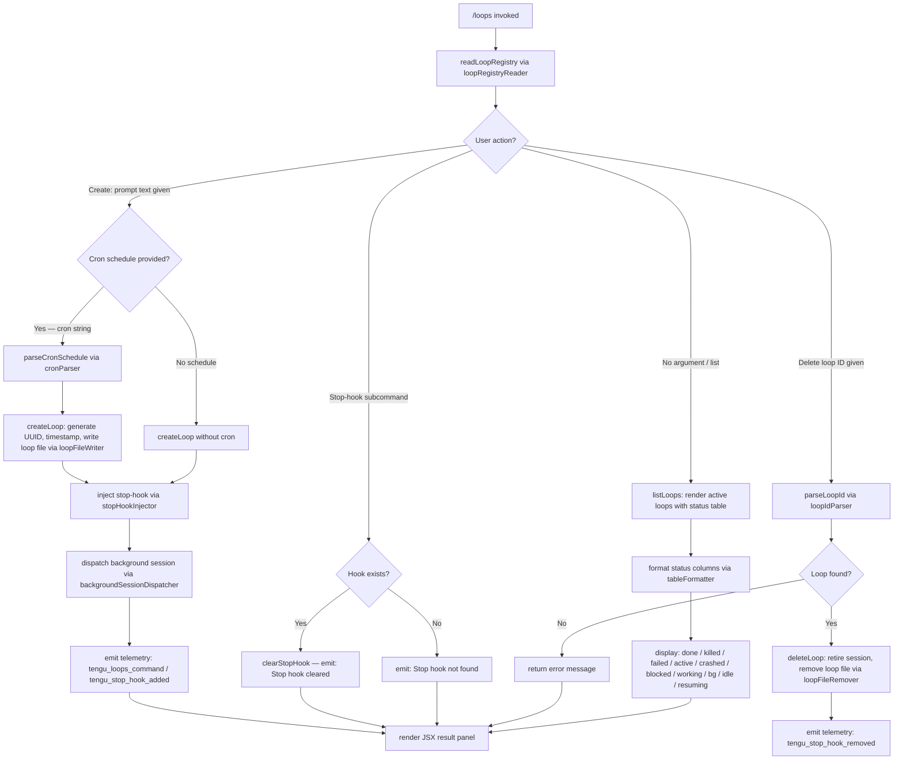

# `/loops`

> Analysis basis: CC v2.1.172 bundle.js (AST extraction + Claude interpretation)
> Minimum version: v2.1.172

---

## Overview

The `/loops` command provides a management interface for Claude Code's background loop sessions — persistent, scheduled, or recurring agent tasks that run independently of the foreground session. It supports listing active loops with their status, creating new loops with a prompt and optional cron schedule, and deleting existing loops. The command is implemented as an async JSX handler (`Dc7`) that renders an interactive terminal UI component.

---

## Registration

| Field | Value |
|---|---|
| type | `local-jsx` |
| name | `loops` |
| description | `List, create, and delete loops` |
| loc_byte | `12724724` |
| loc_byte_end | `12724881` |
| loc_line | `8999` |
| immediate | `true` |
| module_id | `m5K` |
| load_inline | `true` |
| arbor_handler.name | `Dc7` |
| arbor_handler.fqn | `claude-2.1.172::Dc7` |
| arbor_handler.kind | `AsyncFunction` |
| arbor_handler.resolution_path | `module_id` |
| arbor_handler.n_hits | `0` |

Analysis basis: CC v2.1.172 bundle.js:+12724724

---

## Input Branching

The handler distinguishes at least four operational paths (list, create with cron, create without cron, delete), plus sub-paths for stop-hook management and error cases — totalling more than three distinct branches. A Mermaid flowchart is used.



Analysis basis: CC v2.1.172 bundle.js:+12723679 (handler entry), +12723810 (loop-ID parser), +12723966 (loop registry read), +12724105 (stop-hook path), +12724329 (create path), +12724417 (delete/dispatch path)

---

## Behavioral Spec

### 1. Handler Entry — `loopsCommandHandler` (`Dc7`)

```
async function loopsCommandHandler(context):
    emit telemetry("tengu_loops_command")          // loc +12723681
    loopList = await readLoopRegistry(context)     // W1H → MSH
    appState = context.getAppState()
    actionResult = await dispatchAction(context, loopList, appState)
    return renderJsxPanel(actionResult)            // o$A.createElement
```

Analysis basis: CC v2.1.172 bundle.js:+12723679, +12723731, +12724484

---

### 2. Loop Registry Reader — `loopRegistryReader` (`W1H` → `MSH`)

```
async function readLoopRegistry(context):
    basePath = joinPath(configRoot, ".claude")     // b5H + nw8.join
    raw = await fs.readFile(basePath, "utf-8")     // encoding: "utf-8" loc +4848640
    if raw is not parseable:
        handleFileError(raw)                       // SH — logs error, pushes to queue
    entries = parseEntries(raw)                    // $k
    if not Array.isArray(entries):
        entries = []
    return entries
```

File-system errors recognised: `ENOENT`, `EACCES`, `EPERM`, `ENOTDIR`, `ELOOP`, `EROFS`
(bundle.js:+179798 – +179867). Encoding is always `"utf-8"` (bundle.js:+4848640).

Analysis basis: CC v2.1.172 bundle.js:+4850601, +4848593, +4848612

---

### 3. Loop ID Parser — `loopIdParser` (`hN`)

```
function parseLoopId(inputString):
    trimmed = inputString.trim()
    match = trimmed.match(numericPattern)
    if match:
        id = parseInt(match, 10)
        // handles "Every minute" (loc +4846504) and "Every hour" (loc +4846721)
        // special labels map to minute/hour cron strings
    scheduled = match schedule pattern ("1-5" range, loc +4847428)
    day = date.getUTCDay()
    date.setUTCDate(...)                           // UTC date arithmetic
    date.setUTCHours(23, 59, 31, 0)               // loc +4847311; +12723517; +12723570
    return { id, cronDescriptor, nextFireTime }
```

Numeric literals used in schedule computation: `59` (bundle.js:+12723446), `23` (bundle.js:+12723517), `31` (bundle.js:+12723570). Math helpers: `Math.max`, `Math.ceil`, `Math.round` (bundle.js:+12723389–12723473).

Analysis basis: CC v2.1.172 bundle.js:+12723810, +4846384, +4846525, +4846560

---

### 4. Cron Schedule Parser — `cronParser` (`Yc7`)

```
function parseCronExpression(cronString):
    parts = cronString.match(cronPattern)
    minute = parseInt(parts[0])
    if minute > 59: minute = 59                   // loc +12723446
    hour   = parseInt(parts[1])
    if hour  > 23: hour = 23                      // loc +12723517
    day    = parseInt(parts[2])
    if day   > 31: day  = 31                      // loc +12723570
    nextRun = Math.max(now, computeNextFire(...))
    result  = Math.ceil(nextRun)
    rounded = Math.round(result)
    // also calls $k (tokeniser) for cron token splitting
    return { minute, hour, day, rounded }
```

The literal `"cron"` (bundle.js:+12723777) labels the schedule type stored on the loop object.

Analysis basis: CC v2.1.172 bundle.js:+12724231, +12723267–12723637

---

### 5. Loop Creator — `loopCreator` (`gsH`)

```
async function createLoop(context, promptText, cronExpr):
    uuid     = MW9.randomUUID()                    // loc +4849940
    created  = Date.now()                          // loc +4850002
    loopDir  = joinPath(configRoot, ".claude")     // literal ".claude" loc +4849781
    await fs.mkdir(loopDir, { recursive: true })   // lw8.mkdir loc +4849760
    loopData = buildLoopRecord(uuid, created, promptText, cronExpr)
    await fs.writeFile(loopPath, serialize(loopData))  // lw8.writeFile loc +4849857
    loopList = await readLoopRegistry(context)     // gsH → MSH re-read loc +4850092
    loopList.push(newEntry)                        // M.push loc +4850105
    await activateBackground(context, loopData)    // y6, pa, FsH
    return loopData
```

The UUID prefix uses 8 random characters from `MW9.randomUUID()` (bundle.js:+4849940).

Analysis basis: CC v2.1.172 bundle.js:+12724329, +4849940, +4850002, +4850048, +4850092

---

### 6. Loop File Writer — `loopFileWriter` (`FsH`)

```
async function writeLoopFile(context, loopRecord):
    root = configRoot()                            // vf
    dir  = joinPath(root, ".claude")               // nw8.join loc +4849770
    await fs.mkdir(dir, { recursive: true })
    files = loopRecord.entries.map(buildFileEntry) // H.map loc +4849821
    await fs.writeFile(targetPath, serialize(files))  // lw8.writeFile loc +4849857
    summary = readLoopRegistry(context)            // b5H re-invoke
    compressed = compressState(summary)            // CH loc +4849878
    return compressed
```

Analysis basis: CC v2.1.172 bundle.js:+16260015, +4849749–4849878

---

### 7. Loop Deletion — `loopDeleter` (`l0A` via `D`)

```
async function deleteLoop(context, loopId):
    session = sessionMap.get(loopId)              // A.get loc +16759807
    if session:
        session.kill("SIGKILL")                   // literal loc +16759973
    await retireSession(session)                  // Q.retireIfSettled loc +16760658
    await removeLoopFile(loopId)                  // Vw.rm loc +16766161
    await unlinkSocketFile(loopId)                // Vw.unlink loc +16767212
    emit telemetry("tengu_stop_hook_removed")     // loc +10542927
    return { status: "done" }                     // literal "done" loc +16766071
```

Session termination uses a SIGKILL signal (bundle.js:+16759973). The delete path also reaches `SH` (log-error helper) and `Tq` (file-stat helper) for state reconciliation.

Session status values tracked: `"done"` (+16766071), `"killed"` (+16766089), `"failed"` (+16766108), `"active"` (+4233227), `"crashed"` (+16766255), `"blocked"` (+16766309), `"working"` (+16766416), `"bg"` (+16766580), `"idle"` (+16767020), `"resuming"` (+16767905).

Analysis basis: CC v2.1.172 bundle.js:+16759807, +16759966, +16760658, +16766161, +16767212

---

### 8. Stop-Hook Management — `stopHookInjector` / `stopHookClearer` (`HK6` / `eq6`)

```
// Inject stop-hook when a new loop is created
function injectStopHook(context, loopId):
    state = context.getAppState()                 // H.getAppState loc +10542672
    hookPayload = buildHookPayload(loopId)        // DUq → zUq.randomUUID loc +10543021
    context.setAppState(newState)                 // H.setAppState loc +10542801
    context.applyMessageOp("append", hookPayload) // H.applyMessageOp loc +10542870
    goal = { type: "goal", status: "goal_status" }// literals loc +10542961/10543090
    emit telemetry("tengu_stop_hook_added")       // loc +10542555
    return { type: "attachment", id: uuid }       // literal loc +10543003

// Clear stop-hook when explicitly requested
async function clearStopHook(context, loopId):
    trust = checkTrustGate(context)               // "trust_gate" loc +10542119
    hooksOk = checkHooksGate(context)             // "hooks_gate" loc +10542065
    if not found:
        return message("Stop hook not found")     // literal loc +12724123
    context.setAppState(removedState)             // _.setAppState loc +10542456
    context.applyMessageOp(...)                   // _.applyMessageOp loc +10542498
    emit telemetry("tengu_stop_hook_removed")
    return message("Stop hook cleared")           // literal loc +12724145
```

Stop-hook subcommand literal: `"stophook"` (bundle.js:+12723863). The message type used is `"system"` (bundle.js:+12724012).

Analysis basis: CC v2.1.172 bundle.js:+10542661, +10542801, +10542870, +10542927, +10542555, +12724105, +12724123, +12724145

---

### 9. Background Session Dispatcher — `backgroundSessionDispatcher` (`eq6` → `b9A` / `C7`)

```
async function dispatchBackgroundSession(context, loopRecord):
    policySettings = loadPolicySettings()         // $b → x8 literal "policySettings" loc +3340966
    hooksGate = checkHooksGate()                  // "hooks_gate" loc +10542065
    trustGate = checkTrustGate()                  // "trust_gate" loc +10542119
    goalStatus = resolveGoalStatus()              // "goal_set" loc +10542197
    sessionArgs = buildSessionArgs(loopRecord)    // C7 → jx4
    timestamp = Date.now()
    outputTokenState = readOutputTokens()         // "outputTokens" loc +46056
    context.setAppState(updatedState)             // _.setAppState loc +10542456
    context.applyMessageOp("append", ...)         // literal loc +10542893
    uuid = DUq()                                  // zUq.randomUUID loc +10543021
    emit telemetry("tengu_stop_hook_added")
    return { sessionId: uuid, status: "skip" }    // literal "skip" loc +12724590
```

Analysis basis: CC v2.1.172 bundle.js:+12724417, +10542169, +10542250, +10542418–10542606

---

### 10. Table Formatter — `tableFormatter` (`MgK`)

```
function formatLoopTable(loopList):
    rows = loopList.map(entry => formatRow(entry, parseLoopId))  // hN loc +16263678
    maxWidth = Math.max(...rows.map(r => r.length))              // loc +16263787
    paddedRows = rows.map(r => r.padEnd(maxWidth, "  "))         // literal "  " loc +16784817
    return rows.join("\n")                                       // q.join loc +16263893

// Column width cap
MAX_COL_WIDTH = 40                               // loc +16786788
```

Analysis basis: CC v2.1.172 bundle.js:+16263656, +16263787, +16263893, +16784817

---

### 11. Scheduled Task Lifecycle (background loop tick — `l`)

```
function onScheduledTaskFire(loopEntry):
    if ZX5.isLoopDefaultSentinel(loopEntry):     // loc +16261081
        return
    elapsed = Math.floor(Date.now() / 1000)      // loc +16261190; divisor 60 loc +16261222
    if loopEntry.runAt <= elapsed:
        emit telemetry("tengu_scheduled_task_fire")   // loc +16260992
        dispatchIteration(loopEntry)
        if loopEntry.recurring:
            label += " (recurring)"              // literal loc +16260969
        else:
            emit telemetry("tengu_scheduled_task_expired")  // loc +16261335
    else:
        emit telemetry("tengu_scheduled_task_missed")  // loc +16260241
    if missed_scheduled_task:
        mark status "never"                      // literal loc +16260867
```

Recurrence interval granularity: 60 seconds (bundle.js:+16261222).

Analysis basis: CC v2.1.172 bundle.js:+16260622–16261643

---

## State & Side Effects

| Item | Detail |
|---|---|
| Telemetry — primary | `tengu_loops_command` (bundle.js:+12723681) — fired on every `/loops` invocation |
| Telemetry — stop hook added | `tengu_stop_hook_added` (bundle.js:+10542555) — fired when a loop is created and a stop-hook is injected |
| Telemetry — stop hook removed | `tengu_stop_hook_removed` (bundle.js:+10542927) — fired when a loop is deleted or its hook cleared |
| Telemetry — task fire | `tengu_scheduled_task_fire` (bundle.js:+16260992) — fired each time a scheduled loop iteration executes |
| Telemetry — task missed | `tengu_scheduled_task_missed` (bundle.js:+16260241) — fired when a scheduled fire time is missed |
| Telemetry — task expired | `tengu_scheduled_task_expired` (bundle.js:+16261335) — fired when a non-recurring loop's single run completes |
| Telemetry — bg session create | `tengu_bg_dispatch_sigkill_escalate` (bundle.js:+16759925) — SIGKILL escalation during loop kill |
| Telemetry — daemon control | `tengu_daemon_control` (bundle.js:+16796987), `tengu_daemon_config_reload` (bundle.js:+16775429) |
| Telemetry — bg spare | `tengu_bg_spare_enable` (bundle.js:+16761230), `tengu_bg_spare_claim` (bundle.js:+16761358), `tengu_bg_spare_claim_fail` (bundle.js:+16761624) |
| Telemetry — bg errors | `tengu_bg_sendclaim_failed` (bundle.js:+16738818), `tengu_bg_dispatch_low_mem` (bundle.js:+16760526), `tengu_bg_low_mem_mb` (bundle.js:+13266653) |
| Telemetry — feature gates | `tengu_feature_ok` (bundle.js:+1016269), `tengu_feature_bad` (bundle.js:+1016336), `tengu_feature_sad` (bundle.js:+1016417) |
| Telemetry — MCP | `tengu_mcp_skills` (bundle.js:+6607177) |
| Hook registration | Stop-hooks are appended to `appState` via `applyMessageOp("append", ...)` (bundle.js:+10542870). Cleared via `setAppState` + `applyMessageOp` on delete. |
| appState changes | `getAppState` / `setAppState` called in both create (`HK6`) and delete (`eq6`) paths; `rosterEntry` updated during deletion (bundle.js:+16767433) |
| File system | Loop files written under `.claude/` directory (bundle.js:+4849781); `mkdir` with `recursive: true`, `writeFile`, `rm`, `unlink` all invoked |
| Process signals | SIGKILL used for immediate loop termination (bundle.js:+16759973); SIGTERM used at daemon level (bundle.js:+16739056) |
| Session idle timeout | 300,000 ms (5 minutes) idle timeout for background sessions (bundle.js:+16767691) |
| Background session claim timeout | 5,000 ms (bundle.js:+16739252) |
| MCP client logging | Debug events via `Ya.logMCPDebug`; errors via `Ya.logMCPError` |
| Sound | <!-- TODO: not found in depth-2 traversal; needs --depth 4 --> |

---

## Version History

| Version | Change |
|---|---|
| v2.1.172 | Initial analysis |

---

## Common Mistakes

1. **Providing a malformed cron string**: The cron parser (`Yc7`) clamps values silently — minutes are capped at 59, hours at 23, days at 31 (bundle.js:+12723446, +12723517, +12723570). An out-of-range value will not produce an error but will be silently clamped, which may cause unexpected schedule behaviour.
2. **Expecting instant deletion**: Deleting a loop sends SIGKILL (bundle.js:+16759973) but the session retirement (`Q.retireIfSettled`) and file removal are async. The loop may briefly remain in the registry while cleanup completes.
3. **Confusing `/loops` with `/background`**: The `immediate: true` flag (registration) means the JSX panel is rendered immediately, but the actual background agent runs in a separate daemon process. The UI reflects cached state from the registry file, not live process state.
4. **Attempting to clear a stop-hook that was never set**: The command returns `"Stop hook not found"` (bundle.js:+12724123) as a non-fatal informational message, not an error — scripts that check exit codes may not detect this case.
5. **Assuming session status is always current**: Status values (`done`, `killed`, `failed`, `active`, `crashed`, `blocked`, `working`, `bg`, `idle`, `resuming`) are read from the persisted registry file; there is a reconciliation step via `Tq` (file-stat helper) but transient states may lag actual process state.

---

## Appendix — Identifier Mapping

> For bundle debugging only. Identifiers change across versions.

| Identifier | Role |
|---|---|
| `Dc7` | Main handler — `loopsCommandHandler` (AsyncFunction, entry point) |
| `W1H` | Loop registry orchestrator — calls file reader and entry parser |
| `MSH` | Loop registry file reader — reads `.claude` config file |
| `o6` | Config root resolver |
| `b5H` | Config path builder — joins root with `.claude` subpath |
| `vf` | Config root getter |
| `T9` | File-error classifier — maps errno codes to known error types |
| `N8` | Known filesystem error code set |
| `SH` | Error log handler — pushes to error queue, calls `Ya.logError` |
| `JA` | Error object formatter |
| `f6` | String coercion helper |
| `Rq` | Essential-traffic queue manager |
| `fRf` | Queue shift/push cycle helper |
| `N` | Message normaliser / content builder |
| `g8f` | Content token builder |
| `CH` | JSON serialiser wrapper |
| `lf` | Content redaction / truncation helper |
| `rFH` | Output token rate observer |
| `l8f` | Large-file content processor |
| `$k` | Loop entry tokeniser / trimmer |
| `I9L` | Cron token splitter and range expander |
| `A` | Lowercase token transformer |
| `OE` | Background renderer helper |
| `BG` | JSX base component |
| `tq6` | "Stop" action builder — creates stop button payload |
| `i0H` | Column width setter |
| `K` | Map / padEnd utilities (context-dependent) |
| `ZGq` | Row mapper for table display |
| `y6` | UI helper / rendering primitive |
| `hN` | Loop ID and schedule parser — `loopIdParser` |
| `D` | Background session controller / process manager |
| `b` | Daemon process runner |
| `w` | Supervisor write/config-reload helper |
| `pa` | OS-layer helper |
| `FsH` | Loop file writer — `loopFileWriter` |
| `wW9` | Loop list filter helper |
| `P` | PTY buffer/stream handler |
| `z` | Daemon stop helpers |
| `S` | Session spawn helper |
| `X` | Session map / setTimeout handler |
| `d` | Session record builder |
| `MgK` | Table formatter — `tableFormatter` |
| `P1H` | Loop registry re-reader + filter |
| `d8` | Timeout/abort session helper |
| `O` | Memory monitor |
| `bH` | Feature-bad telemetry emitter |
| `A6` | Feature flag helper |
| `kH` | Feature-ok telemetry emitter |
| `hF8` | Low-memory detector (macOS) |
| `Y6` | Notification / pin file dispatcher |
| `l06` | Pins JSON reader |
| `gk_` | Pins path builder |
| `n6` | JSON.parse wrapper |
| `R8` | Timestamp normaliser |
| `Vt4` | Directory walker for loop pin files |
| `Q` | Session retire / PTY lifecycle manager |
| `l` | Scheduled task fire dispatcher |
| `C` | Timeout-clear / write helper |
| `B` | Active-session set |
| `hZ` | Path helper for daemon socket (Windows-aware) |
| `Lv` | Binary frame encoder |
| `tx8` | Binary frame decoder |
| `B0A` | Background session claimer / connector |
| `KjA` | Daemon directory + state-file writer |
| `N05` | Claim retry / timeout manager |
| `v05` | Claim frame builder |
| `a7` | Error code normaliser |
| `EH` | String-coerce error helper |
| `l0A` | Full loop deletion handler — `loopDeleter` |
| `Hf` | Loop path resolver |
| `Tq` | File-stat based state reconciler |
| `YO` | Active-status detector |
| `wXH` | Roster entry builder / filter |
| `m7` | Message path joiner |
| `Mf6` | Async cleanup awaiter |
| `xx6` | Socket path builder (delete) |
| `U$H` | Socket path builder (read) |
| `RQ` | Socket path builder (connect) |
| `bx6` | Socket path joiner |
| `Y` | Forced-shutdown helper |
| `HX` | Exit sequence initiator |
| `j` | Session kill iterator |
| `$` | TwK dispatcher container |
| `TwK` | Daemon status file writer |
| `d9` | AsyncLocalStorage store reader |
| `km6` | Daemon status path builder |
| `J` | Loop date calculator (UTC) |
| `HK6` | Stop-hook injector — `stopHookInjector` |
| `DUq` | UUID generator wrapper |
| `$6` | Internal flag helper (`_56`) |
| `_56` | Low-level flag constant |
| `Yc7` | Cron expression parser — `cronParser` |
| `gsH` | Loop creator — `loopCreator` |
| `eZH` | Loop record builder |
| `M` | MCP client manager |
| `yRH` | MCP connection orchestrator |
| `qi` | MCP slot config reader |
| `QV` | MCP server type handler |
| `g8` | MCP result merger |
| `uV6` | MCP filter utility |
| `Jc9` | MCP connection attempt handler |
| `Jj8` | MCP debug log helper |
| `Yj8` | MCP heartbeat helper |
| `j8` | MCP debug push helper |
| `sJ8` | OAuth authenticate tool handler |
| `tJ8` | OAuth callback tool handler |
| `Vc9` | MCP connection result applier |
| `XU_` | MCP error push helper |
| `pN` | MCP skills telemetry emitter |
| `qU_` | MCP capability inclusion checker |
| `k` | Warning banner builder |
| `OL` | MCP error log helper |
| `Gc9` | MCP fast-fail checker |
| `ZH6` | MCP integer parser (slot) |
| `sX8` | MCP integer parser (variant) |
| `Ln8` | MCP apply-connection-result handler |
| `kRH` | MCP Y2H update helper |
| `r0` | MCP cleanup runner |
| `nWA` | MCP full reconnect orchestrator |
| `mJ8` | MCP capability gate checker |
| `TH6` | MCP Y2H state reader |
| `eq6` | Stop-hook clearer / background session dispatcher — `clearStopHook` |
| `b9A` | Policy + trust gate loader |
| `$b` | Policy settings resolver |
| `x8` | Policy settings reader |
| `KAH` | Policy settings constructor |
| `b_` | Background session args builder |
| `C7` | Session argument assembler |
| `jx4` | Argument resolver / path normaliser |
| `s6` | Feature-sad telemetry emitter |
| `eY` | Output token state reader |

---

Note: index built via Arbor fallback; some signals (telemetry, literals) may be missing — see arbor-fallback.js.