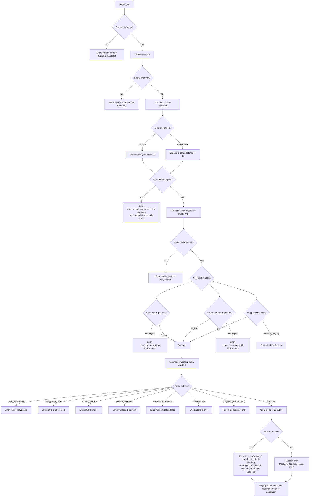

# `/model`

> Analysis basis: CC v2.1.172 bundle.js (AST extraction + Claude interpretation)
> Minimum version: v2.1.172

---

## Overview

The `/model` command allows users to set or switch the AI model used by Claude Code for the current session or as a persistent default. It accepts a model identifier (alias or full model string), validates it against the user's account capabilities and organization policy, optionally performs a live probe request, and then updates the in-memory application state and optionally persists the choice to user settings.

---

## Registration

| Field | Value |
|---|---|
| type | `local` |
| name | `model` |
| description | `Set the AI model for Claude Code` |
| argumentHint | `<model>` |
| supportsNonInteractive | `true` |
| module_id | `xOK` |
| load_inline | `true` |
| loc_byte | `12942200` |
| loc_byte_end | `12942374` |
| loc_line | `9147` |
| arbor_handler.name | `Ei7` |
| arbor_handler.fqn | `claude-2.1.172::Ei7` |
| arbor_handler.kind | `AsyncFunction` |
| arbor_handler.resolution_path | `module_id` |
| arbor_handler.n_hits | `0` |

Analysis basis: CC v2.1.172 bundle.js:+12942200

---

## Input Branching

The command has more than three distinct execution paths depending on the presence and content of the argument, alias expansion, account-tier gating, policy enforcement, and whether a live probe is needed.



---

## Behavioral Spec

### 1. Handler Entry — `modelCommandHandler` (`Ei7`)

Analysis basis: CC v2.1.172 bundle.js:+12911252

```
async function modelCommandHandler(input, context):
    rawArg = input.trim()                          // +12911252

    if rawArg is in inlineModelList(QQH):          // +12911268
        emitTelemetry("tengu_model_command_inline") // +12911410
        applyModelInline(context, rawArg)           // +12911408
        return

    appState = context.getAppState()               // +12911291
    result = await buildModelSwitchPayload(JB8, rawArg, appState) // +12911335

    if rawArg is in interactiveOnlyList(W8H):      // +12911355
        // non-interactive guard
        return error

    sessionIdHash = computeSessionHash(Y3, rawArg) // +12911450
    await presentModelSwitchResult(c$K, result, context) // +12911505
```

### 2. Argument Parsing & Alias Expansion — `modelInputParser` (`Q9`)

Analysis basis: CC v2.1.172 bundle.js:+2259321

The parser normalizes model input through a sequence of transformations:

```
function modelInputParser(raw):
    s = raw.trim().toLowerCase()           // +2259321, +2259332

    // Alias table (resolved from literals):
    aliases = {
        "sonnet"   -> canonical_sonnet,    // +2259503
        "haiku"    -> canonical_haiku,     // +2259542
        "opus"     -> canonical_opus,      // +2259581
        "best"     -> canonical_best,      // +2259616
        "fable"    -> canonical_fable,     // +2259398
        "opusplan" -> "Opus in plan mode", // +2257855
        "[1m]"     -> extended_context,    // +2259447
    }

    expanded = applyAliasTable(s, aliases)
    expanded = applyProviderNormalization(expanded) // NY, HW, tc, fLH
    expanded = applyModelIdFormatting(expanded)     // aZ1, kE, kDH, rD6, Zj
    return expanded
```

Canonical model IDs recognized in the bundle (from literals):

| Alias / Short name | Full Model ID |
|---|---|
| Fable 5 | `claude-fable-5` |
| Mythos 5 | `claude-mythos-5` |
| Opus 4.8 | `claude-opus-4-8` |
| Opus 4.7 | `claude-opus-4-7` |
| Opus 4.6 | `claude-opus-4-6` |
| Opus 4.5 | `claude-opus-4-5` |
| Opus 4.1 | `claude-opus-4-1` |
| Opus 4 | `claude-opus-4-0` |
| Sonnet 4.6 | `claude-sonnet-4-6` |
| Sonnet 4.5 | `claude-sonnet-4-5` |
| Sonnet 4 | `claude-sonnet-4-0` |
| Sonnet 3.7 | `claude-3-7-sonnet` |
| Sonnet 3.5 | `claude-3-5-sonnet` |
| Haiku 4.5 | `claude-haiku-4-5` |
| Haiku 3.5 | `claude-3-5-haiku` |
| Opus Plan | `opusplan` → "Opus in plan mode, else Sonnet" |

Analysis basis: CC v2.1.172 bundle.js:+2258477 – +2259704

### 3. Model List Builder — `availableModelListBuilder` (`rO`)

Analysis basis: CC v2.1.172 bundle.js:+2250690

```
function availableModelListBuilder(accountContext):
    baseList = fetchGlobalModelList(gA)         // +2250690
    filtered = baseList
        .map(normalizeModelEntry)               // +2250767
        .filter(m => !isDisabled(m))            // +2250895
        .filter(m => meetsProviderConstraints(m))

    // Provider prefix gating:
    if model.startsWith("anthropic."):          // +2250838, +2250851
        allow only if anthropic-tier eligible

    // claude- prefix required for Anthropic direct:
    if model includes "claude-":               // +2250464
        validate against account model list

    // Capability flags:
    applyFableAvailability(dlH)                // +2250953
    applyRankedIndexing(rZ1)                   // +2250962
    applyDisabledFlag(Dz4)                     // +2251017

    // Format display list:
    padEntries to width 40                     // +16786788, +16784796
    useSpaceSeparator "  "                     // +16784817

    return filteredAndFormattedList
```

### 4. Model Validation Probe — `modelValidationProbe` (`Xm6`)

Analysis basis: CC v2.1.172 bundle.js:+12871532

```
async function modelValidationProbe(modelId, context):
    trimmed = modelId.trim()                       // +12871532
    if trimmed is empty:
        return error("Model name cannot be empty") // +12871569

    // Live probe via minimal API request:
    modelList = await fetchAvailableModels(rO)     // +12871603
    normalized = trimmed.toLowerCase()             // +12871717
    isKnownProvider = cNH.includes(normalized)     // +12871736

    if not in cachedProbeSet(Q$K):                // +12871838
        probeResult = await sideQueryProbe(Xp)    // +12871883
        // Probe sends a minimal "Hi" message      // +12872002
        // with ephemeral cache control            // +12872027
        // and records telemetry "model_validation"// +12871933

        cacheEntry(Q$K.set, probeResult)          // +12872046
        displayResult = await buildDisplayResult(yn7) // +12872087

    // Error classification:
    switch probeResult.errorType:
        "not_found_error":
            return error("model: <id> not found") // +12872526, +12872608
        auth failure (401/403):
            return error("Authentication failed…") // +12872305
        network error:
            return error("Network error…")         // +12872407
        default:
            return success
```

### 5. Model Switch Payload Builder — `modelSwitchPayloadBuilder` (`jB8`)

Analysis basis: CC v2.1.172 bundle.js:+12873535

```
async function modelSwitchPayloadBuilder(rawInput, appState):
    // Fetch live available model list
    modelList = await fetchBootstrappedModels(rO)   // +12876376

    // Check "default" shorthand
    if rawInput == "default":                        // +12873511
        resolveToDefault()

    // Telemetry key for switch reason:
    reason = "model_switch"                          // +12873551

    // Check not_allowed:
    if not permitted:
        return { outcome: "not_allowed" }           // +12873566

    // 1M context gating:
    if requestsOpus1M and not eligible:
        return {
            outcome: "opus_1m_unavailable",         // +12873713
            message: "Opus with 1M context is not available…" // +12873751
        }

    if requestsSonnet46_1M and not eligible:
        return {
            outcome: "sonnet_1m_unavailable",       // +12873930
            message: "Sonnet 4.6 with 1M context…" // +12873970
        }

    // Org policy checks (Rn7, Cn7):
    if orgDisables(model):                          // +12876070
        return { outcome: "disabled_by_org" }       // +12874198

    // Run model validation probe (Xm6):
    probeResult = await modelValidationProbe(model) // +12874359

    // Check fable availability (d$K, OY_):
    if model == "fable" and not available:
        return { outcome: "fable_unavailable" }     // +12874449
    if probeError == "fable_probe_failed":
        return { outcome: "fable_probe_failed" }    // +12874469

    // Check model validity (c$K → COA path):
    if probeResult.invalid:
        return { outcome: "invalid_model" }         // +12874744
    if probeResult.exception:
        return { outcome: "validate_exception" }    // +12874841

    // Fetch and apply model list for display (o_6):
    displayList = await buildModelDisplayList(o_6)  // +12874624

    return { outcome: "success", model: resolvedModel }
```

### 6. Bootstrap Model Discovery — `bootstrapModelFetch` (`KtL`)

Analysis basis: CC v2.1.172 bundle.js:+8317838

```
async function bootstrapModelFetch(config):
    // Gateway discovery guard:
    if not CLAUDE_CODE_ENABLE_GATEWAY_MODEL_DISCOVERY:
        log("[Bootstrap] Skipped gateway /v1/models…")   // +8317915
        return cached

    if nonessentialTrafficDisabled:
        log("[Bootstrap] Skipped: Nonessential traffic disabled") // +8318070
        return cached

    if thirdPartyProvider:
        log("[Bootstrap] Skipped: 3P provider")          // +8318161
        return cached

    // Perform fetch:
    log("[Bootstrap] Fetching")                          // +8318223
    response = await fetch(endpoint, {
        headers: {
            "Content-Type": "application/json",          // +8318308
            "User-Agent": userAgent,                     // +8318342
            "anthropic-beta": betaFeatures,              // +8318839
        },
        timeout: 5000,                                   // +8318424
    })

    emitTelemetry("api_bootstrap_fetch")                 // +8318545

    if parseFailed:
        emitDetail("parse_failed")                       // +8318567
        return cached

    log("[Bootstrap] Fetch ok")                          // +8318597

    // Auth fallback ordering:
    // OAuth → WIF → API key (x-api-key)               // +8319295
    if noAuthAvailable:
        log("[Bootstrap] No auth available on retry…")   // +8319324
        return error

    if cacheUnchanged:
        log("[Bootstrap] Cache unchanged, skipping write") // +8319909
    else:
        log("[Bootstrap] Cache updated, persisting to disk") // +8319965
        persistCacheToDisk()
```

### 7. Result Presentation — `modelSwitchResultPresenter` (`COA`)

Analysis basis: CC v2.1.172 bundle.js:+12875074

```
function modelSwitchResultPresenter(switchResult, context):
    // Header with bold model name:
    display(W6.bold(resolvedModelName))           // +12875208

    // Annotation for fast mode:
    if fastModeActive:
        append(" · Fast mode ON")                 // +12875391
    else:
        append(" · Fast mode OFF")                // +12875488

    // Usage credits annotation:
    if drawsFromCredits:
        append(" · Draws from usage credits")     // +12875442

    // Persistence annotation:
    if savedAsDefault:
        append("and saved as your default for new sessions") // +12875227
        emitTelemetry("model_set_default")        // +12875585
        persistToUserSettings("model", resolvedId) // +12875632
    else:
        append("for this session only")           // +12875273

    // Managed settings notice:
    if managedSettingsActive:
        display("Managed settings")               // +12875794
        display(W6.dim(settingsPath))

    // Show 1M context label if applicable:
    if is1MContextModel:
        append(" (1M context)")                   // +2258496

    // Model-specific display names via displayModelName (bOA):
    display(formattedModelDisplayBlock)
```

### 8. Side-Query Probe — `sideQueryProbeExecutor` (`Xp`)

Analysis basis: CC v2.1.172 bundle.js:+13733046

```
async function sideQueryProbeExecutor(modelId, context):
    // Minimal probe to validate model access
    queryType = "side_query"                          // +13733078
    requestBody = { role: "user", content: "Hi" }    // (from Xm6 → +12872002)

    response = await globalThis.fetch(endpoint, {    // +13733131
        method: "POST",
        body: JSON.stringify(requestBody),
    })

    if not response.ok:
        reportIssueUrl = "https://github.com/anthropics/claude-code/issues" // +13733463
        handleError(response)

    // Parse and validate response:
    if Array.isArray(response.data):                  // +13733733
        processContentBlocks()

    // Performance tracking:
    startTime = performance.now()                     // +13734493
    endTime = Date.now()                              // +13734629

    // Compute metrics:
    elapsed = Math.round(Math.max(0, endTime - startTime)) // +13734931, +13734942

    emitTelemetry("tengu_api_success")                // +13734657
    // Lone surrogate sanitization guard:
    emitTelemetryIfNeeded("tengu_lone_surrogate_sanitized") // +13734406

    return probeResult
```

### 9. Provider / Account Tier Resolution — `providerTierResolver` (`eG`)

Analysis basis: CC v2.1.172 bundle.js:+2255981

```
function providerTierResolver(model, accountContext):
    // Tier classification (from literals):
    tiers = ["max", "team", "default_claude_max_5x",  // +3268857, +3268928, +3268943
             "enterprise", "enterprise_usage_based"]   // +3269038, +3269060

    // Provider backends recognized:
    providers = {
        "mantle"       : mantleProvider,               // +2255218
        "anthropicAws" : awsProvider,                  // +2110005
        "gateway"      : gatewayProvider,              // +2110025
        "bedrock"      : bedrockProvider,              // +2109332
        "foundry"      : foundryProvider,              // +2109382
        "vertex"       : vertexProvider,               // +2109540
        "firstParty"   : firstPartyProvider,           // +2258067
    }

    tierForAccount = lookupTier(accountContext)
    providerForModel = matchProvider(model)

    return { tier: tierForAccount, provider: providerForModel }
```

### 10. Session Hash — `sessionHashComputer` (`Y3`)

Analysis basis: CC v2.1.172 bundle.js:+2509040

```
function sessionHashComputer(sessionId):
    hash = crypto.createHash("sha256")    // +2509043, +2509058
    hash.update(sessionId)
    return hash.digest("hex").slice(0, 12) // +2509085, +2509100
```

---

## State & Side Effects

| Item | Detail |
|---|---|
| Telemetry: `tengu_model_command_inline` | Fired when model is set via inline/non-interactive path (bundle.js:+12911410) |
| Telemetry: `tengu_api_success` | Fired on successful side-query probe response (bundle.js:+13734657) |
| Telemetry: `tengu_lone_surrogate_sanitized` | Fired if response content required lone-surrogate cleanup (bundle.js:+13734406) |
| Telemetry: `tengu_feature_ok` | Fired on successful feature gate evaluation (bundle.js:+1016269) |
| Telemetry: `tengu_feature_bad` | Fired on failed feature gate evaluation (bundle.js:+1016336) |
| Telemetry: `tengu_config_auth_loss_prevented` | Fired when config save is blocked to prevent auth loss (bundle.js:+3309224) |
| Internal event: `api_bootstrap_fetch` | Fired during bootstrap model list fetch, with `parse_failed` sub-detail on parse error (bundle.js:+8318545) |
| appState changes | `model` field in global appState updated to resolved model ID via `getAppState()` (bundle.js:+12911291) |
| Persistence | When user confirms save-as-default, writes `model` key to `userSettings` in `.claude/settings.json` (bundle.js:+12875632, +1296226, +1296236) |
| Local settings | `settings.local.json` is the session-only path (bundle.js:+1296298) |
| Probe cache | Side-query probe results are cached in `Q$K` (Map); subsequent calls with the same model ID use the cached value (bundle.js:+12871838, +12872046) |
| Bootstrap cache | API model list is cached on disk; write is skipped if content unchanged (bundle.js:+8319909, +8319965) |
| Config auth guard | Save to global config is blocked and event fired if re-read config is missing auth that was previously cached — see GH #3117 (bundle.js:+3309096) |

---

## Version History

| Version | Change |
|---|---|
| v2.1.172 | Initial analysis. Handler `Ei7` (AsyncFunction) resolved via `module_id` path `xOK`. Supports Opus 4.x, Sonnet 4.x, Haiku 4.x, Fable 5, Mythos 5 model families. 1M context gating for Opus and Sonnet 4.6. |

---

## Common Mistakes

1. **Passing an empty string**: After trimming, an empty argument immediately returns `"Model name cannot be empty"` (bundle.js:+12871569). Always supply a non-whitespace model name or alias.

2. **Using a model not available on your account tier**: Aliases like `opus`, `sonnet`, `haiku` expand to the latest canonical IDs, which may be gated by subscription tier (`max`, `team`, `enterprise`). Use `/model` with no argument first to see your available list.

3. **Expecting 1M context without eligibility**: `opus[1m]` and `sonnet[1m]` / `sonnet-4-6[1m]` (bundle.js:+12876112, +12876138) require specific account access. Attempting them without eligibility yields a detailed error message with a documentation link (`https://code.claude.com/docs/en/model-config#extended-context-with-1m`, bundle.js:+12873751).

4. **Assuming the switch is permanent by default**: Without confirming the "save as default" option, the model switch applies only to the current session ("for this session only", bundle.js:+12875273). To persist it, the command must write to `userSettings`.

5. **Confusing `opusplan` with a real model ID**: The alias `opusplan` (bundle.js:+2257855) is a logical alias meaning "Opus in plan mode, else Sonnet" — it is not a raw API model string and is resolved internally before any API call.

6. **Org-policy-blocked models**: If your organization has disabled a model via managed settings, the command returns `disabled_by_org` (bundle.js:+12874198) regardless of account tier. The "Managed settings" notice is shown in the UI (bundle.js:+12875794).

7. **Using `/model` in non-interactive pipelines with interactive-only models**: The `W8H` list (bundle.js:+12911355) gates certain models to interactive sessions only. Non-interactive use via `--print` or piped input will be rejected for those entries.

---

## Appendix — Identifier Mapping

> For bundle debugging only. Identifiers change across versions.

| Identifier | Role |
|---|---|
| `Ei7` | Main model command handler (AsyncFunction) — entry point for `/model` |
| `JB8` | Model switch payload builder — orchestrates validation and result assembly |
| `cR` | Model resolution coordinator — delegates to `eD6` and `eG` |
| `eD6` | Model entry builder — constructs model descriptor objects |
| `S3` | Model list source aggregator |
| `Q9` | Model input parser / alias expander |
| `eG` | Provider and account tier resolver |
| `TA` | Tier annotation helper |
| `f_H` | Max-tier model filter |
| `yDH` | Team-tier model filter (`team`, `default_claude_max_5x`) |
| `nlH` | Enterprise-tier model filter |
| `FP` | First-party model classifier |
| `rD6` | Model ID normalizer (regex replace) |
| `Zj` | Model display name formatter |
| `v7` | Provider backend tag resolver |
| `c_` | Model config reader |
| `NL` | Model capability flags resolver |
| `kE` | Extended-context capability checker |
| `Y3` | Session hash computer (SHA-256, 12-char hex) |
| `aZ` | Hash utility wrapper |
| `_56` | Crypto primitive selector |
| `c$K` | Model switch result presenter orchestrator |
| `jB8` | Full model switch workflow (probes + gating) |
| `rO` | Available model list builder |
| `HW` | Model ID whitespace / separator normalizer |
| `D_8` | Object-entries-based model attribute extractor |
| `dlH` | Fable / experimental model availability checker |
| `rZ1` | Ranked model index builder |
| `Dz4` | Model disabled-flag applier |
| `tc` | Provider-type classifier (e.g. `cNH.includes`) |
| `jz4` | Claude-prefix model validator |
| `bH` | Feature-gate evaluator (emits `tengu_feature_ok` / `tengu_feature_bad`) |
| `A6` | Feature-gate state machine |
| `Rn7` | Opus 1M account eligibility checker |
| `oa` | Opus 1M gating helper |
| `Cn7` | Sonnet 4.6 1M eligibility checker |
| `kLH` | Sonnet 1M gating helper |
| `OY_` | Model disabled-state handler (handles `disabled`, `absent`) |
| `wL` | Model status string normalizer |
| `gA8` | Model alias matcher (j1, HW sub-calls) |
| `IDH` | Model entry array-validity checker |
| `KLH` | Model list per-entry validator |
| `j1` | Inference profile type checker (`application-inference-profile`) |
| `LLH` | Model label builder (appends ` (1M context)` suffix) |
| `Xm6` | Model validation probe orchestrator |
| `Xp` | Side-query probe executor (calls `globalThis.fetch`) |
| `yn7` | Probe result display formatter |
| `d$K` | Fable-specific model type classifier |
| `o_6` | Model display list builder (calls bootstrap fetch) |
| `KtL` | Bootstrap model discovery fetcher |
| `kH` | UI component renderer (feature-gate display) |
| `b6` | Global config writer |
| `Z$q` | Config cache state reader |
| `N` | Log/debug formatter |
| `E8` | Global config write guard (GH #3117 path) |
| `Gz` | Config merge helper |
| `SH` | Config persistence orchestrator (save to disk) |
| `EH` | String coercion wrapper |
| `COA` | Model switch result presenter (display + persistence) |
| `vfH` | Model result validation predicate |
| `Pm6` | Default model persister (`model_set_default`) |
| `AA` | User settings writer (reads/writes `.claude/settings.json`) |
| `Mf` | Model config field writer |
| `f6` | String serializer |
| `NDH` | Notification/display helper |
| `w3` | Model current-state annotator |
| `JTH` | Fast-mode / sonnet-4-6 annotation builder |
| `hY` | Fast-mode state reader |
| `NY` | Model display list renderer (MLH) |
| `bOA` | Detailed model display block builder |
| `evH` | Session model event emitter |
| `x8` | VB/ia6 UI helper |
| `Uu` | Settings path joiner (`.claude/settings.json`) |
| `_l` | Model display suffix builder (S3, Q9 calls) |

---

Note: index built via Arbor fallback; some signals (telemetry, literals) may be missing — see arbor-fallback.js.