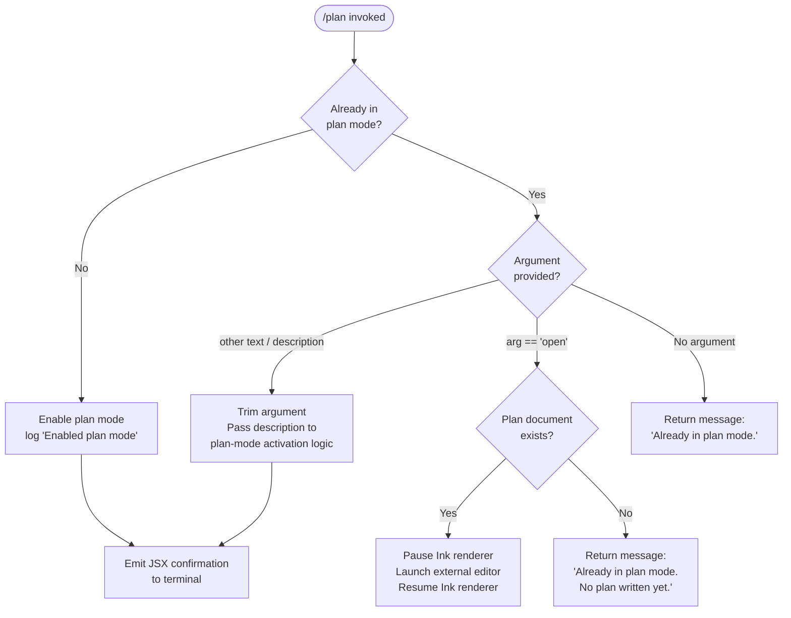

# `/plan`

> Analysis basis: CC v2.1.170 bundle.js (AST extraction + Claude interpretation)
> Minimum version: v2.1.170

---

## Overview

The `/plan` command enables **plan mode** for the current Claude Code session or, when already in plan mode, opens the session's plan document in an external editor. Plan mode restricts Claude to analysis and planning actions, deferring any file-system mutations; the command also surfaces the live session plan as a readable/editable document via an editor launch path.

---

## Registration

| Field | Value |
|---|---|
| type | `local-jsx` |
| name | `plan` |
| description | `Enable plan mode or view the current session plan` |
| argumentHint | `[open\|<description>]` |
| module_id | `Z4K` |
| load_inline | `true` |
| loc_byte | `12595152` |
| loc_byte_end | `12595351` |
| loc_line | `8893` |
| arbor_handler.name | `VBf` |
| arbor_handler.fqn | `claude-2.1.170::VBf` |
| arbor_handler.kind | `AsyncFunction` |
| arbor_handler.resolution_path | `module_id` |
| arbor_handler.n_hits | `0` |

Analysis basis: CC v2.1.170 bundle.js:+12595152

---

## Input Branching

Five distinct runtime paths exist in the handler, warranting a Mermaid flowchart.



Analysis basis: CC v2.1.170 bundle.js:+12594302–12594929

---

## Behavioral Spec

### 1. Entry Point — `planCommandHandler` (`VBf`)

The async handler is resolved via `module_id` → `Z4K` → export `VBf`.

```
async function planCommandHandler(args, appContext):
    sessionState  = readCurrentSessionState(appContext)       // nKH
    currentModel  = resolveCurrentModel(appContext)            // K / L
    permState     = readPermissionsState(appContext)           // DO
    toolConfig    = buildEffectiveToolConfig(appContext)       // EA6

    rawArg = args.trim()                                       // A.trim @ +12594532

    if sessionState.planModeEnabled:
        if rawArg == "open":                                   // literal @ +12594551
            return openPlanInEditor(appContext)                // xV / IQ path
        elif rawArg != "":
            // description provided while already in plan mode
            return activatePlanMode(description=rawArg, appContext)
        else:
            return renderMessage("Already in plan mode.")     // literal @ +12594490

    // plan mode not yet active
    if rawArg != "":
        activatePlanMode(description=rawArg, appContext)
    else:
        activatePlanMode(description=null, appContext)

    logInfo("Enabled plan mode")                               // literal @ +12594470
    return renderJsxConfirmation(appContext)                   // rV.createElement @ +12594929
```

Analysis basis: CC v2.1.170 bundle.js:+12594265

---

### 2. Error / CLI Exit Utility — `cliErrorExit` (`Y1`)

Called when a fatal inconsistency is detected (e.g., bad state before the handler can proceed).

```
function cliErrorExit(message):
    printRedError(message)           // w6.red @ +13231077
    console.error(message)           // console.error @ +13231063
    writeErrorFile("cli_error", 1)   // aj, literal "cli_error" @ +13231118, exit code 1 @ +13231144
    process.exit(1)
```

Analysis basis: CC v2.1.170 bundle.js:+16436075

---

### 3. Permissions State Manager — `permissionsStateManager` (`DO`)

Manages the in-memory permission rules that plan mode may depend on (e.g., bypassing permissions is rejected in certain session modes).

```
function permissionsStateManager(action, payload):
    switch action.type:
        case "setMode":                              // literal @ +5087241
            if payload == "bypassPermissions":       // literal @ +5087263
                if bypassPermissionsDisabledOrUnavailable:
                    log("Ignoring permission update: setMode 'bypassPermissions' rejected …")
                    // full warning text @ +5087329
                    return
            applyMode(payload)

        case "addRules":                             // literal @ +5087605
            mergeRules(payload, alwaysAllowRules="allow", alwaysDenyRules="deny")
            // literals @ +5087790, +5087798, +5087830, +5087837

        case "replaceRules":                         // literal @ +5087953
            replaceExistingRules(payload)

        case "addDirectories":                       // literal @ +5088264
            addWorkingDirectories(payload)

        case "removeRules":                          // literal @ +5088610
            removeMatchingRules(payload)

        case "removeDirectories":                    // literal @ +5088994
            removeWorkingDirectories(payload)

        case "alwaysAskRules":                       // literal @ +5087855
            applyAlwaysAskRules(payload)
```

Analysis basis: CC v2.1.170 bundle.js:+5087327

---

### 4. Tool Configuration Builder — `buildEffectiveToolConfig` (`EA6`)

Constructs the tool configuration that is active during plan mode. Plan mode restricts allowed tools.

```
function buildEffectiveToolConfig(appContext):
    base        = resolveModelCapabilities(appContext)     // vqA, ZW, GqA
    overrides   = applySessionToolOverrides(appContext)    // t3H → DO
    merged      = mergeToolSets(base, overrides)           // qU
    perFile     = resolvePerFileToolRules(merged)          // jqA, JqA
    // Model strings checked: "claude-3-", "claude-opus-4-*", "claude-sonnet-4-*", etc.
    // literals @ +3231751 … +3231992
    return merged
```

Analysis basis: CC v2.1.170 bundle.js:+11051498

---

### 5. Open Plan in External Editor — `openPlanInEditor` (`IQ`)

Invoked when the user supplies the `open` argument while already in plan mode.

```
async function openPlanInEditor(appContext):
    inkInstance = getInkInstance(appContext)            // n6 @ +11700073
    if inkInstance == null:
        throw Error("Ink instance not found - cannot pause rendering")
        // literal @ +11700121

    planFilePath = resolvePlanFilePath(appContext)      // ZIf / LLA
    editor       = detectEditor(appContext)             // fU / HD / TIf
    editorBin    = resolveEditorBinary(editor)          // y0

    inkInstance.pause()                                // A.pause @ +11700304
    inkInstance.enterAlternateScreen()                 // A.enterAlternateScreen @ +11700274
    stdin.suspend()                                    // A.suspendStdin @ +11700314

    result = spawnSync(editorBin, [planFilePath], {stdio: "inherit"})
    // "inherit" literal @ +11700428; qoq.spawnSync @ +11700396

    content = readFileSync(planFilePath, "utf-8")      // _.readFileSync @ +11700698, "utf-8" @ +13418428

    stdin.resume()                                     // A.resumeStdin @ +11700805
    inkInstance.exitAlternateScreen()                  // A.exitAlternateScreen @ +11700776
    inkInstance.resume()                               // A.resume @ +11700821

    return content
```

Analysis basis: CC v2.1.170 bundle.js:+11700073

---

### 6. Plan File Path Resolution — `resolvePlanFilePath` (`LLA`)

```
function resolvePlanFilePath(appContext):
    base     = path.basename(appContext.cwd)           // vx8.basename @ +11698618
    variant  = findMatchingVariant(appContext)          // XIf.find @ +11698649
    included = checkInclusionList(variant)              // _.includes @ +11698663
    return buildFinalPath(base, variant)               // f9 (indexOf/slice) @ +198116
```

Analysis basis: CC v2.1.170 bundle.js:+11700036

---

### 7. Editor Detection — `detectEditorBinary` (`y0`)

```
function detectEditorBinary(editorHint):
    lower = editorHint.toLowerCase()                   // H.toLowerCase @ +6551160
    name  = path.basename(lower)                       // EN.basename @ +6551218
    // Skips IDE-type editors (literal "IDE" @ +6551105)
    mapped = lookupEditorMapping(name)                 // mSH @ +6551292
    return mapped ?? editorHint
```

Analysis basis: CC v2.1.170 bundle.js:+6551160

---

### 8. JSX Render Pipeline — `renderPlanConfirmation` (`i5q`)

Renders the confirmation UI to the terminal using the Ink JSX renderer.

```
function renderPlanConfirmation(appContext):
    stream   = createOutputStream(appContext)          // L_6
    // Registers listener: K.on @ +8297476
    // Converts output: f.toString @ +8297513
    stripped = stripANSI(stream)                       // U4 → Bun.stripANSI @ +3890257
    element  = createElement(WF, props)               // E9H.createElement @ +8297543
    // WF renders via rv_ / MN_ / t79.createElement @ +3891951
    // Native cursor telemetry fired here (see State & Side Effects)
    return render(element, stream)
```

Analysis basis: CC v2.1.170 bundle.js:+8297690

---

### 9. "Already in plan mode — no plan written yet" Guard

When plan mode is active but no plan document has been persisted yet, and the user passes `open`:

```
if planModeActive AND planFileNotFound:
    return "Already in plan mode. No plan written yet."
    // literal @ +12594710
```

Analysis basis: CC v2.1.170 bundle.js:+12594710

---

## State & Side Effects

| Item | Detail |
|---|---|
| Telemetry | `tengu_native_cursor` (fired during JSX render pipeline; bundle.js:+3862403) |
| Session state mutation | Sets `planModeEnabled = true` on the session state object when plan mode is activated |
| Permissions state | Reads and conditionally mutates permission rules via `permissionsStateManager` (`DO`); `bypassPermissions` mode is silently rejected if the session was not launched with it (bundle.js:+5087329) |
| External process spawn | `qoq.spawnSync` with `stdio: "inherit"` launches the external editor; stdin is suspended and Ink rendering is paused for the duration (bundle.js:+11700396) |
| File I/O (read) | Plan document read with `_.readFileSync` after the editor exits (bundle.js:+11700698) |
| File I/O (write) | Error file written via `$FH.writeFileSync` on CLI error exit path (bundle.js:+194949) |
| Hook registration | `LTA.register` called during permission-state initialisation path (`N9`; bundle.js:+62328) |
| Ink renderer lifecycle | `pause` / `enterAlternateScreen` / `suspendStdin` before editor; `exitAlternateScreen` / `resumeStdin` / `resume` after (bundle.js:+11700274–11700821) |
| Log output | `"Enabled plan mode"` (info level) emitted on successful activation (bundle.js:+12594470) |
| Sound | None detected in depth-2 traversal |

---

## Version History

| Version | Change |
|---|---|
| v2.1.170 | Initial analysis |

---

## Common Mistakes

1. **Using `/plan open` before any plan exists.** If plan mode is active but no plan document has been written yet, the command returns `"Already in plan mode. No plan written yet."` rather than opening an editor. Write a plan first via a planning prompt.
2. **Passing `open` when not yet in plan mode.** The `open` sub-command is only meaningful inside an active plan-mode session; outside plan mode, `/plan open` is treated as a description text and activates plan mode with the literal word "open" as the description.
3. **Expecting `bypassPermissions` to work in a standard session.** If the session was not launched with bypass-permissions mode, any attempt to set `bypassPermissions` via the permissions manager is silently ignored with a logged warning (bundle.js:+5087329).
4. **Closing the terminal while the editor is open.** The Ink renderer is paused and stdin is suspended during the external editor session; forcibly closing the terminal at this point may leave the renderer in a non-resumed state.
5. **Assuming `/plan` is synchronous.** The handler (`VBf`) is an `AsyncFunction`; callers that do not `await` it will miss the returned JSX element and any error propagation.

---

## Appendix — Identifier Mapping

> For bundle debugging only. Identifiers change across versions.

| Identifier | Role |
|---|---|
| `VBf` | Main plan command handler (`AsyncFunction`; Arbor-resolved entry point) |
| `q` | Stream / data-source utility used in the CLI error path |
| `Y1` | CLI error exit helper (prints error, writes error file, calls `process.exit`) |
| `JpH` | Red-error printer (wraps `w6.red` + `console.error`) |
| `aj` | Error file writer (uses `$FH.writeFileSync` + `ro8.join`) |
| `nKH` | Session-state reader |
| `K` | Model/tool map iterator (calls `L.map`, `f.padEnd`) |
| `L` | Tool-set collection with add/delete/finally lifecycle |
| `f` | Individual tool entry; also async-task wrapper |
| `A` | String / stream abstraction (toLowerCase, close, set) |
| `DO` | Permissions state manager |
| `N` | Telemetry / event dispatcher |
| `PeK` | Permission-check sub-handler |
| `MTA` | Permission-token validator (calls `GaK`, `TaK`) |
| `H` | General string variable (context-dependent throughout call graph) |
| `CH` | JSON serialisation helper (`JSON.stringify`) |
| `_` | File-system / string utility (statSync, readFileSync, toUpperCase, includes) |
| `u4` | String sanitiser / redactor (produces `[REDACTED]`) |
| `FZA` | Rule-mapping formatter (`weK.map`) |
| `zFH` | Output write helper |
| `yZA` | Raw stream writer (`H.write`) |
| `EeK` | Log-file writer (mkdir, appendFile, rotate) |
| `mBH` | Buffered log-flush scheduler (setTimeout/setImmediate batching) |
| `L4H` | Log-line formatter (`PM6`, `E6H.join`, `H_`, `v6`) |
| `n6` | Ink instance accessor |
| `$M6` | Log-path builder (calls `V8`) |
| `cZA` | Log-directory resolver (`E6H.join`, `v6`) |
| `La8` | Log-file rotation handler (stat, rename, unlink) |
| `TeK` | Log-file append handler (mkdir, appendFile, rotate) |
| `N9` | Hook registrar (`LTA.register`) |
| `Q5` | Shell-escape / argument sanitiser (`fS4`) |
| `fS4` | String `replaceAll` wrapper for escaping |
| `EA6` | Effective tool-config builder |
| `vqA` | Model-capability resolver |
| `Cu` | Model-feature flag reader |
| `ZW` | Model compatibility checker |
| `GqA` | First-party model resolver (`FA`) |
| `GwH` | Model-string matcher (checks `"claude-3-"`, `"claude-opus-4-*"` etc.) |
| `z9` | Settings-layer reader (`Bc`, `B9`, `JD`) |
| `Zq_` | Settings hierarchy walker (`y8`) |
| `y8` | Settings-source selector (`policySettings`, `flagSettings`, `userSettings`, `localSettings`) |
| `AC` | Tool-config accumulator |
| `t3H` | Session tool-override applier (`Object.entries`, `DO`, `K.map`) |
| `qU` | Tool-merge orchestrator |
| `G3` | Tool-entry normaliser (substring, replaceAll) |
| `$S4` | Tool-name prefix handler |
| `rT` | Object own-property checker (`Object.hasOwn`) |
| `OS4` | Tool-string parser |
| `MS4` | Tool-string escaper (`replaceAll`) |
| `jqA` | Per-file tool-rule resolver |
| `rbH` | Tool-cache getter/setter (`hPq`) |
| `JqA` | Relative-path tool-rule matcher (`vgq.relative`) |
| `ygq` | Session-scoped tool-config query |
| `z0f` | Allowed-tools inclusion checker (`WC.includes`) |
| `M` | App-state map accessor (get, set, values) |
| `_X` | App-state reader helper (`BL`) |
| `BL` | State-lookup wrapper (`EZH`) |
| `EZH` | Raw state-store reader |
| `J46` | Output formatter (`OzH`, `v6`) |
| `OzH` | Terminal output writer |
| `v6` | Output stream resolver (`xZ`) |
| `xZ` | Base stream handle |
| `xV` | Plan-file open orchestrator (wraps `bV`, `IQ`) |
| `bV` | Plan-content display helper (`g0H`, `v6`, `lQ.join`, `gY`) |
| `g0H` | Plan-document renderer (get, set, format) |
| `ET_` | Text replace helper (`H.replace`) |
| `FiH` | Plan-section printer (`pP6`) |
| `j78` | Plan-header printer (`pP6`) |
| `k8` | File-existence checker (`V8`) |
| `V8` | Low-level fs stat / access |
| `hH` | Error-boundary / Ink error handler |
| `jA` | Error constructor wrapper |
| `_6` | String coercion utility |
| `hq` | Error message formatter (`ImA`) |
| `ImA` | Inner message builder (`_6`) |
| `lN4` | Error history ring-buffer (`di6.shift`, `di6.push`) |
| `IQ` | External editor launcher (pause Ink, spawnSync, resume Ink) |
| `fU` | Editor preference reader (`HD`, `TIf`) |
| `HD` | Editor config store |
| `ZIf` | Plan file-path resolver (`LLA`) |
| `LLA` | Plan file-name builder (`vx8.basename`, `XIf.find`) |
| `f9` | String index/slice utility |
| `y0` | Editor binary detector (toLowerCase, basename, IDE filter) |
| `i5q` | JSX render pipeline entry (`L_6`, `U4`) |
| `L_6` | Output-stream constructor (registers `K.on` listener) |
| `WF` | Ink component factory (`rv_`, `MN_`, `ks`) |
| `MN_` | Ink element creator (`t79.createElement`) |
| `ks` | Cursor / style component (`_6`, `jyH`, `Y6`) |
| `U4` | ANSI-strip wrapper (`Bun.stripANSI`) |

---

Note: index built via Arbor fallback; some signals (telemetry, literals) may be missing — see arbor-fallback.js.