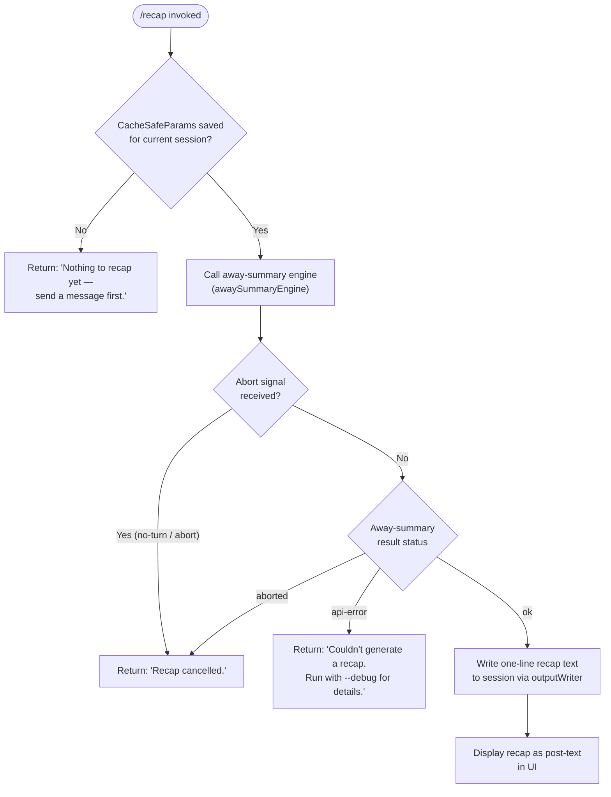

# `/recap`

> Analysis basis: CC v2.1.172 bundle.js (AST extraction + Claude interpretation)
> Minimum version: v2.1.172

---

## Overview

`/recap` immediately triggers a one-line session summary ("away summary") for the current conversation without waiting for the regular automatic compaction cycle. It calls into the same away-summary subsystem (`eP8`) that runs on background compaction, then writes the resulting single-line recap to the session state. The command is interactive-only and dispatches its result as `post-text` to the UI.

---

## Registration

| Field | Value |
|---|---|
| type | `local` |
| name | `recap` |
| description | `Generate a one-line session recap now` |
| loc_byte | `13222252` |
| loc_byte_end | `13222468` |
| loc_line | `9682` |
| supportsNonInteractive | `false` |
| thinClientDispatch | `post-text` |
| load_inline | `true` |
| load_ident | `Gt7` |
| arbor_handler.name | `Gt7` |
| arbor_handler.kind | `AsyncFunction` |
| arbor_handler.resolution_path | `load_ident` |
| arbor_handler.fqn | `claude-2.1.172::Gt7` |
| arbor_handler.n_hits | `0` |

Analysis basis: CC v2.1.172 bundle.js:+13222252

The handler is inlined via a `load:()=>Promise.resolve({call: Gt7})` shape; no separate `module_id` is present. The Arbor symbol graph resolved the handler as `Gt7` via the `load_ident` path.

---

## Input Branching

The command has four distinct outcome branches (no session data, cancellation/abort, API error, and successful recap), making a Mermaid flowchart the appropriate representation.



Analysis basis: CC v2.1.172 bundle.js:+13222002, +13222094, +13222152, +6930708, +6930766, +6930822, +6931226, +6931315, +6931376

---

## Behavioral Spec

### Top-level Handler (`Gt7`)

```
async function recapCommandHandler(context):
    result = await awaySummaryEngine(context)
    return result
```

Analysis basis: CC v2.1.172 bundle.js:+13221860

The handler is a thin async wrapper. All substantive logic is delegated to `awaySummaryEngine` (`eP8`).

---

### Away-Summary Engine (`eP8`)

```
async function awaySummaryEngine(context):
    // 1. Guard: require prior cached session parameters
    if not cacheSafeParamsSaved(context):
        log.debug("[awaySummary] no CacheSafeParams saved, skipping")
        return earlyExit("no-turn")   // literal: "no-turn" at +6930766

    // 2. Register abort listener on context signal
    context.signal.addEventListener("abort", onAbort)

    // 3. Build query parameters via sessionRecapFormatter
    params = sessionRecapFormatter(context)   // calls N → lf, CH, etc.

    // 4. Launch agent query loop
    queryResult = await agentQueryLoop(params, context)

    // 5. Handle tool-use denial (recap disallows tools)
    //    Any tool-use request from the model returns "deny"
    //    with message "Away summary cannot use tools" (+6931014)

    // 6. Classify result
    switch queryResult.status:
        case "aborted":
            return { status: "aborted", text: "Recap cancelled." }
        case "api-error":
            return { status: "api-error",
                     text: "Couldn't generate a recap. Run with --debug for details." }
        case "ok":
            flattenedLines = flattenResultMessages(queryResult)   // ai9
            return { status: "ok", lines: flattenedLines }
```

Analysis basis: CC v2.1.172 bundle.js:+6930687, +6930706, +6930708, +6930766, +6930803, +6930822, +6930881, +6930999, +6931014, +6931067, +6931082, +6931226, +6931315, +6931376, +6931332, +6931542

---

### Session-State Accessor (`cacheSafeParamsCheck`, `q9H`)

```
function cacheSafeParamsCheck(context):
    // Returns true if a prior API call has stored
    // CacheSafeParams in the session state.
    // Called first by awaySummaryEngine.
    return context.sessionState.hasCacheSafeParams()
```

Analysis basis: CC v2.1.172 bundle.js:+6930687

---

### Recap Formatter (`sessionRecapFormatter`, `N`)

The formatter builds the prompt payload that will be sent to the model:

```
function sessionRecapFormatter(context):
    // Collect conversation history segments
    segments = historyCollector(context)          // g8f
    // Uppercase role labels where needed
    roleLabel = currentRole.toUpperCase()         // _.toUpperCase at +210606
    // Resolve file path for recap output
    outputPath = recapFilePathResolver(context)   // lf
    outputPath = outputPath.trim()
    // Select debug or production log channel
    channel = selectLogChannel("debug")           // literal at +210480
    // Build final parameter object
    return buildRecapParams(segments, roleLabel, outputPath, channel)
```

Analysis basis: CC v2.1.172 bundle.js:+210504, +210522, +210544, +210562, +210606, +210626, +210629, +210645, +210651, +210665, +210480

---

### Recap File-Path Resolver (`recapFilePathResolver`, `lf`)

```
function recapFilePathResolver(context):
    // 1. Redact any sensitive tokens in path
    //    (replaces recognised patterns with "[REDACTED]" +201957)
    sanitized = redactSensitiveTokens(context.conversationId)  // MNA

    // 2. Replace delimiters
    cleaned = sanitized.replace(pattern, replacement)          // H.replace +201905

    // 3. Locate the last segment separator
    lastSep = cleaned.lastIndexOf(separator)                   // A.lastIndexOf +202041

    // 4. Extract final path component
    tail = cleaned.slice(lastSep + 1)                          // A.slice +202067

    // 5. Peek at most-recent character
    peek = cleaned.at(index)                                   // q.at +202015

    return tail
```

Analysis basis: CC v2.1.172 bundle.js:+201878, +201905, +201957, +202015, +202041, +202067

---

### Output Writer (`outputWriter`, `rFH` → `ovA`)

```
function outputWriter(recapText, handle):
    // Writes the final one-line recap string to the output handle
    handle.write(recapText)   // H.write at +197006
```

Analysis basis: CC v2.1.172 bundle.js:+210651, +197070, +197006

---

### Persistent-Log Writer (`persistentLogWriter`, `l8f`)

`l8f` manages the durable session-log file that backs the recap system. Its responsibilities at depth ≤ 2 include:

```
async function persistentLogWriter(logEntry, context):
    // 1. Obtain directory path
    dir = path.dirname(logFilePath)               // i6H.dirname +210025

    // 2. Compute byte length of new entry
    byteLen = Buffer.byteLength(logEntry)         // Buffer.byteLength +210200

    // 3. Stat existing log file; handle .txt extension variants
    stat = await fs.stat(logFilePath)             // Ny.stat +209317
    if logFilePath.endsWith(".txt"):              // +209410
        logFilePath = logFilePath.slice(0, -4)   // +209432

    // 4. Rotate / rename if size threshold reached
    if shouldRotate(stat, byteLen):
        await fs.rename(src, dst)                // Ny.rename +209473
        await fs.unlink(old)                     // Ny.unlink +209513

    // 5. Ensure directory exists and append
    await fs.mkdir(dir, { recursive: true })     // Ny.mkdir +209746
    await fs.appendFile(logFilePath, logEntry)   // Ny.appendFile +209805

    // 6. Register debounced compaction hook
    registerCompactionHook(context)              // y9 → hZA.register +63751

    // 7. Resolve path components and update state
    pathComponents = buildPathComponents()       // zNA, A36
    updateSessionState(pathComponents)

    // 8. After append resolves, chain next write cycle
    yd6.then(persistentLogWriterBound)           // c8f.bind +210259
```

Analysis basis: CC v2.1.172 bundle.js:+210025, +210055, +210070, +210145, +210162, +210194, +210200, +210233, +210250, +210259, +210355, +209317, +209410, +209432, +209473, +209513, +209746, +209805

Notable constant: the file extension checked during rotation is `".txt"` (bundle.js:+209421). Rotation offset constant: `4` characters (bundle.js:+209443).

---

### Agent Query Loop (`agentQueryLoop`, `GT`)

`GT` is the main agentic execution loop invoked by the recap handler. Key behaviours observed in the call graph:

```
async function agentQueryLoop(params, context):
    startTime = Date.now()                        // +10669357
    sessionState = getSessionState()              // HS8 → H.getAppState +10666507

    // Build prompt chain
    promptChain = buildPromptChain(params)        // pqH, ZmH
    filterChain = filterToAntMessages(promptChain) // ZmH → "ant" filter +13474924

    // Identify the last assistant turn
    lastAssistantTurn = messages.at(index)        // H.at +10669826
    threadId = "main"                             // literal +10669669

    // Run the core query engine (EW7) with full tool + streaming support
    queryResult = await coreQueryEngine(params, context)  // ap → EW7

    // After completion, write session state update
    setAppState(updatedState)                    // HS8 → H.setAppState +10667671

    // Dispatch lifecycle events and push output
    pushOutputLine(recapLine)                    // GT → Y.push +10670363

    // Handle forked-agent telemetry if applicable
    return queryResult
```

Analysis basis: CC v2.1.172 bundle.js:+10669357, +10669480, +10669669, +10669694, +10669712, +10669736, +10669756, +10669826, +10669887, +10670087, +10670118, +10670208, +10670237, +10670258, +10670363, +10670375, +10670719, +10670941

---

### Tool-Use Denial in Recap Context

The away-summary mode explicitly blocks all model tool calls:

```
function recapToolUsePolicy(toolRequest):
    // Recap runs in a tool-free context.
    // Any tool_use block returned by the model is rejected.
    return { decision: "deny",
             reason: "Away summary cannot use tools" }
```

The string `"Away summary cannot use tools"` appears at bundle.js:+6931014. The decision key `"deny"` appears at bundle.js:+6930999.

---

### Result Message Flattener (`resultMessageFlattener`, `ai9`)

```
function resultMessageFlattener(messages):
    // Flatten nested message arrays into a single list
    return messages.flatMap(msg => extractTextContent(msg))  // H.flatMap +6931542
```

Analysis basis: CC v2.1.172 bundle.js:+6931332, +6931542

---

## State & Side Effects

| Item | Detail |
|---|---|
| Telemetry (query engine — selected) | `tengu_auto_compact_rapid_refill_breaker`, `tengu_auto_compact_succeeded`, `tengu_ptl_surfaced_to_user`, `tengu_refusal_fallback_suppressed`, `tengu_rotunda_pennant_applied`, `tengu_rotunda_pennant_tools`, `tengu_refusal_fallback_dialog_suppressed`, `tengu_refusal_fallback_prompt_shown`, `tengu_refusal_fallback_prompt_choice`, `tengu_fallback_credit_forfeited`, `tengu_convolute_arcades_retry`, `tengu_refusal_fallback_triggered`, `tengu_orphaned_messages_tombstoned`, `tengu_refusal_fallback_supersedes`, `tengu_convolute_arcades_retry_outcome`, `tengu_model_fallback_triggered`, `tengu_query_error`, `tengu_model_response_keyword_detected`, `tengu_malformed_tool_use_response`, `tengu_stop_hook_block_count`, `tengu_loop_dynamic_wakeup_ends_turn`, `tengu_post_autocompact_turn`, `tengu_query_before_attachments`, `tengu_query_after_attachments`, `tengu_mcp_tools_refreshed_mid_turn`, `tengu_forked_agent_default_turns_exceeded`, `tengu_fork_agent_query` |
| Telemetry (feature flags) | `tengu_feature_ok`, `tengu_feature_bad` |
| Telemetry (daemon/bg) | `tengu_daemon_control`, `tengu_bg_proto_mismatch`, `tengu_bg_dispatch_stale_drop`, `tengu_bg_attach_legacy_autorespawn`, `tengu_bg_attach`, `tengu_bg_attach_stall_gave_up`, `tengu_bg_attach_stall_respawn`, `tengu_bg_attach_kick` |
| Hook registration | `persistentLogWriter` (`l8f`) registers a debounced compaction hook via `hZA.register` (bundle.js:+63751) after each successful log append. |
| appState changes | `HS8` reads (`H.getAppState`) and writes (`H.setAppState`) session state around the query; `EW7` also calls `x.getAppState` / `x.setAppState` within the core query loop. |
| File I/O | `persistentLogWriter` appends to the session log file (`Ny.appendFile`), may rotate it (`Ny.rename`, `Ny.unlink`), and creates directories as needed (`Ny.mkdir`). |
| Abort / signal | The away-summary engine attaches an `"abort"` listener to the context abort signal (`H.addEventListener` at +6930803); if fired, the recap aborts cleanly and returns `"Recap cancelled."` |
| Output dispatch | Result is dispatched as `thinClientDispatch: "post-text"`, meaning the recap line is rendered as trailing text in the current UI turn. |
| Sound | <!-- TODO: not found in depth-2 traversal; needs --depth 4 --> |
| Non-interactive | `supportsNonInteractive: false` — the command cannot be used in `--no-interactive` / pipe mode. |

---

## Version History

| Version | Change |
|---|---|
| v2.1.172 | Initial analysis |

---

## Common Mistakes

1. **Running `/recap` before any message has been sent.** The command guards on the existence of `CacheSafeParams` in session state; if no prior API turn has completed, it returns `"Nothing to recap yet — send a message first."` (bundle.js:+13222002) rather than calling the model.
2. **Using `/recap` in non-interactive or piped mode.** `supportsNonInteractive` is `false`; the command will be unavailable or silently ignored in those contexts.
3. **Expecting tool use in the recap response.** The away-summary subsystem runs with all tool calls denied (`"Away summary cannot use tools"`, bundle.js:+6931014). A model response requesting a tool is blocked and will not be surfaced.
4. **Confusing `/recap` with automatic compact summaries.** `/recap` forces an immediate on-demand summary via the same engine, but the result is a single line dispatched as `post-text`, not a background compact operation. It does not replace the compaction cycle.
5. **Expecting debug output by default.** The formatter selects the `"debug"` log channel (bundle.js:+210480) for internal trace logging; this is only visible when running with `--debug`.

---

## Appendix — Identifier Mapping

> For bundle debugging only. Identifiers change across versions.

| Identifier | Role |
|---|---|
| `Gt7` | Top-level recap command handler (AsyncFunction; Arbor-resolved entry point) |
| `eP8` | Away-summary engine — main orchestrator called by `Gt7` |
| `q9H` | CacheSafeParams existence check (session guard) |
| `N` | Session recap formatter — builds prompt payload |
| `g8f` | History segment collector |
| `kZA` | History segment sub-processor |
| `CH` | JSON serialisation utility (`JSON.stringify` wrapper) |
| `lf` | Recap file-path resolver / path sanitiser |
| `MNA` | Sensitive-token redactor (maps over path segments) |
| `rFH` | Output writer coordinator |
| `ovA` | Low-level handle writer (`H.write`) |
| `l8f` | Persistent session-log writer (append / rotate) |
| `TFH` | Debounced write scheduler (uses `setTimeout` / `setImmediate`) |
| `BfH` | Path component builder used by log writer |
| `A36` | EISDIR-aware directory check helper |
| `zNA` | Path join helper for log-file location |
| `ms8` | File stat / rotate helper (`.txt` extension handling) |
| `c8f` | Chained log-write cycle (mkdir + appendFile) |
| `y9` | Compaction hook registration (→ `hZA.register`) |
| `GT` | Agent query loop (outer agentic execution driver) |
| `HS8` | Session-state read/write coordinator within query loop |
| `lb` | Token / model context loader |
| `F5H` | Conversation dump/load helper |
| `wPH` | Query parameter pre-processor |
| `YF9` | Prompt assembly helper |
| `M` | Message routing / dispatch helper |
| `Hb8` | Request metadata builder |
| `HR` | Request-ID / nonce generator (uses `randomBytes`) |
| `_S8` | Post-query state updater |
| `pqH` | Prompt chain builder |
| `$4` | Hook-registration adapter for prompt chain |
| `ZmH` | Message filter (retains `"ant"`-origin messages) |
| `ap` | Core query engine launcher (delegates to `EW7`) |
| `EW7` | Core query engine (full streaming + tool-use loop) |
| `LC8` | Subagent lifecycle manager (ready / exit states) |
| `kH` | Feature-flag check helper (`tengu_feature_ok`) |
| `bH` | Feature-flag bad-state helper (`tengu_feature_bad`) |
| `ME` | Model-error classifier |
| `eC6` | Message-type membership check (`mW7.has`) |
| `jHH` | Turn-notification dispatcher |
| `qb8` | Query-state tracker |
| `lBq` | Message-loop continuation checker |
| `Y` | Output line queue (push / map) |
| `HX` | Forced-shutdown handler |
| `z` | Abort-controller facade |
| `CMH` | Conversation message handler (filter + push) |
| `mJ` | Message-type lookup |
| `qyL` | Message finder helper |
| `f` | Async task set (add / delete / finally) |
| `c` | Core configuration / context accessor |
| `pW7` | Forked-agent query runner |
| `A6` | Feature-gate evaluator (→ `_56`) |
| `U8` | UUID generator + stream context setup |
| `P` | Stream-buffer processor |
| `X` | Stream multiplexer with timeout |
| `j` | Process / stream manager (kill / values) |
| `I7` | Stream end-and-flush helper |
| `x05` | PTY / IPC message handler (large multiplexed handler) |
| `EH` | String coercion utility |
| `ai9` | Result message flattener (`H.flatMap`) |
| `o6` | Log-channel selector |
| `_` | Role-label or miscellaneous string context |
| `H` | General-purpose context / handle reference (overloaded across call sites) |
| `A` | Secondary context / array reference (overloaded across call sites) |
| `q` | Tertiary context reference (overloaded across call sites) |

---

Note: index built via Arbor fallback; some signals (telemetry, literals) may be missing — see arbor-fallback.js.