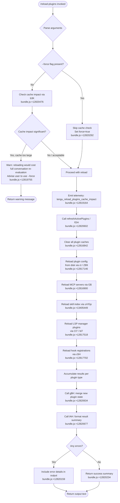

# `/reload-plugins`

> Analysis basis: CC v2.1.172 bundle.js (AST extraction + Claude interpretation)
> Minimum version: v2.1.172

---

## Overview

`/reload-plugins` activates pending plugin changes in the current Claude Code session by re-scanning and reloading all plugin types (skills, agents, MCP servers, LSP servers). It optionally accepts a `--force` flag that bypasses caching and triggers a full re-evaluation across the entire conversation context, at the cost of losing cache efficiency.

---

## Registration

| Field | Value |
|---|---|
| type | `local` |
| name | `reload-plugins` |
| description | `Activate pending plugin changes in the current session` |
| argumentHint | `[--force]` |
| supportsNonInteractive | `false` |
| thinClientDispatch | `control-request` |
| module_id | `x3K` |
| load_inline | `true` |
| loc_byte | `12821172` |
| loc_byte_end | `12821416` |
| loc_line | `9114` |
| arbor_handler.name | `xl7` |
| arbor_handler.fqn | `claude-2.1.172::xl7` |
| arbor_handler.kind | `AsyncFunction` |
| arbor_handler.resolution_path | `module_id` |
| arbor_handler.n_hits | `0` |

Analysis basis: CC v2.1.172 bundle.js:+12821172

---

## Input Branching

The handler has 4+ distinct branches based on the `--force` flag, cache impact assessment, and per-plugin-type reload results, so a Mermaid flowchart is used.



---

## Behavioral Spec

### Handler Entry Point (`xl7`)

The primary handler is the async function `xl7` (resolved via `module_id` → `x3K`).

Analysis basis: CC v2.1.172 bundle.js:+12819870

```
async function reloadPluginsHandler(args, context):
    // Parse raw argument string
    trimmedArgs = args.trim()                    // +12820256

    // Check for --force flag
    forceMode = trimmedArgs.includes("--force")  // +12820292, +12820307

    // Emit telemetry for cache impact assessment
    cacheImpact = assessCacheImpact(context)     // b3K at +12820476
    emit("tengu_reload_plugins_cache_impact", cacheImpact)  // +12819164

    if not forceMode and cacheImpact.isSignificant:
        // Warn user that a non-forced reload would re-evaluate
        // the whole conversation instead of using the cache.
        // Short citation fragment: "...whole conversation instead of using the cache..."
        // (+12819755)
        return buildTextMessage(warningText)

    // Retrieve current app state
    appState = getAppState()                     // +12820370

    // Refresh all active plugins
    reloadResult = await refreshActivePlugins(appState, forceMode)  // fOH at +12820602

    // Merge results into app state
    mergePluginState(reloadResult)               // g$H at +12820634

    // Format and return output
    summary = formatReloadSummary(reloadResult)  // lAH at +12820677
    return buildTextMessage(summary)
```

### Cache Impact Assessment (`b3K`)

```
function assessCacheImpact(context):
    // Calls internal helper c (+12819162)
    // Returns an object describing whether a non-forced reload
    // would force re-evaluation of the full conversation context
    return c(context)
```

Analysis basis: CC v2.1.172 bundle.js:+12820476

### Argument Parsing — Force Flag Detection (`ul7`)

```
function parseForceFlag(rawArgs):
    // Splits the raw argument string (+12819652)
    tokens = rawArgs.split(" ")
    return tokens.includes("--force")   // literal "--force" at +12820292
                                        // normalized key "force" at +12820307
```

Analysis basis: CC v2.1.172 bundle.js:+12820530

### Plugin Refresh Orchestrator (`fOH` — `refreshActivePlugins`)

This function is the core reload engine. It clears all caches and then re-initialises each plugin subsystem concurrently using `Promise.all`.

```
async function refreshActivePlugins(appState, force):
    log("refreshActivePlugins: clearing all plugin caches")  // +12816842

    // 1. Clear skill/plugin index cache
    clearPluginCaches(appState)       // G$ at +12816900 → Gp which calls
                                      // H.clearSkillIndexCache (+13405402)

    // 2. Re-read plugin configuration from disk
    pluginConfigs = await readPluginConfig()   // ct at +12817146
                                               // → ZB9 → CZ6 (reads .mcp.json,
                                               //   manifest.json, .mcpb, .dxt files)

    // 3. Reload LSP manager plugin list
    lspPlugins = filterLspPlugins(pluginConfigs)    // Cl7 at +12817518
    lspPluginsB = filterLspPluginsAlt(pluginConfigs) // bl7 at +12817551

    // 4. Reload hook registrations (respects --safe-mode)
    hookResult = reloadHooks(pluginConfigs)    // c5H at +12817702

    // 5. Run MCP server reload (via G$ call chain)
    mcpResult = await reloadMcpServers(appState)  // G$ → HT7 → NW

    // 6. Collect WatchPlugin results
    [watchResults] = await Promise.all([...])   // +12816949

    // 7. Aggregate plugin load result via C3K
    aggregated = assemblePluginLoadResult(pluginConfigs, mcpResult)  // C3K at +12820324

    // 8. Emit domain event
    dS.emit(aggregated)    // +12817948

    return aggregated
```

Analysis basis: CC v2.1.172 bundle.js:+12816840

### Plugin Load Result Assembly (`C3K` → `gB9` → `gKA` / `FKA`)

`C3K` collates results from all plugin subsystems and classifies each plugin entry into one of several outcome states.

```
function assemblePluginLoadResult(rawConfigs, mcpResult):
    // Checks internal plugin registry (_.has, A.has)  // +12818938, +12818977
    // Calls yN: determines plugin scope (plugin/skill/agent)
    //   literals: "plugin" +12819986, "skill" +12820017, "agent" +12820045

    // Calls ht: normalises plugin server type to lowercase
    //   maps to "plugin MCP server" (+12820077) or "plugin LSP server" (+12820910)

    // Calls eY: counts output tokens    // +12819048

    // gKA: full plugin loader
    //   - resolves "path" (+10938630) and "url" (+10938735) sources
    //   - emits: "plugin_load_all" (+10939427)
    //   - emits: "plugin_load_total_failure" (+10939445)
    //   - emits: "plugin_load_partial_failures" (+10939514)
    //   - guard: "assemblePluginLoadResult: originalCwd changed mid-scan..." (+10939580)

    // FKA: marketplace plugin loader
    //   - handles failure codes:
    //       "marketplace-blocked-by-policy" (+10919595)
    //       "marketplace-not-found"         (+10920149)
    //       "marketplace-load-failed"       (+10920341)
    //       "cache-miss"                    (+10920397)
    //       "plugin-not-found"              (+10920435)
    //   - uses Promise.allSettled (+10919487) over parallel installs
    //   - classifies settled promises: "fulfilled" (+10920904) / "rejected" (+10920960)
    //   - generic fallback: "generic-error" (+10921076)
    //   - reads from "skills-dir" (+10919318)

    return assembledResult
```

Analysis basis: CC v2.1.172 bundle.js:+12818888

### MCP Server Reload (`G$` → `HT7` / `uV`)

```
async function reloadMcpServers(appState):
    // HT7: initialises MCP server cluster
    //   sub-helpers: NW, Fb8, Ub8, UY8, ab_, SH, EJ8, VKA, HQq

    // uV: applies update to each MCP client slot
    //   - Gp: clears skill index cache, resolves fresh server info
    //       calls H.clearSkillIndexCache (+13405402)
    //   - Fb8, lgq, euH: per-slot update helpers

    // NW: assembles MCP server list
    //   calls gKA, FO, KZA for loading and cache clearing

    // cS: clears internal bb8 cache (+10797479)

    return mcpServerState
```

Analysis basis: CC v2.1.172 bundle.js:+12816900

### Plugin Config Reader (`ct` → `ZB9` → `CZ6`)

```
async function readPluginConfig():
    // ct: top-level config reader
    //   - reads .mcp.json files (+6470527)
    //   - classifies config sources:
    //       "projectSettings"  (+6470267)
    //       "userSettings"     (+6470290)
    //       "localSettings"    (+6470311)
    //       "policySettings"   (+3340117)
    //   - warns on "mcp-config-invalid" (+6472490)
    //   - handles .mcpb (+6436127) and .dxt (+6436148) plugin archives

    // ZB9: resolves individual plugin entries
    //   - CZ6: reads manifest.json (+6442238) from plugin directories
    //   - computes md5 hash for cache invalidation (+6443077)
    //   - classifies HTTP ("http", "download", "network") vs local sources

    return configMap
```

Analysis basis: CC v2.1.172 bundle.js:+12817146

### Result Formatter (`lAH`)

```
function formatReloadSummary(reloadResult):
    // Maps each plugin entry to a display line  (+4291280)
    // Uses A1 to format plugin identifier        (+4291291)
    // Joins with " · " separator                 (+12820104)
    // Truncates long lists via q.slice           (+4291333)
    // Falls back to m8 for empty states          (+4291385)
    return formattedString
```

Analysis basis: CC v2.1.172 bundle.js:+12820677

### Hook Registration Loader (`c5H`)

```
function reloadHooks(pluginConfigs):
    if isSafeMode():
        log("Safe mode: skipping plugin hook registration")  // +5075669
        return emptyResult

    // UK: parses hook config entries   // +5075661
    // N: normalises hook definitions   // +5075667
    // ST9: installs hooks              // +5075730
    return hookRegistrations
```

Analysis basis: CC v2.1.172 bundle.js:+12817702

---

## State & Side Effects

| Item | Detail |
|---|---|
| Telemetry | `tengu_reload_plugins_cache_impact` (+12819164) — fired on every invocation with cache cost metadata |
| Telemetry (plugin subsystem) | `plugin_load_all` (+10939427), `plugin_load_total_failure` (+10939445), `plugin_load_partial_failures` (+10939514) |
| Telemetry (MCP) | `tengu_mcp_list_changed` (+16532714), `mcp_sdk_connect` (+6742227), `mcp_sdk_connect_failed` (+6742302) |
| Telemetry (install) | `plugin_installed` (+10890526) — emitted when a new plugin version is resolved during reload |
| Cache cleared | Skill index cache (`H.clearSkillIndexCache` via `Gp`), installed-plugins cache (`XQq`/`G$` chain), `bb8` internal cache (`cS`) |
| Hook registration | Hooks are re-registered via `c5H`; skipped entirely in safe mode (`--safe-mode`) |
| MCP server connections | Existing MCP client slots are stopped and restarted via `w` (MCP supervisor); orphaned connections are disposed if config changed mid-flight (+16426374, +16426459) |
| appState changes | Plugin registry is merged via `g$H`; `dS.emit` fires a domain event to notify UI after reload (+12817948) |
| Conversation cache impact | Without `--force`, reloading may cause the conversation to be re-evaluated without cache — the handler warns and blocks by default |
| Sound | None observed in depth-2 traversal |
| thinClientDispatch | `control-request` — in thin-client mode the command is forwarded to the host process rather than executed locally |

---

## Version History

| Version | Change |
|---|---|
| v2.1.172 | Initial analysis |

---

## Common Mistakes

1. **Omitting `--force` when plugins appear stale after a config edit**: Without `--force`, the handler may decline to reload (or issue a warning) if doing so would invalidate the conversation cache. Pass `--force` explicitly when you need the latest plugin state regardless of cache cost.
2. **Running in non-interactive mode**: `supportsNonInteractive` is `false`; invoking `/reload-plugins` from a script or CI pipeline has no effect and may silently fail.
3. **Expecting instant MCP reconnection**: The reload triggers async reconnection via the MCP supervisor. Tools from reloaded servers may not be available immediately — a brief delay is expected while connections are established.
4. **Using in safe mode**: If Claude Code is started with `--safe-mode`, hook registrations are silently skipped during plugin reload. Plugin MCP and LSP servers still reload, but lifecycle hooks do not.
5. **Config file location confusion**: The command reads `.mcp.json` from project, user, local, and policy scopes. Edits to files outside these paths are not picked up by a reload.

---

## Appendix — Identifier Mapping

> For bundle debugging only. Identifiers change across versions.

| Identifier | Role |
|---|---|
| `xl7` | Main handler (`reloadPluginsHandler`) — AsyncFunction entry point |
| `DX` | Argument pre-processor called at handler start |
| `t4` | Internal utility called by `DX` and `xl7` |
| `_VH` | Sub-utility called by `t4` |
| `Ur` | Utility called early in `xl7` |
| `m8` | Low-level primitive used by `Ur` and result formatter |
| `H` | Global helper (Math.random, setTimeout, trim, includes, etc.) |
| `C3K` | Plugin load result assembler (`assemblePluginLoadResult`) |
| `gB9` | Plugin config aggregator called by `C3K` |
| `xzH` | Sub-helper of `gB9` |
| `MU_` | Plugin loader coordinator within `gB9` |
| `gKA` | Full plugin loader (path/url resolution, load telemetry) |
| `FKA` | Marketplace plugin loader (allSettled, failure classification) |
| `lt` | MCP configuration reader and server lifecycle manager |
| `$f` | Sub-helper of `lt` |
| `M2` | MCP config file scanner (reads `.mcp.json` from directory tree) |
| `B1H` | Plugin binary archive handler (`.mcpb`, `.dxt`) |
| `GD` | Policy settings filter |
| `Qw` | MCP duplicate-suppression helper |
| `N` | General-purpose normaliser / log-level classifier |
| `VJ8` | MCP server entry validator |
| `laH` | Config-source label helper |
| `D` | Background session / daemon process manager |
| `Y` | Forced-shutdown / process-exit helper |
| `QV` | MCP server reconnect helper |
| `AWL` | MCP server slot assignment and cache manager |
| `w` | MCP supervisor (stop/updateConfig/start per slot) |
| `k` | Internal registry wrapper |
| `q` | CLI error / process-exit wrapper |
| `$1` | CLI error emitter |
| `A` | Identifier lowercaser / registry map |
| `L` | Connection close helper |
| `f` | Promise tracking helper |
| `yN` | Plugin scope classifier ("plugin", "skill", "agent") |
| `Pb_` | Plugin type parser |
| `aIH` | HIPAA/compliance mode checker |
| `Xb_` | Auto-concurrency parser |
| `jfL` | "auto" prefix detector |
| `f6` | String coercion utility |
| `OK` | String coercion utility (variant) |
| `c_` | Provider type mapper (bedrock, foundry, etc.) |
| `wL` | Provider sub-type resolver |
| `ht` | Plugin server type normaliser (lowercase) |
| `XfL` | Plugin flag-set resolver |
| `Y6` | Settings flag evaluator |
| `eY` | Output token counter |
| `b3K` | Cache impact assessor |
| `c` | Low-level context helper |
| `ul7` | Argument token splitter / force-flag parser |
| `fOH` | `refreshActivePlugins` orchestrator |
| `XQq` | Plugin cache clearer |
| `G$` | MCP + skill reload coordinator |
| `HT7` | MCP cluster initialiser |
| `NW` | MCP server list assembler |
| `Fb8` | MCP per-slot helper A |
| `Ub8` | MCP per-slot helper B |
| `UY8` | MCP per-slot helper C |
| `ab_` | MCP server connection details builder |
| `SH` | Structured logging helper |
| `EJ8` | MCP error-classification helper |
| `VKA` | MCP validation helper |
| `HQq` | MCP handshake helper |
| `uV` | MCP slot update applier |
| `Gp` | Skill index cache clearer and server info resolver |
| `lgq` | Per-slot update sub-helper |
| `euH` | Per-slot update sub-helper B |
| `T$H` | MCP per-slot helper D |
| `HC_` | MCP per-slot helper E |
| `cS` | Internal `bb8` cache clearer |
| `cs9` | Plugin config sub-helper |
| `Qi9` | Plugin config sub-helper B |
| `P_` | Promise resolution helper |
| `BG` | Base guard helper |
| `K` | Padded display formatter |
| `ct` | Plugin config top-level reader |
| `$g` | File-extension detector (`.mcpb`, `.dxt`) |
| `T8H` | Config entry transformer |
| `ap_` | Archive plugin entry reader |
| `o6` | Path join helper |
| `R8` | Error code classifier |
| `n6` | JSON.parse wrapper |
| `ZB9` | Plugin entry resolver (wraps `CZ6`) |
| `CZ6` | Manifest and archive file reader / hash computer |
| `EH` | String coercion helper |
| `RRH` | LSP config file reader (`.lsp.json`) |
| `QEL` | LSP config entry processor |
| `gEL` | LSP path relative-check helper |
| `$` | Domain event bus / reduce helper |
| `TwK` | Daemon status writer |
| `pa` | OLH wrapper |
| `d9` | AsyncLocalStorage store getter |
| `km6` | Daemon status file path builder |
| `CH` | JSON.stringify wrapper |
| `O` | Background-session registry |
| `AP8` | LSP extension-conflict detector |
| `M` | MCP client manager (yRH + Ln8 orchestrator) |
| `yRH` | MCP connection attempt runner |
| `Ln8` | MCP connection result applier |
| `nWA` | MCP client retry coordinator |
| `Cl7` | LSP-manager plugin list filter A |
| `R3K` | LSP sub-helper |
| `bl7` | LSP-manager plugin list filter B |
| `c5H` | Hook registration loader (safe-mode aware) |
| `UK` | Hook config parser |
| `EQ6` | Hook entry validator |
| `g$H` | Plugin state merger into app state |
| `ok` | Settings file reader wrapper |
| `zM` | Known-marketplaces JSON reader |
| `ib8` | Plugin root path builder |
| `myH` | Plugin entry mapper |
| `x8` | Plugin entry constructor |
| `ia6` | Plugin scope initialiser |
| `VB` | Plugin descriptor builder |
| `SV` | Error thrower (managed-scope guard) |
| `A1` | Plugin identifier formatter |
| `CW` | Source-type URL parser (git, file, directory, github, npm) |
| `yn9` | URL scheme extractor |
| `aV6` | Source validator |
| `vP8` | Source sub-validator A |
| `Sn9` | Host-pattern matcher |
| `Rn9` | Path-pattern matcher |
| `uZL` | URL normaliser |
| `s1H` | Source sub-validator B |
| `bn9` | Combined source validator |
| `kn9` | File-descriptor helper |
| `THH` | Plugin marketplace.json reader |
| `Tb6` | Marketplace path builder |
| `NKA` | Marketplace JSON parser and validator |
| `N8` | Numeric/error code helper |
| `$Z` | Plugin installation record reader |
| `IKA` | Installed-plugin record reader |
| `AC7` | Plugin cache hit checker |
| `Rb6` | Full plugin resolver and installer |
| `o0` | Plugin source normaliser |
| `qx8` | Plugin config reader for installed plugins |
| `Dw6` | Local path (`./`) prefix detector |
| `z` | Plugin connection state manager |
| `kH` | Connection success reporter |
| `bH` | Connection failure reporter |
| `wS` | Connection state broadcaster |
| `CU` | Connection race/timeout handler |
| `p6` | AsyncLocalStorage context getter |
| `zo6` | Store getter sub-helper |
| `Kv` | Plugin version loader (reads plugin.json) |
| `kKA` | Plugin JSON sync reader |
| `yKA` | Plugin version entry iterator |
| `vb6` | Plugin version cache writer |
| `J` | Background-session set (tracks active installs) |
| `G` | Editor key-binding handler (unrelated; deep call graph artifact) |
| `T` | UI component (unrelated; deep call graph artifact) |
| `td` | Timestamp display helper |
| `j` | Process-kill iterator |
| `MNK` | Vim-mode find handler |
| `QvK` | Vim yank handler |
| `nvK` | Vim visual-replace handler |
| `ovK` | Vim visual-case handler |
| `b` | Clipboard register manager |
| `svK` | Vim visual-paste handler |
| `UvK` | Vim indent handler |
| `BvK` | Vim visual-indent handler |
| `P` | PTY data buffer |
| `YXA` | Vim operator dispatcher |
| `S` | Terminal executor |
| `PN` | Plugin name parser |
| `yV` | Plugin version validator |
| `_z8` | Semver valid/coerce/satisfies checker |
| `jD9` | Dependency resolver |
| `Bv` | Flag-settings filter |
| `l56` | Flag entry builder |
| `p` | Performance timer ref |
| `vQq` | Dependency graph walker |
| `C` | clearTimeout / write helper |
| `x` | Stream end / emit helper |
| `AA` | Settings write helper |
| `y3` | Settings pre-write helper |
| `rK_` | Settings path resolver |
| `U2` | Settings save helper |
| `qK_` | Settings timestamp recorder |
| `tvH` | Settings post-write helper |
| `Sz6` | Atomic file writer (rename/fchmod/fsync) |
| `FO` | Cache-clear helper (mg6, Qi8) |
| `Aa6` | Settings append/write helper |
| `Uu` | Settings path joiner |
| `s6` | Connection "sad" reporter |
| `vB` | Settings diff helper |
| `yb6` | Plugin root path validator |
| `l` | Scheduled-task runner |
| `B` | Render / clearTimeout helper |
| `X` | Map with setTimeout helper |
| `YT6` | Scheduled-task timer helper |
| `rw8` | Scheduled-task max helper |
| `LgK` | Boolean coercion helper |
| `g` | Terminal render loop |
| `F6H` | Feature-flag has-checker |
| `P1H` | Feature-filter helper |
| `MH` | MCP SDK client wrapper |
| `LH` | MCP SDK timer/connection manager |
| `j8` | MCP debug logger |
| `A6` | `_56` invoker (base primitive) |
| `wV6` | MCP watcher helper |
| `unK` | MCP elicitation queue |
| `YV6` | MCP elicitation response builder |
| `Oi` | Notification sender |
| `cX` | Elicitation shift/push helper |
| `DH` | Session load/resume coordinator |
| `wU8` | Session health checker |
| `zT` | Terminal encoding resolver |
| `n` | Voice recording / finalize handler |
| `a3` | Session metadata helper |
| `m3H` | Live-session lister |
| `NqH` | Session resume orchestrator |
| `$6` | `_56` variant |
| `I_` | Module initialiser |
| `uH` | Y6 flag evaluator |
| `gH` | Workflow agent runner |
| `S4` | UUID generator |
| `AJ` | XZA/JZA helper |
| `$Y` | Session yield helper |
| `oU6` | Project rename helper |
| `hr` | `$4` wrapper A |
| `ZN8` | `_s_`/`x56` helper |
| `TmH` | `$4` wrapper B |
| `FOH` | Session working-dir changer |
| `eU6` | Session sub-helper |
| `xUH` | Session mode-dependent-setting handler |
| `uUH` | Session fork/restore handler |
| `xH` | Session tool-permission manager |
| `iH` | Session history slicer |
| `tU6` | Session sub-helper B |
| `Kl` | Date.now timer helper |
| `BKH` | `$4` wrapper C |
| `HB6` | Session initialiser (chdir, hooks) |
| `UKH` | Session metadata updater |
| `JA` | Error/string coercer |
| `BH` | H-ref holder |
| `jH` | MCP tools/list-changed handler |
| `w8` | PTY data parser A |
| `o_` | `c`/`$6` sub-helper |
| `mu` | `rK` wrapper |
| `$G6` | Version range conflict checker |
| `jy_` | Version range normaliser |
| `Hx8` | `bKA` wrapper A |
| `bKA` | `hXH` wrapper |
| `Ib6` | `bKA` wrapper B |
| `Ax8` | Git remote tag resolver |
| `vT7` | Git sub-helper |
| `p8` | `u_`/`p6` helper |
| `dF` | Number/string type coercer |
| `_x8` | Replace helper for Ib6 |
| `Sb6` | Plugin install/uninstall manager |
| `yK6` | Plugin source downloader and extractor |
| `ob8` | `Fz6` wrapper |
| `IQq` | Install queue helper |
| `eqH` | SHA-256 hash computer for plugin sources |
| `ak` | `Mx8`/`EW` wrapper |
| `tb8` | Plugin directory scanner (readdir) |
| `EQ` | `f6` wrapper |
| `qTH` | `ak` wrapper |
| `Qb8` | Plugin rm/cleanup helper |
| `SKA` | Plugin slot updater (findIndex/push) |
| `Q` | Background PTY socket manager |
| `d` | Socket event helper |
| `hZ` | Windows/path socket name builder |
| `Lv` | Binary packet builder |
| `tx8` | Binary packet parser |
| `r` | Plugin state map |
| `a` | `ZQ8` wrapper |
| `JH` | MCP hub: connects all clients, dispatches notifications |
| `AH` | MCP connection row component |
| `aH` | `TH`/`SH` helper |
| `e6` | PTY data parser B |
| `q8` | Cleanup tracker |
| `yc9` | MCP server connect-all runner |
| `M1` | MCP hub sub-helper |
| `D6` | PTY data parser C |
| `KE9` | VSCode extension gate |
| `bq8` | `Xl`/`uq8` helper |
| `Xl` | `bq8` entry helper |
| `T$q` | JSON stringify/nI6 helper |
| `LnK` | CCD session gate |
| `XH` | `X$`/`y6`/`JH` dispatcher |
| `X$` | `y6`/`$4` helper |
| `y6` | `BG` helper |
| `NH` | Object.keys wrapper |
| `NT7` | Plugin resolution fallback handler |
| `s` | Voice recording timer |
| `t` | MCP client slot updater |
| `W` | MCP connection runner |
| `kRH` | `Y2H` (MCP state serialiser) wrapper |
| `HH` | MCP update promise coordinator |
| `FF` | Promise.all/allSettled mapper |
| `ZH6` | parseInt helper A |
| `sX8` | parseInt helper B |
| `qH` | `HH`/`KH`/`E`/`I` helper |
| `XN` | Plugin name lowercase validator |
| `L$` | `f6` wrapper B |
| `mf` | OTEL metrics emitter |
| `CyH` | OTEL resource attribute builder |
| `fM6` | OTEL event emitter helper |
| `Ur8` | OTEL emit helper A |
| `Br8` | OTEL emit helper B |
| `fH` | Voice focus handler |
| `lAH` | Reload result formatter |

---

Note: index built via Arbor fallback; some signals (telemetry, literals) may be missing — see arbor-fallback.js.