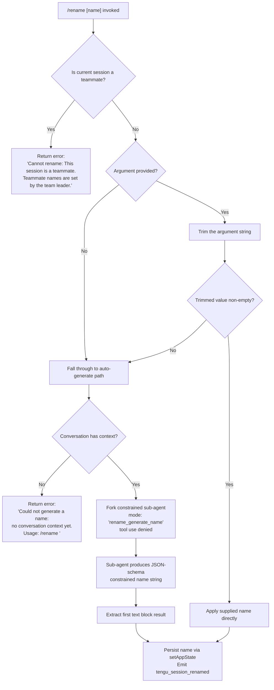

# `/rename`

> Analysis basis: CC v2.1.172 bundle.js (AST extraction + Claude interpretation)
> Minimum version: v2.1.172

---

## Overview

The `/rename` command (also accessible as `/name`) sets the display name of the current conversation session. When a name argument is supplied the command applies it directly; when no argument is supplied it forks a constrained agent sub-session that generates a name automatically from the conversation context. The result is persisted to app state and emitted as a telemetry event.

---

## Registration

| Field | Value |
|---|---|
| type | `local-jsx` |
| name | `rename` |
| description | `Rename the current conversation` |
| argumentHint | `[name]` |
| immediate | `true` |
| aliases | `["name"]` |
| module_id | `J1K` |
| load_inline | `true` |
| loc_byte | `12244862` |
| loc_byte_end | `12245061` |
| loc_line | `8392` |
| arbor_handler.name | `Cm7` |
| arbor_handler.fqn | `claude-2.1.172::Cm7` |
| arbor_handler.kind | `AsyncFunction` |
| arbor_handler.resolution_path | `module_id` |
| arbor_handler.n_hits | `0` |

Analysis basis: CC v2.1.172 bundle.js:+12244862

---

## Input Branching

There are four distinct execution paths based on session type and whether a name argument was provided.



Analysis basis: CC v2.1.172 bundle.js:+12244006 (teammate guard), +12244125 (trim), +12244237 (no-context error), +12242261 (generate mode literal)

---

## Behavioral Spec

### 1. Entry Point — Handler (`Cm7`)

```
async function renameCommandHandler(context, args):
    inputString = extractArgumentString(args)          // Cm7 → vp8
    sessionMetadata = getSessionMetadata(context)      // vp8 → _M → HT
    if sessionMetadata.isTeammate:
        return errorMessage(
            "Cannot rename: This session is a teammate. "
            "Teammate names are set by the team leader."
        )
    trimmedInput = inputString.trim()                  // vp8 → H.trim
    if trimmedInput is non-empty:
        applyName(context, trimmedInput)               // direct path
    else:
        generatedName = await generateNameFromContext(context)
        applyName(context, generatedName)
```

Analysis basis: CC v2.1.172 bundle.js:+12244558 (Cm7→vp8), +12244006 (teammate check), +12244125 (trim)

---

### 2. Session Metadata / Teammate Guard (`_M` → `HT`)

```
function getSessionMetadata(context):
    store = asyncLocalStorage.getStore()   // HT → EY_.getStore
    return store ?? defaultMetadata(index=0)
```

The teammate guard reads a boolean flag from the async-local session store. If the flag is set the command short-circuits with the hard-coded error string.
Analysis basis: CC v2.1.172 bundle.js:+12244006 (teammate error literal), +2267611 (_M→HT), +2266429 (HT→EY_.getStore)

---

### 3. Auto-Name Generation Path (`Ff6` → `Rm7` → `GT`)

When no explicit name is supplied the command invokes a forked sub-session:

```
async function generateNameFromContext(context):
    conversationHistory = getConversationMessages(context)  // Ff6 → Y6
    if conversationHistory is empty:
        return errorMessage(
            "Could not generate a name: no conversation context yet. "
            "Usage: /rename <name>"
        )
    // Record telemetry for fork event
    emit("tengu_rename_full_session_fork")                  // Y6 → N78 path

    subAgentConfig = {
        mode:    "rename_generate_name",
        tools:   "deny",                    // "Session name generation cannot use tools"
        origin:  "other",
        outputSchema: "json_schema"
    }
    response = await runForkedAgent(subAgentConfig, conversationHistory)
    // runForkedAgent internally calls GT which manages the API request lifecycle
    rawText = extractFirstTextBlock(response)               // Ep8
    trimmedName = sanitizeName(rawText)                     // j1K → xC → H.trim
    return trimmedName
```

Key literals observed:
- `"deny"` — tools are explicitly denied for the name-generation sub-agent (bundle.js:+12242143)
- `"Session name generation cannot use tools"` (bundle.js:+12242158)
- `"rename"` / `"rename_generate_name"` — mode identifiers (bundle.js:+12242237, +12242261)
- `"json_schema"` — output constrained to a JSON schema (bundle.js:+12243073)
- `"other"` — origin label (bundle.js:+12242222)

Analysis basis: CC v2.1.172 bundle.js:+12242698 (Ff6→Y6), +12242739 (Ff6→NqA), +12242758 (Ff6→Rm7)

---

### 4. Forked Agent Execution (`Rm7` → `GT`)

```
async function runForkedAgent(config, history):
    abortController = createAbortController()
    abortController.signal.addEventListener("abort", ...)   // Rm7 → H.addEventListener
    agentQuery = buildAgentQuery(config, history)           // GT
    agentQuery.tools = filterDeniedTools(agentQuery.tools)  // "deny" mode
    response = await executeAPIRequest(agentQuery)          // GT → HS8 → API layer
    if response.turns > defaultTurnLimit:
        emit("tengu_forked_agent_default_turns_exceeded")
    emit("tengu_fork_agent_query")
    return response
```

The forked agent follows the standard query lifecycle including streaming (`GT` → `HS8`), idle-timeout telemetry, and non-streaming fallback (`GT` → `pW7`).

Analysis basis: CC v2.1.172 bundle.js:+12242025 (Rm7→GT), +12241947 (Rm7→H.addEventListener), +10670943 (turns-exceeded telemetry), +10671386 (fork-query telemetry)

---

### 5. HTML-Entity Sanitisation (`Px8`)

The replacement utility `Px8` is called by the sanitisation layer and converts HTML special characters in candidate names using `String.replaceAll`:

- `&amp;` → `&` (bundle.js:+10991468)
- `&lt;` → `<` (bundle.js:+10991492)
- `&gt;` → `>` (bundle.js:+10991515)
- `&#13;` → carriage return (bundle.js:+10991539)
- `&#10;` → newline (bundle.js:+10991563)

Analysis basis: CC v2.1.172 bundle.js:+12243874 (Vp8→Px8), +10991451 (Px8→H.replaceAll)

---

### 6. Applying the Name (`vp8` → `_.setAppState`, `jXH`, `hJ`)

```
function applyName(context, name):
    context.setAppState({ sessionTitle: name })  // vp8 → _.setAppState
    updateFilesystemRecord(context, name)         // vp8 → jXH
    refreshDisplayTitle(context, name)            // vp8 → hJ
    emitSessionRenamedTelemetry(context)          // xR → tengu_session_renamed
```

The filesystem record update (`jXH`) uses an async file-watcher subsystem (`Tq` → `GW.stat` / `GW.readFile` / `GW.writeFile`) with atomic write via a random-bytes temp-file-then-rename pattern (`MO` → `nY_.randomBytes`, `O_H.writeFile`, `O_H.rename`).

Analysis basis: CC v2.1.172 bundle.js:+12244365 (setAppState), +12244407 (jXH), +12244411 (hJ), +13450611 (tengu_session_renamed telemetry)

---

### 7. Session-Title Log Entry (`xR`)

Two title-type labels are stamped on the log entry:

- `"custom-title"` — used when the name originates from explicit user input (bundle.js:+13450519)
- `"ai-title"` — used when the name was AI-generated (bundle.js:+13450684)

The log write uses `appendFileSync` with a fixed width of 384 / 448 bytes (bundle.js:+13449593, +13449637).

Analysis basis: CC v2.1.172 bundle.js:+13450519, +13450684

---

## State & Side Effects

| Item | Detail |
|---|---|
| Telemetry — primary | `tengu_session_renamed` (bundle.js:+13450611) — fired every time a name is successfully applied |
| Telemetry — fork | `tengu_rename_full_session_fork` (bundle.js:+12242701) — fired when auto-generation is triggered |
| Telemetry — fork turns | `tengu_forked_agent_default_turns_exceeded` (bundle.js:+10670943) — fired if the sub-agent exceeds turn budget |
| Telemetry — fork query | `tengu_fork_agent_query` (bundle.js:+10671386) |
| Telemetry — agent name set | `tengu_agent_name_set` (bundle.js:+13453640) |
| Telemetry — background state | `tengu_bg_state_read_transient` (bundle.js:+4226591) |
| Telemetry — config error | `tengu_config_parse_error` (bundle.js:+3314707) — propagated from config layer if config is malformed |
| appState changes | `sessionTitle` field updated via `setAppState` (bundle.js:+12244365) |
| Filesystem | Session record file updated atomically (temp-file + rename); directory created with `mkdirSync` if absent |
| Log append | Title entry appended via `appendFileSync`; labelled `"custom-title"` or `"ai-title"` |
| AbortController | A new `AbortController` is created for the auto-name sub-agent and wired to `"abort"` event (bundle.js:+12241947) |
| Tool use | Tool use is explicitly **denied** for the name-generation sub-agent (literal `"deny"`, bundle.js:+12242143) |
| Sound | <!-- TODO: not found in depth-2 traversal; needs --depth 4 --> |

---

## Version History

| Version | Change |
|---|---|
| v2.1.172 | Initial analysis |

---

## Common Mistakes

1. **Forgetting the space**: `/renamemy-session` is parsed as an argument `my-session` but only if the parser trims correctly — always include a space: `/rename my-session`.
2. **Running on a teammate session**: The command hard-blocks with an error when the current session is a teammate; the name must be changed by the team leader session.
3. **Expecting instant AI generation on an empty conversation**: If no messages have been exchanged yet the auto-generate path returns an error. Provide an explicit name argument instead: `/rename <name>`.
4. **Using the alias `/name` interchangeably**: `/name` is registered as a full alias and behaves identically, but some shell environments may intercept the word `name`; prefer `/rename` if issues arise.
5. **Assuming the name is only stored in memory**: The name is written atomically to disk and appended to the session log. Manually editing those files while a session is open may result in the in-memory state diverging.

---

## Appendix — Identifier Mapping

> For bundle debugging only. Identifiers change across versions.

| Identifier | Role |
|---|---|
| `Cm7` | Main async handler for `/rename` (arbor_handler; resolves via `module_id` from `J1K`) |
| `vp8` | Inner rename logic: teammate guard, trim, branch to direct or generated name |
| `Vp8` | HTML-entity sanitiser caller / argument pre-processor |
| `Px8` | HTML-entity `replaceAll` sanitiser |
| `_M` | Session metadata accessor (reads async-local store) |
| `HT` | Async-local storage store getter |
| `Ff6` | Auto-name generation orchestrator (fetches history, invokes forked agent) |
| `Y6` | Conversation history retrieval |
| `N78` | History deduplication / cache helper |
| `_J_` | Session fork event emitter / sub-session constructor |
| `qZ_` | Fork state builder |
| `b6` | Conversation record reader |
| `W7H` | Config / file-system access helper |
| `Gx4` | File watcher setup |
| `NqA` | Timestamp and rate-limit helper for generation |
| `Rm7` | Forked sub-agent runner; wires abort controller and calls `GT` |
| `GT` | Core API query executor for the sub-agent |
| `HS8` | API streaming state manager (getAppState / setAppState) |
| `HR` | Random-hex token generator |
| `pqH` | Request parameter builder |
| `N` | Log / debug message formatter |
| `ap` | Sub-agent lifecycle exit handler |
| `eC6` | Message-type membership checker (tombstone, notification, etc.) |
| `lBq` | Secondary message-type checker |
| `CMH` | Tool-filter helper (enforces deny list) |
| `pW7` | Non-streaming fallback executor |
| `U8` | Streaming I/O reader |
| `P` | Buffer-concat / newline-delimited stream parser |
| `X` | Stream timeout wrapper |
| `q` | Process exit / signal helper |
| `$1` | CLI error / exit coordinator |
| `j1K` | Name-string validator / trimmer |
| `xC` | String trim utility |
| `EH` | Error-to-string converter |
| `Ep8` | Response text-block extractor (first text block from sub-agent output) |
| `GR` | Session-persist coordinator (calls `Xb8`, `CpH`, etc.) |
| `Xb8` | Conversation record writer (read/hash/write JSON) |
| `eE` | Message normalisation and context-assembly pipeline |
| `V07` | Message mapper for API format |
| `CpH` | Agent query builder (calls `CWK`) |
| `cqA` | Fallback-request record builder |
| `CWK` | Full API request lifecycle manager (model selection, retries, streaming, tool dispatch) |
| `FG` | Feature-flag / context helper |
| `AW` | Auth-key resolver |
| `c_` | API provider backend selector (foundry, anthropicAws, mantle, vertex) |
| `wL` | API base-URL resolver |
| `DY_` | Managed-key prefix checker (`/login managed key`, `sk-ant-`) |
| `J9` | Auth token cache |
| `kDH` | Network-layer configuration builder |
| `QE` | Query execution entry point |
| `Gf` | Tool-list filter |
| `JmH` | Main REPL / interactive session orchestrator |
| `y6` | React JSX element factory (display) |
| `rk` | Render helper |
| `lM` | Layout component |
| `YC` | Title-bar component |
| `P_` | Path display component |
| `xR` | Session log appender / title emitter |
| `Jh` | Log record formatter |
| `vOH` | Append-file-sync writer with mkdirSync |
| `$4` | Log-level timestamp helper |
| `wHH` | Log-write + emit wrapper |
| `DG` | Display-graph renderer |
| `qHH` | Promise-resolve passthrough |
| `M` | MCP client manager |
| `yRH` | MCP session initialiser / server runner |
| `qi` | MCP server config parser |
| `QV` | MCP capability negotiator |
| `K` | MCP tool-list formatter |
| `g8` | Generic identity / passthrough helper |
| `Jc9` | MCP connection health checker |
| `Jj8` | MCP debug log helper |
| `Yj8` | MCP trace helper |
| `j8` | MCP debug-push helper |
| `sJ8` | OAuth authentication tool handler |
| `tJ8` | OAuth callback URL handler |
| `Vc9` | MCP reconnect handler |
| `XU_` | MCP auth-skip helper |
| `j` | Process kill / cleanup helper |
| `pN` | MCP skills telemetry emitter |
| `qU_` | MCP capability inclusion checker |
| `k` | MCP client wrapper |
| `OL` | MCP error logger |
| `Gc9` | MCP feature-flag checker |
| `ZH6` | parseInt wrapper for MCP port parsing |
| `sX8` | parseInt wrapper (secondary) |
| `Ln8` | MCP connection-result applier |
| `kRH` | MCP result mapper |
| `r0` | MCP cleanup coordinator |
| `$` | MCP slot manager |
| `TwK` | MCP slot ticker |
| `nWA` | MCP remote-server retry orchestrator |
| `mJ8` | MCP slot-filter (OWL / $U_ set membership) |
| `d8` | Retry timer with clearTimeout |
| `TH6` | MCP connection state updater |
| `BqH` | Background job queue |
| `X$H` | Agent-name record writer (writes `"agent-name"` entry) |
| `Kl` | Session-name persistence helper (reads/writes via `$j6`) |
| `$j6` | File read/write helper for session name record |
| `t4` | Tool-use hook registrar |
| `_VH` | Hook dispatch helper |
| `nx8` | AppState key enumerator |
| `jXH` | File-watcher and session-record updater |
| `Hf` | Path join helper |
| `iE` | Path join + `A_` resolver |
| `Tq` | Async file-stat/read/write with deduplication set |
| `R8` | `N8` (node-error) wrapper |
| `a7` | `N8` alternate wrapper |
| `NJ` | Cache-entry deleter |
| `m7` | Atomic write (random bytes temp + rename) |
| `MO` | Low-level atomic-write implementation |
| `yz` | File-write permission checker |
| `SH` | Error-log appender and log-buffer manager |
| `JA` | Error constructor wrapper |
| `f6` | String conversion utility |
| `Rq` | Essential-traffic flag reader |
| `fRf` | Log-buffer shift/push (circular buffer) |
| `hJ` | Display-title refresh (basename + y6) |
| `uV6` | MCP tool de-duplication helper |
| `BG` | Base React/JSX runtime |
| `CH` | `JSON.stringify` wrapper |
| `n6` | `JSON.parse` wrapper |
| `N8` | Node error-code helper |
| `hFq` | Conversation cache helper |
| `p6` | Platform path helper |
| `XG` | AppState reader |