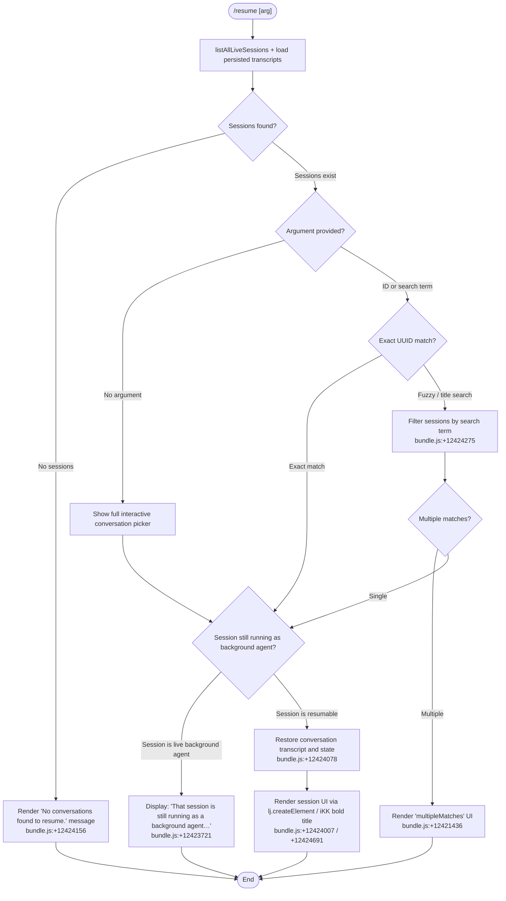

# `/resume`

> Analysis basis: CC v2.1.172 bundle.js (AST extraction + Claude interpretation)
> Minimum version: v2.1.172

---

## Overview

`/resume` (aliased as `/continue`) lets the user pick a previous Claude Code conversation and reload it into the current session. The command queries all live and persisted sessions, filters them by an optional conversation ID or free-text search term supplied by the user, then renders an interactive picker UI through which the selected conversation's transcript and state are restored.

---

## Registration

| Field | Value |
|---|---|
| type | `local-jsx` |
| name | `resume` |
| description | `Resume a previous conversation` |
| aliases | `["continue"]` |
| argumentHint | `[conversation id or search term]` |
| module_id | `aKK` |
| load_inline | `true` |
| loc_byte | `12425119` |
| loc_byte_end | `12425316` |
| loc_line | `8580` |
| arbor_handler.name | `pF7` |
| arbor_handler.fqn | `claude-2.1.172::pF7` |
| arbor_handler.kind | `AsyncFunction` |
| arbor_handler.resolution_path | `module_id` |
| arbor_handler.n_hits | `0` |

Analysis basis: CC v2.1.172 bundle.js:+12425119

---

## Input Branching

Five distinct behavioral branches are identifiable from the callGraph and literals, so a Mermaid flowchart is used.



---

## Behavioral Spec

### 1. Session Discovery (`listSessionsAndFilterHandler`)

```
async function listSessionsAndFilterHandler(arg):
    liveSessions = await listAllLiveSessions()          // m3H → A.listAllLiveSessions
    persistedSessions = await loadPersistedTranscripts() // x3H: Date.now, worktree detection
    allSessions = merge(liveSessions, persistedSessions)

    if allSessions is empty:
        return renderMessage("No conversations found to resume.")
    return allSessions
```

Analysis basis: CC v2.1.172 bundle.js:+12423637, +9279097, +12424156

`m3H` resolves live sessions via `Promise.resolve` and `A.listAllLiveSessions`. The string `"interactive"` (bundle.js:+9279188) is used to discriminate session types. Worktree detection emits telemetry event `tengu_worktree_detection` (bundle.js:+9268831) and runs `git worktree list --porcelain` (literals at +9268742, +9268749) to map the current working directory to a project context.

### 2. Background-Agent Guard (`backgroundAgentGuard`)

```
function backgroundAgentGuard(session):
    if session.isLiveBackgroundAgent:
        displayError(
            "That session is still running as a background agent. " +
            "Open `claude agents` to attach to it, or stop it there first to resume here."
        )
        return BLOCKED
    return ALLOWED
```

Analysis basis: CC v2.1.172 bundle.js:+12423711, +12423721

The literal string at +12423721 is the exact user-facing error message. The check occurs before any transcript restore is attempted.

### 3. Search and Filter (`searchAndFilterSessions`)

```
function searchAndFilterSessions(sessions, arg):
    if arg is undefined or empty:
        return sessions   // show all in picker

    // Try exact UUID match first
    exactMatch = sessions.find(s => s.id == arg)
    if exactMatch:
        return [exactMatch]

    // Fall back to case-insensitive title / last-prompt search
    term = arg.toLowerCase()
    matches = sessions.filter(s =>
        s.title.toLowerCase().includes(term) or
        s.lastPrompt.toLowerCase().includes(term)
    )

    if matches.length == 0:
        renderNotFound(sessionNotFoundUI)    // "sessionNotFound" literal +12421365
    else if matches.length > 1:
        renderMultipleMatches(matches)       // "multipleMatches" literal +12421436
    else:
        return matches
```

Analysis basis: CC v2.1.172 bundle.js:+12424275, +12424289, +12421365, +12421436

`Nr` (the session-filter coordinator) calls `x3H` for worktree-relative path normalization and `PPK` for transcript directory scanning. Session metadata keys tracked include `"summary"`, `"last-prompt"`, `"custom-title"`, and `"ai-title"` (literals at +13462990, +13463057, +13463153, +13463231).

### 4. Transcript Restoration (`restoreConversationState`)

```
async function restoreConversationState(session):
    transcript = await loadTranscriptFromDisk(session.path)  // IqH, T65, G65
    state = buildConversationState(transcript)               // q96 → XPK → IqH
    applySessionMetadata(state, session)                     // U3H metadata maps
    renderConversationUI(state)                              // lj.createElement +12424007
```

Analysis basis: CC v2.1.172 bundle.js:+12424078, +12424082, +12424096

The restore path calls `x3H` (worktree-aware session locator), `u_` (conversation runner bootstrap), and `q96` (full state-machine initialiser which populates maps for message types including `"assistant"`, `"user"`, `"system"`, `"attachment"`, `"tool_result"`, `"compact_boundary"`).

Metadata keys written during restore include `"mode"`, `"permission-mode"`, `"isolation-latch"`, `"worktree-state"`, `"agent-name"`, `"agent-color"`, and `"agent-setting"` (literals at +13463592–+13463977).

### 5. Telemetry Emission (`emitResumeSessionTelemetry`)

```
function emitResumeSessionTelemetry(event, payload):
    // Fired with slash_command_session_id and slash_command_title
    // at resolution time and UI render time
    emit("slash_command_session_id", sessionId)   // literal +12424417
    emit("slash_command_title", sessionTitle)      // literal +12424641
```

Analysis basis: CC v2.1.172 bundle.js:+12424417, +12424641

### 6. Interactive Picker UI (`renderPickerUI`)

```
function renderPickerUI(sessions):
    // iKK applies bold formatting via W6.bold (+12421400)
    // pF7 calls lj.createElement to build JSX list (+12424007)
    // Date.now() stamps each picker entry (+12424033)
    // s$H provides styled container component (+12424523)
    // Ig validates UUID format via KyL.test (+12424257)
    sortedSessions = sessions.sortBy(mtime descending)
    for session in sortedSessions:
        row = createElement(SessionRow, {
            id: session.id,
            title: boldFormat(session.title),
            timestamp: Date.now()
        })
    return render(pickerContainer, rows)
```

Analysis basis: CC v2.1.172 bundle.js:+12424007, +12424033, +12424257, +12424691, +12424523

---

## State & Side Effects

| Item | Detail |
|---|---|
| Telemetry | `tengu_worktree_detection` (+9268831); `tengu_daemon_control` (+16796987); `tengu_bg_attach` (+16751796); `tengu_bg_attach_stall_gave_up` (+16752719); `tengu_bg_attach_stall_respawn` (+16752989); `tengu_bg_attach_kick` (+16753939); `tengu_bg_attach_upgrade` (+13266843); `tengu_transcript_phantom_parent` (+13461765); `tengu_transcript_parent_cycle` (+13465570); `tengu_chain_parent_cycle` (+13443253); `tengu_chain_timestamp_fallback` (+13443402); `tengu_chain_parallel_tr_recovered` (+13445268); `tengu_relink_walk_broken` (+13442763); `tengu_feature_ok` (+1016269); `tengu_feature_bad` (+1016336) |
| Slash command properties emitted | `slash_command_session_id` (+12424417); `slash_command_title` (+12424641) |
| appState changes | Conversation transcript maps (`IqH`/`q96`), session metadata keys (`mode`, `permission-mode`, `isolation-latch`, `worktree-state`, `agent-name`, `agent-color`, `agent-setting`, `summary`, `last-prompt`, `custom-title`, `ai-title`, `pr-link`, `bridge-session`, etc.) |
| Disk I/O | Reads transcript files via `gK.readFile`/`T65`/`G65`; reads directory listings via `gK.readdir`/`PPK`; resolves real paths via `gK.realpath` |
| Worktree detection | Runs `git worktree list --porcelain` to identify active worktrees |
| Background-agent block | No side effects if session is a live background agent — displays error and exits |
| Sound | None detected in depth-2 traversal |

---

## Version History

| Version | Change |
|---|---|
| v2.1.172 | Initial analysis |

---

## Common Mistakes

1. **Using `/resume` while a session is running as a background agent** — The command will show the error "That session is still running as a background agent. Open `claude agents` to attach to it, or stop it there first to resume here." instead of resuming. Use `/agents` to manage or stop it first.
2. **Providing a partial search term that matches multiple sessions** — The command enters a `multipleMatches` disambiguation UI rather than immediately resuming. Provide a more specific term or the exact UUID to bypass this.
3. **Expecting `/resume` to work outside a git worktree context** — Session discovery is worktree-aware; sessions recorded in a different worktree root may not appear in the picker for the current working directory.
4. **Confusing `/resume` with `/continue`** — Both are functionally identical (`continue` is a registered alias). Either works, but documentation and UI labels consistently use `resume`.
5. **Assuming all historical sessions are always listed** — Only sessions whose transcript files are discoverable on disk (via the configured projects directory) and live sessions reported by the daemon are shown. Sessions from a different machine or a wiped projects folder will not appear.

---

## Appendix — Identifier Mapping

> For bundle debugging only. Identifiers change across versions.

| Identifier | Role |
|---|---|
| `pF7` | Main async handler for `/resume` command (arbor_handler) |
| `oKK` | Command registration filter / session list pre-processor |
| `m3H` | Live session loader (`listAllLiveSessions` wrapper) |
| `x3H` | Worktree-aware session path resolver |
| `u_` | Conversation runner / session bootstrap |
| `BvH` | Process/child-process manager for background sessions |
| `Nr` | Session search-and-filter coordinator |
| `q96` | Full conversation state-machine initialiser |
| `XPK` | State initialiser sub-step (calls `IqH`) |
| `IqH` | Transcript state map builder (populates all metadata maps) |
| `U3H` | Conversation metadata aggregator |
| `PPK` | Transcript directory scanner / file collector |
| `Sp6` | Project-path resolver for session files |
| `tpH` | Transcript file reader and parser |
| `T65` | Binary transcript parser (low-level buffer operations) |
| `G65` | Transcript record decoder |
| `p3H` | Chain builder (orders transcript records by parent UUID) |
| `O65` | Parallel-chain resolver for branched transcripts |
| `L65` | Chain sort and deduplication helper |
| `YPK` | Chain map updater |
| `lXK` | Session index loader and cacher |
| `f65` | Transcript walk helper (link-repair logic) |
| `Lg8` | Timestamp parser for session sorting |
| `A96` | Session metadata mapper |
| `rYA` | Compact-summary text processor |
| `UYA` | Unified session-entry assembler |
| `aYA` | Attachment/image presence checker |
| `z65` | Array-trim validator |
| `w65` | Array-some validator |
| `iu6` | Message content normaliser |
| `TK` | Regex-based text tokeniser |
| `Mg8` | Session metadata getter/setter cache |
| `$g8` | Session metadata value extractor |
| `iKK` | Bold-text formatter for picker UI |
| `Ig` | UUID format validator |
| `s$H` | Styled container component for picker UI |
| `YU8` | Context path provider for session display |
| `SH` | Structured error logger / error reporting helper |
| `EH` | Error message stringifier |
| `JA` | Error constructor wrapper |
| `f6` | String coercion utility |
| `Rq` | Telemetry routing helper |
| `yBA` | Telemetry payload builder |
| `fRf` | Telemetry queue manager (shift/push) |
| `ge` | Session UI React component |
| `P_` | Project root resolver |
| `BG` | Base configuration getter |
| `Fn` | Projects directory path builder |
| `dO` | Path normalisation (NFC Unicode) |
| `TwK` | Daemon status file reader (`daemon.status.json`) |
| `km6` | Daemon status path builder |
| `d9` | AsyncLocalStorage store accessor |
| `CH` | JSON stringify helper |
| `n6` | JSON parse helper |
| `GVH` | Transcript JSON record parser |
| `ivH` | Binary-to-JSON transcript bridge |
| `Zxf` | BOM-stripping JSON parser |
| `vxf` | Substring JSON extractor |
| `Vxf` | Multi-record JSON line parser |
| `N8` | File-system path utilities |
| `l8f` | File content loader with size check |
| `lf` | Source location extractor |
| `rFH` | Path overlap checker |
| `g8f` | Configuration file reader |
| `Nd6` | Message parent-link resolver |
| `Vd6` | UUID validity tester |
| `tvA` | Text replacement normaliser |
| `mJ` | Message deduplication map |
| `H1` | Module feature-flag getter |
| `T9` | File-system error classifier |
| `kRH` | MCP update applicator |
| `iH5` | Session index header parser |
| `ip` | Index pointer helper |
| `E65` | Index file reader (sync) |
| `C` | PTY write / clear-timeout helper |
| `x` | Session teardown (emit close/end) |
| `yRH` | MCP connection initialiser |
| `Ln8` | MCP client lifecycle manager |
| `nWA` | MCP slot reconciler |
| `HH` | MCP state applicator |
| `t` | MCP pending-update tracker |
| `D` | Daemon session-slot manager |
| `B0A` | Daemon socket connect handler |
| `l0A` | Daemon session lifecycle handler |
| `Y6` | Daemon worker registry |
| `Q` | Daemon IPC socket connection manager |
| `d8` | Abort-controller / timeout wrapper |
| `y` | Background-worker sweep scheduler |
| `l` | Grace-clock / scheduled-task manager |
| `R` | PTY output writer |
| `S` | PTY session wrapper |
| `n` | Voice / foreground session runner |
| `s` | Session recorder wrapper |
| `fH` | Focus-gain recording initiator |
| `WJK` | Worker memory monitor |
| `Mp6` | Memory freemem reporter |
| `IF8` | Worker upgrade checker |
| `hF8` | macOS memory pressure helper |
| `l06` | Config file loader (JSON) |
| `A6` | Module feature initialiser |
| `g8` | Generic identity/pass-through helper |
| `ubf` | String-coercion utility (path join) |
| `v3` | Version string constant |
| `YC` | Base configuration secondary getter |
| `E0` | Directory listing helper |
| `Z65` | Session file path resolver |
| `Zp6` | Metadata tree get/set helper |
| `Sw` | Path segment slicer |
| `IEH` | File-content chunk builder |
| `FYA` | Recursive directory file scanner |
| `WPK` | File hash / size calculator |
| `JPK` | Byte-at-position accessor |
| `KH` | Buffer comparison/slice helper |
| `W65` | Buffer compare wrapper |
| `S65` | Session directory bootstrapper |
| `M1` | File stat helper |
| `Pa` | OLH path join wrapper |
| `TwK` | Daemon status JSON reader |

Note: index built via Arbor fallback; some signals (telemetry, literals) may be missing — see arbor-fallback.js.