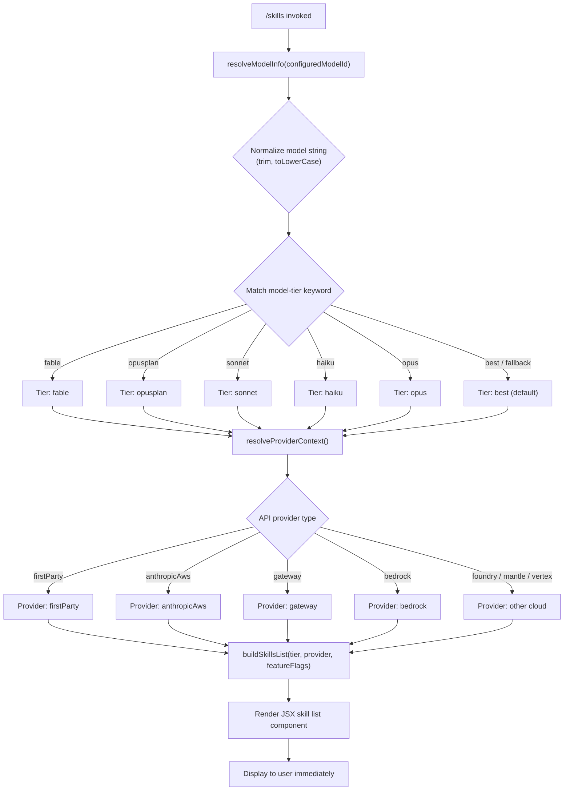

# `/skills`

> Analysis basis: CC v2.1.170 bundle.js (AST extraction + Claude interpretation)
> Minimum version: v2.1.170

---

## Overview

The `/skills` command lists the skills (capabilities) that are available to Claude Code in the current session. It is a `local-jsx` command that renders its output as a React component immediately upon invocation, without sending a prompt to the model. The command resolves the active model tier, API provider, and available feature flags to determine and display the skill set.

---

## Registration

| Field | Value |
|---|---|
| type | `local-jsx` |
| name | `skills` |
| description | `List available skills` |
| loc_byte | `12422461` |
| loc_byte_end | `12422593` |
| loc_line | `8689` |
| immediate | `true` |
| module_id | `s9K` |
| load_inline | `true` |
| arbor_handler.name | `Upf` |
| arbor_handler.fqn | `claude-2.1.170::Upf` |
| arbor_handler.kind | `AsyncFunction` |
| arbor_handler.resolution_path | `module_id` |
| arbor_handler.n_hits | `0` |

Analysis basis: CC v2.1.170 bundle.js:+12422461

---

## Input Branching

The command branches across five or more distinct paths based on model tier classification and API provider. A Mermaid flowchart is used per the writing rules.



---

## Behavioral Spec

### Top-Level Handler

The handler `Upf` (AsyncFunction, resolved via `module_id` → `s9K`) is the entry point for `/skills`. It calls the React element factory to construct a JSX component and delegates to the skill-list builder function.

Analysis basis: CC v2.1.170 bundle.js:+12422276

```
async function skillsCommandHandler(context):
    element = createElement(SkillsListComponent, props)
    skillData = buildSkillsDisplay(context)
    return element(skillData)
```

### Model Resolution (`resolveModelInfo`)

The function corresponding to `U2` accepts the currently configured model identifier string and normalizes it before classification.

Analysis basis: CC v2.1.170 bundle.js:+2253368

```
function resolveModelInfo(rawModelId):
    normalized = normalizeModelString(rawModelId)   // trim + toLowerCase
    tier = classifyModelTier(normalized)
    hasInferenceProfile = checkInferenceProfile(normalized)  // "application-inference-profile"
    hasFlagOverride = checkFeatureFlagSet(normalized)        // uML.has lookup
    return { tier, hasInferenceProfile, hasFlagOverride }
```

- The literal `4` at bundle.js:+2253360 and `3` at bundle.js:+2253445 appear as numeric constants in this resolution path, likely representing tier rank values or array indices used during model priority ordering.
- The string `"application-inference-profile"` (bundle.js:+2253250) is tested via `H.includes` to detect AWS inference-profile model IDs.

### Model String Normalization (`normalizeModelString`)

The function corresponding to `B9` performs multi-step normalization of the raw model string before tier matching.

Analysis basis: CC v2.1.170 bundle.js:+2255248

```
function normalizeModelString(raw):
    step1 = raw.trim()
    step2 = step1.toLowerCase()
    step3 = applyProviderPrefixStrip(step2)   // _w / kLH path
    step4 = step3.replace(...)                 // A.replace normalization
    step5 = checkProviderInclusion(step4)      // Uc / MNH.includes
    step6 = applyFableTagExpansion(step4)      // Lw6 → "[1m]" tag, "fable" literal
    step7 = applyOpusPlanTier(step4)           // Sv / Y7 → "opusplan"
    step8 = applyFallbackTier(step4)           // flH → Y7
    step9 = applyExplicitOpusTier(step4)       // AE → "opus"
    step10 = applyYt1Enrichment(step4)         // yT1 → NLH / Lw6 / Uh / AE
    step11 = applyYfTransform(step4)           // Yf transform
    step12 = applyC8Inclusion(step4)           // C_8 → mML.includes
    step13 = applyMlHTransform(step4)          // MlH → _6 → String
    step14 = step4.replace(...)                // final _.replace
    return step14
```

The known model-tier keyword literals surfaced in this path:
- `"fable"` (bundle.js:+2255343) — matches the fable model family
- `"[1m]"` (bundle.js:+2255367) — internal tag string appended during fable expansion
- `"opusplan"` (bundle.js:+2255382) — matches opus-plan tier
- `"sonnet"` (bundle.js:+2255423) — matches sonnet-family models
- `"haiku"` (bundle.js:+2255462) — matches haiku-family models
- `"opus"` (bundle.js:+2255501) — matches opus-family models
- `"best"` (bundle.js:+2255538) — default/best-available tier fallback

### Canonical Model Version Table (`buildCanonicalModelList`)

The function corresponding to `W1` constructs the ordered canonical model list used to map short-form tier keywords to fully qualified model identifiers. The following string constants are used as canonical version IDs (in order of appearance):

| Canonical Model ID | loc_byte |
|---|---|
| `claude-fable-5` | +2252113 |
| `claude-mythos-5` | +2252168 |
| `claude-opus-4-8` | +2252225 |
| `claude-opus-4-7` | +2252282 |
| `claude-opus-4-6` | +2252339 |
| `claude-opus-4-5` | +2252396 |
| `claude-opus-4-1` | +2252453 |
| `claude-opus-4-0` | +2252542 |
| `claude-sonnet-4-6` | +2252574 |
| `claude-sonnet-4-5` | +2252635 |
| `claude-sonnet-4-0` | +2252730 |
| `claude-haiku-4-5` | +2252764 |
| `claude-3-7-sonnet` | +2252823 |
| `claude-3-5-sonnet` | +2252884 |
| `claude-3-5-haiku` | +2252945 |
| `claude-3-opus` | +2253004 |
| `claude-3-sonnet` | +2253057 |
| `claude-3-haiku` | +2253114 |

Analysis basis: CC v2.1.170 bundle.js:+2253207

```
function buildCanonicalModelList():
    // Ordered list of known model version strings, newest-first
    models = [
        "claude-fable-5", "claude-mythos-5",
        "claude-opus-4-8", ..., "claude-opus-4-0",
        "claude-sonnet-4-6", ..., "claude-sonnet-4-0",
        "claude-haiku-4-5",
        "claude-3-7-sonnet", "claude-3-5-sonnet", "claude-3-5-haiku",
        "claude-3-opus", "claude-3-sonnet", "claude-3-haiku"
    ]
    return models
```

### Model ID Matching (`matchCanonicalModelId`)

The function `eJ` performs the actual string search against the canonical list.

Analysis basis: CC v2.1.170 bundle.js:+2252086

```
function matchCanonicalModelId(inputId, canonicalList):
    normalized = inputId.toLowerCase()
    for candidate in canonicalList:
        if normalized.includes(candidate):
            return candidate
        if normalized matches inferenceProfilePattern:   // "application-inference-profile"
            return extractBaseModelFromProfile(normalized)
    result = applyFinalReplacement(normalized)   // eJ → H.replace
    return result
```

- The string `"anthropic."` (bundle.js:+2247002) is tested via `K.startsWith` to detect first-party Anthropic model IDs during provider resolution in the `Uh` path.

### Provider Context Resolution

The function `r_` resolves the API provider context and surfaces the following provider-type string constants:

| Provider String | loc_byte |
|---|---|
| `"firstParty"` | +2106660 |
| `"anthropicAws"` | +2106678 |
| `"gateway"` | +2106698 |
| `"bedrock"` | +2106005 |
| `"foundry"` | +2106055 |
| `"mantle"` | +2106165 |
| `"vertex"` | +2106213 |

Analysis basis: CC v2.1.170 bundle.js:+2105965

```
function resolveProviderContext(config):
    if config matches firstParty:   return "firstParty"
    if config matches anthropicAws: return "anthropicAws"
    if config matches gateway:      return "gateway"
    if config matches bedrock:      return "bedrock"
    if config matches foundry:      return "foundry"
    if config matches mantle:       return "mantle"
    if config matches vertex:       return "vertex"
    return "firstParty"   // default
```

### Feature Flag Checks

The `yT1` → `NLH` sub-path performs feature-flag lookups that gate certain skills.

Analysis basis: CC v2.1.170 bundle.js:+2249581

```
function resolveFeatureFlags(modelInfo):
    flags = {}
    flags.base        = lookupBaseFlag(modelInfo)          // NLH → r_
    flags.fl          = lookupFlFlag(modelInfo)             // NLH → FL
    flags.tDH         = lookupTdhFlag(modelInfo)            // NLH → tDH
    flags.onhFlag     = lookupOnhFlag(modelInfo)            // NLH → ONH
    flags.lw6Enriched = applyLw6Enrichment(modelInfo)       // yT1 → Lw6
    flags.uhParsed    = parseUhSkills(modelInfo)            // yT1 → Uh
    flags.aeResolved  = resolveAeSkills(modelInfo)          // yT1 → AE
    return flags
```

### Skill List Rendering

The resolved tier, provider, and feature flags are composed into a JSX element via `g5A.createElement` and returned as immediate output.

Analysis basis: CC v2.1.170 bundle.js:+12422276

```
function renderSkillsComponent(tier, provider, flags):
    props = {
        tier:     tier,
        provider: provider,
        flags:    flags
    }
    return createElement(SkillsListComponent, props)
```

The `immediate: true` registration flag means the component is rendered and displayed without any model round-trip.

---

## State & Side Effects

| Item | Detail |
|---|---|
| Telemetry | None found in depth-2 traversal |
| Hook registration | None detected |
| appState changes | None detected (read-only display command) |
| Sound | None detected |
| Model round-trip | None — `immediate: true`; output is pure local JSX render |
| Canonical model list | Read from bundle-internal constant array; not fetched from network |
| Feature flags | Read from in-memory config/state; no writes |

---

## Version History

| Version | Change |
|---|---|
| v2.1.170 | Initial analysis |

---

## Common Mistakes

1. **Expecting a model response**: `/skills` is `immediate: true` and renders locally. It does not send a message to Claude and will not produce a conversational reply.
2. **Assuming the skills list is static**: The output is dynamically composed from the active model tier and API provider context, so the list may differ between firstParty and Bedrock/Vertex deployments.
3. **Confusing tier keywords with full model IDs**: The tier keywords (`fable`, `sonnet`, `haiku`, `opus`, `best`, etc.) are internal normalization tokens; the canonical model IDs (e.g. `claude-opus-4-5`) are what ultimately appear in the output and in API calls.
4. **Missing inference-profile models**: Models routed through AWS application inference profiles are detected by the `"application-inference-profile"` substring check (bundle.js:+2253250) and handled separately from direct model IDs.
5. **Expecting telemetry events**: No `tengu_*` telemetry events are emitted by this command at depth-2 traversal depth.

---

## Appendix — Identifier Mapping

> For bundle debugging only. Identifiers change across versions.

| Identifier | Role |
|---|---|
| `Upf` | Top-level handler for `/skills` (AsyncFunction; arbor_handler) |
| `U2` | Model resolution entry point — resolves tier, inference-profile, and feature-flag override |
| `B9` | Model string normalization pipeline (trim → toLowerCase → tier matching) |
| `H` | String utility / random/setTimeout helper used inside normalization |
| `_` | Raw model string variable, subject to replace/normalization |
| `_w` | Provider prefix stripping helper |
| `kLH` | Inner helper called by provider prefix stripper |
| `A` | String with toLowerCase/replace applied during normalization |
| `f` | Connection/close utility (A.close / q.close) |
| `Uc` | Provider inclusion checker (MNH.includes) |
| `Lw6` | Fable-tag expansion helper (produces `"[1m]"` annotation) |
| `Y7` | Tier classification aggregator (calls NBH, _7L, Ew1, H88, r_) |
| `Sv` | Opusplan tier resolver (calls Yf + Y7) |
| `Yf` | r_ wrapper / provider-flag transformer |
| `flH` | Fallback tier resolver (calls Y7) |
| `AE` | Explicit opus tier resolver (calls r_, Y7, Yf) |
| `r_` | Provider context resolver (returns provider-type string; calls _6) |
| `yT1` | Feature-flag enrichment entry (calls NLH, Lw6, Uh, AE) |
| `NLH` | Feature-flag detail resolver (calls r_, FL, tDH, ONH) |
| `Uh` | Skill-list parser (processes model string array via map/trim/startsWith/includes) |
| `C_8` | mML-inclusion checker |
| `MlH` | _6/String transform helper |
| `_6` | Low-level String coercion utility |
| `W1` | Canonical model list builder (_88 + eJ + Er8 + E3) |
| `_88` | Object.entries iterator over model registry (calls Q_) |
| `Q_` | PB (priority/bucket) lookup for model entries |
| `eJ` | Canonical model ID matcher (toLowerCase + includes + replace) |
| `Er8` | Auxiliary model lookup helper |
| `E3` | Final model string replacement helper (H.replace) |

---

Note: index built via Arbor fallback; some signals (telemetry, literals) may be missing — see arbor-fallback.js.