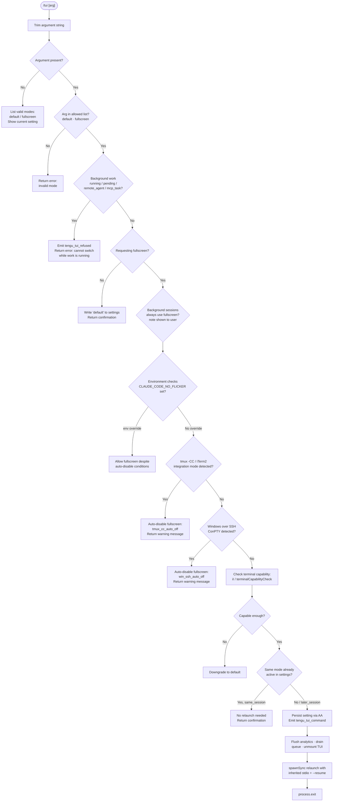

# `/tui`

> Analysis basis: CC v2.1.172 bundle.js (AST extraction + Claude interpretation)
> Minimum version: v2.1.172

---

## Overview

The `/tui` command allows the user to switch the terminal UI renderer between `default` and `fullscreen` modes at runtime. It validates the requested mode against a set of compatibility constraints (background work state, terminal environment, platform restrictions), persists the selection to settings, and — when necessary — relaunches the Claude Code process under the new renderer. Background sessions always use the fullscreen renderer regardless of this setting.

---

## Registration

| Field | Value |
|---|---|
| type | `local-jsx` |
| name | `tui` |
| description | `Set the terminal UI renderer (default \| fullscreen)` |
| argumentHint | `[default\|fullscreen]` |
| module_id | `f7K` |
| load_inline | `true` |
| loc_byte | `12632144` |
| loc_byte_end | `12632326` |
| loc_line | `8899` |
| arbor_handler.name | `$d7` |
| arbor_handler.fqn | `claude-2.1.172::$d7` |
| arbor_handler.kind | `AsyncFunction` |
| arbor_handler.resolution_path | `module_id` |
| arbor_handler.n_hits | `0` |

Analysis basis: CC v2.1.172 bundle.js:+12632144

---

## Input Branching

The handler exhibits six or more distinct decision paths (argument validation, background-work guard, environment auto-disable checks, platform guard, settings comparison, and relaunch sequencing), so a Mermaid flowchart is used.



Analysis basis: CC v2.1.172 bundle.js:+12629907 (handler entry), +12630183 (mode list build), +12630700 (background-work guard), +12630743 (refused message), +12631175 (telemetry emit), +12631701 (relaunch sequence)

---

## Behavioral Spec

### 1. Argument Parsing and Mode Validation

```
async function tuiCommandHandler(args, context):
    rawArg = args.trim()                        // bundle.js:+12629907

    allowedModes = buildModeList()              // dU8 — bundle.js:+12630183
    // allowedModes is derived from Array.from + flatMap; includes "default" and "fullscreen"

    if rawArg is empty:
        display currentSetting + allowedModes join(", ")
        return

    if NOT allowedModes.includes(rawArg):       // bundle.js:+12630065
        return errorResult("invalid mode: " + rawArg + ". Valid: " + allowedModes.join(", "))

    requestedMode = rawArg
```

Analysis basis: CC v2.1.172 bundle.js:+12629907, +12630019, +12630065

### 2. Background-Work Guard

```
    activeSessions = Object.values(sessionMap)  // bundle.js:+12630574
    busyStates = ["running", "pending", "remote_agent", "mcp_task"]
                                                // bundle.js:+12630613–12630681

    if any session.state in busyStates:
        emit telemetry("tengu_tui_refused")     // bundle.js:+12630702
        return errorResult(
            "Cannot switch renderers while work is running in the background — " +
            "wait for it to finish (or stop it via /tasks), then run /tui again."
        )
        // literal at bundle.js:+12630743
```

Analysis basis: CC v2.1.172 bundle.js:+12630574, +12630702

### 3. Background-Session Renderer Note

When the user requests `fullscreen`, the handler surfaces a fixed informational note before proceeding:

> "Background sessions always use the fullscreen renderer so scrolling and mouse work when attached. The tui setting applies to sessions started directly with `claude`."

(literal at bundle.js:+12630217 — short citation: `"Background sessions always use"`)

This note is non-blocking; execution continues.

### 4. Environment and Platform Compatibility Checks (via `terminalCompatibilityResolver`)

```
function terminalCompatibilityResolver(requestedMode):
    // iI — bundle.js:+12631042

    if requestedMode != "fullscreen":
        return { mode: requestedMode, reason: null }

    envFlag = process.env["CLAUDE_CODE_NO_FLICKER"]    // bundle.js:+12627260
    altScreen = process.env["CLAUDE_CODE_DISABLE_ALTERNATE_SCREEN"]
                                                        // bundle.js:+12627285
    forceUpsell = process.env["CLAUDE_CODE_FORCE_FULLSCREEN_UPSELL"]
                                                        // bundle.js:+12627324

    // tmux -CC (iTerm2 CC integration) detection
    if tmuxCCDetected() AND NOT envFlag:
        return { mode: "default", reason: "tmux_cc_auto_off",
                 message: "fullscreen disabled: tmux -CC (iTerm2 integration mode) detected · " +
                          "set CLAUDE_CODE_NO_FLICKER=1 to override" }
                 // literal bundle.js:+3503587

    // Windows over SSH (ConPTY) detection
    if platform == "windows" AND sshSession AND NOT envFlag:
        return { mode: "default", reason: "win_ssh_auto_off",
                 message: "fullscreen disabled: Windows over SSH (ConPTY re-rendering) detected · " +
                          "set CLAUDE_CODE_NO_FLICKER=1 to override" }
                 // literal bundle.js:+3503773

    // Terminal version capability check (ghostty ≥ 1.2.0, iTerm.app ≥ 3.6.6, etc.)
    capabilityResult = checkTerminalVersionCapability()  // mg4 — bundle.js:+12631042
    // Parses terminal version via parseFloat, Number.isNaN, Math.min
    // Version thresholds: ghostty "1.2.0", iTerm.app "3.6.6"
    //   bundle.js:+3571156, +3571186, +3571225, +3571257

    return { mode: "fullscreen", reason: "capable" }
```

Analysis basis: CC v2.1.172 bundle.js:+3503587, +3503773, +3503921, +3503947, +3571156

### 5. Settings Persistence and Relaunch Decision

```
    compatibility = terminalCompatibilityResolver(requestedMode)
    resolvedMode = compatibility.mode

    if compatibility.reason in ["tmux_cc_auto_off", "win_ssh_auto_off"]:
        display compatibility.message
        return

    // Check if this mode is already active
    currentEffectiveMode = readCurrentTuiSetting()     // v1 — bundle.js:+12629932

    if resolvedMode == currentEffectiveMode:
        emit telemetry("tengu_tui_command",             // bundle.js:+12631175
                       { transition: "same_session" })  // literal bundle.js:+12631639
        return confirmationMessage("Already using " + resolvedMode)

    // Persist new setting
    persistTuiSetting(resolvedMode)                    // AA — bundle.js:+12630931
    emit telemetry("tengu_tui_command",
                   { transition: "later_session",       // literal bundle.js:+12631654
                     uptime: Math.round(process.uptime()) })
                   // bundle.js:+12631266, +12631277

    // Teardown current TUI
    stopAnalyticsFlush()                               // pN6 — bundle.js:+12625262
    unmountCurrentRenderer()                           // xCH — bundle.js:+12625268
    resetScrollRenderer()                              // gW8 — bundle.js:+12625274

    // Flush queues with timeouts
    await Promise.all([
        withTimeout(flushAnalyticsQueue(), 30000,      // bundle.js:+12625307
                    "flush timeout (relaunch)"),        // literal bundle.js:+12625313
        withTimeout(drainEventQueue(), 2000,           // bundle.js:+12625364
                    "cleanup timeout"),                 // literal bundle.js:+12625369
    ])

    await withTimeout(flushAnalyticsBuffer(), undefined,
                      "analytics flush timeout")        // literal bundle.js:+12625425

    // Clean up process listeners before exec
    process.removeAllListeners()                       // bundle.js:+12625809
    process.on("SIGINT", ...)                          // bundle.js:+12625839

    // Relaunch current process
    H7K.spawnSync(argv[0], [...argv, "--resume"],      // bundle.js:+12625866
                  { stdio: "inherit" })                // literal bundle.js:+12625901

    process.exit(0)                                    // bundle.js:+12626115
```

Analysis basis: CC v2.1.172 bundle.js:+12625286, +12625307, +12625364, +12625809, +12625866, +12626115

### 6. Mode List Construction (`buildModeList` / `dU8`)

```
function buildModeList(context):
    // dU8 — bundle.js:+12626589
    base = Array.from(knownModes)         // "default", "fullscreen" — bundle.js:+3503921, +3503947
    extras = []

    if context.sessionType exists:
        extras.push({ value: "cliArg", label: ... })  // literal bundle.js:+12626664
        extras.push({ value: "session", label: ... }) // literal bundle.js:+12626685

    if "--add-dir" flag active:
        extras.push(...)                              // literal bundle.js:+12626764

    if "--allow-dangerously-skip-permissions" active:
        extras.push(...)                              // literal bundle.js:+12626879

    if q.includes(currentList):
        // deduplicate
        ...

    return base.concat(extras.flatMap(...))           // bundle.js:+12626983
```

Analysis basis: CC v2.1.172 bundle.js:+12626589, +12626664, +12626786, +12626868

### 7. Settings Load / Save (`AA` / `settingsPersistenceManager`)

The handler calls the shared settings manager (identified as `AA`, bundle.js:+12630931). This manager:

- Reads from layered sources: `policySettings`, `flagSettings`, `userSettings`, `projectSettings`, `localSettings` (literals at bundle.js:+1314203–1295674).
- Writes to `settings.json` or `settings.local.json` under the `.claude` directory (literals at bundle.js:+1295924, +1296298).
- Uses atomic write via temp file + rename with `fchmodSync` / `fsyncSync` / `renameSync` (call graph via `Sz6`).
- Emits a `mdH.emit` event post-write (bundle.js:+1315421).

Analysis basis: CC v2.1.172 bundle.js:+12630931, +1314203, +1295924, +1296298, +1315421

---

## State & Side Effects

| Item | Detail |
|---|---|
| Telemetry: `tengu_tui_refused` | Fired when background work blocks a renderer switch (bundle.js:+12630702) |
| Telemetry: `tengu_tui_command` | Fired on every successful mode selection; carries `transition` = `"same_session"` or `"later_session"` and rounded process uptime (bundle.js:+12631175) |
| Telemetry: `tengu_amber_creek` | Fired from fullscreen-mode decision path (bundle.js:+3504104) |
| Telemetry: `tengu_pewter_brook` | Fired from default-mode decision path (bundle.js:+3504012) |
| Settings write | Persists `tui` key to user settings JSON; uses atomic rename (via `AA` / `settingsPersistenceManager`) |
| TUI unmount | Calls `xCH` (renderer teardown): writes terminal escape sequences (ESC-7/ESC-8 — literals +3843556/+3843567), calls `H.unmount`, clears scroll renderer via `gW8` |
| Scroll-summary telemetry | `tengu_scroll_summary` may fire during `gW8` teardown (bundle.js:+7371881) |
| Analytics drain | `pN6` clears active intervals (`clearInterval`); `EFH` drains the hZA queue with a 2 000 ms timeout |
| Process relaunch | `H7K.spawnSync` with `stdio: "inherit"` and `--resume` flag; followed by `process.exit` — only triggered when mode actually changes |
| Process listener reset | `process.removeAllListeners()` then fresh SIGINT/SIGHUP handlers registered before relaunch |
| `appState` changes | Current TUI mode key updated; session state checked read-only (no write) |
| Sound | None detected |

---

## Version History

| Version | Change |
|---|---|
| v2.1.172 | Initial analysis |

---

## Common Mistakes

1. **Running `/tui fullscreen` while background tasks are active** — The command will refuse with an error citing `/tasks`. Wait for all background sessions (`running`, `pending`, `remote_agent`, `mcp_task`) to complete before switching renderers.
2. **Expecting the switch to take effect without a restart** — When the mode actually changes, Claude Code performs a full process relaunch (`spawnSync` + `process.exit`). Any unsaved in-memory state in the current session is lost; the `--resume` flag re-attaches the conversation.
3. **Setting `CLAUDE_CODE_NO_FLICKER=1` without understanding the implication** — This variable forces fullscreen even in detected incompatible environments (tmux -CC, Windows over SSH). Flickering or broken rendering may result.
4. **Expecting fullscreen to apply to background (`bg`) sessions** — Background sessions always run with the fullscreen renderer regardless of the `/tui` setting. The command only controls sessions launched directly via `claude`.
5. **Passing an argument that is not exactly `default` or `fullscreen`** — Any other string (e.g., `auto`, `classic`) is rejected as invalid; the command echoes the list of accepted values.

---

## Appendix — Identifier Mapping

> For bundle debugging only. Identifiers change across versions.

| Identifier | Role |
|---|---|
| `$d7` | Main handler for `/tui` (AsyncFunction resolved via module_id `f7K`) |
| `fm6` | Entry-point dispatcher; calls `qEH` (relaunch orchestrator) |
| `qEH` | Relaunch orchestrator: teardown, flush, spawnSync, exit |
| `IR` | Version-path resolver (builds path under `~/.local/share/claude/versions`) |
| `ok8` | Path-join helper for versioned binary directory |
| `NMH` | Secondary path builder (joins `.local/share` segments) |
| `_9H` | Binary path builder (joins `bin` segment) |
| `pP8` | Home-directory lookup (`Gi9.homedir`) |
| `rk` | Pre-relaunch state checkpoint |
| `y6` | Async utility wrapping `BG` |
| `pN6` | Analytics interval stopper (`fc_` → `clearInterval`) |
| `xCH` | TUI unmount orchestrator (writes escape codes, calls `H.unmount`, resets scroll) |
| `Db` | Post-unmount cleanup helper |
| `E38` | Terminal escape sequence writer (`ls.writeSync`) |
| `pkH` | Terminal version coercion (`K49.coerce`) |
| `b0` | tmux/screen escape-prefix handler |
| `gW8` | Scroll-renderer reset; fires `tengu_scroll_summary` |
| `Se9` | Scroll animation frame calculator (`Date.now`, `Math.max`, `Math.round`, `Object.assign`) |
| `v1` | TUI mode resolver: reads app state, applies compatibility rules |
| `j8H` | Feature-flag lookup (`Dkf.has`) |
| `gV_` | Settings value getter (`f6`) |
| `Is` | Internal state reader (`Ep4`) |
| `FV_` | Platform/OS classifier (`Boolean`) |
| `B_` | State-update dispatcher (`vB`) |
| `Zp4` | Mode transition scheduler → `Y6` |
| `Y6` | App-state updater (set/get on `rjH`, `V26`, `zF`) |
| `HL` | Timeout-race helper (`Promise.race`, `setTimeout`, `clearTimeout`) |
| `vZ` | Analytics registration (`$4` → `y9` → `hZA.register`) |
| `EFH` | Analytics queue drain (`hZA.drain`) |
| `mCH` | Renderer re-mount helper (`BW8`, `Promise.resolve`) |
| `k$A` | Working-directory resolver for relaunch (`q7K.dirname`) |
| `tLK` | Native-library loader: `dlopen` on macOS/Linux (`bun:ffi`, `/usr/lib/libSystem.B.dylib`, `libc.so.6`) |
| `L` | FFI library handle |
| `D` | Background-daemon session manager |
| `B0A` | Daemon socket-claim handler (`Hd.claim`, `Vn8.connect`) |
| `l0A` | Daemon session lifecycle manager (roster, spawn, cleanup) |
| `Y` | Forced-shutdown handler (`process.exit`, `z.abort`) |
| `M` | MCP server coordinator (`yRH`, `Ln8`, `nWA`) |
| `yRH` | MCP client connection runner |
| `Ln8` | MCP update applicator (`H.applyMcpUpdate`) |
| `nWA` | MCP retry / multi-server reconciler |
| `z` | Background daemon stop/teardown router |
| `wS` | Async event-push helper (`eu`, `GhH`) |
| `CU` | Daemon-shutdown race (`Promise.race`, `process.exit`) |
| `EH` | Error formatter (`String`) |
| `$X` | Relaunch-error file writer (`nFH.writeFileSync`) |
| `dU8` | Mode-list builder (`Array.from`, `flatMap`) |
| `lZH` | Mode-list label formatter |
| `Vq8` | Boolean-filter for mode list |
| `b6` | Config-file watcher/reader |
| `W7H` | Sync config reader (`q.readFileSync`, `q.statSync`) |
| `Gx4` | File-watch setup (`m78.watchFile`) |
| `k_` | Session app-state extractor (`H.getAppState`, `A.findLast`) |
| `_b8` | Session state sub-reader (`M1`) |
| `Ab8` | Session option extractor (`M1`) |
| `Nb` | Session disable-checker (`Y6`, `gA`) |
| `P$` | App-state getter (`H.getAppState`) |
| `O9` | Daemon-worker mode detector (`RDH`) |
| `jJH` | Secondary TUI-mode resolver (reads settings layers) |
| `AA` | Settings persistence manager (full read/write lifecycle) |
| `y3` | Settings file locator (`OYH`, `VB`) |
| `OYH` | Per-scope settings file path builder |
| `na6` | Settings path resolver (`XI.resolve`, `XI.dirname`) |
| `Uuf` | Settings file existence checker (`f6`) |
| `Uu` | `.claude` directory path builder |
| `puf` | Managed-settings path builder |
| `VB` | Settings object factory (all layers) |
| `Ew6` | WSL settings path adjuster |
| `rK_` | Settings cache coordinator (`PlA`, `OYH`, `jlA`) |
| `PlA` | Policy-settings loader (`XlA`) |
| `XlA` | Settings file parser (reads, validates JSON) |
| `ZB` | Settings cache read/write (`HZA`, `_ZA`) |
| `HZA` | Settings cache getter (`Qi8.get`) |
| `vy` | Deep-clone helper (`structuredClone`) |
| `lK_` | Settings merge/validate engine |
| `_ZA` | Settings cache setter (`Qi8.set`) |
| `jlA` | Settings diff + merge helper |
| `Z4H` | Settings field transformer (`Cuf`, `xuf`, `muf`) |
| `CdH` | Settings field validator/formatter |
| `U2` | File read helper (`ja`) |
| `ja` | Raw file reader with encoding detection |
| `A$` | Path realpath resolver (`H.realpathSync`) |
| `wo6` | Path normalizer |
| `R8` | Error logger (`N8`) |
| `qK_` | Settings write timestamper (`$a6.set`, `Date.now`) |
| `tvH` | Settings hot-reload trigger |
| `Sz6` | Atomic file writer (temp + rename, `fchmodSync`, `fsyncSync`) |
| `CH` | JSON serializer (`JSON.stringify`) |
| `FO` | Settings cache invalidator (`mg6.clear`, `Qi8.clear`) |
| `Aa6` | File-write orchestrator (mkdir, readFile, appendFile, writeFile) |
| `p6` | Async-storage context reader (`zo6`) |
| `zo6` | Storage store getter (`Oo6.getStore`) |
| `Bq_` | Settings write-lock holder (`J4`) |
| `_a6` | Git-ignore–aware file checker (`u_`) |
| `u_` | Git `check-ignore` runner |
| `Yxf` | Path tilde-expansion + absoluteness check |
| `jdA` | Post-write git-tracking check |
| `s6` | Settings event emitter (`A6`) |
| `vB` | Settings reload coordinator (`pG`, `oK_`, `VB`) |
| `fq` | Performance-mark emitter (`GNA`, `process.memoryUsage`) |
| `oK_` | Settings-reload executor (`PlA`, `ZB`, `jlA`) |
| `u8` | Debug log appender (`f.appendFileSync`, `f.mkdirSync`) |
| `Tw6` | Settings-watch deduplicator (`_.add`, `_.has`) |
| `iI` | Terminal compatibility resolver (JetBrains, Ghostty, Cursor, VSCode, xterm.js) |
| `SW6` | Terminal ID constant supplier |
| `wY` | Terminal environment variable reader |
| `mv_` | Alternate-terminal capability probe |
| `ug4` | Alternate-screen capability tester |
| `qw` | Fallback terminal reader (`wY`) |
| `mg4` | Terminal version parser (`parseFloat`, `Number.isNaN`, `Math.min`) |
| `pv_` | Terminal version string extractor |
| `eu` | Analytics event enqueuer (`nC`) |
| `nC` | Analytics transport selector (`oJ4`, `QO`, `Zz6`) |
| `oJ4` | Analytics HTTP sender (`f6`, `B4`) |
| `f6` | String ID formatter |
| `B4` | HTTP client builder (`c_`) |
| `yBA` | Analytics endpoint builder (`f6`) |
| `p9` | Analytics consent/tier checker (`oC`, `EhH`, `zm1`) |
| `zm1` | Analytics policy resolver (`EhH`) |
| `EhH` | Analytics config reader (`oC`, `fJ6`, `hLH`) |
| `oC` | Analytics context builder |
| `fJ6` | Analytics config file reader (`$m1.readFileSync`) |
| `hLH` | Analytics allow-list checker (`RZ1`, `A.some`) |
| `Rq` | Analytics base-URL builder (`yBA`) |
| `WLH` | Analytics fallback URL builder (`f6`) |