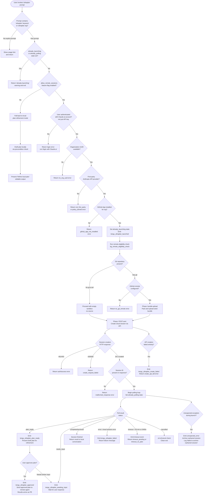

# `/ultraplan`

> Analysis basis: CC v2.1.172 bundle.js (AST extraction + Claude interpretation)
> Minimum version: v2.1.172

---

## Overview

`/ultraplan` drafts an editable, cloud-assisted task plan from a user-supplied prompt by launching a remote Claude Code cloud session, uploading the local repository, running a planning agent on that cloud session, and then surfacing the resulting plan back in the local Claude Code interface for the user to refine. The command is tightly integrated with Anthropic's cloud infrastructure (authentication, GitHub App checks, environment selection, session polling) and falls back gracefully at each precondition gate. When the plan is ready it is returned as an editable draft; if a full remote session is chosen, results arrive as a pull request.

---

## Registration

| Field | Value |
|---|---|
| type | `local-jsx` |
| name | `ultraplan` |
| description | `"Draft an editable plan in Claude Code on the web ( ... ) · See  ... "` |
| argumentHint | `<prompt>` |
| load_inline | `true` |
| load_ident | `Mg7` |
| loc_byte | `12457869` |
| loc_byte_end | `12458101` |
| loc_line | `8671` |
| arbor_handler.name | `Mg7` |
| arbor_handler.fqn | `claude-2.1.172::Mg7` |
| arbor_handler.kind | `AsyncFunction` |
| arbor_handler.resolution_path | `load_ident` |
| arbor_handler.n_hits | `1` |

Analysis basis: CC v2.1.172 bundle.js:+12457869

The handler was inlined as `load: () => Promise.resolve({ call: Mg7 })` and Arbor resolved it via the `load_ident` path. `Mg7` is therefore the true async entry point for this command.

---

## Input Branching

The command has substantially more than three distinct execution branches (prompt detection, authentication, remote-session eligibility, environment selection, bundle upload, plan polling, plan-ready vs. needs-input vs. timeout vs. failure, and orphan-session cleanup). A Mermaid flowchart is used.



---

## Behavioral Spec

### Handler Entry: `Mg7` (mainHandler)

```
async function mainHandler(context):
    // Check allow_remote_sessions feature flag first
    remoteAllowed = checkFeatureFlag("allow_remote_sessions")  // bundle.js:+12456022

    // Read app state for session tracking
    appState = context.getAppState()                           // bundle.js:+12456339

    // Detect prompt: strip leading command token, require "ultraplan" in text
    rawInput = context.userInput
    cleanedPrompt = stripCommandToken(rawInput)               // via Sb8, bundle.js:+12456004

    if cleanedPrompt is empty or does not contain "ultraplan":
        // Show usage hint
        return usageHint(
            "Usage: /ultraplan <prompt>, or include \"ultraplan\" anywhere in your prompt"
        )                                                      // bundle.js:+12453516

    // Guard: already launching / already polling
    if appState has "already_launching":
        return warn("ultraplan: already launching. Please wait for the session to start.")
                                                               // bundle.js:+12452004

    if remoteAllowed:
        // Full remote cloud path
        result = await launchRemoteUltraplan(context, cleanedPrompt)
    else:
        // Local plan-refinement fallback
        result = localPlanRefinement(context, cleanedPrompt)

    // Update app state with outcome
    context.setAppState(result)                               // bundle.js:+12456561

    return result
```

Analysis basis: CC v2.1.172 bundle.js:+12456004, +12456022, +12456057, +12456132, +12456339, +12456412, +12456561

---

### Prompt Detection & Cleanup: `Sb8` (promptCleanup)

```
function promptCleanup(rawInput):
    // Slice off the leading slash-command token
    sliced = rawInput.slice(offset)                           // bundle.js:+10768886

    // Normalize spacing: collapse runs of whitespace
    normalized = sliced.replace(pattern, "$1$2")             // bundle.js:+10768983
                                                             // replacement literal "$1$2" at +10768983
                                                             // trailing context length: 5 chars  +10769006

    // Check whether the string starts with a known prefix
    if normalized.startsWith(knownPrefix):                   // bundle.js:+10767908
        // Match all occurrences with /gi flag                // bundle.js:+10768306
        matches = normalized.matchAll(regex_gi)              // bundle.js:+10768314

    // Scan existing queue entries to detect duplicates
    isDuplicate = queue.some(entry => ...)                   // bundle.js:+10768406

    // Mark as ultraplan variant
    // Literal "ultraplan" verified at                        // bundle.js:+10768658
    result.push("ultraplan")                                 // bundle.js:+10768586

    return result
```

Analysis basis: CC v2.1.172 bundle.js:+10768658, +10768886, +10768983, +10768306

---

### Remote Eligibility & Precondition Check: `p9` (remotePreconditionCheck)

```
async function remotePreconditionCheck(context):
    // Resolve account type
    accountType = resolveAccountInfo()                        // via oC, bundle.js:+2516406

    // Require firstParty account                            // literal at +2515873
    if not accountType.firstParty:
        return error("not_first_party",
            "Cloud sessions are only available on the first-party Anthropic API provider.")
                                                             // bundle.js:+9307272

    // Check enterprise/team tiers                          // literals at +2516146, +2516181
    if tier not in [enterprise, team]:
        // may still be allowed via allow_product_feedback   // literal at +2516447
        pass

    // Check product feedback / remote sessions policy
    if featureSet has "allow_product_feedback":              // bundle.js:+2516423
        pass

    // Verify user is logged in (not just API key)
    if not hasAccessToken():                                 // bundle.js:+9307415
        return error("no_access_token",
            "No access token found for cloud session creation")

    // Verify org UUID
    orgUUID = getOrgUUID()
    if not orgUUID:                                         // bundle.js:+9307742
        return error("no_org_uuid",
            "Unable to get organization UUID for cloud session creation")

    // Check policy blocking
    if policyBlocked:                                       // literal at +9383917
        return error("policy_blocked",
            "Cloud sessions are disabled by your organization's policy. Contact your organization admin.")
                                                            // bundle.js:+9383940

    // Verify GitHub App installed
    if not githubAppInstalled:                              // literal at +9383763
        return error("github_app_not_installed", ...)

    return OK
```

Analysis basis: CC v2.1.172 bundle.js:+2516375, +2516406, +2516423, +9307272, +9307415, +9307742, +9383917

---

### Remote Session Launch Orchestrator: `su6` (launchOrchestrator)

```
async function launchOrchestrator(context, prompt):
    // Run precondition check
    preconditionResult = await remotePreconditionCheck(context)  // bundle.js:+12453192
    if preconditionResult.error:
        emit("tengu_ultraplan_create_failed")                    // bundle.js:+12453229
        return preconditionResult

    // Set already_launching guard                               // literal at +12453469
    context.setFlag("already_launching")

    // Compute prompt identifier for telemetry
    promptId = derivePromptIdentifier(prompt)                    // via Y6, bundle.js:+12448888

    // Launch session lifecycle manager
    sessionHandle = await sessionLifecycle(context, prompt)      // via Lg7, bundle.js:+12453719

    // Start background task notification                        // literal "task-notification" at +12454220
    registerTaskNotification(sessionHandle)

    // Register cleanup on session end
    registerCleanup(sessionHandle)                              // via f, bundle.js:+12453385

    // Begin polling                                            // via PU8, bundle.js:+12453605
    pollResult = await pollSession(sessionHandle)

    return pollResult
```

Analysis basis: CC v2.1.172 bundle.js:+12453192, +12453229, +12453469, +12453605, +12453719

---

### Session Lifecycle Manager: `Lg7` (sessionLifecycle)

```
async function sessionLifecycle(context, prompt):
    // Step 1 — Remote eligibility deep check                    // via _GH → wEq, bundle.js:+12453961
    eligibility = await deepEligibilityCheck(context)
    //   includes BYOC check (literal "byoc" at +9381868)
    //   includes github.com domain check (literal at +9382156)
    //   emits tengu_ccr_bundle_seed_enabled                     // bundle.js:+9381960

    // Step 2 — Teleport / environment selection                 // via qr, bundle.js:+12454321
    //   Phase "env-select"                                      // literal at +9310136
    environment = await selectEnvironment(context)
    //   Tries to list existing environments (teleport_environments_list)
    //   Auto-creates "Default" env if none found               // literal "Default" at +9254869
    //     emits tengu_teleport_default_environment_create       // bundle.js:+9254894
    //   Falls back: warn with onboarding URL if creation fails // literal at +9310401
    //   Error codes: no_default_env, no_environments, bridge

    // Step 3 — Branch / base detection                         // literal "[teleport] phase: branch-detect" at +9311939
    branchInfo = detectBranch(context)
    //   Checks symbolic-ref --short refs/remotes/origin/HEAD   // literals at +1151703, +1151728
    //   Falls back to "main" or "master"                       // literals at +1151841, +1151848

    // Step 4 — Bundle upload                                   // literal "[teleport] phase: bundle-upload" at +9313075
    bundleResult = await uploadBundle(context)
    //   Stashes local changes (git stash create)               // literal "create" at +9292071
    //   Packs refs/seed/stash and refs/seed/root               // literals at +9291675, +9291693
    //   Uploads via THA (teleport_git_bundle_upload)           // literal at +9291574
    //   emits tengu_ccr_bundle_upload                          // bundle.js:+9291867
    //   Error codes: empty_repo, stash_failed, upload_failed, no_changes, no_git_at_all

    // Step 5 — POST cloud session creation request            // literal "[teleport] phase: POST-sent" at +9315103
    //   Beta header: "ccr-byoc-2025-07-29"                    // literal at +9308161
    //   Organization UUID header: "x-organization-uuid"       // literal at +9308183
    sessionResponse = await createCloudSession(environment, bundleResult, prompt)
    //   emits tengu_teleport_bundle_mode                       // bundle.js:+9308511
    //   emits tengu_teleport_source_decision                   // bundle.js:+9313985
    //   emits tengu_ccr_session_link                           // bundle.js:+9301850
    //   HTTP 201 expected                                      // literal 201 at +9309476
    //   HTTP 401/403/429 → auth or rate-limit errors          // literals at +9309545, +9309549, +9309553
    //   HTTP 500 → create_request_failed                       // literal at +9309774
    //   No session ID → malformed_response                     // literal at +9309988

    // Step 6 — Plan title & branch generation                  // via _g7 + Hg7, bundle.js:+12454296
    //   emits tengu_teleport_generate_title                    // literal at +9295256
    //   Branch name pattern: "claude/task/{description}"       // literal at +9294958
    //   Max branch name length: 75 chars                       // literal 75 at +9294952

    // Step 7 — Launch notification                            // via axH, bundle.js:+12455042
    //   emits tengu_ultraplan_launched                         // bundle.js:+12454936
    //   Generates random session token via BPK.randomBytes (8 bytes)  // literal 8 at +13510018
    //   Records Date.now() as launch timestamp                 // bundle.js:+9388614
    //   Sets session to "pending" then "running"               // literals at +13510125, +9388462

    // Step 8 — Poll loop                                      // via WfK, bundle.js:+12449288
    planResult = await pollUntilPlanReady(sessionHandle)

    // Step 9 — Present plan for refinement                    // via _g7 / Hg7
    //   Header literal: "Here is a draft plan to refine:"     // literal at +12449065
    //   Joins plan segments with q.join                        // bundle.js:+12449148
    //   Presents as "Refine local plan" action                 // literal at +12454376

    // Step 10 — Yield to user approval cycle                  // via Ag7, bundle.js:+12455207
    approvalResult = await awaitApprovalOrRefinement(planResult)

    return approvalResult
```

Analysis basis: CC v2.1.172 bundle.js:+12453961, +12454321, +12454296, +12455042, +12454936, +12449065, +12455207

---

### Session Poll Loop: `WfK` (pollUntilPlanReady)

```
async function pollUntilPlanReady(sessionHandle):
    startTime = Date.now()                                        // bundle.js:+12439586
    maxDurationMs = 5400 * 1000   // 5400 seconds (90 minutes)   // literal 5400 at +12448758
    pollIntervalMs = 1000          // 1 second base interval      // literal 1000 at +9390032
    networkRetryLimit             // triggers "network_or_unknown" // literal at +12440010

    while true:
        if callerAborted:
            raise "poll stopped by caller"                        // literal at +12439731

        elapsed = Date.now() - startTime
        elapsedMinutes = Math.round(elapsed / 60000)             // literal 60000 at +12440904
        // Display "N minute(s)" to user                         // literals "minute"/"minutes" at +12440919, +12440928

        // Network failure path
        on network error after retries:
            emit("network_or_unknown")
            raise "Lost connection to the cloud session after repeated retries — the session may still be running"
                                                                  // literal at +12440084

        response = await fetchSessionStatus(sessionHandle)        // via f.ingest, bundle.js:+12440269

        status = response.status
        switch status:
            case "plan_ready":
                emit("tengu_ultraplan_plan_ready")               // bundle.js:+12449436
                extract plan content (check for extract_marker)  // literal at +12440343
                return { kind: "plan_ready", content: planText }

            case "needs_input":
                emit("tengu_ultraplan_awaiting_input")           // bundle.js:+12449368
                return { kind: "needs_input" }

            case "approved":
                emit("tengu_ultraplan_approved")                 // bundle.js:+12449856
                // "Results will land as a pull request when the cloud session finishes."
                                                                  // literal at +12450346
                return { kind: "approved" }

            case "completed" | "archived":
                return { kind: "completed" }

            case "terminated":
                emit("tengu_ultraplan_failed")                   // bundle.js:+12450745
                return { kind: "terminated" }

            case "error":
                // "cloud session returned an error"             // literal at +9392640
                emit("tengu_ultraplan_failed")
                return { kind: "error" }

        // Timeout check
        if elapsed / 1000 >= 5400:                               // literal 5400 at +12448758
            if noPlanYet:
                emit("tengu_ultraplan_timeout_seconds")          // bundle.js:+12448724
                return { kind: "timeout_no_plan" }              // literal at +12441145
            else:
                return { kind: "timeout_pending" }              // literal at +12441127

        // Also hard cap from remote: "cloud session exceeded 30 minutes" // literal at +9392680
        await sleep(pollIntervalMs)
```

Poll interval base: 1000 ms (bundle.js:+9390032). Maximum session duration enforced locally: 5400 seconds (bundle.js:+12448758). Maximum duration reported by remote agent: 30 minutes / 1 800 000 ms (literal `1800000` at bundle.js:+9390039).

Analysis basis: CC v2.1.172 bundle.js:+12439586, +12439731, +12440084, +12440269, +12440904, +12448758

---

### Plan Approval Cycle: `Ag7` (awaitApprovalOrRefinement)

```
async function awaitApprovalOrRefinement(planResult):
    // Retrieve active session state from store                  // via L.get, bundle.js:+12449309
    session = store.get(sessionHandle)

    // Record launch time, compare with Date.now()              // bundle.js:+12449202
    age = Date.now() - session.launchTimestamp

    // Present editable plan to user
    displayPlan(planResult.content)                             // via fg7 / K5, bundle.js:+12449497

    // Wait for one of: approval, refinement request, timeout, cancel
    loop:
        event = await waitForUserEvent()                        // via Oh, bundle.js:+12455181

        switch event.type:
            case "task_started":                               // literal at +10204016
                // Update task tracker
                updateTask(event)

            case "task_updated":                              // literal at +10203051
                // Push incremental update to UI
                pushUpdate(event)

            case "approved":
                // User approved the plan
                emit("tengu_ultraplan_approved")              // bundle.js:+12449856
                // Archive previous session if one is orphaned
                archiveOrphanSession(session)                 // via vS6, bundle.js:+12450023
                // Send final plan to remote agent
                sendApprovedPlan(planResult)                  // via np, bundle.js:+12451292
                return { kind: "approved",
                    message: "Results will land as a pull request when the cloud session finishes." }

            case "failed":
                emit("tengu_ultraplan_failed")                // bundle.js:+12450745
                return { kind: "failed",
                    message: "Cloud ultraplan session failed. Wait for the user's next instructions." }
                                                              // literal at +12451169

        on unexpected exception:
            // Emit unexpected_error                          // literal at +12455356
            // Log: "Ultraplan hit an unexpected error during launch."
                                                              // literal at +12455528
            // Attempt to archive orphaned session
            log("ultraplan: failed to archive orphaned session")  // literal at +12455689
            return { kind: "unexpected_error" }
```

Analysis basis: CC v2.1.172 bundle.js:+12449202, +12449309, +12449856, +12450023, +12450745, +12451169, +12455356, +12455528, +12455689

---

### Local Plan Refinement Fallback (no remote)

When `allow_remote_sessions` is absent or false, the command falls back to a purely local planning step:

```
function localPlanRefinement(context, prompt):
    // Use precondition-type sub-handler                        // literal "precondition" at +12454044
    plan = generateLocalPlan(prompt)                           // via K5, bundle.js:+12454152

    // Present with label "Refine local plan"                  // literal at +12454376
    // Editable block tagged "plan"                            // literal "plan" at +12454411
    return {
        type: "plan",
        label: "Refine local plan",
        content: plan
    }
```

Analysis basis: CC v2.1.172 bundle.js:+12454044, +12454152, +12454376, +12454411

---

### GitHub App Pre-flight Check: `UxH` (checkGithubAppInstalled)

```
async function checkGithubAppInstalled(context):
    // Require access token
    token = getAccessToken()
    if not token:
        log("checkGithubAppInstalled: No access token found, assuming app not installed")
                                                               // literal at +9256344
        return false

    // Require org UUID
    orgUUID = getOrgUUID()
    if not orgUUID:
        log("checkGithubAppInstalled: No org UUID found, assuming app not installed")
                                                               // literal at +9256457
        return false

    // GET request to Anthropic API                            // via zA.get, bundle.js:+9256714
    try:
        response = await api.get(endpoint, { token, orgUUID })
        // Log "is" or "is not" installed                      // literals at +9256855, +9256860
        return response.installed

    on AxiosError:                                             // bundle.js:+9257061
        if error.status == 400:                               // literal 400 at +9257115
            return false   // treat as not installed
        raise error

    on timeout (15000 ms):                                    // literal 15000 at +9254609
        return false
```

Analysis basis: CC v2.1.172 bundle.js:+9256311, +9256344, +9256457, +9256714, +9257061

---

### Environment Selection: `Fe` / `s16` (listAndSelectEnvironment / createDefaultEnvironment)

```
async function listAndSelectEnvironment(context):
    // Require first-party provider                            // bundle.js:+9254016
    if not firstParty:
        return error("Remote environments are only available on the first-party Anthropic API provider.")
                                                               // literal at +9254048

    // Require Claude.ai account (not API key)               // bundle.js:+9254178
    if not claudeAiAuth:
        return error("Claude Code web sessions require authentication...")

    // Require org UUID                                       // bundle.js:+9254417
    orgUUID = getOrgUUID()
    if not orgUUID:
        return error("Unable to get organization UUID")

    // GET environments list                                  // via zA.get, bundle.js:+9254529
    // emits: teleport_environments_list                      // literal at +9253974
    envList = await api.get("/environments", { orgUUID, timeout: 15000 })

    if envList.empty:
        // Try to auto-create the Default environment
        newEnv = await createDefaultEnvironment(context)     // via s16
        if not newEnv:
            warn("Could not create a cloud environment. Set one up at https://claude.ai/code/onboarding?magic=env-setup")
                                                              // literal at +9310401
            return error("no_environments")                   // literal at +9311539

    return selectBestEnvironment(envList)

async function createDefaultEnvironment(context):
    // POST to create env named "Default"                     // literal "Default" at +9254869
    // emits teleport_default_environment_create              // literal at +9254894
    payload = {
        name: "Default - trusted network access",           // literal at +9255339
        provider: "anthropic_cloud",                         // literal at +9255309
        home: "/home/user",                                  // literal at +9255415
        python: "3.11",                                      // literals at +9255477, +9255494
        node: "20"                                           // literals at +9255508, +9255523
    }
    response = await api.post(endpoint, payload)             // via zA.post, bundle.js:+9255286
    // HTTP 409 → conflict (env already exists)              // literal 409 at +9317628
    return response.environment
```

Analysis basis: CC v2.1.172 bundle.js:+9253974, +9254048, +9254178, +9254417, +9254529, +9254869, +9255286, +9255339

---

## State & Side Effects

| Item | Detail |
|---|---|
| Telemetry: `tengu_ultraplan_launched` | Fired when the remote session launch is dispatched (bundle.js:+12454936) |
| Telemetry: `tengu_ultraplan_create_failed` | Fired when remote session creation fails before a session ID is returned (bundle.js:+12453229) |
| Telemetry: `tengu_ultraplan_plan_ready` | Fired when the cloud session emits a completed plan (bundle.js:+12449436) |
| Telemetry: `tengu_ultraplan_awaiting_input` | Fired when the cloud session signals `needs_input` (bundle.js:+12449368) |
| Telemetry: `tengu_ultraplan_approved` | Fired when the user approves the draft plan (bundle.js:+12449856) |
| Telemetry: `tengu_ultraplan_failed` | Fired on session error or termination (bundle.js:+12450745) |
| Telemetry: `tengu_ultraplan_timeout_seconds` | Fired when local timeout (5400 s) is reached (bundle.js:+12448724) |
| Telemetry: `tengu_ultraplan_prompt_identifier` | Fired with a derived identifier for the user's prompt (bundle.js:+12448891) |
| Telemetry: `tengu_ccr_bundle_seed_enabled` | Fired if seed bundle mode is active (bundle.js:+9381960) |
| Telemetry: `tengu_ccr_bundle_upload` | Fired after git bundle is uploaded to cloud (bundle.js:+9291867) |
| Telemetry: `tengu_teleport_bundle_mode` | Records which bundle source was used (bundle.js:+9308511) |
| Telemetry: `tengu_ccr_session_link` | Fired with the remote session link (bundle.js:+9301850) |
| Telemetry: `tengu_teleport_source_decision` | Records source type chosen for the session (bundle.js:+9313985) |
| Telemetry: `tengu_config_parse_error` | Fired if local config file is unparseable (bundle.js:+3314707) |
| Telemetry: `tengu_bg_dispatch_sigkill_escalate` | Background session SIGKILL escalation (bundle.js:+16759925) |
| Telemetry: `tengu_scheduled_task_missed` | Background task missed its schedule window (bundle.js:+16260241) |
| Telemetry: `tengu_feature_ok` / `tengu_feature_bad` | Feature gate pass/fail (bundle.js:+1016269, +1016336) |
| Telemetry: `tengu_bg_low_mem_mb` | Low-memory warning in background daemon (bundle.js:+13266653) |
| Telemetry: `tengu_bg_dispatch_low_mem` | Dispatch suppressed due to low memory (bundle.js:+16760526) |
| Telemetry: `tengu_bg_spare_enable` / `tengu_bg_spare_claim` / `tengu_bg_spare_claim_fail` | Background spare-session lifecycle (bundle.js:+16761230, +16761358, +16761624) |
| Telemetry: `tengu_bg_sendclaim_failed` | Failed to claim background session (bundle.js:+16738818) |
| appState changes | Sets `already_launching` during launch; clears it on completion or error. Sets `already_polling` while the poll loop is active. Writes final session status via `_.setAppState`. |
| Hook registration | Registers a `hZA.register` hook (bundle.js:+63751) via `y9` — likely a task-notification hook for the duration of the session. |
| File system | Git bundle written to a temp file (suffix `.bundle`, literal at +9292881); deleted after upload via `f96.unlink` (bundle.js:+9293822). Config files read with `readFileSync` and backed up with `copyFileSync` (bundle.js:+3315215). |
| Network | Cloud API called via `zA.post` and `zA.get` (Axios). Required header: `anthropic-beta: ccr-byoc-2025-07-29` (bundle.js:+9308161). Required header: `anthropic-version: 2023-06-01` (literal at +2476434). |
| Sound / UI | Renders "Ultraplan" label in UI (literal at +12455100). Displays plan header "Here is a draft plan to refine:" (literal at +12449065). Presents "Refine local plan" action label (literal at +12454376). |
| Background daemon | Background session management (daemon mode) involved via `l0A` / `D` / `B0A`; socket auth via `K.socketAuth`; background PTY reconnect on drop (literal "[bg-pty] dropped by host; reconnecting" at +13761556). |

---

## Version History

| Version | Change |
|---|---|
| v2.1.172 | Initial analysis |

---

## Common Mistakes

1. **Invoking `/ultraplan` without the word "ultraplan" in the prompt body.** The command requires the literal string `"ultraplan"` to appear somewhere in the cleaned prompt; omitting it causes the usage hint to be returned immediately with no session launched (bundle.js:+10768658).

2. **Using an API key instead of a Claude.ai account.** `/ultraplan` requires Claude.ai OAuth authentication, not a bare Anthropic API key. The error message is explicit: run `/login` to authenticate (bundle.js:+9254178).

3. **No GitHub remote configured.** The remote cloud session requires a `git remote add origin <REPO_URL>` to be set; without it the session errors with `no_git_remote` (bundle.js:+9383650). Use a `github.com` remote; non-GitHub hosts may be treated as GHES or BYOC with reduced functionality.

4. **Running `/ultraplan` while a session is already launching.** The command sets `already_launching` and returns a warning rather than creating a second session. Wait for the current session to complete or time out (bundle.js:+12453469).

5. **Expecting immediate results.** The remote cloud session is asynchronous. For the full remote path, results arrive as a pull request — not inline in the terminal (bundle.js:+12450346). The local poll loop runs up to 5 400 seconds (90 minutes) before timing out (bundle.js:+12448758).

6. **Missing GitHub App installation.** If the Anthropic GitHub App is not installed in the repository's organization, the pre-flight check fails with `github_app_not_installed` before any session is started (bundle.js:+9383763).

7. **Organizational policy blocking cloud sessions.** Admins can disable cloud sessions; affected users receive `policy_blocked` and must contact their org admin (bundle.js:+9383917, +9383940).

---

## Appendix — Identifier Mapping

> For bundle debugging only. Identifiers change across versions.

| Identifier | Role |
|---|---|
| `Mg7` | Main async handler for `/ultraplan` (entry point via `load_ident`) |
| `Sb8` | Prompt cleanup / tokenization helper |
| `yb8` | Inner prompt parsing wrapper |
| `fKA` | Token-scan and queue management for prompt segments |
| `p9` | Remote precondition check (auth, org, policy, feature flags) |
| `zm1` | Account type resolver wrapper |
| `EhH` | Account info fetcher (reads config, checks enterprise/team) |
| `oC` | Account classifier (firstParty, enterprise, team checks) |
| `fJ6` | Config file reader (readFileSync, utf-8) |
| `hLH` | Inclusion / allow-list checker for account types |
| `Rq` | Telemetry category resolver |
| `yBA` | Feature flag evaluator wrapper |
| `f6` | String conversion utility |
| `WLH` | String formatting helper (uses f6) |
| `g3H` | App-state getter helper |
| `su6` | Remote launch orchestrator |
| `$6` | State flag setter |
| `_56` | Low-level state primitive |
| `hfK` | Session handle factory / cleanup registrar |
| `PU8` | Poll initiator wrapper |
| `XU8` | Poll configuration builder |
| `Y6` | Session store accessor (has/get/add/values operations) |
| `tF7` | Poll timing helper |
| `Lg7` | Session lifecycle manager (multi-phase orchestrator) |
| `_GH` | Deep eligibility check dispatcher |
| `wEq` | Remote eligibility evaluator (BYOC, GitHub, bundle seed) |
| `g9` | Generic utility (BG/Y5 delegates) |
| `BG` | Base utility A |
| `Y5` | Base utility B |
| `_g7` | Plan content builder / branch name assembler |
| `Hg7` | Plan segment formatter (sF7 delegate) |
| `qr` | Teleport-to-remote core function (environment, bundle, POST, poll phases) |
| `p6` | OAuth token accessor |
| `B4` | Auth context builder |
| `Nz` | Token refresh helper |
| `_k8` | Request context builder (W9, f6, CB) |
| `SH` | Session creation HTTP handler (POST + error mapping) |
| `cC` | API response classifier (status code dispatch) |
| `S1` | Endpoint URL builder (local/staging/prod) |
| `YD` | HTTP header builder (Content-Type, anthropic-version, etc.) |
| `THA` | Git bundle upload handler (stash, pack, upload, unlink) |
| `y6` | Git utility wrapper (BG delegate) |
| `N` | Log-level dispatcher (debug/warn/error) |
| `A6` | UI state setter |
| `bC` | Git remote URL resolver (git config --get remote.origin.url) |
| `CTq` | Control-request builder (set_permission_mode, apply_flag_settings) |
| `KS6` | Object key enumerator helper |
| `CH` | JSON serializer wrapper |
| `RTq` | Session-link telemetry emitter |
| `FI8` | Feature-gate inspector |
| `Fe` | Environment list fetcher (listEnvironments) |
| `s16` | Default environment creator (createDefaultEnvironment) |
| `EH` | String coercion helper |
| `O` | Environment list model |
| `Bf7` | Task branch/title generator (teleport_generate_title) |
| `WS` | Session-store watcher / subscription manager |
| `UxH` | GitHub App installation checker |
| `zI` | Git branch detector (symbolic-ref, show-ref, main/master fallback) |
| `J9` | UI notification presenter |
| `N8H` | Remote URL parser (https/http host extraction) |
| `r` | Permission rule set (allow/deny) |
| `JA` | Error factory / normalizer |
| `rz` | Request cancellation checker |
| `Gz` | Generic result finalizer |
| `bY` | Claude.ai base URL resolver (local/staging/prod) |
| `I_` | Module initialization / export shape builder |
| `tx_` | URL environment selector |
| `Kg7` | Session label builder ("Ultraplan") |
| `axH` | Session poll launcher (remote_agent status loop) |
| `hk` | Random session token generator (BPK.randomBytes, 8 bytes) |
| `g16` | Session file opener (_6H.open) |
| `gW` | Session timestamp recorder |
| `G47` | Session status formatter |
| `JEq` | Core session event-stream poller (streaming result processor) |
| `Oh` | User-event waiter (task_started / task_updated dispatch) |
| `IY7` | Task-started event handler |
| `NY7` | Task-updated event handler |
| `pAA` | UI update dispatcher |
| `kY7` | Single task event processor |
| `yY7` | Bulk task event processor |
| `QqH` | User-typed event dispatcher |
| `Ag7` | Plan approval cycle manager |
| `WfK` | Poll-until-plan-ready loop |
| `aF7` | Session store initializer |
| `fg7` | Plan display formatter |
| `vS6` | Orphaned session archiver (gK.unlink, T9) |
| `K` | Column padding formatter (padEnd) |
| `np` | Approved-plan POST sender |
| `y9` | Hook registration helper (hZA.register) |
| `qg7` | Launch-state cleanup handler |
| `b6` | Config file watcher / loader (W7H, Gx4 delegates) |
| `o6` | File path resolver |
| `jZ_` | Config path joiner |
| `W7H` | Config reader / writer (readFileSync, mkdirSync, copyFileSync) |
| `n6` | JSON parse wrapper |
| `bu` | Path prefix stripper (startsWith / slice) |
| `N8` | File metadata helper |
| `S_9` | Backup directory scanner |
| `XZ_` | Backup path joiner (WD.join + A_) |
| `$` | TwK delegate (startsWith matcher) |
| `D` | Background session dispatcher (main daemon loop) |
| `b` | Background process record |
| `d8` | Timer / abort controller wrapper |
| `bH` | Non-fatal feature reporter (tengu_feature_bad) |
| `kH` | Successful feature reporter (tengu_feature_ok) |
| `hF8` | Low-memory checker (macOS freemem) |
| `l06` | Settings file loader (GW.readFile) |
| `Q` | Background PTY session object (reconnect logic) |
| `B0A` | Socket claim handler (Hd.claim, Vn8.connect) |
| `l0A` | Session lifecycle cleanup (rm, unlink, rosterEntry, setTimeout) |
| `Y` | Forced shutdown handler (process.exit, z.abort) |
| `B` | Background session queue entry |
| `Gx4` | Config file watcher (m78.watchFile / unwatchFile) |
| `wF` | Watch-event callback |
| `f46` | Parallel readiness check (Promise.all over bC, WS, J4, p6, f6, UxH) |