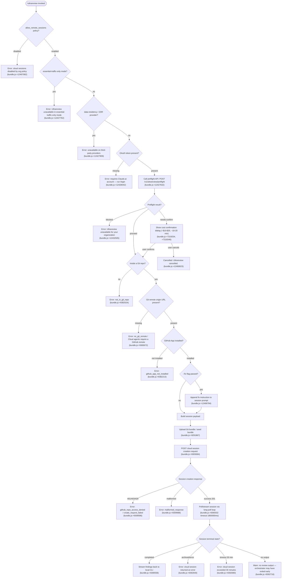

# `/ultrareview`

> Analysis basis: CC v2.1.172 bundle.js (AST extraction + Claude interpretation)
> Minimum version: v2.1.172

---

## Overview

`/ultrareview` launches a cloud-hosted agent that finds and verifies bugs in the current Git branch by uploading the repository to a remote Claude Code web session and streaming findings back to the local CLI. The command performs a multi-stage preflight sequence (policy checks, OAuth validation, Git repo inspection, GitHub App verification, and cost confirmation) before dispatching the work to Anthropic's cloud infrastructure. It is an asynchronous, network-bound operation that runs entirely outside the local machine and reports results via a long-poll or WebSocket session stream.

---

## Registration

| Field | Value |
|---|---|
| type | `local-jsx` |
| name | `ultrareview` |
| description | `"Start a cloud agent that finds and verifies bugs in your branch ( ... , ... USD) · Runs in Claude Code on the web. See ..."` |
| module_id | `CfK` |
| load_inline | `true` |
| loc_byte | `12469389` |
| loc_byte_end | `12469659` |
| loc_line | `8696` |
| arbor_handler.name | `Zg7` |
| arbor_handler.fqn | `claude-2.1.172::Zg7` |
| arbor_handler.kind | `AsyncFunction` |
| arbor_handler.resolution_path | `module_id` |
| arbor_handler.n_hits | `1` |

Analysis basis: CC v2.1.172 bundle.js:+12469389

---

## Input Branching

The command involves more than three distinct decision paths across policy checks, authentication, Git state, GitHub connectivity, cost confirmation, and session lifecycle. A Mermaid flowchart is used.



---

## Behavioral Spec

### 1. Entry Point and Policy Guard (handler: `Zg7`)

```
async function ultrareviewHandler(context):
    # Check org policy
    if not allow_remote_sessions:
        emit error "Cloud sessions are disabled by your organization's policy..."
        tengu_review_remote_precondition_failed
        return

    # Introduce brief random jitter before any network call
    await randomDelay(max=2)           # Math.random + setTimeout (bundle.js:+14012203)

    # Determine review mode from user args
    mode = parseReviewMode(args)       # "fix" | "comment" — see jfK (bundle.js:+12429156)

    # Run multi-phase preflight
    preflightResult = await runPreflight(context, mode)

    if preflightResult == CANCELLED:
        emit "Ultrareview cancelled."
        return

    if preflightResult == ERROR:
        emit error details
        tengu_review_remote_precondition_failed
        return

    # Build and launch the remote session
    sessionResult = await launchCloudSession(context, preflightResult, mode)

    if sessionResult == ERROR:
        emit "Ultrareview failed to launch the cloud session. Check that this is a GitHub repo and try again."
        tengu_review_remote_teleport_failed
        return

    tengu_review_remote_launched
    # Stream session output until terminal state
    await monitorSession(sessionResult.sessionId)
```

Analysis basis: CC v2.1.172 bundle.js:+12467045

---

### 2. Review Mode Parsing (`jfK` / `DU8`)

```
function parseReviewMode(rawArgs):
    normalized = rawArgs.trim().split(whitespace).join(" ").replace(specialChars)
    if args.has("fix"):
        return "fix"        # bundle.js:+12429163
    if args.has("comment"):
        return "comment"    # bundle.js:+12429169
    # Default falls back to standard review
    return "default"
```

The literal `/code-review ultra` (bundle.js:+12429248) appears as a related internal alias string.

Analysis basis: CC v2.1.172 bundle.js:+12429156

---

### 3. Network / Provider Preflight (`wfK`)

```
async function runNetworkPreflight(oauthToken, teleportOrgHeader):
    if networkMode == "essential-traffic-only":
        emit "Ultrareview runs in Claude Code on the web and is unavailable when essential-traffic-only mode is active."
        return { status: "blocked", reason: "essential-traffic-only" }

    if provider == "data-residency" or provider == "zdr":
        emit "Ultrareview runs in Claude Code on the web and is unavailable on third-party providers."
        return { status: "blocked", reason: "data_residency" }

    if not oauthToken:
        emit "Ultrareview requires a Claude.ai account. Run /login to authenticate."
        return { status: "blocked", reason: "no-auth" }

    response = await httpPost(
        url    = "/v1/ultrareview/preflight",
        header = "teleport-org: " + teleportOrgHeader,
        timeout = 5000                          # bundle.js:+12427689
    )
    # Emit telemetry: api_ultrareview_preflight
    if response.status == "blocked":
        emit "Ultrareview is unavailable for your organization."
        return { status: "server_blocked" }

    if response.status == "needs-confirm":
        confirmed = await showCostDialog()      # $10-$20, ~10-20 min
        if not confirmed:
            return { status: "cancelled" }

    return { status: "proceed", payload: response.payload }
```

Analysis basis: CC v2.1.172 bundle.js:+12427557, +12427632, +12432287

---

### 4. Git Repository Inspection (`U3A`)

```
async function inspectGitRepository():
    # Verify we are inside a git work-tree
    isRepo = await git("rev-parse", "--is-inside-work-tree")  # bundle.js:+9256197
    if not isRepo:
        return { ok: false, reason: "not_in_git_repo" }

    # Get remote URL
    remoteUrl = await git("config", "--get", "remote.origin.url")  # bundle.js:+1140545
    if not remoteUrl:
        return { ok: false, reason: "no_git_remote",
                 message: "Cloud agents require a GitHub remote. Add one with `git remote add origin REPO_URL`." }

    # Redact credentials from URL (replace ://***@)  bundle.js:+1143550
    safeUrl = redactCredentials(remoteUrl)

    # Resolve current branch
    currentBranch = await git("branch", "--abbrev-ref", "HEAD")  # bundle.js:+1151531

    # Resolve default branch (refs/remotes/origin/HEAD → main|master)  bundle.js:+1151703
    defaultBranch = await resolveDefaultBranch()

    # Compute merge-base
    mergeBase = await git("merge-base", defaultBranch, currentBranch)  # bundle.js:+12431004

    # Diff stat for cost estimation
    diffStat = await git("diff", "--shortstat", mergeBase)  # bundle.js:+12431518

    # Count objects to gauge bundle size  (limit: 100 objects or 5000000 bytes)
    objectCount = await git("count-objects", "-v")  # bundle.js:+9288575
    if objectCount.loose > 5000000:
        tengu_ccr_bundle_max_bytes
        # warn user

    return { ok: true, remoteUrl: safeUrl, currentBranch, defaultBranch, mergeBase, diffStat }
```

Analysis basis: CC v2.1.172 bundle.js:+12429280, +12429583, +12431004, +9288575

---

### 5. GitHub App Check (`UxH`)

```
async function checkGithubAppInstalled(accessToken, orgUuid):
    if not accessToken:
        log "checkGithubAppInstalled: No access token found, assuming app not installed"
        return false                                # bundle.js:+9256344

    if not orgUuid:
        log "checkGithubAppInstalled: No org UUID found, assuming app not installed"
        return false                                # bundle.js:+9256457

    response = await httpGet(githubAppCheckEndpoint, {
        headers: { "x-organization-uuid": orgUuid }
    })

    if response.status == 400:
        return false                                # bundle.js:+9257115

    if httpClient.isAxiosError(response):
        # treat as not installed
        return false

    return response.data.installed
```

Analysis basis: CC v2.1.172 bundle.js:+9256311

---

### 6. Git Bundle Upload (`THA`)

```
async function uploadGitBundle(context, sessionMeta):
    isRepo = await git("rev-parse", "--is-inside-work-tree")
    if not isRepo:
        emit "Not in a git repository"
        return { status: "empty_repo" }            # bundle.js:+9291635

    # Check for any refs
    refCount = await git("for-each-ref", "--count=1", "refs/")  # bundle.js:+9291792
    if refCount == 0:
        emit "Repository has no commits yet"
        return { status: "empty_repo" }

    # Attempt to stash uncommitted changes
    stashRef = await git("stash", "create")        # bundle.js:+9292063
    if stashRef.status != 200:
        return { status: "stash_failed" }          # bundle.js:+9292512

    # Create seed bundle  (filename: ccr-seed.bundle / _source_seed.bundle)
    bundlePath = tmpDir + "/ccr-seed.bundle"       # bundle.js:+9292870, +9292881
    await git("bundle", "create", bundlePath, ...)

    # Upload bundle to pre-signed URL
    uploadResult = await uploadFile(bundlePath, presignedUrl)
    if uploadResult.error:
        return { status: "upload_failed" }         # bundle.js:+9293326

    # Clean up seed refs
    await git("update-ref", "-d", "refs/seed/stash")  # bundle.js:+9291726
    await git("update-ref", "-d", "refs/seed/root")

    tengu_ccr_bundle_upload
    return { status: "success", bundleMode: chooseBundleMode() }
    # bundleMode: "head" | "fallback_head" | "squashed" | "fallback_squashed"
    # bundle.js:+9293547, +9293586, +9293621, +9293664
```

Analysis basis: CC v2.1.172 bundle.js:+9291545, +9292870, +9293478

---

### 7. Session Creation and Dispatch (`qr`)

```
async function createCloudSession(sessionPayload, gitInfo):
    # Determine bundle / source mode
    bundleMode = determineBundleMode(gitInfo)      # bundle.js:+9308511 tengu_teleport_bundle_mode

    # Build request body including:
    #   - anthropic-beta: "ccr-byoc-2025-07-29"  (bundle.js:+9308161)
    #   - x-organization-uuid header              (bundle.js:+9308183)
    #   - source: "git_repository" | "bundle" | "explicit_env_bundle"
    #             bundle.js:+9308671, +9308475, +9308618
    response = await httpPost(sessionCreationEndpoint, sessionPayload)

    if response.status in [401, 403, 429]:
        if 403 and reason == "github_repo_access_denied":
            tengu_ccr_session_link
            emit "github_repo_access_denied"
            return error
        emit "create_request_failed"
        return error

    if response.status == 201:
        if not response.data.sessionId:
            emit "Server returned a malformed session response (no session id)"
            return { status: "malformed_response" }   # bundle.js:+9309988

    # Register UUID and control event listeners  (bundle.js:+9306476)
    # Events: "control_request", "set_permission_mode", "apply_flag_settings", "focus"
    return { status: "ok", sessionId: response.data.sessionId }
```

Analysis basis: CC v2.1.172 bundle.js:+9307095, +9309384, +9309476

---

### 8. Session Monitoring Loop (`JEq`)

```
async function monitorSession(sessionId):
    deadline = Date.now() + 1800000    # 30 min hard cap  bundle.js:+9390039
    pollInterval = 1000                # ms  bundle.js:+9390032

    loop:
        if Date.now() > deadline:
            emit "cloud session exceeded 30 minutes"
            return

        events = await pollSessionEvents(sessionId)

        for event in events:
            if event.type == "result":
                lastResult = event.data           # bundle.js:+9391046
            if event.type == "hook_progress":
                streamProgressToUI(event)         # bundle.js:+9391229
            if event.type == "hook_response":
                handleHookResponse(event)         # bundle.js:+9391258
            if event.type == "SessionStart":
                markSessionStarted()              # bundle.js:+9391839

        terminalState = getSessionState(sessionId)

        if terminalState == "completed":          # bundle.js:+9390558
            if not lastResult:
                warn "no review output — orchestrator may have exited early"
            else:
                renderFindings(lastResult)
            return

        if terminalState == "archived":           # bundle.js:+9390483
            emit "cloud session returned an error"
            return

        await sleep(pollInterval)
```

Timeout: 1 800 000 ms (30 minutes) (bundle.js:+9390039)
Poll interval: 1 000 ms (bundle.js:+9390032)

Analysis basis: CC v2.1.172 bundle.js:+9388876, +9390032, +9390558

---

### 9. Environment Selection (`Fe` / `s16`)

```
async function listOrCreateEnvironment(orgUuid, accessToken):
    # Phase: env-select  bundle.js:+9310136
    environments = await teleportListEnvironments(accessToken, orgUuid)
    # teleport_environments_list telemetry

    if environments.length == 0:
        # Attempt to auto-create default environment
        created = await teleportCreateDefaultEnvironment({
            name: "Default",                       # bundle.js:+9254869
            workDir: "/home/user",                 # bundle.js:+9255415
            python: "3.11",                        # bundle.js:+9255494
            node: "20"                             # bundle.js:+9255523
        })
        # teleport_default_environment_create telemetry
        if not created:
            warn "Could not create a cloud environment. Set one up at https://claude.ai/code/onboarding?magic=env-setup"
            return { status: "no_default_env" }    # bundle.js:+9311314

    selected = chooseEnvironment(environments)
    if not selected:
        return { status: "no_environments",        # bundle.js:+9311539
                 message: "No environments available for session creation" }

    return { status: "ok", environment: selected }
```

Analysis basis: CC v2.1.172 bundle.js:+9253971, +9254894, +9310401

---

### 10. Cost Overage Dialog (`Eg7` / `F3A`)

```
function buildOverageUI(diffStat, costEstimate):
    # Estimate comes from PCH / bughunter-config:
    #   cost range literal "$10-$20"  bundle.js:+7319254
    #   time estimate "~10–20 min"    bundle.js:+7319346
    #   size thresholds: 500 / 50000  bundle.js:+7319579, +7319613

    # Compute changed line counts  bundle.js:+12433895
    files   = clamp(diffStat.files,   5,  20)     # bundle.js:+12433896, +12433898
    lines   = clamp(diffStat.lines,   0,  25)     # bundle.lot:+12433962
    # Token budget ranges: 600..1800               bundle.js:+12434025, +12434029
    # Percentile thresholds 22/27                  bundle.js:+12434098, +12434101

    # tengu_review_overage_dialog_shown
    return ConfirmationDialog(
        title   = "Ultrareview",
        cost    = costEstimate,        # "$10-$20"
        time    = "~10–20 min",
        actions = ["confirm", "cancel"]
    )
```

Analysis basis: CC v2.1.172 bundle.js:+12432727, +12433592, +7319254

---

### 11. Fix-Mode Injection (`Eg7`)

When the user passes the `--fix` flag, an additional instruction is appended to the session prompt:

> Fragment citation only (≤30 chars): `"…--fix: when the findings arr…"` (bundle.js:+12466784)

The session type is tagged `"ultrareview"` (bundle.js:+12434391) and the URL path `/ultrareview` (bundle.js:+12435322) is included in the creation payload.

Analysis basis: CC v2.1.172 bundle.js:+12466784, +12466896

---

## State & Side Effects

| Item | Detail |
|---|---|
| Telemetry: `tengu_review_remote_precondition_failed` | Fired when any preflight check fails (policy, auth, Git, GitHub App) — bundle.js:+12429295 |
| Telemetry: `tengu_ccr_bundle_max_bytes` | Fired when the repository object count exceeds the size limit — bundle.js:+9288490 |
| Telemetry: `tengu_review_bughunter_config` | Fired when bughunter cost/time config is loaded — bundle.js:+7319137 |
| Telemetry: `tengu_feature_sad` | Fired on feature failure path — bundle.js:+1016417 |
| Telemetry: `tengu_feature_ok` | Fired on feature success path — bundle.js:+1016269 |
| Telemetry: `tengu_review_overage_blocked` | Fired when usage overage blocks the command — bundle.js:+12467379 |
| Telemetry: `tengu_review_overage_dialog_shown` | Fired when cost confirmation dialog is shown — bundle.js:+12467716 |
| Telemetry: `tengu_ccr_bundle_seed_enabled` | Fired when seed bundle upload path is chosen — bundle.js:+9381960 |
| Telemetry: `tengu_ccr_bundle_upload` | Fired after successful Git bundle upload — bundle.js:+9291867 |
| Telemetry: `tengu_teleport_bundle_mode` | Fired recording which bundle mode was chosen — bundle.js:+9308511 |
| Telemetry: `tengu_ccr_session_link` | Fired when session link is established — bundle.js:+9301850 |
| Telemetry: `tengu_teleport_source_decision` | Fired recording the source type selected for session — bundle.js:+9313985 |
| Telemetry: `tengu_review_remote_teleport_failed` | Fired when cloud session launch fails — bundle.js:+12435151 |
| Telemetry: `tengu_review_remote_launched` | Fired when cloud session is successfully launched — bundle.js:+12435672 |
| Network I/O | `POST /v1/ultrareview/preflight` (timeout 5 000 ms); session creation POST; long-poll GET loop (1 000 ms cadence, max 1 800 000 ms) |
| Git side effects | Creates and cleans up temporary refs `refs/seed/stash` and `refs/seed/root`; writes a `ccr-seed.bundle` / `_source_seed.bundle` to temp dir then deletes it |
| App state | Remote session ID registered; control event listeners attached (`control_request`, `set_permission_mode`, `apply_flag_settings`, `focus`) |
| File system | Temporary bundle file written and unlinked — `f96.unlink` — bundle.js:+9293822 |
| Sound | <!-- TODO: not found in depth-2 traversal; needs --depth 4 --> |
| Admin URL | Links user to `/admin-settings/` to modify org policy — bundle.js:+12467501 |

---

## Version History

| Version | Change |
|---|---|
| v2.1.172 | Initial analysis |

---

## Common Mistakes

1. **Running without a Claude.ai OAuth session.** `/ultrareview` requires OAuth authentication (not just an `ANTHROPIC_API_KEY`). If only an API key is configured, the command will fail with "Ultrareview requires a Claude.ai account. Run /login to authenticate."
2. **Running in a repository with no GitHub remote.** The cloud agent needs a GitHub remote (`remote.origin.url`). Repositories with only local remotes or no remote at all will fail with `no_git_remote`. Fix with `git remote add origin <REPO_URL>`.
3. **Running in an org with `allow_remote_sessions` policy disabled.** This is an organisation-level policy. The error message directs administrators to `/admin-settings/` to enable it.
4. **Running in essential-traffic-only network mode.** Ultrareview requires non-essential outbound traffic; it cannot run when the proxy restricts connections to essential traffic only.
5. **Running in a repository with no commits.** The bundle upload stage will fail with `"Repository has no commits — run git add . && git commit -m \"initial\" then retry"`. At least one commit is required before the tool can package the repository.
6. **Expecting immediate results.** The review typically takes approximately 10–20 minutes and costs approximately $10–$20. The 30-minute hard timeout means very large diffs may not complete; keep branch diffs focused.
7. **Using a third-party API provider (data residency / ZDR).** Ultrareview is only available on the first-party Anthropic API provider. Third-party and data-residency configurations will receive a `"blocked"` response.

---

## Appendix — Identifier Mapping

> For bundle debugging only. Identifiers change across versions.

| Identifier | Role |
|---|---|
| `Zg7` | Main async handler for `/ultrareview` (entry point) |
| `p9` | Eligibility / precondition checker (policy, OAuth, provider) |
| `zm1` | Inner eligibility sub-check dispatcher |
| `EhH` | Telemetry-enriched eligibility wrapper |
| `oC` | Provider/policy condition evaluator |
| `fJ6` | File-based config reader (reads UTF-8 config, bundle.js:+2516231) |
| `hLH` | Plan/tier membership checker (enterprise, team) |
| `Rq` | Traffic-mode resolver |
| `yBA` | Essential-traffic flag reader |
| `f6` | String coercion utility |
| `WLH` | Secondary string formatter |
| `q` | CLI error output writer |
| `$1` | CLI error + exit dispatcher |
| `lpH` | Console error emitter (red text) |
| `$X` | File write + path join utility |
| `H` | Random jitter / delay helper (Math.random + setTimeout) |
| `jfK` | Review mode parser ("fix" / "comment") |
| `DU8` | Argument string normaliser (trim, split, replace) |
| `A` | Lowercase normaliser for arguments |
| `L` | WebSocket/connection closer |
| `f` | Async task wrapper (add/delete from in-flight set) |
| `kv` | Special-character escaper for strings |
| `K` | Column padding / table formatter |
| `M` | MCP server manager (applies updates, manages clients) |
| `yRH` | MCP connection orchestrator (stdio/SSE/http/ws-ide) |
| `Ln8` | MCP connection result applier |
| `N` | MCP server name resolver / header builder |
| `$` | MCP client accessor |
| `nWA` | MCP server reconnect manager |
| `_` | Lodash-like utility (includes, toUpperCase, etc.) |
| `U3A` | Git repository inspector and branch resolver |
| `t16` | Git work-tree verifier (rev-parse --is-inside-work-tree) |
| `p6` | Git command runner |
| `zo6` | AsyncLocalStorage store reader |
| `P_` | Git binary locator |
| `u_` | Git subprocess executor |
| `BvH` | Git process manager (spawn, streams) |
| `Y` | Forced-shutdown / abort handler |
| `ubf` | Git output string coercer |
| `v3` | Git error parser |
| `N8` | Git exit-code checker |
| `SH` | Git command error logger |
| `c` | Configuration reader utility |
| `bC` | Git remote URL resolver and cacher |
| `Tc` | Remote URL cache accessor |
| `ro6` | Y4H store getter for remoteUrl |
| `YdH` | Credential redactor (replaces `://***@`) |
| `N8H` | Git URL parser (match/split) |
| `qdA` | URL component splitter |
| `M9` | String index/slice utility |
| `STq` | Git object count checker |
| `yTq` | Object count sub-checker |
| `kTq` | Bundle size evaluator |
| `Y6` | Repository size gate / zF cache checker |
| `p8` | Git subprocess with context |
| `zI` | Default branch resolver (symbolic-ref HEAD) |
| `Iq_` | Y4H getter for defaultBranch |
| `zj` | Current branch resolver (branch --abbrev-ref HEAD) |
| `Nq_` | Y4H getter for branch |
| `O` | Background-session state accessor |
| `m8` | Background-session status reader ("stopped") |
| `ks_` | Diff stat line-count parser (parseInt / match) |
| `Ot9` | Cost/size estimator using bughunter config |
| `PCH` | Bughunter config loader (tengu_review_bughunter_config) |
| `B3A` | Preflight API caller (`/v1/ultrareview/preflight`) |
| `wfK` | Preflight HTTP request executor |
| `n6` | JSON.parse wrapper |
| `u3A` | Preflight response decoder |
| `s6` | Feature-sad telemetry emitter |
| `A6` | Feature config accessor |
| `kH` | Feature-ok telemetry emitter |
| `WCH` | Cost confirmation dialog builder |
| `C96` | Subscription/plan type checker |
| `YV` | Subscription plan reader |
| `ijH` | Subscription type mapper |
| `e4` | Account type resolver |
| `Uw` | Auth provider inspector (ANTHROPIC_API_KEY / apiKeyHelper) |
| `b6` | Claude.ai account session checker |
| `TA` | User plan gate (max/pro/admin/billing/owner) |
| `dC` | Array membership checker |
| `sy` | Role/plan membership evaluator |
| `Mq` | Plan tier resolver (lO_ / cO_) |
| `lO_` | "max" plan checker |
| `cO_` | "pro" plan checker |
| `$e` | Overage dialog renderer |
| `Eg7` | Session payload builder (fix-mode, prompt injection) |
| `F3A` | Full cloud session orchestrator |
| `_GH` | Session bootstrap wrapper |
| `wEq` | Remote session eligibility pre-checker |
| `E` | Math.max/min bounded value utility |
| `W` | SDK session runner |
| `g3H` | Session context builder |
| `$t9` | Secondary bughunter config resolver |
| `qr` | Cloud session creation and lifecycle manager |
| `B4` | Policy-denied error builder |
| `Nz` | Token refresh trigger |
| `_k8` | Session state accessor (W9 / f6 / CB) |
| `cC` | Session event emitter (b6 / W9 / hE / PDH) |
| `S1` | OAuth environment validator (local/staging/prod) |
| `YD` | HTTP header builder (Content-Type / anthropic-version) |
| `THA` | Git bundle uploader (stash → create → upload → unlink) |
| `y6` | Git binary path lookup |
| `$6` | Config value accessor |
| `CTq` | Session control event registrar (UUID + listeners) |
| `KS6` | Session request body assembler |
| `CH` | JSON.stringify wrapper |
| `RTq` | Session link logger (tengu_ccr_session_link) |
| `FI8` | Session stream initialiser |
| `Fe` | Environment list fetcher (teleport_environments_list) |
| `s16` | Default environment creator (teleport_default_environment_create) |
| `EH` | String coercer for error payloads |
| `Bf7` | Title generator for remote task (teleport_generate_title) |
| `WS` | Session start tracker (rjH / V26 / b6) |
| `UxH` | GitHub App installation checker |
| `J9` | Hook handler dispatcher (Hl / Q9 / hY) |
| `r` | Permission/allow-list checker |
| `JA` | Error string formatter |
| `rz` | Cancellation detector |
| `Gz` | Network error classifier |
| `axH` | Session monitor / long-poll loop driver |
| `hk` | Random bytes generator (BPK.randomBytes) |
| `g16` | Database/store opener (_6H.open) |
| `gW` | Session timestamp recorder |
| `G47` | Session state string builder |
| `JEq` | Session event processor (poll loop, terminal-state checks) |
| `AGH` | Session output renderer (bY) |
| `bY` | Findings display (I_ / q / tx_) |
| `Tg7` | Session list mapper |
| `p3A` | Post-session cleanup handler |

---

Note: index built via Arbor fallback; some signals (telemetry, literals) may be missing — see arbor-fallback.js.