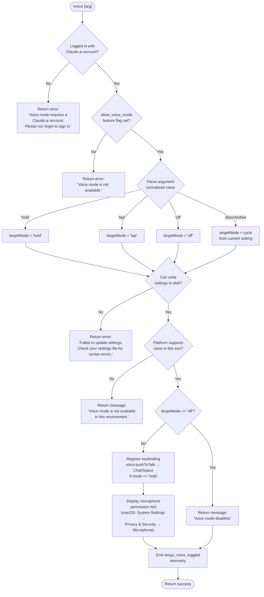

# `/voice`

> Analysis basis: CC v2.1.172 bundle.js (AST extraction + Claude interpretation)
> Minimum version: v2.1.172

---

## Overview

`/voice` toggles voice mode in Claude Code, cycling through three sub-modes — `hold` (push-to-talk), `tap` (toggle-on/off), and `off` (disabled). The command validates account eligibility and platform capability before writing the chosen mode to user settings, then emits a telemetry event recording the transition.

---

## Registration

| Field | Value |
|---|---|
| type | `local` |
| name | `voice` |
| description | `Toggle voice mode` |
| argumentHint | `[hold\|tap\|off]` |
| supportsNonInteractive | `false` |
| isHidden | `null` |
| module_id | `hjK` |
| load_inline | `true` |
| loc_byte | `13221537` |
| loc_byte_end | `13221779` |
| loc_line | `9682` |
| arbor_handler.name | `Xt7` |
| arbor_handler.fqn | `claude-2.1.172::Xt7` |
| arbor_handler.kind | `AsyncFunction` |
| arbor_handler.resolution_path | `module_id` |
| arbor_handler.n_hits | `1` |

Analysis basis: CC v2.1.172 bundle.js:+13221537

---

## Input Branching

Five or more distinct branches exist (auth check, feature-flag check, argument parsing, environment capability check, settings-write failure), so a Mermaid flowchart is used.



Analysis basis: CC v2.1.172 bundle.js:+13219022 (handler entry `Xt7`), +13219063 (account error), +13219162 (feature-flag error), +13218939 (mode literals), +13219450 (settings-write error), +13219832 (environment unavailable), +13219588 (disabled message)

---

## Behavioral Spec

### 1 — Entry point and authentication guard

The async handler (`Xt7`) first calls the settings loader (`Uw`) to obtain the current application settings, then checks whether the session has a Claude.ai OAuth credential. If no credential is present, the handler returns a plain-text error message immediately without touching any state.

```
async function voiceCommandHandler(args, context):
    settings = loadSettings()                      # calls settingsLoader (Uw)
    if not hasClaudeAiAccount(settings):
        return plainTextMessage(
            "Voice mode requires a Claude.ai account. " +
            "Please run /login to sign in."
        )
```

Analysis basis: CC v2.1.172 bundle.js:+13219033 (`Xt7`→`Uw`), +13219050 (text type), +13219063 (message literal)

---

### 2 — Feature-flag check

The handler calls the feature-flag resolver (`checkVoiceAllowed`, mapped to `WF8`/`p9`) which reads the `allow_voice_mode` flag from policy/user settings. If the flag is absent or false, a second hard-stop error is returned.

```
function checkVoiceAllowed(settings):
    return featureFlagResolver(settings, "allow_voice_mode")   # literal at +13209131

async function voiceCommandHandler(args, context):
    ...
    if not checkVoiceAllowed(settings):
        return plainTextMessage("Voice mode is not available.")
```

Analysis basis: CC v2.1.172 bundle.js:+13209187 (`c46`→`WF8`), +13209128 (`WF8`→`p9`), +13209131 (`allow_voice_mode` literal), +13219162 (error message literal)

---

### 3 — Argument parsing and mode derivation

The raw argument string is trimmed (`Jt7` at +13219216, `H.trim` at +13218892), then compared case-insensitively against the three known mode literals `"hold"`, `"tap"`, and `"off"` (+13218939, +13218951, +13218962). An unrecognised or absent argument resolves to the `"invalid"` sentinel (+13218983), which triggers cycling logic that reads the existing `voiceMode` from current settings and advances to the next state.

```
function parseVoiceArg(rawArg):
    trimmed = rawArg.trim().toLowerCase()
    if trimmed in {"hold", "tap", "off"}:
        return trimmed
    return "invalid"   # triggers cycle

function deriveTargetMode(parsedArg, currentMode):
    if parsedArg != "invalid":
        return parsedArg
    # cycle: off → tap → hold → off
    cycle = ["off", "tap", "hold"]
    return cycle[(cycle.index(currentMode) + 1) % 3]
```

Analysis basis: CC v2.1.172 bundle.js:+13219216 (`Jt7`), +13219283 (`H.trim`), +13218939–+13218983 (mode literals)

---

### 4 — Settings persistence

The target mode is written back to the user settings file via the general settings-write subsystem (`AA` at +13219352, which calls `Sz6` for atomic file write). If the write fails (syntax error in the existing file, permission problem, etc.), the handler returns a failure message and emits no telemetry.

```
async function persistVoiceMode(targetMode, context):
    result = await settingsWriter.set("voiceMode", targetMode)
    if result.error:
        return plainTextMessage(
            "Failed to update settings. " +
            "Check your settings file for syntax errors."
        )
    return null   # success
```

Analysis basis: CC v2.1.172 bundle.js:+13219352 (`Xt7`→`AA`), +13219450 (failure message literal)

---

### 5 — Environment capability check

After writing settings, the handler queries whether the runtime environment actually supports audio capture. On platforms where audio is unavailable (e.g. headless CI, SSH without audio forwarding), it returns a distinct informational message without rolling back the settings change.

```
function isVoiceAvailableInEnvironment():
    # delegates into platform-detection subsystem (eP / fyH)
    return platformSupportsAudio()

if not isVoiceAvailableInEnvironment():
    return plainTextMessage(
        "Voice mode is not available in this environment."
    )
```

Analysis basis: CC v2.1.172 bundle.js:+13220798 (`Xt7`→`eP`), +13219832 (environment message literal)

---

### 6 — Mode-specific side effects

**Disable (`off`):** Returns the message `"Voice mode disabled."` and proceeds to telemetry.

**Enable (`hold` or `tap`):**
- If mode is `hold`, registers (or updates) a keybinding for the action `voice:pushToTalk` in the `Chat` context, bound to the `Space` key (+13220801, +13220820, +13220827).
- On macOS, appends a hint pointing the user to `System Settings → Privacy & Security → Microphone` (+13220339) to assist with permission granting.

```
if targetMode == "off":
    message = "Voice mode disabled."
else:
    if targetMode == "hold":
        registerKeybinding(
            context  = "Chat",
            key      = "Space",
            action   = "voice:pushToTalk"
        )
    if isMacOS():
        hint = "System Settings → Privacy & Security → Microphone"
        appendHint(message, hint)
```

Analysis basis: CC v2.1.172 bundle.js:+13219588 (disabled literal), +13220798 (`eP`→keybinding path), +13220801 (`voice:pushToTalk`), +13220820 (`Chat`), +13220827 (`Space`), +13220339 (macOS hint)

---

### 7 — Telemetry emission

Regardless of which enabled mode was chosen, after a successful state change the handler fires the `tengu_voice_toggled` event, passing the new mode value as a property.

```
function emitVoiceToggled(newMode):
    telemetry.emit("tengu_voice_toggled", { mode: newMode })
```

Analysis basis: CC v2.1.172 bundle.js:+13219533 (`tengu_voice_toggled`)

---

## State & Side Effects

| Item | Detail |
|---|---|
| Telemetry | `tengu_voice_toggled` (+13219533) — fired on every successful mode change; `tengu_feature_ok` (+1016269), `tengu_feature_bad` (+1016336), `tengu_feature_sad` (+1016417) — fired by the settings-write subsystem |
| Settings write | Persists `voiceMode` (`"hold"` / `"tap"` / `"off"`) to the user settings JSON file via atomic write (`Sz6`) |
| Keybinding registration | When mode is `"hold"`, registers `voice:pushToTalk` → `Space` in the `Chat` keybinding context (`eP` path, +13220798) |
| appState changes | `voiceMode` field updated in loaded settings object |
| Hook registration | None observed at depth-2 |
| Sound | None emitted by this command directly |
| Feature-flag dependency | Requires `allow_voice_mode` to be truthy in policy/user settings |
| Account dependency | Requires a Claude.ai OAuth session (`hasClaudeAiAccount`) |

---

## Version History

| Version | Change |
|---|---|
| v2.1.172 | Initial analysis |

---

## Common Mistakes

1. **Running `/voice` without a Claude.ai account** — The command will immediately return the login prompt error. Run `/login` first to authenticate with a claude.ai account.
2. **Passing an unsupported argument** — Only `hold`, `tap`, and `off` are recognised. Any other string (including empty input) is treated as a cycle instruction, not an error; this may be unexpected if the intent was to set a specific mode.
3. **Corrupted settings file** — If `settings.json` contains a syntax error, `/voice` will fail at the write step with a generic message. Inspect the file directly and correct JSON syntax before retrying.
4. **SSH / headless environments** — Even after settings are written successfully, voice mode reports as unavailable if the platform cannot access audio hardware. The settings persist, but the mode will not be functional until a capable environment is used.
5. **Missing microphone permission on macOS** — After enabling `hold` or `tap` mode, the hint message references `System Settings → Privacy & Security → Microphone`. Skipping this step means the push-to-talk keybinding will be registered but audio capture will silently fail.

---

## Appendix — Identifier Mapping

> For bundle debugging only. Identifiers change across versions.

| Identifier | Role |
|---|---|
| `Xt7` | Main voice command async handler (arbor_handler) |
| `c46` | Combined auth + feature-flag pre-check dispatcher |
| `PF8` | Auth credential check (Claude.ai account presence) |
| `Uw` | Settings loader (reads all settings layers from disk) |
| `O7` | Auth state accessor |
| `vj` | Auth session object / credential holder |
| `B4` | First-party auth type resolver |
| `NP` | Null/absent credential guard |
| `$O` | API key / OAuth token resolver |
| `w26` | Auth error formatter |
| `ErH` | Logger utility (used by auth path) |
| `BE` | Account tier accessor |
| `rm6` | Feature registry module reference |
| `WF8` | `allow_voice_mode` feature-flag resolver wrapper |
| `p9` | Core feature-flag lookup function |
| `zm1` | Flag settings layer reader |
| `oC` | Settings context builder |
| `Rq` | Traffic routing classifier (essential-traffic) |
| `WLH` | Settings logger |
| `EhH` | Feature-flag cache evaluator |
| `B_` | Performance mark helper (load start) |
| `vB` | Settings-load orchestrator |
| `pG` | Performance mark: load start label |
| `fq` | Memory usage sampler during load |
| `Ju` | `perf_hooks` require wrapper |
| `oK_` | Settings merge and validation engine |
| `u8` | File append / log writer |
| `Ug6` | Settings validation schema |
| `Tw6` | Flag settings set manager |
| `PlA` | Settings key enumerator |
| `OYH` | User settings path resolver |
| `ZB` | WSL environment detector |
| `jlA` | SDK inline settings injector |
| `VB` | Settings object constructor |
| `P_` | Global config path accessor |
| `l56` | Local settings path builder |
| `$o8` | Project settings path builder |
| `Q56` | Policy settings path builder |
| `iZH` | Settings file reader (user) |
| `rZH` | Settings file reader (project) |
| `i56` | Settings file reader (local) |
| `wYH` | Settings file reader (policy) |
| `YYH` | Settings file reader (flag) |
| `$f_` | Settings merge helper |
| `blA` | Settings defaults applier |
| `Ea` | Settings schema validator |
| `Ew6` | Settings event emitter setup |
| `pg6` | Performance mark: load end label |
| `om6` | Module identifier for voice feature module |
| `Jt7` | Argument normaliser / trim + validate |
| `H` | Generic random/timer utility (also used for trim ops) |
| `AA` | Settings write orchestrator |
| `y3` | Settings path + VB composite |
| `o6` | Filesystem base path getter |
| `rK_` | Settings read-back verifier |
| `U2` | Git-aware file write helper |
| `ja` | File reader with encoding detection |
| `A$` | Realpath resolver |
| `N` | Platform/OS environment inspector |
| `wo6` | File existence checker |
| `Yo6` | BOM stripper |
| `R8` | ENOENT error classifier |
| `N8` | Error code accessor |
| `qK_` | Settings write timestamp recorder |
| `tvH` | User-settings target path builder |
| `na6` | Settings directory path resolver |
| `Sz6` | Atomic file writer (temp + rename) |
| `O` | Symbolic-link stat object |
| `m8` | Background session state label |
| `CH` | JSON serialiser |
| `FO` | Cache invalidation on settings write |
| `Aa6` | Git-ignore-aware write guard |
| `p6` | AsyncLocalStorage store getter |
| `zo6` | Oo6 store accessor |
| `Bq_` | J4 journal accessor |
| `_a6` | Git-check-ignore executor |
| `u_` | Git subprocess runner |
| `Yxf` | Global gitignore path resolver |
| `jdA` | Git ls-files tracker checker |
| `JdA` | Write-ineffective warning emitter |
| `Uu` | `.claude` directory path builder |
| `kH` | `tengu_feature_ok` emitter |
| `c` | Core telemetry emit primitive |
| `A6` | Telemetry event builder |
| `_56` | Telemetry transport |
| `s6` | `tengu_feature_sad` emitter |
| `bH` | `tengu_feature_bad` emitter |
| `SH` | Shell command executor (for git subprocesses) |
| `JA` | Error stringifier |
| `f6` | String coercion utility |
| `fRf` | Command queue manager (shift/push) |
| `M` | MCP server manager / state machine |
| `yRH` | MCP connection orchestrator |
| `qi` | MCP server config loader |
| `gZ6` | MCP server slot builder |
| `lt` | MCP server lifecycle manager |
| `Og` | SDK MCP server collector |
| `kJ8` | MCP error colour formatter |
| `BZ6` | SSE/HTTP MCP transport handler |
| `QV` | MCP hub accessor |
| `Hw` | MCP hub connection wrapper |
| `KU_` | MCP hub key builder |
| `g8` | Underscore utility / identity |
| `uV6` | MCP server status updater |
| `Jc9` | MCP server hash calculator |
| `oB_` | MCP cache path builder |
| `Y2H` | MCP content hasher |
| `jj8` | MCP tool schema normaliser |
| `Jj8` | MCP tool hash function |
| `nX` | SHA-256 hash helper |
| `Yj8` | MCP resource schema normaliser |
| `hf` | dV1 content deriver |
| `j8` | MCP debug logger |
| `sJ8` | MCP stdio/SSE connection handler |
| `pWL` | MCP OAuth redirect-URI builder |
| `Nc` | MCP auth token store |
| `S1H` | MCP claudeai-proxy transport |
| `R1H` | MCP reconnect rate limiter |
| `g1H` | MCP OAuth flow controller |
| `aeH` | MCP in-flight request tracker |
| `Y` | Process exit / abort controller |
| `eJ8` | MCP needs-auth cache writer |
| `Li` | MCP reconnection manager |
| `mu` | MCP token refresh helper |
| `w` | MCP supervisor / config-reload handler |
| `OL` | MCP error logger |
| `EH` | String error formatter |
| `UWL` | MCP complete-authentication tool |
| `mWL` | SSH environment detector for MCP |
| `tJ8` | MCP complete-authentication handler |
| `oeH` | MCP QJ8 in-flight getter |
| `seH` | MCP dJ8 in-flight getter |
| `Vc9` | MCP cache load helper |
| `d9` | AsyncLocalStorage MCP store getter |
| `aX8` | MCP cache file path builder |
| `XU_` | MCP server capabilities fetcher |
| `j` | Process list accessor |
| `S` | Background process supervisor |
| `pN` | MCP skills telemetry emitter |
| `Y6` | MCP skills event builder |
| `qU_` | MCP server validation helper |
| `E8` | Global config accessor |
| `k` | Warning/notification accumulator |
| `Gc9` | MCP server connection guard |
| `FF` | Async iterator / observable utility |
| `ZH6` | MCP server integer parser (slot index) |
| `sX8` | MCP server integer parser (port) |
| `Ln8` | MCP connection result applier |
| `kRH` | MCP result hash verifier |
| `r0` | MCP cleanup coordinator |
| `TH6` | MCP tool-list hash updater |
| `$` | MCP state machine dispatcher |
| `TwK` | Daemon status file writer |
| `pa` | OLH status builder |
| `km6` | Daemon status file path builder |
| `nWA` | MCP config reload handler |
| `mJ8` | MCP server capability flag checker |
| `d8` | Async operation with timeout/abort |
| `eP` | Keybinding + environment capability checker |
| `t38` | Keybinding config loader |
| `fyH` | Keybinding file parser |
| `KI_` | Keybinding block normaliser |
| `RF` | Keybinding release telemetry emitter |
| `$f` | Keybinding UK/O7 dispatcher |
| `r7H` | keybindings.json path builder |
| `n6` | JSON.parse wrapper |
| `o38` | Keybinding block array validator |
| `n38` | Keybinding block entry iterator |
| `lM9` | Keybinding default config builder |
| `AI_` | Duplicate key detector in keybinding JSON |
| `qI_` | Keybinding action resolver |
| `e38` | Platform keybinding formatter |
| `OI_` | Keybinding format entry builder |
| `$I_` | zaH keybinding schema validator |
| `pM9` | Platform modifier-key mapper |
| `Rl4` | Keybinding string serialiser |
| `$6` | `_56` telemetry transport alias |
| `KFH` | Language/locale detector (used for keybinding locale) |
| `b6` | Global config reader |
| `jZ_` | Config file path resolver |
| `W7H` | Config file reader with backup |
| `bu` | String prefix stripper |
| `S_9` | Config directory scanner |
| `XZ_` | Config path joiner |
| `D` | Background session dispatch manager |
| `b` | Background session process object |
| `hF8` | Background session low-memory reporter |
| `l06` | Background session config file loader |
| `Q` | Background session IPC channel |
| `B0A` | Background session claim sender |
| `l0A` | Background session lifecycle manager |
| `B` | Background session cleanup handler |
| `Gx4` | File-watch registration helper |
| `wF` | File-watch handler |
| `y9` | `hZA.register` signal hook |