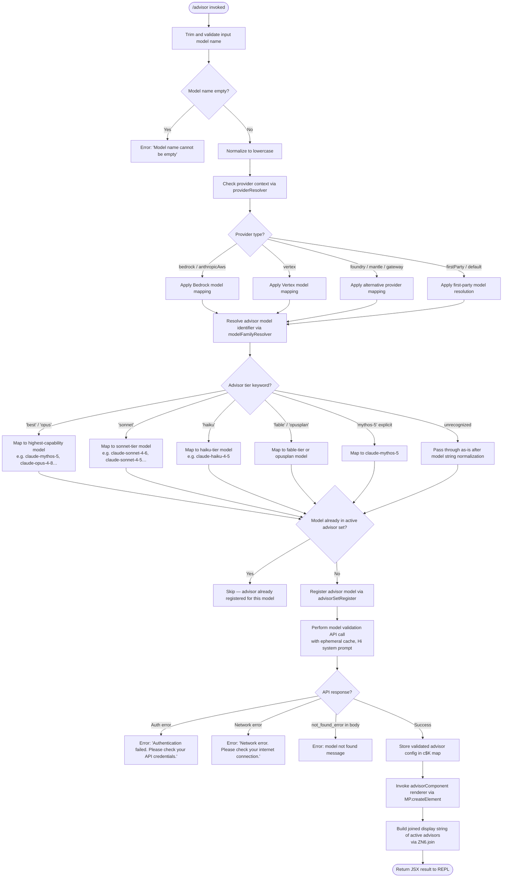

# `/advisor`

> Analysis basis: CC v2.1.173 bundle.js (AST extraction + Claude interpretation)
> Minimum version: v2.1.173

---

## Overview

The `/advisor` command allows the active Claude session to consult a stronger or more capable model at key decision points during task execution. It acts as a side-channel advisory mechanism, routing a query to a separate "advisor" model (typically a higher-capability variant) and incorporating the response back into the current agent's reasoning. The command is implemented as a `local-jsx` command backed by an async handler (`Qn7`) resolved via the module `a$K`.

---

## Registration

| Field | Value |
|---|---|
| type | `local-jsx` |
| name | `advisor` |
| description | `Let Claude consult a stronger model at key moments` |
| module_id | `a$K` |
| load_inline | `true` |
| loc_byte | `12881094` |
| loc_byte_end | `12881335` |
| loc_line | `9135` |
| argumentHint | `null` |
| isHidden | `null` |
| arbor_handler.name | `Qn7` |
| arbor_handler.fqn | `claude-2.1.173::Qn7` |
| arbor_handler.kind | `AsyncFunction` |
| arbor_handler.resolution_path | `module_id` |
| arbor_handler.n_hits | `1` |

Analysis basis: CC v2.1.173 bundle.js:+12881094

---

## Input Branching

The `/advisor` handler involves more than three distinct branching paths: model name validation, provider/model tier resolution, model availability checks (set membership), advisor-specific model family mapping, and error handling (auth failure, network failure, not-found). A Mermaid flowchart is used.



---

## Behavioral Spec

### Top-Level Handler: advisorCommandHandler

Analysis basis: CC v2.1.173 bundle.js:+12880550

```
async function advisorCommandHandler(commandInput, appContext):
    rawModelName = commandInput.trim()                        // +12880550
    if rawModelName is empty:
        raise Error("Model name cannot be empty")             // +12872149

    normalizedName = rawModelName.toLowerCase()               // +12872297

    // Provider detection
    providerType = resolveProviderContext(appContext)          // resolves bedrock, vertex, foundry, etc.

    // Check if this model is already tracked
    if advisorRegistryMap.has(normalizedName):                // +12872418
        return earlyReturnOrNoOp()

    // Resolve the canonical model string for the requested advisor tier
    canonicalModel = resolveAdvisorModel(normalizedName, providerType)

    // Validate the model via a lightweight API call
    validationResult = await validateAdvisorModel(canonicalModel, appContext)

    // Store and register
    advisorRegistryMap.set(normalizedName, validationResult)  // +12872626

    // Render output
    advisorDisplay = buildAdvisorComponent(appContext)        // +12880586, +12880718
    activeAdvisorList = advisorRegistryJoinedString()         // +12880861
    return renderJSX(advisorDisplay, activeAdvisorList)
```

---

### Sub-feature: Model Name Resolution (advisorModelResolver)

Analysis basis: CC v2.1.173 bundle.js:+12872667, +12873419

The function `Cn7` (advisorModelResolver) maps short tier keywords and alias strings to canonical Claude model identifiers. It also handles provider-specific normalization via the model-string normalizer (`v7`/modelStringNormalizer) and the model list lookup (`NL`/modelListResolver).

Supported keyword → canonical model mappings observed in literals:

| Keyword / Alias | Canonical Model(s) |
|---|---|
| `best`, `opus` | `claude-mythos-5`, `claude-opus-4-8`, `claude-opus-4-7`, `claude-opus-4-6`, `claude-opus-4-5`, `claude-opus-4-1`, `claude-opus-4-0` (priority order) |
| `sonnet` | `claude-sonnet-4-6`, `claude-sonnet-4-5`, `claude-sonnet-4-0` |
| `haiku` | `claude-haiku-4-5` |
| `fable` | `claude-fable-5` |
| `opusplan` | resolved via opusplan alias |
| `mythos-5` | `claude-mythos-5` |
| `fable-5` / `fable_5` | `claude-fable-5` |
| `opus-4-8` / `opus_4_8` | `claude-opus-4-8` |
| `opus-4-7` / `opus_4_7` | `claude-opus-4-7` |
| `opus-4-6` / `opus_4_6` | `claude-opus-4-6` |
| `opus-4-5` / `opus_4_5` | `claude-opus-4-5` |
| `sonnet-4-6` / `sonnet_4_6` | `claude-sonnet-4-6` |
| `sonnet-4-5` / `sonnet_4_5` | `claude-sonnet-4-5` |

Analysis basis: CC v2.1.173 bundle.js:+12873419, +12873467, +12873567, +12873843, +2256289

```
function advisorModelResolver(shortName, providerType):
    normalized = shortName.toLowerCase()                     // +12873437

    // Check inclusion in known model families
    if normalized includes "fable-5" or "fable_5":
        canonicalId = "claude-fable-5"
    else if normalized includes "opus-4-8" or "opus_4_8":
        canonicalId = "claude-opus-4-8"
    // ... (similar for opus-4-7 through opus-4-5, sonnet-4-6, sonnet-4-5)
    else if normalized == "best" or normalized == "opus":
        canonicalId = selectBestAvailableOpus(providerType)  // +12873541 via NL
    else if normalized == "sonnet":
        canonicalId = selectBestAvailableSonnet(providerType)
    else if normalized == "haiku":
        canonicalId = "claude-haiku-4-5"
    else if normalized == "mythos-5":
        canonicalId = "claude-mythos-5"
    else:
        canonicalId = normalizeModelString(normalized)       // +12873419 via v7

    return String(canonicalId)                               // +12873387
```

---

### Sub-feature: Provider Context Resolution (providerContextResolver)

Analysis basis: CC v2.1.173 bundle.js:+12872297, +12872316

The handler calls `lNH.includes` to check whether the current provider falls within a known set, then branches on provider type string. Provider values observed: `"bedrock"`, `"foundry"`, `"anthropicAws"`, `"mantle"`, `"vertex"`, `"firstParty"`, `"gateway"`.

Analysis basis: CC v2.1.173 bundle.js:+2111599, +2109381, +2109437, +2109491, +2109539, +2109548, +2110024

```
function resolveProviderContext(appContext):
    providerString = appContext.provider.toLowerCase()
    if lNH.includes(providerString):                         // +12872316
        return providerString
    else:
        return "firstParty"
```

---

### Sub-feature: Model Availability Lookup (modelListResolver)

Analysis basis: CC v2.1.173 bundle.js:+2111658, +2111683

`NL` (modelListResolver) queries the available model list (resolved via `zFH`) and applies provider-specific filtering. It delegates to `mM4` (modelMetadataResolver) for metadata enrichment, `lJ1` (entryListBuilder) via `Object.entries`, `j_8` (modelFinder) via `QO_.find`, and `c_` (modelStringFormatter) for string normalization.

```
function modelListResolver(providerType, options):
    baseList = fetchModelRegistry(providerType)               // via zFH
    enrichedList = enrichWithMetadata(baseList)               // via mM4 -> c_, p56, j_8, nJ1
    availableModels = filterByProvider(enrichedList, providerType)
    return availableModels
```

---

### Sub-feature: Model Validation API Call (modelValidationCaller)

Analysis basis: CC v2.1.173 bundle.js:+12872463, +12872513, +12872582, +12872607

The handler invokes `Xp` (advisorApiCaller) which is an async function that:
1. Performs a `globalThis.fetch` or SDK call (`inH`/apiRequestSender) to the Anthropic API endpoint (`https://api.anthropic.com`) with a timeout (`AbortSignal.timeout`, 10000 ms).
2. Uses an ephemeral cache control header (`"ephemeral"`, `"cache_control"`).
3. Sends a minimal system prompt fragment (`"Hi"`) to test model availability.
4. Tags the request as `"model_validation"` for observability.
5. On success, stores the result via `aA8` (resultStorer).
6. On error, classifies the failure:
   - Auth failures → `"Authentication failed. Please check your API credentials."` (bundle.js:+12872885)
   - Network errors → `"Network error. Please check your internet connection."` (bundle.js:+12872987)
   - `"not_found_error"` body type → model-specific not-found message (bundle.js:+12873085, +12873106)

```
async function modelValidationCaller(canonicalModel, appContext):
    requestConfig = buildRequestConfig(
        model       = canonicalModel,
        cacheControl = "ephemeral",                          // +12872607
        systemPrompt = "Hi",                                 // +12872582
        tag          = "model_validation"                    // +12872513
    )
    try:
        response = await fetch(ANTHROPIC_API_URL, requestConfig, timeout=10000)  // +2547255
        result = parseResponse(response)
        if result.type == "not_found_error":                 // +12873106
            raise ModelNotFoundError(result.message)         // +12873125
        return result
    catch AuthError:
        raise Error("Authentication failed. Please check your API credentials.")  // +12872885
    catch NetworkError:
        raise Error("Network error. Please check your internet connection.")       // +12872987
```

---

### Sub-feature: Advisor Registry Management (advisorRegistryManager)

Analysis basis: CC v2.1.173 bundle.js:+12872418, +12872626

The handler uses a persistent Map `c$K` (advisorRegistryMap) to track which advisor models are currently registered. Before initiating validation, it checks `c$K.has(normalizedName)` to skip duplicate registration. After successful validation, it calls `c$K.set(normalizedName, validatedConfig)`.

```
function advisorRegistryManager:
    // Check
    if advisorRegistryMap.has(normalizedModelName):          // +12872418
        return  // already registered

    // ... (validation) ...

    // Store
    advisorRegistryMap.set(normalizedModelName, config)      // +12872626
```

---

### Sub-feature: Advisor Display / JSX Rendering (advisorComponentRenderer)

Analysis basis: CC v2.1.173 bundle.js:+12880586, +12880718, +12880744, +12880861

After successful registration, the handler assembles a JSX component via `MP.createElement` and passes context through `Wm6` (advisorDisplayBuilder) and `VN6` (advisorContextFormatter). The final display string enumerates all currently registered advisor models joined with `", "` separator (bundle.js:+12880870) via `ZN6.join`.

```
function advisorComponentRenderer(registryMap, appContext):
    displayParts = []
    for each entry in registryMap:
        displayParts.push(formatAdvisorEntry(entry))
    joinedDisplay = ZN6.join(", ")                           // +12880861, +12880870
    return MP.createElement(AdvisorComponent, {
        display: joinedDisplay,
        context: appContext
    })                                                        // +12880586
```

---

### Sub-feature: Advisor Context Formatter (advisorContextFormatter — VN6)

Analysis basis: CC v2.1.173 bundle.js:+12880792, +7342101

`VN6` (advisorContextFormatter) applies message-role parsing via `rO` (roleParser), tool-use inclusion checking via `j1` (toolUseChecker) and `_.includes`, file-list formatting via `fLH` (fileListFormatter), and a special `"mythos-5"` model branch detection at bundle.js:+7342176. The `"mythos-5"` branch applies `zY_` (mythosModeFormatter) which involves additional context-window shaping via `c_`, `wL`, `kDH`, and an inclusion check (`cA8`).

```
function advisorContextFormatter(conversationContext, registryMap):
    roles = roleParser(conversationContext)                   // via rO
    hasToolUse = toolUseChecker(roles)                       // via j1 + _.includes
    files = fileListFormatter(conversationContext)            // via fLH
    if registryMap includes "mythos-5":                      // +7342176
        return mythosModeFormatter(roles, files)             // via zY_
    else:
        return standardContextFormatter(roles, files)
```

---

## State & Side Effects

| Item | Detail |
|---|---|
| Telemetry: `tengu_api_success` | Fired on successful advisor API validation call (bundle.js:+13735236) |
| Telemetry: `tengu_lone_surrogate_sanitized` | Fired if lone Unicode surrogates are sanitized in model name or response (bundle.js:+13734985) |
| Telemetry: `tengu_prompt_cache_1h_config` | Fired when 1-hour prompt cache config is applied to advisor call (bundle.js:+13680939) |
| Telemetry: `tengu_bg_spare_claim` | Fired if a background spare worker is claimed for the advisor side query (bundle.js:+16762017) |
| Telemetry: `tengu_bg_dispatch_low_mem` | Fired if memory pressure is detected during advisor dispatch (bundle.js:+16761185) |
| Telemetry: `tengu_bg_retire_pinned_low_mem` | Fired if pinned workers are retired under low-memory conditions (bundle.js:+16765221) |
| Telemetry: `tengu_bg_prewarm_per_sweep` | Fired during background worker sweep for prewarming (bundle.js:+16765342) |
| Telemetry: `tengu_daemon_control` | Fired on daemon-level control events related to advisor worker lifecycle (bundle.js:+16797646) |
| Telemetry: `tengu_scheduled_task_missed` | Fired if a scheduled advisor-related background task is missed (bundle.js:+16260900) |
| Telemetry: `tengu_bg_dispatch_sigkill_escalate` | Fired if a SIGKILL escalation is needed for a background advisor worker (bundle.js:+16760584) |
| Telemetry: `tengu_bg_spare_enable` | Fired when a spare background worker is enabled for advisor use (bundle.js:+16761889) |
| Telemetry: `tengu_bg_spare_claim_fail` | Fired when claiming a spare worker for the advisor fails (bundle.js:+16762283) |
| Persistent state: `c$K` (advisorRegistryMap) | A Map tracking registered advisor models across the session; persists until process exit |
| Side query tag | Requests tagged `"side_query"` (bundle.js:+13733657) and `"sideQuery"` (bundle.js:+13735026) to distinguish from main agent traffic |
| Cache control | Advisor API calls use `"ephemeral"` cache control (bundle.js:+12872607) and may activate the `"1h"` prompt-cache config (bundle.js:+13734507) |
| Background worker dispatch | Advisor queries may be dispatched to background workers (`Xp` → `X` → worker pool) |
| Process exit on CLI error | On `"cli_error"` class failures, `process.exit(1)` is called (bundle.js:+13298584, +13298571) |
| Hook registration | <!-- TODO: not found in depth-2 traversal; needs --depth 4 --> |
| appState changes | <!-- TODO: not found in depth-2 traversal; needs --depth 4 --> |
| Sound | <!-- TODO: not found in depth-2 traversal; needs --depth 4 --> |

---

## Version History

| Version | Change |
|---|---|
| v2.1.173 | Initial analysis |

---

## Common Mistakes

1. **Providing an unrecognized model name**: If the supplied name does not match any known alias or canonical model string, the handler attempts to pass it through as-is, which will then fail at the model validation API call stage with a `not_found_error`. Use a recognized tier keyword (`best`, `opus`, `sonnet`, `haiku`, `fable`) or a full canonical model identifier.
2. **Registering the same advisor model twice**: The handler silently skips re-registration if the normalized model name already exists in the advisor registry (`c$K`). This is intentional but can be surprising if the user expects an update or refresh; a session restart clears the registry.
3. **Using advisor with an incompatible provider**: Some model tiers (e.g., `claude-mythos-5`, `claude-fable-5`) may not be available on all providers (Bedrock, Vertex, Foundry). The provider-context branch will attempt to remap the model, but if no compatible equivalent exists the validation call will return a `not_found_error`.
4. **Expecting synchronous output**: The advisor validation involves a live API call with a 10,000 ms `AbortSignal.timeout`. Under slow network conditions the command may take several seconds before returning a result or error.
5. **Confusing `/advisor` with the main model selection**: `/advisor` registers a side-channel advisor model, not the primary model used for the current session. The primary model is set separately; `/advisor` only affects which model is consulted at advisory decision points.

---

## Appendix — Identifier Mapping

> For bundle debugging only. Identifiers change across versions.

| Identifier | Role |
|---|---|
| `Qn7` | advisorCommandHandler — top-level async handler for `/advisor` |
| `Wm6` | advisorDisplayBuilder — builds display state and validates model name input |
| `Cn7` | advisorModelResolver — maps short tier names to canonical model identifiers |
| `bn7` | advisorModelAliasExpander — expands alias strings (e.g. `fable-5`, `opus_4_8`) to canonical IDs |
| `VN6` | advisorContextFormatter — formats conversation context for the advisor side query |
| `Xp` | advisorApiCaller — orchestrates the advisor API call, worker dispatch, and result handling |
| `Q9` | modelStringNormalizerTop — top-level model string normalizer (tier routing) |
| `NL` | modelListResolver — resolves available model list by provider |
| `mM4` | modelMetadataResolver — enriches model entries with metadata |
| `j_8` | modelFinder — finds a specific model entry in the registry |
| `lJ1` | entryListBuilder — builds model entry list via `Object.entries` |
| `c_` | modelStringFormatter — formats/normalizes model identifier strings |
| `v7` | modelStringNormalizer — normalizes raw model strings |
| `rO` | roleParser — parses conversation message roles for context assembly |
| `fLH` | fileListFormatter — formats file context for advisor queries |
| `zY_` | mythosModeFormatter — applies mythos-5-specific context shaping |
| `cA8` | inclusionChecker — checks string inclusion for context decisions |
| `kDH` | arrayOrValueChecker — checks if a value is array or scalar |
| `wL` | contextWindowBuilder — builds context window objects |
| `LLH` | contextAssembler — assembles full context payload |
| `xa` | contextMerger — merges context segments |
| `kE` | contextEnricher — enriches context with additional fields |
| `yDH` | contextDepthHandler — handles context depth/nesting |
| `aD6` | contextReplacer — applies replacements in context strings |
| `Zj` | contextZipper — zips context segments |
| `tZ1` | contextTransformer — transforms context for submission |
| `SI` | modelSelectorInterface — interface for model selection logic |
| `j1` | toolUseChecker — checks for tool-use presence in conversation |
| `DJ` | displayJoiner — joins display segments with case normalization |
| `iO` | identifierOrganizer — organizes model identifiers |
| `YD6` | identifierDeriver — derives identifiers from context |
| `xM4` | prefixMatcher — matches model string prefixes |
| `wD6` | caseNormalizer — normalizes model names via toLowerCase and Object.values |
| `NY` | normalizeYielder — yields normalized model values |
| `$LH` | literalHolder — holds literal constant values |
| `f6` | stringFormatter — general string formatting utility |
| `HW` | stringReplacer — applies string replacement operations |
| `tc` | typeChecker — checks model type inclusion |
| `nA8` | nameAvailabilityChecker — checks if a model name is in an allowed set |
| `nlH` | nameLiteralHolder — holds name-related literals |
| `Pz4` | prefixZoneResolver — resolves model prefix zones via toLowerCase |
| `clH` | classificationHolder — checks model classification |
| `sZ1` | segmentZipper — zips segments with index lookup |
| `Jz4` | junctionZoneResolver — resolves junction conditions for model routing |
| `Xz4` | extensionZoneResolver — resolves extension zone conditions |
| `aZ1` | auxiliaryZoneLocator — locates auxiliary zone entries |
| `J_8` | joinEntryBuilder — builds joined entries via `Object.entries` |
| `B_` | baseResolver — base resolution utility |
| `nNH` | nameNullHolder — checks for null/inclusion in name field |
| `Jz4` | junctionResolver — additional junction routing logic |
| `aA8` | resultStorer — stores validated advisor API results |
| `rA8` | requestAuthStorer — accesses auth store via `qV1.getStore` |
| `QM` | quotaManager — accesses quota/session store via `HV1.getStore` |
| `OK` | outputKnob — string output utility |
| `XY_` | contextXYLinker — links context entries |
| `n78` | nameResolver78 — resolves names via `c_` |
| `YCH` | yielderContextHandler — handles yield/context for API calls |
| `TA` | taskAssembler — assembles task objects (Uw, dC, W9) |
| `oo8` | optionsOrganizer — organizes call options |
| `Y6` | yieldSix — yield/dispatch utility with registry checks |
| `ao8` | arrayOptionsOrganizer — organizes array-based options |
| `sv` | sessionValidator — validates session/HIPAA compliance |
| `ZE_` | zoneEntryResolver — resolves zone entries via `c_` |
| `sIH` | sessionInfoHolder — holds session info literals |
| `uWK` | unicodeWorkerKit — handles Unicode/surrogate sanitization |
| `j78` | jobSeventyEight — job assembly with Ba, j1, includes |
| `e2` | entryMapper — maps entries via `H.map` |
| `n2H` | nameTwoHolder — handles name+array resolution for rendering |
| `CH` | contextHolder — holds context via `JSON.stringify` |
| `QB` | queryBuilder — builds queries with random bytes and N |
| `e4` | entryFour — entry builder with Uw, b6 |
| `ANA` | arrayNodeAggregator — aggregates array nodes |
| `Nd6` | nodeDescendantSix — node descendant resolution |
| `Ny` | nodeYielder — yields nodes via `structuredClone` |
| `Id6` | identifierDescendantSix — identifier descendant resolution |
| `_NA` | underscoreNodeAggregator — applies HNA + H.replace |
| `pzH` | performanceZeroHolder — performance timing utility |
| `H1` | headerOne — header assembly via q56 |
| `KG6` | keyGroupSix — key group resolver (aY9, naH, qG6) |
| `aY9` | asyncYieldNine — async yield with ot4, SH |
| `naH` | nameArrayHolder — holds name arrays via aZ |
| `qG6` | queryGroupSix — query group with naH, QO8 |
| `Pn` | prefixNormalizer — normalizes agent: prefixes |
| `rt4` | routeTransformerFour — transforms route/agent strings |
| `su` | startsWith utility — checks `repl_main_thread` and similar prefixes |
| `SH` | sessionHandler — main session handler (logging, errors) |
| `R56` | resultFiftySix — result handler |
| `$F` | mainApiFunction — core API request orchestrator |
| `zE_` | zoneEntryLinker — splits/trims/indexes zone strings |
| `O9` | optionsNine — options handler via CDH |
| `ca` | contextAssistant — context assistant via rA8 |
| `y6` | yieldSixHelper — yield helper via BG |
| `WY_` | wildcardYielder — handles replace + encodeURIComponent |
| `N` | nameResolver — multi-purpose name resolution (hVH, d8f, CH, lf, eh, oFH, i8f) |
| `Nz` | nameZero — name resolution via E78 |
| `KV1` | keyValueOne — key-value resolver via Boolean |
| `Uw` | utilityWrapper — utility wrapper (O7, vj, B4, gA, NP, $O, D26, VrH) |
| `QO` | queryOrganizer — query organization |
| `QC4` | queryContextFour — query context (NP, PrH) |
| `b_` | baseUnderscore — base underscore utility |
| `YH8` | yieldHandlerEight — yield handler (trust, N, Date.now, sy, Q2) |
| `aC4` | asyncContextFour — async context manager (UUID, M.set/get, N, hVH, CH) |
| `DB` | debugBase — debug utility (_Rf, vvH) |
| `xw` | executionWrapper — execution wrapper (f6, OK, sy, gc, gdH, b41, zM_, DM_) |
| `oC4` | optionsContextFour — options context (V89, E89, c_) |
| `dC4` | dataContextFour — data context (M78, vvH, vFH, d6H, QO, S1) |
| `mDH` | messageDeltaHolder — message delta (QO, Date.now, Promise.resolve, Po8, Jw4, fQ6) |
| `Xo8` | executionOrchEight — execution orchestrator via Date.now |
| `_26` | underscopeTwentySix — Object.entries + toLowerCase |
| `djH` | debugJournalHolder — debug journal via console.error |
| `M78` | moduleSeventyEight — module resolver (AW, J9, j1, vvH) |
| `inH` | interfaceNetworkHandler — network request handler (fetch, AbortSignal.timeout) |
| `HjH` | handlerJournalHolder — handler journal (inH, kH, bH, uP4, N) |
| `vj` | variantJoiner — variant joining (Z_8, O7, VrH, CB, tv, f6, RB, W9, dC) |
| `a2` | asyncTwo — async utility via $O |
| `d6H` | dataSixHolder — data six holder (ieK.find, H.startsWith, ZQ6) |
| `V` | valueResolver — value resolution |
| `S` | sessionObject — session object (WrK, v3, N, SH, HG5, w.write) |
| `k` | keyResolver — key resolver via A |
| `y` | yieldManager — yield/background worker manager |
| `G` | globalInputHandler — global keyboard/editor input handler |
| `I` | inputResolver — input resolver |
| `Y` | yieldHandler — yield handler (HX, process.exit, z.abort) |
| `T` | triggerHandler — trigger handler (pV6, N76) |
| `z` | zoneManager — zone manager (kH, bH, wS, CU) |
| `td` | triggerDispatcher — trigger dispatcher via XY |
| `j` | jobManager — job manager (A.values, S.kill) |
| `ONK` | operatorNodeKit — operator node kit (c45, l45, n45, i45, r45) |
| `cvK` | changeVectorKit — change vector kit (Zd8, Ed8, dvK, A.recordChange) |
| `rvK` | replaceVectorKit — replace vector kit (Zd8, Ed8, ivK, A.recordChange) |
| `svK` | swapVectorKit — swap vector kit (Zd8, Ed8, avK, A.recordChange) |
| `b` | bufferManager — buffer manager (z, S, P.add, X.set, d.map) |
| `evK` | editVectorKit — edit vector kit (_.getRegister, Zd8, Ed8, _NK, _.recordChange) |
| `FvK` | forwardVectorKit — forward vector kit (Math.min/max, V4, K.slice/split) |
| `gvK` | groupVectorKit — group vector kit (Math.min/max, V4, L.slice/split, OXA) |
| `D` | daemonManager — daemon/worker manager (A.get, b.kill, Hd.spawn) |
| `P` | protocolParser — protocol parser (Buffer.concat, X.indexOf, EH) |
| `JXA` | jsonExtractorA — JSON extractor (b45, x45, u45, m45, p45, etc.) |
| `HA5` | handlerAssistantFive — handler assistant (H.find, A.find) |
| `rDA` | requestDigestA — request digest via KWK.createHash sha256 |
| `E` | executionManager — execution manager (W, Math.max, Math.min) |
| `X` | executionContext — execution context (M, q.setTimeout) |
| `tIH` | typeInfoHolder — type info holder (j1, iO, VI, _.includes) |
| `VI` | variantIdentifier — variant identifier via c_  |
| `KG6` | keyGroupSix (see above) |
| `Pn` | prefixNormalizer (see above) |
| `R56` | resultFiftySix (see above) |

---

Note: index built via Arbor fallback; some signals (telemetry, literals) may be missing — see arbor-fallback.js.