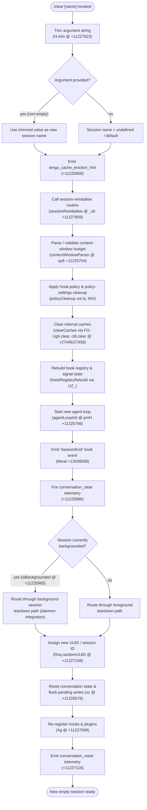

# `/clear`

> Analysis basis: CC v2.1.173 bundle.js (AST extraction + Claude interpretation)
> Minimum version: v2.1.173

---

## Overview

`/clear` (also aliased as `/reset` and `/new`) starts a brand-new Claude Code session with an empty conversation context. The previous session is preserved on disk and remains resumable via `/resume`. Optionally, a name may be supplied as an argument to label the new session.

---

## Registration

| Field | Value |
|---|---|
| type | `local` |
| name | `clear` |
| description | `Start a new session with empty context; previous session stays on disk (resumable with /resume)` |
| aliases | `reset`, `new` |
| argumentHint | `[name]` |
| supportsNonInteractive | `true` |
| thinClientDispatch | `post-text` |
| module_id | `xnq` |
| load_inline | `true` |
| loc_byte | `11227997` |
| loc_byte_end | `11228288` |
| loc_line | `7352` |
| arbor_handler.name | `fv7` |
| arbor_handler.fqn | `claude-2.1.173::fv7` |
| arbor_handler.kind | `AsyncFunction` |
| arbor_handler.resolution_path | `module_id` |
| arbor_handler.n_hits | `0` |

Analysis basis: CC v2.1.173 bundle.js:+11227997

---

## Input Branching

The command has 3+ distinct execution paths (argument present/absent, cache-eviction telemetry branch, backgrounded-session check, and the full session-teardown/reinitialisation tree), so a Mermaid flowchart is used.



---

## Behavioral Spec

### 1 — Entry point: argument parsing

The handler `fv7` (AsyncFunction, resolved via `module_id` path) is the primary entry point.

```
async function clearCommandHandler(rawArgument, appContext):
    trimmedArg = rawArgument.trim()            # H.trim @ +11227823
    sessionName = trimmedArg if trimmedArg != "" else undefined
    emit telemetry: tengu_cache_eviction_hint  # +11225858
    await sessionReinitialise(sessionName, appContext)
```

Analysis basis: CC v2.1.173 bundle.js:+11227823, +11227859

---

### 2 — Context-window budget parsing (`contextWindowParser` / `qx6`)

Before tearing down state the routine validates the integer context-window budget:

```
function parseContextWindowBudget(rawValue):
    parsed = parseInt(rawValue, 10)           # base-10 parse @ +13548419
    if not Number.isFinite(parsed):
        return defaultBudget                  # kj fallback @ +13548484
    clamped = Math.max(1000, Math.min(parsed, …))
             # lower bound 1000 @ +13548606
             # Math.max @ +13548637, Math.min @ +13548650
    return clamped
```

Analysis basis: CC v2.1.173 bundle.js:+13548419, +13548430, +13548606

---

### 3 — Cache and policy flush (`clearCaches` / `FO`)

Two internal caches are cleared synchronously before the new session starts:

```
function clearCaches():
    Ug6.clear()    # first cache map cleared @ +27446
    ci8.clear()    # second cache map cleared @ +27458
```

Analysis basis: CC v2.1.173 bundle.js:+27446, +27458

---

### 4 — Hook registry rebuild (`hookRegistryRebuild` / `UZ_`)

Policy settings (`"policySettings"` literal @ +3341177) and hook configuration (`"hooks"` literal @ +3341015) are reloaded from the application state, and the hook registry is rebuilt from scratch.

```
function hookRegistryRebuild(appState):
    rawSettings = appState.read("policySettings")  # +3341177
    hookConfig  = appState.read("hooks")            # +3341015
    applySettingsToRegistry(rawSettings, hookConfig)
    reRegisterHookHandlers()
```

Analysis basis: CC v2.1.173 bundle.js:+3341015, +3341177

---

### 5 — Agent loop teardown and re-initialisation (`agentLoopInit` / `pmH`)

The function fires a `"SessionEnd"` hook event (literal @ +13538938) and then creates a new agent loop from a clean state:

```
async function agentLoopInit(sessionName, context):
    fireHookEvent("SessionEnd")              # +13538938
    newLoop = createAgentLoop({
        sessionName: sessionName,
        effort: resolveEffortLevel(),        # "effort" literal @ +13550106
    })
    return newLoop
```

Analysis basis: CC v2.1.173 bundle.js:+13538911, +13538938, +13550106

---

### 6 — Background-session check (`isBackgrounded`)

After the `"SessionEnd"` event the handler inspects whether the current session is backgrounded:

```
function routeTeardown(session, daemon):
    if session.isBackgrounded:              # literal "isBackgrounded" @ +11225965
        daemonTeardown(session, daemon)     # daemon integration path
    else:
        foregroundTeardown(session)
```

Analysis basis: CC v2.1.173 bundle.js:+11225965

---

### 7 — Session ID assignment and state flush

A new cryptographically random UUID is assigned, pending writes are flushed, and the write-buffer is cleared:

```
async function assignNewSession(sessionName):
    newId = crypto.randomUUID()             # Rnq.randomUUID @ +11227158
    flushPendingWrites()                    # xz flush @ +11226579
    clearPendingWriteBuffer()               # _.clear @ +11226178
    return { id: newId, name: sessionName }
```

Analysis basis: CC v2.1.173 bundle.js:+11227158, +11226178, +11226579

---

### 8 — Plugin and hook re-registration (`loadPluginHooks` / `Ag`)

After state is cleared, plugins and hooks are re-loaded. Safe-mode and `allowManagedHooksOnly` guards are applied first:

```
async function loadPluginHooks(appState):
    if safeMode:
        log("Skipping plugin hooks - safe mode …")   # +5078616
        return
    if allowManagedHooksOnly and not hasManagedPlugins:
        log("Skipping plugin hooks - allowManagedHooksOnly …") # +5078709
        return
    emit telemetry: tengu_cache_eviction_hint
    reloadAllPluginHooks()                            # +5078811 literal "load_plugin_hooks"
    emit dS event
    emit telemetry: hook_session_start_reload_skills  # +5080059
```

Analysis basis: CC v2.1.173 bundle.js:+5078616, +5078709, +5078811, +5080059

---

### 9 — Telemetry emission: `conversation_clear` and `conversation_reset`

Two distinct telemetry events are fired in sequence:

```
function emitClearTelemetry(context):
    track("conversation_clear")    # literal @ +11225896
    # … state transition …
    track("conversation_reset")    # literal @ +11227119
```

Analysis basis: CC v2.1.173 bundle.js:+11225896, +11227119

---

## State & Side Effects

| Item | Detail |
|---|---|
| Telemetry | `tengu_cache_eviction_hint` (+11225858), `tengu_run_hook` (+13588398), `tengu_repl_hook_finished` (+13572142), `tengu_hook_plugin_metrics` (+13566669), `tengu_feature_ok` (+1016269), `tengu_feature_bad` (+1016336), `tengu_session_renamed` (+13451191), `tengu_hook_plugin_injected` (+13586760) |
| Conversation state | All in-memory conversation messages and tool state are discarded; replaced with an empty context |
| Previous session | Persisted to disk — resumable via `/resume` |
| Cache maps | `Ug6` and `ci8` are cleared synchronously (+27446, +27458) |
| Pending write buffer | Flushed and cleared (+11226178, +11226579) |
| Hook registry | Fully torn down and rebuilt from current policy settings and hook configuration |
| Session UUID | New random UUID assigned via `crypto.randomUUID()` (+11227158) |
| Plugin hooks | Re-registered unless safe-mode or `allowManagedHooksOnly` blocks them |
| `SessionEnd` hook event | Fired to all registered hook handlers before the new session starts (+13538938) |
| `conversation_clear` literal | Emitted at +11225896 |
| `conversation_reset` literal | Emitted at +11227119 |
| Daemon integration | If the session is backgrounded (`isBackgrounded` @ +11225965), the daemon teardown path is taken via `r0A` / background-process manager |
| Sound | <!-- TODO: not found in depth-2 traversal; needs --depth 4 --> |
| appState changes | Policy settings and hooks are re-read from `appState`; new session name written if supplied |

---

## Version History

| Version | Change |
|---|---|
| v2.1.173 | Initial analysis |

---

## Common Mistakes

1. **Confusing `/clear` with a destructive delete.** The old session is written to disk; it is not deleted. Use `/resume` to return to it.
2. **Providing a session name that is only whitespace.** The argument is trimmed (+11227823); a blank string after trimming is treated as no name at all.
3. **Expecting plugins to stay loaded without re-registration.** `/clear` tears down the full hook registry and re-registers plugins. If safe-mode is active, plugin hooks will not be re-registered.
4. **Using `/clear` inside a non-interactive pipeline and expecting synchronous completion.** The command supports non-interactive mode (`supportsNonInteractive: true`) but the handler is `async`; callers must await resolution.
5. **Assuming `/reset` and `/new` behave differently.** They are registered aliases with identical behaviour.

---

## Appendix — Identifier Mapping

> For bundle debugging only. Identifiers change across versions.

| Identifier | Role |
|---|---|
| `fv7` | Main async handler for `/clear` (arbor_handler) |
| `_x6` | Session reinitialise orchestrator |
| `qx6` | Context-window budget parser |
| `kj` | Policy/settings reader helper |
| `UK` | Settings-file reader (calls `f6`, `VQ6`) |
| `fAH` | Policy settings applier |
| `aU` | Auxiliary settings loader |
| `BG` | Base getter utility |
| `DF` | Top-level state flush coordinator |
| `pZ_` | Atomic state store accessor (get/set via `$A9`) |
| `FO` | Cache-clear executor (`Ug6.clear`, `ci8.clear`) |
| `UZ_` | Hook registry rebuilder |
| `pmH` | Agent loop teardown / re-init coordinator |
| `XL` | New agent loop factory |
| `y6` | App-state reader |
| `oh` | Secondary app-state reader |
| `dP` | Effort-level resolver (model-string matching) |
| `av` | Effort mapper (`"high"` default) |
| `Jh` | Session-end hook dispatcher |
| `p6` | Hook post-processor |
| `hG` | Full session runner / hook-execution engine |
| `$b` | Hook input serialiser |
| `N` | Log/debug emitter |
| `hOH` | Hook-type selector |
| `hDA` | Plugin hook loader / filter |
| `NDA` | Third-party hook filter |
| `CH` | JSON.stringify wrapper |
| `SH` | Hook result handler |
| `bH` | `tengu_feature_bad` reporter |
| `TvH` | `tengu_feature_ok` helper |
| `dN` | Abort-controller manager |
| `mg8` | Hook queue manager |
| `EDA` | MCP-tool hook executor |
| `Bg8` | Hook output parser (JSON vs plain text) |
| `tqH` | Plugin metrics aggregator |
| `TDA` | HTTP hook executor |
| `C2K` | Hook output sanitiser |
| `Fg8` | Subprocess hook spawner |
| `kH` | Feature-ok telemetry helper |
| `gF` | Telemetry event emitter |
| `pxH` | Session context packer |
| `y56` | Abort-signal builder |
| `$6` | Queue helper |
| `q56` | Queue base constructor |
| `f` | Active-session set manager |
| `q` | Session lifecycle set |
| `$1` | Process-exit handler |
| `L` | Session closer |
| `A` | Session map (lowercase) |
| `D` | Daemon session manager / dispatcher |
| `b` | Background-session worker |
| `$SH` | Session file reader |
| `w` | Daemon config updater |
| `Ua` | zLH wrapper |
| `QsH` | Session file writer |
| `DW9` | Session filter helper |
| `P` | IPC buffer handler |
| `z` | Daemon-stop orchestrator |
| `S` | Stdio writer |
| `X` | Stream timeout manager |
| `d` | Stream pair |
| `OgK` | Prompt-table renderer |
| `W1H` | Session roster updater |
| `d8` | Subprocess wrapper |
| `K` | Column formatter |
| `kF8` | Memory-low checker |
| `Y6` | Model/token tracker |
| `i06` | Pinned-session reader |
| `ck_` | Pins.json path builder |
| `n6` | JSON.parse wrapper |
| `R8` | ENOENT error handler |
| `ht4` | Directory session loader |
| `Q` | PTY/socket session handler |
| `l` | Scheduled-task loop |
| `C` | Socket write helper |
| `B` | Session set |
| `hZ` | Path-split helper |
| `Lv` | Binary frame encoder |
| `Hu8` | Binary frame decoder |
| `Q0A` | Socket claim handshaker |
| `MjA` | Session manifest writer |
| `k05` | Claim timeout watcher |
| `I05` | Claim-frame builder |
| `a7` | N8 error reporter |
| `EH` | String coercion helper |
| `r0A` | Background-session lifecycle manager |
| `Hf` | Path joiner (vJ.join wrapper) |
| `Tq` | Session state reader/writer |
| `YO` | Active-session marker |
| `DXH` | Worktree path parser |
| `m7` | Manifest path helper |
| `Of6` | Session-check promise wrapper |
| `mx6` | Session-path constructor |
| `B$H` | Session-file path builder |
| `RQ` | Roster-entry path resolver |
| `ux6` | Session directory path builder |
| `Y` | Forced-shutdown handler |
| `HX` | Exit-code helper |
| `A6` | Queue/slot ident helper |
| `X7` | Slot state marker |
| `CD` | Context dispatcher |
| `k4A` | Full reset orchestrator (clears all sub-caches) |
| `V4A` | Reset helper variant |
| `uV` | Skill-index reset handler |
| `Gp` | Skill cache clearer |
| `Qb8` | Secondary skill-cache clear helper |
| `igq` | Tertiary reset helper |
| `HmH` | WC6 invalidation wrapper |
| `PT9` | `_g` cache clear + ISH |
| `ISH` | Index-save-handler (re-initialises skill-index file) |
| `fM6` | Feature-flag reset |
| `wHH` | Multi-cache reset dispatcher |
| `WhH` | `su` call wrapper |
| `$C8` | `fU` map cleaner |
| `BT6` | WT reset helper |
| `KM6` | Compact-state reset |
| `LM6` | BG/x6H reset |
| `AC8` | `gpq` cache clearer |
| `bg9` | KV6 + dU_ cache clearer |
| `BDq` | BDq cache clearer |
| `P0H` | P0H cache clearer |
| `eY` | OutputToken counter reset |
| `E9A` | Additional reset step |
| `cS` | `ub8` map clearer |
| `dGq` | `gxH` + `LHA` cache clearer |
| `kDq` | `cA6` + `lk6` cache clearer |
| `mq_` | `YdH` cache clearer |
| `Pcq` | Pcq cache clearer |
| `ia9` | `U28` cache clearer |
| `co8` | `H.has` checker |
| `hq_` | `wdH` cache clearer |
| `Euq` | WC6 invalidation (via Euq) |
| `WC6` | CR8/XC6 cache invalidator |
| `gc9` | `He` + `k2H` cache clearer |
| `Ow` | CWD resolver (isAbsolute / resolve) |
| `o6` | File-stat helper |
| `h9_` | Store-context getter |
| `dO` | Path normaliser |
| `m6H` | Z56 path helper |
| `P_` | BG path joiner |
| `GSH` | Global state helper |
| `vT` | Version-transition helper |
| `xz` | Write-buffer flusher |
| `vg8` | pPK add/delete wrapper |
| `A66` | Zr9 helper |
| `r0` | ZH6 + cleanup orchestrator |
| `ZH6` | j2H hash dispatcher |
| `j2H` | SHA-256 content hasher |
| `pN` | Y6 model-tracker call |
| `bnq` | gzH helper |
| `X$` | $4 / y6 dispatcher |
| `$4` | Hook-path resolver |
| `y9` | Hook registrar |
| `ok` | ok state check |
| `lM` | YC / vPH message builder |
| `YC` | BG message formatter |
| `Ax6` | $4 alias |
| `ri8` | Random-UUID + event emitter |
| `GZA` | GZA post-emit step |
| `WZA` | gg6.emit wrapper |
| `hr` | $4 hook resolver (hr variant) |
| `xR` | Jh + NOH + y6 combined dispatcher |
| `NOH` | File-append + mkdir log writer |
| `QuH` | Symlink/unlink session-dir manager |
| `jDA` | mkdir + iH6 helper |
| `iH6` | YDA.join + DL6 + y6 path builder |
| `J$` | YDA.join + iH6 path variant |
| `d16` | vg8 + jDA + J$ combined opener |
| `mV` | YC / Kx_ / vPH message builder variant |
| `Y5` | Y5 state helper |
| `I_` | Module initialiser (xZH, Gi8, tF6, eF6, foK, EGA.set) |
| `eF6` | Bound-function helper |
| `W` | SDK/connection manager |
| `N76` | Connection-type resolver |
| `JA` | Error/string coercer |
| `T` | pV6 / N76 type selector |
| `pV6` | pV6 value helper |
| `iM` | iM state helper |
| `ep` | $4 + lC8.emit + NOH dispatcher |
| `KKH` | $4 + XPK + y6 hook dispatcher |
| `XPK` | gK.appendFile / mkdir log writer |
| `Ag` | Plugin-hook loader (main entry) |
| `$f` | UK + O7 settings reader |
| `O7` | f6 / VQ6 settings variant |
| `Ps` | x8 / Object.entries / _.add policy applier |
| `x8` | oa6 + VB store accessor |
| `zdH` | Date.now + u8 log writer |
| `u8` | gbf / o6 / CH / appendFileSync log helper |
| `l5H` | UK / N / CT9 plugin-loader safe-mode guard |
| `OE6` | XL / X$ / $Y / y6 / P2 main-session launcher |
| `$Y` | $Y session variant |
| `P2` | Full agent-loop runner |
| `M` | MCP server manager |
| `SRH` | MCP connection runner |
| `$n8` | MCP update applier |
| `$` | ZwK wrapper |
| `oWA` | MCP client orchestrator |
| `s1` | DKA.randomUUID / _.uuid / _.now session-ID helper |

---

Note: index built via Arbor fallback; some signals (telemetry, literals) may be missing — see arbor-fallback.js.