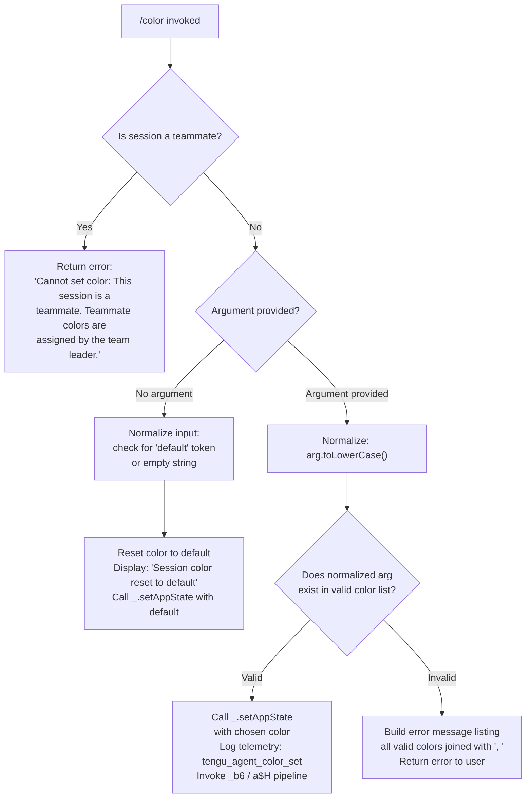

# `/color`

> Analysis basis: CC v2.1.170 bundle.js (AST extraction + Claude interpretation)
> Minimum version: v2.1.170

---

## Overview

The `/color` command sets the visual color of the prompt bar for the current Claude Code session. It accepts an optional color name argument (or no argument to reset to default), validates it against a known list of supported colors, and applies the change by mutating application state. Teammate sessions are restricted from using this command because their colors are assigned by the team leader.

---

## Registration

| Field | Value |
|---|---|
| type | `local-jsx` |
| name | `color` |
| description | `Set the prompt bar color for this session` |
| argumentHint | `null` |
| immediate | `true` |
| module_id | `Vdq` |
| load_inline | `true` |
| loc_byte | `11169011` |
| loc_byte_end | `11169228` |
| loc_line | `7342` |
| arbor_handler.name | `rGf` |
| arbor_handler.fqn | `claude-2.1.170::rGf` |
| arbor_handler.kind | `AsyncFunction` |
| arbor_handler.resolution_path | `module_id` |
| arbor_handler.n_hits | `0` |

Analysis basis: CC v2.1.170 bundle.js:+11169011

---

## Input Branching

Four distinct branches exist: teammate guard, reset-to-default (no argument), valid color name, and invalid color name. A Mermaid flowchart is required.



Analysis basis: CC v2.1.170 bundle.js:+11167850 – +11168450

---

## Behavioral Spec

### 1. Entry Point — Handler Dispatch (`rGf`)

The Arbor-resolved handler `rGf` is an `AsyncFunction` reached via `module_id → Vdq`. It receives the parsed command context and immediately delegates to the core implementation function (`Jb8`), passing session state (`H`) as a secondary argument.

```
async function colorCommandHandler(commandContext):
    sessionState = getSessionState()         // H, loc_byte: 11167781
    return await colorCommandImpl(commandContext, sessionState)   // Jb8, loc_byte: 11167789
```

Analysis basis: CC v2.1.170 bundle.js:+11167781

---

### 2. Core Implementation (`Jb8`)

```
async function colorCommandImpl(input, sessionState):

    // 1. Teammate guard
    isTeammate = checkTeammateStatus(sessionState)   // H3 → hG → Uz_.getStore
    if isTeammate:
        return errorResult(
            "Cannot set color: This session is a teammate. " +
            "Teammate colors are assigned by the team leader."
        )
        // loc_byte: 11167861

    // 2. Normalize input
    rawArg = input.argument ?? ""
    normalizedArg = rawArg.toLowerCase()             // A.toLowerCase, loc_byte: 11168027

    // 3. Determine valid color list
    validColors = getValidColorList()                // iGf, loc_byte: 11168045
    // Also checks secondary list: vO, loc_byte: 11168069

    // 4. Branch on argument presence / validity
    if normalizedArg == "" or normalizedArg == "default":
        // Reset path
        _.setAppState({ promptBarColor: "default" }) // loc_byte: 11168231
        logTelemetry("tengu_agent_color_set", { color: "default" })
        persistColorSetting("default")               // _b6 pipeline, loc_byte: 11168220
        return successMessage("Session color reset to default")
        // literal loc_byte: 11168450

    else if validColors.includes(normalizedArg):
        // Valid color path
        _.setAppState({ promptBarColor: normalizedArg })  // loc_byte: 11168231
        currentState = _.getAppState()                    // loc_byte: 11168274
        knownColorMap = buildColorMap()                   // Db8 → Object.keys, loc_byte: 11168250
        logTelemetry("tengu_agent_color_set", { color: normalizedArg })
        persistColorSetting(normalizedArg)                // _b6, loc_byte: 11168220
        renderColorPreview(normalizedArg)                 // W$8 pipeline, loc_byte: 11168379
        return successResult()

    else:
        // Invalid color path — build helpful error
        allColors = validColors.join(", ")               // vO.join, loc_byte: 11168091
        return errorResult("Invalid color. Valid options: " + allColors)
```

Analysis basis: CC v2.1.170 bundle.js:+11167850 – +11168441

---

### 3. Teammate Status Check (`H3` → `hG`)

```
function checkTeammateStatus(sessionState):
    store = asyncLocalStorageStore.getStore()   // Uz_.getStore, loc_byte: 2262277
    return store != null and store.index == 0  // number literal 0, loc_byte: 2263430
```

This utility reads from an async-local-storage context to determine whether the current agent instance is acting as a teammate (subordinate) rather than the session owner.

Analysis basis: CC v2.1.170 bundle.js:+11167850, +2263418, +2262277

---

### 4. Color Persistence Pipeline (`_b6` → `eN` / `a$H`)

When a color is accepted, the persistence pipeline is invoked:

```
async function persistColorSetting(colorValue):
    // Step 1: build persistence record
    record = buildPersistenceRecord(colorValue)    // eN, loc_byte: 13386731
    //   eN internally calls: v6, Vy, bM, p$, W_, P$.join

    // Step 2: append to agent-color log file
    appendColorLog(record)                         // a$H, loc_byte: 13386740
    //   a$H uses:
    //     n6               — compute target path
    //     CH               — JSON.stringify the record
    //     A.appendFileSync — write to disk
    //     A.mkdirSync      — create directory if absent
    //     P$.dirname       — resolve parent dir
    //     e4 → N9          — register LTA cleanup hook (LTA.register, loc_byte: 62328)
    //   Log tag: "agent-color" (literal, loc_byte: 13386752)

    // Step 3: emit telemetry
    emitTelemetry("tengu_agent_color_set")         // loc_byte: 13386836

    // Step 4: call d() — general completion/notification
    notifyCompletion()                             // d, loc_byte: 13386834
```

Analysis basis: CC v2.1.170 bundle.js:+13386731 – +13386836

---

### 5. Color Map Enumeration (`Db8`)

```
function buildColorMap():
    return Object.keys(internalColorRegistry)   // loc_byte: 11167554
```

This function enumerates the keys of an internal color registry object to produce the set of known color names. The result is used both for validation and for generating user-facing error messages.

Analysis basis: CC v2.1.170 bundle.js:+11167554, +11168250

---

### 6. Random Color Selection (if applicable, `Math.floor` / `Math.random`)

The handler calls `Math.floor(Math.random() * ...)` (loc_bytes: +11167990, +11168001), suggesting that when no argument is given but a random-color mode is triggered, a color index is computed pseudo-randomly from the valid color list length. This path feeds back into the standard "valid color" branch.

```
function pickRandomColor(colorList):
    index = Math.floor(Math.random() * colorList.length)
    return colorList[index]
```

Analysis basis: CC v2.1.170 bundle.js:+11167990, +11168001

---

### 7. Render / File-Watch Integration (`W$8` → `sK`, `Wq`, `Sf`, `Jz`)

After state is updated, a file-watch / render-refresh pipeline is invoked:

```
async function renderColorPreview(colorValue):
    // sK: join job paths, call VE (path helper)        loc_byte: 4216462
    jobPaths = resolveJobPaths()

    // Wq: stat files, manage xfH/SjH caches,
    //     read file contents (utf-8), parse JSON,
    //     emit tengu_bg_state_read_transient telemetry  loc_byte: 4216476
    await refreshBackgroundState(jobPaths)

    // Sf → AO: atomic file write with random 4-byte hex
    //          suffix, rename on success                loc_byte: 4216579
    await atomicWriteColorState(colorValue)

    // Jz → hH: check UZH cache, run error-log pipeline,
    //          push to fQH queue                        loc_byte: 4216663
    await finalizeColorRender(colorValue)
```

Analysis basis: CC v2.1.170 bundle.js:+11168379, +4216462, +4216476, +4216579, +4216663

---

### 8. JSX Result Renderer (`oGf`)

The `local-jsx` command type means the result is rendered as a React element. `oGf` is the JSX renderer that wraps the outcome:

```
function renderColorResult(outcome):
    if outcome.isReset:
        element = renderResetMessage(r0)        // loc_byte: 11168534
    else:
        element = renderColorMessage(me)        // loc_byte: 11168575
    resolvedPromise = Promise.resolve(element)  // loc_byte: 11168580
    applyGHStyling(resolvedPromise, _GH)        // loc_byte: 11168610
    enqueueRender(q, AqH)                       // loc_bytes: 11168662, 11168680
    return resolvedPromise
```

Analysis basis: CC v2.1.170 bundle.js:+11168441 – +11168680

---

## State & Side Effects

| Item | Detail |
|---|---|
| Telemetry | `tengu_agent_color_set` (loc_byte: +13386836) — fired on every successful color change or reset |
| Telemetry | `tengu_bg_state_read_transient` (loc_byte: +4214406) — fired during background state cache refresh in the render pipeline |
| `appState` changes | `_.setAppState({ promptBarColor: <value> })` (loc_byte: +11168231); value is either a validated color string or `"default"` |
| `appState` reads | `_.getAppState()` (loc_byte: +11168274) — read-back after write to confirm state |
| Disk writes | `appendFileSync` to an `"agent-color"` log file (loc_byte: +13382588, tag literal: +13386752); directory created with `mkdirSync` if absent (loc_byte: +13382627) |
| Atomic file write | `AO` pipeline: writes via temp file with 4-byte hex suffix then `rename` (loc_bytes: +2295870, +2295917, +2295971) |
| Hook registration | `N9 → LTA.register` — registers a cleanup/lifecycle hook after color persistence (loc_byte: +62328) |
| Async-local-storage | Reads `Uz_.getStore()` to check teammate status (loc_byte: +2262277) |
| Error logging | `go.logError` in the `hH` pipeline on render error (loc_byte: +1019997) |
| Sound | <!-- TODO: not found in depth-2 traversal; needs --depth 4 --> |

---

## Version History

| Version | Change |
|---|---|
| v2.1.170 | Initial analysis |

---

## Common Mistakes

1. **Passing an unsupported color name** — the argument is validated against the internal color registry (via `Db8 → Object.keys`). Any mismatch produces an error listing all valid values joined by `", "` (literal: +11168099). Check the listed options before passing a custom string.
2. **Using `/color` in a teammate session** — the command is blocked with the literal error message at loc_byte +11167861. Teammate prompt-bar colors are exclusively managed by the team leader; the command cannot override them.
3. **Expecting synchronous completion** — `rGf` is an `AsyncFunction` and the persistence pipeline (`_b6` → `a$H`) involves `appendFileSync` and an atomic rename. Rapid successive calls may race with in-flight disk operations.
4. **Assuming `/color` with no argument is a no-op** — omitting the argument (or passing `"default"`) actively resets the color and emits the `tengu_agent_color_set` telemetry event with `default`, just as a named color would.
5. **Confusing the `immediate: true` flag** — because the registration sets `immediate: true`, the command executes without waiting for any additional user confirmation prompt. There is no secondary confirmation step.

---

## Appendix — Identifier Mapping

> For bundle debugging only. Identifiers change across versions.

| Identifier | Role |
|---|---|
| `rGf` | Top-level async handler for `/color` (Arbor-resolved entry point) |
| `Jb8` | Core implementation function; performs all branching and orchestration |
| `H3` | Teammate status helper; reads async-local-storage context |
| `hG` | Async-local-storage accessor called by `H3` |
| `A` | General-purpose identifier (context-dependent; `.toLowerCase` on color arg at +11168027) |
| `f` | Stream/connection object with `.close` method |
| `q` | Queue or set used in render pipeline; also `.at` accessor |
| `Y1` | Exit/shutdown handler calling `process.exit` |
| `L` | Promise lifecycle manager; uses `q.add`, `f.finally`, `q.delete` |
| `v6` | Path / value formatting utility |
| `xZ` | Low-level string or path primitive |
| `bM` | Record/message builder; uses `tR`, `p$`, `W_`, `BXH.join`, `v6` |
| `tR` | Sub-utility inside record builder |
| `W_` | Sub-utility inside record builder |
| `_b6` | Color persistence orchestrator; calls `eN`, `a$H`, `v6`, `e4`, `d` |
| `eN` | Persistence record constructor; calls `v6`, `Vy`, `bM`, `p$`, `W_`, `P$.join` |
| `Vy` | Sub-utility inside persistence record constructor |
| `a$H` | File-append logger for `"agent-color"` log; uses `n6`, `CH`, `appendFileSync`, `mkdirSync` |
| `n6` | Path resolver for log target file |
| `CH` | JSON serializer wrapper (`JSON.stringify`) |
| `e4` | Cleanup hook factory; calls `N9 → LTA.register` |
| `N9` | LTA (lifecycle tracking authority) registration function |
| `d` | General completion/notification callback |
| `_` | Application state manager (`.setAppState`, `.getAppState`) |
| `Db8` | Color map enumerator; returns `Object.keys` of internal color registry |
| `W$8` | Render / file-watch integration entry point |
| `sK` | Job-path resolver; calls `VE`, `Dj.join` |
| `VE` | Path helper; calls `Dj.join`, `H_` |
| `Wq` | Background-state refresh; stats files, manages `xfH`/`SjH` caches, reads JSON, emits `tengu_bg_state_read_transient` |
| `k8` | Cache utility used by `Wq` and `W$8` |
| `V8` | Low-level value/promise primitive |
| `N` | HTTP/network request dispatcher; calls `wFH`, `PeK`, `CH`, `u4`, `zFH`, `EeK` |
| `PeK` | Request configuration builder; calls `CI`, `dZA`, `MTA` |
| `H` | Session state object (also used as array with `.includes`/`Math.random`) |
| `u4` | Response body processor; uses `FZA`, `H.replace`, `q.at`, `A.lastIndexOf`, `A.slice` |
| `zFH` | Network error handler; calls `yZA` |
| `EeK` | File-upload / streaming helper; uses `mBH`, `L4H`, `CI`, `n6`, `$M6`, `cZA`, `La8`, `Buffer.byteLength`, `lZA`, `N9` |
| `Qf` | Cache lookup helper |
| `Q6` | JSON parse wrapper (`JSON.parse`) |
| `wj` | Cache invalidator; calls `xfH.delete` |
| `Sf` | Atomic-write orchestrator; calls `AO`, `Dj.join`, `CH`, `wj` |
| `AO` | Atomic file writer; uses `OY_.randomBytes`, `writeFile`, `rename`, `copyFile`, `unlink` |
| `Jz` | Color render finalizer; checks `UZH` cache, calls `N`, `EH`, `hH` |
| `EH` | String coercion wrapper (`String`) |
| `hH` | Error-log and queue-push handler; calls `jA`, `_6`, `hq`, `lN4`, `fQH.push`, `go.logError` |
| `jA` | Error constructor helper |
| `_6` | String coercion sub-utility |
| `hq` | Essential-traffic filter; calls `ImA` |
| `lN4` | Queue rotation (shift/push on `di6`) |
| `Jj` | Basename / path display helper; calls `Dj.basename`, `v6` |
| `d_6` | Auxiliary helper invoked after main state write (role not fully resolved at depth 2) |
| `oGf` | JSX result renderer; wraps outcome in React element, applies styling, enqueues render |
| `r0` | Reset-message JSX component |
| `me` | Color-message JSX component |
| `AqH` | Render queue / dispatcher |

---

Note: index built via Arbor fallback; some signals (telemetry, literals) may be missing — see arbor-fallback.js.