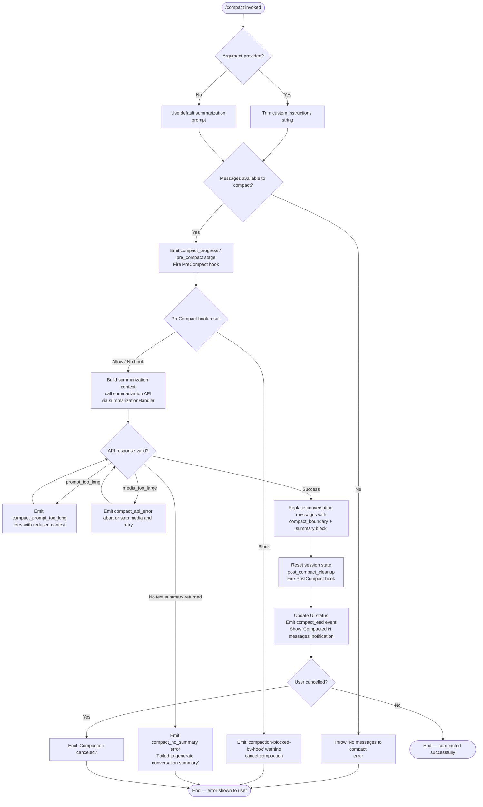

# `/compact`

> Analysis basis: CC v2.1.173 bundle.js (AST extraction + Claude interpretation)
> Minimum version: v2.1.173

---

## Overview

`/compact` frees up context window space by generating an AI summary of the current conversation and replacing the message history with a compact representation. It accepts an optional custom summarization instruction string, fires `PreCompact` and `PostCompact` lifecycle hooks, runs a full summarization API call, resets conversation state, and emits a completion notification to the UI.

---

## Registration

| Field | Value |
|---|---|
| type | `local` |
| name | `compact` |
| description | `Free up context by summarizing the conversation so far` |
| argumentHint | `<optional custom summarization instructions>` |
| supportsNonInteractive | `true` |
| thinClientDispatch | `post-text` |
| module_id | `Siq` |
| load_inline | `true` |
| loc_byte | `11261500` |
| loc_byte_end | `11261800` |
| arbor_handler.name | `xv7` |
| arbor_handler.kind | `AsyncFunction` |
| arbor_handler.resolution_path | `module_id` |
| arbor_handler.fqn | `claude-2.1.173::xv7` |
| arbor_handler.n_hits | `0` |

Analysis basis: CC v2.1.173 bundle.js:+11261500

---

## Input Branching

Five or more distinct branches are present, depending on whether custom instructions were supplied, whether there are messages to compact, whether a `PreCompact` hook blocks compaction, whether the summarization API call succeeds, and whether the result contains valid text. A flowchart is used.



---

## Behavioral Spec

### Top-level Handler (`xv7`)

```
async function compactCommandHandler(context, rawArgument):
    // Validate presence of messages
    if conversationMessages is empty:
        throw Error("No messages to compact")   // bundle.js:+11260561

    // Trim optional custom instructions
    customInstructions = rawArgument?.trim() ?? ""   // bundle.js:+11260593

    // Resolve experiment / feature flags for this session
    featureFlagResult = resolveExperimentFlags(context)   // Jr, bundle.js:+11260610

    // Run PreCompact hook phase; may block compaction
    compactProgress = await runCompactProgress(context, customInstructions)
                                            // uv7, bundle.js:+11260628

    // Fire PostCompact hook and finalize state
    postCompactHookResult = await runPostCompactLifecycle(context)
                                            // T96, bundle.js:+11260651

    // Build and emit final UI notification
    await rebuildSystemPrompt(context)      // yiq, bundle.js:+11260665
    emitCompactNotification(context, pqA)  // bundle.js:+11260689

    // Reset UI state
    setCompactionUIState(context)           // VSH, bundle.js:+11260795

    // Execute post-compact cleanup (clear caches, reset auto loop)
    runPostCompactCleanup(context)          // wHH, bundle.js:+11260820

    // Re-register keybinding for transcript toggle
    registerTranscriptKeybinding(context)   // kiq, bundle.js:+11260893

    // Render "Compacted N messages" dim text
    renderCompactedLabel()                  // mo, bundle.js:+11261134

    // Emit final status to UI
    emitFinalStatus()                       // SH, bundle.js:+11261252

    if userCancelled:
        displayMessage("Compaction canceled.")  // bundle.js:+11261102
```

Analysis basis: CC v2.1.173 bundle.js:+11260530 (handler entry `xv7`)

---

### Compact Progress Phase (`uv7`)

```
async function runCompactProgress(context, customInstructions):
    startTime = performance.now()    // bundle.js:+11256612

    // Build message list for summarization
    messageList = buildConversationMessages(context)   // f2, bundle.js:+11256634

    // Collect parallel context: system prompt, memory, env
    [systemPromptData, mcpServerState] = await Promise.all([
        buildSystemPromptContext(context),   // Xr, bundle.js:+11256676
        rebuildSystemPromptContext(context), // yiq, bundle.js:+11256751
    ])

    // Compute current token budget
    tokenBudget = computeTokenBudget(context)   // Mb8, bundle.js:+11256762

    // Determine compaction mode: "manual" vs automatic
    compactionMode = determineMode(context)  // bundle.js:+11256688 ("manual")

    // Emit stream_mode / requesting progress stage
    emitProgressStage("requesting")   // bundle.js:+11256910

    // Fire pre_compact stage marker
    emitProgressStage("pre_compact")  // bundle.js:+11256529

    // Execute the actual summarization turn
    summaryResult = await executeSummarizationTurn(
        context, messageList, customInstructions,
        systemPromptData, tokenBudget
    )   // mv7, bundle.js:+11257066

    // Handle errors
    if summaryResult.error == "prompt_too_long":
        emitTelemetry("tengu_compact_ptl_retry")
        return retryWithShorterContext(...)

    if summaryResult.error == "media_too_large":
        emitTelemetry("tengu_compact")
        return handleMediaError(...)

    // Handle success
    emitTelemetry("tengu_compact")  // bundle.js:+10681457
    emitProgressStage("compacting")  // bundle.js:+11256591
    recordCompactMetadata(summaryResult)

    // Emit completion notification
    emit("notification", "compact_end")  // bundle.js:+11258448
    emitTelemetry("tengu_compact_failed")  // on error path

    return summaryResult
```

Analysis basis: CC v2.1.173 bundle.js:+11256612

---

### Summarization Turn (`mv7`)

```
async function executeSummarizationTurn(context, messages, customInstructions, systemPromptData, tokenBudget):
    startTime = performance.now()   // bundle.js:+11258829

    // Obtain abort signal for this compaction turn
    abortSignal = getCompactionAbortSignal(context)  // W9A, bundle.js:+11258855

    // Run the summarization API call
    apiResult = await callSummarizationAPI(
        context, messages, customInstructions, abortSignal
    )   // rq6, bundle.js:+11258910

    if apiResult.status == "aborted":
        recordMiss("aborted")        // bundle.js:+11259018
        throw AbortError

    if apiResult.boundaryUuidMissing:
        recordMiss("boundary_uuid_missing")  // bundle.js:+11259272

    // Compact hit: apply summary to message history
    applyCompactedMessages(context, apiResult.summary)  // G9A, bundle.js:+11259192

    // Record compaction metadata (token counts, timing)
    recordCompactMetrics(startTime, apiResult)  // MC8, bundle.js:+11259260

    if apiResult.missNotReady:
        recordMiss("miss_not_ready")   // bundle.js:+11258940

    // Re-run summarization with full context on second pass if needed
    if needsSecondPass:
        return await executeSummarizationTurn(context, messages, ...) // f2, bundle.js:+11259773

    return { status: "hit", summary: apiResult.summary }
```

Analysis basis: CC v2.1.173 bundle.js:+11258829

---

### Reactive Compact Path (`v9A`)

The reactive compact path is invoked automatically by the system (not by the user directly) when the context window approaches its limit. It shares most sub-routines with the manual compact path but records the result under the `compact_reactive` key.

```
async function reactiveCompact(context):
    abortSignal = getAbortSignal(context)   // QX, bundle.js:+10516643
    startTime   = performance.now()         // bundle.js:+10516673

    // Build message groups for summarization
    groups = buildReactiveGroups(context)   // nY8, bundle.js:+10516737

    if groups.length < 2:
        recordOutcome("too_few_groups")     // bundle.js:+5100118
        return "skip"

    // Summarize earliest groups
    result = await summarizeGroups(context, groups, abortSignal)
                                            // DLL (inner loop), bundle.js:+5097898

    if result.error == "media_too_large":
        // Strip media and retry once
        emitLog("Reactive compact: summarize hit media-size error, retrying stripped")
        result = await summarizeGroups(context, strippedGroups, abortSignal)

    if result.status == "ok":
        emitTelemetry("tengu_reactive_compact_succeeded")  // bundle.js:+10519452
        applyReactiveCompactedMessages(context, result)
        return "ok"

    if userAborted:
        emit("compact_reactive_aborted")    // bundle.js:+10517484

    emitTelemetry("tengu_reactive_compact_failed")  // bundle.js:+10516991
    return "failed"
```

Analysis basis: CC v2.1.173 bundle.js:+10516643

---

### Summarization API Message Builder (`Gb8`)

Builds the final message array sent to the API during compaction. Handles all known message-block types before assembling the summarization prompt.

```
function buildSummarizationMessages(rawMessages, customInstructions):
    output = []

    for msg in rawMessages:
        switch msg.role:
            case "assistant":   // bundle.js:+10728196
            case "user":        // bundle.js:+10728218
            case "api_system":  // bundle.js:+10728235
                normalizedBlocks = normalizeContentBlocks(msg.content)
                output.push(normalizedBlocks)

        // Filter attachment / media blocks
        if msg.type == "attachment":   // bundle.js:+10728314
            output.push(buildAttachmentBlock(msg))

    // Append summarization system instruction
    summarizationSystemPrompt =
        "You are a helpful AI assistant tasked with summarizing conversations."
        // bundle.js:+10691412
    if customInstructions:
        summarizationSystemPrompt += "\n" + customInstructions

    return { messages: output, system: summarizationSystemPrompt }
```

Analysis basis: CC v2.1.173 bundle.js:+10728196

---

### Post-Compact State Reset (`wHH`)

Called after a successful compaction to clear caches and reset turn state.

```
function runPostCompactCleanup(context):
    // Finalize any in-progress summarization slot
    finalizeCompactionSlot(context)      // $C8, bundle.js:+10513020

    // Clear SDK streaming state
    clearStreamingState(context)         // BT6, bundle.js:+10513077

    // Clear model-specific caches
    clearModelCaches()                   // KM6, bundle.js:+10513092
    clearContextHintCaches()             // LM6, bundle.js:+10513109
    clearConversationPrefixCache()       // AC8, bundle.js:+10513115

    // Clear GrowthBook experiment caches
    clearExperimentCaches()              // bg9, bundle.js:+10513121

    // Reset deferred tool state
    resetDeferredTools()                 // BDq, bundle.js:+10513127

    // Reset permission state
    resetPermissionState()               // P0H, bundle.js:+10513133

    // Reset autonomous loop delivery tracker
    resetAutonomousLoopDelivered()       // bundle.js:+10513153

    // Notify all UI subscribers of conversation reset
    notifyConversationReset(context)     // eY, bundle.js:+10513203

    // Record post-compact telemetry
    recordPostCompactTelemetry()         // E9A, bundle.js:+10513309
```

Analysis basis: CC v2.1.173 bundle.js:+10513010

---

### Compact Boundary Injection (`Az` / `Tx8`)

A `compact_boundary` marker message is inserted at position determined by index arithmetic (values `1` and `0` at bundle.js:+11016047 and +11016052) into the message array before the compacted summary, allowing the runtime to identify where compaction occurred. The boundary carries the string tag `"compact_boundary"` (bundle.js:+11015993) and role `"system"` (bundle.js:+11015971). The injected summary message carries the tag `"Conversation compacted"` (bundle.js:+11015549).

Analysis basis: CC v2.1.173 bundle.js:+11016047, +11016052, +11015993, +11015549

---

### Hooks Lifecycle for Compaction (`hG` / `xWK`)

```
async function runPreCompactHook(context):
    // Enumerate hooks registered under "PreCompact" event type
    // bundle.js:+13534097 ("PreCompact")
    hooks = getHooksForEvent("PreCompact", context)

    for hook in hooks:
        result = await executeHook(hook, compactionInput, context)
        // Hook output is parsed as JSON when it starts with '{'
        // bundle.js:+13551541
        if result.decision == "block":
            emitTelemetry("tengu_run_hook")
            return { blocked: true, reason: result.reason }

    return { blocked: false }

async function runPostCompactHook(context, summary):
    // bundle.js:+13567895 ("PostCompact")
    hooks = getHooksForEvent("PostCompact", context)
    for hook in hooks:
        await executeHook(hook, { summary }, context)
```

Analysis basis: CC v2.1.173 bundle.js:+13534097, +13567895

---

## State & Side Effects

| Item | Detail |
|---|---|
| Telemetry — compact lifecycle | `tengu_compact` (bundle.js:+10681457), `tengu_compact_failed` (bundle.js:+10692766), `tengu_compact_cache_prefix` (bundle.js:+10679041), `tengu_compact_cache_sharing_success` (bundle.js:+10689919), `tengu_compact_cache_sharing_fallback` (bundle.js:+10690549), `tengu_compact_credits_clamp_rescue` (bundle.js:+5100680), `tengu_compact_ptl_retry` (bundle.js:+10679517) |
| Telemetry — reactive compact | `tengu_reactive_compact_attempt` (bundle.js:+5100837), `tengu_reactive_compact_succeeded` (bundle.js:+10519452), `tengu_reactive_compact_failed` (bundle.js:+10516991) |
| Telemetry — precomputed compact | `tengu_precomputed_compact_consumed` (bundle.js:+10511783), `tengu_precomputed_compact_discarded` (bundle.js:+10512406) |
| Telemetry — post-compact file restore | `tengu_post_compact_file_restore_success` (bundle.js:+10693252), `tengu_post_compact_file_restore_error` (bundle.js:+10693294) |
| Telemetry — experiment/feature | `tengu_amber_redwood3` (bundle.js:+10697196), `tengu_slate_harrier` (bundle.js:+13661886), `tengu_sepia_moth` (bundle.js:+10505404) |
| Hook registration | Fires `PreCompact` hook before summarization; fires `PostCompact` hook after successful summarization. Both routed through general hook dispatcher (`hG`/`xWK`). |
| appState changes | Conversation messages replaced with `compact_boundary` + summary block; `compactMetadata` written to appState (bundle.js:+11257903); session `sdk_status` set to `"compacting"` (bundle.js:+11256591) during operation; `post_compact_cleanup` event emitted (bundle.js:+10513026) |
| Cache resets | Clears conversation prefix cache (`AC8`), experiment caches (`bg9`), streaming state (`BT6`), model caches (`KM6`), context-hint caches (`LM6`), deferred tool state (`BDq`), permission state (`P0H`) |
| Autonomous loop | Calls `BP7.resetAutonomousLoopDelivered` (bundle.js:+10513153) |
| Sound / notification | Emits OS notification `"compact_end"` (bundle.js:+11258448); shows dim label `"Compacted N messages"` in REPL (bundle.js:+11259961); registers/updates `app:toggleTranscript` keybinding `ctrl+o` (bundle.js:+11259854) |
| Error messages displayed | `"No messages to compact"` (bundle.js:+11260561), `"Compaction failed · conversation could not be reduced below the context limit"` (bundle.js:+11257573), `"Compaction failed · attached media exceeds size limits"` (bundle.js:+11257695), `"Compaction canceled."` (bundle.js:+11261102) |

---

## Version History

| Version | Change |
|---|---|
| v2.1.173 | Initial analysis |

---

## Common Mistakes

1. **Running `/compact` on an empty conversation** — The handler immediately throws `"No messages to compact"` (bundle.js:+11260561) if no conversation messages are present. Ensure at least one exchange exists before invoking.
2. **Expecting tool calls during compaction** — The compaction agent is restricted to producing text output only; any tool-use attempt from the summarization model is denied with `"Tool use is not allowed during compaction"` (bundle.js:+10689042).
3. **Assuming hooks always allow compaction** — A `PreCompact` hook returning `decision: "block"` will cancel compaction entirely and emit a warning (literal `"compaction blocked by PreCompact hook"`, bundle.js:+10677448). Always check hook configurations if compaction appears silently skipped.
4. **Custom instructions not taking effect** — The argument is trimmed (bundle.js:+11260593) before use; leading/trailing whitespace is silently removed. An argument that is pure whitespace is treated the same as no argument.
5. **Cancelling mid-compaction** — If the user aborts the compaction in progress, the state is partially reset and `"Compaction canceled."` is displayed (bundle.js:+11261102), but conversation messages are not modified. The user must retry `/compact` after the cancellation.
6. **Reactive compact interference** — The system may trigger a reactive compact automatically (`compact_reactive`, bundle.js:+10519430) when the context window is nearly full. A manual `/compact` shortly after may find the conversation already partially compacted.

---

## Appendix — Identifier Mapping

> For bundle debugging only. Identifiers change across versions.

| Identifier | Role |
|---|---|
| `xv7` | Main `/compact` command handler (AsyncFunction) |
| `Az` | Compact boundary message injector |
| `Tx8` | Boundary index calculator |
| `mJ` | Message array helper |
| `Jr` | Feature-flag / experiment resolver called from handler |
| `b_` | Feature-flag check utility |
| `Y6` | Experiment session state reader |
| `I26` | Experiment variant resolver A |
| `k26` | Experiment variant resolver B |
| `Ym` | Experiment enrollment helper |
| `eu` | Experiment event emitter (core) |
| `I78` | Experiment deduplication cache checker |
| `qJ_` | Experiment event dispatch |
| `LZ_` | Experiment flag loader |
| `b6` | Config file watcher / reader |
| `G7H` | Config file reader with backup |
| `Zx4` | Config file watcher (fs.watchFile) |
| `uv7` | Compact progress phase orchestrator |
| `f2` | Conversation message list builder |
| `R07` | Message normalization orchestrator |
| `tXH` | Per-message normalizer |
| `Gb8` | Summarization API message builder |
| `Xr` | System prompt / MCP context assembler |
| `XL` | System prompt section builder |
| `y6` | Effort-level system-prompt injector |
| `oh` | Extended thinking system-prompt injector |
| `dP` | Model capability checker |
| `av` | Extended effort effort-level resolver |
| `Jh` | Context section joiner |
| `p6` | Permission-mode system-prompt builder |
| `hG` | Hook executor (PreCompact / PostCompact dispatcher) |
| `$b` | Policy-settings reader |
| `N` | Log-level / message formatter |
| `hOH` | Hook type dispatcher bootstrap |
| `hDA` | Hook file-system scanner |
| `NDA` | Third-party hook filter |
| `CH` | JSON.stringify wrapper |
| `SH` | Hook file runner |
| `bH` | Hook result builder |
| `TvH` | Hook non-zero-exit handler |
| `dN` | Abort controller manager |
| `mg8` | Hook MCP tool dispatcher |
| `EDA` | MCP tool result handler |
| `Bg8` | Hook output JSON parser |
| `tqH` | Hook plugin metrics collector |
| `TDA` | HTTP hook executor |
| `C2K` | HTTP hook output parser |
| `Fg8` | Subprocess (spawn) hook executor |
| `pRH` | Hook watchPath registration |
| `kH` | Hook result OK builder |
| `gF` | Telemetry flush helper |
| `SRH` | MCP server connection manager |
| `$n8` | MCP server update applier |
| `oWA` | MCP connection orchestrator |
| `yiq` | System prompt rebuilder |
| `GZ` | System prompt section aggregator |
| `Ub8` | MCP tool list builder |
| `B_` | Base prompt builder |
| `WrH` | PewterOwl tool integration |
| `B85` | System prompt core identity block |
| `F85` | Confirmation-before-action reminder block |
| `g85` | Task-continuity block |
| `pDH` | Fable-model identity block |
| `f_H` | Model-specific prompt fragment |
| `nDA` | Context-management mode selector |
| `W_5` | Context-management wrapper |
| `H_5` | Per-session guidance block |
| `AW6` | Memory loader / CLAUDE.md injector |
| `O_5` | Environment info block (full) |
| `$_5` | Environment info block (simple) |
| `w_5` | Background-session output-style block |
| `Y_5` | Scratchpad / context-management block |
| `j_5` | Brief-mode flag check |
| `P_5` | Flag-settings block |
| `q_5` | System prompt environment header |
| `c85` | Config CLAUDE.md reader |
| `l85` | CLAUDE.md watcher integration |
| `$Sq` | GrowthBook flag fetcher |
| `A_5` | Autonomy-append identity block |
| `o85` | "Doing tasks" guidance block |
| `a85` | Tool-use guidance block |
| `s85` | Context-management nDA wrapper |
| `t85` | Keybinding reminder block |
| `__5` | Tone/style block |
| `QA9` | Memory combined prompt builder |
| `ljH` | AWS / Anthropic-cloud auth block |
| `k_` | Last-assistant-message finder |
| `qb8` | Working-directory extractor |
| `Kb8` | Allowed/disallowed tools extractor |
| `Nb` | App-state permission-mode reader |
| `sp` | Agent memory loader |
| `vW` | Memory feature-flag check |
| `I_` | Module initializer |
| `Mb8` | Token budget calculator |
| `SqA` | Summarization mode selector |
| `mv7` | Summarization API turn executor |
| `W9A` | Compaction abort signal provider |
| `KC8` | Abort controller constructor |
| `rq6` | Compaction API call wrapper |
| `fC8` | Precomputed compact consumer |
| `f$` | Compact result formatter |
| `H1` | Message result type helper |
| `G9A` | Compact slice finder (findIndex + slice) |
| `MC8` | Compact metrics recorder |
| `wC8` | Main REPL turn executor |
| `WhH` | Turn type detector |
| `su` | Agent-type prefix checker |
| `QX` | Context token counter / abort signal |
| `v1H` | Token-count cache checker |
| `pT6` | Message-entry map builder |
| `GSH` | Turn start state setup |
| `Bn` | Permission request builder |
| `HE6` | Permission cache writer |
| `ISH` | Permission file writer |
| `aq6` | Queued-command handler |
| `$4` | Queued-command state reader |
| `kC6` | Turn UUID generator |
| `QqH` | Tool-result accumulator |
| `Z07` | Array tool-result type checker |
| `E07` | Tool-result XHH accessor |
| `gP7` | Parallel context-gather orchestrator |
| `DC8` | Deferred tool context builder |
| `PC8` | Plan-file context builder |
| `jC8` | Local-agent context builder |
| `XC8` | Extended-context builder |
| `JC8` | Agent-pool context builder |
| `K$H` | Model context-window limit fetcher |
| `zmH` | Tool-search mode decision maker |
| `wmH` | Tool-search threshold calculator |
| `s1` | Message UUID / timestamp factory |
| `Ag` | Plugin/hook session-start loader |
| `FGH` | System prompt assembler (joined) |
| `N9A` | Notification mapper |
| `VmH` | Notification filter |
| `VY8` | Token-count rounded helper |
| `ZY8` | Message token-count accumulator |
| `eE` | Full message normalizer |
| `IM` | Token count rounder (Math.round) |
| `vfL` | Per-message field token counter |
| `RE` | Role / effort resolver |
| `P$` | AppState getter |
| `v9A` | Reactive compact orchestrator |
| `nY8` | Reactive compact group builder |
| `wE6` | Compact boundary builder |
| `QT9` | Gap-size calculator |
| `DLL` | Reactive compact summarization loop |
| `jLL` | Gap-mode summarization helper |
| `KE6` | Cancel-reason classifier |
| `qE6` | AbortError classifier |
| `gm` | Path/string sanitizer |
| `QfL` | MCP tool-name sanitizer |
| `ufL` | Phone-number redactor |
| `pfL` | Unix-path redactor |
| `RfL` | IP-address redactor |
| `IfL` | Email redactor |
| `NfL` | Home-dir path redactor |
| `BfL` | Tilde-path redactor |
| `UfL` | URL sanitizer |
| `gfL` | API-error body redactor |
| `EH` | Error message string formatter |
| `wHH` | Post-compact state reset |
| `$C8` | Compaction slot finalizer |
| `BT6` | Streaming state clearer |
| `KM6` | Model cache clearer |
| `LM6` | Context-hint cache clearer (BG) |
| `AC8` | Conversation prefix cache clearer |
| `bg9` | GrowthBook experiment cache clearer |
| `BDq` | Deferred tool state resetter |
| `P0H` | Permission state resetter |
| `eY` | Conversation-reset notifier |
| `E9A` | Post-compact telemetry recorder |
| `VSH` | Compaction UI state setter |
| `kiq` | Transcript keybinding registrar |
| `VCH` | Model display-name resolver |
| `gSL` | Model shortname mapper |
| `eP` | Keybinding action dispatcher |
| `NXH` | OTEL metric emitter |
| `mf` | OTEL event builder |
| `byH` | OTEL resource attribute builder |
| `T96` | Full compaction lifecycle executor |
| `zV6` | Tracing span creator |
| `rS` | Active span accessor |
| `lY8` | Summary text trimmer |
| `U8` | Compaction UUID + stream handler |
| `YFq` | Compaction turn executor (inner) |
| `pbq` | Compaction result page builder |
| `LR8` | kAA cache getter |
| `mbq` | Compaction result formatter |
| `f6` | String coercer |
| `GT` | Compaction state machine |
| `AS8` | AppState updater during compact |
| `qS8` | Compact post-state writer |
| `HR` | Random boundary ID generator |
| `UqH` | Notification filter during compact |
| `ap` | Compact cleanup caller |
| `ME` | Message-event type tag |
| `_b6` | BW7 tombstone checker |
| `JHH` | JHH state marker |
| `fb8` | fb8 state snapshot |
| `iBq` | Tombstone check wrapper |
| `Y` | Process-exit handler |
| `bMH` | Tool-result filter for compact |
| `FW7` | Fork-agent query recorder |
| `Ox_` | Compact context trim helper |
| `i5H` | Max-output-token resolver |
| `cjH` | Token-limit config reader |
| `V1H` | CLAUDE_CODE_MAX_OUTPUT_TOKENS env parser |
| `UV` | Last-assistant-msg finder |
| `cY8` | Summary tag extractor |
| `dY8` | `<summary>` tag finder |
| `g8` | Single-char underscore helper |
| `rW7` | Compact result status emitter |
| `mo` | Dim-label renderer |
| `Kb6` | Tool-search state integrator |
| `It` | Tool-type lowercaser |
| `cuH` | Tool-search availability checker |
| `Tb_` | Tool type classifier |
| `V07` | Tool-search config builder |
| `$x_` | Message media-block flattener |
| `lW7` | Array-check helper |
| `nW7` | Media-block filter |
| `iW7` | Content-block mapper |
| `yqA` | Recursive content-block mapper |
| `MFq` | Surrogate-pair detector |
| `Oq6` | Compaction API query dispatcher |
| `iqA` | Fallback request builder |
| `xWK` | Full API query executor (inner loop) |
| `p28` | Hook-context enricher |
| `j1` | File-path enricher |
| `FG` | BG (terminal) writer |
| `G` | REPL key-event handler |
| `T` | pV6 / N76 key helper |
| `z` | Terminal input handler |
| `td` | XY state helper |
| `ONK` | Vim-mode operator router |
| `cvK` | Yank operator |
| `rvK` | Visual-replace operator |
| `svK` | Visual-case operator |
| `b` | Register store |
| `evK` | Visual-paste operator |
| `FvK` | Join-lines operator |
| `gvK` | Indent operator |
| `JXA` | Vim-mode command executor |
| `S` | Supervisor write handler |
| `w` | Terminal renderer |
| `vEH` | VT event handler |
| `oDK` | Object-key diff renderer |
| `E` | Renderer start/stop wrapper |
| `JrK` | Renderer config builder |
| `qg` | Array.isArray compact guard |
| `OFq` | Context-trim slice calculator |
| `VtH` | Message push helper |
| `vtH` | Media-too-large checker |
| `n5H` | Array-some media checker |
| `LN6` | Token-count regex parser |
| `Yk` | Starts-with `<` tag checker |
| `lM` | YC / c$ / P_ label builder |
| `YC` | BG terminal color helper A |
| `P_` | BG terminal color helper B |
| `XT` | CLI/remote context-mode selector |
| `wc` | Context mode string |
| `OK` | String coercer (String) |
| `ET6` | REPL context mode tag |
| `YE6` | REPL exit message formatter |
| `YLL` | REPL message trimmer |
| `Nt` | Non-streaming token counter |
| `wFq` | Compact failure error formatter |
| `cX` | History shift/push helper |
| `yLL` | History LRU cache |
| `$V6` | Status-bar updater |
| `ZRH` | Status setter |
| `pqA` | Post-compact notification builder |

Note: index built via Arbor fallback; some signals (telemetry, literals) may be missing — see arbor-fallback.js.