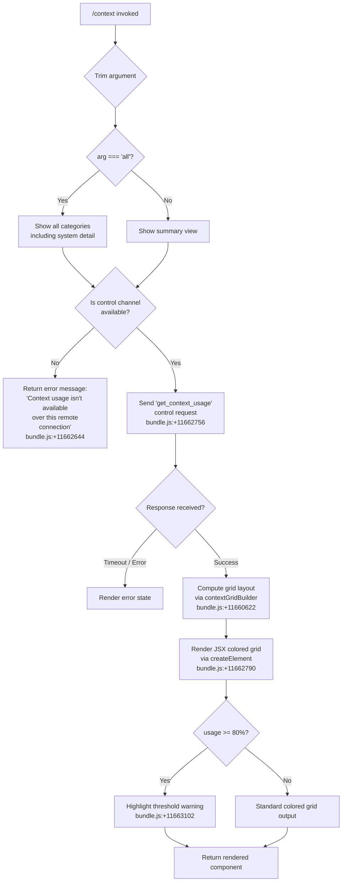

# `/context`

> Analysis basis: CC v2.1.173 bundle.js (AST extraction + Claude interpretation)
> Minimum version: v2.1.173

---

## Overview

`/context` visualizes the current conversation's context-window usage as a colored grid rendered in the terminal. It sends a `get_context_usage` control request over the active control channel to retrieve token counts and then renders a structured JSX breakdown of how the context budget is being consumed across categories such as system prompt, tools, memory files, messages, and free space.

---

## Registration

| Field | Value |
|---|---|
| type | `local-jsx` |
| name | `context` |
| description | `Visualize current context usage as a colored grid` |
| argumentHint | `[all]` |
| thinClientDispatch | `control-request` |
| module_id | `Maq` |
| load_inline | `true` |
| loc_byte | `11663966` |
| loc_byte_end | `11664192` |
| loc_line | `7535` |
| arbor_handler.name | `hk7` |
| arbor_handler.fqn | `claude-2.1.173::hk7` |
| arbor_handler.kind | `AsyncFunction` |
| arbor_handler.resolution_path | `module_id` |
| arbor_handler.n_hits | `0` |

Analysis basis: CC v2.1.173 bundle.js:+11663966

---

## Input Branching

The command has 4+ distinct branches depending on argument value, connection type, and data availability.



---

## Behavioral Spec

### Entry Point — Handler (`hk7`)

Analysis basis: CC v2.1.173 bundle.js:+11662560

```
async function contextCommandHandler(args, context):
    trimmedArg = args.trim()                        // bundle.js:+11662566
    showAll    = (trimmedArg === "all")             // bundle.js:+11662591

    channel = getControlChannel(context)            // bundle.js:+11662617
    if channel is absent or unavailable:
        return errorText(
            "Context usage isn't available over this remote connection"
        )                                           // bundle.js:+11662644

    response = await channel.sendControlRequest(
        type: "get_context_usage"
    )                                               // bundle.js:+11662726 / +11662756

    gridData = buildContextGrid(response, showAll)  // bundle.js:+11662790
    warningLevel = computeWarningLevel(response)    // bundle.js:+11663102
    summary = formatSummary(response)               // bundle.js:+11662980

    return createElement(
        ContextGridComponent,
        { gridData, warningLevel, showAll, summary }
    )                                               // bundle.js:+11662790
```

### Grid Construction (`contextGridBuilder` / `Vx6`)

Analysis basis: CC v2.1.173 bundle.js:+11660622

The grid builder receives the raw context-usage payload from the daemon and maps each usage category to a colored segment. Categories extracted from literals include:

| Category key | Display label | Note |
|---|---|---|
| (free space) | `Free space` | bundle.js:+11660698 |
| (autocompact buffer) | `Autocompact buffer` | bundle.js:+11660721 |
| `projectSettings` | `Project` | bundle.js:+11661647/+11661667 |
| `userSettings` | `User` | bundle.js:+11661687/+11661704 |
| `localSettings` | `Local` | bundle.js:+11661721/+11661739 |
| (flag settings) | `Flag` | bundle.js:+11661774 |
| (policy settings) | `Policy` | bundle.js:+11661810 |
| `plugin` | `Plugin` | bundle.js:+11661829/+11661840 |
| `built-in` | `Built-in` | bundle.js:+11661859/+11661872 |
| `mcp` | `MCP` | bundle.js:+11661829/+11661872 area |
| (system prompt border) | `promptBorder` | bundle.js:+10712084 |
| (system tools) | `System tools` | bundle.js:+10712131 |
| (MCP tools) | `MCP tools` | bundle.js:+10712194 |
| (memory files) | `Memory files` | bundle.js:+10712508 |
| (messages) | `Messages` | bundle.js:+10713095 |
| (skills) | `Skills` | bundle.js:+10712569 |

```
function buildContextGrid(usagePayload, showAll):
    segments = usagePayload
        .filter(entry => showAll OR entry.isVisible)    // bundle.js:+11660663
        .find(entry => entry matches category)          // bundle.js:+11660981
    
    for each segment:
        label     = resolveLabel(segment.type)
        portion   = String(segment.tokens)             // bundle.js:+11661899
        colorCode = mapTypeToColor(segment.type)       // bundle.js:+11662318
    
    return assembleGrid(segments)                       // bundle.js:+11662398
```

### Percentage Formatter (`s6H`)

Analysis basis: CC v2.1.173 bundle.js:+11662398

```
function formatPercentage(value, total):
    pct = Math.round((value / total) * 100)     // bundle.js:+216395
    if pct < 20:
        return "< 20"                           // bundle.js:+216375
    formatted = pct.toLocaleString("en-US",
        { style: "compact" })                   // bundle.js:+218348/+218366
    return formatted + ".0"                     // bundle.js:+216336
```

### Compact-Boundary Marker (`Az` / `Nk7`)

Analysis basis: CC v2.1.173 bundle.js:+11663069 / +11662522

The handler checks for a compaction boundary marker (`compact_boundary`) within the conversation history and uses it to visually separate pre-compact and post-compact message regions in the grid.

```
function resolveCompactBoundary(messages):
    boundary = findToken(messages, "compact_boundary")  // bundle.js:+11015993
    if boundary exists:
        return boundary.slicePosition                   // bundle.js:+11016146
    return null
```

### Warning Threshold (`L` / usage >= 80%)

Analysis basis: CC v2.1.173 bundle.js:+11663102 / +11663107

When the total used tokens reach or exceed 80% of the model's context window, the command signals a warning level to the rendering component. The threshold constant is 80 (bundle.js:+11663102).

```
function computeWarningLevel(usagePayload):
    usedFraction = usagePayload.usedTokens / usagePayload.totalTokens
    if usedFraction >= 0.80:          // threshold: 80 — bundle.js:+11663102
        return "warning"
    return "normal"
```

### Connection-Type Gate (`OI` / `t4`)

Analysis basis: CC v2.1.173 bundle.js:+11662614 / +11662599

Before issuing the control request the handler verifies that a control channel (`controlChannel`) is present. If the session is purely remote (no control channel) the command returns a static unavailability string immediately without any network call.

```
function getControlChannel(context):
    ch = resolveChannel(context, "controlChannel")  // bundle.js:+11662617
    if not ch:
        return null
    return ch
```

### Response-Listener Setup (`t_6`)

Analysis basis: CC v2.1.173 bundle.js:+11662786

After sending the control request, the handler registers a one-time listener on the channel for the response payload. The listener converts raw bytes to string (`L.toString`), parses them, and feeds the result into the JSX renderer (`yF`).

```
function attachResponseListener(channel, onData):
    channel.on("data", (raw) => {
        text = raw.toString()                // bundle.js:+8329908
        parsed = parseContextPayload(text)   // bundle.js:+8329935
        onData(parsed)
    })
    return createElement(KqH, parsed)        // bundle.js:+8329938
```

### Context Grid Renderer (`zb8`)

Analysis basis: CC v2.1.173 bundle.js:+10711097

`zb8` is the main rendering function responsible for transforming the structured usage data into a terminal-renderable colored grid. It orchestrates multiple sub-renderers:

- **`Gr`** — renders individual row segments, handles color mapping for inactive/active items, parses integer widths (bundle.js:+10697423)
- **`GZ`** — assembles the full system prompt context block including tool lists, memory files, and message segments (bundle.js:+13651842)
- **`aqH`** — computes per-row minimum widths using `Math.min` (bundle.js:+10698235)
- **`ZZ`** — renders per-category cells, checks `autoCompactEnabled` flag (bundle.js:+10699809)
- **`XV`** — builds the label/value display for each segment (bundle.js:+2255777)
- **`sp`** — generates system-prompt sub-section display including agent memory (bundle.js:+9821339)
- **`M07`**, **`$07`**, **`O07`**, **`Y07`**, **`D07`**, **`z07`**, **`w07`**, **`P07`** — render individual context sections: MCP tools, built-in tools, message history, deferred tools, etc.

```
function renderContextGrid(usageData, options):
    rows = []

    // System prompt section
    systemRow = renderSystemPromptRow(usageData.systemPrompt, options)
    rows.push(systemRow)

    // Tool sections
    mcpToolsRow    = renderMcpToolsRow(usageData.mcpTools)
    systemToolsRow = renderSystemToolsRow(usageData.systemTools)
    rows.push(mcpToolsRow, systemToolsRow)

    // Message history
    msgRow = renderMessagesRow(usageData.messages, options)
    rows.push(msgRow)

    // Memory files
    memRow = renderMemoryFilesRow(usageData.memoryFiles)
    rows.push(memRow)

    // Compute layout widths
    maxWidth = Math.max(...rows.map(r => r.width))   // bundle.js:+10712921
    minWidth = Math.min(...rows.map(r => r.width))   // bundle.js:+10712932

    // Apply Math.floor / Math.round for pixel alignment
    alignedRows = rows.map(r => alignRow(r, maxWidth))  // bundle.js:+10713511

    return assembleGrid(alignedRows)
```

---

## State & Side Effects

| Item | Detail |
|---|---|
| Telemetry | No `tengu_*` events found directly in the `/context` handler path within depth-2 traversal; ambient telemetry from sub-components such as `tengu_amber_redwood2` (bundle.js:+10697311), `tengu_amber_redwood3` (bundle.js:+10697196) may fire during context window computation, and `tengu_sparrow_ledger` (bundle.js:+13651710) during system-prompt assembly |
| Control request | Sends `"get_context_usage"` control request over `controlChannel` (bundle.js:+11662756) |
| Hook registration | Registers a one-time `"data"` listener on the control channel response stream (bundle.js:+8329871) |
| appState changes | None observed — read-only command |
| Sound | None |
| Threshold constant | 80% context usage triggers warning highlight (bundle.js:+11663102) |
| Remote guard | Command short-circuits with unavailability message when no `controlChannel` exists (bundle.js:+11662644) |

---

## Version History

| Version | Change |
|---|---|
| v2.1.173 | Initial analysis |

---

## Common Mistakes

1. **Running over a remote connection without a control channel** — The command silently returns an error string ("Context usage isn't available over this remote connection") rather than a grid. Ensure the session was started with a local or tunnelled control channel.
2. **Expecting real-time updates** — `/context` is a one-shot snapshot. It does not subscribe to ongoing token-count changes; re-run the command to get a fresh view.
3. **Using `/context` to check if auto-compact will fire** — The grid shows the `Autocompact buffer` segment, but the actual compaction trigger depends on the `autoCompactEnabled` setting and the `CLAUDE_CODE_AUTO_COMPACT_WINDOW` environment variable (bundle.js:+10697504), not solely on the percentage displayed.
4. **Misreading the `< 20` percentage label** — When a segment occupies less than 20% of the context window the formatter returns the literal string `"< 20"` rather than a numeric value (bundle.js:+216375). This is intentional display rounding, not an error.
5. **Omitting the `all` argument** — By default only the summary view is shown. Pass `/context all` to expand all sub-categories including per-file memory entries and individual tool listings.

---

## Appendix — Identifier Mapping

> For bundle debugging only. Identifiers change across versions.

| Identifier | Role |
|---|---|
| `hk7` | Main async handler for `/context` command (Arbor-resolved) |
| `Vx6` | Context grid builder — maps usage payload to colored segments |
| `s6H` | Percentage formatter with `< 20` floor and locale rounding |
| `Nk7` | Compact-boundary locator wrapper |
| `Az` | Inner compact-boundary token finder |
| `Tx8` | Helper used by compact-boundary finder |
| `mJ` | Low-level token scan utility |
| `zb8` | Main context grid renderer — orchestrates all row renderers |
| `Gr` | Row-segment renderer; handles color mapping and integer width parsing |
| `GZ` | Full system-prompt context block assembler |
| `aqH` | Per-row minimum-width calculator |
| `ZZ` | Per-category cell renderer; checks `autoCompactEnabled` flag |
| `XV` | Label/value display builder for each grid segment |
| `sp` | System-prompt sub-section renderer including agent memory |
| `M07` | MCP-tools section renderer |
| `$07` | Built-in tools section renderer |
| `O07` | Message-history section renderer |
| `Y07` | Message-history alternate/full renderer |
| `D07` | Deferred-tools section renderer |
| `z07` | Context-slot summary renderer |
| `w07` | Additional message-section renderer |
| `P07` | Token-count aggregator renderer |
| `MK` | Color-code resolver for segment types |
| `eK` | Inner color accessor |
| `a8f` | Color constant store |
| `TdH` | Grid row assembly helper |
| `EH` | String-coercion utility used in display formatting |
| `t4` | Channel presence resolver |
| `qVH` | Inner channel lookup helper |
| `OI` | Control channel getter |
| `t_6` | Response listener registration |
| `yF` | JSX payload parser |
| `ih_` | React/Ink `createElement` wrapper |
| `rs` | Component renderer combining grid and summary |
| `tkH` | Sub-component assembler for context view |
| `v1` | Settings/state loader called during handler init |
| `J8H` | Settings presence check |
| `cV_` | Background/inline check helper |
| `ks` | Fullscreen/terminal mode check |
| `vp4` | Terminal type detector (iTerm, tmux, etc.) |
| `Vp4` | Terminal name prefix checker |
| `N` | Logger / debug output function |
| `d8f` | Log-level dispatcher |
| `RZA` | Log-level resolver |
| `lf` | String sanitizer / redaction utility |
| `zNA` | Redaction map builder |
| `oFH` | Write-stream helper |
| `tvA` | Underlying write implementation |
| `i8f` | File-append / conversation-log writer |
| `EFH` | Buffered log flush with `setTimeout`/`setImmediate` |
| `FfH` | Log file path joiner |
| `K36` | Node identifier helper |
| `DNA` | Directory-path joiner for logs |
| `Us8` | Log-file rotation handler |
| `n8f` | Log-file append with mkdir |
| `y9` | Hook registration helper |
| `dV_` | OS/platform detection |
| `B_` | Settings loader |
| `vB` | Settings load orchestrator |
| `pG` | Settings schema validator |
| `fq` | Memory-usage sampler |
| `sK_` | Full settings-load pipeline |
| `VB` | App-state accessor bundle |
| `Bg6` | Post-load side-effect runner |
| `Np4` | Context-render trigger |
| `Y6` | React state/effect hook wrapper |
| `I26` | useEffect equivalent |
| `k26` | useState equivalent |
| `Ym` | Ref creator |
| `I78` | Effect dependency tracker |
| `b6` | Conversation event emitter |
| `j1` | ANSI escape / markdown formatter |
| `DJ` | Lowercase + include checker for model names |
| `R3` | String replacement utility |
| `_W` | Terminal column-width helpers |
| `b89` | `parseInt` + `isNaN` wrapper |
| `PE_` | Width parser with fallback |
| `x89` | Width resolver for various display modes |
| `V1H` | Max-output-token validator |
| `ZFq` | Auto-compact window resolver |
| `uqA` | Token-count string parser (handles `auto`, `k`-suffix, etc.) |
| `QDA` | Daemon process accessor |
| `p6` | Process-store getter |
| `Yo6` | Async-store accessor |
| `P_` | Base utility (used broadly) |
| `Ub8` | Multi-session context assembler |
| `WrH` | Conversation wrapper builder |
| `WE_` | Tool context builder |
| `B85` | System-prompt assembler |
| `w_H` | Conversation-line formatter |
| `U85` | Brief-mode system-prompt builder |
| `F85` | Confirmation-instructions builder |
| `g85` | Autonomy-level instructions builder |
| `pDH` | Plan-mode prompt builder |
| `f_H` | Whitespace normalizer |
| `HW` | ANSI-escape stripper |
| `nDA` | System-prompt flag-section builder |
| `W_5` | Flag-section wrapper |
| `ag` | Permissions builder |
| `H_5` | Full context-payload assembler |
| `Qd` | Context deduplication checker |
| `z2` | Tool-name resolver |
| `e85` | Feature-flag prompt injector |
| `gfA` | Feature guard |
| `Fb` | Feature-disabled stub |
| `jL` | Tool-listing formatter |
| `Sg` | Scheduled-task prompt builder |
| `PQ` | Prompt-section flattener |
| `AW6` | Memory-files context builder |
| `D4` | CLAUDE.md loader |
| `$AH` | Memory directory initializer |
| `jF` | Memory-file stat checker |
| `$6` | Path constants accessor |
| `kH` | Subprocess/tool spawner |
| `XA9` | Memory-file reader (batch) |
| `iu4` | Memory-file path builder |
| `_W6` | Memory-content trimmer |
| `Ij` | Memory inject formatter |
| `RA9` | Memory-section assembler |
| `SA9` | Auto-memory prompt builder |
| `yA9` | Auto-memory content loader |
| `eZ_` | Memory-entry formatter |
| `O_5` | Environment info builder |
| `wD` | Model-display name resolver |
| `dDA` | Detailed environment info builder |
| `$_5` | Static environment info builder |
| `lDA` | OS info collector |
| `cDA` | Shell/platform detector |
| `w_5` | Worktree/bg-session info builder |
| `Is_` | Worktree detector |
| `Y_5` | Scratchpad info builder |
| `QKH` | Scratchpad path resolver |
| `CEH` | Scratchpad content joiner |
| `j_5` | Brief-mode guard |
| `P_5` | Context-management info builder |
| `BrH` | Focus-mode builder |
| `q_5` | GrowthBook feature-flag loader |
| `c85` | Heron-brook prompt builder |
| `l85` | Autonomy-append builder |
| `$Sq` | MCP-instructions loader |
| `A_5` | Agent identity builder |
| `o85` | Prompt-injection warning builder |
| `a85` | "Doing tasks" instructions builder |
| `s85` | System-prompt flag appender |
| `t85` | Tool-usage instructions builder |
| `XT` | CLI/remote mode selector |
| `__5` | Tone-and-style builder |
| `QA9` | Memory-section composer |
| `gA9` | Memory-section inner builder |
| `ljH` | Language/locale context injector |
| `sv` | Locale info fetcher |
| `wL` | YAML/config reader |
| `sp` | System-prompt final assembler |
| `yf` | Agent-memory loader |
| `vW` | Memory-block renderer |
| `I_` | Module loader bootstrap |
| `Pw` | System-prompt accessor |
| `A6` | Path constants (secondary) |
| `q56` | Config path constant |
| `Yb8` | Per-conversation context-section builder |
| `z_5` | Slim environment context builder |
| `dA9` | Memory-section per-conversation builder |
| `a2K` | Heading parser for memory sections |
| `PK6` | Tool-token counter |
| `dSH` | System-tool tokenizer |
| `SH` | Schema/tool descriptor serializer |
| `vFq` | MCP-tool tokenizer |
| `KAH` | CLAUDE.md presence flag |
| `$f` | CLAUDE.md content accessor |
| `zE` | CLAUDE.md flag resolver |
| `FT6` | AutoMem filter |
| `iGH` | Per-message context assembler |
| `Db8` | Single message context-payload builder |
| `wS` | Multi-turn conversation formatter |
| `CU` | Process-exit race handler |
| `G` | Main app keyboard/render controller |
| `Y07` | Message-array section renderer |
| `IM` | Token-count rounding helper |
| `D07` | Deferred-tool section renderer |
| `z07` | Context-slot summary renderer |
| `_C_` | Context dedup + slot resolver |
| `P1H` | Slot presence filter |
| `VFq` | Slot-value resolver |
| `BK` | Recursive config key getter |
| `P07` | Token-count section renderer |
| `j07` | Token-count sub-renderer A |
| `J07` | Token-count sub-renderer B |
| `X07` | Token-count sub-renderer C |
| `eE` | Full conversation normalizer |
| `Gb8` | Per-message normalizer and display-block builder |
| `cH` | Render-state manager / message-diff tracker |
| `AH` | Ink component wrapper for output |
| `enK` | MCP-server reconciler |
| `HiK` | Full MCP connection lifecycle manager |
| `OtH` | Usage-tracking state machine |
| `v1H` | Usage state checker |
| `Jr` | Context-budget display row builder |
| `YH` | Floor + row push utility |
| `uH` | Per-session usage map |