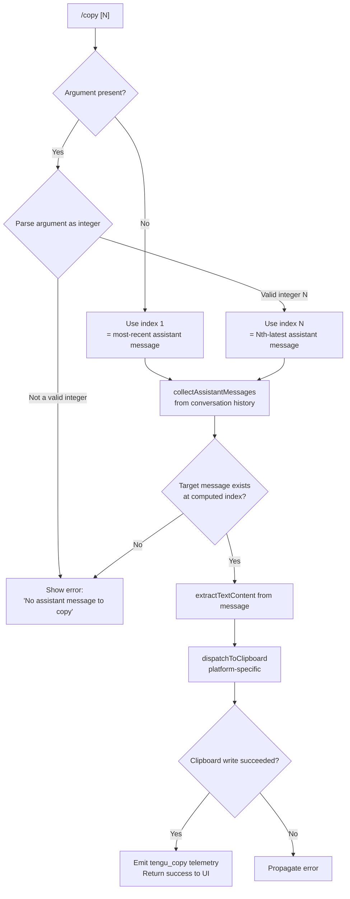

# `/copy`

> Analysis basis: CC v2.1.173 bundle.js (AST extraction + Claude interpretation)
> Minimum version: v2.1.173

---

## Overview

The `/copy` command copies Claude's most recent assistant response to the system clipboard. An optional numeric argument `N` allows retrieval of the Nth-latest assistant message instead of the default most-recent one. The command resolves the target message from the conversation history, extracts its text content, and dispatches it to the appropriate platform clipboard mechanism.

---

## Registration

| Field | Value |
|---|---|
| type | `local-jsx` |
| name | `copy` |
| description | `Copy Claude's last response to clipboard (or /copy N for the Nth-latest)` |
| module_id | `_iq` |
| load_inline | `true` |
| loc_byte | `11239183` |
| loc_byte_end | `11239369` |
| loc_line | `7403` |
| arbor_handler.name | `Ev7` |
| arbor_handler.fqn | `claude-2.1.173::Ev7` |
| arbor_handler.kind | `AsyncFunction` |
| arbor_handler.resolution_path | `module_id` |
| arbor_handler.n_hits | `0` |

Analysis basis: CC v2.1.173 bundle.js:+11239183

---

## Input Branching

The command has 4 distinct paths based on argument validity and clipboard availability:



Analysis basis: CC v2.1.173 bundle.js:+11238368, +11238407, +11238478, +11238492, +11238722

---

## Behavioral Spec

### 1. Argument Parsing (handler: `Ev7`)

The main handler (`Ev7`) is an `AsyncFunction` resolved via the `module_id` path.

```
async function copyCommandHandler(args, context):
    rawArg = args.trim()

    if rawArg is empty:
        targetIndex = 1        // most-recent (1-based)
    else:
        parsed = Number(rawArg)
        if not Number.isInteger(parsed):
            return errorResponse("No assistant message to copy")
        targetIndex = parsed   // Nth-latest (1-based)
```

Analysis basis: CC v2.1.173 bundle.js:+11238478, +11238492, +11238409

---

### 2. Message Collection (`collectAssistantMessages` — `tnq`)

The helper `tnq` walks the conversation message list and collects entries whose role equals `"assistant"`. It filters each message's content blocks, keeping only blocks of type `"text"`.

```
function collectAssistantMessages(messageHistory):
    results = []
    for each message in messageHistory:
        if not Array.isArray(message.content): continue
        textBlocks = filterTextBlocks(message.content)   // Gf
        results.push(textBlocks)
    return results   // ordered oldest-first
```

Analysis basis: CC v2.1.173 bundle.js:+11234386, +11234418, +11234434

Literal evidence: role filter uses the string `"assistant"` (bundle.js:+11234316); content type uses `"text"` (bundle.js:+10987602).

---

### 3. Index Resolution & Text Extraction (`snq`)

After collecting the assistant-message list, `snq` resolves the target by reversing (most-recent = index 1) and then extracts renderable text.

```
function resolveAndExtract(assistantMessages, targetIndex):
    // messages are in forward chronological order; index 1 = last
    reversed = assistantMessages.reversed()
    target = reversed[targetIndex - 1]

    if target is undefined:
        return null   // caller will emit error

    // Format as plaintext or table representation (anq)
    rendered = renderMessage(target)   // anq
    return rendered
```

Analysis basis: CC v2.1.173 bundle.js:+11234013, +11234134, +11234145

The inner renderer `anq` handles two content shape categories:

| Content shape | Rendering strategy |
|---|---|
| Markdown table (detected by `\|` delimiter — bundle.js:+11233497) | Columnar text-table layout using `center`/`right`/`left` alignment strings (bundle.js:+11233691, +11233733, +11233773) with `" | "` separator (bundle.js:+11233656), minimum column width 3 (bundle.js:+11233556) |
| Plain text / other | Trimmed plain-text via `_.trim` (bundle.js:+11234521 literal `"plaintext"`) |

Column width computation uses `Bun.stringWidth` (via `f8`, bundle.js:+11233572) for Unicode-aware width measurement, then `Math.max` (bundle.js:+11233547) to determine column widths.

---

### 4. Clipboard Dispatch (`zT` / `R4A`)

The platform-detection and clipboard-write logic lives in `zT` (called through `R4A`). It selects a mechanism based on the current terminal and OS environment:

```
function dispatchToClipboard(text):
    encodedText = Buffer.from(text, "utf8").toString("base64")
    // (bundle.js:+3494315, +3494332)

    terminalEnv = detectTerminalEnvironment()   // pV_

    switch terminalEnv:

        case "kitty":       // bundle.js:+3493279
            useOSC52 via kitty escape sequence

        case "screen":      // bundle.js:+3492810
            useOSC52 via screen DCS wrapper

        case "tmux-buffer": // bundle.js:+3493679
            run: tmux load-buffer -w <tempfile>  // bundle.js:+3494049, +3494083, +3494111

        case "osc52":       // bundle.js:+3493699
            emit OSC 52 escape; mode one of:
              "raw+dcs" | "dcs" | "raw" | "none"  // bundle.js:+3494430, +3494453, +3494459, +3494504

        default (native clipboard):
            platform = detectOS()   // wY / pV_

            if platform == "darwin":   // pbcopy — bundle.js:+3494751
                spawn: pbcopy
                timeout: 2000 ms      // bundle.js:+3494717

            elif platform == "linux":  // bundle.js:+3493738
                try in order:
                    wl-copy            // bundle.js:+3493808 (Wayland)
                    xclip -selection clipboard  // bundle.js:+3493877
                    xsel --clipboard --input     // bundle.js:+3493918

            elif platform == "wsl" or "windows":  // bundle.js:+3495107, +3495210
                spawn: powershell.exe -NoProfile -NonInteractive -Command ...
                       // bundle.js:+3495117, +3495135, +3495148, +3495166

    return writeResult
```

Analysis basis: CC v2.1.173 bundle.js:+11234732, +3494346, +3494352, +3494365, +3494378, +3494603, +3494645

The OSC 52 path detects iTerm2 by name (bundle.js:+3494039) and selects between `--primary` (bundle.js:+3494881) and `clipboard` (bundle.js:+3494944) clipboard selections for xclip/xsel, and `primary` (bundle.js:+3494985) for the xsel alternate path.

The `-selection` flag is used for xclip (bundle.js:+3494931); `--clipboard --input` flags for xsel (bundle.js:+3495031, +3495045).

---

### 5. Temp-File Strategy for tmux (`EJ` / `Hiq`)

When the tmux-buffer path is taken, a temporary file is created under a secure directory:

```
function createTempFile(content):
    baseDir = env.CLAUDE_CODE_TMPDIR ?? "/tmp"   // bundle.js:+4078186
    // Directory ownership validated; error if insecure:
    //   "Set CLAUDE_CODE_TMPDIR to a directory you control..."
    //   (bundle.js:+4078261)
    tmpPath = join(baseDir, randomSuffix)
    mkdir(tmpPath, mode=0o700)   // bundle.js:+4078867 (octal 448)
    writeFile(tmpPath, content, mode=0o777)  // bundle.js:+511 for chmod
    return tmpPath
```

Analysis basis: CC v2.1.173 bundle.js:+11234590, +11234597, +11234624, +11234667, +4078186, +4078832, +4078867

---

### 6. Success / Error Response

After clipboard dispatch, the handler:

1. Emits the `tengu_copy` telemetry event (bundle.js:+11238787).
2. Returns a UI-renderable result to the REPL. On success the response includes a confirmation. On failure (message not found) the literal `"No assistant message to copy"` is returned (bundle.js:+11238409).

---

## State & Side Effects

| Item | Detail |
|---|---|
| Telemetry | `tengu_copy` (bundle.js:+11238787) — fired on every invocation path that reaches clipboard dispatch |
| Clipboard | Writes text to the OS/terminal clipboard via a platform-selected mechanism; no persistent app state is mutated |
| Temp files | A temporary file under `/tmp` (or `$CLAUDE_CODE_TMPDIR`) may be created and removed during the tmux-buffer path |
| appState changes | None detected within depth-2 traversal |
| Sound | None detected |
| Hook registration | None detected |

---

## Version History

| Version | Change |
|---|---|
| v2.1.173 | Initial analysis |

---

## Common Mistakes

1. **Passing a non-integer argument** — `/copy foo` or `/copy 1.5` will fail with "No assistant message to copy" because the argument is parsed with `Number.isInteger`. Only whole-number strings are accepted.
2. **Requesting an index beyond conversation depth** — `/copy 10` when fewer than 10 assistant turns have occurred silently fails with the same error message; there is no "out-of-range" distinction.
3. **Using `/copy` in a terminal multiplexer without a display server** — on Linux the command tries `wl-copy`, then `xclip`, then `xsel` in sequence; if none are installed and no OSC 52 path is detected, clipboard dispatch will fail silently or with a process error.
4. **Relying on `/copy` inside SSH sessions without OSC 52 support** — the SSH path falls through to the native clipboard tools on the remote machine, not the local one, unless the terminal supports OSC 52 passthrough.
5. **Confusing 1-based indexing** — `/copy 1` is the most-recent message, not the first-ever message; the list is reversed before indexing.

---

## Appendix — Identifier Mapping

> For bundle debugging only. Identifiers change across versions.

| Identifier | Role |
|---|---|
| `Ev7` | Main async handler for `/copy` command (arbor_handler) |
| `anq` | Message content renderer (table vs. plaintext) |
| `snq` | Index-resolution and text-extraction coordinator |
| `tnq` | Assistant-message collector / content-block filter |
| `Gf` | Text-block filter (keeps `type="text"` blocks) |
| `enq` | Text replacement/cleanup helper |
| `Jv7` | Lexer-based content tokenizer used during rendering |
| `wWH` | String replace helper used by `Jv7` |
| `R4A` | Clipboard dispatch entry point |
| `zT` | Platform-aware clipboard write orchestrator |
| `pV_` | Terminal/OS environment detector |
| `wY` | Low-level OS type resolver |
| `R99` | Native clipboard spawn wrapper (macOS pbcopy path) |
| `p8` | Process spawn abstraction used by clipboard tools |
| `UV_` | Linux clipboard tool selector (`wl-copy` / `xclip` / `xsel`) |
| `jp4` | tmux clipboard path helper |
| `jW6` | tmux `load-buffer` command assembler |
| `b0` | OSC 52 escape sequence builder |
| `yX` | Kitty / screen clipboard escape helper |
| `S99` | Screen DCS wrapper builder |
| `V4` | String index utility |
| `Hiq` | Secure temp-file creator for tmux path |
| `EJ` | Temp-directory initializer and chmod handler |
| `cO9` | Temp-file lstat/permission validator |
| `hm` | Temp-file name generator |
| `Xv7` | Map helper used during content rendering |
| `ZwK` | Daemon status file reader |
| `Ua` | Upstream assistant-message accessor |
| `zLH` | Message text extraction with 1000 ms timeout guard (bundle.js:+2264991) |
| `Sm6` | Status file path builder (`daemon.status.json`) |
| `CH` | JSON serializer utility |
| `m8` | Background-session label resolver (`"background session"`) |
| `f8` | Unicode string-width measurer (`Bun.stringWidth`) |
| `d9` | Async-local store accessor |
| `c3` | Lexer wrapper (`JSH.parse`) |
| `b6` | Config file watcher / reader |
| `G7H` | Global config file read/write handler |
| `n6` | JSON.parse wrapper |
| `bu` | Path prefix stripper |
| `N8` | File-write utility |
| `C_9` | Config directory scanner |
| `GZ_` | Path join helper |
| `EH` | String coercion utility |
| `SH` | Error logging dispatcher |
| `kH` | Feature-ok telemetry emitter |
| `bH` | Feature-bad telemetry emitter |
| `A6` | Telemetry queue entry constructor |
| `Zx4` | Config file watcher |
| `wF` | File-watch callback |
| `PZ_` | Config path resolver |
| `oFH` | Terminal output writer |
| `tvA` | Raw stream write helper |
| `i8f` | Log file writer |
| `EFH` | Buffered log flush handler |
| `FfH` | Log file header builder |
| `K36` | Log-level filter |
| `DNA` | Log file path resolver |
| `Us8` | Log file rotation handler |
| `n8f` | Log file append-and-rotate handler |
| `y9` | Signal handler registrar |
| `oWA` | MCP server config update orchestrator |
| `UJ8` | MCP auth-state gate checker |
| `d8` | Timed connection promise wrapper |
| `SRH` | MCP server connection manager |
| `qi` | MCP server slot initializer |
| `dZ6` | MCP slot config differ |
| `nt` | MCP server connection state machine |
| `Og` | SDK-type MCP tool extractor |
| `SJ8` | MCP warning/error formatter |
| `gZ6` | MCP server reconnect scheduler |
| `QV` | MCP tool capability applicator |
| `Hw` | MCP capability merge helper |
| `MU_` | MCP tool merge utility |
| `g8` | Generic async retry helper |
| `pV6` | MCP connection filter |
| `Pc9` | MCP connection result applier |
| `tB_` | MCP needs-auth cache reader |
| `j2H` | MCP tool schema hasher |
| `Xj8` | MCP tool schema extractor |
| `Pj8` | MCP tool hash differ |
| `nX` | Hash computation helper |
| `jj8` | MCP logging helper |
| `hf` | Debug log sink |
| `j8` | MCP debug log push helper |
| `eJ8` | MCP connection lifecycle manager |
| `FWL` | MCP transport factory |
| `Nc` | MCP client factory |
| `R1H` | claude.ai proxy connector |
| `C1H` | MCP connection config validator |
| `Q1H` | MCP OAuth / HTTP server MCP handler |
| `teH` | MCP pending-request tracker |
| `_X8` | MCP needs-auth cache writer |
| `Li` | MCP server reconnect handler |
| `mu` | MCP client wrapper |
| `w` | Supervisor config-reload dispatcher |
| `OL` | MCP error log helper |
| `gWL` | MCP grace-period helper |
| `BWL` | SSH / non-local environment detector |
| `HX8` | MCP `complete_authentication` tool handler |
| `seH` | MCP OAuth session getter |
| `eeH` | MCP pending-request getter |
| `Nc9` | MCP server reconnect orchestrator |
| `tX8` | MCP needs-auth cache path builder |
| `GU_` | MCP tool registration helper |
| `pN` | MCP skills telemetry emitter |
| `Y6` | MCP skills collector |
| `LU_` | MCP tool capability filter |
| `E8` | Global config accessor |
| `Ec9` | MCP int-range validator |
| `FF` | Async iterable / streaming primitive |
| `vH6` | Integer radix-10 parser |
| `eX8` | Integer radix-10 parser (alternate) |
| `$n8` | MCP connection result applier |
| `yRH` | MCP result hash comparator |
| `r0` | MCP slot cleanup helper |
| `ZH6` | MCP slot state resetter |
| `N` | Clipboard write dispatcher (top-level) |
| `d8f` | Clipboard content formatter |
| `RZA` | Clipboard encoding selector |
| `lf` | ANSI/markup stripper for clipboard content |
| `zNA` | ANSI escape code map builder |
| `i06` | Background-task process file reader |
| `D` | Background session dispatch manager |
| `b` | Background task runner |
| `Q` | Background PTY process wrapper |
| `Q0A` | Daemon socket connect helper |
| `r0A` | Background session lifecycle manager |
| `kF8` | macOS memory sampler |
| `SH` | (see above) Error dispatcher |
| `k` | Warning-message renderer |