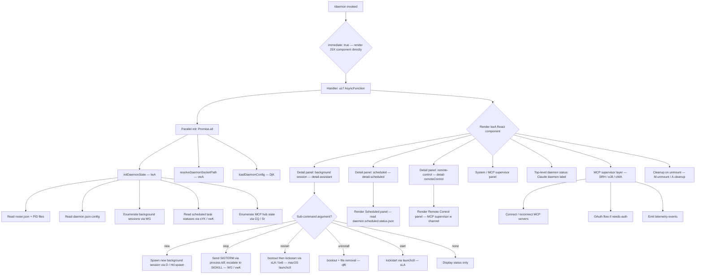

# `/daemon`

> Analysis basis: CC v2.1.173 bundle.js (AST extraction + Claude interpretation)
> Minimum version: v2.1.173

---

## Overview

`/daemon` is the management interface for the Claude Code background-daemon subsystem. It surfaces a live, interactive UI showing background sessions, scheduled tasks, remote-control sessions, and MCP supervisor state, while also providing lifecycle controls (start, stop, restart, uninstall) and a real-time status display rendered via Ink (React for CLIs). The command is registered as `local-jsx` with `immediate: true`, meaning it renders a JSX component directly instead of producing agent-prompt text.

---

## Registration

| Field | Value |
|---|---|
| type | `local-jsx` |
| name | `daemon` |
| description | `Manage background services and routines` |
| immediate | `true` |
| module_id | `ywA` |
| load_inline | `true` |
| loc_byte | `13209356` |
| loc_byte_end | `13209524` |
| loc_line | `9671` |
| arbor_handler.name | `us7` |
| arbor_handler.fqn | `claude-2.1.173::us7` |
| arbor_handler.kind | `AsyncFunction` |
| arbor_handler.resolution_path | `module_id` |
| arbor_handler.n_hits | `0` |

Analysis basis: CC v2.1.173 bundle.js:+13209356

---

## Input Branching

The command has more than three distinct UI panel branches (scheduled, assistant/background, remote-control, system/MCP) plus lifecycle sub-command routing (start, stop, restart, uninstall, new). A Mermaid flowchart is used.



---

## Behavioral Spec

### 1. Entry Point and Parallel Initialization

The Arbor-resolved handler `us7` (AsyncFunction) is the true entry point.

Analysis basis: CC v2.1.173 bundle.js:+13198104

```
async function daemonCommandHandler(context):
    [daemonState, socketPath, daemonConfig] = await Promise.all([
        initDaemonState(context),     // IwA
        resolveDaemonSocketPath(),    // vwA
        loadDaemonConfig(),           // DjK
    ])
    mountJSXComponent(daemonUIComponent, { daemonState, socketPath, daemonConfig })
```

### 2. Daemon State Initialization (`IwA`)

Reads all persistent state files and in-process daemon structures in parallel.

Analysis basis: CC v2.1.173 bundle.js:+13197655

```
async function initDaemonState(context):
    [mcpSessions, bgSessions, scheduledStatus, daemonStatus, rosterData, mcpHub] =
        await Promise.all([
            readMCPHubState(),          // HjK
            readBackgroundSessions(),   // WG
            readScheduledStatus(),      // sYK  → reads "daemon.scheduled.status.json"
            readDaemonStatus(),         // vwK  → reads "daemon.status.json"
            readRoster(),               // CQ   → reads "roster.json"
            resolveMCPServerState(),    // Sr   → queries launchctl "print" on macOS
        ])
    return Object.keys(merged state)
```

Key file names found in literals:
- Roster file: `"roster.json"` (bundle.js:+11709388)
- Daemon PID/status file: `"daemon.status.json"` (bundle.js:+12992556)
- Scheduled status file: `"daemon.scheduled.status.json"` (bundle.js:+13084575)
- Daemon config file: `"daemon.json"` (bundle.js:+11702949)
- MCP needs-auth cache: `"mcp-needs-auth-cache.json"` (bundle.js:+6720953)

### 3. Socket Path Resolution (`vwA`)

Analysis basis: CC v2.1.173 bundle.js:+13181978

```
function resolveDaemonSocketPath():
    home = os.homedir()                    // aDK.homedir
    path = join(homeSegments, ...)         // JOH.join
    try:
        stat(path)                         // im6.stat
        return path
    catch ENOENT:
        return null
    role = "assistant"                     // literal: bundle.js:+13182008
```

### 4. Background Session Management (`WG` and `yx6`)

Analysis basis: CC v2.1.173 bundle.js:+11702456

```
async function readBackgroundSessions():
    pidData = await readFile(pidFilePath)  // DU.readFile — "daemon" literal: +11702414
    try:
        process.kill(pid, 0)              // signal 0 = existence check
    catch:
        // process gone — mark stale
    logLines = readLogTail(logFile)       // nLA: reads file, splits by newline, slices last N
    return sessionList
```

Signal used for existence check: `0` (bundle.js:+11703086)
Process label used: `"claude daemon"` (bundle.js:+11702375)
Log tail buffer: `4` lines (bundle.js:+11702402)

### 5. Scheduled Task Status Reading (`sYK` and `vwK`)

Analysis basis: CC v2.1.173 bundle.js:+13084782 / +12992842

```
async function readScheduledStatus():
    path = buildPath("daemon.scheduled.status.json")  // aYK
    raw  = await fs.readFile(path, "utf8")            // iYK.readFile
    return parseOrNull(raw)                           // Lq

async function readDaemonStatus():
    path = buildPath("daemon.status.json")            // Sm6
    raw  = await fs.readFile(path, "utf8")            // Lq
    try:
        process.kill(pid, 0)
    catch:
        // stale PID
    return status
```

### 6. Roster Reading and Parse (`CQ`)

Analysis basis: CC v2.1.173 bundle.js:+11713213

```
async function readRoster():
    path = buildRosterPath()              // U$H → p$H → joins with "roster.json"
    raw  = await fs.readFile(path)        // $f6.readFile
    if parse fails:
        emit telemetry "tengu_bg_roster_parse_failed"   // +11713303
        return null
    data = JSON.parse(raw)               // n6
    if !validFormat(data):               // Cy7: Array.isArray / Object.keys checks
        throw Error
    rotateIfNeeded(path, data)           // jsq: $f6.rename + Date.now
    return data
```

### 7. macOS launchctl Service Management (`Sr` → `p8` / `du8`)

Analysis basis: CC v2.1.173 bundle.js:+11706476

```
async function queryLaunchctlStatus():
    // macOS only (platform check: "darwin" — +11706048)
    result = await spawn("launchctl", ["print", serviceLabel])  // +11706479, +11706492
    uid    = process.getuid()                                   // Asq: +11703333
    timeout = 5000 ms                                          // +11706526
    return parseServiceState(result.stdout)

async function serviceLifecycle(action):
    // action ∈ {"start","stop","restart","kickstart","bootout","uninstall"}
    if action == "bootout":
        spawn("launchctl", ["bootout", ...])
    if action == "kickstart":
        spawn("launchctl", ["kickstart", "-k", serviceTarget])  // +11705400
    if action == "uninstall":
        bootout()
        removeFiles()                                           // qf6: DKH.unlink
    if action == "restart":
        await stopDaemon()
        if timeout exceeded (50 polls):                        // +11705693
            log("daemon did not exit within 10s of SIGTERM; restart aborted before kickstart")
        await startDaemon()
```

Restart poll limit: `50` iterations (bundle.js:+11705693)
Stop timeout sentinel message: `"daemon did not exit within 10s of SIGTERM; restart aborted before kickstart"` (bundle.js:+11705722)
Platform guard: `"darwin"` (bundle.js:+11706048)

### 8. React UI Component (`kwA`)

Analysis basis: CC v2.1.173 bundle.js:+13198315

```
function DaemonUIComponent(props):
    [selectedPanel, setSelectedPanel] = useState(...)     // tq.useState
    clockContext = useClock()                             // N1 → LM9.useContext
    now = Date.now()                                      // +13198364

    // Panel tabs
    panels = ["detail-scheduled", "detail-assistant",    // +13198935, +13199093
              "detail-remoteControl", "system"]          // +13199214, +13199466

    // MCP supervisor integration
    mcpSupervisor = useMCPSupervisor(w)                  // w: supervisor channel

    // Keyboard handler
    onKey = (key) => handleDaemonKey(key, selectedPanel, dispatch)

    // Lifecycle sub-commands
    if arg == "new":         spawnBackgroundSession()     // D / Hd.spawn
    if arg == "uninstall":   uninstallService()           // qf6
    if arg == "start":       startService()               // sLA
    if arg == "stop":        stopService()                // bx6
    if arg == "restart":     restartService()             // sLA / bx6

    render:
        <DaemonStatusHeader label="Claude daemon" />       // +13200468
        <PanelTabs panels={panels} selected={selectedPanel} />
        <SelectedPanelDetail />
        <ScheduledPanel   label="Scheduled" />             // +13199862
        <RemoteCtrlPanel  label="Remote Control" />        // +13200183
        <PermissionLabel  label="permission" />            // +13200566

    onUnmount: M.unmount(); cleanup()                     // +13208943
```

Sub-command string literals:
- `"new"` (bundle.js:+13199033)
- `"start"` (bundle.js:+11705389)
- `"stop"` (bundle.js:+11705425)
- `"restart"` (bundle.js:+11705465)
- `"uninstall"` (bundle.js:+13198746)

### 9. MCP Supervisor Layer (`SRH` / `eJ8` / `oWA`)

Analysis basis: CC v2.1.173 bundle.js:+6728886

```
function mcpSupervisor(config, channel):
    servers = Object.entries(config)
    for each server:
        if server.type == "disabled":     skip               // +6728984
        if server.type == "stdio":        connectStdio()     // +6729086
        if server.type == "sse-ide":      connectSSEIde()    // +6729185
        if server.type == "ws-ide":       connectWSIde()     // +6729221
        if server.type == "claudeai-proxy": connectProxy()   // +6729493

        if cachedNeedsAuth:
            log("Skipping connection (cached needs-auth)")   // +6729679
            continue
        if recentFailure:
            log("Skipping connection (recent failure cached; retries automatically in 15 min...)")  // +6729941
            continue

        result = await connectServer(server)   // Q1H

        if result == "needs-auth":
            triggerOAuthFlow(server)           // eJ8 OAuth sub-system
        if result == "connected":
            emitTelemetry("tengu_mcp_reconnect", ...)      // +6727684

async function oAuthFlow(server):
    // Starts local HTTP callback server on 127.0.0.1       // +6504962
    // Timeout: 300000 ms (5 min)                           // +6505059
    // Callback path: "/callback"                           // +6503556
    // Auth error page: HTML 400 with CSRF warning          // +6503693
    // Auth success page: HTML 200                          // +6503874
    if success:  emitTelemetry("tengu_mcp_oauth_flow_success")  // +6505485
    if error:    emitTelemetry("tengu_mcp_oauth_flow_error")    // +6507196
```

OAuth flow timeout: `300000` ms (bundle.js:+6505059)
Authentication page success message: `"<h1>Authentication Successful</h1><p>You can close this window. Return to Claude Code.</p>"` (bundle.js:+6504219)

### 10. Background Session Spawn and Adopt (`D` / `Q0A` / `r0A`)

Analysis basis: CC v2.1.173 bundle.js:+16762346

```
async function spawnBackgroundSession(opts):
    // Check free memory                                    // o0A.freemem
    if lowMem:
        emitTelemetry("tengu_bg_dispatch_low_mem")         // +16761185

    session = await Hd.spawn(opts)                         // +16762346
    emitTelemetry("tengu_daemon_bg_session_create", ...)   // +16760900

    // Claim spare slot if available
    claimResult = await Q0A()                              // Hd.claim
    if claimResult fails:
        emitTelemetry("tengu_bg_sendclaim_failed")         // +16739477

    // Write roster entry
    await writeRosterEntry(sessionId, opts)                // r0A / mx6 / ux6

    // Scheduled task integration
    if scheduledTask:
        fireTask()
        emitTelemetry("tengu_scheduled_task_fire")         // +16261651
```

SIGTERM used for graceful stop; escalation to SIGKILL on timeout (literals: `"SIGTERM"` at +16762539, `"SIGKILL"` at +16753583).

### 11. Attach / Detach Protocol (`p05` / `Q`)

Analysis basis: CC v2.1.173 bundle.js:+16744274

The daemon uses a Unix-socket frame protocol (binary framed with `Buffer.allocUnsafe`, `writeUInt32BE`, `writeUInt8`). Message types observed in literals:

| Message type | Purpose |
|---|---|
| `"ping"` / `"pong"` | keepalive |
| `"attach"` | terminal attach to background session |
| `"kill"` | send signal to session |
| `"reply"` | agent reply message |
| `"exec"` | run command in session |
| `"resize"` | terminal resize |
| `"snapshot"` | state snapshot |
| `"subscribe"` / `"stream"` | event streaming |
| `"shutdown"` | graceful daemon shutdown |
| `"lease"` / `"leases"` | session lease management |
| `"dispatch"` | control dispatch |
| `"permission-response"` | user permission result |
| `"ensure-spare"` | pre-warm spare session |

Error codes observed:
- `"EAUTH"` — missing daemon control key (bundle.js:+16748586)
- `"ENOJOB"` — job not found (bundle.js:+16749125)
- `"ENOREPLY"` — job not accepting replies (bundle.js:+16749266)
- `"EUNVERIFIED"` — worker identity unverifiable (bundle.js:+16750843)
- `"ERESPAWNING"` — session is respawning (bundle.js:+16750937)
- `"ESTARTING"` — session starting (bundle.js:+16747180)
- `"EPROTO"` — protocol mismatch (bundle.js:+16747481)

---

## State & Side Effects

| Item | Detail |
|---|---|
| Telemetry | `tengu_bg_roster_parse_failed`, `tengu_mcp_oauth_flow_start`, `tengu_mcp_oauth_flow_success`, `tengu_mcp_oauth_flow_error`, `tengu_daemon_config_reload`, `tengu_mcp_skills`, `tengu_config_auth_loss_prevented`, `tengu_feature_ok`, `tengu_feature_bad`, `tengu_daemon_control`, `tengu_bg_proto_mismatch`, `tengu_bg_dispatch_stale_drop`, `tengu_bg_attach_legacy_autorespawn`, `tengu_bg_attach`, `tengu_bg_attach_stall_gave_up`, `tengu_bg_attach_stall_respawn`, `tengu_bg_attach_kick`, `tengu_scheduled_task_missed`, `tengu_bg_dispatch_sigkill_escalate`, `tengu_bg_low_mem_mb`, `tengu_bg_dispatch_low_mem`, `tengu_scheduled_task_fire`, `tengu_scheduled_task_expired`, `tengu_bg_spare_enable`, `tengu_bg_sendclaim_failed`, `tengu_bg_state_read_transient`, `tengu_bg_spare_claim`, `tengu_bg_spare_claim_fail`, `tengu_daemon_bg_session_create` |
| Hook registration | `y9` registers a shutdown hook via `yZA.register` (bundle.js:+63751) |
| appState changes | Daemon config reload triggers `tengu_daemon_config_reload` event and calls `E.updateConfig` / `E.stop` / `E.start` on the supervisor (bundle.js:+16775692) |
| Socket / file I/O | Reads `roster.json`, `daemon.json`, `daemon.status.json`, `daemon.scheduled.status.json`, `mcp-needs-auth-cache.json`; writes roster entries; manages a Unix control socket |
| Process signals | Sends `SIGTERM` (graceful) and escalates to `SIGKILL` if session stalls at startup (bundle.js:+16753583) |
| OAuth HTTP server | Binds to `127.0.0.1` on a dynamic port; serves `/callback`; times out after 300 000 ms (bundle.js:+6504962, +6505059) |
| Platform guard | macOS launchctl operations guarded by `"darwin"` platform check (bundle.js:+11706048) |
| Log level | Internal debug channel tagged `"debug"` (bundle.js:+210480); MCP debug channel tagged `"mcpDebug"` (bundle.js:+1047409) |
| Sound | <!-- TODO: not found in depth-2 traversal; needs --depth 4 --> |
| Ink unmount | `M.unmount()` called on component unmount (bundle.js:+13208943) |

---

## Version History

| Version | Change |
|---|---|
| v2.1.173 | Initial analysis |

---

## Common Mistakes

1. **Omitting the sub-command**: `/daemon` with no argument shows status only. Pass `new`, `start`, `stop`, `restart`, or `uninstall` as the first positional argument to trigger lifecycle operations.
2. **Expecting launchctl operations on non-macOS**: The `launchctl bootout` / `kickstart` path is guarded by a `"darwin"` platform check. On Linux the daemon is managed differently and the macOS-specific lifecycle commands will silently skip or error.
3. **Stale PID files**: The command uses `process.kill(pid, 0)` to test process existence. If the PID file exists but the process is gone the session is marked stale — this is normal behaviour, not a bug. Delete the PID file or run `/daemon restart` to clear it.
4. **OAuth flow timing out**: The local callback HTTP server has a hard 5-minute (300 000 ms) timeout. If the user does not complete browser authorization within that window, the flow fails with `"Authentication timeout"` and emits `tengu_mcp_oauth_flow_error`.
5. **Running `/daemon` in a non-interactive context**: The command is `local-jsx` with `immediate: true` and renders a live Ink UI. Piping its output or running it headlessly will produce garbled terminal sequences.
6. **Ignoring the restart 10-second guard**: On macOS, if the daemon process does not exit within 50 poll iterations (~10 s) after SIGTERM, `kickstart` is aborted to prevent a double-daemon situation. The message `"daemon did not exit within 10s of SIGTERM; restart aborted before kickstart"` indicates this condition.

---

## Appendix — Identifier Mapping

> For bundle debugging only. Identifiers change across versions.

| Identifier | Role |
|---|---|
| `us7` | Main async handler for `/daemon` command (Arbor-resolved entry point) |
| `ds7` | Primary UI render function called within the component tree |
| `kwA` | Ink/React UI component for the daemon management panel |
| `IwA` | initDaemonState — parallel loader for all daemon state |
| `yTH` | Helper called during daemon state initialization |
| `MjK` | Sub-initializer within IwA; fans out to F46, SH, WG |
| `F46` | Reads scheduled task list / config file |
| `CzA` | File read + JSON parse utility (reads utf8, trims, parses, validates Array) |
| `fwA` | Array validation helper (Array.isArray check) |
| `SH` | Logging / error sink with queue shift/push (rQH) |
| `JA` | Error + String coercion utility |
| `f6` | String coercion helper |
| `Rq` | Traffic classifier ("essential-traffic" routing) |
| `MRf` | Log queue manager (Lo6.shift / Lo6.push) |
| `WG` | Background session reader: reads PID file, calls process.kill(pid,0), calls nLA |
| `yx6` | PID file reader (DU.readFile) |
| `nLA` | Log tail reader: readFile, split by newline, slice last N lines |
| `KW` | Post-read normalizer calling KS |
| `HjK` | MCP hub state enumerator; calls vEH, WG, XOH.basename |
| `vEH` | Reads MCP store context (d9), checks ENOENT, calls VwA / EH / Lq / ZwA |
| `d9` | AsyncLocalStorage getStore accessor (su4.getStore) |
| `N8` | Null/undefined guard utility |
| `VwA` | ZwA wrapper |
| `EH` | String coercion wrapper |
| `K` | Padded column formatter (f.map + L.padEnd) |
| `yx` | Path join helper (iLA.join + A_) |
| `vwK` | Daemon status file reader + process existence check + process.kill |
| `Sm6` | Path builder for daemon.status.json (EwK.join + A_) |
| `sYK` | Scheduled status file reader (iYK.readFile + aYK + Lq + process.kill) |
| `aYK` | Path builder for daemon.scheduled.status.json (rYK.join + A_) |
| `CQ` | Roster reader: $f6.readFile, U$H, R8, A7A, SH, jsq, Cy7, validates, rotates |
| `n6` | JSON.parse wrapper |
| `U$H` | Roster path builder (Z$.join + p$H) |
| `p$H` | Base roster directory builder (Z$.join + A_) |
| `R8` | Error code classifier (delegates to N8) |
| `A7A` | Timestamp helper (Date.now) |
| `jsq` | Roster rotation: renames old roster, calls U$H, Date.now, SH |
| `Cy7` | Roster format validator (Array.isArray + Object.keys) |
| `H1` | Utility referencing q56 |
| `q56` | Low-level primitive |
| `Sr` | macOS service status: calls p8 (launchctl print) and du8 (getuid) |
| `p8` | launchctl spawn wrapper (u_ + p6) |
| `u_` | Process spawn helper with timeout (gvH, Y, pbf, v3, N, N8, SH) |
| `p6` | Process output reader (Yo6 + P_) |
| `du8` | uid resolver (Asq → process.getuid) |
| `Asq` | process.getuid wrapper |
| `vwA` | Socket path resolver: P_, Ro6, JOH.join, aDK.homedir, im6.stat, R8, N, EH |
| `P_` | Path resolution helper (BG) |
| `Ro6` | Path segment resolver (o6 + R8) |
| `N` | Full notification/logging pipeline: hVH, d8f, H.includes, CH, lf, oFH, i8f |
| `d8f` | Log formatter (th, xs8, RZA) |
| `RZA` | Log level router (leK, neK) |
| `CH` | JSON.stringify wrapper |
| `lf` | Log line builder (zNA, H.replace, q.at, A.lastIndexOf, A.slice) |
| `zNA` | ANSI/color map (B8f.map) |
| `oFH` | Terminal write helper (tvA → H.write) |
| `i8f` | Structured log file writer (EFH, FfH, r6H.dirname, th, o6, K36, DNA, Us8, n8f, y9) |
| `EFH` | Batch log flusher (clearTimeout, setTimeout, setImmediate, $.push, f.push) |
| `FfH` | Log file path builder (sFH, r6H.join, A_, y6) |
| `K36` | Log level gate (N8) |
| `DNA` | Log directory path builder (r6H.join, y6) |
| `Us8` | Log file rotation (hy.stat, H.endsWith ".txt", hy.rename, hy.unlink) |
| `n8f` | Log append: hy.mkdir, hy.appendFile, K36, DNA, Us8, Buffer.byteLength, Fs8 |
| `y9` | Shutdown hook registrar (yZA.register) |
| `M` | Ink renderer (SRH, $n8, f.get, N, f.values, $, oWA) |
| `SRH` | MCP supervisor render / connection orchestrator |
| `qi` | MCP connection slot processor (dZ6, nt, w2H, Og, SJ8, gZ6, YX, gZ6, Object.assign) |
| `dZ6` | Connection slot initializer (Wk, h4H) |
| `nt` | Individual MCP server connector ($f, M2, Wk, F1H, GD, p7, Qw, N, NJ8, iaH, YX, D, Y.add) |
| `Og` | MCP server config entry collector (F1H, A.push) |
| `SJ8` | Status color formatter (W6.red, W6.yellow) |
| `gZ6` | Connection state map manager (jj8, QV, Pj8, WC9, wMH, q.has/set/get) |
| `QV` | Connection value wrapper (Hw, MU_) |
| `Hw` | MCP value hydrator (_AH, b6, Lq) |
| `g8` | Utility referencing _ |
| `Pc9` | Connection result processor (tB_, j2H, Xj8, Date.now) |
| `tB_` | Daemon store accessor (d9, tX8, n6) |
| `j2H` | Connection hash builder (CH, Array.isArray, Object.keys, lB9.createHash sha256) |
| `Xj8` | Slot config extractor (b1H, Object.keys) |
| `Pj8` | Slot hash helper (Xj8, nX) |
| `nX` | Hash digest builder (CH, PC9.createHash) |
| `jj8` | Cache key builder (hf → lV1) |
| `j8` | MCP debug logger (rQH.push, Ya.logMCPDebug) |
| `eJ8` | MCP server connection lifecycle (FWL, Nc, Q1H, teH, Li, mu, w, LZ, OL, EH, Promise.race, gWL, BWL) |
| `Q1H` | Full MCP server session handler (OAuth server, token exchange, listener management) |
| `teH` | In-flight connection tracker (lJ8.set/get/delete) |
| `Li` | MCP reconnect logic (ey, r0, aS, j8, ZH6, t6, Nc9, GU_, Promise.all, UN, Yi, pN, oX8, nb, LU_, kH, bH, OL, EH) |
| `mu` | Auth token accessor (rK) |
| `w` | Supervisor write channel (vEH, q.write, oDK, L.get/delete/set, E.stop/updateConfig/start, V.start, c) |
| `OL` | MCP error logger (rQH.push, Ya.logMCPError) |
| `BWL` | SSH environment detector (_6.isSSH, f6, vq) |
| `HX8` | complete_authentication handler (Nc, UWL, seH, eeH, EH) |
| `seH` | Session cache reader (cJ8.get) |
| `eeH` | In-flight tracker reader (lJ8.get) |
| `Nc9` | MCP needs-auth cache reader (rX8.then, tB_, d9, tX8, CH) |
| `tX8` | Cache file path builder (sX8.join + A_) |
| `GU_` | MCP grant handler (nX, hf, j8, EH) |
| `pN` | MCP skills telemetry emitter (Y6 → I26/k26/Ym/ajH.has/I78/N26.add/zF.has/zF.get/b6) |
| `Y6` | MCP skill event builder |
| `LU_` | Feature flag loader (E8 → Q78/nG/H/AJH/R_9/u26/N/G7H/urH/c/g78) |
| `E8` | Feature flag evaluator |
| `Ec9` | Concurrent mapper (FF — full async iterator with AggregateError support) |
| `FF` | Generic concurrency primitive (TypeError, Number.isSafeInteger, addEventListener, AggregateError) |
| `vH6` | parseInt wrapper (port parser) |
| `eX8` | parseInt wrapper (secondary port parser) |
| `$n8` | MCP update applier (H.applyMcpUpdate, yRH, j8, A.cleanup, r0, hD) |
| `yRH` | Connection hash rebuilder (j2H) |
| `r0` | Slot cleanup runner (ZH6, K.cleanup, pN) |
| `ZH6` | Slot state resetter (j2H) |
| `$` | Background session list accessor (ZwK) |
| `ZwK` | Session state serializer (Ua, Date.now, d9, Sm6, CH) |
| `Ua` | zLH utility |
| `oWA` | MCP state diff applier (Object.entries, A.filter, _.getClients, UJ8, q, d8, N, ZH6, SRH, $n8, Object.fromEntries, K.map) |
| `UJ8` | Server capability checker (YWL.has, wU_.has) |
| `d8` | Debounced async runner (K, Error, q, setTimeout, clearTimeout, f.unref) |
| `O` | m8 accessor |
| `DjK` | Daemon config loader (QnH) |
| `QnH` | Config file reader (DJ6) |
| `DJ6` | Config parser and merger (kP4, _.has, N, _.add, A.filter) |
| `kP4` | Full config processing pipeline (NP4, Im1, WJ_, gnH, wL, kDH, gA, Hl, rU, sDH, vP4, YJ6, GJ_, v7, Zj, Qm1, dm1, hP4) |
| `N1` | Clock context hook (LM9.useContext → throws "useClock must be used within a ClockProvider") |
| `L` | Active connection registry (A.close, q.close, f) |
| `If` | Input focus hook (kF.useRef/useContext/useMemo/useSyncExternalStore, q.current, K.setTimeout, z) |
| `z` | Shutdown orchestrator (kH, bH, wS, CU) |
| `kH` | Feature telemetry — good path (c, A6 → tengu_feature_ok) |
| `A6` | q56 accessor |
| `bH` | Feature telemetry — bad path (c, A6 → tengu_feature_bad) |
| `wS` | Background session shutdown (eu, Dl.push, ThH, AJ_) |
| `eu` | nC utility |
| `ThH` | zS shutdown helper |
| `AJ_` | Shutdown event emitter (Jq8, HJ_.randomUUID, hnH, QB, H.emit) |
| `CU` | Process exit orchestrator (Promise.race, Promise.all, NLH, hLH, d8, process.exit) |
| `NLH` | vLH.shutdown caller |
| `hLH` | Timeout clearer + NZ_ callback |
| `G` | Keyboard input handler (SK.fromText, I, Y, T.preventDefault, z.handleKeyDown, td, j, ONK, cvK, rvK, svK, b.getRegister, evK, FvK, gvK, JXA, H.onOpenHistorySearch, P, S.execute, H.onChange) |
| `I` | Input state reference |
| `T` | pV6 / N76 accessor |
| `td` | XY utility |
| `XY` | Grapheme boundary helper |
| `ONK` | Normal-mode operator dispatcher (c45, l45, n45, i45, vUH, r45, Dd8) |
| `c45` | Operator: cursor set-offset + zNK |
| `zNK` | Motion resolver (wXA, YXA, A.setOffset, vd8.has, vUH, Nd8.has, $NK) |
| `l45` | Operator: count-prefixed motion (Math.min, parseInt, String, zNK) |
| `n45` | Operator: setOffset + setLastFind |
| `i45` | Operator: setOffset + vUH |
| `vUH` | Visual-mode position helper (k45, f.equals) |
| `r45` | Operator: find motion (DXA.has, Dd8) |
| `Dd8` | Find executor (pvK, qO8, S45, R45) |
| `cvK` | Visual-mode change operator (Zd8, Ed8, dvK, A.recordChange) |
| `Zd8` | Visual range calculator (Math.min/max, BvK, f.indexOf) |
| `BvK` | H.lastIndexOf wrapper |
| `Ed8` | Visual end position (V4, H.endsWith, IVH) |
| `V4` | H.indexOf wrapper |
| `IVH` | XY grapheme wrapper |
| `dvK` | Delete/change text (f.endsWith, q.setRegister/setText/enterInsert, Math.max/min, td, q.setOffset, lL6) |
| `lL6` | Yank helper (q.setRegister/setOffset/setText, $XA, q.enterInsert) |
| `rvK` | Visual replace operator (Zd8, Ed8, ivK, A.recordChange) |
| `ivK` | Replace text (XY, q.setText, q.setOffset) |
| `svK` | Visual case operator (Zd8, Ed8, avK, A.recordChange) |
| `avK` | Case toggle (XY, M.toUpperCase/toLowerCase, q.setText/setOffset) |
| `b` | Clipboard/register manager ($SH, w, N, Ua, QsH, Date.now, DW9, P.has, z, S, P.add, X.set, c, d.map, f, _, OgK, W1H) |
| `$SH` | Register file reader (o6, _.readFile, x5H, T9, SH, Lq, Array.isArray, N, CH, Ok, f.push) |
| `x5H` | Register file path builder (rw8.join, vf) |
| `T9` | N8 wrapper |
| `Ok` | Register entry parser (H.trim, S9L, A.push) |
| `QsH` | Register file writer (vf, iw8.mkdir, rw8.join, H.map, iw8.writeFile, x5H, CH) |
| `vf` | BG path helper |
| `DW9` | Register filter (H.filter, gsH) |
| `gsH` | Register entry sorter (Ok, BsH, q.getTime) |
| `P` | SSH/terminal pipe manager (Buffer.concat, X.indexOf, j.off, I7, j.setTimeout, X.subarray, p05, EH) |
| `X` | M / q.setTimeout accessor |
| `I7` | H.end + CH terminal writer |
| `p05` | Full daemon protocol message dispatcher (large: handles all message types) |
| `d` | Session map (yx6, taq) |
| `taq` | PID file cleaner (DU.unlink, ITH, R8) |
| `OgK` | Crontab/schedule parser (H.map, hN, Math.max, q.join) |
| `hN` | Schedule expression parser (H.trim, K.match, parseInt, D.toString, f.match, j.toString, Y, $.match, J.getUTCDay/setUTCDate/getUTCDate/setUTCHours/getDay) |
| `W1H` | Scheduled-task roster reader/writer (g6H, $SH, q.filter, A.has, QsH) |
| `g6H` | _.has wrapper |
| `evK` | Visual paste operator (_.getRegister, Zd8, Ed8, _NK, _.recordChange) |
| `_NK` | Paste text applicator (H.endsWith/slice, L.endsWith, M.endsWith, q.setRegister/setText/setOffset, td, Math.max) |
| `FvK` | Visual indent operator (Math.min/max, V4, K.slice/split, O.endsWith, M.slice, _.setText/setOffset/recordChange, w.join, hUH) |
| `hUH` | H.slice wrapper |
| `gvK` | Visual dedent operator (Math.min/max, V4, L.slice/split, OXA, O.join, q.setText/setOffset/recordChange, hUH) |
| `OXA` | Indent-strip helper (L.startsWith, L.slice) |
| `D` | Background session pool manager (A.get, c, b.kill, d8, H, bH, kH, o0A.freemem, kF8, Math.round, i06, SH, A.values, Q.retireIfSettled, Y6, Q0A, A.set, r0A, f, Date.now, Y, N8, A6, B.dispose, Hd.spawn) |
| `kF8` | macOS free-memory reporter (s6, Y6 → tengu_bg_low_mem_mb) |
| `i06` | Pinned-session config reader (GW.readFile, ck_, n6, Array.isArray, _.filter, R8, ht4) |
| `ck_` | Pins.json path builder (vJ.join, iE) |
| `ht4` | Plugin directory scanner (GW.readdir, iE, Promise.all, H.filter, K.isDirectory, GW.readFile, vJ.join, A.push, YY9, R8, yz) |
| `Q` | PTY session lifecycle (d.on/once, C, process.kill, N, B, AQ8.unlink, hZ, Lv, Hu8, d.destroy/connect) |
| `l` | Scheduled-task runner (z, B.add, G.has, X.get, jT6, aw8, X.set, N, c, NX5.isLoopDefaultSentinel, K, _, $gK, Math.floor, g.push, g6H, X.delete, G.add/delete, W1H → tengu_scheduled_task_fire/expired/missed) |
| `C` | clearTimeout + O.write helper |
| `B` | Pending-set manager |
| `hZ` | Socket path builder for PID/log (s6, Z$.join, ApH, H.split) |
| `Lv` | Frame encoder (Buffer.from/allocUnsafe, A.writeUInt32BE/writeUInt8, _.copy) |
| `Hu8` | Frame decoder (Buffer.alloc/concat, A.readUInt32BE/readUInt8/subarray, H, Buffer.from, n6, $.toString) |
| `Q0A` | Spare-slot claim orchestrator (Hd.claim, MjA, k05, I05, K.socketAuth, c, a7, EH, N, Nn8.connect, L.on/once/write/end, Lv) |
| `MjA` | Roster write (s6, ux6, _d.mkdir, xx6, _d.writeFile, JSON.stringify, N, EH) |
| `k05` | Claim retry loop (Date.now, Error, y05, N8, d8 → tengu_bg_sendclaim_failed on fail) |
| `I05` | Hd.buildClaimFrame caller |
| `r0A` | Session lifecycle orchestrator (q.add/delete, L.finally, K, Hf, f, Vw.rm/unlink, SH, Tq, YO, DXH, m7, Of6, mx6, B$H, hZ, RQ, ux6, _.rosterEntry, A, setTimeout, w.get/delete, H.delete) |
| `Hf` | Snap path builder (vJ.join, iE) |
| `Tq` | Session state file watcher (vJ.join, Promise.all, GW.stat, R8, w5H.delete/get/set/clear, jXH.delete/has/add, N, vJ.basename, String, c, a7, GW.readFile, Nt4, n6, Number/Number.isFinite → tengu_bg_state_read_transient) |
| `YO` | DN utility |
| `DXH` | Dispatch filter (K.startsWith, A.push, K.indexOf/slice, z5H.has, kO8.has, _.push, O.push, gk_.has, N, A.join, Zt4) |
| `m7` | Message formatter (MO, vJ.join, CH, NJ) |
| `Of6` | Deferred roster offer (Jsq.then, CQ, H, Date.now, by7, _.catch) |
| `mx6` | Socket path builder alt (Z$.join, xx6) |
| `B$H` | Log/socket path builder (Z$.join, ApH) |
| `RQ` | Roster queue builder (s6, eLA, Z$.join, Mf6) |
| `ux6` | Primary socket path builder (Z$.join, xx6) |
| `JXA` | Insert-mode key handler (b45, x45, u45, m45, p45, U45, B45, F45, g45, Q45, d45) |
| `b45` | Insert: cursor offset set + LNK |
| `LNK` | Insert motion resolver (wXA, vd8.has, vUH, A.setOffset, Nd8.has, Wd8, Xd8, Gd8, UvK, NUH, LXA, $NK, A.enterInsert, pU6) |
| `x45` | Insert: count motion (Math.min, parseInt, String, LNK) |
| `u45` | Insert: LXA + MNK |
| `LXA` | Insert text operation (q.split, V4, q.slice, Math.min/indexOf, O.endsWith, A.setRegister/setOffset/setText, Math.max, td, A.enterInsert, K.slice, A.recordChange) |
| `MNK` | Insert motion variant (YXA, Nd8.has, vd8.has, NUH, ANK) |
| `m45` | Insert: count motion variant (Math.min, parseInt, String, MNK) |
| `p45` | Insert: jd8 |
| `jd8` | Find + change (C45, lL6, K.setLastFind/recordChange) |
| `U45` | Insert: find operator (DXA.has, Jd8) |
| `Jd8` | Find + yank (Dd8, lL6, K.recordChange) |
| `B45` | Insert: A.setOffset + A.setLastFind |
| `F45` | Insert: vUH + A.setOffset + Math.min |
| `g45` | Insert: NUH + qNK |
| `NUH` | Word-boundary motion (vUH, K.equals, KXA, MXA, q.setRegister/enterInsert, lL6, q.recordChange) |
| `qNK` | Line-end motion (q.equals, MXA, lL6, A.recordChange) |
| `Q45` | Insert: Pd8 |
| `Pd8` | Delete-to-end (D36, K.slice, A.setText/setOffset, Math.max, A.recordChange) |
| `d45` | Insert: Td8 |
| `Td8` | Join-lines operation (Math.min, OXA, K.join, A.setText/setOffset, hUH, A.recordChange) |
| `J` | D accessor (session map lookup) |
| `qf6` | Service uninstall handler: aLA (path), p8 (launchctl), du8, DKH.unlink, R8, EH |
| `aLA` | LaunchAgents path builder (Rx6.join, rLA.homedir) |
| `bx6` | Service stop handler (sLA) |
| `sLA` | Service lifecycle dispatcher (du8, p8, _sq.setTimeout — start/stop/restart/kickstart/bootout) |
| `E` | Viewport/scroll manager (W, Math.max, Math.min) |
| `W` | MCP server connection initiator (N76, aS, UN, Promise.all, Yi, nb, SH, JA → "Connection failed") |
| `V` | Spare session pool |

---

Note: index built via Arbor fallback; some signals (telemetry, literals) may be missing — see arbor-fallback.js.