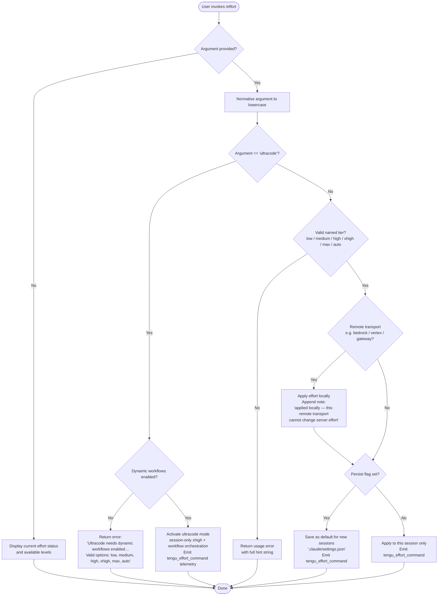

# `/effort`

> Analysis basis: CC v2.1.170 bundle.js (AST extraction + Claude interpretation)
> Minimum version: v2.1.170

---

## Overview

The `/effort` command lets the user set the model's inference effort level for the current session or persistently. It accepts a named tier (`low`, `medium`, `high`, `xhigh`, `max`, `ultracode`, or `auto`) and translates that tier into the appropriate model-side budget token or thinking parameter, with additional guard-rail logic for transport type, subscription plan, and dynamic-workflow availability.

---

## Registration

| Field | Value |
|---|---|
| type | `local-jsx` |
| name | `effort` |
| description | Set effort level for model usage |
| argumentHint | `[low\|medium\|high\|xhigh\|max\|ultracode\|auto] \| [low\|medium\|high\|xhigh\|max\|auto]` |
| immediate | `null` |
| thinClientDispatch | `control-request` |
| module_id | `v3K` |
| load_inline | `true` |
| loc_byte | `12908019` |
| loc_byte_end | `12908350` |
| loc_line | `9150` |
| arbor_handler.name | `Jcf` |
| arbor_handler.fqn | `claude-2.1.170::Jcf` |
| arbor_handler.kind | `AsyncFunction` |
| arbor_handler.resolution_path | `module_id` |
| arbor_handler.n_hits | `2` |

Analysis basis: CC v2.1.170 bundle.js:+12908019

---

## Input Branching

Six or more distinct dispatch paths exist (no argument → status display; `ultracode` with workflows off → error; `ultracode` with workflows on → special activation; named tier on remote transport → local-only note; named tier with persist flag → saved default; named tier without persist flag → session-only). A Mermaid flowchart is mandatory.



---

## Behavioral Spec

### Top-level handler — `effortCommandHandler` (`Jcf`)

The Arbor-resolved entry point is the async function `Jcf` (FQN `claude-2.1.170::Jcf`), reached via `module_id` → `v3K`.

```
async function effortCommandHandler(context):
    args = context.args   // raw argument string

    if args is empty or whitespace:
        return renderStatusView(context)   // show current level

    normalised = args.trim().toLowerCase()

    if normalised == "ultracode":
        return handleUltracodeActivation(context)

    if normalised not in VALID_TIERS:
        return renderUsageError(context)

    applyEffortTier(normalised, context)
```

Analysis basis: CC v2.1.170 bundle.js:+12906211

---

### Status display — `renderStatusView`

Called when the user runs `/effort` with no argument. Reads the current effort level from app state and renders a JSX component (`EA.createElement`) that shows:

- Active tier name
- A description string per tier (e.g. `"Quick, straightforward implementation with minimal overhead"` for `low`)
- Whether the value is session-only or saved as default

Special-case: when the active mode is `ultracode`, the status line reads `"Current effort level: ultracode (xhigh + dynamic workflow orchestration; this session only)"`.

Analysis basis: CC v2.1.170 bundle.js:+12895102

---

### Effort tier validation — `validateEffortTier` (`QNH`)

```
function validateEffortTier(value):
    VALID_TIERS = internal set (includes low, medium, high,
                                xhigh, max, auto, ultracode)
    return VALID_TIERS.includes(value)
```

The `argumentHint` registration field separates the hint into two bracket groups — the first includes `ultracode`, the second omits it — suggesting `ultracode` is gated behind dynamic-workflow availability and only surfaced when that feature is active.

Analysis basis: CC v2.1.170 bundle.js:+12895283

---

### Ultracode activation — `handleUltracodeActivation`

```
async function handleUltracodeActivation(context):
    workflowsEnabled = checkWorkflowsEnabled(context.state)
    if not workflowsEnabled:
        return errorMessage(
            "Ultracode needs dynamic workflows enabled (see /config). " +
            "Valid options are: low, medium, high, xhigh, max, auto"
        )

    // Activate session-scoped ultracode
    setSessionEffort("ultracode", context)
    emitTelemetry("tengu_effort_command")
    return statusMessage(
        "Current effort level: ultracode " +
        "(xhigh + dynamic workflow orchestration; this session only)"
    )
```

Analysis basis: CC v2.1.170 bundle.js:+12895942

---

### Tier application — `applyEffortTier`

```
async function applyEffortTier(tier, context):
    isRemote = transportIsRemote(context)   // bedrock / vertex / gateway

    suffix = ""
    if isRemote:
        suffix = " (applied locally — this remote transport can't change server effort)"

    persist = context.flags.persist   // --save or similar flag

    if persist:
        saveEffortToSettings(tier)      // writes .claude/settings.json
        emitTelemetry("tengu_effort_command")
        return confirmMessage(tier + " (saved as your default for new sessions)" + suffix)
    else:
        setSessionEffort(tier, context)
        emitTelemetry("tengu_effort_command")
        return confirmMessage(tier + " (this session only)" + suffix)
```

Analysis basis: CC v2.1.170 bundle.js:+12894885, +12894929, +12893939

---

### Workflow availability check — `checkWorkflowsEnabled` (`NwL`)

```
function checkWorkflowsEnabled(state):
    // Checks the "allow_workflows" feature flag in state
    // Also consults "pro" subscription tier
    // Emits tengu_workflows_enabled telemetry on positive path
    return state.featureFlags.has("allow_workflows")
```

Analysis basis: CC v2.1.170 bundle.js:+2513091, +2513216

---

### Transport type detection — `getTransportKind` (`IP` / `W1`)

```
function getTransportKind(model, config):
    // Checks model string prefixes and config provider
    // Returns one of: firstParty, anthropicAws, foundry, mantle,
    //                 gateway, bedrock, vertex
    if model.includes("application-inference-profile"):
        return "anthropicAws"
    if provider == "bedrock":
        return "bedrock"
    if provider == "vertex":
        return "vertex"
    ...
    return "firstParty"
```

Analysis basis: CC v2.1.170 bundle.js:+2513620, +2253250

---

### Settings persistence — `saveEffortToSettings` (via `e_` / `Fr6`)

When persist mode is active, the effort tier is written to `.claude/settings.json` (key `"effort"`). The `apply_flag_settings` literal at bundle.js:+12894062 suggests this path is also triggered by a CLI flag on session start. Atomic file write via temp file + rename is used (`xO6` / `q.renameSync`).

Analysis basis: CC v2.1.170 bundle.js:+1269048, +1269058, +12894062

---

### Tier descriptions — displayed in status view

| Tier | Description string |
|---|---|
| `low` | "Quick, straightforward implementation with minimal overhead" |
| `medium` | "Balanced approach with standard implementation and testing" |
| `high` | "Comprehensive implementation with extensive testing and documentation" |
| `xhigh` | <!-- TODO: not found in depth-2 traversal; needs --depth 4 --> |
| `max` | <!-- TODO: not found in depth-2 traversal; needs --depth 4 --> |
| `ultracode` | "xhigh + workflows" (internal label); "xhigh + dynamic workflow orchestration; this session only" (display) |
| `auto` | "Use the default effort level for your model" |

Analysis basis: CC v2.1.170 bundle.js:+2517514, +2517526, +2517592, +2517607, +2517685, +12898912, +12893655

---

### Visual animation — `effortAnimationComponent` (`FQ`, `V3K`, `Z3K`, `T3K`)

The ultracode activation path renders an animated JSX component. Internal helpers use:

- `Math.cos` / `Math.round` / `Math.min` for colour interpolation (bundle.js:+12900316, +12900352, +12900374)
- `Math.sqrt` for distance calculation (bundle.js:+12900215)
- `Math.floor` for frame stepping (bundle.js:+12898682)
- `Math.random` / `setTimeout` for particle generation timing (bundle.js:+13939352, +13939389)
- The colour name `"violet-ripple"` is used for the ultracode animation palette (bundle.js:+12898660)
- Animation constants: 3 base layers (bundle.js:+12898600), 17 particles (bundle.js:+12898604), 4 ring segments (bundle.js:+12898693), radius scaling factor 8.5 (bundle.js:+12898779), 18-step colour gradient (bundle.js:+12898875)

Analysis basis: CC v2.1.170 bundle.js:+12900425

---

## State & Side Effects

| Item | Detail |
|---|---|
| Telemetry: `tengu_effort_command` | Fired on every successful effort change (bundle.js:+12895533) |
| Telemetry: `tengu_workflows_enabled` | Fired when the workflow availability check succeeds (bundle.js:+2513292) |
| Telemetry: `tengu_slate_finch` | Fired during settings-persistence path (bundle.js:+2517980) |
| Telemetry: `tengu_feature_ok` | Fired on successful feature gate check (bundle.js:+1014205) |
| Telemetry: `tengu_feature_sad` | Fired when a feature gate check returns a degraded result (bundle.js:+1014348) |
| Telemetry: `tengu_feature_bad` | Fired on feature gate check failure (bundle.js:+1014267) |
| Telemetry: `tengu_config_auth_loss_prevented` | Fired when the config-write guard detects that a re-read config is missing auth that the cache holds, refusing the write (bundle.js:+3303113) |
| Session state: `effort` | Updated in-memory immediately on any valid tier change |
| Persistent settings | Written to `.claude/settings.json` key `"effort"` when persist path is taken; atomic temp-file + rename (bundle.js:+1269048) |
| Feature flags consulted | `allow_workflows` (bundle.js:+2513091), `allow_product_feedback` (bundle.js:+2511754) |
| thinClientDispatch | `"control-request"` — the command is dispatched as a control event in thin-client (remote) sessions rather than as a normal tool invocation |
| JSX rendering | `EA.createElement` used for both status display and ultracode animation (bundle.js:+12906282, +12900786) |
| Auth-loss guard | `saveGlobalConfig` checks that re-read config retains auth before writing; logs `"saveGlobalConfig fallback: re-read config is missing auth that cache has; refusing to write. See GH #3117."` (bundle.js:+3302985) |

---

## Version History

| Version | Change |
|---|---|
| v2.1.170 | Initial analysis — `ultracode` tier added alongside standard tiers; animated JSX activation component; `thinClientDispatch: "control-request"` |

---

## Common Mistakes

1. **Using `ultracode` without enabling dynamic workflows.** The tier is silently absent from the hint string shown to users who do not have `allow_workflows` enabled; invoking it directly produces the error `"Ultracode needs dynamic workflows enabled (see /config). Valid options are: low, medium, high, xhigh, max, auto"`.

2. **Expecting `/effort` to affect the server on remote transports.** When using Bedrock, Vertex, or gateway providers, the effort tier is applied client-side only, and the response carries the note `"applied locally — this remote transport can't change server effort"`. The setting does not propagate upstream.

3. **Omitting the tier argument and expecting a change.** Running `/effort` with no argument shows the current status; it does not reset to any default.

4. **Confusing session-only vs. persistent scope.** Without a persist flag, the tier applies only to the current session. A new session inherits whatever is written in `.claude/settings.json` (or the `CLAUDE_EFFORT` environment variable if supported).

5. **Treating `auto` as equivalent to the absence of a setting.** `auto` is an explicit tier value stored as `"auto"` internally; it instructs the runtime to use the model default rather than any user-specified budget, but it still counts as a set value and overwrites a previously saved tier.

---

## Appendix — Identifier Mapping

> For bundle debugging only. Identifiers change across versions.

| Identifier | Role |
|---|---|
| `Jcf` | Main async handler for `/effort` command (Arbor-resolved) |
| `sp8` | Outer effort command wrapper / JSX render root |
| `ya` | Effort argument dispatch coordinator |
| `NP` | Feature flag / plan checker for effort eligibility |
| `M98` | Sub-checker: plan type resolution |
| `_6` | String coercion utility |
| `bZ` | Boolean flag reader |
| `db1` | Workflow permission resolver |
| `u9` | Feature-flag lookup (checks `allow_product_feedback`, `allow_workflows`) |
| `Nw_` | Workflows-enabled path handler |
| `NwL` | Workflow availability check + `tengu_workflows_enabled` emitter |
| `vwL` | Negative workflow path handler |
| `ka` | Effort tier application coordinator |
| `IP` | Transport kind classifier |
| `W1` | Model string → transport kind mapper (checks `application-inference-profile`) |
| `Ch` | Provider config reader (firstParty / gateway branch) |
| `ZY` | Extended provider router (bedrock / vertex / foundry / mantle) |
| `cNH` | Ultracode model gate (checks `opus-4-7`, `opus-4-8`, `fable-5`) |
| `h6` | Session event emitter with timestamp |
| `R8H` | String token replacer for model name normalisation |
| `D98` | Effort-level map (`high`, `xhigh`) |
| `dNH` | Token budget / numeric effort resolver |
| `iu` | Integer parser for effort numeric values (`parseInt`, `isNaN`) |
| `gNH` | `max_effort` tier handler |
| `XwH` | `xhigh_effort` tier handler |
| `BL` | Settings loader / persister (reads from disk) |
| `EZH` | Settings event emitter |
| `xv` | Effort UI render coordinator |
| `iLH` | Effort description string resolver |
| `QNH` | Tier membership validator (checks against valid-tier set) |
| `o8H` | String coercion for effort value output |
| `yw_` | Session-save path handler |
| `IwL` | In-memory session effort setter |
| `yLH` | `tengu_slate_finch` telemetry emitter wrapper |
| `wq` | Subscription-tier lookup (team, enterprise, default_claude_max_5x) |
| `O$_` | Subscription enum: team |
| `$$_` | Subscription enum: enterprise |
| `IY` | Auth/API key context resolver |
| `Y6` | Persistent settings writer |
| `Lm` | Config merge helper |
| `nu` | Raw config reader |
| `D78` | Atomic settings write coordinator |
| `Gw_` | UUID-keyed write path with `Na.emit` |
| `WT_` | Post-write cache updater |
| `V3K` | Animation colour interpolator (`Math.cos`, `Math.min`, `Math.round`) |
| `Z3K` | Animation distance calculator (`Math.sqrt`) |
| `T3K` | Animation frame stepper (`Math.floor`; ultracode particle renderer) |
| `ru` | Effort model mapper (calls `NP` + `XwH`) |
| `X3K` | Particle position mapper (`H.map`, `H.slice`) |
| `H` | Particle array / animation ticker (`Math.random`, `setTimeout`) |
| `ap8` | Pre-render model info fetcher (calls `ru`, `z9`) |
| `z9` | Model display-name resolver (calls `Bc`, `B9`, `JD`) |
| `Bc` | Model metadata builder |
| `tY` | Model family classifier |
| `QU` | Model generation extractor |
| `Uh` | Full model object builder |
| `KlH` | Vendor prefix checker |
| `kT1` | Model index finder |
| `bML` | Model alias expander |
| `Uc` | Vendor membership checker (`MNH.includes`) |
| `B9` | Model string normaliser (lowercase, trim, alias substitution) |
| `xML` | Model string pre-processor |
| `JD` | Model display-name formatter |
| `yG` | Composite model info builder (AE, m2, Yf, r_, Y7, Sv) |
| `NA` | Subscription + API key context aggregator |
| `C8H` | Team subscription wq-branch |
| `eDH` | Enterprise subscription wq-branch |
| `$lH` | Enterprise usage-based wq-branch |
| `AE` | Effort label renderer (r_, Y7, Yf) |
| `m2` | Model+effort composite label builder |
| `Yf` | JSX text node helper |
| `r_` | React element factory (calls `_6`) |
| `Y7` | Styled text component (NBH, _7L, Ew1, H88) |
| `Sv` | Combined label component (Yf, Y7) |
| `tp8` | Full command UI component (status + change paths) |
| `ndf` | No-argument (status display) path handler |
| `K$A` | Settings-load initiator |
| `_X` | Secondary settings loader |
| `XJ6` | Effort-change execution path |
| `JwH` | Argument parser for effort command |
| `e_` | Settings read/write orchestrator (loads policy, flag, user, project, local settings) |
| `I$` | Settings cache reader |
| `Hq_` | Multi-layer settings merger |
| `XB` | Full settings object builder (all layers) |
| `E2` | Config file path resolver |
| `k8` | ENOENT-safe file reader |
| `N` | Config object normaliser |
| `z9_` | Read-timestamp recorder |
| `wvH` | Settings hydration helper |
| `xO6` | Atomic file writer (temp + rename, fchmod) |
| `CH` | JSON serialiser |
| `hO` | Cache invalidator (kF6, Jn8) |
| `Fr6` | Gitignore / exclusion file handler |
| `Ru` | `.claude` directory path builder |
| `W_` | Home directory resolver |
| `SH` | `tengu_feature_ok` emitter wrapper |
| `s6` | `tengu_feature_sad` emitter wrapper |
| `xH` | `tengu_feature_bad` emitter wrapper |
| `PB` | Settings loader entry point |
| `hH` | Error logger (go.logError, fQH.push) |
| `gC` | Effort confirmation UI builder |
| `W8` | Full confirmation card renderer |
| `d` | Logging / debug output helper |
| `f6` | `ff6`-backed formatter |
| `ff6` | Low-level format primitive |
| `idf` | Effort-change with save path (persistent) |
| `alH` | Argument trim + validate helper |
| `ldf` | Effort-change session-only path |
| `FQ` | Ultracode animation component |
| `O` | Animation frame array |
| `S8` | Animation state initialiser |

---

Note: index built via Arbor fallback; some signals (telemetry, literals) may be missing — see arbor-fallback.js.