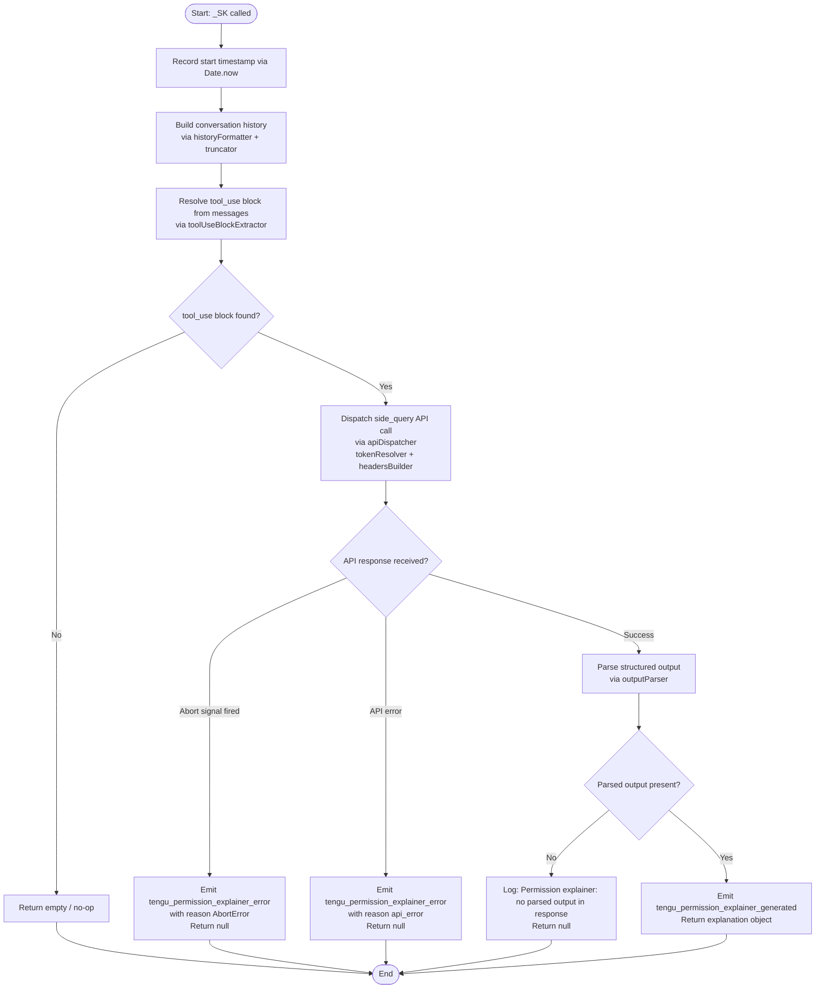

# `/explain_command`

> Analysis basis: CC v2.1.173 bundle.js (AST extraction + Claude interpretation)
> Minimum version: v2.1.173

---

## Overview

`/explain_command` is an internal `tool`-type command that generates a human-readable explanation of why a particular tool invocation requires the permissions it is requesting. It drives the "permission explainer" subsystem: given a pending `tool_use` action, it dispatches a side-query API call that produces structured reasoning, then returns that reasoning to the caller. The command is registered under the literal name `explain_command` with a role identifier of `permission_explainer`.

---

## Registration

| Field | Value |
|---|---|
| type | `tool` |
| name | `explain_command` |
| description | `null` |
| loc_byte | `14538269` |
| loc_byte_end | `14538305` |
| loc_line | `11373` |
| arbor_handler.name | `_SK` |
| arbor_handler.fqn | `claude-2.1.173::_SK` |
| arbor_handler.kind | `AsyncFunction` |
| arbor_handler.resolution_path | `direct` |
| arbor_handler.n_hits | `1` |

Analysis basis: CC v2.1.173 bundle.js:+14538269

---

## Input Branching

The handler has four clearly distinct execution paths (successful generation, abort, API error, and missing-output fallback), warranting a Mermaid flowchart.



---

## Behavioral Spec

### Handler Entry — `permissionExplainerHandler` (`_SK`)

```
async function permissionExplainerHandler(params):
    startTime = Date.now()                         // +14537988

    // Build a trimmed conversation history
    history = buildConversationHistory(params.messages)  // s35 @ +14538009
    // history: filters to last N assistant turns, truncates text blocks
    // Max assistant turns considered: 2 (literal +14537489)
    // Max chars per text block: 1000 (literal +14537533)

    // Extract the pending tool_use content blocks
    toolUseBlocks = extractToolUseBlocks(params.messages)  // t35 @ +14538027
    // Filters messages, reverses chronological order,
    // takes up to 3 blocks (literal +14537588),
    // truncates oversized text with "..." (literal +14537764)

    if toolUseBlocks is empty:
        return null

    // Resolve model and provider for the side query
    modelConfig = resolveModel(params)             // J9 @ +14538174
    // Selects appropriate model via model-name normalizer (Q9)
    // and provider resolution chain (Hl → rO)

    // Dispatch the API call
    response = await apiDispatcher(               // Xp @ +14538187
        mode="side_query",                        // literal +13733657
        messages=history + toolUseBlocks,
        toolName="permission_explainer",          // literal +14538327
        ...headersAndAuth
    )

    // Inspect response for structured output
    parsedOutput = outputParser(response)         // a35 @ +14538594

    if parsedOutput is null or missing:
        log("Permission explainer: no parsed output in response")  // literal +14539099
        return null

    // Emit success telemetry
    emit("tengu_permission_explainer_generated")  // +14538752

    return parsedOutput
```

Analysis basis: CC v2.1.173 bundle.js:+14537964

---

### Conversation History Builder — `buildConversationHistory` (`s35`)

```
function buildConversationHistory(messages):
    // Serialises message objects to a compact string format
    // Uses JSON serialiser (CH → JSON.stringify @ +188969)
    // Converts to String; truncates to 1000 chars per block (+14537533)
    // Filters to messages with role == "assistant" (+14537568)
    // Considers only the last 2 assistant turns (+14537489)
    return formattedHistory
```

Analysis basis: CC v2.1.173 bundle.js:+14537479

---

### Tool-Use Block Extractor — `extractToolUseBlocks` (`t35`)

```
function extractToolUseBlocks(messages):
    blocks = messages
        .filter(m => m has content blocks of type "tool_use")  // +14537545
        .reverse()                                              // +14537613
        .take(3)                                               // literal +14537588
    
    for each block in blocks:
        if block.type == "text":                               // literal +14537671
            block.text = truncateWithEllipsis(block.text)     // Du @ +14537756, "..." @ +14537764

    result = [...blocks]
    result.unshift(roleHeader)                                 // +14537772
    return result.join(separator)                             // +14537805
```

Analysis basis: CC v2.1.173 bundle.js:+14537545

---

### Model Resolution — `modelResolver` (`J9`)

```
function modelResolver(params):
    // Build full model-name list via modelListBuilder (Hl @ +2253530)
    // Hl internally calls:
    //   - providerSelector (OY, rU)
    //   - modelNormalizer (gA)
    //   - modelNameProcessor (rO)

    // rO pipeline:
    //   1. Escape special regex chars in model string (HW)
    //   2. Strip "anthropic." prefix if present          (+2250849)
    //   3. Resolve aliases: fable, opusplan, sonnet,
    //      haiku, opus, best, [1m], etc.                 (Q9 @ +2253566)
    //   4. Apply provider-specific suffix rules          (Xz4, hY, eG)

    // eG resolves subscription tier context:
    //   max, team, enterprise, enterprise_usage_based    (SDH, ilH, L_H)
    //   firstParty, mantle provider routing              (FP, Zj)

    return resolvedModelAndProvider
```

Analysis basis: CC v2.1.173 bundle.js:+2253530

---

### API Dispatcher — `apiDispatcher` (`Xp`)

```
async function apiDispatcher(options):
    // Sets context label "side_query" on the request (+13733657)
    // Builds auth headers via tokenResolver ($F @ +13733625):
    //   - Checks OAuth token (YH8, xcH.trustAccepted)
    //   - Builds User-Agent, X-Claude-Code-Session-Id,
    //     x-client-app, x-claude-code-agent-id headers
    //   - Refreshes gateway JWT if expired (mDH, Jw4)
    //   - Falls back to ANTHROPIC_API_KEY if OAuth absent

    // Computes conversation hash via rDA (KWK.createHash, sha256) +13733818
    // Applies prompt-cache control (1h cache marker)    +13734507

    // Sends streaming API request (inH @ +3224365):
    //   fetch("https://api.anthropic.com", ...)         +2547152
    //   AbortSignal.timeout enforced
    //   Stream watchdog active (tengu_byte_stream_idle_timeout_ms)

    // On success:
    //   emit tengu_api_success                          +13735236
    //   return parsed stream response

    // On abort:
    //   classify error as "AbortError"                  +14539422
    //   emit tengu_permission_explainer_error
    //   return null

    // On API error:
    //   classify error as "api_error"                   +14539493
    //   emit tengu_permission_explainer_error
    //   return null
```

Analysis basis: CC v2.1.173 bundle.js:+13733625

---

### Config / File Subsystem — `configFileReader` (`G7H`)

```
function configFileReader(path):
    // Guards: throws "Config accessed before allowed." if called too early
    //         (literal +3314443)
    // Reads file via q.readFileSync with encoding "utf-8" (+3314526)
    // Parses JSON via n6 → JSON.parse
    // Handles ENOENT gracefully (literal +3314673)
    // Creates backups directory ("backups") when needed (+3314011)
    // Copies files with timestamp suffix (Date.now @ +3315564)
    // Emits tengu_config_parse_error on parse failure  (+3315074)
```

Analysis basis: CC v2.1.173 bundle.js:+3314437

---

### File-Watch Subsystem — `fileWatcher` (`Zx4`)

```
function fileWatcher(path, options):
    // Starts U78.watchFile on path                     +3310695
    // On change: reads new content via bu (H.startsWith / H.slice)
    // Compares against cached value via PZ_
    // If changed: notifies via wF callback             +3310934
    // Registers cleanup handler via yZA.register       +63751
    // On dispose: calls U78.unwatchFile                +3311028
```

Analysis basis: CC v2.1.173 bundle.js:+3310690

---

## State & Side Effects

| Item | Detail |
|---|---|
| Telemetry — success | `tengu_permission_explainer_generated` (loc +14538752) |
| Telemetry — error | `tengu_permission_explainer_error` (loc +14538964) |
| Telemetry — API success | `tengu_api_success` (loc +13735236) |
| Telemetry — stream watchdog | `tengu_byte_stream_idle_timeout_ms` (loc +3226382), `tengu_byte_watchdog_fired_late` (loc +3227593) |
| Telemetry — config parse error | `tengu_config_parse_error` (loc +3315074) |
| Telemetry — lone surrogate | `tengu_lone_surrogate_sanitized` (loc +13734985) |
| Telemetry — auth loss prevention | `tengu_config_auth_loss_prevented` (loc +3309591) |
| Telemetry — prompt cache | `tengu_prompt_cache_1h_config` (loc +13680939) |
| Side query mode | Request tagged as `"side_query"` (loc +13733657); does not appear in main conversation history |
| Tool role | Registered role literal `"permission_explainer"` (loc +14538327) |
| Tool type matched | Operates on `"tool_use"` content blocks (loc +14538482) |
| API endpoint | `https://api.anthropic.com` (loc +2547152) |
| Prompt cache TTL | `"1h"` cache-control marker applied to context (loc +13734507) |
| Stream watchdog — idle timeout | 15 000 ms initial, 120 000 ms extended (loc +3226593, +3226611) |
| Stream watchdog — byte event | `"cli_byte_watchdog_fired"` string (loc +3227495) |
| Hook registration | `yZA.register` used by file-watcher teardown (loc +63751) |
| appState changes | None directly observed within depth-2 traversal |
| Sound | None observed |
| Config backup | Timestamped file copy created in `"backups"` subdirectory when config is rewritten (loc +3314011) |

---

## Version History

| Version | Change |
|---|---|
| v2.1.173 | Initial analysis |

---

## Common Mistakes

1. **Expecting a user-facing output string directly.** `/explain_command` is a `tool`-type command, not a `prompt`-type command. Its return value is a structured object consumed programmatically by the permission subsystem, not printed directly to the terminal.

2. **Invoking it without a pending `tool_use` block.** The handler returns `null` early when no `tool_use` content blocks are found in the message history. Callers must ensure a qualifying block is present in the conversation context before invoking the command.

3. **Assuming it uses the primary model.** The command dispatches a `side_query`-labelled request, which may select a lighter or differently configured model compared to the main REPL model, and its API call does not appear in the primary conversation thread.

4. **Ignoring the abort path.** Because the command runs an async API fetch, it can be terminated via `AbortSignal`. Callers that do not handle the `null` return on abort may propagate silent failures into the permission-display layer.

5. **Treating the `description: null` field as a bug.** The `null` description is intentional: this command is not surfaced in the slash-command autocomplete menu because it is an internal tool invoked by the permission subsystem, not by the user.

---

## Appendix — Identifier Mapping

> For bundle debugging only. Identifiers change across versions.

| Identifier | Role |
|---|---|
| `_SK` | Main handler (`permissionExplainerHandler`) — AsyncFunction |
| `CPA` | Internal call dispatcher reached from `_SK` |
| `b6` | Core config/session object reader |
| `o6` | Path/config utilities helper |
| `PZ_` | Config cache comparison helper |
| `G7H` | Config file reader (readFileSync, JSON parse, backup logic) |
| `n6` | JSON parse wrapper |
| `bu` | String prefix/slice utility (startsWith / slice) |
| `N8` | Error-code classifier |
| `C_9` | Directory scanner (readdirStringSync, path join/dirname) |
| `N` | Log-level dispatcher (debug/error routing) |
| `c` | General-purpose utility / context accessor |
| `GZ_` | Backup path builder (join + A_) |
| `D` | Background process / daemon session manager |
| `Zx4` | File watcher (watchFile / unwatchFile) |
| `wF` | File-change callback |
| `y9` | Cleanup/hook registration wrapper |
| `s35` | Conversation history builder |
| `CH` | JSON serialiser wrapper |
| `t35` | Tool-use block extractor / formatter |
| `H` | Generic container / random/timeout helpers |
| `A` | Array utilities (toLowerCase, reverse) |
| `L` | Connection/stream lifecycle |
| `f` | Promise tracking set (add/delete/finally) |
| `Du` | String truncation / surrogate-pair sanitiser |
| `J9` | Model resolver entry point |
| `Hl` | Full model-list builder |
| `OY` | Provider selector (first step) |
| `rU` | Provider selector (second step) |
| `rO` | Model-name processor / alias resolver |
| `HW` | Regex-escape helper |
| `M` | MCP server registry / config accessor |
| `K` | Formatting/padding utility |
| `J_8` | Object.entries iterator helper |
| `clH` | Character-class inclusion checker |
| `sZ1` | String index searcher |
| `Jz4` | Model prefix inclusion checker |
| `tc` | Known-model-name list checker |
| `Q9` | Model-alias resolver (fable, sonnet, haiku, opus, best, etc.) |
| `Xz4` | Provider-context modifier |
| `hY` | Subscription-tier model selector |
| `eG` | Provider/tier resolution coordinator |
| `TA` | Provider context builder (Uw, dC, W9) |
| `L_H` | Max-plan tier handler |
| `SDH` | Team-plan tier handler |
| `ilH` | Enterprise tier handler |
| `FP` | First-party provider handler |
| `aD6` | String replacement helper |
| `Zj` | Mantle provider handler |
| `v7` | Generic provider builder |
| `c_` | Content-type / provider constant resolver |
| `NL` | Node-list / structural helper |
| `kE` | Model-with-provider combiner |
| `Xp` | API dispatcher (side_query) |
| `$F` | Full API request builder / auth header assembler |
| `QM` | AsyncLocalStorage `getStore` accessor (session context) |
| `zE_` | URL/path splitter |
| `O9` | Context-type checker (CDH) |
| `ca` | Request-context resolver (rA8) |
| `rA8` | Secondary AsyncLocalStorage `getStore` accessor |
| `y6` | BG-mode flag accessor |
| `BG` | Background flag constant |
| `WY_` | Header value encoder (replace + encodeURIComponent) |
| `f6` | String converter |
| `Nz` | Token refresher orchestrator (E78 → RE_) |
| `E78` | OAuth refresh logic |
| `KV1` | Boolean flag builder |
| `Uw` | HTTP client / request executor |
| `O7` | Base request builder |
| `vj` | Streaming request wrapper |
| `B4` | Content-type resolver |
| `NP` | Request option assembler |
| `$O` | Auth-strategy selector (ANTHROPIC_API_KEY, OAuth, apiKeyHelper) |
| `D26` | VrH-based header builder |
| `VrH` | Vertex/foundry credential injector |
| `QO` | Request-options finaliser |
| `QC4` | Request executor with timing (PrH) |
| `PrH` | Timed HTTP send wrapper |
| `b_` | Bedrock credential accessor |
| `YH8` | OAuth trust / proxyAuthHelper executor |
| `ZNH` | OAuth token storage reader |
| `C41` | OAuth token structure validator |
| `def` | Token-expiry parser (parseInt + Number.isNaN) |
| `sy` | Cached-token accessor |
| `Q2` | Credential store reader (gvH) |
| `aC4` | Full API call handler (streaming, headers, watchdog) |
| `v89` | wL-based stream helper |
| `UzH` | UUID-keyed request tracker |
| `tm1` | b6-based sub-request spawner |
| `DE_` | b6-based deferred request helper |
| `sC4` | Header-filter / opaque-header masker |
| `N89` | f6-based response header extractor |
| `V89` | OK/f6/Y6 response validator |
| `iC4` | Retry-budget / backoff calculator |
| `rC4` | Byte-stream watchdog / reader loop |
| `iO` | Provider-name normaliser |
| `YD6` | c_/f6 provider constant mapper |
| `xM4` | startsWith-based provider prefix checker |
| `wD6` | toLowerCase/Object.values model-string matcher |
| `DB` | Bedrock region resolver (_Rf, vvH) |
| `vvH` | Region/endpoint constants holder |
| `xw` | Proxy/network resolver |
| `OK` | String coercion wrapper |
| `gc` | URL host parser |
| `gdH` | Proxy credential accessor (UC, hB) |
| `b41` | Proxy bypass rule evaluator |
| `zM_` | IP/hostname proxy-exempt checker |
| `DM_` | Domain-match utility |
| `oC4` | Streaming-fallback request path (V89, E89) |
| `E89` | v89/N89 stream envelope builder |
| `dC4` | Full HTTP dispatch coordinator |
| `M78` | AW/J9/j1/vvH response assembler |
| `vFH` | Response-format flag |
| `d6H` | Header-prefix finder (ieK.find, --bare) |
| `S1` | OAuth endpoint validator (staging/prod) |
| `mDH` | Gateway JWT refresh executor |
| `Po8` | Refresh pre-check |
| `Jw4` | Token POST request (Kj.post, refresh_token) |
| `fQ6` | Refresh scheduling helper |
| `Xo8` | Timestamp accessor (Date.now) |
| `_26` | Header case-normaliser (Object.entries + toLowerCase) |
| `djH` | SDK error/warn logger (console.error) |
| `S` | Supervisor / file-write coordinator |
| `WrK` | File realpath/stat resolver |
| `v3` | Version accessor |
| `SH` | Config load/save orchestrator (JA, f6, Rq, MRf) |
| `HG5` | sk8-based helper |
| `w` | Write/update stream manager (supervisor) |
| `k` | Warning/notification emitter |
| `y` | Daemon sweep / background-worker manager |
| `l` | Background-worker lifecycle (spawn, retire, respawn) |
| `R` | Foreground-yield writer (w.write) |
| `Op6` | Free-memory poller |
| `TJK` | Grace-clock bridge (Y6) |
| `i06` | Settings-file reader (GW.readFile, JSON parse, filter) |
| `g8` | General underscore utility |
| `d` | Worker-pool accessor (yx6, taq) |
| `yF8` | Y6-based background helper |
| `Y6` | Telemetry event emitter / metrics recorder |
| `n` | Voice recorder / subagent process manager |
| `V` | Tool list resolver |
| `a2` | $O-based auth helper |
| `HjH` | Provider/credential injector (inH + kH + bH) |
| `inH` | WIF credential resolver + fetch dispatcher |
| `kH` | Feature-ok telemetry emitter |
| `bH` | Feature-bad telemetry emitter |
| `uP4` | String inclusion checker for grant errors |
| `E` | Token getter / rate-limit adjuster |
| `W` | Token exchange flow (N76, aS, UN) |
| `X` | Connection manager (M, q.setTimeout) |
| `tIH` | j1/iO/VI tool-input normaliser |
| `j1` | Tool-name formatter (J_8, DJ) |
| `DJ` | Model-ID lower/include/replace processor |
| `eo8` | Encoding override helper |
| `R3` | Header replacement utility |
| `VI` | c_-based content injector |
| `G` | Main REPL UI / key-event dispatcher |
| `I` | REPL state holder |
| `Y` | Forced-shutdown / process-exit handler |
| `HX` | Exit callback |
| `z` | Daemon controller (kH, bH, wS, CU) |
| `T` | Provider connection (pV6, N76) |
| `td` | XY-based text-display helper |
| `XY` | Terminal output primitive |
| `j` | Process kill orchestrator (A.values, S.kill) |
| `ONK` | Vim-mode motion dispatcher (c45…r45) |
| `c45` | Vim setOffset + zNK motion handler |
| `l45` | Vim numeric-count motion handler |
| `n45` | Vim setOffset + setLastFind handler |
| `i45` | Vim setOffset + vUH handler |
| `r45` | Vim DXA find handler |
| `cvK` | Vim change operator (Zd8, Ed8, dvK) |
| `Zd8` | Vim range calculator (min/max, BvK) |
| `Ed8` | Vim end-of-line detector |
| `dvK` | Vim change executor (setText, setOffset, setRegister) |
| `rvK` | Vim replace operator |
| `ivK` | Vim replace text setter |
| `svK` | Vim case-toggle operator |
| `avK` | Vim toUpperCase/toLowerCase applier |
| `b` | Editor register / CLAUDE-dir file manager |
| `$SH` | CLAUDE dir file reader |
| `Ua` | zLH-based auth helper |
| `QsH` | CLAUDE dir file writer (iw8.mkdir, iw8.writeFile) |
| `DW9` | File-list filter (gsH) |
| `P` | Binary stream reader (Buffer.concat, subarray) |
| `OgK` | Terminal layout/padding builder |
| `W1H` | g6H/$SH/QsH file-sync orchestrator |
| `evK` | Vim paste operator (getRegister, _NK) |
| `_NK` | Vim paste executor (setText, setOffset) |
| `FvK` | Vim join operator (V4, K.slice/split) |
| `V4` | indexOf utility |
| `O` | m8-based OS helper |
| `hUH` | Vim slice helper |
| `gvK` | Vim indent operator (OXA, q.setText) |
| `OXA` | Vim indent prefix checker |
| `JXA` | Vim history-search motion dispatcher (b45…d45) |
| `b45` | Vim search setOffset + LNK |
| `x45` | Vim search numeric-count handler |
| `u45` | Vim search LXA + MNK handler |
| `m45` | Vim search count + MNK handler |
| `p45` | Vim search jd8 handler |
| `U45` | Vim search DXA + Jd8 handler |
| `B45` | Vim search setLastFind handler |
| `F45` | Vim search vUH + setOffset handler |
| `g45` | Vim search NUH + qNK handler |
| `Q45` | Vim search Pd8 handler |
| `d45` | Vim search Td8 handler |
| `HA5` | Command completion finder (H.find, A.find) |
| `rDA` | Conversation hash builder (KWK.createHash, sha256, hex) |
| `aA8` | Session-context assembler (OK, c_, rA8, QM, XY_, N) |
| `XY_` | Session-ID formatter |
| `n78` | c_-based content helper |
| `YCH` | Main prompt assembler (f6, c_, TA, oo8, Y6, ao8) |
| `oo8` | Prompt section builder A |
| `ao8` | Prompt section builder B |
| `sv` | ZE_/sIH system-prompt serialiser |
| `ZE_` | c_-based system-prompt content resolver |
| `sIH` | f6/ew_ system-prompt formatter |
| `ew_` | tw_-based content-type include checker |
| `uWK` | Unknown — reached from Xp; role unclear |
| `j78` | Ba/j1/A.includes tool-name filter |
| `e2` | H.map message transformer |
| `n2H` | Lq/Array.isArray/N/CH/QB/e4/y6 message normaliser |
| `QB` | b6/b_9.randomBytes/E8/N random-ID generator |
| `E8` | Config session initialiser (Q78, nG, G7H, urH) |
| `e4` | Uw/b6 request envelope builder |
| `ANA` | Array pop/push message-array normaliser (Nd6) |
| `Nd6` | evA/u8f.test tool-block validator |
| `Ny` | structuredClone deep-copy wrapper |
| `Id6` | A.pop/Array.isArray/_NA message-array normaliser |
| `_NA` | HNA/H.replace message-field sanitiser |
| `pzH` | Unknown — reached from Xp near performance.now |
| `H1` | q56-based initialiser |
| `q56` | Low-level bootstrap constant |
| `KG6` | Prompt-cache orchestrator (aY9, naH, qG6) |
| `aY9` | Cache-entry builder (ot4, SH) |
| `ot4` | Cache-hit checker (iY9.has, rK, cO8.has) |
| `naH` | aZ/q56 cache-key builder |
| `aZ` | q56-based key formatter |
| `qG6` | naH/QO8 cache-record updater |
| `QO8` | lY9.createHash cache-hash builder |
| `Pn` | Tool-permission resolver (rt4, su, SH) |
| `rt4` | Agent-prefix parser (agent:builtin:, agent:custom:, agent:) |
| `dO8` | yj_-based path helper |
| `yj_` | indexOf/slice path-component splitter |
| `su` | startsWith-based prefix validator |
| `R56` | Unknown — reached from Xp at tail |
| `s9` | Tool-name classifier (Object.hasOwn, aZ, H.startsWith, $6, mcp__) |
| `$6` | q56-based tool-type constant |
| `t6` | c/A6-based context accessor |
| `A6` | q56-based application-level constant |
| `EH` | String-based error wrapper |

---

Note: index built via Arbor fallback; some signals (telemetry, literals) may be missing — see arbor-fallback.js.