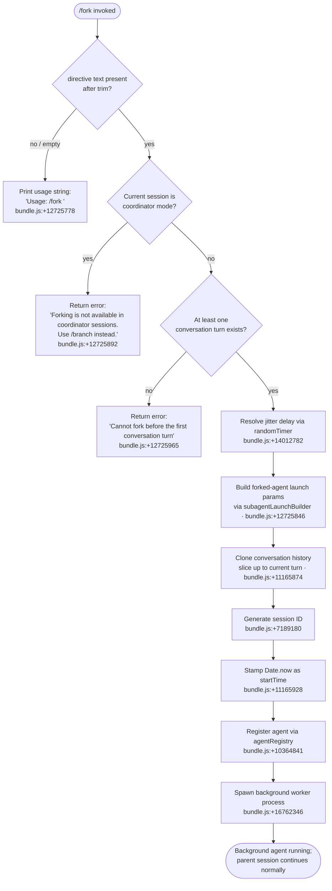

# `/fork`

> Analysis basis: CC v2.1.173 bundle.js (AST extraction + Claude interpretation)
> Minimum version: v2.1.173

---

## Overview

`/fork` spawns a background agent that inherits the full current conversation context, then sets the forked agent off to execute a user-supplied directive independently. It resolves a fresh session identifier, clones the conversation history into the new agent's initial message sequence, and launches the agent as an asynchronous background worker without blocking the parent session.

---

## Registration

| Field | Value |
|---|---|
| type | `local-jsx` |
| name | `fork` |
| description | Spawn a background agent that inherits the full conversation |
| argumentHint | `<directive>` |
| module_id | `c5K` |
| load_inline | `true` |
| loc_byte | `12726195` |
| loc_byte_end | `12726398` |
| loc_line | `8999` |
| arbor_handler.name | `Gc7` |
| arbor_handler.fqn | `claude-2.1.173::Gc7` |
| arbor_handler.kind | `AsyncFunction` |
| arbor_handler.resolution_path | `module_id` |
| arbor_handler.n_hits | `0` |

Analysis basis: CC v2.1.173 bundle.js:+12726195

---

## Input Branching

Four distinct execution paths exist: missing directive (usage hint), coordinator-session guard, pre-first-turn guard, and the normal fork path.



---

## Behavioral Spec

### Handler Entry — directive validation and guard checks

```
async function forkHandler(userInput, sessionContext):
    directive = userInput.trim()                    // bundle.js:+12725754
    if directive is empty:
        return usageHint("Usage: /fork <directive>")  // bundle.js:+12725778

    systemRole = "system"                           // bundle.js:+12725818

    if sessionContext.isCoordinatorMode():
        return error("Forking is not available in coordinator sessions. Use /branch instead.")
        // bundle.js:+12725892

    if conversationHistory has no turns:
        return error("Cannot fork before the first conversation turn")
        // bundle.js:+12725965
```

Analysis basis: CC v2.1.173 bundle.js:+12725754

### Jitter Delay

A small random delay (based on `Math.random`, seeded value 2) is applied before spawning to stagger concurrent fork launches. This uses `setTimeout` internally.

```
function applyJitterDelay():
    delay = Math.random() * JITTER_FACTOR    // JITTER_FACTOR ~ 2  bundle.js:+14012780
    await setTimeout(delay)                   // bundle.js:+14012819
```

Analysis basis: CC v2.1.173 bundle.js:+14012782

### Subagent Launch Parameter Assembly (`subagentLaunchBuilder` / `nfA`)

This is the primary build step. It assembles the full parameter object that will be passed to the background agent process.

```
async function buildForkParams(directive, sessionContext):
    // Inherit working directory
    params.workingDirectory = sessionContext.getWorkingDirectory()
    // bundle.js:+10672539

    // Inherit tool permissions from current session
    params.allowedTools    = sessionContext.allowedTools     // bundle.js:+10672594
    params.disallowedTools = sessionContext.disallowedTools  // bundle.js:+10672649
    params.avoidPrompts    = sessionContext.avoidPrompts     // bundle.js:+10672710
    params.permissionMode  = sessionContext.permissionMode   // bundle.js:+10672812
    // NOTE: bypassPermissions is explicitly propagated  bundle.js:+10672843

    // Inherit model / effort / context settings
    params.session           = sessionContext.session        // bundle.js:+10673142
    params.effort            = sessionContext.effort         // bundle.js:+10673167
    params.model             = sessionContext.model          // bundle.js:+10673180
    params.maxThinkingTokens = sessionContext.maxThinkingTokens // bundle.js:+10673192
    params.flagSettings      = sessionContext.flagSettings   // bundle.js:+10673218

    // Build system prompt using existing system-prompt builder (GZ)
    params.systemPrompt = buildSystemPrompt(sessionContext)  // bundle.js:+11167235

    // Clone conversation history up to last N messages
    conversationSlice = history.slice(0, HISTORY_DEPTH)      // bundle.js:+11165874
    // HISTORY_DEPTH constant: 50 messages back  bundle.js:+11165871

    // Sanitize conversation for subagent consumption
    params.initialMessages = sanitizeHistoryForSubagent(conversationSlice)
    // bundle.js:+11165821

    // Assign fork type and mode labels
    params.type = "subagent"                  // bundle.js:+11166411
    params.spawnMode = "spawn"                // bundle.js:+11166476
    params.forkMode = "fork"                  // bundle.js:+11165686

    // Session ID generation: 8 random hex bytes
    params.sessionId = generateSessionId()    // bundle.js:+7189180  (63 chars, 8 bytes hex)

    // Record fork start time
    params.startTime = Date.now()             // bundle.js:+11165928

    return params
```

Analysis basis: CC v2.1.173 bundle.js:+11165480

### Session-ID Generation (`HR`)

The session ID is produced by generating 8 cryptographically random bytes and encoding them as a 16-character hex string, potentially after a regex guard.

```
function generateSessionId():
    raw  = crypto.randomBytes(8)            // bundle.js:+7189180
    hex  = raw.toString("hex")              // bundle.js:+7189208  (8 bytes → 16 hex chars)
    // Regex test guard                     // bundle.js:+7189124
    id   = hex.replace(matchPattern, "")    // bundle.js:+7189138
    return id
```

Constants: random byte count = 8 (bundle.js:+7189196), encoding = `"hex"` (bundle.js:+7189208).

Analysis basis: CC v2.1.173 bundle.js:+7189124

### History Sanitization for Subagent (`US8`)

Converts the parent conversation into a form the forked agent can consume. The slice is clipped to a maximum of 50 messages (index 50, bundle.js:+11165871) with a minimum trim point of 49 (bundle.js:+11165884).

```
function sanitizeHistoryForSubagent(messages):
    result = []
    for each message in messages:
        if message.role == "assistant":
            result.push(filterAssistantMessage(message))  // bundle.js:+9929864
        if message has tool_use blocks:
            result.push(adaptToolUseBlocks(message))       // bundle.js:+9929194
        if message has tool_result blocks:
            result.push(adaptToolResultBlocks(message))    // bundle.js:+9929353
            // error/ok variants handled  bundle.js:+9929398, +9929469
    return result
```

Analysis basis: CC v2.1.173 bundle.js:+9929776

### Coordinator-Mode Guard Detail

The literal string `"subagent_fork_coordinator_mode"` is logged/emitted when the guard fires (bundle.js:+11165513), alongside `"subagent_launch"` (bundle.js:+11165495) for a normal fork. The guard `"subagent_fork_prompt_missing"` fires when the directive is absent (bundle.js:+11165637).

Analysis basis: CC v2.1.173 bundle.js:+11165495

### System Prompt Construction (`GZ` / `buildSystemPrompt`)

The forked agent receives a fully assembled system prompt derived from the parent's system prompt via `H.getSystemPrompt()` (bundle.js:+9821451). Major prompt sections observable from literals include:

- Task continuity block (`"task_continuity"` — bundle.js:+13652188)
- Fable identity block (`"fable_identity"` — bundle.js:+13652221)
- Environment info static section (`"env_info_static"` — bundle.js:+13652473)
- Environment info simplified section (`"env_info_simple"` — bundle.js:+13652510)
- Language section (`"language"` — bundle.js:+13652548)
- Output style section (`"output_style"` — bundle.js:+13652583)
- Background session marker (`"bg-session"` — bundle.js:+13652613)
- Scratchpad section (`"scratchpad"` — bundle.js:+13652640)
- Context management section (`"context_management"` — bundle.js:+13652667)
- Brief mode section (`"brief"` — bundle.js:+13652706, guarded by `FDA.isBriefEnabled`)
- Reproduce/verify workflow section (`"reproduce_verify_workflow"` — bundle.js:+13652760)
- Agent memory sections via `AW6` (team memory, user memory — bundle.js:+3419556 onwards)
- SDK block (`":sdk"` — bundle.js:+13652340)

The bg-session type is set to `"bg"` with spawn type `"worktree"` or `"tmp"` depending on config (bundle.js:+13659053, +13659388, +13660480).

Analysis basis: CC v2.1.173 bundle.js:+13651842

### Background Agent Registration and Spawn (`e96` → `QuH` → daemon process)

```
async function registerAndSpawnAgent(params):
    // Create session working directory symlink
    await fs.mkdir(sessionDir, {recursive: true})   // bundle.js:+13507202
    await fs.symlink(target, sessionDir)             // bundle.js:+13509683

    // Register agent in global registry
    registry.register(agentId, params)               // bundle.js:+10364841
    agentState = "pending"                           // bundle.js:+13510705

    // Spawn child process
    childProcess = Hd.spawn(...)                     // bundle.js:+16762346
    agentState = "running"                           // bundle.js:+10364511

    // Track in active-set
    activeSet.add(agentId)                           // bundle.js:+13507309

    // On completion: remove from active-set
    childProcess.finally(() => activeSet.delete(agentId))  // bundle.js:+13507334
```

The agent type reported to the registry is `"local_agent"` (bundle.js:+10364466) with purpose `"general-purpose"` (bundle.js:+10364649).

Analysis basis: CC v2.1.173 bundle.js:+10364419

### Stall / Watchdog (`l66` sub-path)

A watchdog timer monitors the forked agent. If no data is received within the stall window (timeout = 600 000 ms at bundle.js:+7301745, polling every 10 ms at bundle.js:+7301740), the agent is marked stalled and the event `"watchdog_stall"` (bundle.js:+7302231) is logged. On expiry the stall telemetry event `tengu_async_agent_stall_timeout` fires and the agent process receives a termination signal.

Analysis basis: CC v2.1.173 bundle.js:+7301638

---

## State & Side Effects

| Item | Detail |
|---|---|
| Telemetry — subagent launch | `"subagent_launch"` (bundle.js:+11165495) emitted on successful fork start |
| Telemetry — coordinator guard | `"subagent_fork_coordinator_mode"` (bundle.js:+11165513) emitted when fork rejected |
| Telemetry — missing prompt | `"subagent_fork_prompt_missing"` (bundle.js:+11165637) emitted when directive absent |
| Telemetry — stall timeout | `tengu_async_agent_stall_timeout` (bundle.js:+7302636) |
| Telemetry — agent complete | `"subagent_complete"` (bundle.js:+7302873) |
| Telemetry — agent stall timeout literal | `"subagent_stall_timeout"` (bundle.js:+7302893) |
| Telemetry — agent tool completed | `tengu_agent_tool_completed` (bundle.js:+7298680) |
| Telemetry — agent tool terminated | `tengu_agent_tool_terminated` (bundle.js:+7305145) |
| Telemetry — forked agent default turns exceeded | `tengu_forked_agent_default_turns_exceeded` (bundle.js:+10671308) |
| Telemetry — subagent completed (hook event) | `"subagent_completed"` (bundle.js:+7298961) |
| Telemetry — subagent end | `"subagent_end"` (bundle.js:+7299261) |
| Telemetry — auto mode decision | `tengu_auto_mode_decision` (bundle.js:+7300325) |
| Telemetry — bg dispatch sigkill escalate | `tengu_bg_dispatch_sigkill_escalate` (bundle.js:+16760584) |
| Telemetry — bg spare claim | `tengu_bg_spare_claim` (bundle.js:+16762017) |
| Telemetry — bg session created | `"daemon_bg_session_create"` literal (bundle.js:+16760900) |
| Telemetry — subagent exit | `"subagent_exit"` literal (bundle.js:+10512814) |
| Filesystem | Creates session symlink under `.claude` directory; writes `.meta.json` and `.jsonl` transcript files (bundle.js:+13418534, +13418690) |
| agentState changes | `pending` → `running` → `completed` / `failed` (bundle.js:+13510705, +10364511, +10358730, +10364076) |
| Process spawn | `Hd.spawn` forks a new OS child process (bundle.js:+16762346); tracked in active-set via `pPK` (bundle.js:+13507309) |
| Watchdog timer | `setTimeout` 600 000 ms watchdog (bundle.js:+7301745); cleared via `clearTimeout` on completion (bundle.js:+7302297) |
| Hook registration | `SubagentStart` hook fires on agent launch (bundle.js:+13538693); `SubagentStop` on termination (bundle.js:+13580507) |
| Sound | <!-- TODO: not found in depth-2 traversal; needs --depth 4 --> |

---

## Version History

| Version | Change |
|---|---|
| v2.1.173 | Initial analysis |

---

## Common Mistakes

1. **Invoking `/fork` without a directive**: The command requires a non-empty `<directive>` argument after trimming. An empty invocation prints the usage string and does nothing — no agent is spawned.

2. **Using `/fork` inside a coordinator session**: Coordinator sessions explicitly block `/fork`; use `/branch` instead. The error message references this directly (bundle.js:+12725892).

3. **Forking before any conversation turn exists**: The command guards against forking with no prior conversation history. At least one complete turn must have occurred before the fork is allowed (bundle.js:+12725965).

4. **Expecting synchronous output from the forked agent**: The fork spawns a background worker process. The parent session continues immediately; the forked agent's output is delivered asynchronously via the agent registry and watchdog infrastructure, not inline in the current session.

5. **Assuming the forked agent inherits all session permissions automatically**: While most settings are propagated (allowed/disallowed tools, permission mode, model, effort), the `bypassPermissions` flag (bundle.js:+10672843) and `permissionMode` (bundle.js:+10672812) are explicitly copied, so they must be set correctly in the parent session before forking.

---

## Appendix — Identifier Mapping

> For bundle debugging only. Identifiers change across versions.

| Identifier | Role |
|---|---|
| `Gc7` | Main `/fork` handler (AsyncFunction); entry point resolved via module_id |
| `nfA` | Subagent launch parameter builder; assembles full fork params object |
| `AV7` | App state reader for fork context (reads conversation history, system prompt) |
| `GZ` | System prompt assembly function for forked agents |
| `HR` | Session-ID generator (random bytes → hex string) |
| `k_` | Conversation history accessor (`findLast`, working_directory extraction) |
| `qb8` | Working-directory extractor helper |
| `Kb8` | Tool permission extractor helper |
| `Nb` | Permission-mode resolver |
| `vW` | Sub-agent path resolver / working directory helper |
| `bH` | Config helper (reads app configuration values) |
| `A6` | Config value accessor |
| `q56` | Config primitive reader |
| `sp` | System prompt builder (main thread) |
| `US8` | History sanitizer for subagent consumption |
| `PO7` | Assistant-message filter for history sanitization |
| `WO7` | Tool-use message filter |
| `XO7` | Tool-result message filter |
| `Lyq` | Tool content normaliser |
| `GO7` | Error-result filter |
| `Clq` | Directive trim/validation helper |
| `e96` | Agent registration and spawn orchestrator |
| `QuH` | Session filesystem setup (mkdir, symlink, unlink) |
| `vg8` | Active-agent set manager (add/delete) |
| `jDA` | Session directory creator |
| `J$` | Session path joiner |
| `d16` | Transcript log initialiser (opens log file) |
| `gW` | Watchdog timestamp writer |
| `mV` | Sub-agent state path resolver |
| `lb` | AbortController / signal factory for agent process |
| `DK` | Listener count limit setter |
| `ET9` | Signal binding helper |
| `QM` | AsyncLocalStorage store reader |
| `Al` | AsyncLocalStorage runner |
| `ql` | AsyncLocalStorage store getter |
| `HT` | VY_ store getter |
| `l66` | Background agent supervisor / watchdog loop |
| `S` | Agent output stream writer |
| `WrK` | Filesystem realpath/stat helper |
| `b` | Scheduled-task firing helper |
| `w` | Agent IPC/stdio writer |
| `R` | Agent yield / transient write helper |
| `d66` | Agent state update helper |
| `k1A` | Agent timestamp updater |
| `xz` | Flush-and-delete helper for agent session store |
| `y1A` | Agent state getter with store context |
| `Me` | Agent state update + speculation abort |
| `wh` | J$H (session handle) getter |
| `D96` | Agent state delete + cleanup |
| `jCH` | Agent message filter helper |
| `Gf` | Message type filter (text block filter) |
| `XCH` | Agent token-cache budget resolver |
| `BK` | Recursive cache-budget walker |
| `$N6` | Agent query / turn executor |
| `GT` | Main agent query loop |
| `U8` | UUID generator (randomUUID wrapper) |
| `xIq` | Agent state updater (update + notify) |
| `OWH` | Observable-input watcher |
| `qmH` | Tool-call observer helper |
| `zN6` | Agent state MJ7 update helper |
| `FMH` | ON6 state writer |
| `MW8` | FMH + U66 combined updater |
| `U66` | Date-stamped state update |
| `$t9` | Agent progress token reader |
| `fW8` | Agent completed-output assembler |
| `UV` | Last-assistant-message finder |
| `mf` | Hook event emitter (event.name, event.timestamp, event.sequence) |
| `P5H` | Tool classification helper |
| `ASL` | Output safety classifier |
| `OW8` | Agent output post-processor |
| `kH` | Config writer (c + A6) |
| `$W8` | Subagent output wrapper / hand-off renderer |
| `Qs9` | Quick safety check path |
| `fN6` | Full safety classifier pipeline |
| `Y9H` | Agent state Me-update handler |
| `pv6` | U28 deletion cleanup |
| `jR` | Main REPL agent loop (large async function governing one full agent turn) |
| `Y6` | Telemetry/flag event emitter |
| `gMH` | Y6 wrapper (quartz-heron telemetry entry) |
| `mT9` | Kx_ (agent-store) set helper |
| `GX8` | Tracing span setup for subagent spawn |
| `cg9` | rU_ (span-cache) get/set |
| `dg9` | Math.abs span duration helper |
| `zGL` | nU_ (span-list) push helper |
| `g5H` | Config load/dump (cb helper) |
| `cb` | Raw config object |
| `jH` | MCP tool-list-changed handler |
| `DH` | Full agent session driver (spawn, hooks, MCP, etc.) |
| `j8` | MCP debug log push |
| `w8` | SSE/websocket message parser |
| `o_` | Retry helper for tool-list refresh |
| `mu` | rK (remote-key) helper |
| `$` | ZwK stream closer |
| `$e` | Tool permission resolution / filter pipeline |
| `Md_` | Tool filter (permission sets: LPH, xC_, vT6) |
| `k3` | Tool input formatter (vuf, TE, Nuf) |
| `XT` | Tool output renderer (wc, OK, f6, Y6) |
| `y` | Background-session lifecycle clock |
| `$V` | Tool name splitter/joiner |
| `Ww6` | Nc (normalise-command) wrapper |
| `T` | pV6 / N76 process-pool helper |
| `j` | A.values + S.kill process-list helper |
| `G` | Key-event handler for REPL input |
| `z2` | f6 + Ao8 JSX render helper |
| `xf` | Tool permission identity check |
| `Lt9` | Y6 wrapper for shale-finch telemetry |
| `XH` | Agent list filter/splice |
| `X$` | y6 + $4 agent context helper |
| `JH` | MCP session connection manager |
| `H$7` | System-prompt + ER6 fetch |
| `ER6` | M_5 system-prompt segment builder |
| `ZR6` | Full agent run setup (XL, P2, Cg8.randomUUID) |
| `XL` | Subagent start event builder |
| `P2` | Main subagent execution engine |
| `BH` | Agent transcript array |
| `s1` | Turn metadata factory (DKA.randomUUID, uuid, now) |
| `n` | Voice/agent recording driver |
| `l` | Scheduled-task loop driver |
| `d8` | AbortController with timeout |
| `fFH` | Language locale checker |
| `nPA` | Node process attachment helper |
| `EF8` | WebSocket voice-stream driver |
| `PH` | Promise.race I/O helper |
| `NH` | Object.keys config enumerator |
| `JA` | Error/String normaliser |
| `GD` | Permission-array includes helper |
| `x8` | oa6 + VB config accessor |
| `V7H` | Du4 (disallowed-set) membership check |
| `aa9` | Object.keys tool-listing helper |
| `vf` | BG (config background flag) reader |
| `_$7` | r96 + M9 + find: model-string parser |
| `r96` | lJ model finder |
| `M9` | H.indexOf + H.slice model-string slicer |
| `kuH` | lJ + ReferenceError + map + jL + localeCompare: sorted tool lister |
| `lJ` | find + dXK: tool definition looker-up |
| `jL` | Tool sort comparator |
| `u6` | Agent output queue (map, write) |
| `m6` | O.set + n + R: agent output item factory |
| `a8` | Agent output set (has/delete/add) |
| `v6` | qT + w + fH + AH: agent update notifier |
| `C_` | D6 + sd8: agent capability checker |
| `o8` | Command registry (getPromptForCommand, filter) |
| `a3` | Command registry backing store |
| `Y8` | Command list (c, AA, NfH, fH, AH, ru, PTH, FP) |
| `qH` | HH + KH + E + I: command match helper |
| `aH` | TH + SH: command list array |
| `g6` | Timeout-abort wrapper (clearTimeout + setTimeout + v_.abort) |
| `v_` | Full agent session runner (realpath, config, spawn, MCP) |
| `t37` | Agent config builder (V7H, GD, uzH, $f, UK, vq, Wk, N, Promise.all, …) |
| `uzH` | Strict-mode check helper |
| `$f` | UK + O7 flag-settings merger |
| `UK` | f6 + VQ6: flag builder |
| `zg` | M2 + GD + YRH: enterprise config merger |
| `QaH` | TXH + lDH: agent settings applier |
| `Og` | Object.entries tool-object builder |
| `Y` | Cleanup: process.exit + z.abort |
| `K$H` | yN + It + cuH + lqA: model/tool permission assembler |
| `yN` | Tb_ + N + c_ + wL: model normaliser |
| `It` | Model lowercase + GfL include checker |
| `cuH` | H.some + xf: tool-use permission checker |
| `lqA` | Full tool-permission set builder (add/delete/filter/sort across O, K, E, f, w, Y, X, P, M1 sets) |
| `p28` | b6 + j1 + Object.entries + A.includes: project-config reader |
| `b6` | o6 + nG + PZ_ + G7H + Date.now + Zx4: raw config file reader |
| `AS8` | lb + getAppState + g5H + DPH + jF9 + setAppState + M + Object.assign + Ab8 + HR + aBq.randomUUID: full agent state initialiser |
| `KS8` | JC + xf + vf + yJ + Db6 + getMcp + oi + hD + P1H + Qd + kgq + _W + LX + HC_ + TxH + qW + L.map: MCP tool-list assembler |
| `JC` | Tool filter predicate |
| `Db6` | JC + pN + filter + qg8: MCP tool deduplicator |
| `oi` | qg8 + add + filter + has + N: bundled-tool set builder |
| `P1H` | filter + some + dXK: tool availability checker |
| `Qd` | Tool set membership helper |
| `kgq` | ub8 get/set + hmH.has + q.add + filter + q.has: deferred-tool pool cache |
| `_W` | b89 + PE_ + x89: tool-name formatter |
| `LX` | BG background flag reader |
| `HC_` | Full tool context assembler (wT6, b5H, E9L, f8, pq, eR_, etc.) |
| `TxH` | b6 + Date.now + Math.pow + Math.max: exponential-backoff timer |
| `qW` | Q9 + HW + j1 + Gz4.has: command-prefix matcher |
| `ME` | Agent metadata formatter |
| `FG` | BG (foreground-flag) reader |
| `x6H` | Agent context-key helper |
| `J` | D: process map accessor |
| `__A` | $4: fork-context-ref resolver (bundle.js:+13435523) |
| `$4` | y9: fork context base object |
| `UqH` | $4 + VmH: fork context builder |
| `VmH` | filter + Lg8 + Wg8 + k65: message variant mapper |
| `s96` | APK + mkdir + dirname + writeFile + CH + A.replace + $4: agent metadata writer |
| `APK` | mV: path resolver alias |
| `CH` | JSON.stringify wrapper |
| `C6` | v6.filter + u6.slice + N + M + u6.at + hH + AH.writeBatch: agent output batch writer |
| `hH` | AH.reportState + AH.reportMetadata: agent state reporter |
| `AH` | Full agent transcript writer (E, fH, x.current, JU6, $H.trim, C.setTimeout, _H) |
| `YQ9` | n1H + rS + VRH + mN + v2H + performance.now: OTel span factory for subagent spawn |
| `n1H` | Span name helper |
| `rS` | XMH.active: active-context getter |
| `VRH` | byH: span attribute setter |
| `mN` | Span attribute writer |
| `v2H` | V2H.set + XMH.enterWith: context propagation |
| `ap` | vW7 + $C8 + kH + bH: full REPL agent per-turn executor |
| `vW7` | Massive main-loop function governing token streaming, tool execution, compaction, fallbacks, hooks, and all query lifecycle events |
| `$C8` | KC8 + fU.get + MC8 + fU.delete + J9A.delete + IC6.delete: agent-exit cleanup |
| `H_A` | Agent hook-event assembler |
| `O6` | M + hD + aH.map + AH.map + w8.has + g1H + D6.isReadOnly + R3H + Qe_ + Object.keys: SDK session output builder |
| `g1H` | rK + H.filter: MCP result filter |
| `D6` | s.push + cH: MCP response writer |
| `R3H` | Y6: telemetry wrapper for harbor event |
| `Qe_` | A1 + PI8: result presentation helper |
| `bMH` | mJ + LyL + H.filter + f.has + H.push: tool-batch message builder |
| `mJ` | Batch-message factory |
| `LyL` | H.find: message finder |
| `e37` | Agent error handler |
| `la9` | Agent-complete notification helper |
| `uD` | eT7 + A.get + K.push + Bb6 + HE7: tool-result dispatcher |
| `eT7` | Bb6: tool-use error builder |
| `Bb6` | Tool result base |
| `HE7` | Bb6 + pb6 + U8: tool output formatter |
| `fS8` | K + q: agent capability flags |
| `o96` | uD + $HH + y6 + f6 + Date.now + qC6 get/keys/delete/set: skill-progress cache manager |
| `$HH` | _.trim: input trimmer |
| `CIq` | _.get + X7 + J$H: agent-state get-by-key |
| `f$H` | y6 + Lh + UV + Gf + X2K + P2K + XL + mV + P2 + G2K.randomUUID: sub-subagent launcher |
| `Lh` | DF + kj + aU + zu: subagent Lh config builder |
| `X2K` | Object.values + cJ + VVH + _.push: context value extractor |
| `P2K` | OE + H.map + VVH: context map builder |
| `dH` | process.emit + RH.toggleQr + c + A6 + RH.logStatus + RH.setSpawnModeDisplay + RH.refreshDisplay + x: spawn-mode display updater |
| `RH` | tj6 + p.setTimeout: QR display helper |
| `x` | clearTimeout + C + O.end + L.emit + M.emit: output stream finaliser |
| `Bn` | $T9: agent cleanup token |
| `XT9` | _g.delete + ISH: session transcript writer trigger |
| `ISH` | OT9 + zT9 + CH + qT9.then + RY8.mkdir + bb + RY8.writeFile: transcript file writer |
| `e8A` | ub8.delete: deferred-tool cache cleanup |
| `TRH` | PX8.delete + rU_.delete: span-cache cleanup |
| `DQ9` | V2H.get + H.setAttribute + ZRH + H.end + N2H: OTel span end handler |
| `ZRH` | H.setStatus: span status setter |
| `N2H` | rS + XMH.enterWith: context restore after span |
| `pT9` | Kx_.delete: agent-store key cleanup |
| `oa9` | Object.entries + _.all + vT + N + xMH + yPH: multi-context update helper |
| `xMH` | _.update + vT + N + SH + clearTimeout + Date.now + GO + xz: agent context synchroniser |
| `NT6` | Agent notification helper |
| `HWH` | Agent hook watcher |

---

Note: index built via Arbor fallback; some signals (telemetry, literals) may be missing — see arbor-fallback.js.