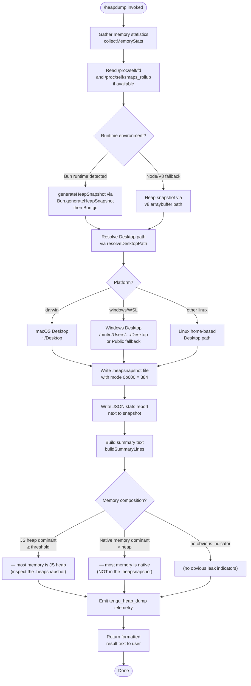

# `/heapdump`

> Analysis basis: CC v2.1.173 bundle.js (AST extraction + Claude interpretation)
> Minimum version: v2.1.173

---

## Overview

`/heapdump` is a hidden developer diagnostic command that captures a JavaScript heap snapshot and a rich memory-statistics report, writing both to the user's Desktop directory. It is designed for debugging memory leaks and unexpected memory growth in the Claude Code process itself (which runs under Bun). The command is non-interactive and can be invoked in headless/non-interactive sessions.

---

## Registration

| Field | Value |
|---|---|
| type | `local` |
| name | `heapdump` |
| description | `Dump the JS heap to ~/Desktop` |
| supportsNonInteractive | `true` |
| isHidden | `true` |
| module_id | `r3K` |
| load_inline | `true` |
| loc_byte | `12828278` |
| loc_byte_end | `12828706` |
| loc_line | `9121` |
| arbor_handler.name | `ll7` |
| arbor_handler.fqn | `claude-2.1.173::ll7` |
| arbor_handler.kind | `AsyncFunction` |
| arbor_handler.resolution_path | `module_id` |
| arbor_handler.n_hits | `0` |

Analysis basis: CC v2.1.173 bundle.js:+12828278

---

## Input Branching

The command has 3+ distinct execution paths depending on the runtime environment (Bun vs. Node/V8), the detected platform (macOS vs. Linux vs. Windows/WSL), and the memory composition (heap-dominant vs. native-dominant vs. no obvious indicator). A Mermaid flowchart is used.



---

## Behavioral Spec

### Main Handler (`heapdumpHandler` / `ll7`)

The top-level handler is an `AsyncFunction` resolved via the `module_id` path (`r3K → ll7`).

Analysis basis: CC v2.1.173 bundle.js:+12827147

```
async function heapdumpHandler(commandContext):
    snapshotResult = await performHeapDump(commandContext)   // WOA
    summaryLines   = buildSummaryLines(snapshotResult)       // nl7
    lines.push("Open the .heapsnapshot in Chrome DevTools → Memory → Load to inspect retainers.")
    lines.push(...summaryLines)
    return { type: "text", content: lines.join("\n") }
```

### Heap Dump Orchestrator (`performHeapDump` / `WOA`)

Analysis basis: CC v2.1.173 bundle.js:+12825809

```
async function performHeapDump(ctx):
    // Step 1: collect memory statistics
    stats = await collectMemoryStats()                     // n3K
    
    // Step 2: resolve output directory
    desktopPath = resolveDesktopPath()                     // SFA
    
    // Step 3: build output filename with timestamp
    outDir  = path.join(desktopPath, ...)                  // POA.join
    
    // Step 4: write JSON stats file
    await fs.writeFile(outDir + "-stats.json",
                       JSON.stringify(stats), { mode: 384 })   // 0o600
    
    // Step 5: write heap snapshot
    writeHeapSnapshot(outDir)                              // cl7
    
    // Step 6: format result for caller (label columns)
    labelTable = formatTable(stats)                        // K
    
    // Step 7: emit telemetry
    emitTelemetry("tengu_heap_dump", ...)                  // loc_byte 12826399
    
    // Step 8: log via structured logger
    structuredLog(result)                                  // SH
    
    return { stats, outDir, labelTable }
```

The `"manual"` literal (loc_byte 12825785) and sentinel `0` (loc_byte 12825796) are passed as the GC-trigger mode for Bun's garbage-collection call, keeping the invocation non-aggressive.

### Memory Statistics Collector (`collectMemoryStats` / `n3K`)

Analysis basis: CC v2.1.173 bundle.js:+12823310

```
async function collectMemoryStats():
    result = {}
    
    // Node/Bun built-ins
    result.memoryUsage      = process.memoryUsage()
    result.heapStatistics   = v8.getHeapStatistics()          // YB8.getHeapStatistics
    result.resourceUsage    = process.resourceUsage()
    result.uptime           = process.uptime()
    result.heapSpaceStats   = v8.getHeapSpaceStatistics()     // YB8.getHeapSpaceStatistics
    result.activeHandles    = process._getActiveHandles().length
    result.activeRequests   = process._getActiveRequests().length
    
    // Linux-specific: open file-descriptor count
    // reads /proc/self/fd directory listing
    try:
        fds = await fs.readdir("/proc/self/fd")               // loc_byte 12823553
        result.openFds = fds.length
    catch:
        result.openFds = null
    
    // Linux-specific: native/RSS memory breakdown from smaps
    try:
        smaps = await fs.readFile("/proc/self/smaps_rollup", "utf8")  // loc_byte 12823616
        result.smaps = parseSmaps(smaps)
    catch:
        result.smaps = null
    
    // Bun JSC heap stats (module "bun:jsc")                  // loc_byte 12823701
    try:
        jsc = require("bun:jsc")
        result.jscHeap = jsc.heapStats()
    catch:
        result.jscHeap = null
    
    // Uptime conversion: seconds → hours, threshold 3600     // loc_byte 12823842
    // Memory unit: bytes → MB via 1048576 divisor            // loc_byte 12823847
    
    // Native-leak heuristic:
    if result.resourceUsage.maxRSS > result.heapStatistics.used_heap_size:
        result.nativeLeakWarning =
          "Native memory > heap - leak may be in native addons (node-pty, sharp, etc.)"
          // loc_byte 12824080
    
    // Platform tag
    if process.platform == "darwin":
        result.platform = "macos"                             // loc_byte 12824934
    
    // Fallback message when no indicator found
    if not anyLeakIndicator(result):
        result.fallbackNote =
          "No obvious leak indicators. Check heap snapshot for retained objects."
          // loc_byte 12825199
    
    return result
```

Key threshold: memory values are formatted with `.toFixed()` clamped at **500** significant units (loc_byte 12824235).

### Desktop Path Resolver (`resolveDesktopPath` / `SFA`)

Analysis basis: CC v2.1.173 bundle.js:+1092294

```
function resolveDesktopPath():
    home = os.homedir()                      // u9_.homedir
    
    platform = detectPlatform()              // s6
    
    if platform == "windows":               // loc_byte 1092365
        // WSL path: /mnt/c/Users/<user>/Desktop
        base = "/mnt/c/Users"              // loc_byte 1092569
        candidates = [home, "Public", "Default", "Default User", "All Users"]
        //            loc_bytes 1092613 1092632 1092652 1092677
        for candidate in candidates:
            p = path.join(base, candidate, "Desktop")
            if exists(p): return p
        // final fallback
        return path.join(home, "Desktop")
    else:
        // macOS and Linux
        return path.join(home, "Desktop")  // loc_byte 1092347
```

### Heap Snapshot Writer (`writeHeapSnapshot` / `cl7`)

Analysis basis: CC v2.1.173 bundle.js:+12826827

```
function writeHeapSnapshot(outputBasePath):
    if isBunRuntime():
        // Bun path: generate snapshot then force GC
        snapshot = Bun.generateHeapSnapshot()       // loc_byte 12826847
        fs.writeFileSync(outputBasePath + ".heapsnapshot",
                         JSON.stringify(snapshot))  // l3K.writeFileSync
        Bun.gc(/* mode= */ false)                   // loc_byte 12826904; Bun.gc
    else:
        // V8 / Node path
        // Uses v8 "arraybuffer" format                loc_byte 12826877
        v8HeapSnapshot(outputBasePath, "v8", "arraybuffer")
                                                    // loc_bytes 12826872, 12826877
```

The auto-trigger label `"auto-1.5GB"` (loc_byte 12826465) appears nearby, suggesting the snapshot format name encodes a 1.5 GB threshold that governs automatic triggers elsewhere, but `/heapdump` always writes unconditionally.

### Summary Line Builder (`buildSummaryLines` / `nl7`)

Analysis basis: CC v2.1.173 bundle.js:+12827522

```
function buildSummaryLines(dumpResult):
    lines = []
    maxWidth = Math.max(...columnWidths)
    
    if dumpResult.stats.heapDominant:
        lines.push("— most memory is JS heap (inspect the .heapsnapshot)")
        // loc_byte 12827590
    else if dumpResult.stats.nativeDominant:
        lines.push("— most memory is native (NOT in the .heapsnapshot)")
        // loc_byte 12827650
    else:
        lines.push("  (no obvious leak indicators)")
        // loc_byte 12827787
    
    // Threshold for heap-dominant classification: 1 GiB = 1073741824 bytes
    // loc_byte 12828196
    
    // Column alignment: groups of 8 chars  loc_byte 12827922
    
    formatHelper(lines, dumpResult)         // h46
    return lines
```

Heap-dominant threshold: **1,073,741,824 bytes (1 GiB)** (loc_byte 12828196).

### Table Formatter (`formatTable` / `K`)

Analysis basis: CC v2.1.173 bundle.js:+16785442

```
function formatTable(stats):
    rows = stats entries.map(([key, val]) => [key, val])
    // pad each label to column width using String.padEnd
    // column separator: "  " (two spaces)  loc_byte 16785476
    // truncate at 40 chars per column      loc_byte 16787447
    return rows.map(r => r[0].padEnd(colWidth) + "  " + r[1]).join("\n")
```

---

## State & Side Effects

| Item | Detail |
|---|---|
| Telemetry | `tengu_heap_dump` (loc_byte 12826399) — fired once per invocation after snapshot is written. Also in call-graph scope (not directly triggered by this command): `tengu_daemon_control`, `tengu_scheduled_task_missed`, `tengu_bg_dispatch_sigkill_escalate`, `tengu_bg_dispatch_low_mem`, `tengu_bg_spare_enable`, `tengu_bg_spare_claim`, `tengu_bg_spare_claim_fail`. |
| File system writes | Two files on Desktop: `<timestamp>.heapsnapshot` (heap snapshot, mode `0o600` = 384) and `<timestamp>-stats.json` (memory stats JSON, same mode). |
| Bun GC side effect | Calls `Bun.gc()` after snapshot generation on Bun runtime; may perturb memory layout post-dump. |
| `/proc` reads | Reads `/proc/self/fd` (loc_byte 12823553) and `/proc/self/smaps_rollup` (loc_byte 12823616) on Linux; silently skipped on macOS/Windows. |
| Structured logging | Result is passed to the internal structured log sink (`SH` / `structuredLog`). |
| appState changes | None observed in depth-2 traversal. |
| Sound | None observed. |
| Hook registration | `y9` calls `yZA.register` (loc_byte 63751) — this is within the file-write subsystem path, not a new UI hook registered by the command itself. |

---

## Version History

| Version | Change |
|---|---|
| v2.1.173 | Initial analysis |

---

## Common Mistakes

1. **Expecting output in the current working directory.** The snapshot is always written to `~/Desktop` (or the resolved Windows Desktop in WSL). There is no flag to redirect output.
2. **Running on a system without a Desktop folder.** On headless Linux servers `~/Desktop` typically does not exist; the command may fail silently or write to an unexpected fallback path. Create `~/Desktop` manually if needed.
3. **Inspecting the `.heapsnapshot` as plain JSON.** The file should be loaded via Chrome DevTools → Memory → "Load" button to get retainer graphs; raw JSON is large and unreadable.
4. **Assuming the snapshot captures native memory.** If the summary reports `"most memory is native (NOT in the .heapsnapshot)"`, the snapshot will not reveal the source; suspect native addons (node-pty, sharp, etc.) in that case (loc_byte 12824080).
5. **Invoking in a non-Bun environment and expecting a `.heapsnapshot` format.** On plain Node the V8 arraybuffer code path is used instead, which produces a different file structure.
6. **Expecting the command to appear in `/help` or autocomplete.** `isHidden: true` suppresses it from all user-visible command lists.

---

## Appendix — Identifier Mapping

> For bundle debugging only. Identifiers change across versions.

| Identifier | Role |
|---|---|
| `ll7` | `heapdumpHandler` — top-level AsyncFunction; main command handler |
| `WOA` | `performHeapDump` — heap dump orchestrator (collects stats, writes files, emits telemetry) |
| `n3K` | `collectMemoryStats` — gathers process.memoryUsage, V8/JSC heap stats, smaps, fd count |
| `cl7` | `writeHeapSnapshot` — Bun vs. V8 snapshot writer |
| `nl7` | `buildSummaryLines` — constructs human-readable memory-classification lines |
| `SFA` | `resolveDesktopPath` — platform-aware Desktop directory resolver |
| `y6` | `platformDetect` (utility) — called from both `WOA` and `n3K` |
| `BG` | `platformUtilHelper` — sub-utility called from `y6` |
| `s6` | `getPlatformString` — returns platform identifier string |
| `N` | `outputFormatter` — formats command output for display |
| `K` | `formatTable` — pads and aligns stat label/value columns |
| `CH` | `jsonStringifyHelper` — wraps `JSON.stringify` |
| `SH` | `structuredLog` — structured log sink with rotation |
| `JA` | `errorStringifier` — wraps Error + String coercion |
| `v3` | `resultWrapper` — wraps result for return |
| `h46` | `summaryFormatHelper` — detail formatter called from `buildSummaryLines` |
| `YB8` | `v8Module` — bound V8 module (provides `getHeapStatistics`, `getHeapSpaceStatistics`) |
| `N46` | `fsModule` — async filesystem module (readdir, readFile, writeFile) |
| `l3K` | `fsSyncModule` — sync filesystem module (writeFileSync for Bun snapshot) |
| `POA` | `pathModule` — path utilities (join) |
| `u9_` | `osModule` — OS utilities (homedir) |
| `o6` | `mkdirHelper` — ensures output directory exists |
| `f6` | `stringCoerce` — coerces values to String |
| `Rq` | `telemetryBatcher` — batches telemetry events |
| `CBA` | `telemetryFormatter` — formats telemetry payload |
| `MRf` | `telemetryQueue` — shift/push queue for telemetry events |
| `i8f` | `fileWriteSink` — buffered file-write sink (used by structured logger) |
| `EFH` | `bufferFlush` — flushes write buffer with timeout/immediate |
| `FfH` | `flushAndRotate` — rotates log file on flush |
| `n8f` | `appendFileWriter` — mkdir + appendFile loop for log rotation |
| `Us8` | `logFileRotator` — stat + rename + unlink for log rotation |
| `DNA` | `buildLogPath` — constructs log file path via path.join |
| `K36` | `mkdirForLog` — mkdir wrapper used in log path setup |
| `y9` | `registerShutdownHook` — registers process exit hook via `yZA.register` |
| `d8f` | `outputRenderer` — renders output to terminal |
| `RZA` | `colorSupport` — checks color capability (`leK`, `neK`) |
| `lf` | `formatLogLine` — formats a single log line with redaction |
| `zNA` | `redactSecrets` — maps over tokens to redact sensitive values |
| `oFH` | `writeToStream` — writes formatted line to output stream |
| `tvA` | `streamWriter` — low-level `H.write` stream wrapper |
| `G` | `uiKeyHandler` — main UI keyboard event dispatcher (unrelated to heapdump core; in call graph via shared utility) |
| `ONK` | `operatorDispatch` — vim-mode operator dispatcher |
| `cvK` | `yankOperator` — vim yank operator |
| `rvK` | `visualReplaceOperator` — vim visual replace operator |
| `svK` | `visualCaseOperator` — vim visual case operator |
| `evK` | `visualPasteOperator` — vim visual paste operator |
| `FvK` | `joinOperator` — vim join operator |
| `gvK` | `indentOperator` — vim indent operator |
| `JXA` | `operatorKeyMap` — maps key sequences to operator functions |
| `D` | `daemonSessionManager` — background session lifecycle manager |
| `P` | `socketProtocolReader` — IPC socket frame reader |
| `S` | `supervisorExecute` — supervisor process executor |
| `H` | `historySearchHandler` — history search UI handler |
| `b` | `registerHandler` — clipboard register get/set handler |
| `f` | `pendingSetTracker` — tracks in-flight async operations |
| `X` | `timeoutSocketWrapper` — socket with configurable timeout |
| `M` | `multiSessionCoordinator` — multi-session state coordinator |
| `q` | `timerWrapper` — setTimeout wrapper |
| `j` | `processKillHelper` — iterates active processes and sends signals |
| `td` | `xyCoordHelper` — XY coordinate utility |

---

Note: index built via Arbor fallback; some signals (telemetry, literals) may be missing — see arbor-fallback.js.